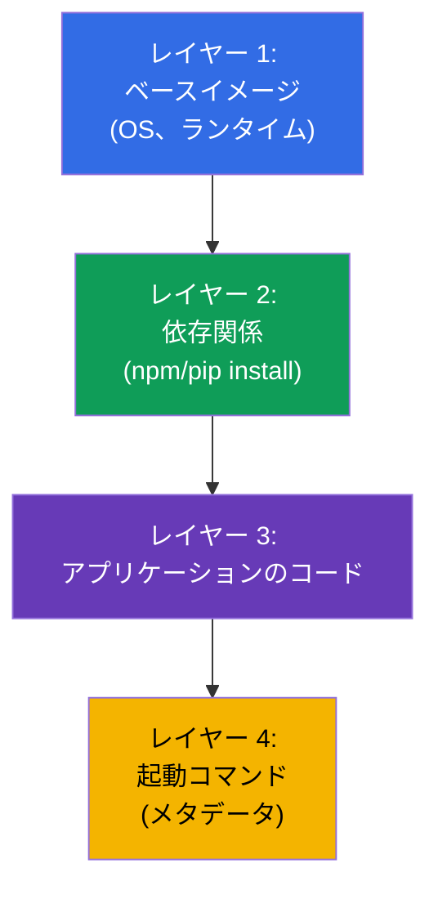
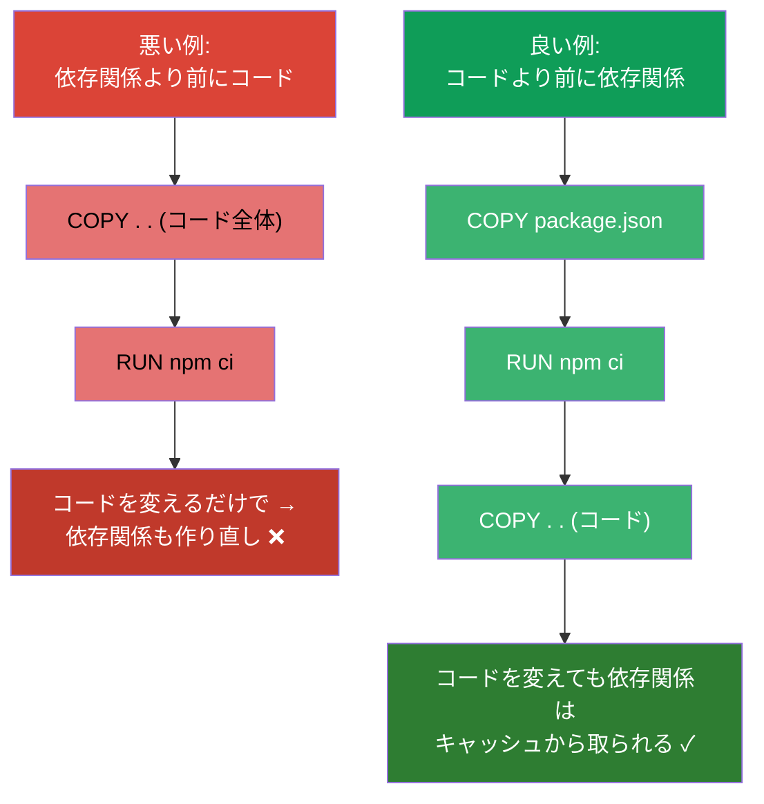
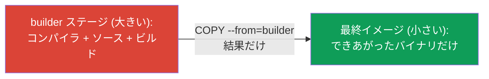
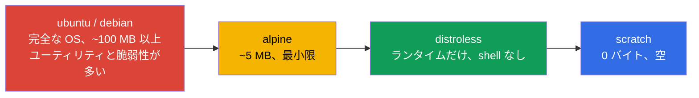
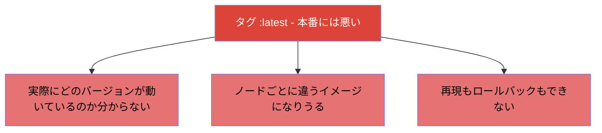

[Русская версия](ru.md) · [Eng version](README.md) · [Versión en español](es.md) · [Version française](fr.md) · [Deutsche Version](de.md) · [ქართული ვერსია](ge.md) · [繁體中文版](tw.md)

# 第 23 章。コンテナイメージ：ビルド、Dockerfile、最適化

> 🟩 **CKAD のための章**（Application Design and Build 領域）。CKA ではイメージの
> ビルドは問われませんが、イメージの理解は誰にとっても役に立ちます。
>
> **次は何か。** 私たちは出来合いのイメージ (`nginx`、`busybox`) からコンテナを
> たくさん起動してきました。ここではイメージが何から構成されているのか、
> Dockerfile からどうビルドするのか、そしてどうやって小さく安全にするのかを
> 見ていきます。CKAD の Design and Build 領域では「イメージを定義し、ビルドし、
> 変更する」能力が問われます。レイヤーと最適化の理解は、ロールアウトの速さ、
> ストレージのコスト、そしてセキュリティに直接影響します。

## 23.1. イメージとレイヤーとは何か

**コンテナイメージ** とは、アプリケーションのファイルシステム、その依存関係、
メタデータ（何を起動するか）をひとまとめにパッケージしたものです。イメージは
**レイヤー (layers)** から構成されます：それぞれのレイヤーは、前のレイヤーの上に
重ねられたファイルシステムの変更の集合です。



レイヤーの重要な性質：

- **レイヤーはキャッシュされ、再利用されます。** ベースのレイヤーが変わっていなければ、
  ビルド時にキャッシュから取られます - ビルドは速く、トラフィックは少なくなります。
- **レイヤーはイメージ間で共有されます。** 2 つのイメージが同じベースを使っているなら、
  そのレイヤーは 1 回だけ保存されます。
- **イメージは不変 (immutable) です。** 起動されたコンテナはイメージの上に薄い
  **書き込み可能レイヤー** を追加します。コンテナを削除すればそれは消えます。
  イメージ自体は変わりません。

## 23.2. Dockerfile：イメージのレシピ

**Dockerfile** はビルド手順を書いたテキストファイルです。それぞれの命令が（通常は）
レイヤーを 1 つ作ります。

```dockerfile
FROM node:20-alpine           # ベースイメージ
WORKDIR /app                  # 作業ディレクトリ
COPY package*.json ./         # まず依存関係 (キャッシュのため)
RUN npm ci --production        # 依存関係のインストール - 独立したレイヤー
COPY . .                      # そのあとにアプリケーションのコード
EXPOSE 3000                   # ポートを文書化する
USER node                     # 非特権ユーザーで起動する
CMD ["node", "server.js"]     # 何を起動するか
```

主な命令：

| 命令 | 用途 |
|-----------|-----------|
| `FROM` | ベースイメージ（何から始めるか） |
| `RUN` | ビルド時にコマンドを実行する（レイヤーを作る） |
| `COPY` / `ADD` | ファイルをイメージにコピーする |
| `WORKDIR` | 作業ディレクトリを指定する |
| `ENV` | イメージ内の環境変数 |
| `EXPOSE` | ポートを文書化する（開けるわけではない） |
| `USER` | どのユーザーで起動するか |
| `ENTRYPOINT` / `CMD` | 何をどんな引数で起動するか（第 17 章） |

## 23.3. 命令の順序とレイヤーのキャッシュ

もっとも重要な実践的スキルは **キャッシュのための正しい命令の順序** です。Docker は
レイヤーを上から下へキャッシュし、最初に変わった命令から先をすべて作り直します。
つまり、めったに変わらないものを上に、よく変わるものを下に置きます。



古典的な手法（上の例に見えています）：まず `COPY package.json` + `RUN install`、
そのあとにコードの `COPY . .`。こうするとコードだけを変えたときに依存関係のレイヤーは
キャッシュから取られ、ビルドは何倍も速くなります。

## 23.4. Multi-stage build：小さなイメージ

大きなイメージはダウンロードが遅く、保管に費用がかかり、脆弱性も多く抱えます。
**Multi-stage build** を使えば、アプリケーションを「太った」イメージ（コンパイラや
ツール入り）でビルドし、最終イメージには結果だけを - 余計なものなしで - 置けます。

```dockerfile
# ビルドのステージ - ここにはコンパイラと必要なものすべてがある
FROM golang:1.22 AS builder
WORKDIR /src
COPY . .
RUN go build -o /app/server .

# 最終ステージ - バイナリだけ、コンパイラなし
FROM alpine:3.20
COPY --from=builder /app/server /server
CMD ["/server"]
```



結果：最終イメージには実行ファイルと最小限の環境だけが入ります - 数百メガバイトの
コンパイラやビルド用の依存関係の代わりに。

## 23.5. ベースイメージの選択：サイズとセキュリティ

ベースイメージがサイズと攻撃面を決めます。「重い」ものから「軽い」ものへの目安：



| ベースイメージ | サイズ | 長所 | 短所 |
|---------------|--------|-------|--------|
| `ubuntu`/`debian` | 大きい | 慣れている、すべて揃っている | 余計なものと脆弱性が多い |
| `alpine` | ~5 MB | コンパクト | libc が別 (musl)、ときに非互換 |
| `distroless` | 小さい | ランタイムだけ、shell なし - より安全 | デバッグが難しい (`sh` がない) |
| `scratch` | 0 | 究極の最小限 | 静的バイナリ (Go) だけに向く |

イメージが小さいほど = ロールアウトが速く、場所を取らず、攻撃面も小さくなります。
distroless/scratch の裏返しは、デバッグ用の `sh` がないことです（ここでは ephemeral
コンテナを使う `kubectl debug` が助けになります、第 29 章）。

## 23.6. イメージのタグと imagePullPolicy

**タグ** はイメージのバージョンを識別します：`nginx:1.27`。別の話題として `latest`
タグとダウンロードのポリシーがあります。



`imagePullPolicy` はいつイメージを取得するかを決めます：

| 値 | ふるまい | デフォルトになるのは |
|----------|-----------|--------------------|
| `IfNotPresent` | ローカルにない場合だけ取得する | 具体的なタグを持つイメージ |
| `Always` | 起動のたびに取得する | `latest` タグ、またはタグなし |
| `Never` | 決して取得しない（ローカルのみ） | - |

本番のルール：**常に具体的なタグ**（できれば不変の digest `@sha256:...`）を使い、
`latest` は使わない。動いているものを確実に把握し、再現できるようにするためです。

## 23.7. イメージのレジストリとプライベートなアクセス

イメージは **レジストリ** に保管されます：Docker Hub、GitHub Container Registry、
クラウド (ECR、GCR、ACR)、プライベート (Harbor)。パブリックなものは認証なしで
取得できますが、プライベートなものには `imagePullSecret` が必要です（第 19 章）：

```bash
kubectl create secret docker-registry regcred \
  --docker-server=registry.example.com \
  --docker-username=user --docker-password=pass
```

```yaml
spec:
  imagePullSecrets:
  - name: regcred
  containers:
  - name: app
    image: registry.example.com/myapp:1.0
```

Pod が `ImagePullBackOff` に落ちる場合（第 4 章）、原因はたいていここにあります：
名前/タグのタイプミス、プライベートレジストリへのアクセスがない、または
imagePullSecret がない。

## 23.8. 本番環境でこれをどう使うか

- **小さなイメージが標準。** 本番では最小限のイメージを目指します (multi-stage +
  alpine/distroless)：ロールアウトとオートスケーリングが速くなり、保管とトラフィックの
  コストが下がり、脆弱性も減ります。巨大なイメージは配信パイプライン全体を遅くします。
- **不変のタグ/digest。** 本番は具体的なバージョンまたは digest でデプロイし、`latest`
  では行いません - そうでないと実際に何が動いているのか分からず、インシデントの再現も
  ロールバックもできません。
- **脆弱性のスキャン。** CI でイメージをスキャナ (Trivy、Grype) に通し、重大な CVE が
  あればデプロイを禁止します。ベースイメージが小さいほど = 検出も少なくなります。
- **イメージ内での non-root。** Dockerfile で（非特権の）`USER` を指定し、アプリケーションが
  root で動かないようにします（SecurityContext と関係します、第 20 章）。
- **プライベートレジストリと署名。** 本番イメージはプライベートレジストリに保管し、
  しばしば署名し (cosign)、受け入れ時 (admission) に署名を検証して、知らないイメージが
  クラスタに入らないようにします。

## 23.9. ミニ用語集

- **イメージ (image)** - パッケージされたアプリケーションの FS + 依存関係 + 起動のメタデータ。
- **レイヤー (layer)** - FS の変更の集合。レイヤーはキャッシュされ再利用されます。
- **Dockerfile** - イメージのビルド手順。
- **Base image** - ビルドの出発点となるベースイメージ (`FROM`)。
- **Multi-stage build** - 1 つのイメージでビルドし、最終には結果だけを置くこと。
- **distroless / scratch** - 余計なもののない/空の、最小限のベースイメージ。
- **タグ / digest** - イメージのバージョン / 内容の不変なハッシュ。
- **imagePullPolicy** - いつイメージを取得するか (IfNotPresent/Always/Never)。
- **レジストリ** - イメージの保管場所。プライベートなものは imagePullSecret が必要です。

## 23.10. 本章のまとめ

- イメージはキャッシュされ再利用されるレイヤーから構成されます。イメージは不変で、
  コンテナは薄い書き込み可能レイヤーを追加するだけです。
- Dockerfile はビルドのレシピです。主な命令：FROM、RUN、COPY、WORKDIR、ENV、USER、
  ENTRYPOINT/CMD。
- 命令の順序はキャッシュにとって重要です：めったに変わらないものを上、コードを下に
  （依存関係はコードの COPY より前に）。
- Multi-stage build は小さな最終イメージをもたらします（結果だけ、ビルドのツールなし）。
- ベースイメージはサイズ/セキュリティで選びます：ubuntu → alpine → distroless → scratch。
- 本番では具体的なタグ/digest を使い、`latest` は使いません。`imagePullPolicy` が
  ダウンロードを制御します。
- プライベートレジストリには imagePullSecret が必要です。アクセスのエラー → ImagePullBackOff。

## 23.11. これがどう役に立つか：試験と実際の仕事で

**試験では (CKAD)。** Design and Build 領域はイメージを扱う能力を確認します：Dockerfile を
理解する、コマンド/ユーザーを指定する、タグと imagePullPolicy を把握する、
ImagePullBackOff を診断する。ビルド自体を試験で行うことはまれですが、イメージの理解は
多くの問題で必要になります。

**実際の仕事では。** イメージのサイズと構造は、配信の速さ、コスト、セキュリティに
直接影響します。Multi-stage、最小限のベースイメージ、不変のタグ、スキャン、non-root は
成熟したパイプラインの標準です。レイヤーとキャッシュの理解はビルドを何倍も速くします。

## 23.12. 自己チェックの質問

1. イメージは何から構成され、なぜレイヤーはキャッシュされ再利用されるのですか？
2. なぜ `COPY package.json` + install は、コード全体の `COPY` より前に置くべきなのですか？
3. multi-stage build は何をもたらし、どうやって最終イメージを小さくするのですか？
4. distroless/scratch はなぜ ubuntu より安全で、どんな短所がありますか？
5. なぜ `latest` は本番に向かない選択なのですか？代わりに何を使いますか？
6. `imagePullPolicy` はイメージのタグとどう関係しますか？
7. プライベートレジストリからイメージを取得するには何が必要で、なぜ ImagePullBackOff が
   起きるのですか？

## 演習

私たちはコンテナが何から作られているのかを見てきました。第 24 章は第 4 部の最後の
テーマ：アプリケーションのためのボリューム (emptyDir とエフェメラル) で、これは
すでにパターンの中で触れられていました。イメージの操作はアプリケーション設計の
ラボで練習します。

🧪 ラボ 107（コンテナイメージ）：[tasks/cka/labs/107](../../labs/107/README_JP.MD)

---
[目次](../README_JP.md) · [第 22 章](../22/jp.md) · [第 24 章](../24/jp.md)
