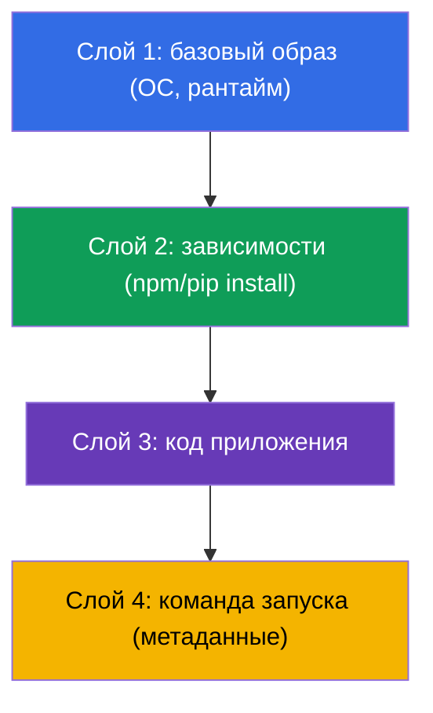
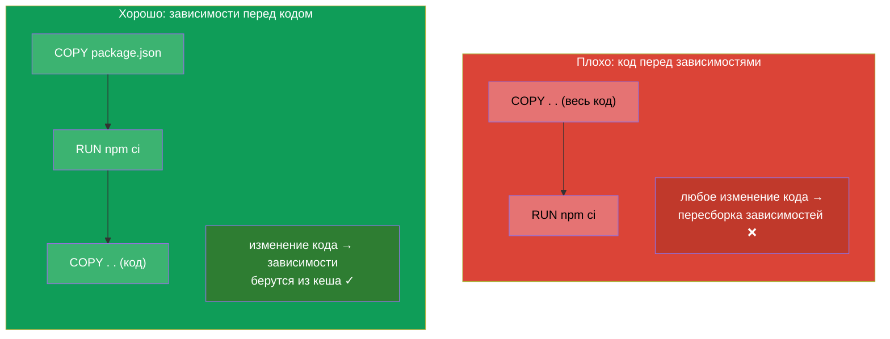
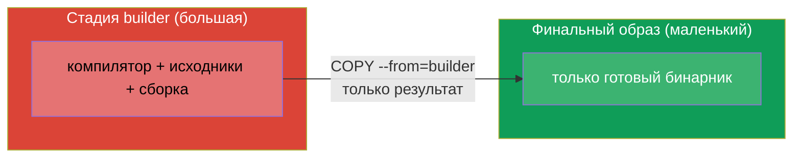
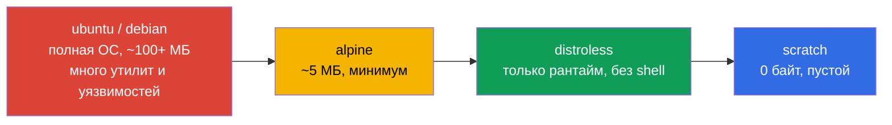
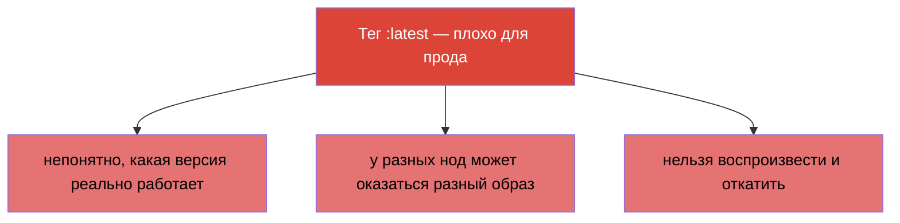

# Глава 23. Образы контейнеров: сборка, Dockerfile, оптимизация

> 🟩 **Глава для CKAD** (домен Application Design and Build). На CKA сборка образов не
> спрашивается, но понимание образов полезно всем.
>
> **Что дальше.** Мы много запускали контейнеры из готовых образов (`nginx`, `busybox`).
> Теперь разберёмся, из чего образ состоит, как его собрать из Dockerfile и как сделать
> маленьким и безопасным. CKAD в домене Design and Build проверяет умение «определить,
> собрать и модифицировать образ». Понимание слоёв и оптимизации напрямую влияет на
> скорость выката, стоимость хранения и безопасность.

## 23.1. Что такое образ и слои

**Образ контейнера** - это упакованные вместе файловая система приложения, его
зависимости и метаданные (что запускать). Образ состоит из **слоёв (layers)**: каждый
слой - это набор изменений файловой системы, наложенный поверх предыдущего.



Ключевые свойства слоёв:

- **Слои кешируются и переиспользуются.** Если базовый слой не менялся, при сборке он
  берётся из кеша - быстрее сборка и меньше трафика.
- **Слои общие между образами.** Если два образа основаны на одном базовом, слой хранится
  один раз.
- **Образ неизменяем (immutable).** Запущенный контейнер добавляет поверх образа тонкий
  **записываемый слой**; при удалении контейнера он исчезает. Сам образ не меняется.

## 23.2. Dockerfile: рецепт образа

**Dockerfile** - текстовый файл с инструкциями сборки. Каждая инструкция (обычно) создаёт
слой.

```dockerfile
FROM node:20-alpine           # базовый образ
WORKDIR /app                  # рабочий каталог
COPY package*.json ./         # сначала зависимости (для кеша)
RUN npm ci --production        # установка зависимостей — отдельный слой
COPY . .                      # затем код приложения
EXPOSE 3000                   # документирует порт
USER node                     # запуск от непривилегированного пользователя
CMD ["node", "server.js"]     # что запускать
```

Основные инструкции:

| Инструкция | Назначение |
|-----------|-----------|
| `FROM` | базовый образ (с чего начать) |
| `RUN` | выполнить команду при сборке (создаёт слой) |
| `COPY` / `ADD` | скопировать файлы в образ |
| `WORKDIR` | задать рабочий каталог |
| `ENV` | переменная окружения в образе |
| `EXPOSE` | задокументировать порт (не открывает его) |
| `USER` | от какого пользователя запускать |
| `ENTRYPOINT` / `CMD` | что и с какими аргументами запускать (глава 17) |

## 23.3. Порядок инструкций и кеш слоёв

Важнейший практический навык - **правильный порядок инструкций ради кеша**. Docker
кеширует слои сверху вниз и пересобирает всё, начиная с первой изменившейся инструкции.
Значит, редко меняющееся кладут выше, часто меняющееся - ниже.



Классический приём (виден в примере выше): сначала `COPY package.json` + `RUN install`,
потом `COPY . .` с кодом. Тогда при изменении только кода слой зависимостей берётся из
кеша, и сборка идёт в разы быстрее.

## 23.4. Multi-stage build: маленькие образы

Большие образы медленно тянутся, дорого хранятся и несут больше уязвимостей.
**Multi-stage build** позволяет собрать приложение в «жирном» образе (с компилятором,
инструментами), а в финальный образ положить только результат - без лишнего.

```dockerfile
# Стадия сборки — тут есть компилятор и всё нужное
FROM golang:1.22 AS builder
WORKDIR /src
COPY . .
RUN go build -o /app/server .

# Финальная стадия — только бинарник, без компилятора
FROM alpine:3.20
COPY --from=builder /app/server /server
CMD ["/server"]
```



Результат: финальный образ содержит только исполняемый файл и минимум окружения - вместо
сотен мегабайт компилятора и зависимостей сборки.

## 23.5. Выбор базового образа: размер и безопасность

Базовый образ определяет размер и поверхность атаки. Ориентир от «тяжёлого» к «лёгкому»:



| Базовый образ | Размер | Плюсы | Минусы |
|---------------|--------|-------|--------|
| `ubuntu`/`debian` | большой | привычно, всё есть | много лишнего, уязвимостей |
| `alpine` | ~5 МБ | компактный | другая libc (musl), иногда несовместимость |
| `distroless` | маленький | только рантайм, нет shell - безопаснее | сложнее отлаживать (нет `sh`) |
| `scratch` | 0 | абсолютный минимум | подходит только статичным бинарникам (Go) |

Меньший образ = быстрее выкат, меньше места, меньше поверхность атаки. Обратная сторона
distroless/scratch - отсутствие `sh` для отладки (тут выручает `kubectl debug` с
ephemeral-контейнерами, глава 29).

## 23.6. Тег образа и imagePullPolicy

**Тег** идентифицирует версию образа: `nginx:1.27`. Отдельная тема - тег `latest` и
политика скачивания.



`imagePullPolicy` определяет, когда тянуть образ:

| Значение | Поведение | По умолчанию когда |
|----------|-----------|--------------------|
| `IfNotPresent` | тянуть, только если нет локально | для образов с конкретным тегом |
| `Always` | тянуть при каждом старте | для тега `latest` или без тега |
| `Never` | никогда не тянуть (только локальный) | - |

Правило прода: **всегда конкретный тег** (лучше - неизменяемый digest `@sha256:...`),
никогда `latest`, чтобы точно знать и воспроизводить, что запущено.

## 23.7. Реестры образов и приватный доступ

Образы хранятся в **реестрах**: Docker Hub, GitHub Container Registry, облачные (ECR,
GCR, ACR), приватные (Harbor). Публичные тянутся без аутентификации, для приватных нужен
`imagePullSecret` (глава 19):

```bash
kubectl create secret docker-registry regcred \
  --docker-server=registry.example.com \
  --docker-username=user --docker-password=pass
```

```yaml
spec:
  imagePullSecrets:
  - name: regcred
  containers:
  - name: app
    image: registry.example.com/myapp:1.0
```

Если под падает в `ImagePullBackOff` (глава 4) - причина обычно тут: опечатка в
имени/теге, нет доступа к приватному реестру или отсутствует imagePullSecret.

## 23.8. Как это применяют в продакшене

- **Маленькие образы - норма.** В проде стремятся к минимальным образам (multi-stage +
  alpine/distroless): быстрее выкат и автоскейлинг, меньше стоимость хранения и трафика,
  меньше уязвимостей. Огромные образы замедляют весь конвейер доставки.
- **Неизменяемые теги/digest.** Прод разворачивают по конкретной версии или digest, а не
  по `latest` - иначе непонятно, что реально работает, и невозможно воспроизвести
  инцидент или откатиться.
- **Сканирование уязвимостей.** Образы в CI прогоняют через сканеры (Trivy, Grype) и
  запрещают деплой с критичными CVE. Меньший базовый образ = меньше находок.
- **Non-root в образе.** В Dockerfile задают `USER` (непривилегированного), чтобы
  приложение не работало от root (перекликается с SecurityContext, глава 20).
- **Приватные реестры и подпись.** Прод-образы хранят в приватных реестрах, часто
  подписывают (cosign) и проверяют подпись при допуске (admission), чтобы в кластер не
  попал неизвестный образ.

## 23.9. Мини-глоссарий

- **Образ (image)** - упакованная ФС приложения + зависимости + метаданные запуска.
- **Слой (layer)** - набор изменений ФС; слои кешируются и переиспользуются.
- **Dockerfile** - инструкции сборки образа.
- **Base image** - базовый образ (`FROM`), с которого начинается сборка.
- **Multi-stage build** - сборка в одном образе, финал - только результат.
- **distroless / scratch** - минимальные базовые образы без лишнего/пустой.
- **Тег / digest** - версия образа / неизменяемый хеш содержимого.
- **imagePullPolicy** - когда тянуть образ (IfNotPresent/Always/Never).
- **Реестр** - хранилище образов; приватный требует imagePullSecret.

## 23.10. Итоги главы

- Образ состоит из кешируемых переиспользуемых слоёв; образ неизменяем, контейнер лишь
  добавляет тонкий записываемый слой.
- Dockerfile - рецепт сборки; ключевые инструкции: FROM, RUN, COPY, WORKDIR, ENV, USER,
  ENTRYPOINT/CMD.
- Порядок инструкций важен для кеша: редко меняющееся выше, код ниже (зависимости - до
  COPY кода).
- Multi-stage build даёт маленький финальный образ (только результат, без инструментов
  сборки).
- Базовый образ выбирают по размеру/безопасности: ubuntu → alpine → distroless → scratch.
- В проде - конкретный тег/digest, не `latest`; `imagePullPolicy` управляет скачиванием.
- Приватные реестры требуют imagePullSecret; ошибки доступа → ImagePullBackOff.

## 23.11. Как это пригодится: на экзамене и в реальной работе

**На экзамене (CKAD).** Домен Design and Build проверяет умение работать с образами:
понять Dockerfile, задать команду/пользователя, разобраться с тегами и imagePullPolicy,
диагностировать ImagePullBackOff. Хотя саму сборку на экзамене делают редко, понимание
образов нужно для многих заданий.

**В реальной работе.** Размер и структура образа напрямую влияют на скорость доставки,
стоимость и безопасность. Multi-stage, минимальные базовые образы, неизменяемые теги,
сканирование и non-root - стандарт зрелого конвейера. Понимание слоёв и кеша ускоряет
сборку в разы.

## 23.12. Вопросы для самопроверки

1. Из чего состоит образ и почему слои кешируются и переиспользуются?
2. Почему `COPY package.json` + install стоит делать до `COPY` всего кода?
3. Что даёт multi-stage build и как он уменьшает финальный образ?
4. Чем distroless/scratch безопаснее ubuntu и какие у них минусы?
5. Почему `latest` - плохой выбор для прода? Что использовать вместо него?
6. Как `imagePullPolicy` связана с тегом образа?
7. Что нужно, чтобы тянуть образ из приватного реестра, и почему возникает
   ImagePullBackOff?

## Практика

Мы разобрали, из чего сделан контейнер. В главе 24 - последняя тема части 4: тома для
приложений (emptyDir и эфемерные), которые уже упоминались в паттернах. Работа с образами
отрабатывается в лабах по дизайну приложений.

🧪 Лаба 107 (образы контейнеров): [tasks/cka/labs/107](../../labs/107/README_RU.MD)

---
[Оглавление](../README_RU.md) · [Глава 22](../22/ru.md) · [Глава 24](../24/ru.md)
