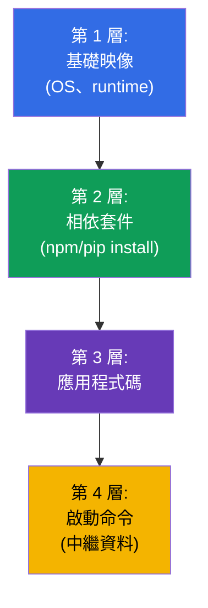
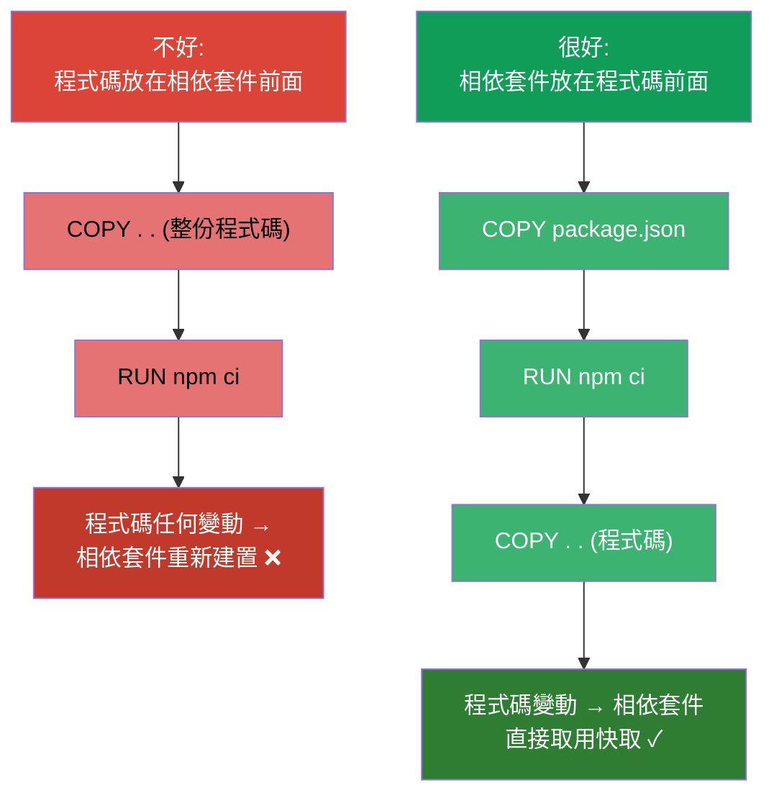
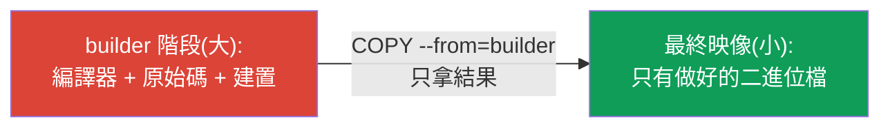
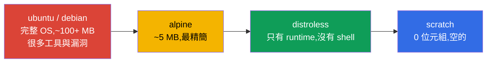
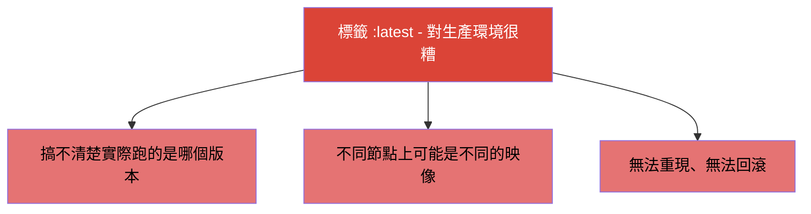

[Русская версия](ru.md) · [Eng version](README.md) · [Versión en español](es.md) · [Version française](fr.md) · [Deutsche Version](de.md) · [ქართული ვერსია](ge.md) · [日本語版](jp.md)

# 第 23 章。容器映像:建置、Dockerfile、最佳化

> 🟩 **本章屬於 CKAD**(Application Design and Build 領域)。CKA 不會考映像建置,
> 但理解映像對每個人都有好處。
>
> **接下來要講什麼。** 我們已經用現成映像 (`nginx`、`busybox`) 啟動過很多容器。
> 現在來拆解映像由什麼組成、如何用 Dockerfile 建置它,以及怎麼把它做得又小又
> 安全。CKAD 的 Design and Build 領域會檢查「定義、建置與修改映像」的能力。理解
> 分層與最佳化會直接影響部署速度、儲存成本與安全性。

## 23.1. 什麼是映像與分層

**容器映像** 就是把應用程式的檔案系統、它的相依套件與中繼資料(要執行什麼)
打包在一起。映像由 **層 (layers)** 組成:每一層都是一組檔案系統變更,疊在前一層
之上。



分層的關鍵性質:

- **層會被快取並重複使用。** 如果基礎層沒有變動,建置時就直接從快取取用 - 建置
  更快,流量更少。
- **層可以在多個映像之間共用。** 如果兩個映像基於同一個基礎映像,該層只會存
  一份。
- **映像是不可變的 (immutable)。** 執行中的容器會在映像之上加一層薄薄的
  **可寫層**;刪掉容器時它就消失。映像本身不會改變。

## 23.2. Dockerfile:映像的配方

**Dockerfile** 是含有建置指令的文字檔。每一條指令(通常)都會產生一層。

```dockerfile
FROM node:20-alpine           # 基礎映像
WORKDIR /app                  # 工作目錄
COPY package*.json ./         # 先放相依套件(為了快取)
RUN npm ci --production        # 安裝相依套件 - 獨立的一層
COPY . .                      # 然後才是應用程式碼
EXPOSE 3000                   # 記錄埠號
USER node                     # 以非特權使用者執行
CMD ["node", "server.js"]     # 要執行什麼
```

主要指令:

| 指令 | 用途 |
|-----------|-----------|
| `FROM` | 基礎映像(從什麼開始) |
| `RUN` | 建置時執行命令(會產生一層) |
| `COPY` / `ADD` | 把檔案複製進映像 |
| `WORKDIR` | 設定工作目錄 |
| `ENV` | 映像中的環境變數 |
| `EXPOSE` | 記錄埠號(並不會真的開啟它) |
| `USER` | 以哪個使用者身分執行 |
| `ENTRYPOINT` / `CMD` | 執行什麼、帶哪些參數(第 17 章) |

## 23.3. 指令順序與層快取

最重要的實務技巧就是 **為了快取而安排正確的指令順序**。Docker 由上到下快取各層,
並從第一條有變動的指令開始重新建置後面所有內容。也就是說,很少變動的放上面,
經常變動的放下面。



經典手法(上面的例子就看得到):先 `COPY package.json` + `RUN install`,之後才
`COPY . .` 放程式碼。這樣只改程式碼時,相依套件那一層會從快取取用,建置速度快上
好幾倍。

## 23.4. Multi-stage build:小映像

大映像拉取慢、儲存貴,而且帶著更多漏洞。**Multi-stage build** 讓你在一個「肥大」的
映像裡(有編譯器、有各種工具)建置應用程式,而最終映像只放結果 - 沒有多餘東西。

```dockerfile
# 建置階段 - 這裡有編譯器和所有需要的東西
FROM golang:1.22 AS builder
WORKDIR /src
COPY . .
RUN go build -o /app/server .

# 最終階段 - 只有二進位檔,沒有編譯器
FROM alpine:3.20
COPY --from=builder /app/server /server
CMD ["/server"]
```



結果:最終映像只含執行檔與最少的環境 - 而不是好幾百 MB 的編譯器與建置相依套件。

## 23.5. 基礎映像的選擇:大小與安全

基礎映像決定了大小與攻擊面。從「重」到「輕」的參考順序:



| 基礎映像 | 大小 | 優點 | 缺點 |
|---------------|--------|-------|--------|
| `ubuntu`/`debian` | 大 | 熟悉,什麼都有 | 多餘東西與漏洞很多 |
| `alpine` | ~5 MB | 精簡 | 換了 libc (musl),有時會不相容 |
| `distroless` | 小 | 只有 runtime,沒有 shell - 更安全 | 除錯比較難(沒有 `sh`) |
| `scratch` | 0 | 絕對最小 | 只適合靜態二進位檔 (Go) |

映像越小 = 部署越快、佔用空間越少、攻擊面越小。distroless/scratch 的另一面是沒有
`sh` 可以除錯(這時就靠帶 ephemeral 容器的 `kubectl debug`,第 29 章)。

## 23.6. 映像標籤與 imagePullPolicy

**標籤 (tag)** 標識映像的版本:`nginx:1.27`。另一個獨立的話題是 `latest` 標籤與
下載政策。



`imagePullPolicy` 決定何時拉取映像:

| 值 | 行為 | 什麼時候是預設 |
|----------|-----------|--------------------|
| `IfNotPresent` | 只在本機沒有時才拉 | 帶具體標籤的映像 |
| `Always` | 每次啟動都拉 | 標籤為 `latest` 或沒有標籤時 |
| `Never` | 永不拉取(只用本機的) | - |

生產環境的原則:**永遠用具體標籤**(更好的是不可變的 digest `@sha256:...`),
絕不用 `latest`,這樣才能確切知道並重現跑的是什麼。

## 23.7. 映像 registry 與私有存取

映像存放在 **registry** 中:Docker Hub、GitHub Container Registry、雲端的
(ECR、GCR、ACR)、私有的 (Harbor)。公開的不需認證就能拉,私有的需要
`imagePullSecret`(第 19 章):

```bash
kubectl create secret docker-registry regcred \
  --docker-server=registry.example.com \
  --docker-username=user --docker-password=pass
```

```yaml
spec:
  imagePullSecrets:
  - name: regcred
  containers:
  - name: app
    image: registry.example.com/myapp:1.0
```

如果 Pod 掉進 `ImagePullBackOff`(第 4 章)- 原因通常就在這裡:名稱/標籤打錯、
沒有私有 registry 的存取權,或是缺少 imagePullSecret。

## 23.8. 生產環境中怎麼用

- **小映像是常態。** 生產環境會盡量追求最小的映像 (multi-stage + alpine/distroless):
  部署與自動擴縮更快、儲存與流量成本更低、漏洞更少。巨大的映像會拖慢整條交付管線。
- **不可變的標籤/digest。** 生產環境按具體版本或 digest 部署,而不是按 `latest` -
  否則搞不清楚實際跑的是什麼,也無法重現事故或回滾。
- **漏洞掃描。** CI 裡會用掃描器 (Trivy、Grype) 跑過映像,並禁止帶著重大 CVE 的
  部署。基礎映像越小 = 掃出來的問題越少。
- **映像裡用 non-root。** Dockerfile 中會設定 `USER`(非特權使用者),讓應用程式
  不以 root 執行(與 SecurityContext 呼應,第 20 章)。
- **私有 registry 與簽章。** 生產映像存放在私有 registry,常常會簽章 (cosign),
  並在准入 (admission) 時驗證簽章,避免不明映像進入叢集。

## 23.9. 小辭典

- **映像 (image)** - 打包好的應用程式檔案系統 + 相依套件 + 啟動中繼資料。
- **層 (layer)** - 一組檔案系統變更;層會被快取並重複使用。
- **Dockerfile** - 建置映像的指令。
- **Base image** - 基礎映像 (`FROM`),建置從它開始。
- **Multi-stage build** - 在一個映像裡建置,最終只留結果。
- **distroless / scratch** - 沒有多餘東西的最小基礎映像 / 空映像。
- **標籤 / digest** - 映像的版本 / 內容的不可變雜湊值。
- **imagePullPolicy** - 何時拉取映像 (IfNotPresent/Always/Never)。
- **Registry** - 映像的儲存庫;私有的需要 imagePullSecret。

## 23.10. 本章總結

- 映像由可快取、可重複使用的層組成;映像不可變,容器只是在上面加一層薄薄的
  可寫層。
- Dockerfile 是建置配方;關鍵指令有 FROM、RUN、COPY、WORKDIR、ENV、USER、
  ENTRYPOINT/CMD。
- 指令順序對快取很重要:很少變動的放上面,程式碼放下面(相依套件要在 COPY
  程式碼之前)。
- Multi-stage build 帶來小巧的最終映像(只有結果,沒有建置工具)。
- 基礎映像按大小/安全來挑:ubuntu → alpine → distroless → scratch。
- 生產環境用具體標籤/digest,不用 `latest`;`imagePullPolicy` 控制下載行為。
- 私有 registry 需要 imagePullSecret;存取出錯 → ImagePullBackOff。

## 23.11. 這些知識用在哪:考試與實際工作

**在考試上 (CKAD)。** Design and Build 領域會檢查處理映像的能力:讀懂 Dockerfile、
設定命令/使用者、搞清楚標籤與 imagePullPolicy、診斷 ImagePullBackOff。雖然考試上
很少真的做建置,但很多題目都需要對映像的理解。

**在實際工作中。** 映像的大小與結構直接影響交付速度、成本與安全性。Multi-stage、
最小的基礎映像、不可變標籤、掃描與 non-root 是成熟管線的標準配備。理解分層與快取
能讓建置快上好幾倍。

## 23.12. 自我檢查問題

1. 映像由什麼組成,為什麼層會被快取與重複使用?
2. 為什麼 `COPY package.json` + install 值得放在 `COPY` 整份程式碼之前?
3. Multi-stage build 帶來什麼,它是怎麼縮小最終映像的?
4. distroless/scratch 為什麼比 ubuntu 安全,它們有什麼缺點?
5. 為什麼 `latest` 對生產環境是糟糕的選擇?該用什麼取代它?
6. `imagePullPolicy` 和映像標籤有什麼關聯?
7. 要從私有 registry 拉映像需要什麼,ImagePullBackOff 又是怎麼出現的?

## 實踐

我們拆解了容器是用什麼做出來的。第 24 章是第 4 部分的最後一個主題:給應用程式用的
卷 (emptyDir 與 ephemeral),它們在各種模式裡已經提到過。映像的操作會在應用程式設計
相關的實驗中操練。

🧪 實驗 107(容器映像):[tasks/cka/labs/107](../../labs/107/README_TW.MD)

🎮 Killercoda（在瀏覽器中，無需安裝）：[Create Dockerfile with Args and Run](https://killercoda.com/chadmcrowell/course/ckad/dockerfile) · [Create a custom nginx container image](https://killercoda.com/chadmcrowell/course/ckad/nginx-custom)

---
[目錄](../README_TW.md) · [第 22 章](../22/tw.md) · [第 24 章](../24/tw.md)
