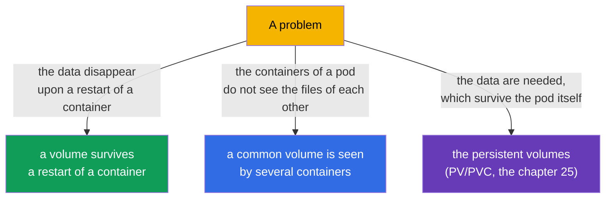
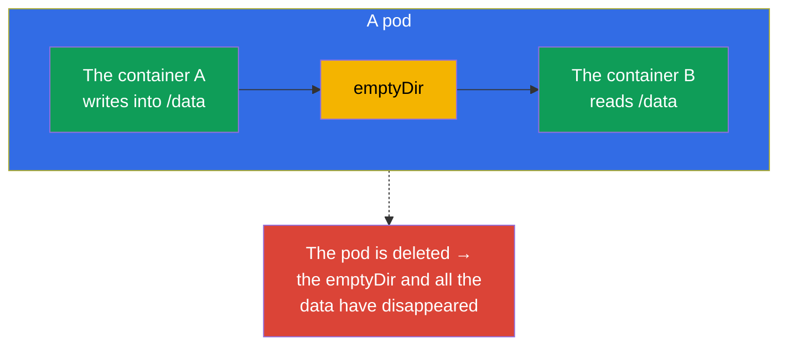
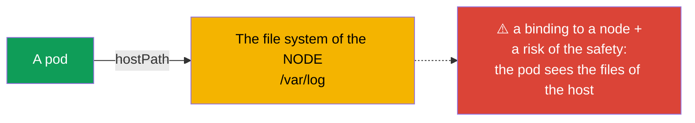
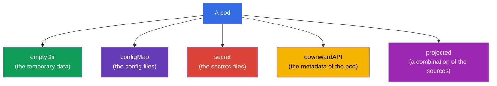
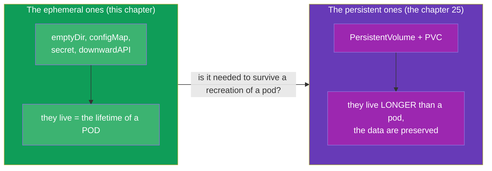

[Русская версия](ru.md) · [Versión en español](es.md) · [Version française](fr.md) · [Deutsche Version](de.md) · [ქართული ვერსია](ge.md) · [繁體中文版](tw.md) · [日本語版](jp.md)

# Chapter 24. The volumes for the applications: an emptyDir and the ephemeral volumes

> **What comes next.** We are finishing the part 4. We have already met the volumes: a common volume for
> the multi-container patterns (the chapter 22), a writable directory upon a read-only root (the chapter 20),
> a mounting of a ConfigMap/Secret (the chapters 18-19). It is time to figure out the volumes systematically, beginning
> with the **ephemeral** ones - those, which live together with a pod. This is a step towards a persistent storage
> (PV/PVC, the chapter 25). The topic relates to the CKAD (Design and Build) and to a general understanding of the
> storage on the CKA.

## 24.1. What the volumes are needed for

By default the file system of a container is **ephemeral and isolated**: a container
has restarted - the files written by it have disappeared; there are several containers in a pod - they do not see
the files of each other. The volumes (volumes) solve both problems:



The key watershed is **the lifetime of the data**:

- **the ephemeral volumes** live as long as a **pod** does (not a container!). They survive a restart
  of a container, a deletion of the pod - no.
- **the persistent volumes** (PV/PVC) live **longer than a pod** - the data are preserved, even when a
  pod has been recreated or deleted (the chapter 25).

This chapter is about the ephemeral ones.

## 24.2. How a volume is connected to a container

The mechanics are always the same: a volume is declared at the level of a **pod** (`spec.volumes`), and it is mounted
into a container through the `volumeMounts`.


```yaml
spec:
  containers:
  - name: app
    image: nginx
    volumeMounts:
    - name: cache          # a reference to the volume by the name
      mountPath: /tmp/cache
  volumes:
  - name: cache            # a declaration of the volume
    emptyDir: {}
```

One volume can be mounted into several containers - this way they share the data (the basis
of the patterns from the chapter 22).

## 24.3. An emptyDir: a temporary common directory

An **emptyDir** is the most frequent ephemeral volume. It is created empty upon the start of a pod on a node and
is deleted together with the pod. It lives, while the pod is on this node.



What an emptyDir is used for:

- **an exchange of the data between the containers of a pod** (a sidecar writes/reads the logs - the chapter 22);
- **a temporary cache, a scratch directory** for the intermediate data;
- **a writable directory** upon a `readOnlyRootFilesystem: true` (the chapter 20) - for example,
  to mount an emptyDir into `/tmp`.

An emptyDir can be placed in the memory (it is faster, but it occupies the RAM of the pod):

```yaml
  volumes:
  - name: cache
    emptyDir:
      medium: Memory       # the volume in the operative memory (tmpfs)
      sizeLimit: 128Mi
```

> **It is important.** A `medium: Memory` spends the memory of a node and is counted in the limits of a pod -
> a big tmpfs may lead to an eviction. It is useful for a fast cache, but with a glance at the
> memory.

## 24.4. A hostPath: a directory of a node (carefully)

A **hostPath** mounts into a pod a directory/a file **from the node itself**. This is already not an isolated volume -
the pod gets an access to the file system of the host.

```yaml
  volumes:
  - name: host-logs
    hostPath:
      path: /var/log
      type: Directory
```



A hostPath is justified only for the system tasks (the agents, which need an access to the logs/the sockets
of a node - usually in a DaemonSet, the chapter 11). For the applications this is an **antipattern**: the data are bound
to a concrete node (a pod has moved - there are no data), plus this is a hole in the safety (an access to the FS
of the host). On the CKS a hostPath is a frequent topic of the prohibitions through the policies.

## 24.5. The other ephemeral volumes

Some volumes, which you have already seen, are also the ephemeral ones (they live with a pod):

| The volume | The purpose | The chapter |
|-----|-----------|-------|
| `emptyDir` | an empty temporary directory, an exchange between the containers | this one |
| `configMap` | the keys of a ConfigMap as the files | 18 |
| `secret` | the keys of a Secret as the files | 19 |
| `downwardAPI` | the information about a pod as the files | 17 |
| `projected` | several sources (secret+configMap+downwardAPI) in one volume | - |



All of them are mounted in the same way (through the `volumes` + the `volumeMounts`) and disappear together with a
pod - this is what makes them akin and distinguishes them from the PV/PVC.

## 24.6. The ephemeral against the persistent: a bridge to the chapter 25

The summary on the lifetime of the data is the key thought before the next chapter:



A simple rule of the choice: if it is not a pity to lose the data upon a recreation of a pod (a cache, an exchange
between the containers, a temp) - an ephemeral volume. If the data have to survive a pod (a DB, the uploads
of the users) - a persistent storage (PV/PVC, the chapter 25).

## 24.7. A practical case: to create, to look, to mount, to delete

Let us take apart a full cycle of the work with an ephemeral volume by the example of an emptyDir, common for two
containers of a pod.

**1. To create a pod with a volume and to mount it into two containers.**

```yaml
apiVersion: v1
kind: Pod
metadata:
  name: shared-vol
spec:
  containers:
  - name: writer
    image: busybox
    command: ["sh", "-c", "echo hello > /data/msg && sleep 3600"]
    volumeMounts:
    - name: shared
      mountPath: /data
  - name: reader
    image: busybox
    command: ["sh", "-c", "sleep 3600"]
    volumeMounts:
    - name: shared
      mountPath: /data
      readOnly: true
  volumes:
  - name: shared
    emptyDir: {}
```

```bash
kubectl apply -f shared-vol.yaml
```

**2. To look at the volumes of a pod.**

```bash
# the volume and the points of the mounting - in the describe (the sections Volumes and Mounts)
kubectl describe pod shared-vol

# only the declared volumes out of the spec
kubectl get pod shared-vol -o jsonpath='{.spec.volumes}'

# what is really mounted inside a container
kubectl exec shared-vol -c writer -- df -h /data
kubectl exec shared-vol -c writer -- mount | grep /data
```

**3. To check, that the volume is a common one.** A file, written by the `writer`, is seen by the `reader`:

```bash
kubectl exec shared-vol -c reader -- cat /data/msg   # hello
```

As the `reader` has mounted the volume with a `readOnly: true`, a writing out of it will fall with the error
"read-only file system" - it is convenient, when a consumer must not change the data.

**4. To "delete" a volume.** There is no separate command of a deletion of an ephemeral volume - it lives together with
a pod. A volume can be removed in two ways:

- to remove the `volumes` and the corresponding `volumeMounts` out of the manifest and to apply it
  (`kubectl apply -f shared-vol.yaml`) - the pod is recreated already without the volume;
- to delete the pod itself - `kubectl delete pod shared-vol` - together with it the emptyDir and
  all the data disappear.

In order to make sure, that the data are ephemeral: delete and recreate a pod, then check -
the `/data/msg` is already empty, the emptyDir is created anew.

### The possibilities on the size and the expansion

- an emptyDir has only a `sizeLimit` - the upper bound of the volume. An excess leads to an
  eviction of the pod (evicted), and not to an automatic growth.
- **it is impossible to expand an ephemeral volume "on the fly".** The fields of a volume of a launched pod are immutable:
  in order to change a `sizeLimit` or a `medium`, a pod has to be recreated (an editing of the manifest +
  a `kubectl apply`, the pod is recreated).
- **an online expansion is a property of the persistent volumes.** For a PVC upon an `allowVolumeExpansion:
  true` in a StorageClass one can increase the requested size without a recreation of a pod
  (the chapters 25-26). An emptyDir/configMap/secret has no such mechanism.
- separately there stand the **generic ephemeral volumes** (a `spec.volumes[].ephemeral` with a template of a
  PVC): they are ephemeral by the lifetime (they are deleted with a pod), but they lean on a PVC and therefore
  inherit its rules, including an expansion. This is a hybrid at the junction with the chapter 25.

## 24.8. How this is applied in the production

- **An emptyDir for a scratch and a sidecar.** In the prod an emptyDir is the regular way of an exchange of the data
  between the containers of a pod (the logs, the buffers) and of a temporary cache. The data are knowingly
  "throwable" - nothing valuable is put onto an emptyDir.
- **An emptyDir + a readOnlyRootFilesystem.** A safe combination: the root of a container is read-only,
  and the directories needed for a writing (`/tmp`, the caches) are on an emptyDir. This way an application writes only
  there, where it is explicitly allowed (it echoes with the chapter 20).
- **A hostPath is avoided.** In the prod a hostPath for the applications is practically not used -
  a binding to a node and a risk of the safety. It is allowed only for the system DaemonSet and it is often
  forbidden by the policies (Pod Security `restricted`, Kyverno).
- **A Memory-emptyDir with a caution.** The tmpfs volumes give a speed, but they eat the RAM of a node and are
  counted in the limits; a careless `medium: Memory` without a `sizeLimit` may lead to an
  eviction of the pods upon a lack of the memory.
- **The valuable data are only on the persistent volumes.** Everything, that cannot be lost, in the prod goes onto a
  PV/PVC with a suitable StorageClass (the chapter 25-26), and not onto the ephemeral volumes.

## 24.9. A mini glossary

- **A volume (volume)** - a storage, declared at the level of a pod and mounted into the containers.
- **The volumes / the volumeMounts** - a declaration of a volume / its mounting into a container.
- **An ephemeral volume** - it lives as long as a pod does (it survives a restart of a container, but
  not a deletion of the pod).
- **An emptyDir** - an empty temporary directory of a pod; an exchange between the containers, a cache, a scratch.
- **A medium: Memory** - a placement of an emptyDir in the RAM (tmpfs).
- **A hostPath** - a mounting of a directory of a node into a pod (it is risky, for the system tasks).
- **A projected** - a volume, uniting several sources (secret/configMap/downwardAPI).

## 24.10. The summary of the chapter

- The file system of a container is ephemeral and isolated; the volumes give a persistence (within
  the limits of the life of a pod) and a common access between the containers.
- A volume is declared in the `spec.volumes` and is mounted through the `volumeMounts`; one volume can be
  mounted into several containers.
- An emptyDir is an empty temporary directory, it lives with a pod; for an exchange between the containers,
  a cache, a writable directory upon a read-only root.
- A `medium: Memory` puts an emptyDir into the RAM - it is fast, but it eats the memory of a node.
- A hostPath gives an access to the FS of a node - it is dangerous and it binds to a node; only for the system
  tasks.
- A ConfigMap/Secret/downwardAPI/projected are also the ephemeral volumes, they are mounted in the same way.
- The ephemeral volumes live with a pod; for the data, surviving a pod, there are the PV/PVC (the chapter 25).
- The volumes of a pod are looked at through a `kubectl describe pod` (Volumes/Mounts) and a `kubectl exec ... df/mount`;
  there is no separate command of a deletion of an ephemeral volume - it goes away with a pod.
- An ephemeral volume cannot be expanded "on the fly" (the fields are immutable, a recreation of a pod is needed);
  an online expansion exists only for a PVC (an `allowVolumeExpansion`, the chapter 25-26).

## 24.11. How this will come in handy: on the exam and in the real work

**On the exam.** "Add an emptyDir and mount it into two containers", "give a writable /tmp upon a
read-only root", "mount a ConfigMap as a volume" are the typical tasks. It is needed to write confidently
a pair `volumes`/`volumeMounts` and to understand, that the ephemeral volumes disappear together with a pod.

**In the real work.** An emptyDir is an everyday instrument for a sidecar exchange and the temporary
data, and in a combination with a read-only root it is an element of the safety. An understanding of "the ephemeral against the
persistent" determines, where to put the data, so as not to lose them upon a recreation of a pod, and it
saves from the antipattern of a hostPath.

## 24.12. Self-check questions

1. In what does the lifetime of an ephemeral volume differ from the lifetime of a container and of a pod?
2. How is a volume declared and how is it mounted into a container?
3. What is an emptyDir used for? Give three scenarios.
4. What does a `medium: Memory` change for an emptyDir and what is the risk in it?
5. Why is a hostPath an antipattern for the applications and who still needs it?
6. Which other volumes are the ephemeral ones and in what are they similar to an emptyDir by the lifetime?
7. By which rule to choose between an ephemeral and a persistent volume?
8. How to look at the volumes and the points of the mounting of a pod and how to "delete" an ephemeral volume?
9. Is it possible to expand an emptyDir of a launched pod and where is an online expansion available at all?

## Practice

At this the part 4 (the design and the build of the applications) is finished. Further comes the part 5: a persistent
storage (PV, PVC, StorageClass), where the data survive a recreation of a pod. The ephemeral volumes
are drilled in the labs on the design of the applications and on the storage.

🧪 Lab 107 (the volumes for the applications: an emptyDir): [tasks/cka/labs/107](../../labs/107/README.MD)

🎮 Killercoda (in a browser, no setup): [Create a Pod with emptyDir volume](https://killercoda.com/chadmcrowell/course/ckad/volumes) · [NFS Volumes in Kubernetes Pods](https://killercoda.com/chadmcrowell/course/ckad/nfs-vol)

---
[Contents](../README.md) · [Chapter 23](../23/README.md) · [Chapter 25](../25/README.md)
