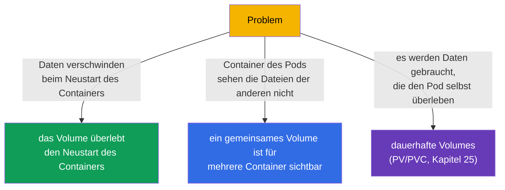
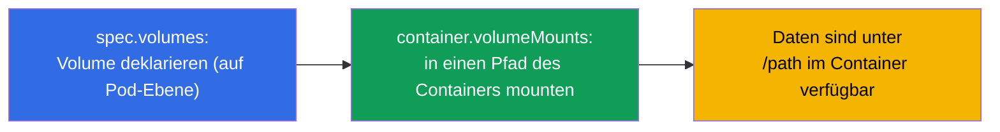
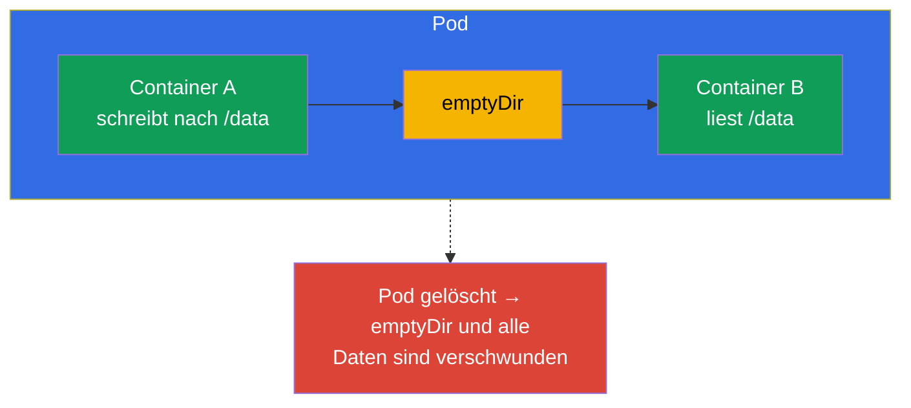
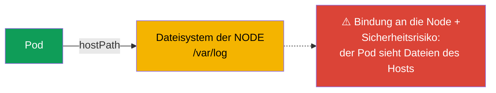
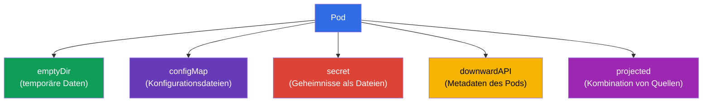
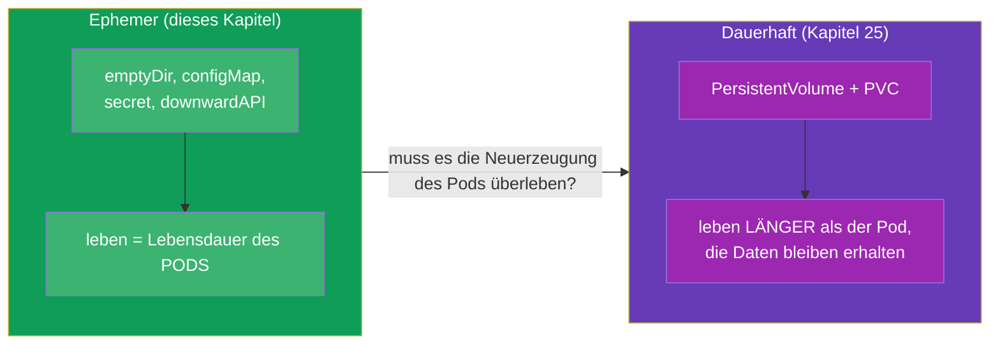

[Русская версия](ru.md) · [Eng version](README.md) · [Versión en español](es.md) · [Version française](fr.md) · [ქართული ვერსია](ge.md) · [繁體中文版](tw.md) · [日本語版](jp.md)

# Kapitel 24. Volumes für Anwendungen: emptyDir und ephemere Volumes

> **Was kommt.** Wir schließen Teil 4 ab. Volumes haben wir schon getroffen: ein
> gemeinsames Volume für Multi-Container-Patterns (Kapitel 22), ein beschreibbares
> Verzeichnis bei read-only Root (Kapitel 20), das Mounten von ConfigMap/Secret
> (Kapitel 18-19). Jetzt ist es Zeit, Volumes systematisch anzugehen, beginnend mit den
> **ephemeren** - jenen, die zusammen mit dem Pod leben. Das ist die Vorstufe zum
> dauerhaften Speicher (PV/PVC, Kapitel 25). Das Thema gehört zu CKAD (Design and Build)
> und zum allgemeinen Verständnis von Storage bei CKA.

## 24.1. Wozu Volumes gut sind

Standardmäßig ist das Dateisystem eines Containers **ephemer und isoliert**: der Container
startet neu - die von ihm geschriebenen Dateien sind weg; sind mehrere Container im Pod,
sehen sie die Dateien der anderen nicht. Volumes lösen beide Probleme:



Die zentrale Wasserscheide ist die **Lebensdauer der Daten**:

- **ephemere Volumes** leben genauso lange wie der **Pod** (nicht der Container!). Den
  Neustart des Containers überleben sie, das Löschen des Pods nicht.
- **dauerhafte Volumes** (PV/PVC) leben **länger als der Pod** - die Daten bleiben
  erhalten, auch wenn der Pod neu erzeugt oder gelöscht wurde (Kapitel 25).

Dieses Kapitel behandelt die ephemeren.

## 24.2. Wie ein Volume an einen Container angebunden wird

Die Mechanik ist immer dieselbe: das Volume wird auf der Ebene des **Pods** deklariert
(`spec.volumes`) und über `volumeMounts` in den Container gemountet.



```yaml
spec:
  containers:
  - name: app
    image: nginx
    volumeMounts:
    - name: cache          # Verweis auf das Volume per Name
      mountPath: /tmp/cache
  volumes:
  - name: cache            # Deklaration des Volumes
    emptyDir: {}
```

Ein Volume kann in mehrere Container gemountet werden - so teilen sie sich die Daten
(Grundlage der Patterns aus Kapitel 22).

## 24.3. emptyDir: temporäres gemeinsames Verzeichnis

**emptyDir** ist das häufigste ephemere Volume. Es wird beim Start des Pods auf der Node
leer erzeugt und zusammen mit dem Pod gelöscht. Es lebt, solange der Pod auf dieser Node
ist.



Wofür emptyDir verwendet wird:

- **Datenaustausch zwischen den Containern eines Pods** (ein Sidecar schreibt/liest Logs -
  Kapitel 22);
- **temporärer Cache, Scratch-Verzeichnis** für Zwischendaten;
- **beschreibbares Verzeichnis** bei `readOnlyRootFilesystem: true` (Kapitel 20) - zum
  Beispiel ein emptyDir nach `/tmp` mounten.

emptyDir kann im Speicher liegen (schneller, belegt aber RAM des Pods):

```yaml
  volumes:
  - name: cache
    emptyDir:
      medium: Memory       # Volume im Arbeitsspeicher (tmpfs)
      sizeLimit: 128Mi
```

> **Wichtig.** `medium: Memory` verbraucht Speicher der Node und wird in den Limits des
> Pods mitgezählt - ein großes tmpfs kann zur Verdrängung führen. Nützlich für einen
> schnellen Cache, aber mit einem Auge auf den Speicher.

## 24.4. hostPath: Verzeichnis der Node (mit Vorsicht)

**hostPath** mountet ein Verzeichnis/eine Datei **von der Node selbst** in den Pod. Das ist
kein isoliertes Volume mehr - der Pod erhält Zugriff auf das Dateisystem des Hosts.

```yaml
  volumes:
  - name: host-logs
    hostPath:
      path: /var/log
      type: Directory
```



hostPath ist nur für Systemaufgaben zu rechtfertigen (Agenten, die Zugriff auf Logs/Sockets
der Node brauchen - meist in einem DaemonSet, Kapitel 11). Für Anwendungen ist es ein
**Antipattern**: die Daten sind an eine konkrete Node gebunden (zieht der Pod um, sind die
Daten weg), dazu ist es ein Sicherheitsloch (Zugriff auf das Dateisystem des Hosts). Bei
CKS ist hostPath ein häufiges Thema von Verboten durch Policies.

## 24.5. Andere ephemere Volumes

Manche Volumes, die Sie schon gesehen haben, sind ebenfalls ephemer (leben mit dem Pod):

| Volume | Zweck | Kapitel |
|-----|-----------|-------|
| `emptyDir` | leeres temporäres Verzeichnis, Austausch zwischen Containern | dieses |
| `configMap` | Keys einer ConfigMap als Dateien | 18 |
| `secret` | Keys eines Secret als Dateien | 19 |
| `downwardAPI` | Informationen über den Pod als Dateien | 17 |
| `projected` | mehrere Quellen (secret+configMap+downwardAPI) in einem Volume | - |



Alle werden gleich gemountet (über `volumes` + `volumeMounts`) und verschwinden zusammen
mit dem Pod - das verbindet sie und unterscheidet sie von PV/PVC.

## 24.6. Ephemer gegen dauerhaft: die Brücke zu Kapitel 25

Das Fazit zur Lebensdauer der Daten - der zentrale Gedanke vor dem nächsten Kapitel:



Eine einfache Auswahlregel: wenn es nicht schade ist, die Daten beim Neuerzeugen des Pods
zu verlieren (Cache, Austausch zwischen Containern, temp) - ephemeres Volume. Wenn die
Daten den Pod überleben müssen (Datenbank, Uploads von Benutzern) - dauerhafter Speicher
(PV/PVC, Kapitel 25).

## 24.7. Praxisfall: erzeugen, ansehen, mounten, löschen

Sehen wir uns den vollen Arbeitszyklus mit einem ephemeren Volume am Beispiel eines
emptyDir an, das zwei Container eines Pods gemeinsam nutzen.

**1. Einen Pod mit Volume erzeugen und in zwei Container mounten.**

```yaml
apiVersion: v1
kind: Pod
metadata:
  name: shared-vol
spec:
  containers:
  - name: writer
    image: busybox
    command: ["sh", "-c", "echo hello > /data/msg && sleep 3600"]
    volumeMounts:
    - name: shared
      mountPath: /data
  - name: reader
    image: busybox
    command: ["sh", "-c", "sleep 3600"]
    volumeMounts:
    - name: shared
      mountPath: /data
      readOnly: true
  volumes:
  - name: shared
    emptyDir: {}
```

```bash
kubectl apply -f shared-vol.yaml
```

**2. Die Volumes des Pods ansehen.**

```bash
# Volume und Mount-Punkte — in describe (Abschnitte Volumes und Mounts)
kubectl describe pod shared-vol

# nur die deklarierten Volumes aus der Spec
kubectl get pod shared-vol -o jsonpath='{.spec.volumes}'

# was tatsächlich im Container gemountet ist
kubectl exec shared-vol -c writer -- df -h /data
kubectl exec shared-vol -c writer -- mount | grep /data
```

**3. Prüfen, dass das Volume gemeinsam ist.** Die von `writer` geschriebene Datei ist für
`reader` sichtbar:

```bash
kubectl exec shared-vol -c reader -- cat /data/msg   # hello
```

Da `reader` das Volume mit `readOnly: true` gemountet hat, scheitert ein Schreibvorgang von
dort mit dem Fehler „read-only file system“ - praktisch, wenn der Konsument die Daten nicht
ändern soll.

**4. Das Volume „löschen“.** Einen eigenen Befehl zum Löschen eines ephemeren Volumes gibt
es nicht - es lebt zusammen mit dem Pod. Das Volume lässt sich auf zwei Wegen entfernen:

- `volumes` und die entsprechenden `volumeMounts` aus dem Manifest entfernen und anwenden
  (`kubectl apply -f shared-vol.yaml`) - der Pod wird schon ohne Volume neu erzeugt;
- den Pod selbst löschen - `kubectl delete pod shared-vol` - mit ihm verschwinden emptyDir
  und alle Daten.

Um sich zu vergewissern, dass die Daten ephemer sind: löschen und erzeugen Sie den Pod neu,
und prüfen Sie dann - `/data/msg` ist schon leer, emptyDir wird neu erzeugt.

### Möglichkeiten bei Größe und Erweiterung

- emptyDir hat nur `sizeLimit` - eine Obergrenze des Volumens. Ein Überschreiten führt zur
  Verdrängung des Pods (evicted), nicht zu automatischem Wachstum.
- **ein ephemeres Volume lässt sich nicht „im Betrieb“ erweitern.** Die Felder des Volumes
  sind bei einem laufenden Pod unveränderlich: um `sizeLimit` oder `medium` zu ändern, muss
  der Pod neu erzeugt werden (Manifest anpassen + `kubectl apply`, der Pod wird neu
  erzeugt).
- **Online-Erweiterung ist eine Eigenschaft dauerhafter Volumes.** Bei einem PVC kann man
  mit `allowVolumeExpansion: true` in der StorageClass die angeforderte Größe ohne
  Neuerzeugung des Pods erhöhen (Kapitel 25-26). Bei emptyDir/configMap/secret gibt es
  einen solchen Mechanismus nicht.
- Für sich stehen die **generic ephemeral volumes** (`spec.volumes[].ephemeral` mit einem
  PVC-Template): sie sind von der Lebensdauer her ephemer (werden mit dem Pod gelöscht),
  beruhen aber auf einem PVC und erben daher dessen Regeln, einschließlich der Erweiterung.
  Das ist ein Hybrid an der Grenze zu Kapitel 25.

## 24.8. Wie man das in der Produktion anwendet

- **emptyDir für Scratch und Sidecar.** In der Produktion ist emptyDir der reguläre Weg
  zum Datenaustausch zwischen den Containern eines Pods (Logs, Puffer) und für einen
  temporären Cache. Die Daten sind bewusst „wegwerfbar“ - auf ein emptyDir legt man nichts
  Wertvolles.
- **emptyDir + readOnlyRootFilesystem.** Eine sichere Kombination: der Root des Containers
  ist read-only, und die zum Schreiben nötigen Verzeichnisse (`/tmp`, Caches) liegen auf
  einem emptyDir. So schreibt die Anwendung nur dorthin, wo es ausdrücklich erlaubt ist
  (überschneidet sich mit Kapitel 20).
- **hostPath wird gemieden.** In der Produktion wird hostPath für Anwendungen praktisch
  nicht genutzt - Bindung an die Node und Sicherheitsrisiko. Erlaubt wird es nur
  System-DaemonSets und oft durch Policies verboten (Pod Security `restricted`, Kyverno).
- **Memory-emptyDir mit Vorsicht.** tmpfs-Volumes geben Geschwindigkeit, fressen aber RAM
  der Node und werden in den Limits mitgezählt; ein unachtsames `medium: Memory` ohne
  `sizeLimit` kann bei Speichermangel zur Verdrängung von Pods führen.
- **Wertvolle Daten nur auf dauerhaften Volumes.** Alles, was nicht verloren gehen darf,
  landet in der Produktion auf PV/PVC mit passender StorageClass (Kapitel 25-26), nicht auf
  ephemeren Volumes.

## 24.9. Mini-Glossar

- **Volume** - Speicher, der auf Pod-Ebene deklariert und in Container gemountet wird.
- **volumes / volumeMounts** - Deklaration des Volumes / sein Mounten in einen Container.
- **Ephemeres Volume** - lebt genauso lange wie der Pod (überlebt den Neustart des
  Containers, aber nicht das Löschen des Pods).
- **emptyDir** - leeres temporäres Verzeichnis des Pods; Austausch zwischen Containern,
  Cache, Scratch.
- **medium: Memory** - Ablage des emptyDir im RAM (tmpfs).
- **hostPath** - Mounten eines Verzeichnisses der Node in den Pod (riskant, für
  Systemaufgaben).
- **projected** - Volume, das mehrere Quellen vereint (secret/configMap/downwardAPI).

## 24.10. Zusammenfassung des Kapitels

- Das Dateisystem eines Containers ist ephemer und isoliert; Volumes geben Persistenz
  (innerhalb der Lebensdauer des Pods) und gemeinsamen Zugriff zwischen Containern.
- Das Volume wird in `spec.volumes` deklariert und über `volumeMounts` gemountet; ein
  Volume kann in mehrere Container gemountet werden.
- emptyDir ist ein leeres temporäres Verzeichnis, lebt mit dem Pod; für den Austausch
  zwischen Containern, Cache, beschreibbares Verzeichnis bei read-only Root.
- `medium: Memory` legt emptyDir ins RAM - schnell, frisst aber Speicher der Node.
- hostPath gibt Zugriff auf das Dateisystem der Node - gefährlich und bindet an die Node;
  nur für Systemaufgaben.
- ConfigMap/Secret/downwardAPI/projected sind ebenfalls ephemere Volumes und werden genauso
  gemountet.
- Ephemere Volumes leben mit dem Pod; für Daten, die den Pod überleben, gilt PV/PVC
  (Kapitel 25).
- Die Volumes eines Pods sieht man über `kubectl describe pod` (Volumes/Mounts) und
  `kubectl exec ... df/mount`; einen eigenen Befehl zum Löschen eines ephemeren Volumes
  gibt es nicht - es geht mit dem Pod.
- Ein ephemeres Volume lässt sich nicht „im Betrieb“ erweitern (die Felder sind
  unveränderlich, der Pod muss neu erzeugt werden); Online-Erweiterung gibt es nur beim PVC
  (`allowVolumeExpansion`, Kapitel 25-26).

## 24.11. Wofür das nützlich ist: in der Prüfung und in der echten Arbeit

**In der Prüfung.** „Füge ein emptyDir hinzu und mounte es in zwei Container“, „gib ein
beschreibbares /tmp bei read-only Root“, „mounte eine ConfigMap als Volume“ - typische
Aufgaben. Man muss das Paar `volumes`/`volumeMounts` sicher schreiben können und verstehen,
dass ephemere Volumes zusammen mit dem Pod verschwinden.

**In der echten Arbeit.** emptyDir ist ein alltägliches Werkzeug für den Sidecar-Austausch
und temporäre Daten, und in Verbindung mit read-only Root ein Element der Sicherheit. Das
Verständnis von „ephemer gegen dauerhaft“ bestimmt, wohin man Daten legt, um sie beim
Neuerzeugen des Pods nicht zu verlieren, und bewahrt vor dem Antipattern hostPath.

## 24.12. Fragen zur Selbstüberprüfung

1. Wodurch unterscheidet sich die Lebensdauer eines ephemeren Volumes von der eines
   Containers und der eines Pods?
2. Wie wird ein Volume deklariert und wie wird es in einen Container gemountet?
3. Wofür verwendet man emptyDir? Nennen Sie drei Szenarien.
4. Was ändert `medium: Memory` bei einem emptyDir und worin besteht das Risiko?
5. Warum ist hostPath ein Antipattern für Anwendungen und wer braucht es dennoch?
6. Welche Volumes sind noch ephemer und wodurch gleichen sie emptyDir bei der Lebensdauer?
7. Nach welcher Regel wählt man zwischen einem ephemeren und einem dauerhaften Volume?
8. Wie sieht man die Volumes und Mount-Punkte eines Pods an und wie „löscht“ man ein
   ephemeres Volume?
9. Kann man ein emptyDir bei einem laufenden Pod erweitern und wo ist Online-Erweiterung
   überhaupt verfügbar?

## Praxis

Damit ist Teil 4 (Design und Bau von Anwendungen) abgeschlossen. Weiter geht es mit Teil 5:
dauerhafter Speicher (PV, PVC, StorageClass), wo Daten die Neuerzeugung des Pods überleben.
Ephemere Volumes werden in den Labs zum Design von Anwendungen und zum Speicher geübt.

🧪 Lab 107 (Volumes für Anwendungen: emptyDir): [tasks/cka/labs/107](../../labs/107/README_DE.MD)

---
[Inhalt](../README_DE.md) · [Kapitel 23](../23/de.md) · [Kapitel 25](../25/de.md)
