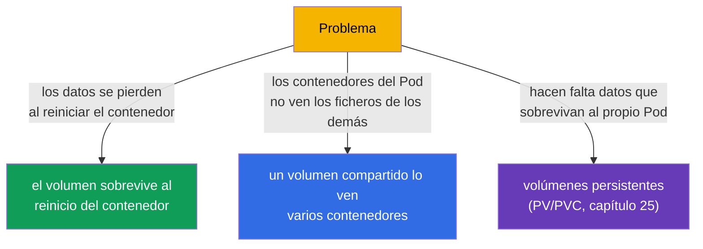
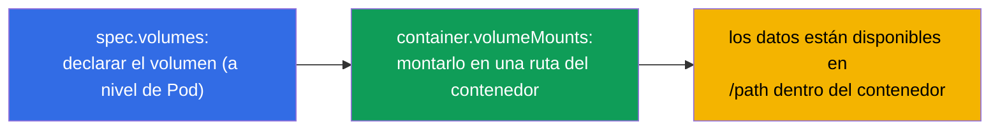
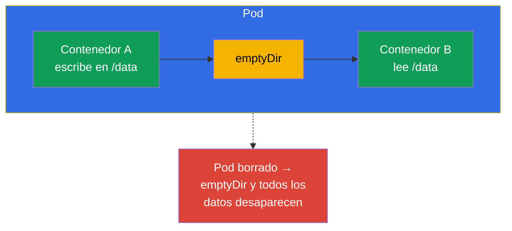
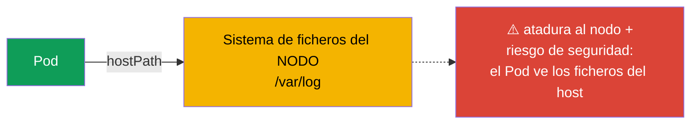
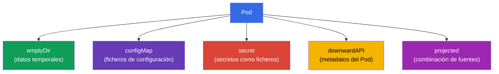
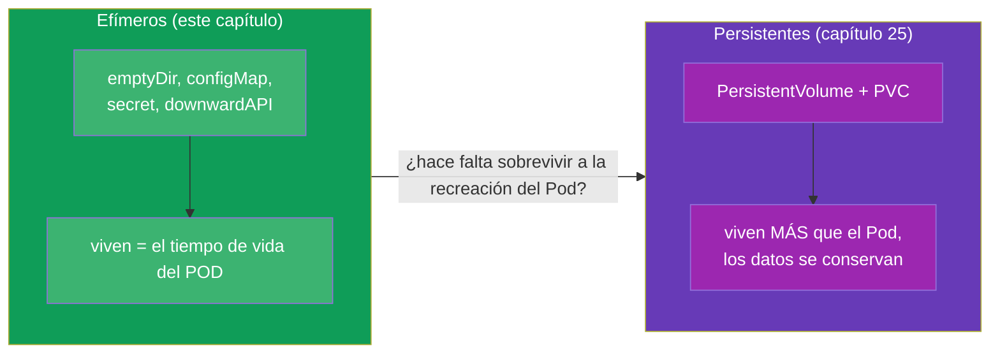

[Русская версия](ru.md) · [Eng version](README.md) · [Version française](fr.md) · [Deutsche Version](de.md) · [ქართული ვერსია](ge.md) · [繁體中文版](tw.md) · [日本語版](jp.md)

# Capítulo 24. Volúmenes para aplicaciones: emptyDir y volúmenes efímeros

> **Qué viene ahora.** Cerramos la parte 4. Ya nos hemos topado con volúmenes: un volumen
> compartido para los patrones multi-container (capítulo 22), un directorio escribible con
> raíz read-only (capítulo 20), el montaje de ConfigMap/Secret (capítulos 18-19). Toca
> abordar los volúmenes de forma sistemática, empezando por los **efímeros**: los que viven
> junto al Pod. Es el escalón previo al almacenamiento persistente (PV/PVC, capítulo 25). El
> tema pertenece a CKAD (Design and Build) y a la comprensión general del almacenamiento en
> CKA.

## 24.1. Para qué sirven los volúmenes

Por defecto, el sistema de ficheros de un contenedor es **efímero y aislado**: si el
contenedor se reinicia, los ficheros que escribió desaparecen; si el Pod tiene varios
contenedores, no ven los ficheros de los demás. Los volúmenes (volumes) resuelven ambos
problemas:



La línea divisoria clave es el **tiempo de vida de los datos**:

- los **volúmenes efímeros** viven lo mismo que el **Pod** (¡no que el contenedor!).
  Sobreviven al reinicio del contenedor, pero no al borrado del Pod.
- los **volúmenes persistentes** (PV/PVC) viven **más que el Pod**: los datos se conservan
  incluso cuando el Pod se recrea o se borra (capítulo 25).

Este capítulo va de los efímeros.

## 24.2. Cómo se conecta un volumen a un contenedor

La mecánica es siempre la misma: el volumen se declara a nivel de **Pod** (`spec.volumes`) y
se monta en el contenedor mediante `volumeMounts`.



```yaml
spec:
  containers:
  - name: app
    image: nginx
    volumeMounts:
    - name: cache          # referencia al volumen por su nombre
      mountPath: /tmp/cache
  volumes:
  - name: cache            # declaración del volumen
    emptyDir: {}
```

Un mismo volumen se puede montar en varios contenedores: así comparten los datos (la base de
los patrones del capítulo 22).

## 24.3. emptyDir: directorio temporal compartido

**emptyDir** es el volumen efímero más habitual. Se crea vacío al arrancar el Pod en el nodo
y se borra junto con el Pod. Vive mientras el Pod esté en ese nodo.



Para qué se usa emptyDir:

- **intercambio de datos entre contenedores del Pod** (un sidecar escribe/lee logs -
  capítulo 22);
- **caché temporal, directorio scratch** para datos intermedios;
- **directorio escribible** con `readOnlyRootFilesystem: true` (capítulo 20) - por ejemplo,
  montar un emptyDir en `/tmp`.

emptyDir se puede ubicar en memoria (más rápido, pero consume RAM del Pod):

```yaml
  volumes:
  - name: cache
    emptyDir:
      medium: Memory       # volumen en memoria RAM (tmpfs)
      sizeLimit: 128Mi
```

> **Importante.** `medium: Memory` gasta memoria del nodo y cuenta en los límites del Pod:
> un tmpfs grande puede provocar desalojo. Es útil para una caché rápida, pero con un ojo
> puesto en la memoria.

## 24.4. hostPath: directorio del nodo (con cuidado)

**hostPath** monta en el Pod un directorio/fichero **del propio nodo**. Esto ya no es un
volumen aislado: el Pod obtiene acceso al sistema de ficheros del host.

```yaml
  volumes:
  - name: host-logs
    hostPath:
      path: /var/log
      type: Directory
```



hostPath solo se justifica para tareas de sistema (agentes que necesitan acceso a los
logs/sockets del nodo - normalmente en un DaemonSet, capítulo 11). Para aplicaciones es un
**antipatrón**: los datos quedan atados a un nodo concreto (si el Pod se mueve, no hay
datos), y además es un agujero de seguridad (acceso al FS del host). En CKS, hostPath es un
tema recurrente de prohibiciones mediante políticas.

## 24.5. Otros volúmenes efímeros

Algunos volúmenes que ya has visto también son efímeros (viven con el Pod):

| Volumen | Para qué sirve | Capítulo |
|-----|-----------|-------|
| `emptyDir` | directorio temporal vacío, intercambio entre contenedores | este |
| `configMap` | claves de un ConfigMap como ficheros | 18 |
| `secret` | claves de un Secret como ficheros | 19 |
| `downwardAPI` | información sobre el Pod como ficheros | 17 |
| `projected` | varias fuentes (secret+configMap+downwardAPI) en un solo volumen | - |



Todos se montan igual (mediante `volumes` + `volumeMounts`) y desaparecen junto con el Pod:
eso es lo que los emparenta y lo que los diferencia de PV/PVC.

## 24.6. Efímero frente a persistente: puente al capítulo 25

El resumen sobre el tiempo de vida de los datos es la idea clave antes del capítulo
siguiente:



Regla sencilla de elección: si no importa perder los datos al recrear el Pod (caché,
intercambio entre contenedores, temporales), volumen efímero. Si los datos deben sobrevivir
al Pod (bases de datos, subidas de usuarios), almacenamiento persistente (PV/PVC,
capítulo 25).

## 24.7. Caso práctico: crear, ver, montar, borrar

Veamos el ciclo completo de trabajo con un volumen efímero, con el ejemplo de un emptyDir
compartido por dos contenedores del Pod.

**1. Crear un Pod con un volumen y montarlo en dos contenedores.**

```yaml
apiVersion: v1
kind: Pod
metadata:
  name: shared-vol
spec:
  containers:
  - name: writer
    image: busybox
    command: ["sh", "-c", "echo hello > /data/msg && sleep 3600"]
    volumeMounts:
    - name: shared
      mountPath: /data
  - name: reader
    image: busybox
    command: ["sh", "-c", "sleep 3600"]
    volumeMounts:
    - name: shared
      mountPath: /data
      readOnly: true
  volumes:
  - name: shared
    emptyDir: {}
```

```bash
kubectl apply -f shared-vol.yaml
```

**2. Ver los volúmenes del Pod.**

```bash
# el volumen y los puntos de montaje están en describe (secciones Volumes y Mounts)
kubectl describe pod shared-vol

# solo los volúmenes declarados en la spec
kubectl get pod shared-vol -o jsonpath='{.spec.volumes}'

# qué está realmente montado dentro del contenedor
kubectl exec shared-vol -c writer -- df -h /data
kubectl exec shared-vol -c writer -- mount | grep /data
```

**3. Comprobar que el volumen es compartido.** El fichero escrito por `writer` lo ve
`reader`:

```bash
kubectl exec shared-vol -c reader -- cat /data/msg   # hello
```

Como `reader` ha montado el volumen con `readOnly: true`, escribir desde él falla con el
error «read-only file system»: cómodo cuando el consumidor no debe modificar los datos.

**4. «Borrar» el volumen.** No existe un comando específico para borrar un volumen efímero:
vive junto con el Pod. Se puede quitar de dos maneras:

- quitar `volumes` y los `volumeMounts` correspondientes del manifiesto y aplicarlo
  (`kubectl apply -f shared-vol.yaml`) - el Pod se recrea ya sin el volumen;
- borrar el propio Pod - `kubectl delete pod shared-vol` - y con él desaparecen el emptyDir y
  todos los datos.

Para convencerte de que los datos son efímeros: borra y vuelve a crear el Pod y comprueba
que `/data/msg` ya está vacío, el emptyDir se crea de nuevo.

### Posibilidades de tamaño y ampliación

- emptyDir solo tiene `sizeLimit`, el límite superior de volumen. Superarlo provoca el
  desalojo del Pod (evicted), no un crecimiento automático.
- **un volumen efímero no se puede ampliar «en caliente».** Los campos del volumen de un Pod
  en marcha son inmutables: para cambiar `sizeLimit` o `medium` hay que recrear el Pod (editar
  el manifiesto + `kubectl apply`, el Pod se recrea).
- **la ampliación en línea es una propiedad de los volúmenes persistentes.** En un PVC, con
  `allowVolumeExpansion: true` en el StorageClass, se puede aumentar el tamaño solicitado sin
  recrear el Pod (capítulos 25-26). En emptyDir/configMap/secret no existe ese mecanismo.
- aparte están los **generic ephemeral volumes** (`spec.volumes[].ephemeral` con una
  plantilla de PVC): son efímeros por tiempo de vida (se borran con el Pod), pero se apoyan en
  un PVC y por eso heredan sus reglas, incluida la ampliación. Es un híbrido en la frontera
  con el capítulo 25.

## 24.8. Cómo se aplica esto en producción

- **emptyDir para scratch y sidecars.** En producción, emptyDir es la forma estándar de
  intercambiar datos entre contenedores del Pod (logs, buffers) y de tener una caché temporal.
  Los datos son deliberadamente «desechables»: en emptyDir no se pone nada valioso.
- **emptyDir + readOnlyRootFilesystem.** Combinación segura: la raíz del contenedor en
  read-only y los directorios que hacen falta para escribir (`/tmp`, cachés) sobre emptyDir.
  Así la aplicación escribe solo donde está explícitamente permitido (conecta con el
  capítulo 20).
- **hostPath se evita.** En producción, hostPath para aplicaciones prácticamente no se usa:
  atadura al nodo y riesgo de seguridad. Solo se permite a DaemonSets de sistema y a menudo se
  prohíbe por políticas (Pod Security `restricted`, Kyverno).
- **emptyDir en memoria, con cuidado.** Los volúmenes tmpfs dan velocidad, pero se comen la
  RAM del nodo y cuentan en los límites; un `medium: Memory` descuidado sin `sizeLimit` puede
  provocar el desalojo de Pods cuando falta memoria.
- **Los datos valiosos, solo en volúmenes persistentes.** Todo lo que no se puede perder va en
  producción a PV/PVC con un StorageClass adecuado (capítulos 25-26), no a volúmenes efímeros.

## 24.9. Mini-glosario

- **Volumen (volume)** - almacenamiento que se declara a nivel de Pod y se monta en los
  contenedores.
- **volumes / volumeMounts** - declaración del volumen / su montaje en el contenedor.
- **Volumen efímero** - vive lo mismo que el Pod (sobrevive al reinicio del contenedor, pero
  no al borrado del Pod).
- **emptyDir** - directorio temporal vacío del Pod; intercambio entre contenedores, caché,
  scratch.
- **medium: Memory** - ubicación del emptyDir en RAM (tmpfs).
- **hostPath** - montaje de un directorio del nodo en el Pod (arriesgado, para tareas de
  sistema).
- **projected** - volumen que combina varias fuentes (secret/configMap/downwardAPI).

## 24.10. Resumen del capítulo

- El sistema de ficheros del contenedor es efímero y aislado; los volúmenes aportan
  persistencia (dentro de la vida del Pod) y acceso compartido entre contenedores.
- El volumen se declara en `spec.volumes` y se monta mediante `volumeMounts`; un mismo volumen
  se puede montar en varios contenedores.
- emptyDir es un directorio temporal vacío, vive con el Pod; sirve para el intercambio entre
  contenedores, caché y directorio escribible con raíz read-only.
- `medium: Memory` pone el emptyDir en RAM: rápido, pero se come la memoria del nodo.
- hostPath da acceso al FS del nodo: peligroso y ata al nodo; solo para tareas de sistema.
- ConfigMap/Secret/downwardAPI/projected también son volúmenes efímeros y se montan igual.
- Los volúmenes efímeros viven con el Pod; para datos que sobrevivan al Pod, PV/PVC
  (capítulo 25).
- Los volúmenes del Pod se ven con `kubectl describe pod` (Volumes/Mounts) y `kubectl exec ... df/mount`;
  no hay un comando específico para borrar un volumen efímero, se va con el Pod.
- Un volumen efímero no se puede ampliar «en caliente» (los campos son inmutables, hace falta
  recrear el Pod); la ampliación en línea solo existe en PVC (`allowVolumeExpansion`,
  capítulos 25-26).

## 24.11. Para qué te servirá: en el examen y en el trabajo real

**En el examen.** «Añade un emptyDir y móntalo en dos contenedores», «da un /tmp escribible
con raíz read-only», «monta un ConfigMap como volumen» son tareas típicas. Hay que escribir
con soltura el par `volumes`/`volumeMounts` y entender que los volúmenes efímeros desaparecen
junto con el Pod.

**En el trabajo real.** emptyDir es una herramienta del día a día para el intercambio con
sidecars y los datos temporales, y en combinación con la raíz read-only es un elemento de
seguridad. Entender «efímero frente a persistente» determina dónde poner los datos para no
perderlos al recrear el Pod, y te libra del antipatrón hostPath.

## 24.12. Preguntas de autoevaluación

1. ¿En qué se diferencia el tiempo de vida de un volumen efímero del tiempo de vida del
   contenedor y del Pod?
2. ¿Cómo se declara un volumen y cómo se monta en el contenedor?
3. ¿Para qué se usa emptyDir? Da tres escenarios.
4. ¿Qué cambia `medium: Memory` en un emptyDir y cuál es el riesgo?
5. ¿Por qué hostPath es un antipatrón para aplicaciones y a quién le sirve de todos modos?
6. ¿Qué otros volúmenes son efímeros y en qué se parecen a emptyDir por tiempo de vida?
7. ¿Con qué regla elegir entre un volumen efímero y uno persistente?
8. ¿Cómo ver los volúmenes y los puntos de montaje de un Pod y cómo «borrar» un volumen
   efímero?
9. ¿Se puede ampliar el emptyDir de un Pod en marcha y dónde está disponible la ampliación en
   línea?

## Práctica

Con esto queda cerrada la parte 4 (diseño y construcción de aplicaciones). Después viene la
parte 5: almacenamiento persistente (PV, PVC, StorageClass), donde los datos sobreviven a la
recreación del Pod. Los volúmenes efímeros se practican en los laboratorios de diseño de
aplicaciones y almacenamiento.

🧪 Laboratorio 107 (volúmenes de aplicaciones: emptyDir): [tasks/cka/labs/107](../../labs/107/README_ES.MD)

🎮 Killercoda (en el navegador, sin instalación): [Create a Pod with emptyDir volume](https://killercoda.com/chadmcrowell/course/ckad/volumes) · [NFS Volumes in Kubernetes Pods](https://killercoda.com/chadmcrowell/course/ckad/nfs-vol)

---
[Índice](../README_ES.md) · [Capítulo 23](../23/es.md) · [Capítulo 25](../25/es.md)
