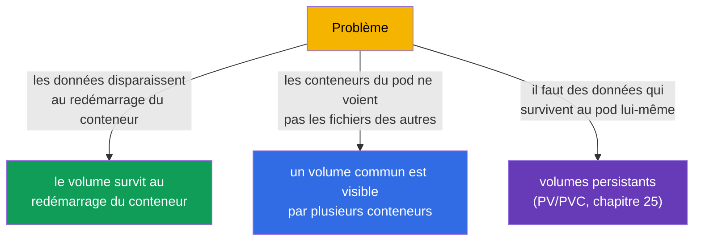
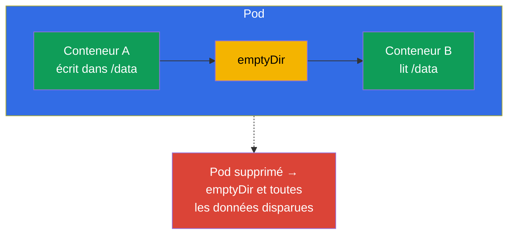
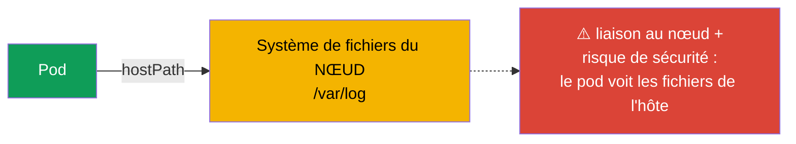
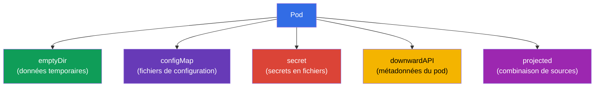
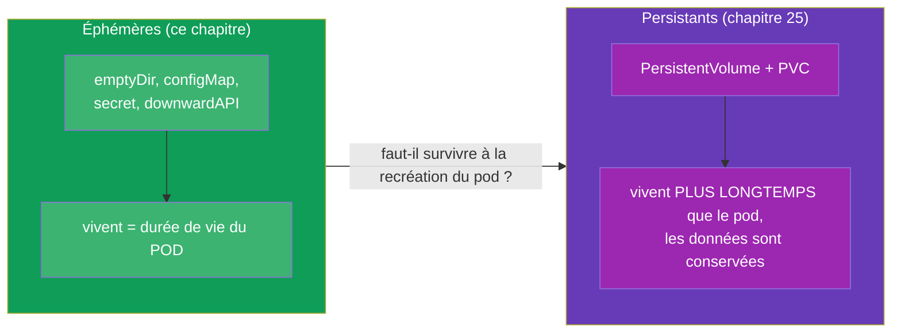

[Русская версия](ru.md) · [Eng version](README.md) · [Versión en español](es.md) · [Deutsche Version](de.md) · [ქართული ვერსია](ge.md) · [繁體中文版](tw.md) · [日本語版](jp.md)

# Chapitre 24. Volumes pour les applications : emptyDir et volumes éphémères

> **Ce qui suit.** Nous terminons la partie 4. Nous avons déjà croisé les volumes : un volume
> commun pour les patterns multi-container (chapitre 22), un répertoire inscriptible avec une
> racine read-only (chapitre 20), le montage de ConfigMap/Secret (chapitres 18-19). Il est
> temps d'aborder les volumes de façon systématique, en commençant par les **éphémères** -
> ceux qui vivent avec le pod. C'est une marche vers le stockage persistant (PV/PVC,
> chapitre 25). Le sujet relève du CKAD (Design and Build) et de la compréhension générale du
> stockage au CKA.

## 24.1. À quoi servent les volumes

Par défaut, le système de fichiers d'un conteneur est **éphémère et isolé** : le conteneur
redémarre - les fichiers qu'il a écrits disparaissent ; s'il y a plusieurs conteneurs dans le
pod, ils ne voient pas les fichiers des autres. Les volumes résolvent les deux problèmes :



La ligne de partage essentielle, c'est la **durée de vie des données** :

- les **volumes éphémères** vivent aussi longtemps que le **pod** (pas le conteneur !). Ils
  survivent au redémarrage du conteneur, mais pas à la suppression du pod.
- les **volumes persistants** (PV/PVC) vivent **plus longtemps que le pod** - les données
  sont conservées même quand le pod est recréé ou supprimé (chapitre 25).

Ce chapitre porte sur les éphémères.

## 24.2. Comment un volume est rattaché à un conteneur

La mécanique est toujours la même : le volume est déclaré au niveau du **pod**
(`spec.volumes`), puis monté dans le conteneur via `volumeMounts`.


```yaml
spec:
  containers:
  - name: app
    image: nginx
    volumeMounts:
    - name: cache          # référence au volume par son nom
      mountPath: /tmp/cache
  volumes:
  - name: cache            # déclaration du volume
    emptyDir: {}
```

Un même volume peut être monté dans plusieurs conteneurs - ils partagent ainsi les données
(la base des patterns du chapitre 22).

## 24.3. emptyDir : un répertoire commun temporaire

**emptyDir** est le volume éphémère le plus courant. Il est créé vide au démarrage du pod sur
le nœud et supprimé avec le pod. Il vit tant que le pod est sur ce nœud.



À quoi sert emptyDir :

- **échange de données entre les conteneurs du pod** (un sidecar écrit/lit les logs -
  chapitre 22) ;
- **cache temporaire, répertoire scratch** pour des données intermédiaires ;
- **répertoire inscriptible** avec `readOnlyRootFilesystem: true` (chapitre 20) - par
  exemple monter un emptyDir dans `/tmp`.

emptyDir peut être placé en mémoire (plus rapide, mais consomme la RAM du pod) :

```yaml
  volumes:
  - name: cache
    emptyDir:
      medium: Memory       # volume en mémoire vive (tmpfs)
      sizeLimit: 128Mi
```

> **Important.** `medium: Memory` consomme la mémoire du nœud et compte dans les limites du
> pod - un gros tmpfs peut provoquer une éviction. Utile pour un cache rapide, mais à
> surveiller côté mémoire.

## 24.4. hostPath : un répertoire du nœud (prudence)

**hostPath** monte dans le pod un répertoire/fichier **du nœud lui-même**. Ce n'est plus un
volume isolé - le pod obtient l'accès au système de fichiers de l'hôte.

```yaml
  volumes:
  - name: host-logs
    hostPath:
      path: /var/log
      type: Directory
```



hostPath n'est justifié que pour des tâches système (des agents qui ont besoin d'accéder aux
logs/sockets du nœud - généralement dans un DaemonSet, chapitre 11). Pour les applications
c'est un **antipattern** : les données sont liées à un nœud précis (le pod déménage - plus de
données), et c'est en plus une faille de sécurité (accès au FS de l'hôte). Au CKS, hostPath
est un sujet fréquent d'interdictions par les politiques.

## 24.5. Autres volumes éphémères

Certains volumes que vous avez déjà vus sont aussi éphémères (ils vivent avec le pod) :

| Volume | Rôle | Chapitre |
|-----|-----------|-------|
| `emptyDir` | répertoire temporaire vide, échange entre conteneurs | celui-ci |
| `configMap` | les clés d'un ConfigMap comme fichiers | 18 |
| `secret` | les clés d'un Secret comme fichiers | 19 |
| `downwardAPI` | informations sur le pod comme fichiers | 17 |
| `projected` | plusieurs sources (secret+configMap+downwardAPI) dans un seul volume | - |



Tous se montent de la même manière (via `volumes` + `volumeMounts`) et disparaissent avec le
pod - c'est ce qui les rapproche et les distingue des PV/PVC.

## 24.6. Éphémère contre persistant : passerelle vers le chapitre 25

Le bilan sur la durée de vie des données - l'idée clé avant le chapitre suivant :



Règle de choix simple : si perdre les données à la recréation du pod n'est pas grave (cache,
échange entre conteneurs, temp) - volume éphémère. Si les données doivent survivre au pod
(base de données, fichiers envoyés par les utilisateurs) - stockage persistant (PV/PVC,
chapitre 25).

## 24.7. Cas pratique : créer, consulter, monter, supprimer

Déroulons le cycle complet de travail avec un volume éphémère sur l'exemple d'un emptyDir
partagé par deux conteneurs du pod.

**1. Créer un pod avec un volume et le monter dans deux conteneurs.**

```yaml
apiVersion: v1
kind: Pod
metadata:
  name: shared-vol
spec:
  containers:
  - name: writer
    image: busybox
    command: ["sh", "-c", "echo hello > /data/msg && sleep 3600"]
    volumeMounts:
    - name: shared
      mountPath: /data
  - name: reader
    image: busybox
    command: ["sh", "-c", "sleep 3600"]
    volumeMounts:
    - name: shared
      mountPath: /data
      readOnly: true
  volumes:
  - name: shared
    emptyDir: {}
```

```bash
kubectl apply -f shared-vol.yaml
```

**2. Consulter les volumes du pod.**

```bash
# le volume et les points de montage — dans describe (sections Volumes et Mounts)
kubectl describe pod shared-vol

# seulement les volumes déclarés dans la spec
kubectl get pod shared-vol -o jsonpath='{.spec.volumes}'

# ce qui est réellement monté à l'intérieur du conteneur
kubectl exec shared-vol -c writer -- df -h /data
kubectl exec shared-vol -c writer -- mount | grep /data
```

**3. Vérifier que le volume est partagé.** Le fichier écrit par `writer` est visible par
`reader` :

```bash
kubectl exec shared-vol -c reader -- cat /data/msg   # hello
```

Comme `reader` a monté le volume avec `readOnly: true`, une écriture depuis celui-ci échouera
avec l'erreur « read-only file system » - pratique quand le consommateur ne doit pas modifier
les données.

**4. « Supprimer » le volume.** Il n'existe pas de commande dédiée pour supprimer un volume
éphémère - il vit avec le pod. On peut retirer le volume de deux façons :

- enlever `volumes` et les `volumeMounts` correspondants du manifeste puis appliquer
  (`kubectl apply -f shared-vol.yaml`) - le pod est recréé sans le volume ;
- supprimer le pod lui-même - `kubectl delete pod shared-vol` - avec lui disparaissent
  l'emptyDir et toutes les données.

Pour se convaincre que les données sont éphémères : supprimez et recréez le pod, puis
vérifiez - `/data/msg` est déjà vide, l'emptyDir est recréé à neuf.

### Possibilités de taille et d'extension

- emptyDir n'a que `sizeLimit` - une borne supérieure de volume. Le dépassement entraîne
  l'éviction du pod (evicted), pas une croissance automatique.
- **on ne peut pas étendre un volume éphémère « à chaud ».** Les champs du volume d'un pod
  lancé sont immuables : pour changer `sizeLimit` ou `medium`, il faut recréer le pod
  (modification du manifeste + `kubectl apply`, le pod est recréé).
- **l'extension en ligne est une propriété des volumes persistants.** Pour un PVC, avec
  `allowVolumeExpansion: true` dans le StorageClass, on peut augmenter la taille demandée
  sans recréer le pod (chapitres 25-26). emptyDir/configMap/secret n'ont pas ce mécanisme.
- à part se trouvent les **generic ephemeral volumes** (`spec.volumes[].ephemeral` avec un
  template de PVC) : ils sont éphémères par leur durée de vie (supprimés avec le pod), mais
  s'appuient sur un PVC et héritent donc de ses règles, y compris l'extension. C'est un
  hybride à la frontière du chapitre 25.

## 24.8. Comment cela s'applique en production

- **emptyDir pour le scratch et les sidecars.** En prod, emptyDir est le moyen standard
  d'échanger des données entre les conteneurs d'un pod (logs, tampons) et de faire un cache
  temporaire. Les données sont par définition « jetables » - on ne met rien de précieux sur
  un emptyDir.
- **emptyDir + readOnlyRootFilesystem.** Un duo sûr : racine du conteneur en read-only, et
  les répertoires qui doivent être inscriptibles (`/tmp`, caches) sur emptyDir. L'application
  n'écrit ainsi que là où c'est explicitement autorisé (fait écho au chapitre 20).
- **hostPath est évité.** En prod, hostPath n'est pratiquement pas utilisé pour les
  applications - liaison au nœud et risque de sécurité. Il n'est autorisé qu'aux DaemonSet
  système et souvent interdit par les politiques (Pod Security `restricted`, Kyverno).
- **emptyDir en mémoire avec prudence.** Les volumes tmpfs apportent de la vitesse, mais
  mangent la RAM du nœud et comptent dans les limites ; un `medium: Memory` négligent sans
  `sizeLimit` peut provoquer l'éviction de pods en cas de manque de mémoire.
- **Les données précieuses uniquement sur des volumes persistants.** Tout ce qu'on ne peut
  pas perdre va en prod sur des PV/PVC avec un StorageClass adapté (chapitres 25-26), pas sur
  des volumes éphémères.

## 24.9. Mini-glossaire

- **Volume** - stockage déclaré au niveau du pod et monté dans les conteneurs.
- **volumes / volumeMounts** - déclaration du volume / son montage dans le conteneur.
- **Volume éphémère** - vit aussi longtemps que le pod (survit au redémarrage du conteneur,
  mais pas à la suppression du pod).
- **emptyDir** - répertoire temporaire vide du pod ; échange entre conteneurs, cache, scratch.
- **medium: Memory** - placement de l'emptyDir en RAM (tmpfs).
- **hostPath** - montage d'un répertoire du nœud dans le pod (risqué, pour les tâches système).
- **projected** - volume qui réunit plusieurs sources (secret/configMap/downwardAPI).

## 24.10. Bilan du chapitre

- Le système de fichiers d'un conteneur est éphémère et isolé ; les volumes apportent la
  persistance (dans les limites de la vie du pod) et l'accès partagé entre conteneurs.
- Le volume est déclaré dans `spec.volumes` et monté via `volumeMounts` ; un même volume peut
  être monté dans plusieurs conteneurs.
- emptyDir est un répertoire temporaire vide, il vit avec le pod ; pour l'échange entre
  conteneurs, le cache, un répertoire inscriptible avec une racine read-only.
- `medium: Memory` place l'emptyDir en RAM - rapide, mais consomme la mémoire du nœud.
- hostPath donne accès au FS du nœud - dangereux et lie au nœud ; seulement pour les tâches
  système.
- ConfigMap/Secret/downwardAPI/projected sont aussi des volumes éphémères, montés de la même
  façon.
- Les volumes éphémères vivent avec le pod ; pour des données qui survivent au pod - PV/PVC
  (chapitre 25).
- Les volumes d'un pod se consultent via `kubectl describe pod` (Volumes/Mounts) et
  `kubectl exec ... df/mount` ; il n'y a pas de commande dédiée pour supprimer un volume
  éphémère - il part avec le pod.
- Un volume éphémère ne peut pas être étendu « à chaud » (champs immuables, recréation du pod
  nécessaire) ; l'extension en ligne n'existe que pour les PVC (`allowVolumeExpansion`,
  chapitres 25-26).

## 24.11. À quoi cela sert : à l'examen et dans le travail réel

**À l'examen.** « Ajoute un emptyDir et monte-le dans deux conteneurs », « donne un /tmp
inscriptible avec une racine read-only », « monte un ConfigMap comme volume » - des exercices
types. Il faut écrire avec assurance le couple `volumes`/`volumeMounts` et comprendre que les
volumes éphémères disparaissent avec le pod.

**Dans le travail réel.** emptyDir est un outil quotidien pour l'échange avec les sidecars et
les données temporaires, et en combinaison avec une racine read-only c'est un élément de
sécurité. Comprendre « éphémère contre persistant » détermine où placer les données pour ne
pas les perdre lors de la recréation du pod, et évite l'antipattern hostPath.

## 24.12. Questions d'auto-évaluation

1. En quoi la durée de vie d'un volume éphémère diffère-t-elle de celle du conteneur et du pod ?
2. Comment un volume est-il déclaré et comment est-il monté dans un conteneur ?
3. À quoi sert emptyDir ? Donnez trois scénarios.
4. Que change `medium: Memory` pour un emptyDir et quel est le risque ?
5. Pourquoi hostPath est-il un antipattern pour les applications et à qui sert-il malgré tout ?
6. Quels autres volumes sont éphémères et en quoi ressemblent-ils à emptyDir côté durée de vie ?
7. Selon quelle règle choisir entre un volume éphémère et un volume persistant ?
8. Comment consulter les volumes et les points de montage d'un pod et comment « supprimer » un volume éphémère ?
9. Peut-on étendre un emptyDir sur un pod déjà lancé et où l'extension en ligne est-elle vraiment disponible ?

## Pratique

La partie 4 (conception et construction des applications) est terminée. Vient ensuite la
partie 5 : le stockage persistant (PV, PVC, StorageClass), où les données survivent à la
recréation du pod. Les volumes éphémères se travaillent dans les TP sur la conception des
applications et le stockage.

🧪 TP 107 (volumes applicatifs : emptyDir) : [tasks/cka/labs/107](../../labs/107/README_FR.MD)

🎮 Killercoda (dans le navigateur, sans installation) : [Create a Pod with emptyDir volume](https://killercoda.com/chadmcrowell/course/ckad/volumes) · [NFS Volumes in Kubernetes Pods](https://killercoda.com/chadmcrowell/course/ckad/nfs-vol)

---
[Sommaire](../README_FR.md) · [Chapitre 23](../23/fr.md) · [Chapitre 25](../25/fr.md)
