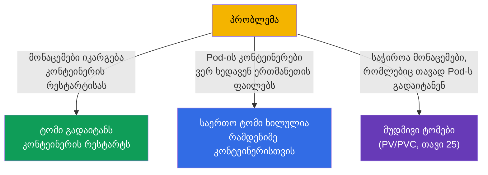
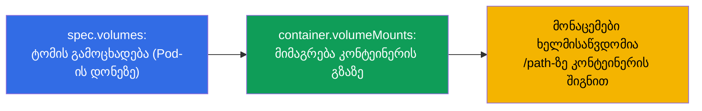
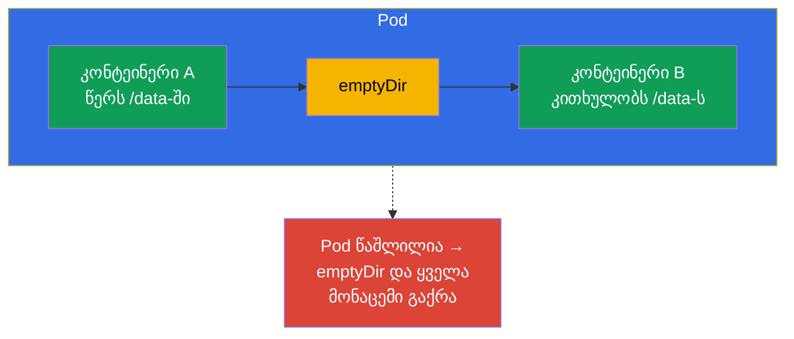
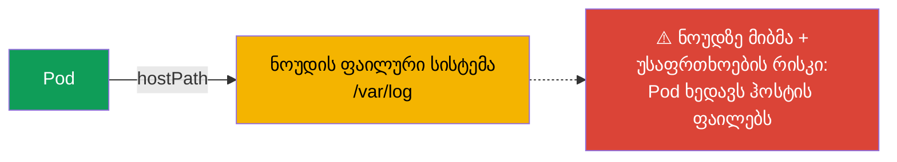
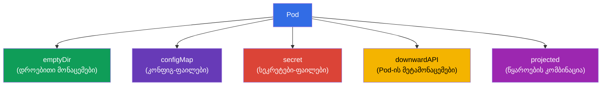
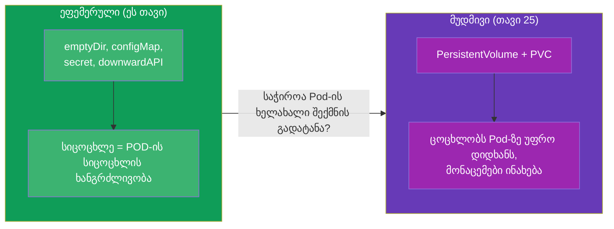

[Русская версия](ru.md) · [Eng version](README.md) · [Versión en español](es.md) · [Version française](fr.md) · [Deutsche Version](de.md) · [繁體中文版](tw.md) · [日本語版](jp.md)

# თავი 24. ტომები აპლიკაციებისთვის: emptyDir და ეფემერული ტომები

> **რა იქნება შემდეგ.** ვასრულებთ ნაწილ 4-ს. ტომებს უკვე შევხვდით: საერთო ტომი
> multi-container პატერნებისთვის (თავი 22), ჩაწერადი კატალოგი read-only ფესვის დროს (თავი 20),
> ConfigMap/Secret-ის მიმაგრება (თავები 18-19). დროა ტომები სისტემურად გავარჩიოთ, დაწყებული
> **ეფემერულებით** - იმათით, რომლებიც Pod-თან ერთად ცოცხლობენ. ეს არის კიბის საფეხური მუდმივ საცავამდე
> (PV/PVC, თავი 25). თემა ეხება CKAD-ს (Design and Build) და CKA-ზე საცავის
> ზოგად გაგებას.

## 24.1. რისთვის არის საჭირო ტომები

ნაგულისხმევად კონტეინერის ფაილური სისტემა **ეფემერული და იზოლირებულია**: კონტეინერი
გადაიტვირთა - მის მიერ ჩაწერილი ფაილები გაქრა; Pod-ში რამდენიმე კონტეინერია - ისინი ვერ ხედავენ
ერთმანეთის ფაილებს. ტომები (volumes) ორივე პრობლემას წყვეტს:



საკვანძო წყალგამყოფი - **მონაცემების სიცოცხლის ხანგრძლივობა**:

- **ეფემერული ტომები** ცოცხლობენ იმდენივე ხანს, რამდენსაც **Pod** (არა კონტეინერი!). კონტეინერის
  რესტარტს ისინი გადაიტანენ, Pod-ის წაშლას - არა.
- **მუდმივი ტომები** (PV/PVC) ცოცხლობენ **Pod-ზე უფრო დიდხანს** - მონაცემები ინახება მაშინაც, როცა
  Pod ხელახლა შეიქმნა ან წაიშალა (თავი 25).

ეს თავი - ეფემერულებზეა.

## 24.2. როგორ ერთვება ტომი კონტეინერს

მექანიკა ყოველთვის ერთია: ტომი ცხადდება **Pod-ის** დონეზე (`spec.volumes`), ხოლო მიმაგრდება
კონტეინერში `volumeMounts`-ის მეშვეობით.



```yaml
spec:
  containers:
  - name: app
    image: nginx
    volumeMounts:
    - name: cache          # მიმართვა ტომზე სახელით
      mountPath: /tmp/cache
  volumes:
  - name: cache            # ტომის გამოცხადება
    emptyDir: {}
```

ერთი ტომი შეიძლება რამდენიმე კონტეინერში მიიმაგრო - ასე ისინი მონაცემებს ინაწილებენ (თავი 22-ის
პატერნების საფუძველი).

## 24.3. emptyDir: დროებითი საერთო კატალოგი

**emptyDir** - ყველაზე ხშირი ეფემერული ტომი. იქმნება ცარიელი Pod-ის სტარტზე ნოუდზე და
იშლება Pod-თან ერთად. ცოცხლობს, სანამ Pod ამ ნოუდზეა.



რისთვის იყენებენ emptyDir-ს:

- **მონაცემების გაცვლა Pod-ის კონტეინერებს შორის** (sidecar წერს/კითხულობს ლოგებს - თავი 22);
- **დროებითი ქეში, scratch-კატალოგი** შუალედური მონაცემებისთვის;
- **ჩაწერადი კატალოგი** `readOnlyRootFilesystem: true`-ს დროს (თავი 20) - მაგალითად,
  emptyDir-ის მიმაგრება `/tmp`-ზე.

emptyDir შეიძლება მეხსიერებაში განათავსო (უფრო სწრაფია, მაგრამ იკავებს Pod-ის RAM-ს):

```yaml
  volumes:
  - name: cache
    emptyDir:
      medium: Memory       # ტომი ოპერატიულ მეხსიერებაში (tmpfs)
      sizeLimit: 128Mi
```

> **მნიშვნელოვანია.** `medium: Memory` ხარჯავს ნოუდის მეხსიერებას და ითვლება Pod-ის ლიმიტებში -
> დიდმა tmpfs-მა შეიძლება გამოძევებამდე მიგვიყვანოს. სასარგებლოა სწრაფი ქეშისთვის, მაგრამ
> მეხსიერებაზე გახედვით.

## 24.4. hostPath: ნოუდის კატალოგი (ფრთხილად)

**hostPath** Pod-ში მიამაგრებს კატალოგს/ფაილს **თავად ნოუდიდან**. ეს უკვე იზოლირებული ტომი არ არის -
Pod იღებს წვდომას ჰოსტის ფაილურ სისტემასთან.

```yaml
  volumes:
  - name: host-logs
    hostPath:
      path: /var/log
      type: Directory
```



hostPath გამართლებულია მხოლოდ სისტემური ამოცანებისთვის (აგენტები, რომლებსაც სჭირდებათ წვდომა ნოუდის
ლოგებთან/სოკეტებთან - ჩვეულებრივ DaemonSet-ში, თავი 11). აპლიკაციებისთვის ეს **ანტიპატერნია**: მონაცემები მიბმულია
კონკრეტულ ნოუდზე (Pod გადავიდა - მონაცემები აღარ არის), პლუს ეს არის ხვრელი უსაფრთხოებაში (წვდომა ჰოსტის
ფს-თან). CKS-ზე hostPath - პოლიტიკებით აკრძალვების ხშირი თემაა.

## 24.5. სხვა ეფემერული ტომები

ზოგიერთი ტომი, რომელიც უკვე ნახეთ, - ასევე ეფემერულია (ცოცხლობს Pod-თან):

| ტომი | დანიშნულება | თავი |
|-----|-----------|-------|
| `emptyDir` | ცარიელი დროებითი კატალოგი, გაცვლა კონტეინერებს შორის | ეს |
| `configMap` | ConfigMap-ის გასაღებები ფაილებად | 18 |
| `secret` | Secret-ის გასაღებები ფაილებად | 19 |
| `downwardAPI` | ინფორმაცია Pod-ზე ფაილებად | 17 |
| `projected` | რამდენიმე წყარო (secret+configMap+downwardAPI) ერთ ტომში | - |



ყველა მათგანი ერთნაირად მიმაგრდება (`volumes` + `volumeMounts` მეშვეობით) და ქრება Pod-თან
ერთად - ეს მათ ანათესავებს და განასხვავებს PV/PVC-სგან.

## 24.6. ეფემერული მუდმივის წინააღმდეგ: ხიდი თავ 25-თან

შეჯამება მონაცემების სიცოცხლის ხანგრძლივობაზე - საკვანძო აზრი შემდეგი თავის წინ:



მარტივი არჩევის წესი: თუ მონაცემების დაკარგვა Pod-ის ხელახლა შექმნისას არ გვენანება (ქეში, გაცვლა
კონტეინერებს შორის, temp) - ეფემერული ტომი. თუ მონაცემებმა Pod უნდა გადაიტანონ (ბდ, მომხმარებლების
ატვირთვები) - მუდმივი საცავი (PV/PVC, თავი 25).

## 24.7. პრაქტიკული ქეისი: შექმნა, ნახვა, მიმაგრება, წაშლა

გავარჩიოთ ეფემერულ ტომთან მუშაობის სრული ციკლი emptyDir-ის მაგალითზე, რომელიც საერთოა Pod-ის ორი
კონტეინერისთვის.

**1. შევქმნათ Pod ტომით და მივამაგროთ ორ კონტეინერში.**

```yaml
apiVersion: v1
kind: Pod
metadata:
  name: shared-vol
spec:
  containers:
  - name: writer
    image: busybox
    command: ["sh", "-c", "echo hello > /data/msg && sleep 3600"]
    volumeMounts:
    - name: shared
      mountPath: /data
  - name: reader
    image: busybox
    command: ["sh", "-c", "sleep 3600"]
    volumeMounts:
    - name: shared
      mountPath: /data
      readOnly: true
  volumes:
  - name: shared
    emptyDir: {}
```

```bash
kubectl apply -f shared-vol.yaml
```

**2. ვნახოთ Pod-ის ტომები.**

```bash
# ტომი და მიმაგრების წერტილები - describe-ში (სექციები Volumes და Mounts)
kubectl describe pod shared-vol

# მხოლოდ გამოცხადებული ტომები სპეკიდან
kubectl get pod shared-vol -o jsonpath='{.spec.volumes}'

# რა არის რეალურად მიმაგრებული კონტეინერის შიგნით
kubectl exec shared-vol -c writer -- df -h /data
kubectl exec shared-vol -c writer -- mount | grep /data
```

**3. შევამოწმოთ, რომ ტომი საერთოა.** ფაილი, ჩაწერილი `writer`-ის მიერ, ხილულია `reader`-ისთვის:

```bash
kubectl exec shared-vol -c reader -- cat /data/msg   # hello
```

რადგან `reader`-მა ტომი `readOnly: true`-თი მიიმაგრა, მისგან ჩაწერა ჩავარდება შეცდომით
„read-only file system“ - მოსახერხებელია, როცა მომხმარებელმა მონაცემები არ უნდა შეცვალოს.

**4. ტომის „წაშლა“.** ეფემერული ტომის წაშლის ცალკე ბრძანება არ არსებობს - იგი ცოცხლობს Pod-თან
ერთად. ტომის მოშორება შეიძლება ორი ხერხით:

- მოაშორო `volumes` და შესაბამისი `volumeMounts` მანიფესტიდან და გამოიყენო
  (`kubectl apply -f shared-vol.yaml`) - Pod ხელახლა იქმნება უკვე ტომის გარეშე;
- წაშალო თავად Pod - `kubectl delete pod shared-vol` - მასთან ერთად ქრება emptyDir და
  ყველა მონაცემი.

იმისთვის, რომ დარწმუნდე, რომ მონაცემები ეფემერულია: წაშალეთ და ხელახლა შექმენით Pod, შემდეგ შეამოწმეთ -
`/data/msg` უკვე ცარიელია, emptyDir თავიდან იქმნება.

### შესაძლებლობები ზომისა და გაფართოების მიხედვით

- emptyDir-ს აქვს მხოლოდ `sizeLimit` - მოცულობის ზედა ზღვარი. გადაჭარბება იწვევს
  Pod-ის გამოძევებას (evicted), და არა ავტომატურ ზრდას.
- **ეფემერული ტომის „ფრენაში“ გაფართოება არ შეიძლება.** გაშვებული Pod-ის ტომის ველები უცვლელია:
  იმისთვის, რომ შეცვალო `sizeLimit` ან `medium`, Pod ხელახლა უნდა შეიქმნას (მანიფესტის ჩასწორება +
  `kubectl apply`, Pod ხელახლა იქმნება).
- **ონლაინ-გაფართოება - მუდმივი ტომების თვისებაა.** PVC-ს შემთხვევაში `allowVolumeExpansion:
  true`-თი StorageClass-ში შეიძლება მოთხოვნილი ზომის გაზრდა Pod-ის ხელახლა შექმნის გარეშე
  (თავები 25-26). emptyDir/configMap/secret-ს ასეთი მექანიზმი არ აქვს.
- ცალკე დგას **generic ephemeral volumes** (`spec.volumes[].ephemeral` PVC-ის შაბლონით):
  ისინი ეფემერულია სიცოცხლის ხანგრძლივობით (იშლება Pod-თან ერთად), მაგრამ ეყრდნობა PVC-ს და ამიტომ
  იმემკვიდრეობს მის წესებს, გაფართოების ჩათვლით. ეს არის ჰიბრიდი თავ 25-თან შესაყარზე.

## 24.8. როგორ იყენებენ ამას პროდაქშენში

- **emptyDir scratch-ისა და sidecar-ისთვის.** პროდში emptyDir - Pod-ის კონტეინერებს შორის მონაცემების
  გაცვლის (ლოგები, ბუფერები) და დროებითი ქეშის შტატიანი ხერხია. მონაცემები წინასწარ
  „გადასაყრელია“ - emptyDir-ზე არაფერს ღირებულს არ დებენ.
- **emptyDir + readOnlyRootFilesystem.** უსაფრთხო შეკვრა: კონტეინერის ფესვი read-only,
  ხოლო ჩაწერისთვის საჭირო კატალოგები (`/tmp`, ქეშები) - emptyDir-ზე. ასე აპლიკაცია წერს მხოლოდ
  იმაში, სადაც აშკარად ნებადართულია (გადაიძახება თავ 20-თან).
- **hostPath-ს გვერდს უვლიან.** პროდში hostPath აპლიკაციებისთვის პრაქტიკულად არ იყენებენ -
  ნოუდზე მიბმა და უსაფრთხოების რისკი. მას მხოლოდ სისტემურ DaemonSet-ებს რთავენ და ხშირად
  კრძალავენ პოლიტიკებით (Pod Security `restricted`, Kyverno).
- **Memory-emptyDir სიფრთხილით.** tmpfs-ტომები სიჩქარეს იძლევა, მაგრამ ჭამს ნოუდის RAM-ს და
  ითვლება ლიმიტებში; უფრთხილო `medium: Memory` `sizeLimit`-ის გარეშე შეიძლება მიგვიყვანოს
  Pod-ების გამოძევებამდე მეხსიერების უკმარისობის დროს.
- **ღირებული მონაცემები - მხოლოდ მუდმივ ტომებზე.** ყველაფერი, რისი დაკარგვაც არ შეიძლება, პროდში მიდის
  PV/PVC-ზე შესაბამისი StorageClass-ით (თავი 25-26), და არა ეფემერულ ტომებზე.

## 24.9. მინი-ლექსიკონი

- **ტომი (volume)** - საცავი, რომელიც ცხადდება Pod-ის დონეზე და მიმაგრდება კონტეინერებში.
- **volumes / volumeMounts** - ტომის გამოცხადება / მისი მიმაგრება კონტეინერში.
- **ეფემერული ტომი** - ცოცხლობს იმდენივე ხანს, რამდენსაც Pod (გადაიტანს კონტეინერის რესტარტს, მაგრამ
  არა Pod-ის წაშლას).
- **emptyDir** - Pod-ის ცარიელი დროებითი კატალოგი; გაცვლა კონტეინერებს შორის, ქეში, scratch.
- **medium: Memory** - emptyDir-ის განთავსება RAM-ში (tmpfs).
- **hostPath** - ნოუდის კატალოგის მიმაგრება Pod-ში (სარისკოა, სისტემური ამოცანებისთვის).
- **projected** - ტომი, რომელიც აერთიანებს რამდენიმე წყაროს (secret/configMap/downwardAPI).

## 24.10. თავის შეჯამება

- კონტეინერის ფაილური სისტემა ეფემერული და იზოლირებულია; ტომები იძლევა პერსისტენტულობას (Pod-ის
  სიცოცხლის ფარგლებში) და საერთო წვდომას კონტეინერებს შორის.
- ტომი ცხადდება `spec.volumes`-ში და მიმაგრდება `volumeMounts`-ის მეშვეობით; ერთი ტომი შეიძლება
  რამდენიმე კონტეინერში მიამაგრო.
- emptyDir - ცარიელი დროებითი კატალოგი, ცოცხლობს Pod-თან; კონტეინერებს შორის გაცვლისთვის,
  ქეშისთვის, ჩაწერადი კატალოგისთვის read-only ფესვის დროს.
- `medium: Memory` emptyDir-ს RAM-ში დებს - სწრაფია, მაგრამ ჭამს ნოუდის მეხსიერებას.
- hostPath იძლევა წვდომას ნოუდის ფს-თან - საშიშია და ნოუდზე მიბავს; მხოლოდ სისტემური
  ამოცანებისთვის.
- ConfigMap/Secret/downwardAPI/projected - ასევე ეფემერული ტომებია, მიმაგრდება იმავენაირად.
- ეფემერული ტომები ცოცხლობს Pod-თან; მონაცემებისთვის, რომლებიც Pod-ს გადაიტანენ, - PV/PVC (თავი 25).
- Pod-ის ტომებს უყურებენ `kubectl describe pod`-ით (Volumes/Mounts) და `kubectl exec ... df/mount`-ით;
  ეფემერული ტომის წაშლის ცალკე ბრძანება არ არსებობს - იგი Pod-თან ერთად მიდის.
- ეფემერული ტომის „ფრენაში“ გაფართოება არ შეიძლება (ველები უცვლელია, საჭიროა Pod-ის ხელახლა შექმნა);
  ონლაინ-გაფართოება მხოლოდ PVC-ს აქვს (`allowVolumeExpansion`, თავი 25-26).

## 24.11. როგორ გამოგადგებათ: გამოცდაზე და რეალურ სამუშაოში

**გამოცდაზე.** „დაამატე emptyDir და მიამაგრე ორ კონტეინერში“, „მიეცი ჩაწერადი /tmp
read-only ფესვის დროს“, „მიამაგრე ConfigMap ტომად“ - ტიპური დავალებებია. საჭიროა თავდაჯერებულად დაწერო
წყვილი `volumes`/`volumeMounts` და გესმოდეს, რომ ეფემერული ტომები ქრება Pod-თან ერთად.

**რეალურ სამუშაოში.** emptyDir - ყოველდღიური ინსტრუმენტია sidecar-გაცვლისა და დროებითი
მონაცემებისთვის, ხოლო read-only ფესვთან შეკვრაში - უსაფრთხოების ელემენტი. „ეფემერული მუდმივის
წინააღმდეგ“ გაგება განსაზღვრავს, სად დავდოთ მონაცემები, რომ არ დავკარგოთ ისინი Pod-ის ხელახლა შექმნისას, და
გვიცავს hostPath-ის ანტიპატერნისგან.

## 24.12. თვითშემოწმების კითხვები

1. რითი განსხვავდება ეფემერული ტომის სიცოცხლის ხანგრძლივობა კონტეინერისა და Pod-ის სიცოცხლის ხანგრძლივობისგან?
2. როგორ ცხადდება ტომი და როგორ მიმაგრდება კონტეინერში?
3. რისთვის იყენებენ emptyDir-ს? მოიყვანეთ სამი სცენარი.
4. რას ცვლის `medium: Memory` emptyDir-ს და რაშია რისკი?
5. რატომ არის hostPath ანტიპატერნი აპლიკაციებისთვის და ვის სჭირდება იგი მაინც?
6. კიდევ რომელი ტომებია ეფემერული და რითი ჰგვანან ისინი emptyDir-ს სიცოცხლის ხანგრძლივობით?
7. რომელი წესით ავირჩიოთ ეფემერულსა და მუდმივ ტომს შორის?
8. როგორ ვნახოთ Pod-ის ტომები და მიმაგრების წერტილები და როგორ „წავშალოთ“ ეფემერული ტომი?
9. შეიძლება თუ არა გაშვებული Pod-ის emptyDir-ის გაფართოება და სად არის ონლაინ-გაფართოება საერთოდ ხელმისაწვდომი?

## პრაქტიკა

ამით ნაწილი 4 (აპლიკაციების დიზაინი და აწყობა) დასრულებულია. შემდეგ - ნაწილი 5: მუდმივი
საცავი (PV, PVC, StorageClass), სადაც მონაცემები Pod-ის ხელახლა შექმნას გადაიტანენ. ეფემერული ტომები
მუშავდება აპლიკაციების დიზაინისა და შენახვის ლაბებში.

🧪 ლაბი 107 (აპლიკაციების ტომები: emptyDir): [tasks/cka/labs/107](../../labs/107/README_GE.MD)

---
[სარჩევი](../README_GE.md) · [თავი 23](../23/ge.md) · [თავი 25](../25/ge.md)
