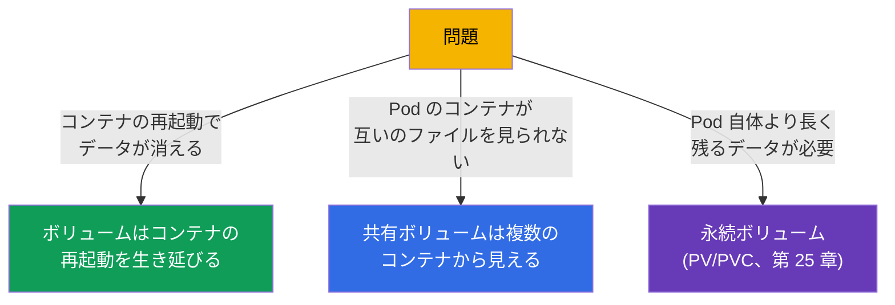
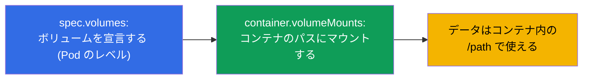
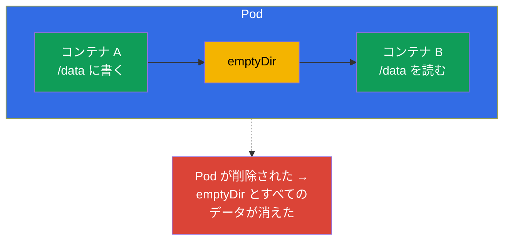
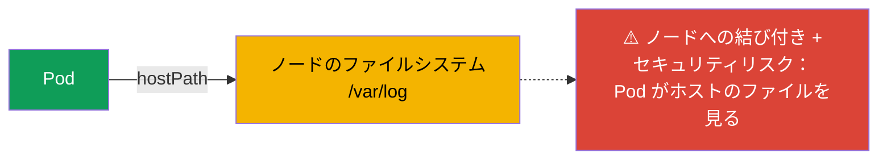
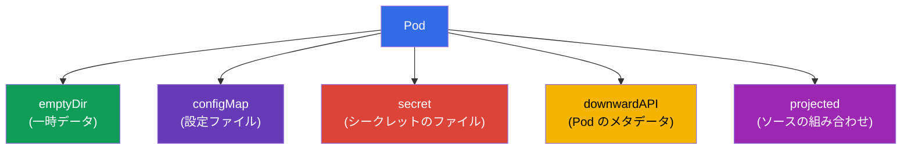
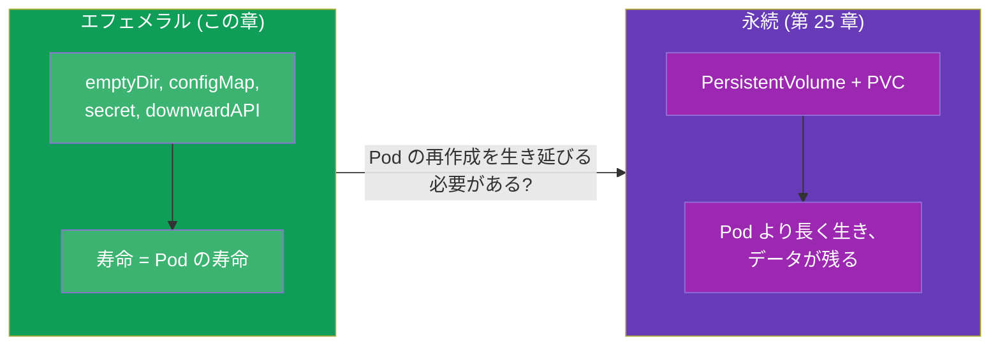

[Русская версия](ru.md) · [Eng version](README.md) · [Versión en español](es.md) · [Version française](fr.md) · [Deutsche Version](de.md) · [ქართული ვერსია](ge.md) · [繁體中文版](tw.md)

# 第 24 章。アプリケーションのためのボリューム：emptyDir とエフェメラルボリューム

> **次に来るもの。** パート 4 を締めくくります。ボリュームにはすでに何度も出会って
> います：multi-container パターンのための共有ボリューム（第 22 章）、read-only な
> ルートでの書き込み可能ディレクトリ（第 20 章）、ConfigMap/Secret のマウント
> （第 18-19 章）。そろそろボリュームを体系的に整理する時期です。まずは **エフェメラル**
> なもの - Pod と一緒に生きるボリューム - から始めます。これは永続ストレージ
> （PV/PVC、第 25 章）への足がかりです。このテーマは CKAD (Design and Build) と、
> CKA におけるストレージの全体像の理解にあたります。

## 24.1. なぜボリュームが必要か

デフォルトでは、コンテナのファイルシステムは **エフェメラルかつ隔離されています**：
コンテナが再起動すれば、書き込んだファイルは消えます。Pod に複数のコンテナがあっても、
互いのファイルは見えません。ボリューム (volumes) はこの両方を解決します：



決定的な分かれ目は **データの寿命** です：

- **エフェメラルボリューム** は **Pod** と同じだけ生きます（コンテナではありません!）。
  コンテナの再起動は生き延びますが、Pod の削除は生き延びません。
- **永続ボリューム** (PV/PVC) は **Pod より長く** 生きます - Pod が再作成されても
  削除されても、データは残ります（第 25 章）。

この章はエフェメラルなものについてです。

## 24.2. ボリュームはどうやってコンテナにつながるか

仕組みは常に同じです：ボリュームは **Pod** のレベルで宣言し (`spec.volumes`)、
`volumeMounts` を通してコンテナにマウントします。



```yaml
spec:
  containers:
  - name: app
    image: nginx
    volumeMounts:
    - name: cache          # 名前でボリュームを参照
      mountPath: /tmp/cache
  volumes:
  - name: cache            # ボリュームの宣言
    emptyDir: {}
```

1 つのボリュームを複数のコンテナにマウントできます - こうしてコンテナはデータを
共有します（第 22 章のパターンの土台）。

## 24.3. emptyDir：一時的な共有ディレクトリ

**emptyDir** は最もよく使われるエフェメラルボリュームです。Pod の起動時にノード上で
空のまま作られ、Pod と一緒に削除されます。Pod がそのノードにある間だけ生きます。



emptyDir は何に使うか：

- **Pod のコンテナ間でのデータ交換**（sidecar がログを書く/読む - 第 22 章）;
- 中間データのための **一時キャッシュ、scratch ディレクトリ**;
- `readOnlyRootFilesystem: true` のときの **書き込み可能ディレクトリ**（第 20 章）-
  たとえば emptyDir を `/tmp` にマウントします。

emptyDir はメモリ上に置くこともできます（速いが Pod の RAM を消費します）：

```yaml
  volumes:
  - name: cache
    emptyDir:
      medium: Memory       # メモリ上のボリューム (tmpfs)
      sizeLimit: 128Mi
```

> **重要。** `medium: Memory` はノードのメモリを消費し、Pod のリミットに数えられます -
> 大きな tmpfs は退避 (eviction) を招くことがあります。高速なキャッシュには有用ですが、
> メモリに気を配って使ってください。

## 24.4. hostPath：ノードのディレクトリ（注意して）

**hostPath** は **ノードそのものの** ディレクトリ/ファイルを Pod にマウントします。
これはもう隔離されたボリュームではありません - Pod はホストのファイルシステムへの
アクセスを得ます。

```yaml
  volumes:
  - name: host-logs
    hostPath:
      path: /var/log
      type: Directory
```



hostPath が正当化されるのはシステム的な用途だけです（ノードのログ/ソケットへの
アクセスが必要なエージェント - 通常は DaemonSet、第 11 章）。アプリケーションに
とってこれは **アンチパターン** です：データが特定のノードに縛られ（Pod が移動すれば
データはありません）、さらにホストの FS へのアクセスというセキュリティの穴になります。
CKS では hostPath はポリシーによる禁止の定番テーマです。

## 24.5. その他のエフェメラルボリューム

すでに見てきたいくつかのボリュームも、やはりエフェメラルです（Pod と一緒に生きます）：

| ボリューム | 用途 | 章 |
|-----|-----------|-------|
| `emptyDir` | 空の一時ディレクトリ、コンテナ間の交換 | この章 |
| `configMap` | ConfigMap のキーをファイルとして | 18 |
| `secret` | Secret のキーをファイルとして | 19 |
| `downwardAPI` | Pod についての情報をファイルとして | 17 |
| `projected` | 複数のソース (secret+configMap+downwardAPI) を 1 つのボリュームに | - |



これらはすべて同じようにマウントされ (`volumes` + `volumeMounts` を通して)、Pod と
一緒に消えます - この点が共通で、PV/PVC との違いになります。

## 24.6. エフェメラル対永続：第 25 章への橋渡し

データの寿命についてのまとめが、次の章の前に押さえておきたい核心です：



選択の単純なルール：Pod の再作成で失っても惜しくないデータ（キャッシュ、コンテナ間の
交換、temp）ならエフェメラルボリューム。データが Pod より長く残るべきなら（DB、
ユーザーのアップロード）永続ストレージ（PV/PVC、第 25 章）です。

## 24.7. 実践ケース：作る、見る、マウントする、削除する

Pod の 2 つのコンテナで共有する emptyDir を例に、エフェメラルボリュームを扱う
一連の流れを通して見ていきましょう。

**1. ボリュームを持つ Pod を作り、2 つのコンテナにマウントする。**

```yaml
apiVersion: v1
kind: Pod
metadata:
  name: shared-vol
spec:
  containers:
  - name: writer
    image: busybox
    command: ["sh", "-c", "echo hello > /data/msg && sleep 3600"]
    volumeMounts:
    - name: shared
      mountPath: /data
  - name: reader
    image: busybox
    command: ["sh", "-c", "sleep 3600"]
    volumeMounts:
    - name: shared
      mountPath: /data
      readOnly: true
  volumes:
  - name: shared
    emptyDir: {}
```

```bash
kubectl apply -f shared-vol.yaml
```

**2. Pod のボリュームを見る。**

```bash
# ボリュームとマウントポイントは describe に出る (Volumes と Mounts のセクション)
kubectl describe pod shared-vol

# spec で宣言されたボリュームだけ
kubectl get pod shared-vol -o jsonpath='{.spec.volumes}'

# コンテナの中で実際にマウントされているもの
kubectl exec shared-vol -c writer -- df -h /data
kubectl exec shared-vol -c writer -- mount | grep /data
```

**3. ボリュームが共有されていることを確認する。** `writer` が書いたファイルが
`reader` から見えます：

```bash
kubectl exec shared-vol -c reader -- cat /data/msg   # hello
```

`reader` はボリュームを `readOnly: true` でマウントしているので、そこからの書き込みは
「read-only file system」というエラーで失敗します - 利用者がデータを変更してはいけない
ときに便利です。

**4. ボリュームを「削除する」。** エフェメラルボリュームを削除する専用のコマンドは
ありません - ボリュームは Pod と一緒に生きます。ボリュームを外す方法は 2 つです：

- マニフェストから `volumes` と対応する `volumeMounts` を取り除いて適用する
  (`kubectl apply -f shared-vol.yaml`) - Pod はボリュームなしで再作成されます;
- Pod そのものを削除する - `kubectl delete pod shared-vol` - それと一緒に emptyDir と
  すべてのデータが消えます。

データがエフェメラルであることを確かめるには：Pod を削除して作り直し、そのうえで
確認してください - `/data/msg` はもう空で、emptyDir は新しく作られています。

### サイズと拡張についてできること

- emptyDir にあるのは `sizeLimit` だけ - 容量の上限です。超過は Pod の退避 (evicted)
  につながり、自動的な拡張にはなりません。
- **エフェメラルボリュームを「オンラインで」拡張することはできません。** 動いている
  Pod のボリュームのフィールドはイミュータブルです：`sizeLimit` や `medium` を変える
  には Pod を再作成する必要があります（マニフェストの修正 + `kubectl apply`、Pod は
  再作成されます）。
- **オンライン拡張は永続ボリュームの性質です。** StorageClass で
  `allowVolumeExpansion: true` なら、PVC では Pod を再作成せずに要求サイズを増やせます
  （第 25-26 章）。emptyDir/configMap/secret にそうした仕組みはありません。
- 別枠にあるのが **generic ephemeral volumes** (PVC のテンプレートを持つ
  `spec.volumes[].ephemeral`) です：寿命の点ではエフェメラル（Pod と一緒に削除される）
  ですが、PVC に支えられているため拡張を含めてその規則を受け継ぎます。これは第 25 章
  との境目にあるハイブリッドです。

## 24.8. 本番ではどう使われるか

- **scratch と sidecar のための emptyDir。** 本番では emptyDir は Pod のコンテナ間で
  データを交換する（ログ、バッファ）ため、また一時キャッシュのための標準的な手段です。
  データは前提として「捨てられるもの」- emptyDir に価値のあるものは置きません。
- **emptyDir + readOnlyRootFilesystem。** 安全な組み合わせ：コンテナのルートは
  read-only にし、書き込みが必要なディレクトリ (`/tmp`、キャッシュ) は emptyDir に。
  こうしてアプリケーションは明示的に許された場所だけに書きます（第 20 章と響き合います）。
- **hostPath は避ける。** 本番でアプリケーション向けの hostPath は事実上使われません -
  ノードへの結び付きとセキュリティリスクのためです。許されるのはシステム的な DaemonSet
  だけで、ポリシー (Pod Security `restricted`、Kyverno) で禁止されることも多いです。
- **Memory の emptyDir は慎重に。** tmpfs のボリュームは速さをくれますが、ノードの RAM
  を食べ、リミットに数えられます。`sizeLimit` なしの不注意な `medium: Memory` は、
  メモリ不足のときに Pod の退避を招くことがあります。
- **価値のあるデータは永続ボリュームにだけ。** 失ってはいけないものはすべて、本番では
  エフェメラルボリュームではなく、適切な StorageClass を持つ PV/PVC に置きます
  （第 25-26 章）。

## 24.9. ミニ用語集

- **ボリューム (volume)** - Pod のレベルで宣言し、コンテナにマウントされるストレージ。
- **volumes / volumeMounts** - ボリュームの宣言 / それをコンテナにマウントすること。
- **エフェメラルボリューム** - Pod と同じだけ生きる（コンテナの再起動は生き延びるが、
  Pod の削除は生き延びない）。
- **emptyDir** - Pod の空の一時ディレクトリ。コンテナ間の交換、キャッシュ、scratch。
- **medium: Memory** - emptyDir を RAM (tmpfs) に置くこと。
- **hostPath** - ノードのディレクトリを Pod にマウントすること（リスクがあり、
  システム的な用途向け）。
- **projected** - 複数のソース (secret/configMap/downwardAPI) をまとめるボリューム。

## 24.10. 章のまとめ

- コンテナのファイルシステムはエフェメラルかつ隔離されている。ボリュームは永続性
  （Pod の寿命の範囲で）とコンテナ間の共有アクセスを与える。
- ボリュームは `spec.volumes` で宣言し `volumeMounts` でマウントする。1 つのボリューム
  を複数のコンテナにマウントできる。
- emptyDir は空の一時ディレクトリで Pod と一緒に生きる。コンテナ間の交換、キャッシュ、
  read-only なルートでの書き込み可能ディレクトリのために使う。
- `medium: Memory` は emptyDir を RAM に置く - 速いが、ノードのメモリを食べる。
- hostPath はノードの FS へのアクセスを与える - 危険でノードに縛られる。システム的な
  用途だけに。
- ConfigMap/Secret/downwardAPI/projected もエフェメラルボリュームで、同じように
  マウントされる。
- エフェメラルボリュームは Pod と一緒に生きる。Pod より長く残るデータには PV/PVC
  （第 25 章）。
- Pod のボリュームは `kubectl describe pod` (Volumes/Mounts) と
  `kubectl exec ... df/mount` で見る。エフェメラルボリュームを削除する専用のコマンドは
  なく、Pod と一緒に去る。
- エフェメラルボリュームは「オンラインで」拡張できない（フィールドはイミュータブルで、
  Pod の再作成が必要）。オンライン拡張は PVC にだけある
  (`allowVolumeExpansion`、第 25-26 章)。

## 24.11. これがどう役に立つか：試験で、そして実際の仕事で

**試験では。** 「emptyDir を追加して 2 つのコンテナにマウントせよ」「read-only な
ルートで書き込み可能な /tmp を与えよ」「ConfigMap をボリュームとしてマウントせよ」は
定番の課題です。`volumes`/`volumeMounts` のペアを迷わず書けること、そして
エフェメラルボリュームは Pod と一緒に消えると理解していることが必要です。

**実際の仕事では。** emptyDir は sidecar との交換や一時データのための日常的な道具で、
read-only なルートと組めばセキュリティの要素になります。「エフェメラル対永続」の理解が、
Pod の再作成でデータを失わないためにどこに置くかを決め、hostPath というアンチパターン
から守ってくれます。

## 24.12. 自己チェックの質問

1. エフェメラルボリュームの寿命は、コンテナや Pod の寿命とどう違いますか？
2. ボリュームはどう宣言し、どうコンテナにマウントしますか？
3. emptyDir は何のために使いますか？シナリオを 3 つ挙げてください。
4. emptyDir の `medium: Memory` は何を変え、リスクは何ですか？
5. なぜ hostPath はアプリケーションにとってアンチパターンで、それでも誰には必要ですか？
6. ほかにどんなボリュームがエフェメラルで、寿命の点で emptyDir とどこが似ていますか？
7. エフェメラルボリュームと永続ボリュームは、どんなルールで選びますか？
8. Pod のボリュームとマウントポイントはどう見て、エフェメラルボリュームはどう
   「削除」しますか？
9. 動いている Pod の emptyDir は拡張できますか。オンライン拡張はそもそもどこで
   使えますか？

## 演習

これでパート 4（アプリケーションの設計とビルド）は終わりです。次はパート 5：永続
ストレージ (PV、PVC、StorageClass) で、データが Pod の再作成を生き延びます。
エフェメラルボリュームは、アプリケーションの設計とストレージのラボで練習します。

🧪 ラボ 107 (アプリケーションのボリューム: emptyDir): [tasks/cka/labs/107](../../labs/107/README_JP.MD)

🎮 Killercoda（ブラウザ内、セットアップ不要）：[Create a Pod with emptyDir volume](https://killercoda.com/chadmcrowell/course/ckad/volumes) · [NFS Volumes in Kubernetes Pods](https://killercoda.com/chadmcrowell/course/ckad/nfs-vol)

---
[目次](../README_JP.md) · [第 23 章](../23/jp.md) · [第 25 章](../25/jp.md)
