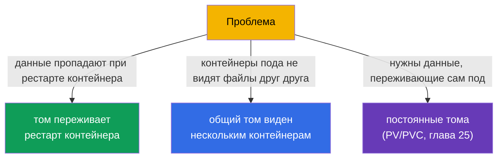
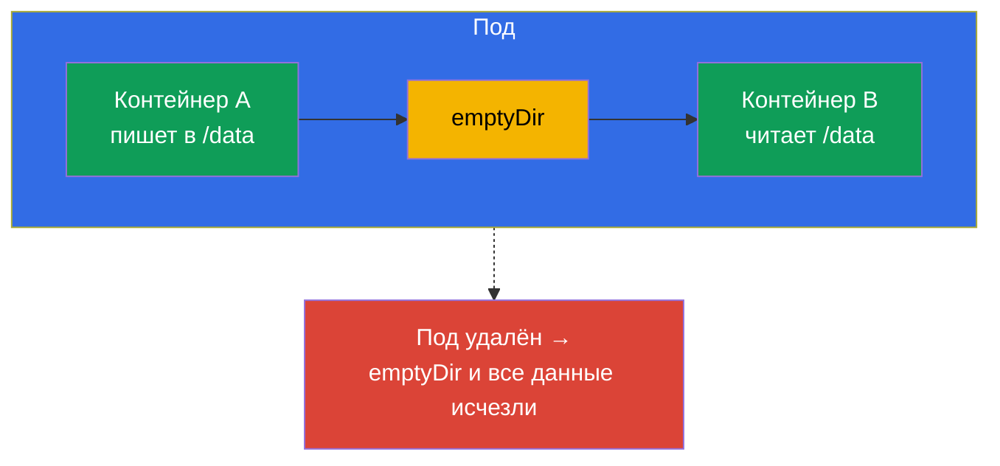
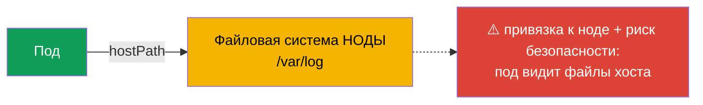
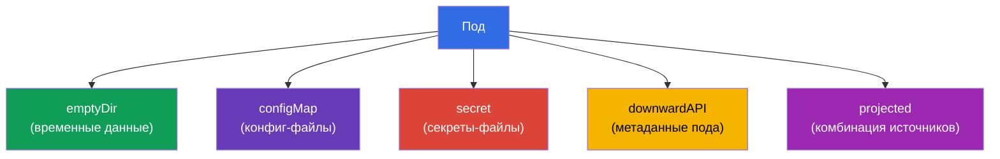
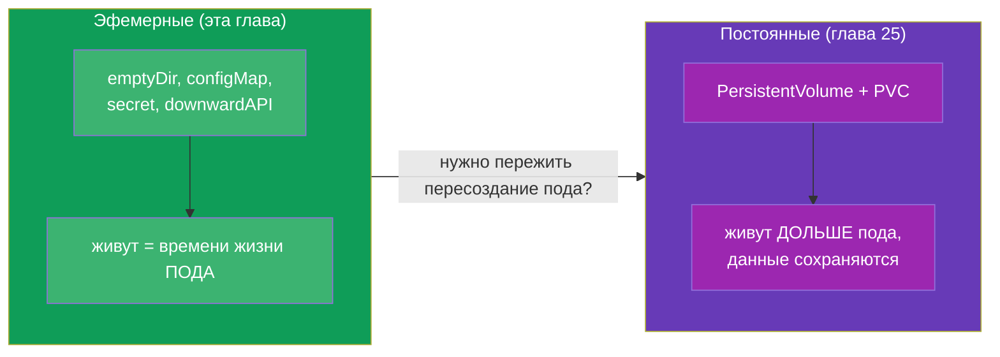

# Глава 24. Тома для приложений: emptyDir и эфемерные тома

> **Что дальше.** Завершаем часть 4. Мы уже сталкивались с томами: общий том для
> multi-container паттернов (глава 22), writable-каталог при read-only корне (глава 20),
> монтирование ConfigMap/Secret (главы 18-19). Пора разобраться с томами системно, начав
> с **эфемерных** - тех, что живут вместе с подом. Это ступенька к постоянному хранилищу
> (PV/PVC, глава 25). Тема относится к CKAD (Design and Build) и общему пониманию
> хранилища на CKA.

## 24.1. Зачем нужны тома

По умолчанию файловая система контейнера **эфемерна и изолирована**: контейнер
перезапустился - записанные им файлы исчезли; в поде несколько контейнеров - они не видят
файлы друг друга. Тома (volumes) решают обе проблемы:



Ключевой водораздел - **время жизни данных**:

- **эфемерные тома** живут столько же, сколько **под** (не контейнер!). Рестарт
  контейнера они переживают, удаление пода - нет.
- **постоянные тома** (PV/PVC) живут **дольше пода** - данные сохраняются, даже когда
  под пересоздан или удалён (глава 25).

Эта глава - про эфемерные.

## 24.2. Как том подключается к контейнеру

Механика всегда одна: том объявляется на уровне **пода** (`spec.volumes`), а монтируется
в контейнер через `volumeMounts`.


```yaml
spec:
  containers:
  - name: app
    image: nginx
    volumeMounts:
    - name: cache          # ссылка на том по имени
      mountPath: /tmp/cache
  volumes:
  - name: cache            # объявление тома
    emptyDir: {}
```

Один том можно смонтировать в несколько контейнеров - так они делят данные (основа
паттернов из главы 22).

## 24.3. emptyDir: временный общий каталог

**emptyDir** - самый частый эфемерный том. Создаётся пустым при старте пода на ноде и
удаляется вместе с подом. Живёт, пока под на этой ноде.



Для чего используют emptyDir:

- **обмен данными между контейнерами пода** (sidecar пишет/читает логи - глава 22);
- **временный кеш, scratch-каталог** для промежуточных данных;
- **writable-каталог** при `readOnlyRootFilesystem: true` (глава 20) - например,
  примонтировать emptyDir в `/tmp`.

emptyDir можно разместить в памяти (быстрее, но занимает RAM пода):

```yaml
  volumes:
  - name: cache
    emptyDir:
      medium: Memory       # том в оперативной памяти (tmpfs)
      sizeLimit: 128Mi
```

> **Важно.** `medium: Memory` расходует память ноды и учитывается в лимитах пода -
> большой tmpfs может привести к вытеснению. Полезен для быстрого кеша, но с оглядкой на
> память.

## 24.4. hostPath: каталог ноды (осторожно)

**hostPath** монтирует в под каталог/файл **с самой ноды**. Это уже не изолированный том -
под получает доступ к файловой системе хоста.

```yaml
  volumes:
  - name: host-logs
    hostPath:
      path: /var/log
      type: Directory
```



hostPath оправдан лишь для системных задач (агенты, которым нужен доступ к логам/сокетам
ноды - обычно в DaemonSet, глава 11). Для приложений это **антипаттерн**: данные привязаны
к конкретной ноде (переехал под - данных нет), плюс это дыра в безопасности (доступ к ФС
хоста). На CKS hostPath - частая тема запретов через политики.

## 24.5. Другие эфемерные тома

Некоторые тома, которые вы уже видели, - тоже эфемерные (живут с подом):

| Том | Назначение | Глава |
|-----|-----------|-------|
| `emptyDir` | пустой временный каталог, обмен между контейнерами | эта |
| `configMap` | ключи ConfigMap как файлы | 18 |
| `secret` | ключи Secret как файлы | 19 |
| `downwardAPI` | информация о поде как файлы | 17 |
| `projected` | несколько источников (secret+configMap+downwardAPI) в одном томе | - |



Все они монтируются одинаково (через `volumes` + `volumeMounts`) и исчезают вместе с
подом - это их роднит и отличает от PV/PVC.

## 24.6. Эфемерное против постоянного: мостик к главе 25

Итог по времени жизни данных - ключевая мысль перед следующей главой:



Простое правило выбора: если данные не жалко потерять при пересоздании пода (кеш, обмен
между контейнерами, temp) - эфемерный том. Если данные должны пережить под (БД, загрузки
пользователей) - постоянное хранилище (PV/PVC, глава 25).

## 24.7. Как это применяют в продакшене

- **emptyDir для scratch и sidecar.** В проде emptyDir - штатный способ обмена данными
  между контейнерами пода (логи, буферы) и временного кеша. Данные заведомо
  «выбрасываемые» - на emptyDir не кладут ничего ценного.
- **emptyDir + readOnlyRootFilesystem.** Безопасная связка: корень контейнера read-only,
  а нужные для записи каталоги (`/tmp`, кеши) - на emptyDir. Так приложение пишет только
  туда, куда явно разрешено (перекликается с главой 20).
- **hostPath избегают.** В проде hostPath для приложений практически не используют -
  привязка к ноде и риск безопасности. Его разрешают только системным DaemonSet и часто
  запрещают политиками (Pod Security `restricted`, Kyverno).
- **Memory-emptyDir с осторожностью.** tmpfs-тома дают скорость, но едят RAM ноды и
  учитываются в лимитах; неаккуратный `medium: Memory` без `sizeLimit` может привести к
  вытеснению подов при нехватке памяти.
- **Ценные данные - только на постоянных томах.** Всё, что нельзя терять, в проде идёт на
  PV/PVC с подходящим StorageClass (глава 25-26), а не на эфемерные тома.

## 24.8. Мини-глоссарий

- **Том (volume)** - хранилище, объявляемое на уровне пода и монтируемое в контейнеры.
- **volumes / volumeMounts** - объявление тома / его монтирование в контейнер.
- **Эфемерный том** - живёт столько же, сколько под (переживает рестарт контейнера, но
  не удаление пода).
- **emptyDir** - пустой временный каталог пода; обмен между контейнерами, кеш, scratch.
- **medium: Memory** - размещение emptyDir в RAM (tmpfs).
- **hostPath** - монтирование каталога ноды в под (рискованно, для системных задач).
- **projected** - том, объединяющий несколько источников (secret/configMap/downwardAPI).

## 24.9. Итоги главы

- Файловая система контейнера эфемерна и изолирована; тома дают персистентность (в
  пределах жизни пода) и общий доступ между контейнерами.
- Том объявляется в `spec.volumes` и монтируется через `volumeMounts`; один том можно
  смонтировать в несколько контейнеров.
- emptyDir - пустой временный каталог, живёт с подом; для обмена между контейнерами,
  кеша, writable-каталога при read-only корне.
- `medium: Memory` кладёт emptyDir в RAM - быстро, но ест память ноды.
- hostPath даёт доступ к ФС ноды - опасно и привязывает к ноде; только для системных
  задач.
- ConfigMap/Secret/downwardAPI/projected - тоже эфемерные тома, монтируются так же.
- Эфемерные тома живут с подом; для данных, переживающих под, - PV/PVC (глава 25).

## 24.10. Как это пригодится: на экзамене и в реальной работе

**На экзамене.** «Добавь emptyDir и смонтируй в два контейнера», «дай writable /tmp при
read-only корне», «смонтируй ConfigMap как том» - типовые задания. Нужно уверенно писать
пару `volumes`/`volumeMounts` и понимать, что эфемерные тома исчезают вместе с подом.

**В реальной работе.** emptyDir - повседневный инструмент для sidecar-обмена и временных
данных, а в связке с read-only корнем - элемент безопасности. Понимание «эфемерное против
постоянного» определяет, куда класть данные, чтобы не потерять их при пересоздании пода, и
уберегает от антипаттерна hostPath.

## 24.11. Вопросы для самопроверки

1. Чем время жизни эфемерного тома отличается от времени жизни контейнера и пода?
2. Как том объявляется и как монтируется в контейнер?
3. Для чего используют emptyDir? Приведите три сценария.
4. Что меняет `medium: Memory` у emptyDir и в чём риск?
5. Почему hostPath - антипаттерн для приложений и кому он всё же нужен?
6. Какие ещё тома эфемерны и чем они похожи на emptyDir по времени жизни?
7. По какому правилу выбирать между эфемерным и постоянным томом?

## Практика

На этом часть 4 (дизайн и сборка приложений) завершена. Дальше - часть 5: постоянное
хранилище (PV, PVC, StorageClass), где данные переживают пересоздание пода. Эфемерные тома
отрабатываются в лабах по дизайну приложений и хранению.

🧪 Лаба 107 (тома приложений: emptyDir): [tasks/cka/labs/107](../../labs/107/README_RU.MD)

---
[Оглавление](../README_RU.md) · [Глава 23](../23/ru.md) · [Глава 25](../25/ru.md)
