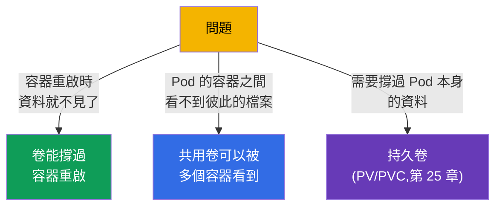
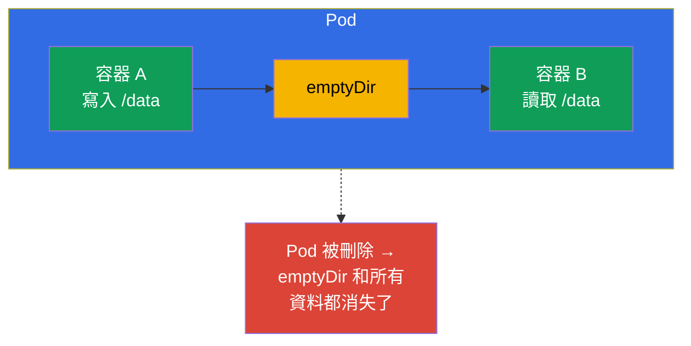
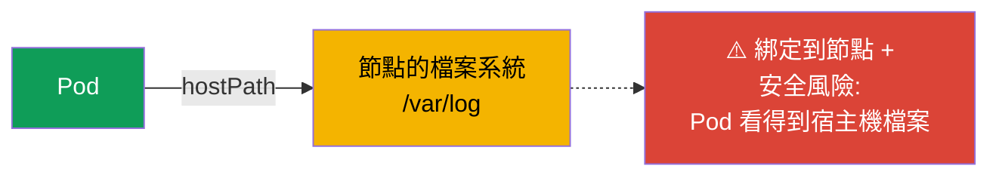
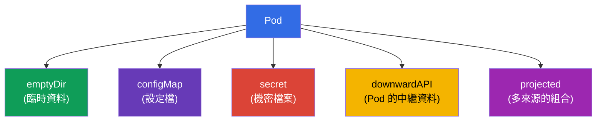
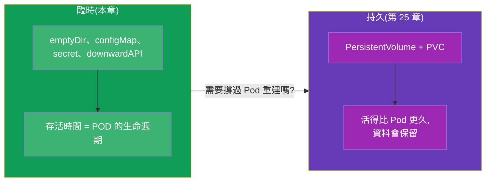

[Русская версия](ru.md) · [Eng version](README.md) · [Versión en español](es.md) · [Version française](fr.md) · [Deutsche Version](de.md) · [ქართული ვერსია](ge.md) · [日本語版](jp.md)

# 第 24 章。給應用程式用的卷:emptyDir 與臨時卷

> **接下來要講什麼。** 第 4 部分到此收尾。我們已經碰過卷:multi-container 模式裡的
> 共用卷(第 22 章)、read-only 根檔案系統下的可寫目錄(第 20 章)、掛載
> ConfigMap/Secret(第 18-19 章)。現在該系統性地把卷弄清楚了,先從 **臨時卷** 開始 -
> 也就是跟 Pod 一起存活的那一類。這是通往持久化儲存(PV/PVC,第 25 章)的一級台階。
> 這個主題屬於 CKAD(Design and Build),也關係到 CKA 對儲存的整體理解。

## 24.1. 為什麼需要卷

預設情況下,容器的檔案系統是 **臨時且互相隔離的**:容器重啟後,它寫下的檔案就消失了;
Pod 裡有多個容器時,它們看不到彼此的檔案。卷 (volumes) 同時解決這兩個問題:



關鍵的分水嶺是 **資料的生命週期**:

- **臨時卷** 的存活時間跟 **Pod** 一樣長(不是容器!)。它們能撐過容器重啟,但撐不過
  Pod 被刪除。
- **持久卷** (PV/PVC) 活得 **比 Pod 更久** - 即使 Pod 被重建或刪除,資料仍然保留
  (第 25 章)。

這一章講的是臨時卷。

## 24.2. 卷是怎麼接到容器上的

機制永遠是同一套:卷宣告在 **Pod** 層級 (`spec.volumes`),再透過 `volumeMounts`
掛載進容器。


```yaml
spec:
  containers:
  - name: app
    image: nginx
    volumeMounts:
    - name: cache          # 依名稱引用卷
      mountPath: /tmp/cache
  volumes:
  - name: cache            # 卷的宣告
    emptyDir: {}
```

同一個卷可以掛載到多個容器 - 它們就這樣共享資料(這正是第 22 章那些模式的基礎)。

## 24.3. emptyDir:臨時的共用目錄

**emptyDir** 是最常見的臨時卷。Pod 在節點上啟動時它被建立為空目錄,並隨 Pod 一起
被刪除。只要 Pod 還在這個節點上,它就存在。



emptyDir 通常用在:

- **Pod 內容器之間交換資料**(sidecar 寫入/讀取日誌 - 第 22 章);
- **臨時快取、scratch 目錄**,放中間資料;
- 當 `readOnlyRootFilesystem: true` 時的 **可寫目錄**(第 20 章)- 例如把 emptyDir
  掛到 `/tmp`。

emptyDir 也可以放在記憶體裡(更快,但會佔用 Pod 的 RAM):

```yaml
  volumes:
  - name: cache
    emptyDir:
      medium: Memory       # 卷放在記憶體裡 (tmpfs)
      sizeLimit: 128Mi
```

> **重要。** `medium: Memory` 會消耗節點的記憶體,並且計入 Pod 的 limits - 過大的
> tmpfs 可能導致 Pod 被驅逐。它適合當快速快取,但要留意記憶體。

## 24.4. hostPath:節點上的目錄(小心使用)

**hostPath** 把 **節點本身** 的目錄/檔案掛進 Pod。這已經不是隔離的卷了 - Pod 因此
拿到宿主機檔案系統的存取權。

```yaml
  volumes:
  - name: host-logs
    hostPath:
      path: /var/log
      type: Directory
```



hostPath 只有在系統類任務上才說得過去(需要存取節點日誌/socket 的 agent - 通常放在
DaemonSet 裡,第 11 章)。對應用程式來說這是 **反模式**:資料綁在特定節點上(Pod 一
搬走資料就沒了),而且是個安全漏洞(可存取宿主機的檔案系統)。在 CKS 裡,hostPath
是常見的政策封鎖主題。

## 24.5. 其他臨時卷

有些你已經見過的卷,其實也是臨時卷(跟 Pod 一起存活):

| 卷 | 用途 | 章節 |
|-----|-----------|-------|
| `emptyDir` | 空的臨時目錄,容器之間交換資料 | 本章 |
| `configMap` | 把 ConfigMap 的鍵當成檔案 | 18 |
| `secret` | 把 Secret 的鍵當成檔案 | 19 |
| `downwardAPI` | 把 Pod 的資訊當成檔案 | 17 |
| `projected` | 把多個來源 (secret+configMap+downwardAPI) 合到一個卷裡 | - |



它們的掛載方式完全一樣(透過 `volumes` + `volumeMounts`),而且都會隨 Pod 一起消失 -
這是它們的共通點,也是它們跟 PV/PVC 的差別。

## 24.6. 臨時對比持久:通往第 25 章的橋樑

以資料生命週期做總結 - 這是進入下一章之前的關鍵想法:



簡單的選擇規則:如果資料在 Pod 重建時丟掉也不心疼(快取、容器間交換、temp)- 用臨時
卷。如果資料必須撐過 Pod(資料庫、使用者上傳的檔案)- 用持久化儲存(PV/PVC,
第 25 章)。

## 24.7. 實務案例:建立、查看、掛載、刪除

我們用 emptyDir 為例,走一遍臨時卷的完整流程 - 這個卷由 Pod 裡的兩個容器共用。

**1. 建立帶卷的 Pod 並掛載到兩個容器。**

```yaml
apiVersion: v1
kind: Pod
metadata:
  name: shared-vol
spec:
  containers:
  - name: writer
    image: busybox
    command: ["sh", "-c", "echo hello > /data/msg && sleep 3600"]
    volumeMounts:
    - name: shared
      mountPath: /data
  - name: reader
    image: busybox
    command: ["sh", "-c", "sleep 3600"]
    volumeMounts:
    - name: shared
      mountPath: /data
      readOnly: true
  volumes:
  - name: shared
    emptyDir: {}
```

```bash
kubectl apply -f shared-vol.yaml
```

**2. 查看 Pod 的卷。**

```bash
# 卷與掛載點 - 在 describe 裡(Volumes 與 Mounts 區塊)
kubectl describe pod shared-vol

# 只看 spec 裡宣告的卷
kubectl get pod shared-vol -o jsonpath='{.spec.volumes}'

# 容器內實際掛載了什麼
kubectl exec shared-vol -c writer -- df -h /data
kubectl exec shared-vol -c writer -- mount | grep /data
```

**3. 確認卷是共用的。** `writer` 寫下的檔案,`reader` 也看得到:

```bash
kubectl exec shared-vol -c reader -- cat /data/msg   # hello
```

因為 `reader` 是用 `readOnly: true` 掛載這個卷,從它寫入會以「read-only file system」
錯誤失敗 - 當消費端不該修改資料時,這很方便。

**4.「刪除」卷。** 臨時卷沒有單獨的刪除命令 - 它跟 Pod 一起存活。要移掉卷有兩種
做法:

- 從 manifest 裡拿掉 `volumes` 和對應的 `volumeMounts` 再套用
  (`kubectl apply -f shared-vol.yaml`)- Pod 會以沒有卷的樣子重建;
- 直接刪掉 Pod - `kubectl delete pod shared-vol` - emptyDir 和所有資料會跟著它一起
  消失。

想確認資料真的是臨時的:刪掉 Pod 再重建,然後檢查 - `/data/msg` 已經是空的了,
emptyDir 被重新建立。

### 容量與擴容的能力

- emptyDir 只有 `sizeLimit` - 也就是容量上限。超過會導致 Pod 被驅逐 (evicted),而不是
  自動長大。
- **臨時卷不能「線上」擴容。** 執行中 Pod 的卷欄位是不可變的:要改 `sizeLimit` 或
  `medium`,必須重建 Pod(修改 manifest + `kubectl apply`,Pod 會被重建)。
- **線上擴容是持久卷的特性。** 當 StorageClass 設了 `allowVolumeExpansion:
  true`,PVC 可以在不重建 Pod 的情況下加大請求的容量(第 25-26 章)。
  emptyDir/configMap/secret 沒有這種機制。
- 另外還有 **generic ephemeral volumes**(`spec.volumes[].ephemeral` 搭配 PVC 範本):
  它們在生命週期上是臨時的(隨 Pod 刪除),但底層依賴 PVC,因此繼承了 PVC 的規則,
  包含擴容。這是與第 25 章交界處的混合體。

## 24.8. 生產環境怎麼用

- **emptyDir 用於 scratch 與 sidecar。** 在生產環境,emptyDir 是 Pod 內容器之間交換
  資料(日誌、緩衝區)以及做臨時快取的標準做法。這些資料本來就是
  「可丟棄的」- 不會把任何有價值的東西放在 emptyDir 上。
- **emptyDir + readOnlyRootFilesystem。** 這是安全的組合:容器根檔案系統唯讀,
  需要寫入的目錄(`/tmp`、各種快取)放在 emptyDir 上。這樣應用程式只會寫到明確允許
  的地方(和第 20 章相互呼應)。
- **避免 hostPath。** 在生產環境,應用程式幾乎不用 hostPath - 綁定節點又有安全風險。
  它只允許給系統類的 DaemonSet,而且經常被政策擋掉(Pod Security `restricted`、
  Kyverno)。
- **Memory-emptyDir 要謹慎。** tmpfs 卷帶來速度,但會吃掉節點的 RAM 並計入 limits;
  隨手寫個沒有 `sizeLimit` 的 `medium: Memory`,在記憶體不足時可能造成 Pod 被驅逐。
- **有價值的資料只放在持久卷上。** 所有不能丟的東西,在生產環境都會放到搭配合適
  StorageClass 的 PV/PVC 上(第 25-26 章),而不是臨時卷。

## 24.9. 迷你詞彙表

- **卷 (volume)** - 在 Pod 層級宣告、掛載進容器的儲存。
- **volumes / volumeMounts** - 卷的宣告 / 把它掛載進容器。
- **臨時卷** - 存活時間跟 Pod 一樣長(能撐過容器重啟,但撐不過 Pod 被刪除)。
- **emptyDir** - Pod 的空臨時目錄;用於容器間交換、快取、scratch。
- **medium: Memory** - 把 emptyDir 放在 RAM 裡 (tmpfs)。
- **hostPath** - 把節點的目錄掛進 Pod(有風險,用於系統類任務)。
- **projected** - 把多個來源 (secret/configMap/downwardAPI) 合起來的卷。

## 24.10. 本章總結

- 容器的檔案系統是臨時且隔離的;卷提供持久性(在 Pod 的生命週期範圍內)以及容器之間
  的共用存取。
- 卷宣告在 `spec.volumes`,並透過 `volumeMounts` 掛載;同一個卷可以掛到多個容器。
- emptyDir 是空的臨時目錄,跟 Pod 一起存活;用於容器間交換、快取、read-only 根檔案
  系統下的可寫目錄。
- `medium: Memory` 把 emptyDir 放進 RAM - 很快,但會吃節點的記憶體。
- hostPath 給出節點檔案系統的存取權 - 危險且綁定節點;只用於系統類任務。
- ConfigMap/Secret/downwardAPI/projected 也都是臨時卷,掛載方式一樣。
- 臨時卷跟 Pod 一起存活;要讓資料撐過 Pod,就要用 PV/PVC(第 25 章)。
- Pod 的卷用 `kubectl describe pod` (Volumes/Mounts) 和 `kubectl exec ... df/mount` 查看;
  臨時卷沒有單獨的刪除命令 - 它隨 Pod 一起走。
- 臨時卷不能「線上」擴容(欄位不可變,需要重建 Pod);線上擴容只有 PVC 才有
  (`allowVolumeExpansion`,第 25-26 章)。

## 24.11. 這些知識有什麼用:考試與實際工作

**在考試中。**「加一個 emptyDir 並掛到兩個容器」、「在唯讀根檔案系統下提供可寫的
/tmp」、「把 ConfigMap 當卷掛載」都是典型題目。你要能熟練地寫出 `volumes`/`volumeMounts`
這一對,並理解臨時卷會跟 Pod 一起消失。

**在實際工作中。** emptyDir 是 sidecar 交換資料與存放臨時資料的日常工具,搭配唯讀根
檔案系統時還是一項安全措施。理解「臨時對比持久」決定了資料該放在哪裡,才不會在 Pod
重建時丟掉,同時也避免掉 hostPath 這個反模式。

## 24.12. 自我檢查問題

1. 臨時卷的生命週期和容器、Pod 的生命週期有什麼不同?
2. 卷是怎麼宣告的,又是怎麼掛載進容器的?
3. emptyDir 用在什麼地方?請舉三個情境。
4. `medium: Memory` 改變了 emptyDir 的什麼,風險在哪?
5. 為什麼 hostPath 對應用程式是反模式,而誰又還是需要它?
6. 還有哪些卷是臨時的,它們在生命週期上跟 emptyDir 有什麼相似之處?
7. 要用什麼規則在臨時卷和持久卷之間做選擇?
8. 怎麼查看 Pod 的卷與掛載點,又怎麼「刪除」臨時卷?
9. 執行中的 Pod 能不能擴容 emptyDir,線上擴容到底在哪裡才有?

## 實踐

第 4 部分(應用程式的設計與建置)到這裡結束。接下來是第 5 部分:持久化儲存
(PV、PVC、StorageClass),資料會在那裡撐過 Pod 的重建。臨時卷會在應用程式設計與
儲存相關的實驗中操練。

🧪 實驗 107(應用程式的卷:emptyDir):[tasks/cka/labs/107](../../labs/107/README_TW.MD)

🎮 Killercoda（在瀏覽器中，無需安裝）：[Create a Pod with emptyDir volume](https://killercoda.com/chadmcrowell/course/ckad/volumes) · [NFS Volumes in Kubernetes Pods](https://killercoda.com/chadmcrowell/course/ckad/nfs-vol)

---
[目錄](../README_TW.md) · [第 23 章](../23/tw.md) · [第 25 章](../25/tw.md)
