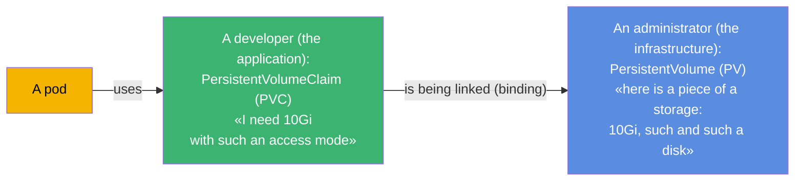
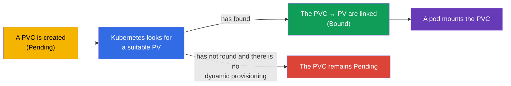
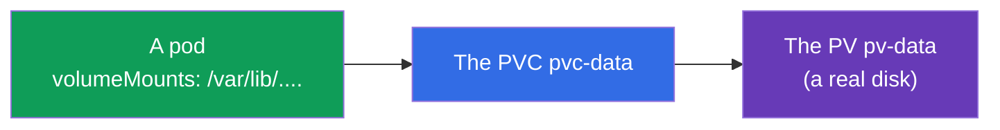
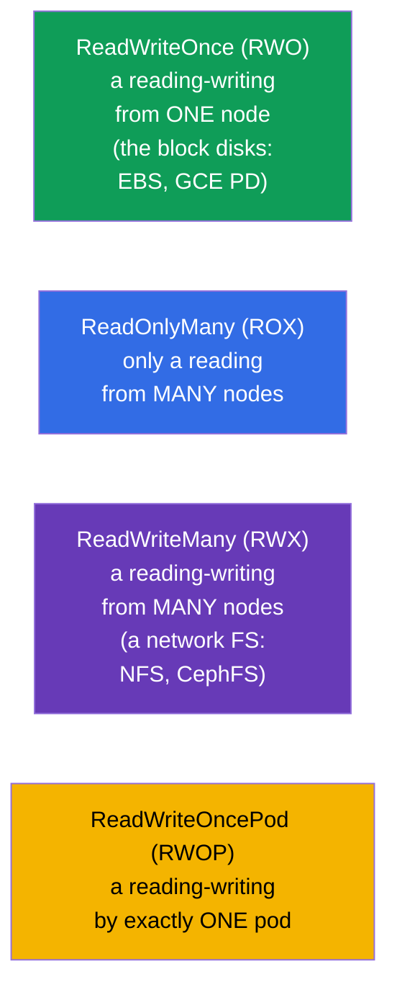
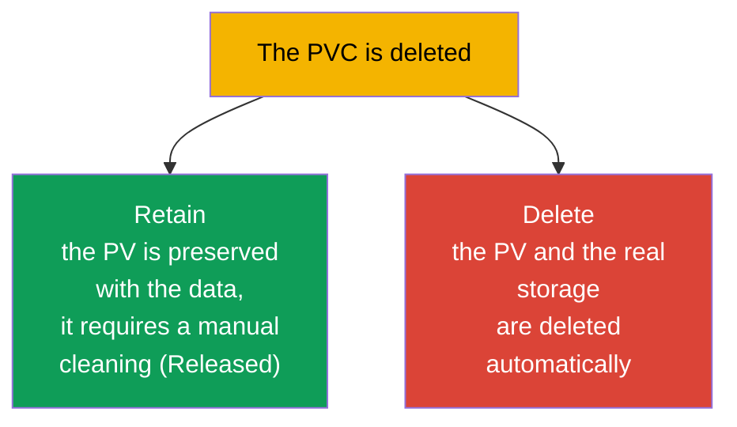

[Русская версия](ru.md) · [Versión en español](es.md) · [Version française](fr.md) · [Deutsche Version](de.md) · [ქართული ვერსია](ge.md) · [繁體中文版](tw.md) · [日本語版](jp.md)

# Chapter 25. The Volumes, the PersistentVolume and the PersistentVolumeClaim

> **What comes next.** In the previous chapter the volumes lived together with a pod. Now comes the storage, which
> **survives** a pod: the databases, the uploads of the users, any valuable data.
> Kubernetes separates "a piece of a storage" (**PersistentVolume, PV**) and "a request for a
> storage" (**PersistentVolumeClaim, PVC**). To understand this separation and the link PV↔PVC↔Pod -
> is the goal of the chapter. This is the domain Storage of both exams (CKA 10%, a part of the Application Design of the CKAD).

## 25.1. A problem: how to give a pod a persistent storage

A pod is ephemeral, and the data of a DB are not. A storage is needed, which lives independently of a pod. But there is
a difficulty: a developer of an application must not know the details of the infrastructure of the storage (which
disk, in which cloud, by which protocol). Kubernetes separates the responsibility:



- **A PV** is an "offer" of a storage: a real piece of a disk/of a volume, described as an object
  of the cluster. Usually an administrator manages it (or it is created automatically - the chapter 26).
- **A PVC** is a "claim" for a storage from an application: how much is needed and with which access mode.
- **A pod** uses a PVC, and not a PV directly. Kubernetes itself links a PVC with a suitable PV.

This separation is like a socket and a plug: an application (the plug) asks for a standard interface, and
what kind of a power station is behind the socket (the PV) does not concern it.

## 25.2. The lifecycle: a binding

When a PVC is created, Kubernetes looks for a suitable PV (by the size, the access mode, the class) and
**links** them (a binding). After that a PV belongs to this PVC one to one.



The statuses, which are seen in a `kubectl get pv,pvc`:

| The status | The meaning |
|--------|----------|
| `Available` | the PV is free, it is not bound to anybody |
| `Bound` | the PV/PVC are linked with each other |
| `Pending` | the PVC waits for a suitable PV |
| `Released` | the PVC has been deleted, but the PV has not been cleaned yet |

"A PVC hangs in Pending" is a frequent situation: there is no suitable PV and no dynamic
provisioning is configured (the chapter 26). This is the first thing, which is checked upon a debugging of the storage.

## 25.3. The manifests of a PV and of a PVC

**A PersistentVolume:**

```yaml
apiVersion: v1
kind: PersistentVolume
metadata:
  name: pv-data
spec:
  capacity:
    storage: 10Gi
  accessModes:
  - ReadWriteOnce
  persistentVolumeReclaimPolicy: Retain
  storageClassName: manual
  hostPath:                    # the type of the storage (for an example; in the prod - a cloud disk/NFS)
    path: /mnt/data
```

**A PersistentVolumeClaim:**

```yaml
apiVersion: v1
kind: PersistentVolumeClaim
metadata:
  name: pvc-data
spec:
  accessModes:
  - ReadWriteOnce
  resources:
    requests:
      storage: 10Gi
  storageClassName: manual
```

In order that a PVC gets linked with a PV, they must have **compatible**: the size (the PV ≥ the request of the PVC),
the `accessModes` and the `storageClassName`.

## 25.4. A connection of a PVC to a pod

A pod refers to a PVC as to a volume:

```yaml
spec:
  containers:
  - name: app
    image: postgres
    volumeMounts:
    - name: data
      mountPath: /var/lib/postgresql/data
  volumes:
  - name: data
    persistentVolumeClaim:
      claimName: pvc-data
```



An application sees a usual mounted directory; behind it there is a PVC, behind the PVC there is a PV, behind the PV there is
a real storage. A pod has been recreated - the data remain on the PV.

## 25.5. The access modes: the modes of the access

The `accessModes` describes, how a volume can be mounted. This is a frequent question.



| The mode | The decoding | Who can mount |
|-------|-------------|----------------------|
| `ReadWriteOnce` (RWO) | a reading-writing | one node |
| `ReadOnlyMany` (ROX) | only a reading | many nodes |
| `ReadWriteMany` (RWX) | a reading-writing | many nodes |
| `ReadWriteOncePod` (RWOP) | a reading-writing | exactly one pod |

An important subtlety: **RWO means "one node", and not "one pod"** - several pods on one
node may share an RWO volume. The majority of the cloud block disks (EBS, GCE PD) are only RWO.
For an access from many nodes (RWX) a network file system is needed (NFS, CephFS, EFS).

## 25.6. The reclaim policy: what to do with a PV after a deletion of a PVC

When a PVC is deleted, what happens with the PV and the data? This is set by the
`persistentVolumeReclaimPolicy`.



| The policy | The behaviour upon a deletion of a PVC | When |
|----------|----------------------------|-------|
| `Retain` | the PV and the data are preserved, the PV → `Released`, to clean manually | the valuable data |
| `Delete` | the PV and the real storage are deleted automatically | the temporary/dynamic volumes |

`Retain` is a safe variant for the important data (you have deleted a PVC by accident - the data are intact,
you reuse the PV). `Delete` is convenient for the dynamically created volumes (the chapter 26), but
a deletion of a PVC carries away the data - carefully.

> There was also a policy `Recycle` (it wiped the data and returned a PV into the pool), but it has become obsolete and
> is not used.

## 25.7. An expansion of a volume

A PVC can be expanded (if the StorageClass allows this, an `allowVolumeExpansion: true`) -
simply by increasing the requested size:

```bash
kubectl edit pvc pvc-data      # to change the requests.storage to a bigger one
```

It is impossible to shrink the volumes. An expansion is a frequent operation in the prod (the data grow), and it is more convenient
to do it through a dynamic provisioning (the chapter 26).

## 25.8. How this is applied in the production

- **A PVC + a dynamic provisioning is the norm.** In the prod almost nobody creates the PV manually:
  a StorageClass creates them automatically upon a request of a PVC (the chapter 26). A developer writes
  only a PVC, the infrastructure gives out a disk itself.
- **An access mode dictates the architecture.** The majority of the cloud disks are RWO (one node),
  therefore the databases upon them are a StatefulSet with a volume for each pod (the chapter 11). For
  a common access of many pods (RWX) one takes NFS/EFS/CephFS - and they understand, that this is a different
  performance and cost.
- **A reclaim policy protects the data.** For the prod data one sets a `Retain` (or a very
  careful `Delete`), so that an accidental deletion of a PVC/of a namespace does not destroy a DB. A loss
  of the data because of a `Delete` is a real and painful incident.
- **A monitoring of the filling and an expansion.** The volumes in the prod are monitored for the filling and are expanded
  in advance (an `allowVolumeExpansion`), so as not to run into 100% and not to bring down an application.
- **A stateful in a cluster is a conscious choice.** Many teams prefer the managed DBs
  (RDS/Cloud SQL) instead of a PV in a cluster - there are fewer risks with the backups and the fault tolerance
  of the storage.

## 25.9. A mini glossary

- **A PersistentVolume (PV)** - an object-"a piece of a storage" in a cluster.
- **A PersistentVolumeClaim (PVC)** - a claim of an application for a storage (the size, the mode).
- **A binding** - a linking of a suitable PV with a PVC (one to one).
- **The accessModes** - the access modes: RWO, ROX, RWX, RWOP.
- **A ReadWriteOnce** - a reading-writing from one node (not from one pod!).
- **A ReadWriteMany** - a reading-writing from many nodes (a network FS is needed).
- **A reclaimPolicy** - the fate of a PV after a deletion of a PVC: Retain / Delete.
- **An allowVolumeExpansion** - whether it is allowed to expand a volume.
- **The statuses of a PV/PVC** - Available, Bound, Pending, Released.

## 25.10. The summary of the chapter

- For the data, surviving a pod, the storage is separated into a PV (a piece of a storage,
  the infrastructure) and a PVC (a claim of an application); a pod uses a PVC, not a PV directly.
- Kubernetes links (a binding) a PVC with a suitable PV by the size, the accessModes and the
  storageClassName; the statuses are Available/Bound/Pending/Released.
- A PVC is mounted into a pod as a volume (a `persistentVolumeClaim`); the data remain upon a
  recreation of the pod.
- The accessModes: RWO (one node), ROX (many nodes, a reading), RWX (many nodes, a writing, a
  network FS is needed), RWOP (one pod). RWO is about a node, and not about a pod.
- The reclaimPolicy: Retain (to preserve the data, to clean manually) vs Delete (to delete everything
  automatically).
- A volume can be expanded (if it is allowed by the StorageClass), it cannot be shrunk.

## 25.11. How this will come in handy: on the exam and in the real work

**On the exam.** "Create a PV and a PVC, link them, mount them into a pod", "why is a PVC in Pending",
"which accessMode to choose", "what will happen with the data upon a deletion of a PVC (the reclaimPolicy)" are
the typical tasks of the domain Storage. It is needed to write both manifests, to understand the compatibility of a PV/PVC
and the statuses.

**In the real work.** A PV/PVC is the basis of a storing of a state in a cluster. An understanding of the access
modes determines the architecture (RWO → a StatefulSet, RWX → a network FS), and the reclaimPolicy
directly answers for the safety of the data. A debugging of a Pending PVC and an expansion of the volumes are the frequent
operational tasks.

## 25.12. Self-check questions

1. Why is the storage separated into a PV and a PVC? Who is responsible for what?
2. What is a binding and why can a PVC get stuck in Pending?
3. How does a pod use a PVC and what happens with the data upon a recreation of the pod?
4. What does a ReadWriteOnce mean - "one pod" or "one node"? What is needed for an RWX?
5. In what do the reclaimPolicy Retain and Delete differ? When to choose which one?
6. Is it possible to expand and to shrink a volume? On what does an expansion depend?
7. Which statuses does a PV/PVC have and what does each one mean?

## Practice

We have taken apart a manual management of a storage. In the chapter 26 we will automate it: a StorageClass and
a dynamic provisioning create a PV upon a request of a PVC themselves, and also we will return to the storing in a
StatefulSet. A PV/PVC is drilled in the labs on the storage.

🧪 Lab 108 (PV/PVC): [tasks/cka/labs/108](../../labs/108/README.MD)

🎮 Killercoda (in a browser, no setup): [Persistent Volumes](https://killercoda.com/chadmcrowell/course/cka/persistent-volumes) · [Using NFS volumes for Pods](https://killercoda.com/chadmcrowell/course/cka/nfs-vol) · [Troubleshoot a Stuck PVC](https://killercoda.com/chadmcrowell/course/cka/pvc-stuck)

---
[Contents](../README.md) · [Chapter 24](../24/README.md) · [Chapter 26](../26/README.md)
