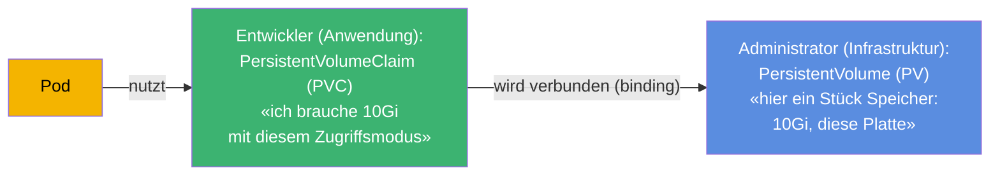
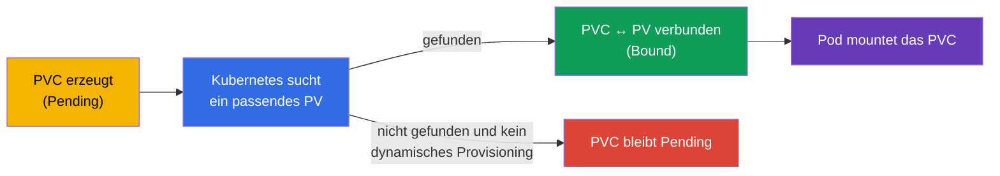
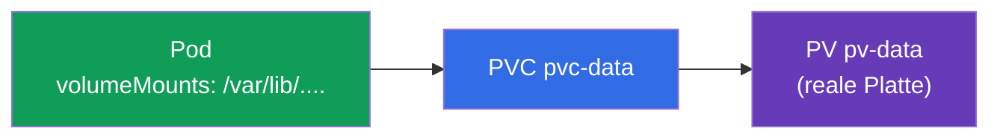
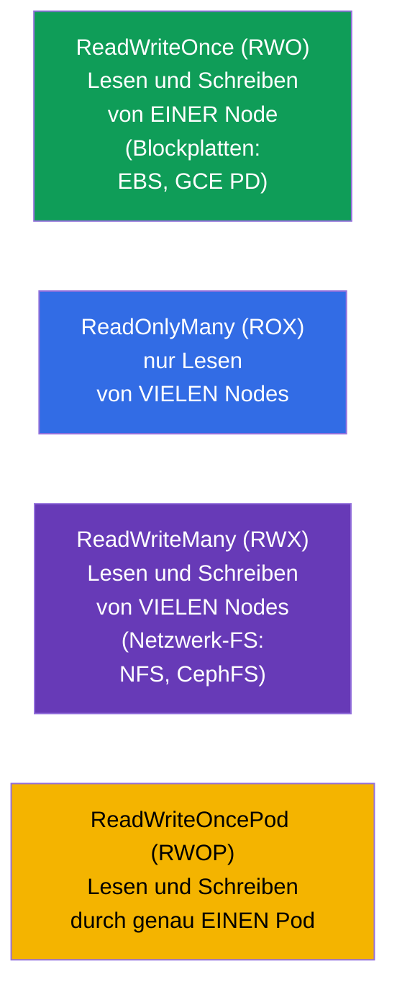
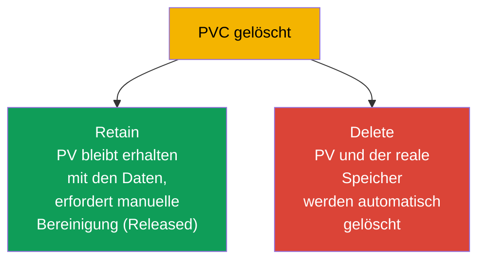

[Русская версия](ru.md) · [Eng version](README.md) · [Versión en español](es.md) · [Version française](fr.md) · [ქართული ვერსია](ge.md) · [繁體中文版](tw.md) · [日本語版](jp.md)

# Kapitel 25. Volumes, PersistentVolume und PersistentVolumeClaim

> **Was kommt.** Im vorigen Kapitel lebten die Volumes zusammen mit dem Pod. Jetzt geht es
> um Speicher, der den Pod **überlebt**: Datenbanken, Uploads von Benutzern, alle
> wertvollen Daten. Kubernetes trennt das „Stück Speicher“ (**PersistentVolume, PV**) und
> die „Anforderung von Speicher“ (**PersistentVolumeClaim, PVC**). Diese Trennung und die
> Kette PV↔PVC↔Pod zu verstehen - das ist das Ziel des Kapitels. Das ist die Domäne Storage
> beider Prüfungen (CKA 10%, Teil von Application Design bei CKAD).

## 25.1. Das Problem: wie gibt man einem Pod dauerhaften Speicher

Ein Pod ist ephemer, die Daten einer Datenbank sind es nicht. Gebraucht wird Speicher, der
unabhängig vom Pod lebt. Doch es gibt eine Schwierigkeit: der Entwickler der Anwendung
sollte die Details der Speicherinfrastruktur nicht kennen müssen (welche Platte, in welcher
Cloud, über welches Protokoll). Kubernetes trennt die Verantwortung:



- **PV** - ein „Angebot“ an Speicher: ein reales Stück Platte/Volume, beschrieben als
  Objekt des Clusters. Üblicherweise verwaltet es der Administrator (oder es wird
  automatisch erzeugt - Kapitel 26).
- **PVC** - eine „Anforderung“ von Speicher durch die Anwendung: wie viel gebraucht wird
  und mit welchem Zugriffsmodus.
- **Der Pod** nutzt das PVC, nicht das PV direkt. Kubernetes verbindet das PVC selbst mit
  einem passenden PV.

Diese Trennung ist wie Steckdose und Stecker: die Anwendung (der Stecker) verlangt eine
standardisierte Schnittstelle, und welches Kraftwerk hinter der Steckdose (dem PV) steht,
ist ihre Sache nicht.

## 25.2. Der Lebenszyklus: binding

Wird ein PVC erzeugt, sucht Kubernetes ein passendes PV (nach Größe, Zugriffsmodus, Klasse)
und **verbindet** sie (binding). Danach gehört das PV eins zu eins diesem PVC.



Die Status, die in `kubectl get pv,pvc` zu sehen sind:

| Status | Bedeutung |
|--------|----------|
| `Available` | PV ist frei, an niemanden gebunden |
| `Bound` | PV/PVC sind miteinander verbunden |
| `Pending` | PVC wartet auf ein passendes PV |
| `Released` | PVC wurde gelöscht, das PV ist aber noch nicht bereinigt |

„Das PVC hängt in Pending“ - eine häufige Situation: es gibt kein passendes PV und kein
eingerichtetes dynamisches Provisioning (Kapitel 26). Das ist das Erste, was man beim
Debuggen von Speicher prüft.

## 25.3. Die Manifeste von PV und PVC

**PersistentVolume:**

```yaml
apiVersion: v1
kind: PersistentVolume
metadata:
  name: pv-data
spec:
  capacity:
    storage: 10Gi
  accessModes:
  - ReadWriteOnce
  persistentVolumeReclaimPolicy: Retain
  storageClassName: manual
  hostPath:                    # Art des Speichers (als Beispiel; in der Produktion — Cloud-Platte/NFS)
    path: /mnt/data
```

**PersistentVolumeClaim:**

```yaml
apiVersion: v1
kind: PersistentVolumeClaim
metadata:
  name: pvc-data
spec:
  accessModes:
  - ReadWriteOnce
  resources:
    requests:
      storage: 10Gi
  storageClassName: manual
```

Damit sich ein PVC mit einem PV verbindet, müssen sie **kompatibel** sein: die Größe (PV ≥
Anforderung des PVC), `accessModes` und `storageClassName`.

## 25.4. Das PVC an einen Pod anbinden

Der Pod verweist auf das PVC wie auf ein Volume:

```yaml
spec:
  containers:
  - name: app
    image: postgres
    volumeMounts:
    - name: data
      mountPath: /var/lib/postgresql/data
  volumes:
  - name: data
    persistentVolumeClaim:
      claimName: pvc-data
```



Die Anwendung sieht ein gewöhnliches gemountetes Verzeichnis; dahinter steht das PVC,
hinter dem PVC das PV, hinter dem PV der reale Speicher. Wird der Pod neu erzeugt, bleiben
die Daten auf dem PV.

## 25.5. Access modes: die Zugriffsmodi

`accessModes` beschreibt, wie ein Volume gemountet werden kann. Das ist eine häufige Frage.



| Modus | Bedeutung | Wer kann mounten |
|-------|-------------|----------------------|
| `ReadWriteOnce` (RWO) | Lesen und Schreiben | eine Node |
| `ReadOnlyMany` (ROX) | nur Lesen | viele Nodes |
| `ReadWriteMany` (RWX) | Lesen und Schreiben | viele Nodes |
| `ReadWriteOncePod` (RWOP) | Lesen und Schreiben | genau ein Pod |

Eine wichtige Feinheit: **RWO bedeutet „eine Node“, nicht „ein Pod“** - mehrere Pods auf
derselben Node können sich ein RWO-Volume teilen. Die meisten Cloud-Blockplatten (EBS, GCE
PD) sind nur RWO. Für Zugriff von vielen Nodes (RWX) braucht man ein Netzwerk-Dateisystem
(NFS, CephFS, EFS).

## 25.6. Reclaim policy: was mit dem PV nach dem Löschen des PVC passiert

Wenn ein PVC gelöscht wird, was geschieht dann mit dem PV und den Daten? Das legt
`persistentVolumeReclaimPolicy` fest.



| Policy | Verhalten beim Löschen des PVC | Wann |
|----------|----------------------------|-------|
| `Retain` | PV und Daten bleiben erhalten, PV → `Released`, manuell bereinigen | wertvolle Daten |
| `Delete` | PV und realer Speicher werden automatisch gelöscht | temporäre/dynamische Volumes |

`Retain` ist die sichere Variante für wichtige Daten (das PVC versehentlich gelöscht - die
Daten sind intakt, das PV wird wiederverwendet). `Delete` ist bequem für dynamisch erzeugte
Volumes (Kapitel 26), aber das Löschen des PVC nimmt die Daten mit - Vorsicht.

> Es gab noch die Policy `Recycle` (sie überschrieb die Daten und gab das PV in den Pool
> zurück), sie ist jedoch veraltet und wird nicht mehr verwendet.

## 25.7. Erweiterung des Volumes

Ein PVC lässt sich erweitern (wenn die StorageClass es erlaubt,
`allowVolumeExpansion: true`) - einfach indem man die angeforderte Größe erhöht:

```bash
kubectl edit pvc pvc-data      # requests.storage auf einen größeren Wert ändern
```

Volumes verkleinern ist nicht möglich. Erweiterung ist eine häufige Operation in der
Produktion (Daten wachsen), und bequemer erledigt man sie über dynamisches Provisioning
(Kapitel 26).

## 25.8. Wie man das in der Produktion anwendet

- **PVC + dynamisches Provisioning ist die Norm.** In der Produktion erzeugt kaum jemand PV
  von Hand: sie werden automatisch von der StorageClass auf Anforderung eines PVC erzeugt
  (Kapitel 26). Der Entwickler schreibt nur das PVC, die Infrastruktur gibt die Platte
  selbst heraus.
- **Der Access mode bestimmt die Architektur.** Die meisten Cloud-Platten sind RWO (eine
  Node), deshalb sind Datenbanken darauf ein StatefulSet mit einem Volume pro Pod
  (Kapitel 11). Für den gemeinsamen Zugriff vieler Pods (RWX) nimmt man NFS/EFS/CephFS -
  und ist sich bewusst, dass das eine andere Performance und andere Kosten bedeutet.
- **Die Reclaim policy schützt die Daten.** Für Produktionsdaten setzt man `Retain` (oder
  sehr vorsichtig `Delete`), damit ein versehentliches Löschen von PVC/Namespace nicht die
  Datenbank zerstört. Datenverlust wegen `Delete` ist ein realer und schmerzhafter Vorfall.
- **Monitoring der Füllung und Erweiterung.** Volumes werden in der Produktion auf die
  Füllung überwacht und vorab erweitert (`allowVolumeExpansion`), um nicht bei 100%
  anzustoßen und die Anwendung nicht umzuwerfen.
- **Stateful im Cluster ist eine bewusste Entscheidung.** Viele Teams bevorzugen verwaltete
  Datenbanken (RDS/Cloud SQL) anstelle von PV im Cluster - weniger Risiken bei Backups und
  Ausfallsicherheit des Speichers.

## 25.9. Mini-Glossar

- **PersistentVolume (PV)** - Objekt, das ein „Stück Speicher“ im Cluster darstellt.
- **PersistentVolumeClaim (PVC)** - Anforderung der Anwendung an Speicher (Größe, Modus).
- **Binding** - das Verbinden eines passenden PV mit einem PVC (eins zu eins).
- **accessModes** - Zugriffsmodi: RWO, ROX, RWX, RWOP.
- **ReadWriteOnce** - Lesen und Schreiben von einer Node (nicht von einem Pod!).
- **ReadWriteMany** - Lesen und Schreiben von vielen Nodes (braucht ein Netzwerk-FS).
- **reclaimPolicy** - das Schicksal des PV nach dem Löschen des PVC: Retain / Delete.
- **allowVolumeExpansion** - ob das Erweitern des Volumes erlaubt ist.
- **Status von PV/PVC** - Available, Bound, Pending, Released.

## 25.10. Zusammenfassung des Kapitels

- Für Daten, die den Pod überleben, ist der Speicher getrennt in PV (Stück Speicher,
  Infrastruktur) und PVC (Anforderung der Anwendung); der Pod nutzt das PVC, nicht das PV
  direkt.
- Kubernetes verbindet (binding) das PVC mit einem passenden PV nach Größe, accessModes und
  storageClassName; Status Available/Bound/Pending/Released.
- Das PVC wird als Volume in den Pod gemountet (`persistentVolumeClaim`); die Daten bleiben
  beim Neuerzeugen des Pods erhalten.
- accessModes: RWO (eine Node), ROX (viele Nodes, Lesen), RWX (viele Nodes, Schreiben,
  braucht ein Netzwerk-FS), RWOP (ein Pod). RWO betrifft die Node, nicht den Pod.
- reclaimPolicy: Retain (Daten behalten, manuell bereinigen) gegen Delete (alles
  automatisch löschen).
- Ein Volume kann erweitert werden (wenn die StorageClass es erlaubt), verkleinern ist
  nicht möglich.

## 25.11. Wofür das nützlich ist: in der Prüfung und in der echten Arbeit

**In der Prüfung.** „Erzeuge ein PV und ein PVC, verbinde sie, mounte sie in einen Pod“,
„warum ist das PVC in Pending“, „welchen accessMode wählen“, „was passiert mit den Daten
beim Löschen des PVC (reclaimPolicy)“ - typische Aufgaben der Domäne Storage. Man muss
beide Manifeste schreiben können und die Kompatibilität von PV/PVC sowie die Status
verstehen.

**In der echten Arbeit.** PV/PVC sind die Grundlage der Speicherung von Zustand im Cluster.
Das Verständnis der access modes bestimmt die Architektur (RWO → StatefulSet, RWX →
Netzwerk-FS), und die reclaimPolicy verantwortet direkt die Sicherheit der Daten. Das
Debuggen eines Pending-PVC und die Erweiterung von Volumes sind häufige Betriebsaufgaben.

## 25.12. Fragen zur Selbstüberprüfung

1. Wozu ist der Speicher in PV und PVC getrennt? Wer ist für was verantwortlich?
2. Was ist binding und warum kann ein PVC in Pending festhängen?
3. Wie nutzt ein Pod ein PVC und was passiert mit den Daten beim Neuerzeugen des Pods?
4. Was bedeutet ReadWriteOnce - „ein Pod“ oder „eine Node“? Was braucht man für RWX?
5. Worin unterscheiden sich reclaimPolicy Retain und Delete? Wann wählt man was?
6. Kann man ein Volume erweitern und verkleinern? Wovon hängt die Erweiterung ab?
7. Welche Status haben PV/PVC und was bedeutet jeder davon?

## Praxis

Wir haben die manuelle Verwaltung von Speicher behandelt. In Kapitel 26 automatisieren wir
sie: StorageClass und dynamisches Provisioning erzeugen PV auf Anforderung eines PVC selbst,
und wir kommen auch auf die Speicherung im StatefulSet zurück. PV/PVC werden in den Labs zum
Speicher geübt.

🧪 Lab 108 (PV/PVC): [tasks/cka/labs/108](../../labs/108/README_DE.MD)

---
[Inhalt](../README_DE.md) · [Kapitel 24](../24/de.md) · [Kapitel 26](../26/de.md)
