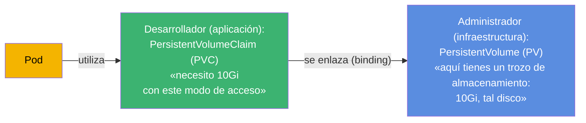
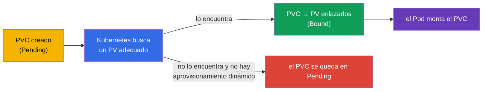
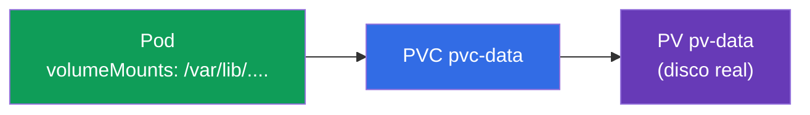
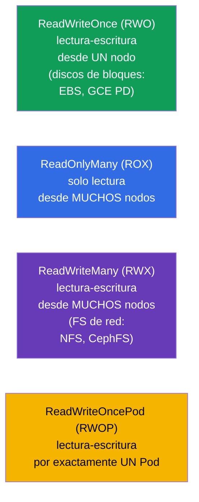
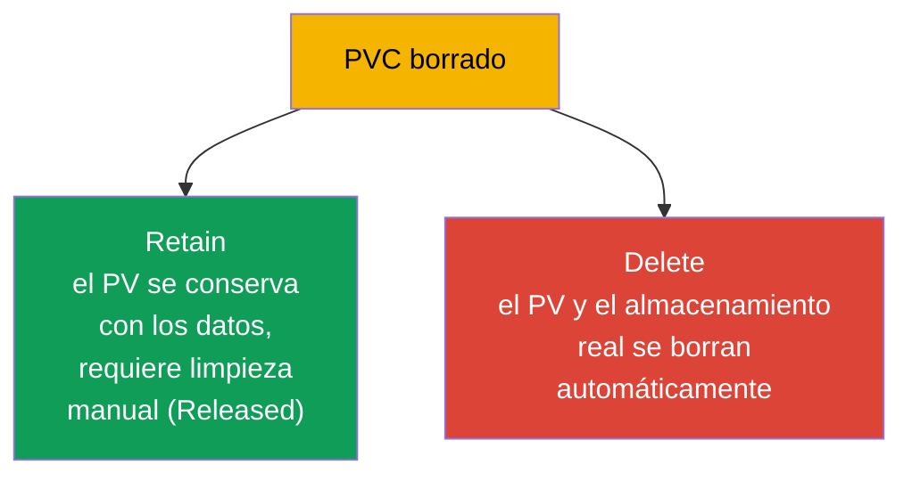

[Русская версия](ru.md) · [Eng version](README.md) · [Version française](fr.md) · [Deutsche Version](de.md) · [ქართული ვერსია](ge.md)

# Capítulo 25. Volumes, PersistentVolume y PersistentVolumeClaim

> **Qué viene ahora.** En el capítulo anterior los volúmenes vivían junto con el Pod. Ahora
> toca el almacenamiento que **sobrevive** al Pod: bases de datos, subidas de usuarios,
> cualquier dato valioso. Kubernetes separa el «trozo de almacenamiento»
> (**PersistentVolume, PV**) de la «solicitud de almacenamiento»
> (**PersistentVolumeClaim, PVC**). Entender esa separación y el enlace PV↔PVC↔Pod es el
> objetivo del capítulo. Es el dominio Storage de ambos exámenes (CKA 10%, parte de
> Application Design en CKAD).

## 25.1. El problema: cómo dar a un Pod almacenamiento permanente

El Pod es efímero, los datos de una base de datos no. Hace falta almacenamiento que viva
independientemente del Pod. Pero hay una dificultad: el desarrollador de la aplicación no
debería conocer los detalles de la infraestructura de almacenamiento (qué disco, en qué
nube, con qué protocolo). Kubernetes reparte las responsabilidades:



- **PV** - la «oferta» de almacenamiento: un trozo real de disco/volumen descrito como
  objeto del clúster. Normalmente lo gestiona el administrador (o se crea de forma
  automática - capítulo 26).
- **PVC** - la «solicitud» de almacenamiento por parte de la aplicación: cuánto necesita y
  con qué modo de acceso.
- El **Pod** usa el PVC, no el PV directamente. Kubernetes se encarga de enlazar el PVC con
  un PV adecuado.

Esta separación es como el enchufe y la clavija: la aplicación (la clavija) pide una
interfaz estándar, y qué central eléctrica hay detrás del enchufe (el PV) no es asunto
suyo.

## 25.2. Ciclo de vida: binding

Cuando se crea un PVC, Kubernetes busca un PV adecuado (por tamaño, modo de acceso, clase)
y los **enlaza** (binding). Después de eso el PV pertenece a ese PVC uno a uno.



Estados que se ven en `kubectl get pv,pvc`:

| Estado | Significado |
|--------|-------------|
| `Available` | el PV está libre, no está enlazado a nadie |
| `Bound` | PV/PVC están enlazados entre sí |
| `Pending` | el PVC espera un PV adecuado |
| `Released` | el PVC se ha borrado, pero el PV todavía no se ha limpiado |

«El PVC se queda en Pending» es una situación frecuente: no hay un PV adecuado y no está
configurado el aprovisionamiento dinámico (capítulo 26). Es lo primero que se comprueba al
depurar el almacenamiento.

## 25.3. Manifiestos de PV y PVC

**PersistentVolume:**

```yaml
apiVersion: v1
kind: PersistentVolume
metadata:
  name: pv-data
spec:
  capacity:
    storage: 10Gi
  accessModes:
  - ReadWriteOnce
  persistentVolumeReclaimPolicy: Retain
  storageClassName: manual
  hostPath:                    # tipo de almacenamiento (a modo de ejemplo; en producción - disco de nube/NFS)
    path: /mnt/data
```

**PersistentVolumeClaim:**

```yaml
apiVersion: v1
kind: PersistentVolumeClaim
metadata:
  name: pvc-data
spec:
  accessModes:
  - ReadWriteOnce
  resources:
    requests:
      storage: 10Gi
  storageClassName: manual
```

Para que el PVC se enlace con el PV, ambos deben ser **compatibles**: el tamaño (PV ≥ lo
solicitado por el PVC), `accessModes` y `storageClassName`.

## 25.4. Conectar un PVC a un Pod

El Pod referencia el PVC como un volumen:

```yaml
spec:
  containers:
  - name: app
    image: postgres
    volumeMounts:
    - name: data
      mountPath: /var/lib/postgresql/data
  volumes:
  - name: data
    persistentVolumeClaim:
      claimName: pvc-data
```



La aplicación ve un directorio montado normal; detrás está el PVC, detrás del PVC el PV, y
detrás del PV el almacenamiento real. Si el Pod se recrea, los datos siguen en el PV.

## 25.5. Access modes: modos de acceso

`accessModes` describe cómo puede montarse el volumen. Es una pregunta frecuente.



| Modo | Descripción | Quién puede montarlo |
|------|-------------|----------------------|
| `ReadWriteOnce` (RWO) | lectura-escritura | un nodo |
| `ReadOnlyMany` (ROX) | solo lectura | muchos nodos |
| `ReadWriteMany` (RWX) | lectura-escritura | muchos nodos |
| `ReadWriteOncePod` (RWOP) | lectura-escritura | exactamente un Pod |

Un matiz importante: **RWO significa «un nodo», no «un Pod»** - varios Pods del mismo nodo
pueden compartir un volumen RWO. La mayoría de los discos de bloques de nube (EBS, GCE PD)
son solo RWO. Para acceso desde muchos nodos (RWX) hace falta un sistema de ficheros de red
(NFS, CephFS, EFS).

## 25.6. Reclaim policy: qué hacer con el PV después de borrar el PVC

Cuando se borra el PVC, ¿qué ocurre con el PV y los datos? Lo determina
`persistentVolumeReclaimPolicy`.



| Política | Comportamiento al borrar el PVC | Cuándo |
|----------|---------------------------------|--------|
| `Retain` | el PV y los datos se conservan, PV → `Released`, limpieza manual | datos valiosos |
| `Delete` | el PV y el almacenamiento real se borran automáticamente | volúmenes temporales/dinámicos |

`Retain` es la opción segura para datos importantes (si borras el PVC por accidente, los
datos están intactos y reutilizas el PV). `Delete` es cómodo para volúmenes creados de
forma dinámica (capítulo 26), pero borrar el PVC se lleva los datos - cuidado.

> También existía la política `Recycle` (borraba los datos y devolvía el PV al pool), pero
> está obsoleta y no se usa.

## 25.7. Ampliación del volumen

Un PVC se puede ampliar (si el StorageClass lo permite, `allowVolumeExpansion: true`)
simplemente aumentando el tamaño solicitado:

```bash
kubectl edit pvc pvc-data      # cambiar requests.storage a un valor mayor
```

Reducir volúmenes no es posible. La ampliación es una operación frecuente en producción
(los datos crecen) y resulta más cómoda mediante el aprovisionamiento dinámico
(capítulo 26).

## 25.8. Cómo se aplica esto en producción

- **PVC + aprovisionamiento dinámico es la norma.** En producción casi nadie crea PV a mano:
  los crea automáticamente el StorageClass a partir de la solicitud del PVC (capítulo 26). El
  desarrollador escribe solo el PVC, la infraestructura entrega el disco por su cuenta.
- **El access mode dicta la arquitectura.** La mayoría de los discos de nube son RWO (un
  nodo), por eso las bases de datos sobre ellos se despliegan como StatefulSet con un volumen
  por Pod (capítulo 11). Para acceso compartido de muchos Pods (RWX) se usa NFS/EFS/CephFS -
  sabiendo que eso implica otro rendimiento y otro coste.
- **La reclaim policy protege los datos.** Para datos de producción se pone `Retain` (o
  `Delete` con mucho cuidado), para que un borrado accidental de PVC/namespace no destruya la
  base de datos. La pérdida de datos por `Delete` es un incidente real y doloroso.
- **Monitorizar el llenado y ampliar.** En producción los volúmenes se monitorizan por nivel
  de llenado y se amplían con antelación (`allowVolumeExpansion`), para no llegar al 100% y
  tumbar la aplicación.
- **Lo stateful en el clúster es una decisión consciente.** Muchos equipos prefieren bases de
  datos gestionadas (RDS/Cloud SQL) en lugar de PV en el clúster - menos riesgos con las
  copias de seguridad y con la tolerancia a fallos del almacenamiento.

## 25.9. Mini-glosario

- **PersistentVolume (PV)** - objeto que representa un «trozo de almacenamiento» en el
  clúster.
- **PersistentVolumeClaim (PVC)** - solicitud de almacenamiento por parte de la aplicación
  (tamaño, modo).
- **Binding** - enlace de un PV adecuado con un PVC (uno a uno).
- **accessModes** - modos de acceso: RWO, ROX, RWX, RWOP.
- **ReadWriteOnce** - lectura-escritura desde un nodo (¡no desde un solo Pod!).
- **ReadWriteMany** - lectura-escritura desde muchos nodos (hace falta un FS de red).
- **reclaimPolicy** - destino del PV tras borrar el PVC: Retain / Delete.
- **allowVolumeExpansion** - si está permitido ampliar el volumen.
- **Estados de PV/PVC** - Available, Bound, Pending, Released.

## 25.10. Resumen del capítulo

- Para los datos que sobreviven al Pod, el almacenamiento se divide en PV (trozo de
  almacenamiento, infraestructura) y PVC (solicitud de la aplicación); el Pod usa el PVC, no
  el PV directamente.
- Kubernetes enlaza (binding) el PVC con un PV adecuado por tamaño, accessModes y
  storageClassName; estados Available/Bound/Pending/Released.
- El PVC se monta en el Pod como un volumen (`persistentVolumeClaim`); los datos se conservan
  cuando el Pod se recrea.
- accessModes: RWO (un nodo), ROX (muchos nodos, lectura), RWX (muchos nodos, escritura, hace
  falta un FS de red), RWOP (un Pod). RWO va de nodo, no de Pod.
- reclaimPolicy: Retain (conservar los datos, limpieza manual) frente a Delete (borrar todo
  automáticamente).
- El volumen se puede ampliar (si el StorageClass lo permite), reducir no.

## 25.11. Para qué te servirá: en el examen y en el trabajo real

**En el examen.** «Crea un PV y un PVC, enlázalos, móntalos en un Pod», «por qué el PVC está
en Pending», «qué accessMode elegir», «qué pasará con los datos al borrar el PVC
(reclaimPolicy)» son tareas típicas del dominio Storage. Hay que escribir ambos manifiestos y
entender la compatibilidad PV/PVC y los estados.

**En el trabajo real.** PV/PVC son la base del almacenamiento de estado en el clúster.
Entender los access modes determina la arquitectura (RWO → StatefulSet, RWX → FS de red), y la
reclaimPolicy responde directamente de la integridad de los datos. Depurar PVC en Pending y
ampliar volúmenes son tareas operativas habituales.

## 25.12. Preguntas de autoevaluación

1. ¿Por qué el almacenamiento se divide en PV y PVC? ¿Quién responde de qué?
2. ¿Qué es el binding y por qué un PVC puede quedarse atascado en Pending?
3. ¿Cómo usa un Pod un PVC y qué ocurre con los datos cuando el Pod se recrea?
4. ¿Qué significa ReadWriteOnce, «un Pod» o «un nodo»? ¿Qué hace falta para RWX?
5. ¿En qué se diferencian las reclaimPolicy Retain y Delete? ¿Cuándo elegir cada una?
6. ¿Se puede ampliar y reducir un volumen? ¿De qué depende la ampliación?
7. ¿Qué estados tienen los PV/PVC y qué significa cada uno?

## Práctica

Hemos visto la gestión manual del almacenamiento. En el capítulo 26 la automatizamos: el
StorageClass y el aprovisionamiento dinámico crean el PV a partir de la solicitud del PVC por
su cuenta, y además volveremos al almacenamiento en StatefulSet. PV/PVC se practican en los
laboratorios de almacenamiento.

🧪 Laboratorio 108 (PV/PVC): [tasks/cka/labs/108](../../labs/108/README_ES.MD)

---
[Índice](../README_ES.md) · [Capítulo 24](../24/es.md) · [Capítulo 26](../26/es.md)
