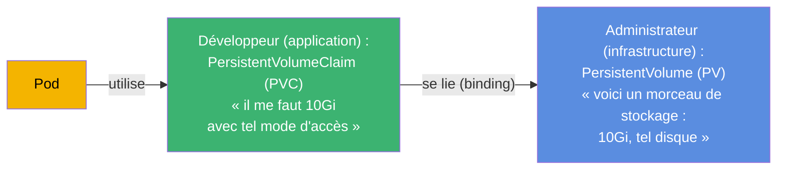
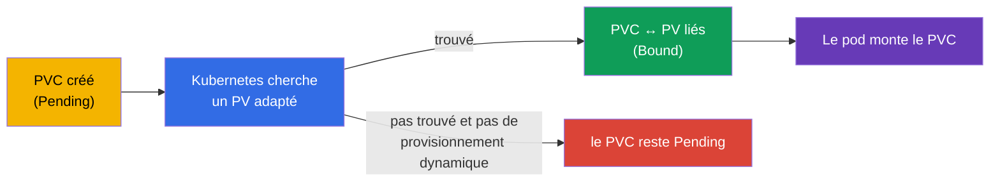
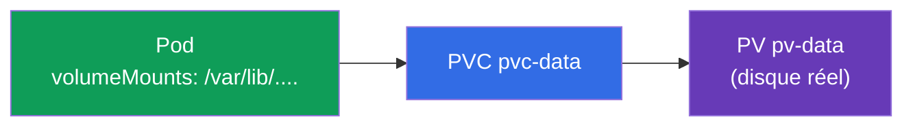
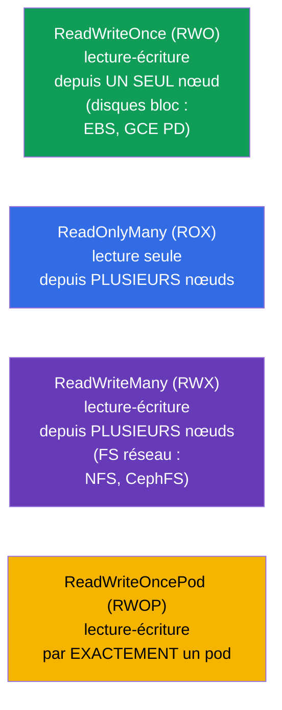
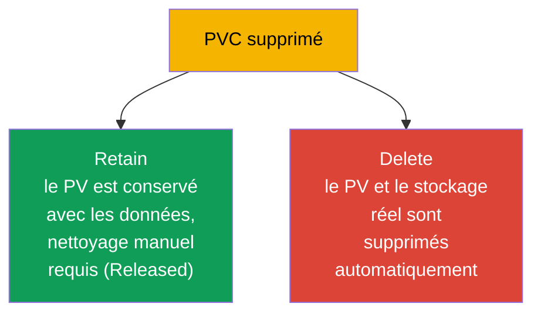

[Русская версия](ru.md) · [Eng version](README.md) · [Versión en español](es.md) · [Deutsche Version](de.md) · [ქართული ვერსია](ge.md)

# Chapitre 25. Volumes, PersistentVolume et PersistentVolumeClaim

> **Ce qui suit.** Au chapitre précédent, les volumes vivaient avec le pod. Place maintenant au
> stockage qui **survit** au pod : bases de données, fichiers envoyés par les utilisateurs,
> toutes les données précieuses. Kubernetes sépare le « morceau de stockage »
> (**PersistentVolume, PV**) et la « demande de stockage » (**PersistentVolumeClaim, PVC**).
> Comprendre cette séparation et la chaîne PV↔PVC↔Pod - voilà le but du chapitre. C'est le
> domaine Storage des deux examens (CKA 10 %, partie Application Design du CKAD).

## 25.1. Le problème : comment donner à un pod un stockage permanent

Le pod est éphémère, les données d'une base de données ne le sont pas. Il faut un stockage qui
vive indépendamment du pod. Mais il y a une difficulté : le développeur de l'application ne
doit pas connaître les détails de l'infrastructure de stockage (quel disque, dans quel cloud,
avec quel protocole). Kubernetes répartit les responsabilités :



- **PV** - l'« offre » de stockage : un vrai morceau de disque/volume, décrit comme un objet du
  cluster. C'est en général l'administrateur qui s'en occupe (ou il est créé automatiquement -
  chapitre 26).
- **PVC** - la « demande » de stockage émise par l'application : combien il en faut et avec
  quel mode d'accès.
- Le **pod** utilise un PVC, pas un PV directement. Kubernetes lie lui-même le PVC à un PV
  adapté.

Cette séparation, c'est comme la prise et la fiche : l'application (la fiche) demande une
interface standard, et la centrale électrique derrière la prise (le PV) ne la concerne pas.

## 25.2. Cycle de vie : le binding

Quand un PVC est créé, Kubernetes cherche un PV adapté (par taille, mode d'accès, classe) et
les **lie** (binding). Ensuite le PV appartient à ce PVC, un pour un.



Les statuts visibles dans `kubectl get pv,pvc` :

| Statut | Signification |
|--------|----------|
| `Available` | le PV est libre, lié à personne |
| `Bound` | PV/PVC sont liés l'un à l'autre |
| `Pending` | le PVC attend un PV adapté |
| `Released` | le PVC est supprimé, mais le PV n'est pas encore nettoyé |

« Le PVC reste bloqué en Pending » est une situation fréquente : pas de PV adapté et pas de
provisionnement dynamique configuré (chapitre 26). C'est la première chose que l'on vérifie
lors du débogage du stockage.

## 25.3. Manifestes de PV et de PVC

**PersistentVolume :**

```yaml
apiVersion: v1
kind: PersistentVolume
metadata:
  name: pv-data
spec:
  capacity:
    storage: 10Gi
  accessModes:
  - ReadWriteOnce
  persistentVolumeReclaimPolicy: Retain
  storageClassName: manual
  hostPath:                    # type de stockage (pour l'exemple ; en prod — disque cloud/NFS)
    path: /mnt/data
```

**PersistentVolumeClaim :**

```yaml
apiVersion: v1
kind: PersistentVolumeClaim
metadata:
  name: pvc-data
spec:
  accessModes:
  - ReadWriteOnce
  resources:
    requests:
      storage: 10Gi
  storageClassName: manual
```

Pour qu'un PVC se lie à un PV, ils doivent être **compatibles** : la taille (PV ≥ la demande du
PVC), les `accessModes` et le `storageClassName`.

## 25.4. Rattacher un PVC à un pod

Le pod référence le PVC comme un volume :

```yaml
spec:
  containers:
  - name: app
    image: postgres
    volumeMounts:
    - name: data
      mountPath: /var/lib/postgresql/data
  volumes:
  - name: data
    persistentVolumeClaim:
      claimName: pvc-data
```



L'application voit un répertoire monté ordinaire ; derrière lui il y a le PVC, derrière le PVC
le PV, derrière le PV le stockage réel. Le pod est recréé - les données restent sur le PV.

## 25.5. Access modes : les modes d'accès

`accessModes` décrit comment le volume peut être monté. C'est une question fréquente.



| Mode | Sens | Qui peut monter |
|-------|-------------|----------------------|
| `ReadWriteOnce` (RWO) | lecture-écriture | un nœud |
| `ReadOnlyMany` (ROX) | lecture seule | plusieurs nœuds |
| `ReadWriteMany` (RWX) | lecture-écriture | plusieurs nœuds |
| `ReadWriteOncePod` (RWOP) | lecture-écriture | exactement un pod |

Subtilité importante : **RWO signifie « un nœud », pas « un pod »** - plusieurs pods sur le même
nœud peuvent partager un volume RWO. La plupart des disques bloc des clouds (EBS, GCE PD) sont
uniquement RWO. Pour un accès depuis plusieurs nœuds (RWX), il faut un système de fichiers
réseau (NFS, CephFS, EFS).

## 25.6. Reclaim policy : que faire du PV après la suppression du PVC

Quand le PVC est supprimé, qu'arrive-t-il au PV et aux données ? C'est
`persistentVolumeReclaimPolicy` qui le définit.



| Politique | Comportement à la suppression du PVC | Quand |
|----------|----------------------------|-------|
| `Retain` | le PV et les données sont conservés, PV → `Released`, nettoyage manuel | données précieuses |
| `Delete` | le PV et le stockage réel sont supprimés automatiquement | volumes temporaires/dynamiques |

`Retain` est l'option sûre pour les données importantes (PVC supprimé par erreur - les données
sont intactes, on réutilise le PV). `Delete` est pratique pour les volumes créés
dynamiquement (chapitre 26), mais la suppression du PVC emporte les données - prudence.

> Il y avait aussi une politique `Recycle` (elle effaçait les données et rendait le PV au
> pool), mais elle est obsolète et n'est plus utilisée.

## 25.7. Extension du volume

Un PVC peut être étendu (si le StorageClass l'autorise, `allowVolumeExpansion: true`) - il
suffit d'augmenter la taille demandée :

```bash
kubectl edit pvc pvc-data      # passer requests.storage à une valeur plus grande
```

On ne peut pas réduire un volume. L'extension est une opération fréquente en prod (les données
grossissent), et il est plus commode de la faire via le provisionnement dynamique
(chapitre 26).

## 25.8. Comment cela s'applique en production

- **PVC + provisionnement dynamique est la norme.** En prod, presque personne ne crée de PV à
  la main : ils sont créés automatiquement par le StorageClass en réponse à la demande du PVC
  (chapitre 26). Le développeur n'écrit que le PVC, l'infrastructure fournit le disque
  toute seule.
- **Le mode d'accès dicte l'architecture.** La plupart des disques cloud sont RWO (un seul
  nœud), c'est pourquoi les bases de données qui s'appuient dessus sont des StatefulSet avec
  un volume par pod (chapitre 11). Pour un accès partagé par de nombreux pods (RWX) on prend
  NFS/EFS/CephFS - en sachant que la performance et le coût sont différents.
- **La reclaim policy protège les données.** Pour les données de prod on met `Retain` (ou très
  prudemment `Delete`), afin qu'une suppression accidentelle d'un PVC/namespace ne détruise pas
  la base. La perte de données à cause de `Delete` est un incident réel et douloureux.
- **Surveillance du remplissage et extension.** En prod, les volumes sont surveillés côté
  remplissage et étendus à l'avance (`allowVolumeExpansion`), pour ne pas buter sur 100 % et
  faire tomber l'application.
- **Le stateful dans le cluster est un choix assumé.** Beaucoup d'équipes préfèrent des bases
  managées (RDS/Cloud SQL) plutôt que des PV dans le cluster - moins de risques avec les
  sauvegardes et la tolérance aux pannes du stockage.

## 25.9. Mini-glossaire

- **PersistentVolume (PV)** - objet « morceau de stockage » dans le cluster.
- **PersistentVolumeClaim (PVC)** - demande de stockage émise par l'application (taille, mode).
- **Binding** - liaison d'un PV adapté avec un PVC (un pour un).
- **accessModes** - modes d'accès : RWO, ROX, RWX, RWOP.
- **ReadWriteOnce** - lecture-écriture depuis un nœud (pas un pod !).
- **ReadWriteMany** - lecture-écriture depuis plusieurs nœuds (FS réseau nécessaire).
- **reclaimPolicy** - le sort du PV après la suppression du PVC : Retain / Delete.
- **allowVolumeExpansion** - si l'extension du volume est autorisée.
- **Statuts PV/PVC** - Available, Bound, Pending, Released.

## 25.10. Bilan du chapitre

- Pour les données qui survivent au pod, le stockage est séparé en PV (morceau de stockage,
  infrastructure) et PVC (demande de l'application) ; le pod utilise le PVC, pas le PV
  directement.
- Kubernetes lie (binding) le PVC à un PV adapté par la taille, les accessModes et le
  storageClassName ; statuts Available/Bound/Pending/Released.
- Le PVC est monté dans le pod comme un volume (`persistentVolumeClaim`) ; les données restent
  lors de la recréation du pod.
- accessModes : RWO (un nœud), ROX (plusieurs nœuds, lecture), RWX (plusieurs nœuds, écriture,
  FS réseau nécessaire), RWOP (un pod). RWO parle du nœud, pas du pod.
- reclaimPolicy : Retain (conserver les données, nettoyage manuel) contre Delete (tout
  supprimer automatiquement).
- Un volume peut être étendu (si le StorageClass l'autorise), pas réduit.

## 25.11. À quoi cela sert : à l'examen et dans le travail réel

**À l'examen.** « Crée un PV et un PVC, lie-les, monte-le dans un pod », « pourquoi le PVC est
en Pending », « quel accessMode choisir », « qu'advient-il des données à la suppression du PVC
(reclaimPolicy) » - des exercices types du domaine Storage. Il faut écrire les deux manifestes,
comprendre la compatibilité PV/PVC et les statuts.

**Dans le travail réel.** PV/PVC sont la base du stockage de l'état dans le cluster. La
compréhension des access modes détermine l'architecture (RWO → StatefulSet, RWX → FS réseau),
et la reclaimPolicy répond directement de la sauvegarde des données. Le débogage d'un PVC en
Pending et l'extension des volumes sont des tâches d'exploitation fréquentes.

## 25.12. Questions d'auto-évaluation

1. Pourquoi le stockage est-il séparé en PV et PVC ? Qui est responsable de quoi ?
2. Qu'est-ce que le binding et pourquoi un PVC peut-il rester bloqué en Pending ?
3. Comment un pod utilise-t-il un PVC et qu'arrive-t-il aux données lors de la recréation du pod ?
4. Que signifie ReadWriteOnce - « un pod » ou « un nœud » ? Que faut-il pour RWX ?
5. Quelle est la différence entre les reclaimPolicy Retain et Delete ? Quand choisir laquelle ?
6. Peut-on étendre et réduire un volume ? De quoi dépend l'extension ?
7. Quels statuts existent pour les PV/PVC et que signifie chacun ?

## Pratique

Nous avons vu la gestion manuelle du stockage. Au chapitre 26 nous l'automatisons : le
StorageClass et le provisionnement dynamique créent eux-mêmes le PV en réponse à la demande du
PVC, et nous reviendrons aussi au stockage dans un StatefulSet. Les PV/PVC se travaillent dans
les TP sur le stockage.

🧪 TP 108 (PV/PVC) : [tasks/cka/labs/108](../../labs/108/README_FR.MD)

---
[Sommaire](../README_FR.md) · [Chapitre 24](../24/fr.md) · [Chapitre 26](../26/fr.md)
