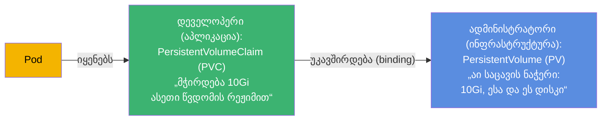
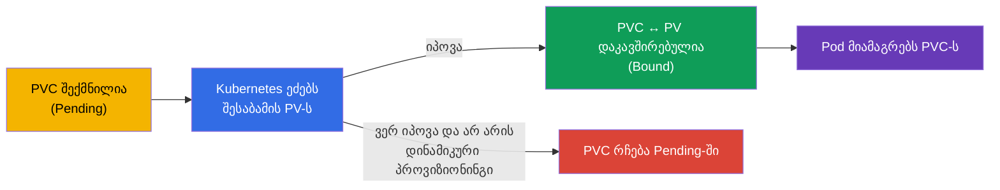
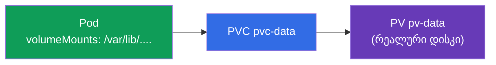
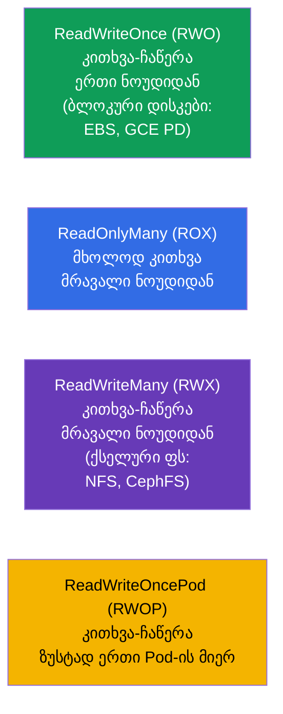
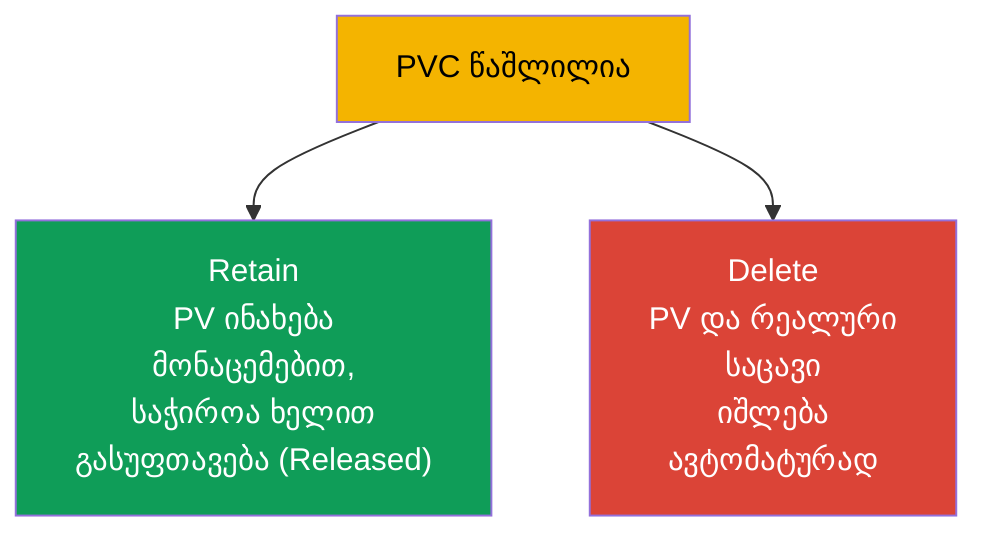

[Русская версия](ru.md) · [Eng version](README.md) · [Versión en español](es.md) · [Version française](fr.md) · [Deutsche Version](de.md) · [繁體中文版](tw.md) · [日本語版](jp.md)

# თავი 25. Volumes, PersistentVolume და PersistentVolumeClaim

> **რა იქნება შემდეგ.** წინა თავში ტომები Pod-თან ერთად ცოცხლობდნენ. ახლა - საცავი, რომელიც
> **გადაიტანს** Pod-ს: მონაცემთა ბაზები, მომხმარებლების ატვირთვები, ყველანაირი ღირებული მონაცემი.
> Kubernetes ჰყოფს „საცავის ნაჭერს“ (**PersistentVolume, PV**) და „საცავზე
> მოთხოვნას“ (**PersistentVolumeClaim, PVC**). ამ გაყოფისა და კავშირის PV↔PVC↔Pod გაგება -
> თავის მიზანია. ეს არის ორივე გამოცდის Storage-დომენი (CKA 10%, CKAD-ის Application Design-ის ნაწილი).

## 25.1. პრობლემა: როგორ მივცეთ Pod-ს მუდმივი საცავი

Pod ეფემერულია, ბდ-ის მონაცემები კი - არა. საჭიროა საცავი, რომელიც Pod-ისგან დამოუკიდებლად ცოცხლობს. მაგრამ არის
სირთულე: აპლიკაციის დეველოპერმა არ უნდა იცოდეს საცავის ინფრასტრუქტურის დეტალები (რომელი
დისკი, რომელ ღრუბელში, რომელი პროტოკოლით). Kubernetes ჰყოფს პასუხისმგებლობას:



- **PV** - საცავის „შეთავაზება“: დისკის/ტომის რეალური ნაჭერი, აღწერილი როგორც კლასტერის
  ობიექტი. ჩვეულებრივ მას ადმინისტრატორი განაგებს (ან იქმნება ავტომატურად - თავი 26).
- **PVC** - აპლიკაციის „განაცხადი“ საცავზე: რამდენი სჭირდება და რომელი წვდომის რეჟიმით.
- **Pod** იყენებს PVC-ს და არა PV-ს პირდაპირ. Kubernetes თავად აკავშირებს PVC-ს შესაბამის PV-სთან.

ეს გაყოფა - როგორც შტეფსელი და ჩანგალი: აპლიკაცია (ჩანგალი) სთხოვს სტანდარტულ ინტერფეისს, ხოლო
რა ელექტროსადგურია შტეფსელის (PV) უკან - ეს მას არ ეხება.

## 25.2. სიცოცხლის ციკლი: binding

როცა PVC იქმნება, Kubernetes ეძებს შესაბამის PV-ს (ზომით, წვდომის რეჟიმით, კლასით) და
**აკავშირებს** მათ (binding). ამის შემდეგ PV ეკუთვნის ამ PVC-ს ერთი-ერთზე.



სტატუსები, რომლებიც ჩანს `kubectl get pv,pvc`-ში:

| სტატუსი | მნიშვნელობა |
|--------|----------|
| `Available` | PV თავისუფალია, არავისთან არ არის მიბმული |
| `Bound` | PV/PVC ერთმანეთთან დაკავშირებულია |
| `Pending` | PVC ელოდება შესაბამის PV-ს |
| `Released` | PVC წაშლილია, მაგრამ PV ჯერ არ არის გასუფთავებული |

„PVC ეკიდება Pending-ში“ - ხშირი სიტუაციაა: არ არის შესაბამისი PV და არ არის კონფიგურირებული დინამიკური
პროვიზიონინგი (თავი 26). ეს არის პირველი, რასაც საცავის გამართვისას ამოწმებენ.

## 25.3. PV-ისა და PVC-ის მანიფესტები

**PersistentVolume:**

```yaml
apiVersion: v1
kind: PersistentVolume
metadata:
  name: pv-data
spec:
  capacity:
    storage: 10Gi
  accessModes:
  - ReadWriteOnce
  persistentVolumeReclaimPolicy: Retain
  storageClassName: manual
  hostPath:                    # საცავის ტიპი (მაგალითისთვის; პროდში - ღრუბლოვანი დისკი/NFS)
    path: /mnt/data
```

**PersistentVolumeClaim:**

```yaml
apiVersion: v1
kind: PersistentVolumeClaim
metadata:
  name: pvc-data
spec:
  accessModes:
  - ReadWriteOnce
  resources:
    requests:
      storage: 10Gi
  storageClassName: manual
```

იმისთვის, რომ PVC დაუკავშირდეს PV-ს, მათ უნდა ჰქონდეთ **თავსებადი**: ზომა (PV ≥ PVC-ის მოთხოვნა),
`accessModes` და `storageClassName`.

## 25.4. PVC-ის მიერთება Pod-თან

Pod მიმართავს PVC-ს როგორც ტომს:

```yaml
spec:
  containers:
  - name: app
    image: postgres
    volumeMounts:
    - name: data
      mountPath: /var/lib/postgresql/data
  volumes:
  - name: data
    persistentVolumeClaim:
      claimName: pvc-data
```



აპლიკაცია ხედავს ჩვეულებრივ მიმაგრებულ კატალოგს; მის უკან - PVC, PVC-ის უკან - PV, PV-ის უკან -
რეალური საცავი. Pod ხელახლა შეიქმნა - მონაცემები რჩება PV-ზე.

## 25.5. Access modes: წვდომის რეჟიმები

`accessModes` აღწერს, როგორ შეიძლება ტომის მიმაგრება. ეს ხშირი კითხვაა.



| რეჟიმი | გაშლა | ვის შეუძლია მიმაგრება |
|-------|-------------|----------------------|
| `ReadWriteOnce` (RWO) | კითხვა-ჩაწერა | ერთი ნოუდი |
| `ReadOnlyMany` (ROX) | მხოლოდ კითხვა | მრავალი ნოუდი |
| `ReadWriteMany` (RWX) | კითხვა-ჩაწერა | მრავალი ნოუდი |
| `ReadWriteOncePod` (RWOP) | კითხვა-ჩაწერა | ზუსტად ერთი Pod |

მნიშვნელოვანი ნიუანსი: **RWO ნიშნავს „ერთ ნოუდს“ და არა „ერთ Pod-ს“** - ერთ ნოუდზე რამდენიმე Pod-ს
შეუძლია RWO-ტომის გაზიარება. ღრუბლოვანი ბლოკური დისკების უმეტესობა (EBS, GCE PD) - მხოლოდ RWO-ა.
მრავალი ნოუდიდან წვდომისთვის (RWX) საჭიროა ქსელური ფაილური სისტემა (NFS, CephFS, EFS).

## 25.6. Reclaim policy: რა ვუყოთ PV-ს PVC-ის წაშლის შემდეგ

როცა PVC-ს შლიან, რა ხდება PV-სთან და მონაცემებთან? ამას აყენებს
`persistentVolumeReclaimPolicy`.



| პოლიტიკა | ქცევა PVC-ის წაშლისას | როდის |
|----------|----------------------------|-------|
| `Retain` | PV და მონაცემები ინახება, PV → `Released`, გასუფთავება ხელით | ღირებული მონაცემები |
| `Delete` | PV და რეალური საცავი იშლება ავტომატურად | დროებითი/დინამიკური ტომები |

`Retain` - უსაფრთხო ვარიანტია მნიშვნელოვანი მონაცემებისთვის (შემთხვევით წაშალე PVC - მონაცემები ხელუხლებელია,
ხელახლა გამოიყენებ PV-ს). `Delete` მოსახერხებელია დინამიკურად შექმნილი ტომებისთვის (თავი 26), მაგრამ
PVC-ის წაშლა მონაცემებს თან მიაქვს - ფრთხილად.

> იყო კიდევ პოლიტიკა `Recycle` (შლიდა მონაცემებს და აბრუნებდა PV-ს პულში), მაგრამ ის მოძველდა და
> არ გამოიყენება.

## 25.7. ტომის გაფართოება

PVC-ის გაფართოება შეიძლება (თუ StorageClass ამას უშვებს, `allowVolumeExpansion: true`) -
უბრალოდ მოთხოვნილი ზომის გაზრდით:

```bash
kubectl edit pvc pvc-data      # requests.storage-ის შეცვლა უფრო დიდზე
```

ტომების შემცირება არ შეიძლება. გაფართოება - პროდში ხშირი ოპერაციაა (მონაცემები იზრდება), და მისი შესრულება უფრო
მოსახერხებელია დინამიკური პროვიზიონინგის მეშვეობით (თავი 26).

## 25.8. როგორ იყენებენ ამას პროდაქშენში

- **PVC + დინამიკური პროვიზიონინგი - ნორმაა.** პროდში თითქმის არავინ ქმნის PV-ს ხელით:
  მათ ავტომატურად ქმნის StorageClass PVC-ის მოთხოვნის ქვეშ (თავი 26). დეველოპერი წერს
  მხოლოდ PVC-ს, ინფრასტრუქტურა დისკს თავად გამოსცემს.
- **Access mode კარნახობს არქიტექტურას.** ღრუბლოვანი დისკების უმეტესობა - RWO-ა (ერთი კვანძი),
  ამიტომ მონაცემთა ბაზები მათზე - ეს არის StatefulSet ტომით თითოეულ Pod-ზე (თავი 11). მრავალი Pod-ის
  საერთო წვდომისთვის (RWX) იღებენ NFS/EFS/CephFS-ს - და ესმით, რომ ეს სხვა
  წარმადობა და ღირებულებაა.
- **Reclaim policy იცავს მონაცემებს.** პროდის მონაცემებისთვის აყენებენ `Retain`-ს (ან ძალიან
  ფრთხილად `Delete`-ს), რომ PVC/namespace-ის შემთხვევითმა წაშლამ ბდ არ გაანადგუროს. მონაცემების დაკარგვა
  `Delete`-ის გამო - რეალური და მტკივნეული ინციდენტია.
- **შევსების მონიტორინგი და გაფართოება.** პროდში ტომებს შევსებაზე მონიტორინგს უწევენ და წინასწარ
  აფართოებენ (`allowVolumeExpansion`), რომ 100%-ში არ ჩაეჭედონ და აპლიკაცია არ დააგდონ.
- **Stateful კლასტერში - გაცნობიერებული არჩევანია.** ბევრი გუნდი ამჯობინებს მართულ ბდ-ებს
  (RDS/Cloud SQL) კლასტერში PV-ის ნაცვლად - ნაკლები რისკია ბექაპებთან და საცავის
  ხარვეზმედეგობასთან.

## 25.9. მინი-ლექსიკონი

- **PersistentVolume (PV)** - ობიექტი-„საცავის ნაჭერი“ კლასტერში.
- **PersistentVolumeClaim (PVC)** - აპლიკაციის განაცხადი საცავზე (ზომა, რეჟიმი).
- **Binding** - შესაბამისი PV-ის დაკავშირება PVC-სთან (ერთი-ერთზე).
- **accessModes** - წვდომის რეჟიმები: RWO, ROX, RWX, RWOP.
- **ReadWriteOnce** - კითხვა-ჩაწერა ერთი ნოუდიდან (არა ერთი Pod-იდან!).
- **ReadWriteMany** - კითხვა-ჩაწერა მრავალი ნოუდიდან (საჭიროა ქსელური ფს).
- **reclaimPolicy** - PV-ის ბედი PVC-ის წაშლის შემდეგ: Retain / Delete.
- **allowVolumeExpansion** - ნებადართულია თუ არა ტომის გაფართოება.
- **PV/PVC-ის სტატუსები** - Available, Bound, Pending, Released.

## 25.10. თავის შეჯამება

- მონაცემებისთვის, რომლებიც Pod-ს გადაიტანენ, საცავი გაყოფილია PV-ად (საცავის ნაჭერი,
  ინფრასტრუქტურა) და PVC-ად (აპლიკაციის განაცხადი); Pod იყენებს PVC-ს და არა PV-ს პირდაპირ.
- Kubernetes აკავშირებს (binding) PVC-ს შესაბამის PV-სთან ზომით, accessModes-ით და
  storageClassName-ით; სტატუსები Available/Bound/Pending/Released.
- PVC მიმაგრდება Pod-ში როგორც ტომი (`persistentVolumeClaim`); მონაცემები რჩება Pod-ის
  ხელახლა შექმნისას.
- accessModes: RWO (ერთი ნოუდი), ROX (მრავალი ნოუდი, კითხვა), RWX (მრავალი ნოუდი, ჩაწერა, საჭიროა
  ქსელური ფს), RWOP (ერთი Pod). RWO - ნოუდზეა და არა Pod-ზე.
- reclaimPolicy: Retain (მონაცემების შენახვა, გასუფთავება ხელით) vs Delete (ყველაფრის წაშლა
  ავტომატურად).
- ტომის გაფართოება შეიძლება (თუ StorageClass უშვებს), შემცირება - არა.

## 25.11. როგორ გამოგადგებათ: გამოცდაზე და რეალურ სამუშაოში

**გამოცდაზე.** „შექმენი PV და PVC, დააკავშირე ისინი, მიამაგრე Pod-ში“, „რატომ არის PVC Pending-ში“,
„რომელი accessMode ავირჩიოთ“, „რა მოხდება მონაცემებთან PVC-ის წაშლისას (reclaimPolicy)“ -
Storage-დომენის ტიპური დავალებებია. საჭიროა ორივე მანიფესტის დაწერა, PV/PVC-ის თავსებადობისა
და სტატუსების გაგება.

**რეალურ სამუშაოში.** PV/PVC - კლასტერში მდგომარეობის შენახვის საფუძველია. access
modes-ის გაგება განსაზღვრავს არქიტექტურას (RWO → StatefulSet, RWX → ქსელური ფს), ხოლო reclaimPolicy
პირდაპირ პასუხისმგებელია მონაცემების დაცულობაზე. Pending-PVC-ის გამართვა და ტომების გაფართოება - ხშირი
ექსპლუატაციური ამოცანებია.

## 25.12. თვითშემოწმების კითხვები

1. რისთვის არის საცავი გაყოფილი PV-ად და PVC-ად? ვინ რისთვის აგებს პასუხს?
2. რა არის binding და რატომ შეიძლება PVC გაიჭედოს Pending-ში?
3. როგორ იყენებს Pod PVC-ს და რა ხდება მონაცემებთან Pod-ის ხელახლა შექმნისას?
4. რას ნიშნავს ReadWriteOnce - „ერთი Pod“ თუ „ერთი ნოუდი“? რა არის საჭირო RWX-ისთვის?
5. რითი განსხვავდება reclaimPolicy Retain და Delete? როდის რომელი ავირჩიოთ?
6. შეიძლება თუ არა ტომის გაფართოება და შემცირება? რაზეა დამოკიდებული გაფართოება?
7. რომელი სტატუსები აქვს PV/PVC-ს და რას ნიშნავს თითოეული?

## პრაქტიკა

ჩვენ გავარჩიეთ საცავის ხელით მართვა. თავ 26-ში მას ავტომატიზირებთ: StorageClass და
დინამიკური პროვიზიონინგი თავად ქმნიან PV-ს PVC-ის მოთხოვნის ქვეშ, ასევე დავუბრუნდებით შენახვას
StatefulSet-ში. PV/PVC მუშავდება შენახვის ლაბებში.

🧪 ლაბი 108 (PV/PVC): [tasks/cka/labs/108](../../labs/108/README_GE.MD)

🎮 Killercoda (ბრაუზერში, ინსტალაციის გარეშე): [Persistent Volumes](https://killercoda.com/chadmcrowell/course/cka/persistent-volumes) · [Using NFS volumes for Pods](https://killercoda.com/chadmcrowell/course/cka/nfs-vol) · [Troubleshoot a Stuck PVC](https://killercoda.com/chadmcrowell/course/cka/pvc-stuck)

---
[სარჩევი](../README_GE.md) · [თავი 24](../24/ge.md) · [თავი 26](../26/ge.md)
