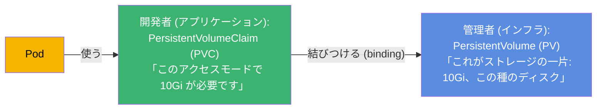
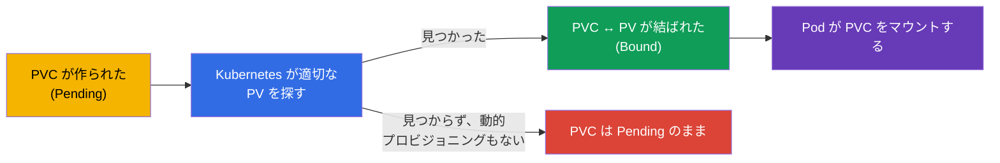
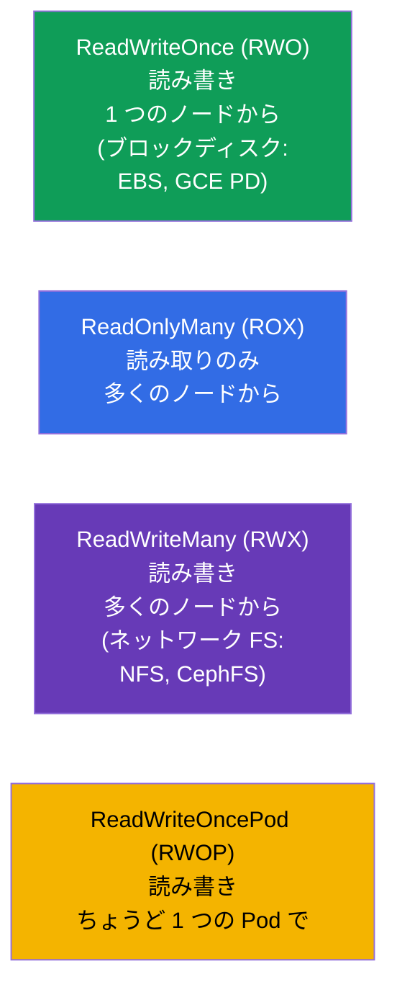
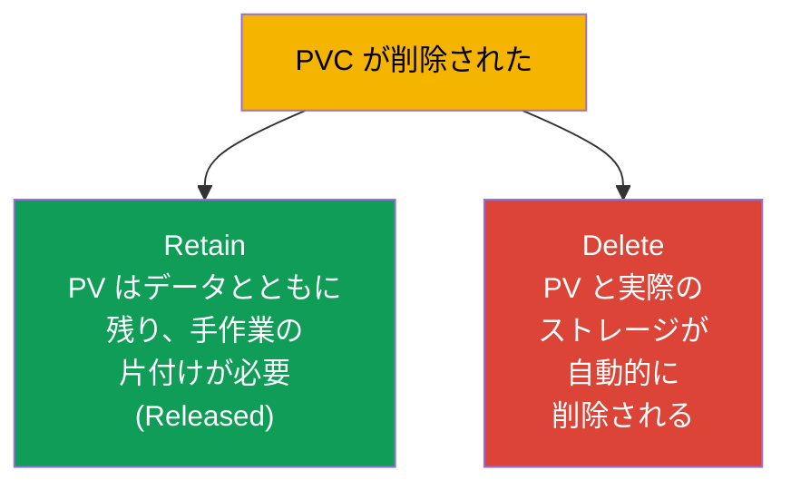

[Русская версия](ru.md) · [Eng version](README.md) · [Versión en español](es.md) · [Version française](fr.md) · [Deutsche Version](de.md) · [ქართული ვერსია](ge.md) · [繁體中文版](tw.md)

# 第 25 章。Volumes、PersistentVolume と PersistentVolumeClaim

> **次は何か。** 前の章では、ボリュームは Pod と一緒に生きていました。今回は Pod を
> **生き延びる** ストレージです：データベース、ユーザーのアップロード、あらゆる価値の
> あるデータ。Kubernetes は「ストレージの一片」(**PersistentVolume, PV**) と
> 「ストレージへの要求」(**PersistentVolumeClaim, PVC**) を分けています。この分離と
> PV↔PVC↔Pod のつながりを理解することが本章の目的です。これは両方の試験の Storage
> 領域です (CKA 10%、CKAD では Application Design の一部)。

## 25.1. 問題：Pod に永続的なストレージをどう与えるか

Pod は短命ですが、DB のデータはそうではありません。Pod とは独立して生きつづける
ストレージが必要です。しかし難しさがあります：アプリケーションの開発者は、ストレージ
基盤の詳細 (どのディスクか、どのクラウドか、どのプロトコルか) を知る必要がありません。
Kubernetes は責務を分けます：



- **PV** - ストレージの「提供」：クラスタのオブジェクトとして記述された、実際の
  ディスク/ボリュームの一片。通常は管理者が管理します (または自動で作られます - 第 26 章)。
- **PVC** - アプリケーションからのストレージの「申請」：どれだけ必要で、どのアクセス
  モードなのか。
- **Pod** は PV を直接ではなく PVC を使います。Kubernetes 自身が PVC を適切な PV に
  結びつけます。

この分離はコンセントとプラグのようなものです：アプリケーション (プラグ) は標準の
インターフェースを求め、コンセントの向こうにどんな発電所 (PV) があるかは関知しません。

## 25.2. ライフサイクル：binding

PVC が作られると、Kubernetes は適切な PV を (サイズ、アクセスモード、クラスで) 探し、
両者を **結びつけます** (binding)。それ以降、PV はその PVC に一対一で属します。



`kubectl get pv,pvc` で見えるステータス：

| ステータス | 意味 |
|--------|----------|
| `Available` | PV は空きで、どこにも紐づいていない |
| `Bound` | PV/PVC が互いに結ばれている |
| `Pending` | PVC が適切な PV を待っている |
| `Released` | PVC は削除されたが、PV はまだ片付けられていない |

「PVC が Pending のまま止まっている」はよくある状況です：適切な PV がなく、動的
プロビジョニング (第 26 章) も設定されていない。ストレージのデバッグで最初に確認する
のがこれです。

## 25.3. PV と PVC のマニフェスト

**PersistentVolume:**

```yaml
apiVersion: v1
kind: PersistentVolume
metadata:
  name: pv-data
spec:
  capacity:
    storage: 10Gi
  accessModes:
  - ReadWriteOnce
  persistentVolumeReclaimPolicy: Retain
  storageClassName: manual
  hostPath:                    # ストレージの種類 (例として。本番ではクラウドディスク/NFS)
    path: /mnt/data
```

**PersistentVolumeClaim:**

```yaml
apiVersion: v1
kind: PersistentVolumeClaim
metadata:
  name: pvc-data
spec:
  accessModes:
  - ReadWriteOnce
  resources:
    requests:
      storage: 10Gi
  storageClassName: manual
```

PVC が PV と結ばれるには、両者が **互換** である必要があります：サイズ (PV ≥ PVC の要求)、
`accessModes`、`storageClassName`。

## 25.4. PVC を Pod に接続する

Pod はボリュームとして PVC を参照します：

```yaml
spec:
  containers:
  - name: app
    image: postgres
    volumeMounts:
    - name: data
      mountPath: /var/lib/postgresql/data
  volumes:
  - name: data
    persistentVolumeClaim:
      claimName: pvc-data
```


アプリケーションが見るのは普通のマウントされたディレクトリです。その裏に PVC、PVC の裏に
PV、PV の裏に実際のストレージがあります。Pod が作り直されても、データは PV に残ります。

## 25.5. Access modes: アクセスモード

`accessModes` は、ボリュームをどのようにマウントできるかを表します。よく問われる点です。



| モード | 意味 | 誰がマウントできるか |
|-------|-------------|----------------------|
| `ReadWriteOnce` (RWO) | 読み書き | 1 つのノード |
| `ReadOnlyMany` (ROX) | 読み取りのみ | 多くのノード |
| `ReadWriteMany` (RWX) | 読み書き | 多くのノード |
| `ReadWriteOncePod` (RWOP) | 読み書き | ちょうど 1 つの Pod |

重要な機微：**RWO は「1 つのノード」を意味し、「1 つの Pod」ではありません** - 同じ
ノード上の複数の Pod は RWO のボリュームを共有できます。クラウドのブロックディスクの
ほとんど (EBS、GCE PD) は RWO だけです。多くのノードからのアクセス (RWX) には
ネットワークファイルシステム (NFS、CephFS、EFS) が必要です。

## 25.6. Reclaim policy: PVC 削除後の PV をどうするか

PVC を削除したとき、PV とデータはどうなるのでしょうか。これを決めるのが
`persistentVolumeReclaimPolicy` です。



| ポリシー | PVC 削除時のふるまい | いつ使うか |
|----------|----------------------------|-------|
| `Retain` | PV とデータが残り、PV → `Released`、手で片付ける | 価値のあるデータ |
| `Delete` | PV と実際のストレージが自動的に削除される | 一時的/動的なボリューム |

`Retain` は重要なデータにとって安全な選択です (うっかり PVC を削除してもデータは無事で、
PV を再利用できます)。`Delete` は動的に作られるボリューム (第 26 章) に便利ですが、PVC の
削除がデータを持っていってしまいます - 慎重に。

> かつては `Recycle` というポリシーもありました (データを消してから PV をプールに戻す)。
> しかしこれは非推奨になり、使われていません。

## 25.7. ボリュームの拡張

PVC は拡張できます (StorageClass がそれを許可している場合、`allowVolumeExpansion: true`) -
要求サイズを増やすだけです：

```bash
kubectl edit pvc pvc-data      # requests.storage をより大きな値に変更する
```

ボリュームを縮小することはできません。拡張は本番でよくある操作 (データは増えます) で、
動的プロビジョニング (第 26 章) 経由で行うほうが楽です。

## 25.8. 本番環境でこれをどう使うか

- **PVC + 動的プロビジョニングが標準。** 本番で PV を手作業で作る人はほとんどいません：
  PVC の要求に応じて StorageClass が自動的に作ります (第 26 章)。開発者は PVC だけを
  書き、インフラがディスクを自分で払い出します。
- **Access mode がアーキテクチャを決める。** クラウドディスクのほとんどは RWO (1 つの
  ノード) なので、その上のデータベースは Pod ごとにボリュームを持つ StatefulSet に
  なります (第 11 章)。多くの Pod からの共有アクセス (RWX) には NFS/EFS/CephFS を
  使い、性能とコストが別物であることを理解しておきます。
- **Reclaim policy がデータを守る。** 本番のデータには `Retain` を設定します (あるいは
  非常に慎重に `Delete`)。PVC/namespace のうっかり削除で DB を壊さないためです。
  `Delete` によるデータ喪失は、現実にあり、そして痛いインシデントです。
- **使用量の監視と拡張。** 本番のボリュームは使用量を監視し、前もって拡張します
  (`allowVolumeExpansion`)。100% にぶつかってアプリケーションを落とさないためです。
- **クラスタ内の stateful は意識的な選択。** 多くのチームはクラスタ内の PV より
  マネージド DB (RDS/Cloud SQL) を好みます - バックアップとストレージの耐障害性に
  関するリスクが少なくなります。

## 25.9. ミニ用語集

- **PersistentVolume (PV)** - クラスタ内の「ストレージの一片」オブジェクト。
- **PersistentVolumeClaim (PVC)** - アプリケーションからのストレージの申請 (サイズ、モード)。
- **Binding** - 適切な PV を PVC に結びつけること (一対一)。
- **accessModes** - アクセスモード：RWO、ROX、RWX、RWOP。
- **ReadWriteOnce** - 1 つのノードからの読み書き (1 つの Pod ではありません!)。
- **ReadWriteMany** - 多くのノードからの読み書き (ネットワーク FS が必要)。
- **reclaimPolicy** - PVC 削除後の PV の運命：Retain / Delete。
- **allowVolumeExpansion** - ボリュームの拡張が許されているか。
- **PV/PVC のステータス** - Available、Bound、Pending、Released。

## 25.10. 本章のまとめ

- Pod を生き延びるデータのために、ストレージは PV (ストレージの一片、インフラ) と
  PVC (アプリケーションの申請) に分かれています。Pod は PV を直接ではなく PVC を使います。
- Kubernetes はサイズ、accessModes、storageClassName にもとづいて PVC を適切な PV に
  結びつけます (binding)。ステータスは Available/Bound/Pending/Released。
- PVC はボリュームとして Pod にマウントされます (`persistentVolumeClaim`)。Pod を
  作り直してもデータは残ります。
- accessModes: RWO (1 つのノード)、ROX (多くのノード、読み取り)、RWX (多くのノード、
  書き込み、ネットワーク FS が必要)、RWOP (1 つの Pod)。RWO はノードの話で、Pod の話ではありません。
- reclaimPolicy: Retain (データを残し、手で片付ける) と Delete (すべて自動的に削除) の
  対比。
- ボリュームは拡張できます (StorageClass が許可していれば)。縮小はできません。

## 25.11. これがどう役に立つか：試験と実際の仕事で

**試験では。** 「PV と PVC を作り、結びつけ、Pod にマウントせよ」「なぜ PVC が Pending
なのか」「どの accessMode を選ぶか」「PVC 削除時にデータはどうなるか (reclaimPolicy)」 -
Storage 領域の典型的な課題です。両方のマニフェストを書けて、PV/PVC の互換性と
ステータスを理解している必要があります。

**実際の仕事では。** PV/PVC はクラスタ内で状態を保持するための土台です。access modes の
理解がアーキテクチャを決め (RWO → StatefulSet、RWX → ネットワーク FS)、reclaimPolicy は
データの保全に直接関わります。Pending の PVC のデバッグとボリュームの拡張は、
よくある運用作業です。

## 25.12. 自己チェックの質問

1. なぜストレージは PV と PVC に分かれているのですか？誰が何に責任を持ちますか？
2. binding とは何ですか。そしてなぜ PVC は Pending で止まることがあるのですか？
3. Pod はどのように PVC を使いますか。Pod を作り直したときデータはどうなりますか？
4. ReadWriteOnce は「1 つの Pod」ですか、それとも「1 つのノード」ですか？RWX には何が必要ですか？
5. reclaimPolicy の Retain と Delete はどう違いますか。どちらをいつ選びますか？
6. ボリュームは拡張できますか、縮小できますか。拡張は何に依存しますか？
7. PV/PVC にはどんなステータスがあり、それぞれ何を意味しますか？

## 演習

手作業でのストレージ管理を見てきました。第 26 章ではそれを自動化します：StorageClass と
動的プロビジョニングが PVC の要求に応じて PV を自分で作ります。また StatefulSet における
ストレージにも戻ります。PV/PVC はストレージ関連のラボで練習します。

🧪 ラボ 108 (PV/PVC): [tasks/cka/labs/108](../../labs/108/README_JP.MD)

🎮 Killercoda（ブラウザ内、セットアップ不要）：[Persistent Volumes](https://killercoda.com/chadmcrowell/course/cka/persistent-volumes) · [Using NFS volumes for Pods](https://killercoda.com/chadmcrowell/course/cka/nfs-vol) · [Troubleshoot a Stuck PVC](https://killercoda.com/chadmcrowell/course/cka/pvc-stuck)

---
[目次](../README_JP.md) · [第 24 章](../24/jp.md) · [第 26 章](../26/jp.md)
