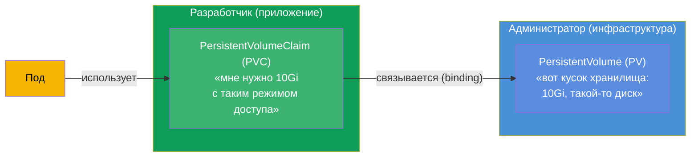
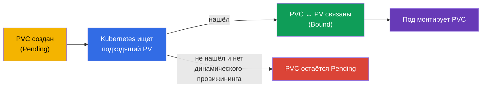
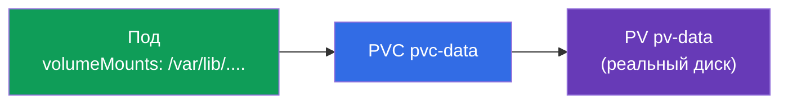
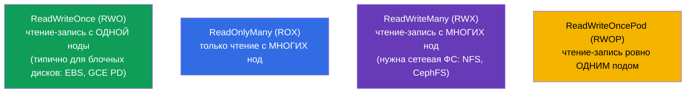
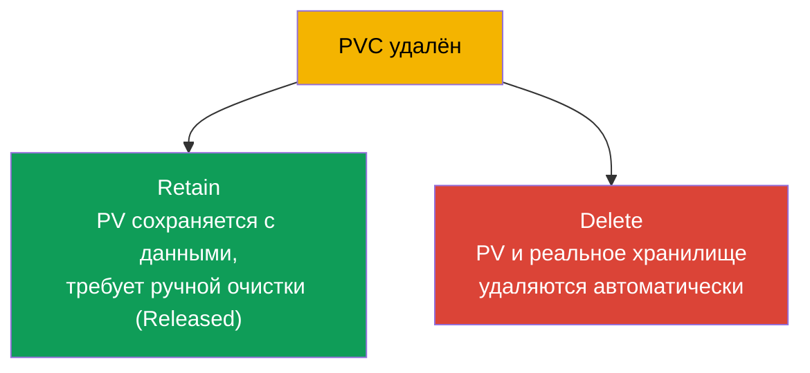

# Глава 25. Volumes, PersistentVolume и PersistentVolumeClaim

> **Что дальше.** В прошлой главе тома жили вместе с подом. Теперь - хранилище, которое
> **переживает** под: базы данных, загрузки пользователей, любые ценные данные.
> Kubernetes разделяет «кусок хранилища» (**PersistentVolume, PV**) и «запрос на
> хранилище» (**PersistentVolumeClaim, PVC**). Понять это разделение и связку PV↔PVC↔Pod -
> цель главы. Это домен Storage обоих экзаменов (CKA 10%, часть Application Design CKAD).

## 25.1. Проблема: как дать поду постоянное хранилище

Под эфемерен, а данные БД - нет. Нужно хранилище, живущее независимо от пода. Но есть
сложность: разработчик приложения не должен знать детали инфраструктуры хранения (какой
диск, в каком облаке, по какому протоколу). Kubernetes разделяет ответственность:



- **PV** - «предложение» хранилища: реальный кусок диска/тома, описанный как объект
  кластера. Обычно им заведует администратор (или создаётся автоматически - глава 26).
- **PVC** - «заявка» на хранилище от приложения: сколько нужно и с каким режимом доступа.
- **Под** использует PVC, а не PV напрямую. Kubernetes сам связывает PVC с подходящим PV.

Это разделение - как розетка и вилка: приложение (вилка) просит стандартный интерфейс, а
что за электростанция за розеткой (PV) - его не касается.

## 25.2. Жизненный цикл: binding

Когда создаётся PVC, Kubernetes ищет подходящий PV (по размеру, режиму доступа, классу) и
**связывает** их (binding). После этого PV принадлежит этому PVC один к одному.



Статусы, которые видно в `kubectl get pv,pvc`:

| Статус | Значение |
|--------|----------|
| `Available` | PV свободен, ни к кому не привязан |
| `Bound` | PV/PVC связаны друг с другом |
| `Pending` | PVC ждёт подходящего PV |
| `Released` | PVC удалён, но PV ещё не очищен |

«PVC висит в Pending» - частая ситуация: нет подходящего PV и не настроен динамический
провижининг (глава 26). Это первое, что проверяют при отладке хранилища.

## 25.3. Манифесты PV и PVC

**PersistentVolume:**

```yaml
apiVersion: v1
kind: PersistentVolume
metadata:
  name: pv-data
spec:
  capacity:
    storage: 10Gi
  accessModes:
  - ReadWriteOnce
  persistentVolumeReclaimPolicy: Retain
  storageClassName: manual
  hostPath:                    # тип хранилища (для примера; в проде — облачный диск/NFS)
    path: /mnt/data
```

**PersistentVolumeClaim:**

```yaml
apiVersion: v1
kind: PersistentVolumeClaim
metadata:
  name: pvc-data
spec:
  accessModes:
  - ReadWriteOnce
  resources:
    requests:
      storage: 10Gi
  storageClassName: manual
```

Чтобы PVC связался с PV, у них должны быть **совместимы**: размер (PV ≥ запроса PVC),
`accessModes` и `storageClassName`.

## 25.4. Подключение PVC к поду

Под ссылается на PVC как на том:

```yaml
spec:
  containers:
  - name: app
    image: postgres
    volumeMounts:
    - name: data
      mountPath: /var/lib/postgresql/data
  volumes:
  - name: data
    persistentVolumeClaim:
      claimName: pvc-data
```



Приложение видит обычный смонтированный каталог; за ним - PVC, за PVC - PV, за PV -
реальное хранилище. Пересоздался под - данные остаются на PV.

## 25.5. Access modes: режимы доступа

`accessModes` описывает, как том может монтироваться. Это частый вопрос.



| Режим | Расшифровка | Кто может монтировать |
|-------|-------------|----------------------|
| `ReadWriteOnce` (RWO) | чтение-запись | одна нода |
| `ReadOnlyMany` (ROX) | только чтение | много нод |
| `ReadWriteMany` (RWX) | чтение-запись | много нод |
| `ReadWriteOncePod` (RWOP) | чтение-запись | ровно один под |

Важная тонкость: **RWO означает «одна нода», а не «один под»** - несколько подов на одной
ноде могут делить RWO-том. Большинство облачных блочных дисков (EBS, GCE PD) - только RWO.
Для доступа с многих нод (RWX) нужна сетевая файловая система (NFS, CephFS, EFS).

## 25.6. Reclaim policy: что делать с PV после удаления PVC

Когда PVC удаляют, что происходит с PV и данными? Это задаёт
`persistentVolumeReclaimPolicy`.



| Политика | Поведение при удалении PVC | Когда |
|----------|----------------------------|-------|
| `Retain` | PV и данные сохраняются, PV → `Released`, чистить вручную | ценные данные |
| `Delete` | PV и реальное хранилище удаляются автоматически | временные/динамические тома |

`Retain` - безопасный вариант для важных данных (случайно удалил PVC - данные целы,
переиспользуешь PV). `Delete` удобен для динамически создаваемых томов (глава 26), но
удаление PVC уносит данные - осторожно.

> Была ещё политика `Recycle` (затирала данные и возвращала PV в пул), но она устарела и
> не используется.

## 25.7. Расширение тома

PVC можно расширить (если StorageClass это разрешает, `allowVolumeExpansion: true`) -
просто увеличив запрошенный размер:

```bash
kubectl edit pvc pvc-data      # поменять requests.storage на больший
```

Уменьшать тома нельзя. Расширение - частая операция в проде (данные растут), и её удобнее
делать через динамический провижининг (глава 26).

## 25.8. Как это применяют в продакшене

- **PVC + динамический провижининг - норма.** В проде почти никто не создаёт PV вручную:
  их автоматически создаёт StorageClass под запрос PVC (глава 26). Разработчик пишет
  только PVC, инфраструктура выдаёт диск сама.
- **Access mode диктует архитектуру.** Большинство облачных дисков - RWO (один узел),
  поэтому базы данных на них - это StatefulSet с томом на каждый под (глава 11). Для
  общего доступа многих подов (RWX) берут NFS/EFS/CephFS - и понимают, что это другая
  производительность и стоимость.
- **Reclaim policy защищает данные.** Для продовых данных ставят `Retain` (или очень
  аккуратно `Delete`), чтобы случайное удаление PVC/namespace не уничтожило БД. Потеря
  данных из-за `Delete` - реальный и болезненный инцидент.
- **Мониторинг заполнения и расширение.** Тома в проде мониторят на заполнение и заранее
  расширяют (`allowVolumeExpansion`), чтобы не упереться в 100% и не уронить приложение.
- **Stateful в кластере - осознанный выбор.** Многие команды предпочитают управляемые БД
  (RDS/Cloud SQL) вместо PV в кластере - меньше рисков с бэкапами и отказоустойчивостью
  хранилища.

## 25.9. Мини-глоссарий

- **PersistentVolume (PV)** - объект-«кусок хранилища» в кластере.
- **PersistentVolumeClaim (PVC)** - заявка приложения на хранилище (размер, режим).
- **Binding** - связывание подходящего PV с PVC (один к одному).
- **accessModes** - режимы доступа: RWO, ROX, RWX, RWOP.
- **ReadWriteOnce** - чтение-запись с одной ноды (не одного пода!).
- **ReadWriteMany** - чтение-запись с многих нод (нужна сетевая ФС).
- **reclaimPolicy** - судьба PV после удаления PVC: Retain / Delete.
- **allowVolumeExpansion** - разрешено ли расширять том.
- **Статусы PV/PVC** - Available, Bound, Pending, Released.

## 25.10. Итоги главы

- Для данных, переживающих под, хранилище разделено на PV (кусок хранилища,
  инфраструктура) и PVC (заявка приложения); под использует PVC, не PV напрямую.
- Kubernetes связывает (binding) PVC с подходящим PV по размеру, accessModes и
  storageClassName; статусы Available/Bound/Pending/Released.
- PVC монтируется в под как том (`persistentVolumeClaim`); данные остаются при
  пересоздании пода.
- accessModes: RWO (одна нода), ROX (много нод, чтение), RWX (много нод, запись, нужна
  сетевая ФС), RWOP (один под). RWO - про ноду, а не под.
- reclaimPolicy: Retain (сохранить данные, чистить вручную) vs Delete (удалить всё
  автоматически).
- Том можно расширить (если разрешено StorageClass), уменьшить нельзя.

## 25.11. Как это пригодится: на экзамене и в реальной работе

**На экзамене.** «Создай PV и PVC, свяжи их, смонтируй в под», «почему PVC в Pending»,
«какой accessMode выбрать», «что будет с данными при удалении PVC (reclaimPolicy)» -
типовые задания домена Storage. Нужно писать оба манифеста, понимать совместимость PV/PVC
и статусы.

**В реальной работе.** PV/PVC - основа хранения состояния в кластере. Понимание access
modes определяет архитектуру (RWO → StatefulSet, RWX → сетевая ФС), а reclaimPolicy
напрямую отвечает за сохранность данных. Отладка Pending-PVC и расширение томов - частые
эксплуатационные задачи.

## 25.12. Вопросы для самопроверки

1. Зачем хранилище разделено на PV и PVC? Кто за что отвечает?
2. Что такое binding и почему PVC может застрять в Pending?
3. Как под использует PVC и что происходит с данными при пересоздании пода?
4. Что означает ReadWriteOnce - «один под» или «одна нода»? Что нужно для RWX?
5. Чем отличаются reclaimPolicy Retain и Delete? Когда какой выбрать?
6. Можно ли расширить и уменьшить том? От чего зависит расширение?
7. Какие статусы бывают у PV/PVC и что каждый означает?

## Практика

Мы разобрали ручное управление хранилищем. В главе 26 автоматизируем его: StorageClass и
динамический провижининг создают PV под запрос PVC сами, а также вернёмся к хранению в
StatefulSet. PV/PVC отрабатываются в лабах по хранению.

🧪 Лаба 108 (PV/PVC): [tasks/cka/labs/108](../../labs/108/README_RU.MD)

---
[Оглавление](../README_RU.md) · [Глава 24](../24/ru.md) · [Глава 26](../26/ru.md)
