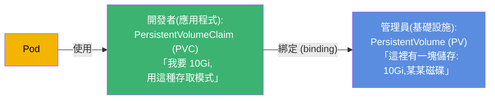
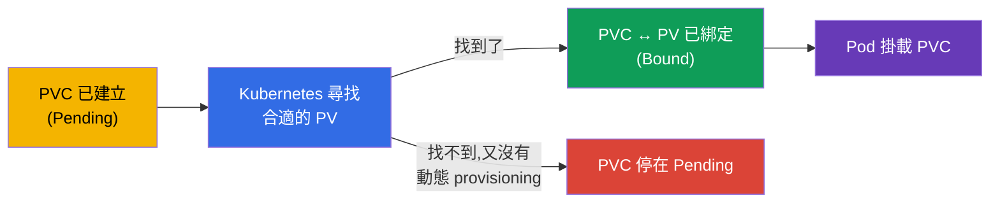
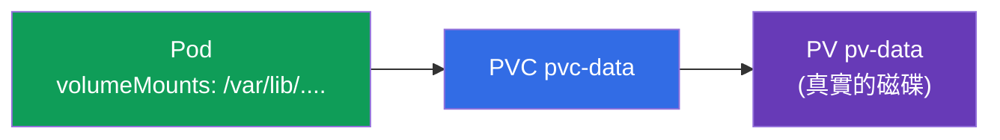
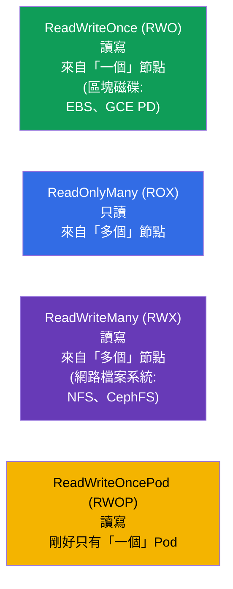
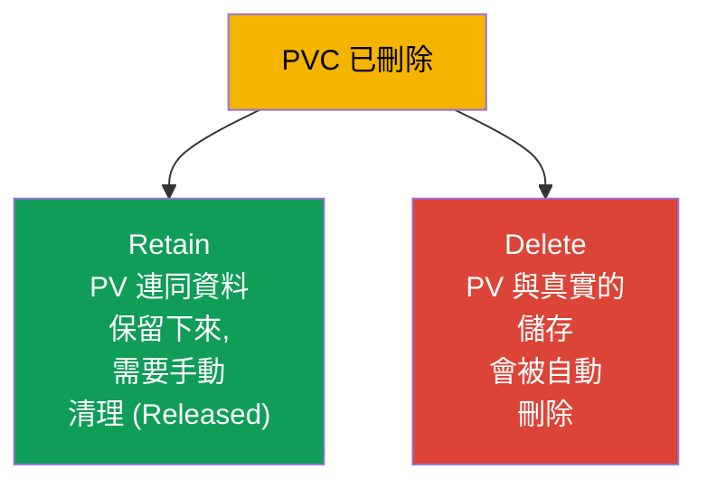

[Русская версия](ru.md) · [Eng version](README.md) · [Versión en español](es.md) · [Version française](fr.md) · [Deutsche Version](de.md) · [ქართული ვერსია](ge.md) · [日本語版](jp.md)

# 第 25 章。Volumes、PersistentVolume 與 PersistentVolumeClaim

> **接下來要講什麼。** 上一章的卷是跟 Pod 一起生存的。現在來談 **比 Pod 活得更久** 的
> 儲存:資料庫、使用者上傳的檔案,以及任何有價值的資料。
> Kubernetes 把「一塊儲存」(**PersistentVolume, PV**) 和「對儲存的請求」
> (**PersistentVolumeClaim, PVC**) 分開。理解這個分工以及 PV↔PVC↔Pod 的串接 -
> 就是本章的目標。這是兩張考試的 Storage 領域(CKA 10%,CKAD 的 Application Design 一部分)。

## 25.1. 問題:怎麼給 Pod 一塊持久的儲存

Pod 是短暫的,而資料庫的資料不是。需要一個獨立於 Pod 而存在的儲存。但這裡有個難處:
應用程式的開發者不應該知道儲存基礎設施的細節(哪一顆磁碟、在哪個雲、走什麼協定)。
Kubernetes 把責任切開:



- **PV** - 儲存的「供給」:真實的一塊磁碟/卷,以叢集物件的形式描述出來。通常由管理員
  來管(或是自動建立 - 第 26 章)。
- **PVC** - 應用程式對儲存的「申請」:要多少、用什麼存取模式。
- **Pod** 使用的是 PVC,而不是直接用 PV。Kubernetes 會自己把 PVC 跟合適的 PV 綁起來。

這個分工就像插座與插頭:應用程式(插頭)要的是標準介面,而插座後面 (PV) 是哪座發電廠,
跟它無關。

## 25.2. 生命週期:binding

當 PVC 被建立時,Kubernetes 會尋找合適的 PV(按大小、存取模式、class),並把它們
**綁定**起來 (binding)。之後這個 PV 就一對一地屬於這個 PVC。



在 `kubectl get pv,pvc` 裡看得到的狀態:

| 狀態 | 意義 |
|--------|----------|
| `Available` | PV 空閒,沒有綁給任何人 |
| `Bound` | PV/PVC 已彼此綁定 |
| `Pending` | PVC 在等一個合適的 PV |
| `Released` | PVC 已刪除,但 PV 還沒清理 |

「PVC 卡在 Pending」是很常見的情況:沒有合適的 PV,也沒有設定動態 provisioning
(第 26 章)。這是排查儲存問題時第一個要檢查的東西。

## 25.3. PV 與 PVC 的清單檔

**PersistentVolume:**

```yaml
apiVersion: v1
kind: PersistentVolume
metadata:
  name: pv-data
spec:
  capacity:
    storage: 10Gi
  accessModes:
  - ReadWriteOnce
  persistentVolumeReclaimPolicy: Retain
  storageClassName: manual
  hostPath:                    # 儲存類型(僅為示例;生產環境用雲端磁碟/NFS)
    path: /mnt/data
```

**PersistentVolumeClaim:**

```yaml
apiVersion: v1
kind: PersistentVolumeClaim
metadata:
  name: pvc-data
spec:
  accessModes:
  - ReadWriteOnce
  resources:
    requests:
      storage: 10Gi
  storageClassName: manual
```

要讓 PVC 跟 PV 綁上,它們必須 **相容**:大小(PV ≥ PVC 的請求)、`accessModes`
與 `storageClassName`。

## 25.4. 把 PVC 接到 Pod 上

Pod 把 PVC 當成卷來引用:

```yaml
spec:
  containers:
  - name: app
    image: postgres
    volumeMounts:
    - name: data
      mountPath: /var/lib/postgresql/data
  volumes:
  - name: data
    persistentVolumeClaim:
      claimName: pvc-data
```



應用程式看到的就是一個普通的已掛載目錄;它後面是 PVC,PVC 後面是 PV,PV 後面是真實的
儲存。Pod 被重建了 - 資料還留在 PV 上。

## 25.5. Access modes:存取模式

`accessModes` 描述卷可以怎麼被掛載。這是常考的題目。



| 模式 | 說明 | 誰可以掛載 |
|-------|-------------|----------------------|
| `ReadWriteOnce` (RWO) | 讀寫 | 一個節點 |
| `ReadOnlyMany` (ROX) | 只讀 | 多個節點 |
| `ReadWriteMany` (RWX) | 讀寫 | 多個節點 |
| `ReadWriteOncePod` (RWOP) | 讀寫 | 剛好一個 Pod |

一個重要的細節:**RWO 指的是「一個節點」,而不是「一個 Pod」** - 同一個節點上的多個
Pod 可以共用一個 RWO 卷。大多數雲端區塊磁碟 (EBS、GCE PD) 都只支援 RWO。
要從多個節點存取 (RWX),就需要網路檔案系統 (NFS、CephFS、EFS)。

## 25.6. Reclaim policy:PVC 刪除後 PV 怎麼處理

當 PVC 被刪掉時,PV 與資料會怎樣?這由 `persistentVolumeReclaimPolicy` 決定。



| 政策 | 刪除 PVC 時的行為 | 什麼時候用 |
|----------|----------------------------|-------|
| `Retain` | PV 與資料保留,PV → `Released`,手動清理 | 有價值的資料 |
| `Delete` | PV 與真實儲存自動刪除 | 臨時的/動態的卷 |

`Retain` 是重要資料的安全選項(不小心刪了 PVC - 資料還完好,可以重用 PV)。`Delete`
對動態建立的卷 (第 26 章) 很方便,但刪除 PVC 就會把資料一起帶走 - 要小心。

> 以前還有一個 `Recycle` 政策(它會抹掉資料再把 PV 放回池子),但它已經過時,
> 不再使用。

## 25.7. 卷的擴容

PVC 可以擴容(前提是 StorageClass 允許,`allowVolumeExpansion: true`)- 只要把請求的
大小加大就行:

```bash
kubectl edit pvc pvc-data      # 把 requests.storage 改成更大的值
```

卷不能縮小。擴容在生產環境是常見操作(資料會長大),而且透過動態 provisioning
(第 26 章) 做起來更方便。

## 25.8. 生產環境中怎麼用

- **PVC + 動態 provisioning 才是常態。** 生產環境幾乎沒有人手動建立 PV:StorageClass
  會依 PVC 的請求自動建立它們 (第 26 章)。開發者只寫 PVC,基礎設施自己把磁碟發出來。
- **Access mode 決定架構。** 大多數雲端磁碟是 RWO(一個節點),所以跑在上面的資料庫
  就是 StatefulSet 加上每個 Pod 一個卷 (第 11 章)。要讓很多 Pod 共同存取 (RWX) 就會
  選 NFS/EFS/CephFS - 並且清楚這意味著不同的效能與成本。
- **Reclaim policy 保護資料。** 生產資料會設成 `Retain`(或非常謹慎地用 `Delete`),
  這樣不小心刪掉 PVC/namespace 也不會摧毀資料庫。因為 `Delete` 而遺失資料是真實而且
  很痛的事故。
- **監控使用量並提前擴容。** 生產環境會監控卷的使用量並提前擴容
  (`allowVolumeExpansion`),避免撞到 100% 把應用程式弄掛。
- **在叢集裡跑 stateful 是一個自覺的選擇。** 很多團隊寧可用託管資料庫 (RDS/Cloud SQL)
  而不是叢集裡的 PV - 在備份與儲存容錯上的風險更小。

## 25.9. 小辭典

- **PersistentVolume (PV)** - 叢集裡代表「一塊儲存」的物件。
- **PersistentVolumeClaim (PVC)** - 應用程式對儲存的申請(大小、模式)。
- **Binding** - 把合適的 PV 與 PVC 綁定起來(一對一)。
- **accessModes** - 存取模式:RWO、ROX、RWX、RWOP。
- **ReadWriteOnce** - 從一個節點讀寫(不是一個 Pod!)。
- **ReadWriteMany** - 從多個節點讀寫(需要網路檔案系統)。
- **reclaimPolicy** - PVC 刪除後 PV 的命運:Retain / Delete。
- **allowVolumeExpansion** - 是否允許擴容卷。
- **PV/PVC 的狀態** - Available、Bound、Pending、Released。

## 25.10. 本章總結

- 對於要比 Pod 活得更久的資料,儲存被切成 PV(一塊儲存,屬於基礎設施)與 PVC
  (應用程式的申請);Pod 使用 PVC,而不是直接用 PV。
- Kubernetes 依大小、accessModes 與 storageClassName 把 PVC 與合適的 PV 綁定
  (binding);狀態有 Available/Bound/Pending/Released。
- PVC 以卷的形式掛進 Pod (`persistentVolumeClaim`);Pod 重建時資料仍然保留。
- accessModes:RWO(一個節點)、ROX(多個節點,只讀)、RWX(多個節點,可寫,需要
  網路檔案系統)、RWOP(一個 Pod)。RWO 講的是節點,不是 Pod。
- reclaimPolicy:Retain(保留資料,手動清理) vs Delete(全部自動刪除)。
- 卷可以擴容(如果 StorageClass 允許),不能縮小。

## 25.11. 這些知識用在哪:考試與實際工作

**在考試上。** 「建立 PV 與 PVC,把它們綁起來,掛到 Pod 裡」、「為什麼 PVC 在
Pending」、「該選哪個 accessMode」、「刪除 PVC 時資料會怎樣 (reclaimPolicy)」-
都是 Storage 領域的典型題目。要會寫這兩份清單檔,並理解 PV/PVC 的相容性與狀態。

**在實際工作中。** PV/PVC 是叢集裡儲存狀態的基礎。理解 access modes 決定了架構
(RWO → StatefulSet,RWX → 網路檔案系統),而 reclaimPolicy 直接關係到資料的存亡。
排查 Pending 的 PVC 與擴容卷是常見的維運工作。

## 25.12. 自我檢查問題

1. 為什麼儲存要切成 PV 與 PVC?誰負責什麼?
2. 什麼是 binding,為什麼 PVC 會卡在 Pending?
3. Pod 怎麼使用 PVC,Pod 重建時資料會怎樣?
4. ReadWriteOnce 的意思是「一個 Pod」還是「一個節點」?要用 RWX 需要什麼?
5. reclaimPolicy 的 Retain 與 Delete 差在哪?什麼時候選哪一個?
6. 卷可以擴容和縮小嗎?擴容取決於什麼?
7. PV/PVC 有哪些狀態,每一個代表什麼?

## 實踐

我們拆解了手動管理儲存的做法。第 26 章要把它自動化:StorageClass 與動態 provisioning
會依 PVC 的請求自己建立 PV,同時我們也會回頭談 StatefulSet 裡的儲存。PV/PVC 會在儲存
相關的實驗中操練。

🧪 實驗 108(PV/PVC):[tasks/cka/labs/108](../../labs/108/README_TW.MD)

---
[目錄](../README_TW.md) · [第 24 章](../24/tw.md) · [第 26 章](../26/tw.md)
