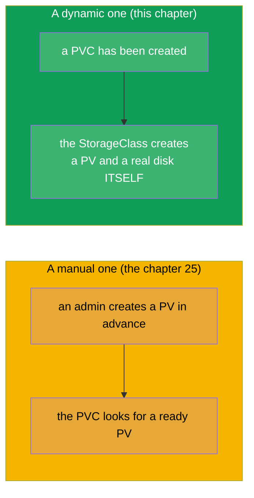
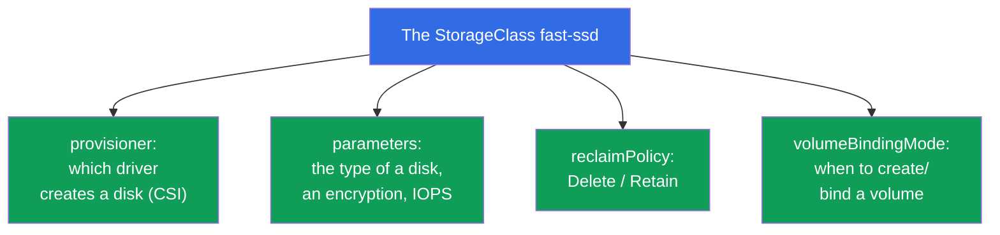
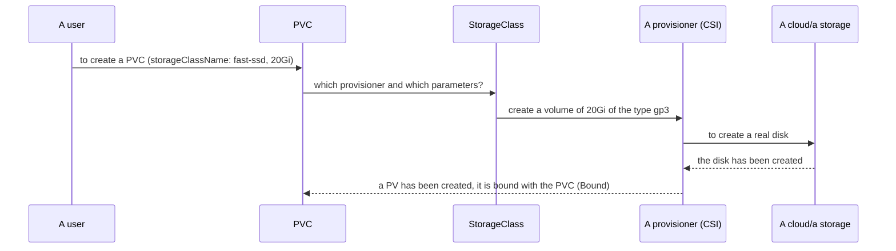
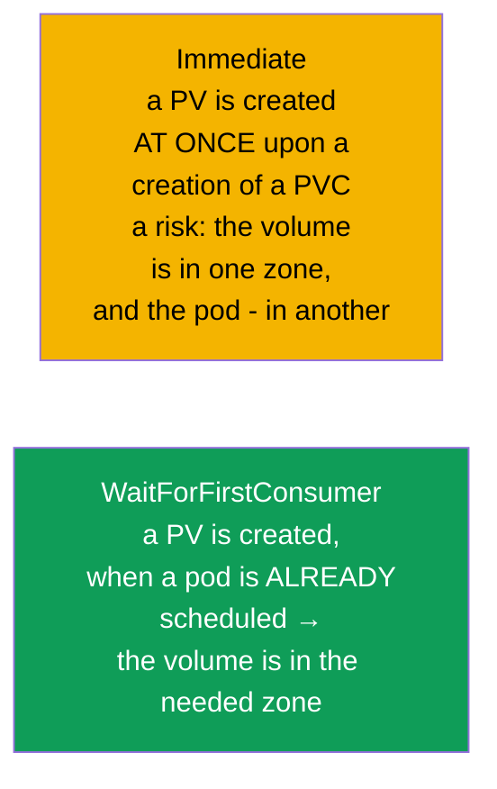
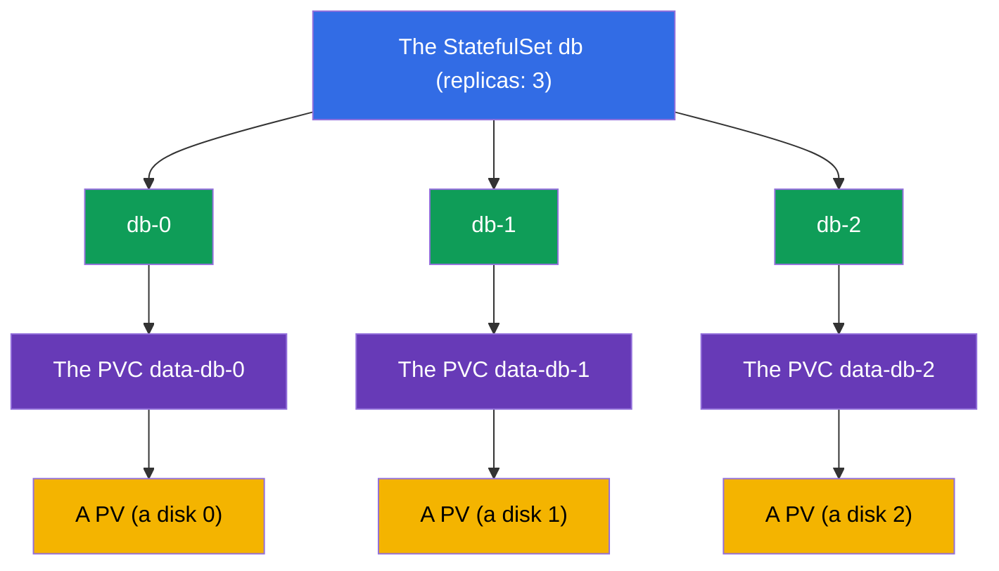

[Русская версия](ru.md) · [Versión en español](es.md) · [Version française](fr.md) · [Deutsche Version](de.md) · [ქართული ვერსია](ge.md)

# Chapter 26. A StorageClass, a dynamic provisioning and a storing in a StatefulSet

> **What comes next.** In the chapter 25 a PV was created by an administrator manually - this does not scale.
> A **StorageClass** and a **dynamic provisioning** automate this: a PVC is created - and
> the needed PV with a real disk appears by itself. Plus we will close the storing in a StatefulSet
> (the volumeClaimTemplates from the chapter 11 will acquire a meaning). It completes the part 5 and the domain Storage
> (CKA 10%). A dynamic provisioning is how a storage works in the real cloud
> clusters.

## 26.1. A problem of a manual PV and its solution

To create the PV by hand for each PVC is slow and does not scale: an administrator will not
keep up with the applications. The solution is a **dynamic provisioning**: a PV is created
**automatically** at the moment of an appearance of a PVC, on the basis of a **StorageClass**.



## 26.2. A StorageClass: a template for a creation of the volumes

A **StorageClass** describes a "class" of a storage: by which provisioner to create the volumes, with which
parameters, with which reclaim policy. In essence this is a template, by which upon a request of a PVC
a PV is born.

```yaml
apiVersion: storage.k8s.io/v1
kind: StorageClass
metadata:
  name: fast-ssd
provisioner: ebs.csi.aws.com          # the driver, which creates the volumes
parameters:
  type: gp3                            # the parameters for a concrete provisioner
  encrypted: "true"
reclaimPolicy: Delete                  # the fate of a PV after a deletion of a PVC
allowVolumeExpansion: true             # to allow an expansion
volumeBindingMode: WaitForFirstConsumer
```



## 26.3. How a dynamic provisioning works

A PVC simply indicates the needed `storageClassName` - and everything happens by itself:

```yaml
apiVersion: v1
kind: PersistentVolumeClaim
metadata:
  name: data
spec:
  accessModes: ["ReadWriteOnce"]
  storageClassName: fast-ssd       # ← the name of the StorageClass
  resources:
    requests:
      storage: 20Gi
```



A developer does not need to know about the PV, the disks and the cloud - he writes only a PVC. The infrastructure
(a StorageClass + a CSI driver) does the rest.

## 26.4. A default StorageClass

One StorageClass can be marked as a **default** one with an annotation
`storageclass.kubernetes.io/is-default-class: "true"`. Then a PVC **without** an explicit
`storageClassName` uses it.

```bash
kubectl get storageclass          # the default one will have a (default) next to the name
```


In the managed clusters (EKS/GKE/AKS) a default StorageClass usually already exists, therefore there
it is enough to create a PVC - and a volume will appear. If there is no default class, and a PVC does not indicate a
class, it will get stuck in Pending.

## 26.5. The volumeBindingMode: when to create a volume

A subtle, but an important parameter - **when** to create and to bind a volume:



- **Immediate** - a volume is created at once, as soon as a PVC has appeared. A problem in a cloud: a disk may
  turn out to be in one availability zone, and a pod will be scheduled into another one - and it will not get mounted
  (the disks are zonal).
- **WaitForFirstConsumer** - a volume is created only when a pod, using the PVC, has already
  been assigned onto a node. Then the volume is created in the correct zone. In a cloud this is the preferable
  mode.

## 26.6. A storing in a StatefulSet: the volumeClaimTemplates

Let us return to a StatefulSet (the chapter 11). Its peculiarity is the **volumeClaimTemplates**: a template,
by which for each pod **its own** PVC is created dynamically (and through a StorageClass - also
its own PV/disk).

```yaml
spec:
  volumeClaimTemplates:
  - metadata:
      name: data
    spec:
      accessModes: ["ReadWriteOnce"]
      storageClassName: fast-ssd
      resources:
        requests:
          storage: 10Gi
```



The key property: the PVC `data-db-1` is **bound exactly to the pod db-1**. The db-1 has been recreated -
it will again receive its `data-db-1` with its own data. And also: upon a **deletion of a StatefulSet these PVC
are not deleted automatically** (a protection of the data) - they are removed manually.

## 26.7. The CSI: how the drivers of a storage connect to Kubernetes

The provisioners (a `provisioner` in a StorageClass) implement the standard **CSI (Container Storage
Interface)** - a universal interface between Kubernetes and the systems of a storage. Thanks to the
CSI one and the same mechanism PV/PVC/StorageClass works with any storage: with the cloud
disks (EBS, GCE PD, Azure Disk), the network FS (NFS, CephFS), the enterprise storage systems.


The CSI we will take apart in more detail (together with the CNI/CRI) in the chapter 40. Here it is enough to understand: behind a
`provisioner` there stands a CSI driver, which is able to create/delete/mount the volumes
of a concrete type of a storage.

## 26.8. A practical case: to look, to delete, to expand

Let us take apart the typical operations over a storage in two cuts: **a local PV on a node**
(a static one, without a provisioner) and **a cloud disk EBS** (a dynamic one, with a CSI). The difference
between them is most vividly seen exactly upon a deletion and an expansion.

### To look, which PV and PVC exist

```bash
kubectl get pvc                 # the PVC in the current namespace
kubectl get pvc -A              # in all the namespaces
kubectl get pv                  # the PV are cluster-wide, without a namespace

# the key fields are seen at once:
# PVC: STATUS (Bound/Pending), VOLUME (the name of the PV), CAPACITY, STORAGECLASS
# PV:  STATUS (Bound/Available/Released), CLAIM (which PVC), RECLAIMPOLICY

kubectl describe pvc data       # the events: why Pending, to which PV it is bound
kubectl describe pv <pv-name>   # the type of the volume (hostPath/local/csi), nodeAffinity

# by what the volume is really backed: a path on a node or an ID of a disk in a cloud
kubectl get pv <pv-name> -o jsonpath='{.spec.local.path}{.spec.csi.volumeHandle}'
```

### The variant A. A local PV on a node (a static one)

A local volume is a directory/a disk of a concrete node. There is no dynamic provisioner: a PV is
created by an admin manually and is rigidly bound to a node through a `nodeAffinity`.

```yaml
apiVersion: v1
kind: PersistentVolume
metadata:
  name: local-pv-node1
spec:
  capacity:
    storage: 10Gi
  accessModes: ["ReadWriteOnce"]
  persistentVolumeReclaimPolicy: Retain
  storageClassName: local-storage
  local:
    path: /mnt/disks/data
  nodeAffinity:
    required:
      nodeSelectorTerms:
      - matchExpressions:
        - key: kubernetes.io/hostname
          operator: In
          values: ["node1"]
```

- **To look**: `kubectl get pv local-pv-node1 -o wide`; a `kubectl describe pv ...`
  will show the `Node Affinity` and the path `/mnt/disks/data`.
- **To delete**: we delete the pod, then the PVC (`kubectl delete pvc <name>`). Upon a `Retain` the PV
  passes into `Released`, but it is NOT freed by itself for a repeated use, and the data
  remain in `/mnt/disks/data` on the node1. In order to reuse it - to clean manually the
  directory on the node and either to delete the PV (`kubectl delete pv local-pv-node1`), or to remove from
  it the `spec.claimRef`, having returned it into `Available`.
- **To expand**: a local volume **does not support an expansion** through Kubernetes
  (the provisioner `no-provisioner`, the `allowVolumeExpansion` does not act). An "increase" is
  to give manually more space on the node (a disk/a partition) and if necessary to recreate the PV with
  a new `capacity`. Through a `kubectl edit pvc` the size will not grow.

### The variant B. A cloud disk EBS (a dynamic one)

The disk is created by itself by a StorageClass with a CSI provisioner of AWS, and it can be expanded on the fly.

```yaml
apiVersion: storage.k8s.io/v1
kind: StorageClass
metadata:
  name: ebs-sc
provisioner: ebs.csi.aws.com
parameters:
  type: gp3
reclaimPolicy: Delete
allowVolumeExpansion: true        # ← without this it is impossible to expand a PVC
volumeBindingMode: WaitForFirstConsumer
---
apiVersion: v1
kind: PersistentVolumeClaim
metadata:
  name: data
spec:
  accessModes: ["ReadWriteOnce"]
  storageClassName: ebs-sc
  resources:
    requests:
      storage: 10Gi
```

- **To look**: `kubectl get pvc data` (Bound, a PV is bound), a `kubectl get pv` will show
  the automatically created PV; a `kubectl get pv <pv> -o jsonpath='{.spec.csi.volumeHandle}'`
  will give the ID of the EBS volume (`vol-0abc...`), which is seen also in the console of AWS.
- **To delete**: `kubectl delete pvc data`. Upon a `reclaimPolicy: Delete` the PV and the EBS disk itself
  are deleted automatically - you stop paying for them. Upon a `Retain` the PV will remain
  `Released`, and the EBS disk will be preserved (and will continue to cost money) - it is removed manually.
- **To expand (online)**: we increase the request in the PVC - the CSI expands the real disk without
  a recreation of the pod:

```bash
kubectl patch pvc data -p '{"spec":{"resources":{"requests":{"storage":"20Gi"}}}}'
# or: kubectl edit pvc data  →  storage: 20Gi

kubectl get pvc data -w   # the CAPACITY will grow, the condition FileSystemResizePending will go away
```

The subtleties of an expansion of an EBS:

- the size can only be **increased**, it cannot be decreased;
- an `allowVolumeExpansion: true` is needed in the StorageClass (it is set in advance, before a creation of the PVC);
- an expansion of the file system is usually automatic; on a part of the versions/of the FS a
  restart of the pod may be required;
- in AWS one EBS volume can be modified not more than 4 times per a rolling 24 hours, and each
  next modification is possible only after the previous one reaches the status
  `completed` (the modification itself takes from minutes up to several hours).

The result of the contrast: a local PV is cheap and fast, but it is bound to a node, it is cleaned manually and it does not
expand; an EBS is self-serviced and expandable online, but it is zonal and paid for, while it
exists.

## 26.9. How this is applied in the production

- **A dynamic provisioning is the standard.** In the cloud clusters a storage works like this:
  a developer creates a PVC, a StorageClass + a CSI create a disk themselves. The manual PV are a rarity (for
  the special cases like a ready NFS share).
- **Several StorageClass for the different needs.** It is typical: a `fast-ssd` (a gp3/SSD for a DB),
  a `standard` (cheaper, for a less demanding one), possibly a `retain-ssd` with a
  `reclaimPolicy: Retain` for the critical data. An application chooses a class according to a need and
  a price.
- **A WaitForFirstConsumer in a cloud.** In the multizonal clusters almost always a
  `WaitForFirstConsumer` is used, so that a disk is created in the same zone as a pod - otherwise a
  zonal disk will not get mounted.
- **A reclaimPolicy Retain for an important one.** For the prod data a StorageClass is often configured
  onto a `Retain`, so that a deletion of a PVC does not destroy a disk. A balance: the convenience of a `Delete` against
  the safety of a `Retain`.
- **A StatefulSet + the PVC remain after a deletion.** They remember, that the PVC from a StatefulSet are not
  deleted automatically: this protects the data of a DB, but it requires a conscious cleaning, in order
  not to accumulate the "orphaned" disks (and not to pay for them).

## 26.10. A mini glossary

- **A StorageClass** - a template of a creation of the volumes: a provisioner, the parameters, a reclaim policy.
- **A dynamic provisioning** - an automatic creation of a PV upon a request of a PVC.
- **A provisioner** - a CSI driver, creating the real volumes.
- **A default StorageClass** - a class by default for a PVC without an explicit class.
- **A volumeBindingMode** - when to create/bind a volume (Immediate /
  WaitForFirstConsumer).
- **The volumeClaimTemplates** - a template of a StatefulSet, creating a PVC for each pod.
- **The CSI (Container Storage Interface)** - a standard of a connection of the storages to Kubernetes.
- **An allowVolumeExpansion** - a permission for an expansion of the volumes of a class.

## 26.11. The summary of the chapter

- A dynamic provisioning relieves from a manual creation of the PV: a PVC has appeared - a PV with a real
  disk is created by itself according to a StorageClass.
- A StorageClass sets a provisioner (a CSI driver), the parameters of a storage, a reclaimPolicy,
  an allowVolumeExpansion and a volumeBindingMode.
- A PVC indicates a `storageClassName`; without an indication a default StorageClass is used (if
  it exists), otherwise the PVC is Pending.
- A `WaitForFirstConsumer` creates a volume after a scheduling of a pod - it is correct for the
  multizonal clouds; an `Immediate` may create a disk not in the right zone.
- A StatefulSet through the `volumeClaimTemplates` creates its own PVC for each pod; a PVC is bound to
  a pod and is not deleted automatically upon a deletion of the StatefulSet.
- Behind a provisioner there stands a CSI driver - a single interface to any storage.
- The PV/PVC are looked at through a `kubectl get/describe pv,pvc`; a deletion and an expansion work
  differently for a local volume and for a cloud disk.
- A local PV on a node: it is bound to the node, upon a `Retain` it is cleaned manually, an expansion is not
  supported. An EBS: it is deleted automatically upon a `Delete`, it is expanded online upon an
  `allowVolumeExpansion: true` (only upwards).

## 26.12. How this will come in handy: on the exam and in the real work

**On the exam.** "Create a PVC with the needed StorageClass", "why is a PVC in Pending" (there is no
default class/provisioner), "deploy a StatefulSet with the volumeClaimTemplates" are the typical
tasks of the domain Storage. It is needed to understand the link StorageClass → a provisioner → a PV and the role of a
default class.

**In the real work.** A dynamic provisioning is how a storage really works in a
cloud: a developer writes a PVC, a disk appears by itself. The correct StorageClass (the type of a disk,
the reclaimPolicy, the WaitForFirstConsumer) determine the performance, the cost and the
preservation of the data. A management of the PVC from a StatefulSet is a part of an operation of the databases in a
cluster.

## 26.13. Self-check questions

1. In what is a dynamic provisioning better than a manual creation of the PV?
2. What does a StorageClass describe and what is a provisioner?
3. How does a PVC choose a StorageClass and what happens without an indication of a class?
4. In what is the difference of an Immediate and of a WaitForFirstConsumer? Why is the second one important in a cloud?
5. How do the volumeClaimTemplates link a pod of a StatefulSet with its volume upon a recreation?
6. Why are the PVC from a StatefulSet not deleted automatically and in what is this important?
7. What is a CSI and which role does it play in a provisioning?
8. How to look at the list of the PV and of the PVC and by what is a volume really backed (a path on a node or an ID of a disk)?
9. In what do a deletion and an expansion differ for a local PV on a node and for a cloud disk EBS?

## Practice

With this the part 5 (the storage) is completed. Further comes the part 6: an observability and a maintenance,
starting with the probes (a liveness, a readiness, a startup - the chapter 27). A StorageClass, a dynamic
provisioning and a StatefulSet storage are drilled in the labs on the storage.

🧪 Lab 108 (a StorageClass and a storing in a StatefulSet): [tasks/cka/labs/108](../../labs/108/README.MD)

---
[Contents](../README.md) · [Chapter 25](../25/README.md) · [Chapter 27](../27/README.md)
