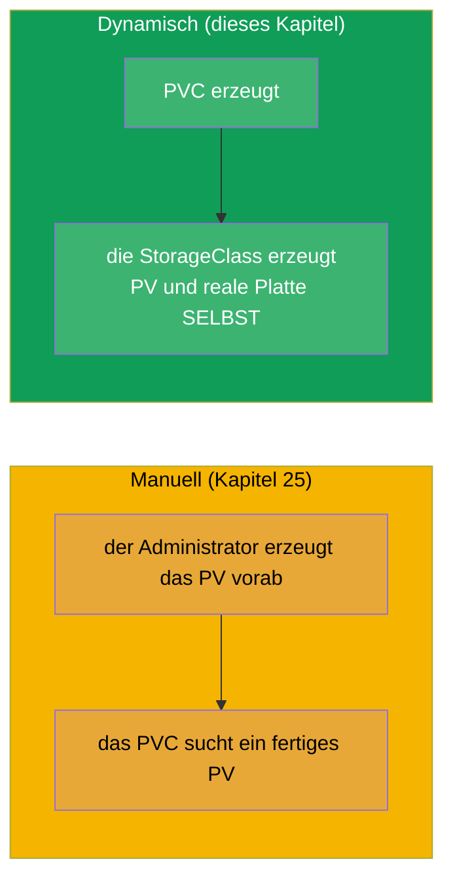
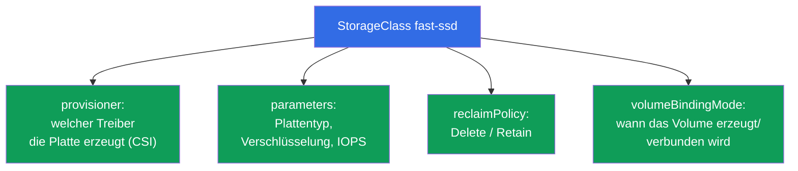
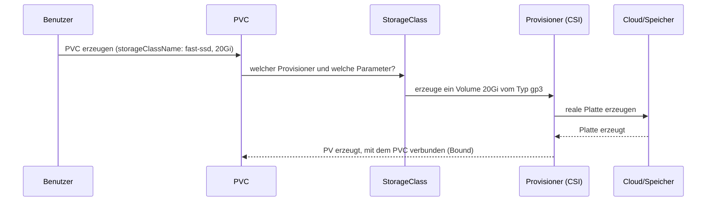
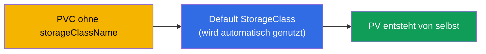
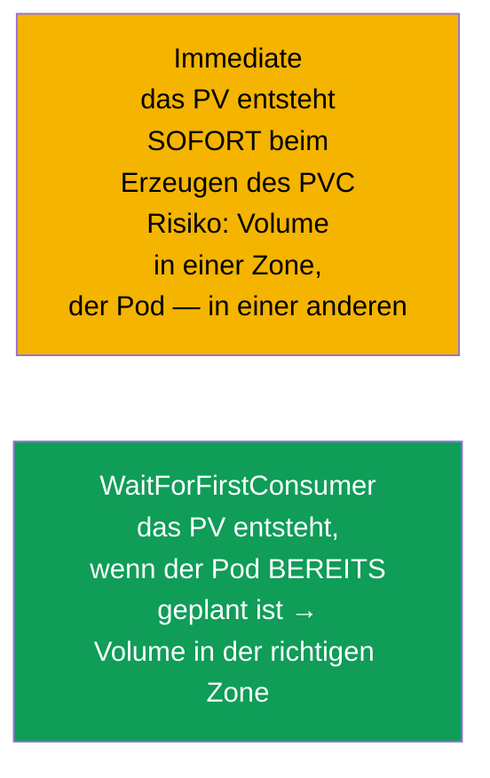
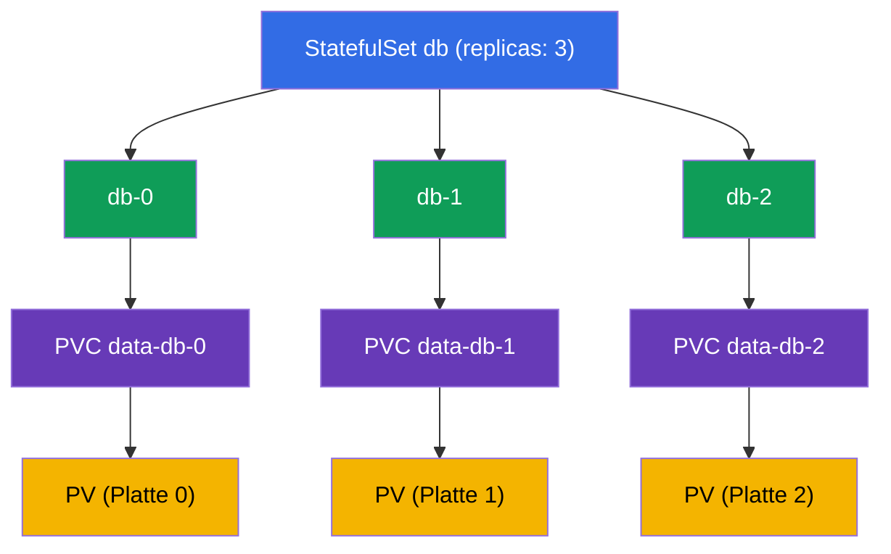
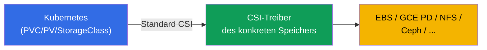

[Русская версия](ru.md) · [Eng version](README.md) · [Versión en español](es.md) · [Version française](fr.md) · [ქართული ვერსია](ge.md) · [繁體中文版](tw.md) · [日本語版](jp.md)

# Kapitel 26. StorageClass, dynamisches Provisioning und Speicher im StatefulSet

> **Was kommt.** In Kapitel 25 erzeugte der Administrator die PV von Hand - das skaliert
> nicht. **StorageClass** und **dynamisches Provisioning** automatisieren das: ein PVC wird
> erzeugt - und das passende PV mit einer realen Platte entsteht von selbst. Dazu schließen
> wir das Thema Speicher im StatefulSet ab (die volumeClaimTemplates aus Kapitel 11
> bekommen einen Sinn). Damit endet Teil 5 und die Domäne Storage (CKA 10%). Dynamisches
> Provisioning ist die Art, wie Speicher in echten Cloud-Clustern funktioniert.

## 26.1. Das Problem des manuellen PV und seine Lösung

PV von Hand für jedes einzelne PVC anzulegen ist langsam und skaliert nicht: der
Administrator kommt den Anwendungen nicht nach. Die Lösung ist **dynamisches
Provisioning**: das PV wird **automatisch** in dem Moment erzeugt, in dem ein PVC
erscheint, und zwar auf Basis einer **StorageClass**.



## 26.2. StorageClass: die Vorlage für das Erzeugen von Volumes

Eine **StorageClass** beschreibt eine „Klasse“ von Speicher: mit welchem Provisioner
Volumes erzeugt werden, mit welchen Parametern und mit welcher Reclaim-Policy. Im Kern ist
das eine Vorlage, nach der auf Anforderung eines PVC ein PV entsteht.

```yaml
apiVersion: storage.k8s.io/v1
kind: StorageClass
metadata:
  name: fast-ssd
provisioner: ebs.csi.aws.com          # Treiber, der die Volumes erzeugt
parameters:
  type: gp3                            # Parameter für den konkreten Provisioner
  encrypted: "true"
reclaimPolicy: Delete                  # Schicksal des PV nach dem Löschen des PVC
allowVolumeExpansion: true             # Erweiterung erlauben
volumeBindingMode: WaitForFirstConsumer
```



## 26.3. Wie dynamisches Provisioning funktioniert

Das PVC gibt einfach den gewünschten `storageClassName` an - und alles geschieht von selbst:

```yaml
apiVersion: v1
kind: PersistentVolumeClaim
metadata:
  name: data
spec:
  accessModes: ["ReadWriteOnce"]
  storageClassName: fast-ssd       # ← Name der StorageClass
  resources:
    requests:
      storage: 20Gi
```



Der Entwickler muss nichts über PV, Platten und Cloud wissen - er schreibt nur das PVC. Die
Infrastruktur (StorageClass + CSI-Treiber) macht den Rest.

## 26.4. Default StorageClass

Eine StorageClass kann man als **Default** markieren, mit der Annotation
`storageclass.kubernetes.io/is-default-class: "true"`. Dann nutzt ein PVC **ohne**
expliziten `storageClassName` genau diese.

```bash
kubectl get storageclass          # beim Default steht (default) neben dem Namen
```



In verwalteten Clustern (EKS/GKE/AKS) gibt es die Default-StorageClass meist schon, deshalb
genügt es dort, ein PVC zu erzeugen - und das Volume erscheint. Fehlt eine Default-Klasse
und das PVC gibt keine Klasse an, bleibt es in Pending hängen.

## 26.5. volumeBindingMode: wann das Volume erzeugt wird

Ein feiner, aber wichtiger Parameter - **wann** das Volume erzeugt und verbunden wird:



- **Immediate** - das Volume wird sofort erzeugt, sobald das PVC erscheint. Das Problem in
  der Cloud: die Platte kann in einer Availability Zone landen, während der Pod in eine
  andere geplant wird - dann lässt sie sich nicht mounten (Platten sind zonal).
- **WaitForFirstConsumer** - das Volume wird erst erzeugt, wenn der Pod, der das PVC nutzt,
  bereits einer Node zugewiesen ist. Dann entsteht das Volume in der richtigen Zone. In der
  Cloud ist das der bevorzugte Modus.

## 26.6. Speicher im StatefulSet: volumeClaimTemplates

Zurück zum StatefulSet (Kapitel 11). Seine Besonderheit sind die
**volumeClaimTemplates**: eine Vorlage, nach der für jeden Pod dynamisch ein **eigenes**
PVC erzeugt wird (und über die StorageClass auch ein eigenes PV bzw. eine eigene Platte).

```yaml
spec:
  volumeClaimTemplates:
  - metadata:
      name: data
    spec:
      accessModes: ["ReadWriteOnce"]
      storageClassName: fast-ssd
      resources:
        requests:
          storage: 10Gi
```



Die entscheidende Eigenschaft: das PVC `data-db-1` ist **genau an den Pod db-1 gebunden**.
Wird db-1 neu erzeugt, erhält er wieder `data-db-1` mit seinen Daten. Und noch etwas: beim
**Löschen des StatefulSet werden diese PVC nicht automatisch gelöscht** (Schutz der Daten) -
man entfernt sie manuell.

## 26.7. CSI: wie sich Speichertreiber an Kubernetes anbinden

Die Provisioner (`provisioner` in der StorageClass) implementieren den Standard **CSI
(Container Storage Interface)** - eine universelle Schnittstelle zwischen Kubernetes und
Speichersystemen. Dank CSI funktioniert derselbe Mechanismus aus PV/PVC/StorageClass mit
jedem Speicher: Cloud-Platten (EBS, GCE PD, Azure Disk), Netzwerk-FS (NFS, CephFS),
Enterprise-Speichersystemen.



CSI schauen wir uns genauer (zusammen mit CNI/CRI) in Kapitel 40 an. Hier genügt das
Verständnis: hinter dem `provisioner` steht ein CSI-Treiber, der Volumes eines konkreten
Speichertyps erzeugen, löschen und mounten kann.

## 26.8. Praxisfall: ansehen, löschen, erweitern

Sehen wir uns die typischen Operationen am Speicher in zwei Varianten an: **lokales PV auf
einer Node** (statisch, ohne Provisioner) und **Cloud-Platte EBS** (dynamisch, mit CSI). Der
Unterschied zwischen beiden zeigt sich am deutlichsten genau beim Löschen und Erweitern.

### Ansehen, welche PV und PVC es gibt

```bash
kubectl get pvc                 # PVC im aktuellen Namespace
kubectl get pvc -A              # in allen Namespaces
kubectl get pv                  # PV — clusterweit, ohne Namespace

# die wichtigsten Felder sind direkt sichtbar:
# PVC: STATUS (Bound/Pending), VOLUME (Name des PV), CAPACITY, STORAGECLASS
# PV:  STATUS (Bound/Available/Released), CLAIM (welches PVC), RECLAIMPOLICY

kubectl describe pvc data       # Events: warum Pending, an welches PV gebunden
kubectl describe pv <pv-name>   # Art des Volumes (hostPath/local/csi), nodeAffinity

# womit das Volume real unterlegt ist: Pfad auf der Node oder Platten-ID in der Cloud
kubectl get pv <pv-name> -o jsonpath='{.spec.local.path}{.spec.csi.volumeHandle}'
```

### Variante A. Lokales PV auf einer Node (statisch)

Ein lokales Volume ist ein Verzeichnis bzw. eine Platte einer konkreten Node. Es gibt keinen
dynamischen Provisioner: das PV erzeugt der Administrator von Hand und bindet es über
`nodeAffinity` fest an die Node.

```yaml
apiVersion: v1
kind: PersistentVolume
metadata:
  name: local-pv-node1
spec:
  capacity:
    storage: 10Gi
  accessModes: ["ReadWriteOnce"]
  persistentVolumeReclaimPolicy: Retain
  storageClassName: local-storage
  local:
    path: /mnt/disks/data
  nodeAffinity:
    required:
      nodeSelectorTerms:
      - matchExpressions:
        - key: kubernetes.io/hostname
          operator: In
          values: ["node1"]
```

- **Ansehen**: `kubectl get pv local-pv-node1 -o wide`; `kubectl describe pv ...` zeigt
  `Node Affinity` und den Pfad `/mnt/disks/data`.
- **Löschen**: wir löschen den Pod, dann das PVC (`kubectl delete pvc <name>`). Bei `Retain`
  geht das PV in `Released`, wird aber selbst NICHT für eine Wiederverwendung freigegeben,
  und die Daten bleiben in `/mnt/disks/data` auf node1. Zum Wiederverwenden - das
  Verzeichnis auf der Node manuell bereinigen und entweder das PV löschen
  (`kubectl delete pv local-pv-node1`) oder ihm `spec.claimRef` entfernen, damit es wieder
  `Available` wird.
- **Erweitern**: ein lokales Volume **unterstützt keine Erweiterung** über Kubernetes
  (Provisioner `no-provisioner`, `allowVolumeExpansion` wirkt nicht). „Vergrößern“ heißt
  hier, auf der Node manuell mehr Platz bereitzustellen (Platte/Partition) und bei Bedarf
  das PV mit neuer `capacity` neu zu erzeugen. Über `kubectl edit pvc` wächst die Größe
  nicht.

### Variante B. Cloud-Platte EBS (dynamisch)

Die Platte entsteht selbst nach der StorageClass mit dem CSI-Provisioner von AWS, und man
kann sie im laufenden Betrieb erweitern.

```yaml
apiVersion: storage.k8s.io/v1
kind: StorageClass
metadata:
  name: ebs-sc
provisioner: ebs.csi.aws.com
parameters:
  type: gp3
reclaimPolicy: Delete
allowVolumeExpansion: true        # ← ohne das lässt sich ein PVC nicht erweitern
volumeBindingMode: WaitForFirstConsumer
---
apiVersion: v1
kind: PersistentVolumeClaim
metadata:
  name: data
spec:
  accessModes: ["ReadWriteOnce"]
  storageClassName: ebs-sc
  resources:
    requests:
      storage: 10Gi
```

- **Ansehen**: `kubectl get pvc data` (Bound, ein PV ist gebunden), `kubectl get pv` zeigt
  das automatisch erzeugte PV; `kubectl get pv <pv> -o jsonpath='{.spec.csi.volumeHandle}'`
  liefert die ID des EBS-Volumes (`vol-0abc...`), die auch in der AWS-Konsole zu sehen ist.
- **Löschen**: `kubectl delete pvc data`. Bei `reclaimPolicy: Delete` werden das PV und die
  EBS-Platte selbst automatisch gelöscht - du zahlst nicht mehr dafür. Bei `Retain` bleibt
  das PV `Released` und die EBS-Platte bleibt erhalten (und kostet weiter Geld) - sie wird
  manuell entfernt.
- **Erweitern (online)**: wir erhöhen die Anforderung im PVC - CSI erweitert die reale
  Platte ohne Neuerzeugen des Pods:

```bash
kubectl patch pvc data -p '{"spec":{"resources":{"requests":{"storage":"20Gi"}}}}'
# oder: kubectl edit pvc data  →  storage: 20Gi

kubectl get pvc data -w   # CAPACITY wächst, die Condition FileSystemResizePending verschwindet
```

Feinheiten beim Erweitern von EBS:

- die Größe lässt sich nur **erhöhen**, verkleinern ist nicht möglich;
- es braucht `allowVolumeExpansion: true` in der StorageClass (wird vorab gesetzt, vor dem
  Erzeugen des PVC);
- das Erweitern des Dateisystems läuft üblicherweise automatisch; bei manchen
  Versionen/Dateisystemen kann ein Neustart des Pods nötig sein;
- in AWS lässt sich ein EBS-Volume höchstens 4 Mal innerhalb eines gleitenden Zeitraums von
  24 Stunden ändern, und jede weitere Änderung ist erst möglich, nachdem die vorige den
  Status `completed` erreicht hat (die Änderung selbst dauert von Minuten bis zu mehreren
  Stunden).

Fazit des Kontrasts: das lokale PV ist günstig und schnell, aber an die Node gebunden, wird
manuell bereinigt und lässt sich nicht erweitern; EBS ist selbstbedienbar und online
erweiterbar, aber zonal und kostenpflichtig, solange es existiert.

## 26.9. Wie man das in der Produktion anwendet

- **Dynamisches Provisioning ist der Standard.** In Cloud-Clustern funktioniert Speicher so:
  der Entwickler erzeugt ein PVC, StorageClass + CSI erzeugen die Platte selbst. Manuelle PV
  sind eine Seltenheit (für Sonderfälle wie ein bestehendes NFS-Share).
- **Mehrere StorageClass für verschiedene Bedürfnisse.** Typisch: `fast-ssd` (gp3/SSD für
  Datenbanken), `standard` (günstiger, für weniger Anspruchsvolles), möglicherweise
  `retain-ssd` mit `reclaimPolicy: Retain` für kritische Daten. Die Anwendung wählt die
  Klasse nach Bedarf und Preis.
- **WaitForFirstConsumer in der Cloud.** In multizonalen Clustern nutzt man fast immer
  `WaitForFirstConsumer`, damit die Platte in derselben Zone entsteht wie der Pod - sonst
  lässt sich die zonale Platte nicht mounten.
- **reclaimPolicy Retain für Wichtiges.** Für Produktionsdaten stellt man die StorageClass
  oft auf `Retain`, damit das Löschen des PVC die Platte nicht zerstört. Die Abwägung:
  Bequemlichkeit von `Delete` gegen Sicherheit von `Retain`.
- **StatefulSet + PVC bleiben nach dem Löschen erhalten.** Man denkt daran, dass PVC eines
  StatefulSet nicht automatisch gelöscht werden: das schützt die Daten der Datenbank,
  erfordert aber bewusste Bereinigung, um keine „verwaisten“ Platten anzusammeln (und nicht
  für sie zu zahlen).

## 26.10. Mini-Glossar

- **StorageClass** - Vorlage zum Erzeugen von Volumes: Provisioner, Parameter,
  Reclaim-Policy.
- **Dynamisches Provisioning** - automatisches Erzeugen eines PV auf Anforderung eines PVC.
- **provisioner** - CSI-Treiber, der die realen Volumes erzeugt.
- **Default StorageClass** - Standardklasse für PVC ohne explizite Klasse.
- **volumeBindingMode** - wann das Volume erzeugt/verbunden wird (Immediate /
  WaitForFirstConsumer).
- **volumeClaimTemplates** - Vorlage des StatefulSet, die pro Pod ein PVC erzeugt.
- **CSI (Container Storage Interface)** - Standard für die Anbindung von Speichern an
  Kubernetes.
- **allowVolumeExpansion** - Erlaubnis, Volumes der Klasse zu erweitern.

## 26.11. Zusammenfassung des Kapitels

- Dynamisches Provisioning erspart das manuelle Erzeugen von PV: sobald ein PVC erscheint,
  entsteht das PV mit realer Platte selbst nach der StorageClass.
- Die StorageClass legt den Provisioner (CSI-Treiber), die Parameter des Speichers,
  reclaimPolicy, allowVolumeExpansion und volumeBindingMode fest.
- Das PVC gibt `storageClassName` an; ohne Angabe wird die Default-StorageClass genutzt
  (wenn es sie gibt), sonst ist das PVC in Pending.
- `WaitForFirstConsumer` erzeugt das Volume nach dem Einplanen des Pods - richtig für
  multizonale Clouds; `Immediate` kann die Platte in der falschen Zone erzeugen.
- Das StatefulSet erzeugt über `volumeClaimTemplates` ein eigenes PVC pro Pod; das PVC ist
  an den Pod gebunden und wird beim Löschen des StatefulSet nicht automatisch gelöscht.
- Hinter dem Provisioner steht ein CSI-Treiber - eine einheitliche Schnittstelle zu jedem
  Speicher.
- PV/PVC sieht man über `kubectl get/describe pv,pvc` an; Löschen und Erweitern funktionieren
  bei einem lokalen Volume und einer Cloud-Platte unterschiedlich.
- Lokales PV auf einer Node: an die Node gebunden, bei `Retain` manuelle Bereinigung,
  Erweiterung nicht unterstützt. EBS: wird bei `Delete` automatisch gelöscht, lässt sich bei
  `allowVolumeExpansion: true` online erweitern (nur nach oben).

## 26.12. Wofür das nützlich ist: in der Prüfung und in der echten Arbeit

**In der Prüfung.** „Erzeuge ein PVC mit der passenden StorageClass“, „warum ist das PVC in
Pending“ (keine Default-Klasse/kein Provisioner), „rolle ein StatefulSet mit
volumeClaimTemplates aus“ - typische Aufgaben der Domäne Storage. Man muss die Kette
StorageClass → Provisioner → PV und die Rolle der Default-Klasse verstehen.

**In der echten Arbeit.** Dynamisches Provisioning ist die Art, wie Speicher in der Cloud
tatsächlich funktioniert: der Entwickler schreibt ein PVC, die Platte erscheint von selbst.
Richtig gewählte StorageClass (Plattentyp, reclaimPolicy, WaitForFirstConsumer) bestimmen
Performance, Kosten und die Sicherheit der Daten. Die Verwaltung der PVC eines StatefulSet
ist Teil des Betriebs von Datenbanken im Cluster.

## 26.13. Fragen zur Selbstüberprüfung

1. Warum ist dynamisches Provisioning besser als das manuelle Erzeugen von PV?
2. Was beschreibt eine StorageClass und was ist ein provisioner?
3. Wie wählt ein PVC die StorageClass und was passiert ohne Angabe einer Klasse?
4. Worin unterscheiden sich Immediate und WaitForFirstConsumer? Warum ist in der Cloud das
   Zweite wichtig?
5. Wie verbindet volumeClaimTemplates einen Pod des StatefulSet beim Neuerzeugen mit seinem
   Volume?
6. Warum werden PVC eines StatefulSet nicht automatisch gelöscht und warum ist das wichtig?
7. Was ist CSI und welche Rolle spielt es beim Provisioning?
8. Wie sieht man die Liste der PV und PVC an und womit ist ein Volume real unterlegt (Pfad
   auf der Node oder Platten-ID)?
9. Worin unterscheiden sich Löschen und Erweitern bei einem lokalen PV auf einer Node und
   bei einer Cloud-Platte EBS?

## Praxis

Damit ist Teil 5 (Speicher) abgeschlossen. Weiter geht es mit Teil 6: Observability und
Betrieb, beginnend mit den Probes (liveness, readiness, startup - Kapitel 27). StorageClass,
dynamisches Provisioning und Speicher im StatefulSet werden in den Labs zum Speicher geübt.

🧪 Lab 108 (StorageClass und Speicher im StatefulSet): [tasks/cka/labs/108](../../labs/108/README_DE.MD)

🎮 Killercoda (im Browser, ohne Installation): [Dynamic Storage with StorageClass and PVC](https://killercoda.com/chadmcrowell/course/cka/storage-dynamic)

---
[Inhalt](../README_DE.md) · [Kapitel 25](../25/de.md) · [Kapitel 27](../27/de.md)
