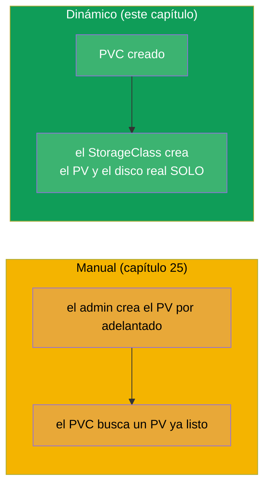
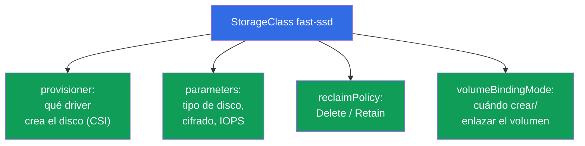
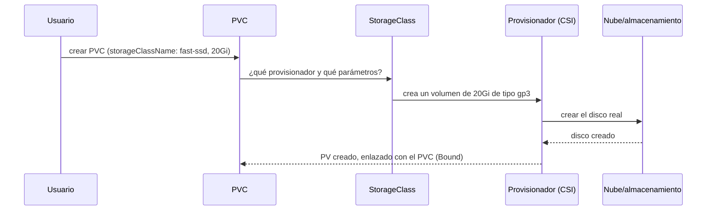
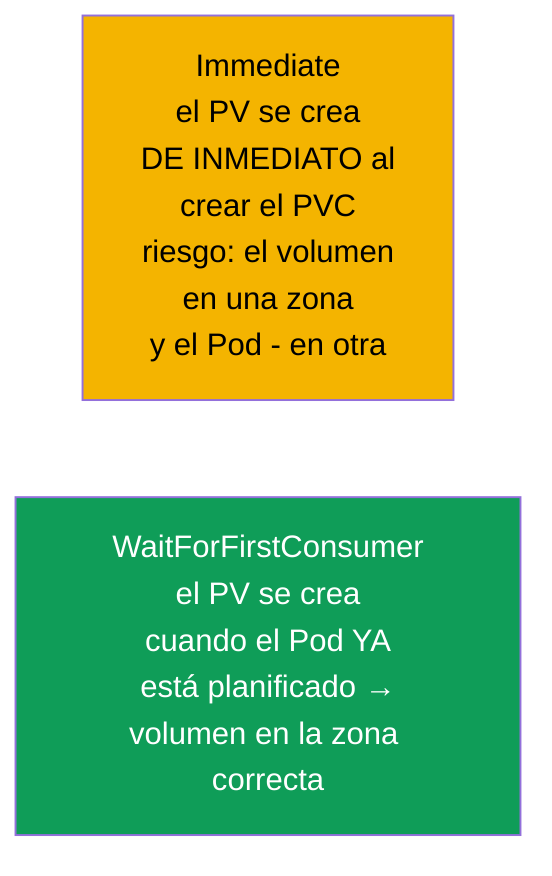
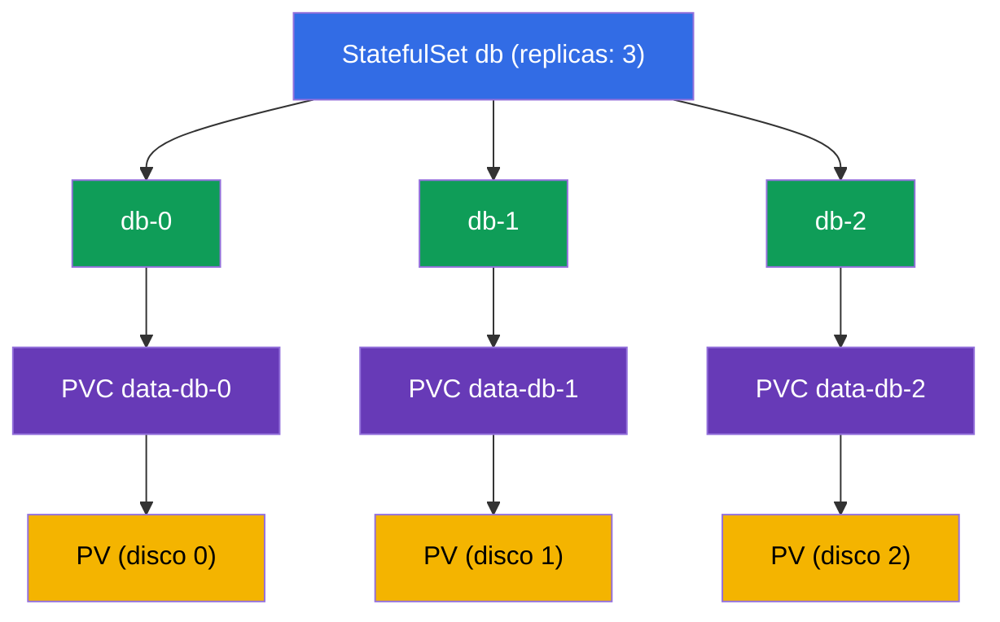
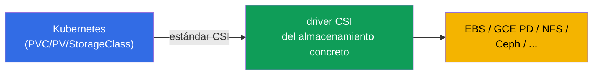

[Русская версия](ru.md) · [Eng version](README.md) · [Version française](fr.md) · [Deutsche Version](de.md) · [ქართული ვერსია](ge.md)

# Capítulo 26. StorageClass, aprovisionamiento dinámico y almacenamiento en StatefulSet

> **Qué viene ahora.** En el capítulo 25 el PV lo creaba el administrador a mano - eso no
> escala. **StorageClass** y el **aprovisionamiento dinámico** lo automatizan: se crea un PVC
> y el PV necesario con su disco real aparece por su cuenta. Además cerramos el
> almacenamiento en StatefulSet (los volumeClaimTemplates del capítulo 11 cobrarán sentido).
> Cierra la parte 5 y el dominio Storage (CKA 10%). El aprovisionamiento dinámico es la forma
> en que funciona el almacenamiento en los clústeres de nube reales.

## 26.1. El problema del PV manual y su solución

Crear PV a mano para cada PVC es lento y no escala: el administrador no va al ritmo de las
aplicaciones. La solución es el **aprovisionamiento dinámico**: el PV se crea
**automáticamente** en el momento en que aparece el PVC, a partir de un **StorageClass**.



## 26.2. StorageClass: plantilla para crear volúmenes

**StorageClass** describe una «clase» de almacenamiento: con qué provisionador crear los
volúmenes, con qué parámetros, con qué política de reclaim. En esencia es la plantilla por la
que nace un PV ante la solicitud de un PVC.

```yaml
apiVersion: storage.k8s.io/v1
kind: StorageClass
metadata:
  name: fast-ssd
provisioner: ebs.csi.aws.com          # driver que crea los volúmenes
parameters:
  type: gp3                            # parámetros del provisionador concreto
  encrypted: "true"
reclaimPolicy: Delete                  # destino del PV tras borrar el PVC
allowVolumeExpansion: true             # permitir la ampliación
volumeBindingMode: WaitForFirstConsumer
```



## 26.3. Cómo funciona el aprovisionamiento dinámico

El PVC solo indica el `storageClassName` que necesita - y todo ocurre por sí solo:

```yaml
apiVersion: v1
kind: PersistentVolumeClaim
metadata:
  name: data
spec:
  accessModes: ["ReadWriteOnce"]
  storageClassName: fast-ssd       # ← nombre del StorageClass
  resources:
    requests:
      storage: 20Gi
```



El desarrollador no necesita saber nada de PV, discos ni nubes - solo escribe el PVC. La
infraestructura (StorageClass + driver CSI) hace el resto.

## 26.4. Default StorageClass

Un StorageClass se puede marcar como **por defecto** con la anotación
`storageclass.kubernetes.io/is-default-class: "true"`. Entonces un PVC **sin**
`storageClassName` explícito lo usa.

```bash
kubectl get storageclass          # el de por defecto lleva (default) junto al nombre
```


En los clústeres gestionados (EKS/GKE/AKS) normalmente ya existe un StorageClass por defecto,
así que allí basta con crear el PVC y el volumen aparece. Si no hay clase por defecto y el
PVC no indica clase, se quedará atascado en Pending.

## 26.5. volumeBindingMode: cuándo crear el volumen

Un parámetro sutil pero importante - **cuándo** crear y enlazar el volumen:



- **Immediate** - el volumen se crea en cuanto aparece el PVC. El problema en la nube: el
  disco puede acabar en una zona de disponibilidad y el Pod planificarse en otra - y entonces
  no se monta (los discos son zonales).
- **WaitForFirstConsumer** - el volumen se crea solo cuando el Pod que usa el PVC ya está
  asignado a un nodo. Entonces el volumen se crea en la zona correcta. En la nube es el modo
  preferible.

## 26.6. Almacenamiento en StatefulSet: volumeClaimTemplates

Volvamos al StatefulSet (capítulo 11). Su particularidad son los **volumeClaimTemplates**: la
plantilla por la que a cada Pod se le crea dinámicamente **su propio** PVC (y a través del
StorageClass, su propio PV/disco).

```yaml
spec:
  volumeClaimTemplates:
  - metadata:
      name: data
    spec:
      accessModes: ["ReadWriteOnce"]
      storageClassName: fast-ssd
      resources:
        requests:
          storage: 10Gi
```



Propiedad clave: el PVC `data-db-1` está **ligado precisamente al Pod db-1**. Si db-1 se
recrea, volverá a recibir `data-db-1` con sus datos. Y otra cosa: al **borrar el StatefulSet
esos PVC no se borran automáticamente** (protección de datos) - se eliminan a mano.

## 26.7. CSI: cómo se conectan los drivers de almacenamiento a Kubernetes

Los provisionadores (`provisioner` en el StorageClass) implementan el estándar **CSI
(Container Storage Interface)** - una interfaz universal entre Kubernetes y los sistemas de
almacenamiento. Gracias a CSI el mismo mecanismo PV/PVC/StorageClass funciona con cualquier
almacenamiento: discos de nube (EBS, GCE PD, Azure Disk), FS de red (NFS, CephFS), cabinas
enterprise.



CSI en detalle (junto con CNI/CRI) lo veremos en el capítulo 40. Aquí basta con entender:
detrás del `provisioner` hay un driver CSI que sabe crear/borrar/montar volúmenes de un tipo
de almacenamiento concreto.

## 26.8. Caso práctico: ver, borrar, ampliar

Veamos las operaciones típicas sobre el almacenamiento en dos vertientes: **PV local en el
nodo** (estático, sin provisionador) y **disco de nube EBS** (dinámico, con CSI). La
diferencia entre ambos se ve con más claridad justamente al borrar y al ampliar.

### Ver qué PV y PVC hay

```bash
kubectl get pvc                 # PVC del namespace actual
kubectl get pvc -A              # en todos los namespace
kubectl get pv                  # los PV son de clúster, sin namespace

# se ven de inmediato los campos clave:
# PVC: STATUS (Bound/Pending), VOLUME (nombre del PV), CAPACITY, STORAGECLASS
# PV:  STATUS (Bound/Available/Released), CLAIM (qué PVC), RECLAIMPOLICY

kubectl describe pvc data       # eventos: por qué está Pending, a qué PV está ligado
kubectl describe pv <pv-name>   # tipo de volumen (hostPath/local/csi), nodeAffinity

# con qué está respaldado realmente el volumen: ruta en el nodo o ID del disco en la nube
kubectl get pv <pv-name> -o jsonpath='{.spec.local.path}{.spec.csi.volumeHandle}'
```

### Variante A. PV local en el nodo (estático)

Un volumen local es un directorio/disco de un nodo concreto. No hay provisionador dinámico: el
PV lo crea el admin a mano y lo ata al nodo mediante `nodeAffinity`.

```yaml
apiVersion: v1
kind: PersistentVolume
metadata:
  name: local-pv-node1
spec:
  capacity:
    storage: 10Gi
  accessModes: ["ReadWriteOnce"]
  persistentVolumeReclaimPolicy: Retain
  storageClassName: local-storage
  local:
    path: /mnt/disks/data
  nodeAffinity:
    required:
      nodeSelectorTerms:
      - matchExpressions:
        - key: kubernetes.io/hostname
          operator: In
          values: ["node1"]
```

- **Ver**: `kubectl get pv local-pv-node1 -o wide`; `kubectl describe pv ...` mostrará el
  `Node Affinity` y la ruta `/mnt/disks/data`.
- **Borrar**: borramos el Pod y luego el PVC (`kubectl delete pvc <name>`). Con `Retain` el PV
  pasa a `Released`, pero NO se libera por sí mismo para reutilizarlo, y los datos siguen en
  `/mnt/disks/data` en node1. Para reutilizarlo hay que limpiar a mano el directorio en el
  nodo y luego borrar el PV (`kubectl delete pv local-pv-node1`) o quitarle su
  `spec.claimRef`, devolviéndolo a `Available`.
- **Ampliar**: el volumen local **no soporta ampliación** a través de Kubernetes
  (provisionador `no-provisioner`, `allowVolumeExpansion` no tiene efecto). «Ampliar» consiste
  en dar más espacio a mano en el nodo (disco/partición) y, si hace falta, recrear el PV con
  un `capacity` nuevo. Con `kubectl edit pvc` el tamaño no crecerá.

### Variante B. Disco de nube EBS (dinámico)

El disco se crea solo a partir del StorageClass con el provisionador CSI de AWS, y se puede
ampliar en caliente.

```yaml
apiVersion: storage.k8s.io/v1
kind: StorageClass
metadata:
  name: ebs-sc
provisioner: ebs.csi.aws.com
parameters:
  type: gp3
reclaimPolicy: Delete
allowVolumeExpansion: true        # ← sin esto no se puede ampliar el PVC
volumeBindingMode: WaitForFirstConsumer
---
apiVersion: v1
kind: PersistentVolumeClaim
metadata:
  name: data
spec:
  accessModes: ["ReadWriteOnce"]
  storageClassName: ebs-sc
  resources:
    requests:
      storage: 10Gi
```

- **Ver**: `kubectl get pvc data` (Bound, con su PV ligado), `kubectl get pv` mostrará el PV
  creado automáticamente; `kubectl get pv <pv> -o jsonpath='{.spec.csi.volumeHandle}'`
  devolverá el ID del volumen EBS (`vol-0abc...`), que también se ve en la consola de AWS.
- **Borrar**: `kubectl delete pvc data`. Con `reclaimPolicy: Delete` el PV y el propio disco
  EBS se borran automáticamente - dejas de pagar por ellos. Con `Retain` el PV se queda en
  `Released` y el disco EBS se conserva (y sigue costando dinero) - se elimina a mano.
- **Ampliar (en línea)**: aumentamos la solicitud en el PVC y CSI amplía el disco real sin
  recrear el Pod:

```bash
kubectl patch pvc data -p '{"spec":{"resources":{"requests":{"storage":"20Gi"}}}}'
# o: kubectl edit pvc data  →  storage: 20Gi

kubectl get pvc data -w   # CAPACITY crecerá, la condición FileSystemResizePending desaparecerá
```

Matices de la ampliación en EBS:

- el tamaño solo se puede **aumentar**, reducir no;
- hace falta `allowVolumeExpansion: true` en el StorageClass (se define antes, previo a la
  creación del PVC);
- la ampliación del sistema de ficheros suele ser automática; en algunas versiones/FS puede
  requerir reiniciar el Pod;
- en AWS un volumen EBS se puede modificar como máximo 4 veces en una ventana móvil de 24
  horas, y cada modificación siguiente solo es posible después de que la anterior alcance el
  estado `completed` (la modificación en sí tarda de minutos a varias horas).

Resultado del contraste: el PV local es barato y rápido, pero está atado al nodo, se limpia a
mano y no se amplía; EBS es autoservicio y ampliable en línea, pero es zonal y de pago
mientras exista.

## 26.9. Cómo se aplica esto en producción

- **El aprovisionamiento dinámico es el estándar.** En los clústeres de nube el almacenamiento
  funciona así: el desarrollador crea un PVC, y StorageClass + CSI crean el disco solos. Los PV
  manuales son una rareza (para casos especiales, como un recurso compartido NFS ya existente).
- **Varios StorageClass para distintas necesidades.** Lo típico: `fast-ssd` (gp3/SSD para
  bases de datos), `standard` (más barato, para lo menos exigente) y quizá `retain-ssd` con
  `reclaimPolicy: Retain` para datos críticos. La aplicación elige la clase según su necesidad
  y su precio.
- **WaitForFirstConsumer en la nube.** En clústeres multizona casi siempre se usa
  `WaitForFirstConsumer`, para que el disco se cree en la misma zona que el Pod - si no, el
  disco zonal no se montará.
- **reclaimPolicy Retain para lo importante.** Para datos de producción el StorageClass a
  menudo se configura con `Retain`, para que borrar el PVC no destruya el disco. Balance: la
  comodidad de `Delete` frente a la seguridad de `Retain`.
- **StatefulSet + los PVC quedan después de borrar.** Recuerda que los PVC de un StatefulSet
  no se borran automáticamente: eso protege los datos de la base de datos, pero exige una
  limpieza consciente para no acumular discos «huérfanos» (ni pagar por ellos).

## 26.10. Mini-glosario

- **StorageClass** - plantilla de creación de volúmenes: provisionador, parámetros, política de
  reclaim.
- **Aprovisionamiento dinámico** - creación automática de un PV ante la solicitud de un PVC.
- **provisioner** - driver CSI que crea los volúmenes reales.
- **Default StorageClass** - clase por defecto para los PVC sin clase explícita.
- **volumeBindingMode** - cuándo crear/enlazar el volumen (Immediate /
  WaitForFirstConsumer).
- **volumeClaimTemplates** - plantilla del StatefulSet que crea un PVC por cada Pod.
- **CSI (Container Storage Interface)** - estándar de conexión de almacenamientos a Kubernetes.
- **allowVolumeExpansion** - permiso para ampliar los volúmenes de la clase.

## 26.11. Resumen del capítulo

- El aprovisionamiento dinámico evita crear PV a mano: aparece el PVC y el PV con su disco real
  se crea solo a partir del StorageClass.
- El StorageClass define el provisionador (driver CSI), los parámetros del almacenamiento,
  reclaimPolicy, allowVolumeExpansion y volumeBindingMode.
- El PVC indica `storageClassName`; si no lo indica se usa el default StorageClass (si existe),
  y en caso contrario el PVC queda en Pending.
- `WaitForFirstConsumer` crea el volumen después de planificar el Pod - lo correcto para nubes
  multizona; `Immediate` puede crear el disco en la zona equivocada.
- El StatefulSet, mediante `volumeClaimTemplates`, crea su propio PVC por cada Pod; el PVC está
  ligado al Pod y no se borra automáticamente al borrar el StatefulSet.
- Detrás del provisionador hay un driver CSI - una interfaz única para cualquier almacenamiento.
- Los PV/PVC se consultan con `kubectl get/describe pv,pvc`; el borrado y la ampliación
  funcionan de forma distinta en un volumen local y en un disco de nube.
- PV local en el nodo: atado al nodo, con `Retain` se limpia a mano, la ampliación no está
  soportada. EBS: se borra automáticamente con `Delete`, se amplía en línea con
  `allowVolumeExpansion: true` (solo hacia arriba).

## 26.12. Para qué te servirá: en el examen y en el trabajo real

**En el examen.** «Crea un PVC con el StorageClass indicado», «por qué el PVC está en Pending»
(no hay clase por defecto/provisionador), «despliega un StatefulSet con volumeClaimTemplates»
son tareas típicas del dominio Storage. Hay que entender el encadenamiento StorageClass →
provisionador → PV y el papel de la clase por defecto.

**En el trabajo real.** El aprovisionamiento dinámico es como funciona realmente el
almacenamiento en la nube: el desarrollador escribe un PVC y el disco aparece solo. Unos
StorageClass correctos (tipo de disco, reclaimPolicy, WaitForFirstConsumer) determinan el
rendimiento, el coste y la integridad de los datos. Gestionar los PVC de un StatefulSet es
parte de la operación de bases de datos en el clúster.

## 26.13. Preguntas de autoevaluación

1. ¿Por qué el aprovisionamiento dinámico es mejor que crear PV a mano?
2. ¿Qué describe un StorageClass y qué es el provisioner?
3. ¿Cómo elige un PVC su StorageClass y qué ocurre si no indica clase?
4. ¿Cuál es la diferencia entre Immediate y WaitForFirstConsumer? ¿Por qué en la nube importa el segundo?
5. ¿Cómo liga volumeClaimTemplates un Pod de StatefulSet con su volumen cuando se recrea?
6. ¿Por qué los PVC de un StatefulSet no se borran automáticamente y por qué es importante?
7. ¿Qué es CSI y qué papel juega en el aprovisionamiento?
8. ¿Cómo se consulta la lista de PV y PVC y con qué está respaldado realmente el volumen (ruta en el nodo o ID del disco)?
9. ¿En qué se diferencian el borrado y la ampliación en un PV local del nodo y en un disco de nube EBS?

## Práctica

Con esto queda cerrada la parte 5 (almacenamiento). A continuación viene la parte 6:
observabilidad y mantenimiento, empezando por las probes (liveness, readiness, startup -
capítulo 27). StorageClass, aprovisionamiento dinámico y el almacenamiento de StatefulSet se
practican en los laboratorios de almacenamiento.

🧪 Laboratorio 108 (StorageClass y almacenamiento en StatefulSet): [tasks/cka/labs/108](../../labs/108/README_ES.MD)

---
[Índice](../README_ES.md) · [Capítulo 25](../25/es.md) · [Capítulo 27](../27/es.md)
