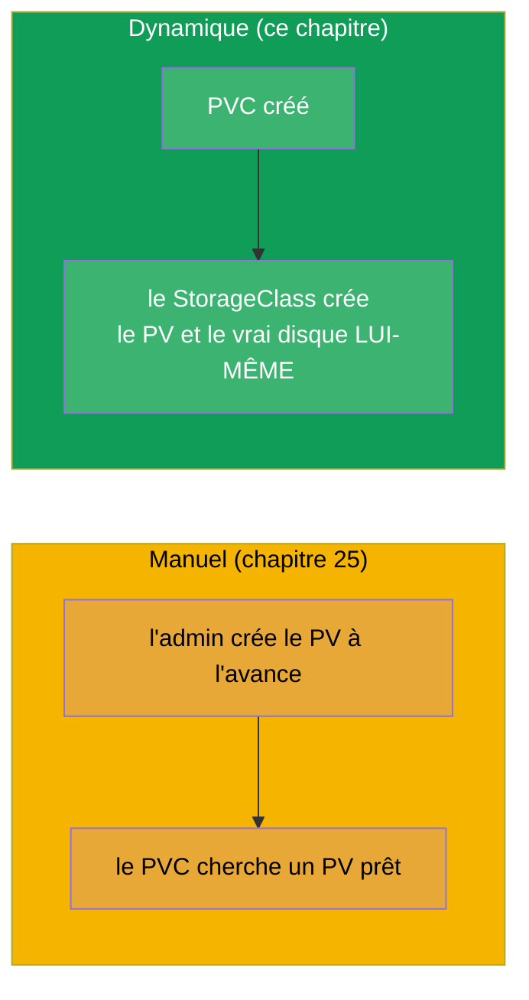
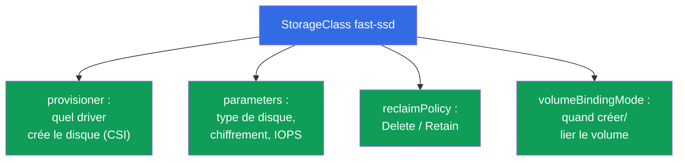
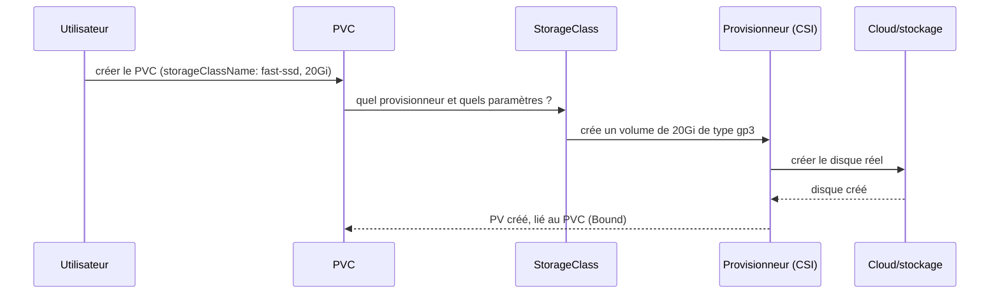
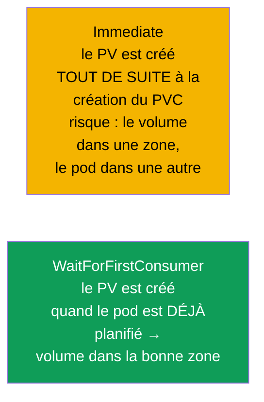
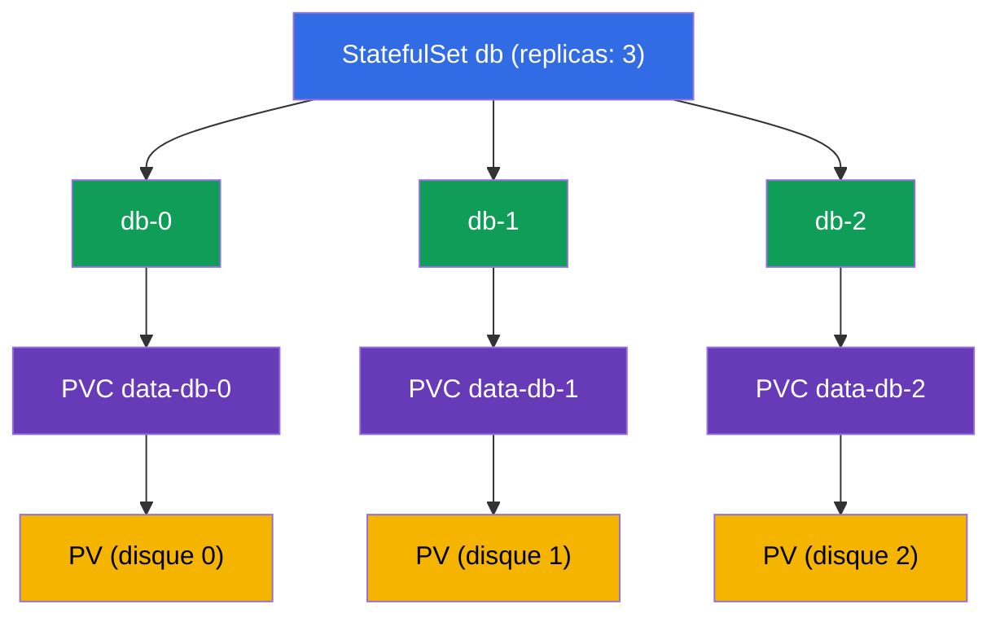

[Русская версия](ru.md) · [Eng version](README.md) · [Versión en español](es.md) · [Deutsche Version](de.md) · [ქართული ვერსია](ge.md) · [繁體中文版](tw.md) · [日本語版](jp.md)

# Chapitre 26. StorageClass, provisionnement dynamique et stockage dans un StatefulSet

> **Ce qui suit.** Au chapitre 25, le PV était créé à la main par l'administrateur - cela ne
> passe pas à l'échelle. Le **StorageClass** et le **provisionnement dynamique** automatisent
> tout ça : un PVC est créé - et le PV voulu, avec un vrai disque, apparaît tout seul. Nous
> boucherons aussi le trou du stockage dans un StatefulSet (les volumeClaimTemplates du
> chapitre 11 prendront enfin leur sens). Ce chapitre clôt la partie 5 et le domaine Storage
> (CKA 10 %). Le provisionnement dynamique, c'est la façon dont le stockage fonctionne dans les
> vrais clusters cloud.

## 26.1. Le problème du PV manuel et sa solution

Créer un PV à la main pour chaque PVC est lent et ne passe pas à l'échelle : l'administrateur
ne suivra pas le rythme des applications. La solution, c'est le **provisionnement dynamique** :
le PV est créé **automatiquement** au moment où le PVC apparaît, sur la base d'un
**StorageClass**.



## 26.2. StorageClass : le modèle de création des volumes

Le **StorageClass** décrit une « classe » de stockage : avec quel provisionneur créer les
volumes, avec quels paramètres, avec quelle politique de reclaim. C'est essentiellement le
modèle d'après lequel un PV naît en réponse à la demande d'un PVC.

```yaml
apiVersion: storage.k8s.io/v1
kind: StorageClass
metadata:
  name: fast-ssd
provisioner: ebs.csi.aws.com          # le driver qui crée les volumes
parameters:
  type: gp3                            # paramètres propres au provisionneur
  encrypted: "true"
reclaimPolicy: Delete                  # le sort du PV après la suppression du PVC
allowVolumeExpansion: true             # autoriser l'extension
volumeBindingMode: WaitForFirstConsumer
```



## 26.3. Comment fonctionne le provisionnement dynamique

Le PVC indique simplement le `storageClassName` voulu - et tout se passe tout seul :

```yaml
apiVersion: v1
kind: PersistentVolumeClaim
metadata:
  name: data
spec:
  accessModes: ["ReadWriteOnce"]
  storageClassName: fast-ssd       # ← nom du StorageClass
  resources:
    requests:
      storage: 20Gi
```



Le développeur n'a pas besoin de connaître les PV, les disques et le cloud - il n'écrit qu'un
PVC. L'infrastructure (StorageClass + driver CSI) fait le reste.

## 26.4. Default StorageClass

Un StorageClass peut être marqué comme **par défaut** avec l'annotation
`storageclass.kubernetes.io/is-default-class: "true"`. Un PVC **sans** `storageClassName`
explicite l'utilise alors.

```bash
kubectl get storageclass          # le classe par défaut affiche (default) à côté du nom
```


Dans les clusters managés (EKS/GKE/AKS), un StorageClass par défaut existe généralement déjà,
il suffit donc d'y créer un PVC - et le volume apparaît. S'il n'y a pas de classe par défaut et
que le PVC n'indique pas de classe, il restera bloqué en Pending.

## 26.5. volumeBindingMode : quand créer le volume

Un paramètre subtil mais important - **quand** créer et lier le volume :



- **Immediate** - le volume est créé dès que le PVC apparaît. Le problème dans le cloud : le
  disque peut se retrouver dans une zone de disponibilité et le pod être planifié dans une autre
  - il ne se montera pas (les disques sont zonaux).
- **WaitForFirstConsumer** - le volume n'est créé que lorsque le pod qui utilise le PVC est déjà
  affecté à un nœud. Le volume est alors créé dans la bonne zone. Dans le cloud, c'est le mode
  à privilégier.

## 26.6. Stockage dans un StatefulSet : volumeClaimTemplates

Revenons au StatefulSet (chapitre 11). Sa particularité, ce sont les
**volumeClaimTemplates** : un modèle d'après lequel chaque pod obtient dynamiquement **son
propre** PVC (et, via le StorageClass, son propre PV/disque).

```yaml
spec:
  volumeClaimTemplates:
  - metadata:
      name: data
    spec:
      accessModes: ["ReadWriteOnce"]
      storageClassName: fast-ssd
      resources:
        requests:
          storage: 10Gi
```



Propriété clé : le PVC `data-db-1` est **rattaché précisément au pod db-1**. Si db-1 est
recréé, il récupère à nouveau `data-db-1` avec ses données. Et encore : à la **suppression du
StatefulSet, ces PVC ne sont pas supprimés automatiquement** (protection des données) - on les
retire à la main.

## 26.7. CSI : comment les drivers de stockage se branchent à Kubernetes

Les provisionneurs (`provisioner` dans le StorageClass) implémentent le standard **CSI
(Container Storage Interface)** - une interface universelle entre Kubernetes et les systèmes de
stockage. Grâce à CSI, le même mécanisme PV/PVC/StorageClass fonctionne avec n'importe quel
stockage : disques cloud (EBS, GCE PD, Azure Disk), FS réseau (NFS, CephFS), baies
d'entreprise.


Nous verrons CSI plus en détail (avec CNI/CRI) au chapitre 40. Ici il suffit de comprendre :
derrière le `provisioner` il y a un driver CSI qui sait créer/supprimer/monter les volumes d'un
type de stockage donné.

## 26.8. Cas pratique : consulter, supprimer, étendre

Passons en revue les opérations types sur le stockage sous deux angles : un **PV local sur un
nœud** (statique, sans provisionneur) et un **disque cloud EBS** (dynamique, avec CSI). La
différence entre les deux se voit le mieux justement à la suppression et à l'extension.

### Consulter les PV et PVC existants

```bash
kubectl get pvc                 # PVC du namespace courant
kubectl get pvc -A              # dans tous les namespace
kubectl get pv                  # les PV sont au niveau du cluster, sans namespace

# les champs clés sont visibles tout de suite :
# PVC: STATUS (Bound/Pending), VOLUME (nom du PV), CAPACITY, STORAGECLASS
# PV:  STATUS (Bound/Available/Released), CLAIM (quel PVC), RECLAIMPOLICY

kubectl describe pvc data       # événements : pourquoi Pending, à quel PV il est lié
kubectl describe pv <pv-name>   # type de volume (hostPath/local/csi), nodeAffinity

# ce qui soutient réellement le volume : chemin sur le nœud ou ID du disque dans le cloud
kubectl get pv <pv-name> -o jsonpath='{.spec.local.path}{.spec.csi.volumeHandle}'
```

### Variante A. PV local sur un nœud (statique)

Un volume local, c'est un répertoire/disque d'un nœud précis. Il n'y a pas de provisionneur
dynamique : le PV est créé à la main par l'admin et rattaché en dur au nœud via
`nodeAffinity`.

```yaml
apiVersion: v1
kind: PersistentVolume
metadata:
  name: local-pv-node1
spec:
  capacity:
    storage: 10Gi
  accessModes: ["ReadWriteOnce"]
  persistentVolumeReclaimPolicy: Retain
  storageClassName: local-storage
  local:
    path: /mnt/disks/data
  nodeAffinity:
    required:
      nodeSelectorTerms:
      - matchExpressions:
        - key: kubernetes.io/hostname
          operator: In
          values: ["node1"]
```

- **Consulter** : `kubectl get pv local-pv-node1 -o wide` ; `kubectl describe pv ...` montrera
  le `Node Affinity` et le chemin `/mnt/disks/data`.
- **Supprimer** : on supprime le pod, puis le PVC (`kubectl delete pvc <name>`). Avec `Retain`,
  le PV passe en `Released`, mais il ne se libère PAS de lui-même pour une réutilisation, et les
  données restent dans `/mnt/disks/data` sur node1. Pour le réutiliser - nettoyer manuellement
  le répertoire sur le nœud et soit supprimer le PV (`kubectl delete pv local-pv-node1`), soit
  lui retirer son `spec.claimRef` pour le remettre en `Available`.
- **Étendre** : un volume local **ne prend pas en charge l'extension** via Kubernetes
  (provisionneur `no-provisioner`, `allowVolumeExpansion` est sans effet). « Agrandir » revient
  à donner manuellement plus de place sur le nœud (disque/partition) et, si nécessaire, à
  recréer le PV avec une nouvelle `capacity`. Via `kubectl edit pvc`, la taille n'augmentera
  pas.

### Variante B. Disque cloud EBS (dynamique)

Le disque est créé tout seul d'après le StorageClass avec le provisionneur CSI d'AWS, et il peut
être étendu à chaud.

```yaml
apiVersion: storage.k8s.io/v1
kind: StorageClass
metadata:
  name: ebs-sc
provisioner: ebs.csi.aws.com
parameters:
  type: gp3
reclaimPolicy: Delete
allowVolumeExpansion: true        # ← sans cela, impossible d'étendre le PVC
volumeBindingMode: WaitForFirstConsumer
---
apiVersion: v1
kind: PersistentVolumeClaim
metadata:
  name: data
spec:
  accessModes: ["ReadWriteOnce"]
  storageClassName: ebs-sc
  resources:
    requests:
      storage: 10Gi
```

- **Consulter** : `kubectl get pvc data` (Bound, PV lié), `kubectl get pv` montrera le PV créé
  automatiquement ; `kubectl get pv <pv> -o jsonpath='{.spec.csi.volumeHandle}'`
  donnera l'ID du volume EBS (`vol-0abc...`), également visible dans la console AWS.
- **Supprimer** : `kubectl delete pvc data`. Avec `reclaimPolicy: Delete`, le PV et le disque
  EBS lui-même sont supprimés automatiquement - vous cessez de payer pour eux. Avec `Retain`, le
  PV restera en `Released` et le disque EBS sera conservé (et continuera de coûter de l'argent)
  - on le retire à la main.
- **Étendre (en ligne)** : on augmente la demande dans le PVC - CSI étend le disque réel sans
  recréer le pod :

```bash
kubectl patch pvc data -p '{"spec":{"resources":{"requests":{"storage":"20Gi"}}}}'
# ou : kubectl edit pvc data  →  storage: 20Gi

kubectl get pvc data -w   # CAPACITY augmentera, la condition FileSystemResizePending disparaîtra
```

Subtilités de l'extension EBS :

- la taille ne peut qu'**augmenter**, il est impossible de la réduire ;
- il faut `allowVolumeExpansion: true` dans le StorageClass (à définir à l'avance, avant la
  création du PVC) ;
- l'extension du système de fichiers est généralement automatique ; sur certaines versions/FS,
  un redémarrage du pod peut être nécessaire ;
- dans AWS, un même volume EBS ne peut être modifié plus de 4 fois par fenêtre glissante de
  24 heures, et chaque modification suivante n'est possible qu'après que la précédente a atteint
  le statut `completed` (la modification elle-même prend de quelques minutes à plusieurs heures).

Bilan du contraste : le PV local est peu coûteux et rapide, mais rattaché au nœud, nettoyé à la
main et non extensible ; EBS est en libre-service et extensible en ligne, mais zonal et payant
tant qu'il existe.

## 26.9. Comment cela s'applique en production

- **Le provisionnement dynamique est la norme.** Dans les clusters cloud, le stockage fonctionne
  ainsi : le développeur crée un PVC, le StorageClass + CSI créent le disque tout seuls. Les PV
  manuels sont une rareté (pour des cas particuliers, comme un partage NFS déjà en place).
- **Plusieurs StorageClass pour des besoins différents.** Typiquement : `fast-ssd` (gp3/SSD pour
  les bases), `standard` (moins cher, pour les charges moins exigeantes), éventuellement
  `retain-ssd` avec `reclaimPolicy: Retain` pour les données critiques. L'application choisit sa
  classe selon son besoin et son prix.
- **WaitForFirstConsumer dans le cloud.** Dans les clusters multizones, on utilise presque
  toujours `WaitForFirstConsumer`, pour que le disque soit créé dans la même zone que le pod -
  sinon le disque zonal ne se montera pas.
- **reclaimPolicy Retain pour ce qui compte.** Pour les données de prod, le StorageClass est
  souvent réglé sur `Retain`, afin que la suppression du PVC ne détruise pas le disque.
  Équilibre : le confort de `Delete` contre la sécurité de `Retain`.
- **StatefulSet + PVC subsistent après la suppression.** On se rappelle que les PVC d'un
  StatefulSet ne sont pas supprimés automatiquement : cela protège les données de la base, mais
  exige un nettoyage réfléchi pour ne pas accumuler des disques « orphelins » (et ne pas payer
  pour eux).

## 26.10. Mini-glossaire

- **StorageClass** - modèle de création des volumes : provisionneur, paramètres, politique de
  reclaim.
- **Provisionnement dynamique** - création automatique d'un PV en réponse à la demande d'un PVC.
- **provisioner** - le driver CSI qui crée les volumes réels.
- **Default StorageClass** - classe par défaut pour les PVC sans classe explicite.
- **volumeBindingMode** - quand créer/lier le volume (Immediate /
  WaitForFirstConsumer).
- **volumeClaimTemplates** - modèle du StatefulSet qui crée un PVC pour chaque pod.
- **CSI (Container Storage Interface)** - standard de raccordement des stockages à Kubernetes.
- **allowVolumeExpansion** - autorisation d'étendre les volumes de la classe.

## 26.11. Bilan du chapitre

- Le provisionnement dynamique dispense de créer les PV à la main : le PVC apparaît - le PV avec
  un vrai disque est créé tout seul d'après le StorageClass.
- Le StorageClass définit le provisionneur (driver CSI), les paramètres du stockage, la
  reclaimPolicy, allowVolumeExpansion et volumeBindingMode.
- Le PVC indique un `storageClassName` ; sans indication, le default StorageClass est utilisé
  (s'il existe), sinon le PVC reste en Pending.
- `WaitForFirstConsumer` crée le volume après la planification du pod - la bonne approche pour
  les clouds multizones ; `Immediate` peut créer le disque dans la mauvaise zone.
- Un StatefulSet, via `volumeClaimTemplates`, crée un PVC par pod ; le PVC est rattaché au pod
  et n'est pas supprimé automatiquement à la suppression du StatefulSet.
- Derrière le provisionneur il y a un driver CSI - une interface unique vers n'importe quel
  stockage.
- On consulte les PV/PVC avec `kubectl get/describe pv,pvc` ; la suppression et l'extension
  fonctionnent différemment pour un volume local et pour un disque cloud.
- PV local sur un nœud : rattaché au nœud, nettoyé à la main avec `Retain`, extension non prise
  en charge. EBS : supprimé automatiquement avec `Delete`, étendu en ligne si
  `allowVolumeExpansion: true` (uniquement vers le haut).

## 26.12. À quoi cela sert : à l'examen et dans le travail réel

**À l'examen.** « Crée un PVC avec le StorageClass voulu », « pourquoi le PVC est en Pending »
(pas de classe par défaut/de provisionneur), « déploie un StatefulSet avec des
volumeClaimTemplates » - des exercices types du domaine Storage. Il faut comprendre la chaîne
StorageClass → provisionneur → PV et le rôle de la classe par défaut.

**Dans le travail réel.** Le provisionnement dynamique, c'est la façon dont le stockage
fonctionne vraiment dans le cloud : le développeur écrit un PVC, le disque apparaît tout seul.
Des StorageClass bien réglés (type de disque, reclaimPolicy, WaitForFirstConsumer) déterminent la
performance, le coût et la préservation des données. La gestion des PVC issus d'un StatefulSet
fait partie de l'exploitation des bases de données dans le cluster.

## 26.13. Questions d'auto-évaluation

1. En quoi le provisionnement dynamique vaut-il mieux que la création manuelle de PV ?
2. Que décrit un StorageClass et qu'est-ce qu'un provisioner ?
3. Comment un PVC choisit-il son StorageClass et que se passe-t-il sans indication de classe ?
4. Quelle est la différence entre Immediate et WaitForFirstConsumer ? Pourquoi le second compte-t-il dans le cloud ?
5. Comment les volumeClaimTemplates relient-ils un pod de StatefulSet à son volume lors de la recréation ?
6. Pourquoi les PVC d'un StatefulSet ne sont-ils pas supprimés automatiquement et en quoi est-ce important ?
7. Qu'est-ce que CSI et quel rôle joue-t-il dans le provisionnement ?
8. Comment consulter la liste des PV et PVC et voir ce qui soutient réellement le volume (chemin sur le nœud ou ID du disque) ?
9. Qu'est-ce qui différencie la suppression et l'extension entre un PV local sur un nœud et un disque cloud EBS ?

## Pratique

La partie 5 (le stockage) s'achève ici. Ensuite - la partie 6 : observabilité et maintenance, en
commençant par les probes (liveness, readiness, startup - chapitre 27). Le StorageClass, le
provisionnement dynamique et le stockage de StatefulSet se travaillent dans les TP sur le
stockage.

🧪 TP 108 (StorageClass et stockage dans un StatefulSet) : [tasks/cka/labs/108](../../labs/108/README_FR.MD)

🎮 Killercoda (dans le navigateur, sans installation) : [Dynamic Storage with StorageClass and PVC](https://killercoda.com/chadmcrowell/course/cka/storage-dynamic)

---
[Sommaire](../README_FR.md) · [Chapitre 25](../25/fr.md) · [Chapitre 27](../27/fr.md)
