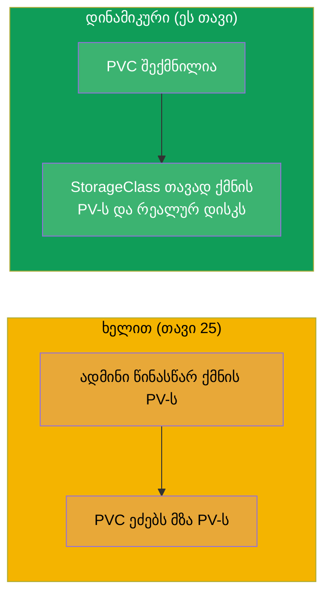
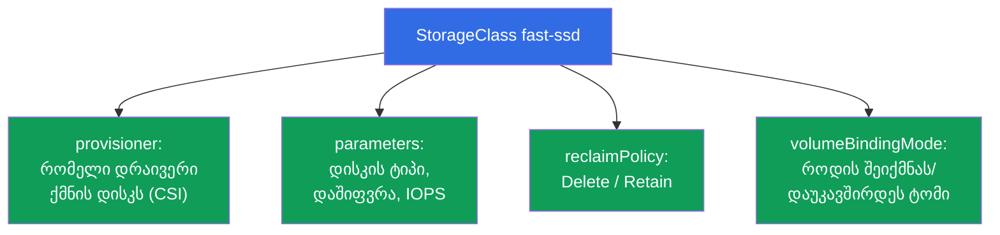
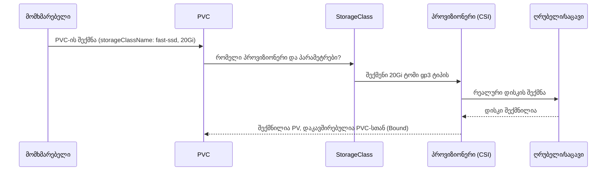
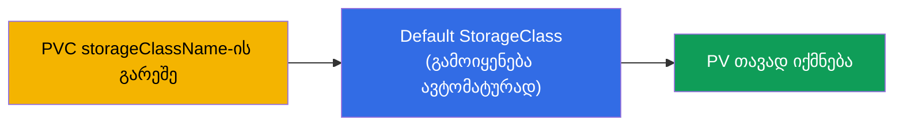
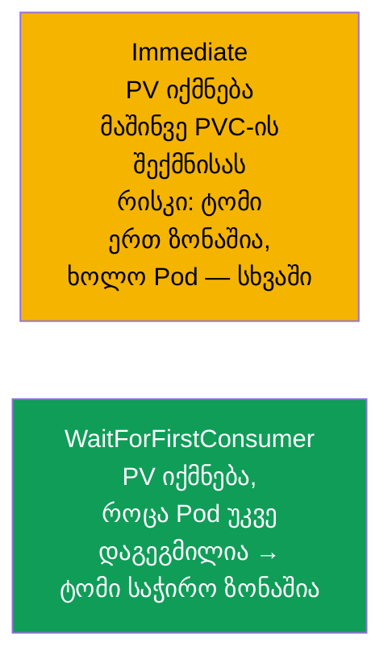
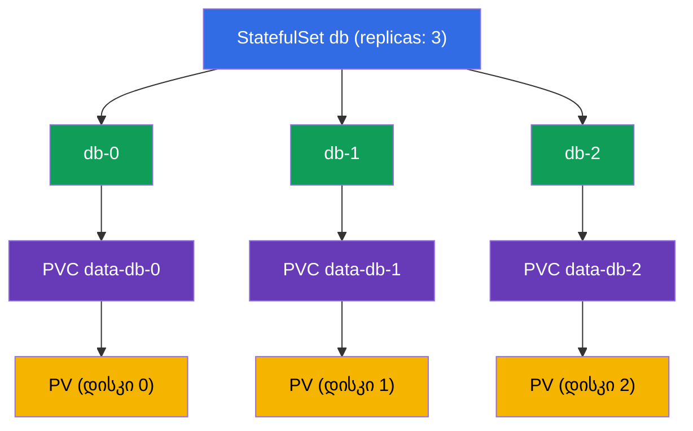
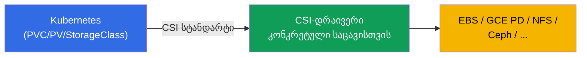

[Русская версия](ru.md) · [Eng version](README.md) · [Versión en español](es.md) · [Version française](fr.md) · [Deutsche Version](de.md) · [繁體中文版](tw.md) · [日本語版](jp.md)

# თავი 26. StorageClass, დინამიკური პროვიზიონინგი და შენახვა StatefulSet-ში

> **რა იქნება შემდეგ.** თავ 25-ში PV-ს ადმინისტრატორი ხელით ქმნიდა - ეს არ მასშტაბირდება.
> **StorageClass** და **დინამიკური პროვიზიონინგი** ამას ავტომატიზირებს: PVC იქმნება - და
> საჭირო PV რეალური დისკით თავად ჩნდება. დამატებით დავხურავთ შენახვას StatefulSet-ში
> (თავ 11-ის volumeClaimTemplates აზრს შეიძენს). ასრულებს ნაწილ 5-ს და Storage-დომენს
> (CKA 10%). დინამიკური პროვიზიონინგი - ეს არის ის, როგორ მუშაობს საცავი რეალურ ღრუბლოვან
> კლასტერებში.

## 26.1. ხელით შექმნილი PV-ის პრობლემა და მისი გადაწყვეტა

PV-ის ხელით შექმნა ყოველი PVC-ისთვის - ნელია და არ მასშტაბირდება: ადმინისტრატორი ვერ
მოასწრებს აპლიკაციებს. გადაწყვეტა - **დინამიკური პროვიზიონინგი**: PV იქმნება
**ავტომატურად** PVC-ის გამოჩენის მომენტში, **StorageClass**-ის საფუძველზე.



## 26.2. StorageClass: ტომების შექმნის შაბლონი

**StorageClass** აღწერს საცავის „კლასს“: რომელი პროვიზიონერით შეიქმნას ტომები, რომელი
პარამეტრებით, რომელი reclaim-პოლიტიკით. არსებითად ეს არის შაბლონი, რომლის მიხედვითაც PVC-ის
მოთხოვნის ქვეშ იბადება PV.

```yaml
apiVersion: storage.k8s.io/v1
kind: StorageClass
metadata:
  name: fast-ssd
provisioner: ebs.csi.aws.com          # დრაივერი, რომელიც ქმნის ტომებს
parameters:
  type: gp3                            # პარამეტრები კონკრეტული პროვიზიონერისთვის
  encrypted: "true"
reclaimPolicy: Delete                  # PV-ის ბედი PVC-ის წაშლის შემდეგ
allowVolumeExpansion: true             # გაფართოების დაშვება
volumeBindingMode: WaitForFirstConsumer
```



## 26.3. როგორ მუშაობს დინამიკური პროვიზიონინგი

PVC უბრალოდ მიუთითებს საჭირო `storageClassName`-ს - და ყველაფერი თავად ხდება:

```yaml
apiVersion: v1
kind: PersistentVolumeClaim
metadata:
  name: data
spec:
  accessModes: ["ReadWriteOnce"]
  storageClassName: fast-ssd       # ← StorageClass-ის სახელი
  resources:
    requests:
      storage: 20Gi
```



დეველოპერს არ სჭირდება იცოდეს PV-ზე, დისკებზე და ღრუბელზე - ის წერს მხოლოდ PVC-ს. ინფრასტრუქტურა
(StorageClass + CSI-დრაივერი) აკეთებს დანარჩენს.

## 26.4. Default StorageClass

ერთი StorageClass შეიძლება მოინიშნოს **დეფოლტურად** ანოტაციით
`storageclass.kubernetes.io/is-default-class: "true"`. მაშინ PVC **ცხადი**
`storageClassName`-ის **გარეშე** მას გამოიყენებს.

```bash
kubectl get storageclass          # დეფოლტურს სახელის გვერდით ეწერება (default)
```



მართულ კლასტერებში (EKS/GKE/AKS) დეფოლტური StorageClass ჩვეულებრივ უკვე არსებობს, ამიტომ იქ
საკმარისია PVC-ის შექმნა - და ტომი გამოჩნდება. თუ დეფოლტური კლასი არ არის, ხოლო PVC არ მიუთითებს
კლასს, ის გაიჭედება Pending-ში.

## 26.5. volumeBindingMode: როდის შეიქმნას ტომი

წვრილი, მაგრამ მნიშვნელოვანი პარამეტრი - **როდის** შეიქმნას და დაუკავშირდეს ტომი:



- **Immediate** - ტომი იქმნება მაშინვე, როგორც კი გამოჩნდა PVC. პრობლემა ღრუბელში: დისკი
  შეიძლება აღმოჩნდეს ერთ ხელმისაწვდომობის ზონაში, ხოლო Pod სხვაში დაიგეგმოს - და ის ვერ
  მიმაგრდება (დისკები ზონალურია).
- **WaitForFirstConsumer** - ტომი იქმნება მხოლოდ მაშინ, როცა Pod, რომელიც PVC-ს იყენებს, უკვე
  მიბმულია ნოუდზე. მაშინ ტომი იქმნება სწორ ზონაში. ღრუბელში ეს უპირატესი
  რეჟიმია.

## 26.6. შენახვა StatefulSet-ში: volumeClaimTemplates

დავუბრუნდეთ StatefulSet-ს (თავი 11). მისი თავისებურება - **volumeClaimTemplates**: შაბლონი,
რომლის მიხედვითაც ყოველ Pod-ს დინამიკურად იქმნება **თავისი** PVC (ხოლო StorageClass-ის მეშვეობით - და
თავისი PV/დისკი).

```yaml
spec:
  volumeClaimTemplates:
  - metadata:
      name: data
    spec:
      accessModes: ["ReadWriteOnce"]
      storageClassName: fast-ssd
      resources:
        requests:
          storage: 10Gi
```



მთავარი თვისება: PVC `data-db-1` **მიბმულია ზუსტად Pod db-1-ზე**. ხელახლა შეიქმნა db-1 -
ის კვლავ მიიღებს `data-db-1`-ს თავისი მონაცემებით. და კიდევ: **StatefulSet-ის წაშლისას ეს PVC-ები
ავტომატურად არ იშლება** (მონაცემების დაცვა) - მათ ხელით აშორებენ.

## 26.7. CSI: როგორ ერთვება საცავის დრაივერები Kubernetes-ს

პროვიზიონერები (`provisioner` StorageClass-ში) ახორციელებენ სტანდარტს **CSI (Container Storage
Interface)** - უნივერსალურ ინტერფეისს Kubernetes-სა და საცავის სისტემებს შორის. CSI-ის წყალობით
ერთი და იგივე მექანიზმი PV/PVC/StorageClass მუშაობს ნებისმიერ საცავთან: ღრუბლოვან
დისკებთან (EBS, GCE PD, Azure Disk), ქსელურ ფს-ებთან (NFS, CephFS), enterprise-სდს-ებთან.



CSI-ს უფრო დეტალურად (CNI/CRI-სთან ერთად) გავარჩევთ თავ 40-ში. აქ საკმარისია გვესმოდეს: `provisioner`-ის
უკან დგას CSI-დრაივერი, რომელსაც შეუძლია კონკრეტული ტიპის საცავის ტომების
შექმნა/წაშლა/მიმაგრება.

## 26.8. პრაქტიკული ქეისი: ნახვა, წაშლა, გაფართოება

გავარჩიოთ საცავზე ტიპური ოპერაციები ორ ჭრილში: **ლოკალური PV ნოუდზე**
(სტატიკური, პროვიზიონერის გარეშე) და **ღრუბლოვანი დისკი EBS** (დინამიკური, CSI-ით). განსხვავება
მათ შორის ყველაზე მკაფიოდ სწორედ წაშლასა და გაფართოებაზე ჩანს.

### ნახვა, რომელი PV და PVC არსებობს

```bash
kubectl get pvc                 # PVC მიმდინარე namespace-ში
kubectl get pvc -A              # ყველა namespace-ში
kubectl get pv                  # PV — კლასტერულია, namespace-ის გარეშე

# მაშინვე ჩანს მთავარი ველები:
# PVC: STATUS (Bound/Pending), VOLUME (PV-ის სახელი), CAPACITY, STORAGECLASS
# PV:  STATUS (Bound/Available/Released), CLAIM (რომელი PVC), RECLAIMPOLICY

kubectl describe pvc data       # მოვლენები: რატომ Pending, რომელ PV-სთანაა მიბმული
kubectl describe pv <pv-name>   # ტომის ტიპი (hostPath/local/csi), nodeAffinity

# რითი არის რეალურად უზრუნველყოფილი ტომი: ბილიკი ნოუდზე თუ დისკის ID ღრუბელში
kubectl get pv <pv-name> -o jsonpath='{.spec.local.path}{.spec.csi.volumeHandle}'
```

### ვარიანტი A. ლოკალური PV ნოუდზე (სტატიკური)

ლოკალური ტომი - ეს არის კონკრეტული ნოუდის კატალოგი/დისკი. დინამიკური პროვიზიონერი არ არის: PV-ს
ადმინი ქმნის ხელით და მკაცრად მიაბამს ნოუდზე `nodeAffinity`-ის მეშვეობით.

```yaml
apiVersion: v1
kind: PersistentVolume
metadata:
  name: local-pv-node1
spec:
  capacity:
    storage: 10Gi
  accessModes: ["ReadWriteOnce"]
  persistentVolumeReclaimPolicy: Retain
  storageClassName: local-storage
  local:
    path: /mnt/disks/data
  nodeAffinity:
    required:
      nodeSelectorTerms:
      - matchExpressions:
        - key: kubernetes.io/hostname
          operator: In
          values: ["node1"]
```

- **ნახვა**: `kubectl get pv local-pv-node1 -o wide`; `kubectl describe pv ...`
  აჩვენებს `Node Affinity`-ს და ბილიკს `/mnt/disks/data`.
- **წაშლა**: ვშლით Pod-ს, შემდეგ PVC-ს (`kubectl delete pvc <name>`). `Retain`-ის დროს PV
  გადადის `Released`-ში, მაგრამ თავად არ თავისუფლდება ხელახალი გამოყენებისთვის, ხოლო მონაცემები
  რჩება `/mnt/disks/data`-ში node1-ზე. ხელახლა გამოსაყენებლად - ხელით უნდა გასუფთავდეს
  კატალოგი ნოუდზე და ან წაიშალოს PV (`kubectl delete pv local-pv-node1`), ან მოეშალოს
  მას `spec.claimRef`, რაც მას `Available`-ში დააბრუნებს.
- **გაფართოება**: ლოკალური ტომი **არ უჭერს მხარს გაფართოებას** Kubernetes-ის მეშვეობით
  (პროვიზიონერი `no-provisioner`, `allowVolumeExpansion` არ მოქმედებს). „გაზრდა“ - ეს არის
  ხელით მეტი ადგილის მიცემა ნოუდზე (დისკი/დანაყოფი) და საჭიროების შემთხვევაში PV-ის ხელახლა შექმნა
  ახალი `capacity`-ით. `kubectl edit pvc`-ის მეშვეობით ზომა არ გაიზრდება.

### ვარიანტი B. ღრუბლოვანი დისკი EBS (დინამიკური)

დისკი თავად იქმნება StorageClass-ის მიხედვით AWS-ის CSI-პროვიზიონერით, და მისი გაფართოება შეიძლება ფრენაში.

```yaml
apiVersion: storage.k8s.io/v1
kind: StorageClass
metadata:
  name: ebs-sc
provisioner: ebs.csi.aws.com
parameters:
  type: gp3
reclaimPolicy: Delete
allowVolumeExpansion: true        # ← ამის გარეშე PVC-ის გაფართოება არ შეიძლება
volumeBindingMode: WaitForFirstConsumer
---
apiVersion: v1
kind: PersistentVolumeClaim
metadata:
  name: data
spec:
  accessModes: ["ReadWriteOnce"]
  storageClassName: ebs-sc
  resources:
    requests:
      storage: 10Gi
```

- **ნახვა**: `kubectl get pvc data` (Bound, მიბმულია PV), `kubectl get pv` აჩვენებს
  ავტომატურად შექმნილ PV-ს; `kubectl get pv <pv> -o jsonpath='{.spec.csi.volumeHandle}'`
  მოგცემთ EBS ტომის ID-ს (`vol-0abc...`), რომელიც AWS-ის კონსოლშიც ჩანს.
- **წაშლა**: `kubectl delete pvc data`. `reclaimPolicy: Delete`-ის დროს PV და თავად EBS დისკი
  ავტომატურად იშლება - მათი გადახდას წყვეტთ. `Retain`-ის დროს PV დარჩება
  `Released`-ად, ხოლო EBS დისკი შენარჩუნდება (და გადასახადს განაგრძობს) - მას ხელით აშორებენ.
- **გაფართოება (ონლაინ)**: ვზრდით მოთხოვნას PVC-ში - CSI აფართოებს რეალურ დისკს Pod-ის
  ხელახლა შექმნის გარეშე:

```bash
kubectl patch pvc data -p '{"spec":{"resources":{"requests":{"storage":"20Gi"}}}}'
# ან: kubectl edit pvc data  →  storage: 20Gi

kubectl get pvc data -w   # CAPACITY გაიზრდება, პირობა FileSystemResizePending გაქრება
```

EBS-ის გაფართოების ნიუანსები:

- ზომა შეიძლება მხოლოდ **გაიზარდოს**, შემცირება არ შეიძლება;
- საჭიროა `allowVolumeExpansion: true` StorageClass-ში (ყენდება წინასწარ, PVC-ის შექმნამდე);
- ფაილური სისტემის გაფართოება ჩვეულებრივ ავტომატურია; ნაწილ ვერსიებზე/ფს-ებზე შეიძლება
  დასჭირდეს Pod-ის გადატვირთვა;
- AWS-ში ერთი EBS ტომის შეცვლა შეიძლება არაუმეტეს 4-ჯერ მოცურავე 24 საათში, და ყოველი
  შემდეგი შეცვლა შესაძლებელია მხოლოდ მას შემდეგ, რაც წინა მიაღწევს სტატუსს
  `completed` (თავად შეცვლა წუთებიდან რამდენიმე საათამდე გრძელდება).

კონტრასტის შედეგი: ლოკალური PV იაფი და სწრაფია, მაგრამ მიბმულია ნოუდზე, სუფთავდება ხელით და არ
ფართოვდება; EBS - თვითმომსახურე და ონლაინ გაფართოებადია, მაგრამ ზონალური და ფასიანია, სანამ
არსებობს.

## 26.9. როგორ იყენებენ ამას პროდაქშენში

- **დინამიკური პროვიზიონინგი - სტანდარტია.** ღრუბლოვან კლასტერებში საცავი ასე მუშაობს:
  დეველოპერი ქმნის PVC-ს, StorageClass + CSI თავად ქმნიან დისკს. ხელით შექმნილი PV - იშვიათობაა (განსაკუთრებული
  შემთხვევებისთვის, როგორიცაა მზა NFS-შეარი).
- **რამდენიმე StorageClass სხვადასხვა საჭიროებისთვის.** ტიპურია: `fast-ssd` (gp3/SSD ბდ-ისთვის),
  `standard` (უფრო იაფი, ნაკლებად მომთხოვნისთვის), შესაძლოა `retain-ssd`
  `reclaimPolicy: Retain`-ით კრიტიკული მონაცემებისთვის. აპლიკაცია ირჩევს კლასს საჭიროებისა და
  ფასის მიხედვით.
- **WaitForFirstConsumer ღრუბელში.** მრავალზონალურ კლასტერებში თითქმის ყოველთვის იყენებენ
  `WaitForFirstConsumer`-ს, რომ დისკი იმავე ზონაში შეიქმნას, სადაც Pod-ია, - სხვაგვარად
  ზონალური დისკი ვერ მიმაგრდება.
- **reclaimPolicy Retain მნიშვნელოვნისთვის.** პროდის მონაცემებისთვის StorageClass-ს ხშირად აყენებენ
  `Retain`-ზე, რომ PVC-ის წაშლამ დისკი არ გაანადგუროს. ბალანსი: `Delete`-ის მოხერხებულობა
  `Retain`-ის უსაფრთხოების წინააღმდეგ.
- **StatefulSet + PVC რჩება წაშლის შემდეგ.** გახსოვდეთ, რომ StatefulSet-ის PVC-ები ავტომატურად
  არ იშლება: ეს იცავს ბდ-ის მონაცემებს, მაგრამ მოითხოვს გაცნობიერებულ გასუფთავებას, რომ არ
  დაგროვდეს „დაობლებული“ დისკები (და არ გადაიხადოთ მათთვის).

## 26.10. მინი-ლექსიკონი

- **StorageClass** - ტომების შექმნის შაბლონი: პროვიზიონერი, პარამეტრები, reclaim-პოლიტიკა.
- **დინამიკური პროვიზიონინგი** - PV-ის ავტომატური შექმნა PVC-ის მოთხოვნის ქვეშ.
- **provisioner** - CSI-დრაივერი, რომელიც ქმნის რეალურ ტომებს.
- **Default StorageClass** - ნაგულისხმევი კლასი PVC-ისთვის ცხადი კლასის გარეშე.
- **volumeBindingMode** - როდის შეიქმნას/დაუკავშირდეს ტომი (Immediate /
  WaitForFirstConsumer).
- **volumeClaimTemplates** - StatefulSet-ის შაბლონი, რომელიც ქმნის PVC-ს ყოველ Pod-ზე.
- **CSI (Container Storage Interface)** - საცავების Kubernetes-თან მიერთების სტანდარტი.
- **allowVolumeExpansion** - კლასის ტომების გაფართოების ნებართვა.

## 26.11. თავის შეჯამება

- დინამიკური პროვიზიონინგი გვათავისუფლებს PV-ის ხელით შექმნისგან: PVC გამოჩნდა - PV რეალური
  დისკით თავად იქმნება StorageClass-ის მიხედვით.
- StorageClass აყენებს პროვიზიონერს (CSI-დრაივერს), საცავის პარამეტრებს, reclaimPolicy-ს,
  allowVolumeExpansion-ს და volumeBindingMode-ს.
- PVC მიუთითებს `storageClassName`-ს; მითითების გარეშე გამოიყენება default StorageClass (თუ
  ის არსებობს), სხვაგვარად PVC - Pending.
- `WaitForFirstConsumer` ქმნის ტომს Pod-ის დაგეგმვის შემდეგ - სწორია
  მრავალზონალური ღრუბლებისთვის; `Immediate` შეიძლება დისკი არასწორ ზონაში შექმნას.
- StatefulSet `volumeClaimTemplates`-ის მეშვეობით ქმნის თავის PVC-ს ყოველ Pod-ზე; PVC მიბმულია
  Pod-ზე და ავტომატურად არ იშლება StatefulSet-ის წაშლისას.
- პროვიზიონერის უკან დგას CSI-დრაივერი - ერთიანი ინტერფეისი ნებისმიერ საცავთან.
- PV/PVC-ს ათვალიერებენ `kubectl get/describe pv,pvc`-ით; წაშლა და გაფართოება სხვადასხვაგვარად
  მუშაობს ლოკალურ ტომსა და ღრუბლოვან დისკზე.
- ლოკალური PV ნოუდზე: მიბმულია ნოუდზე, `Retain`-ის დროს სუფთავდება ხელით, გაფართოებას არ
  უჭერს მხარს. EBS: ავტომატურად იშლება `Delete`-ის დროს, ონლაინ ფართოვდება
  `allowVolumeExpansion: true`-ის დროს (მხოლოდ ზევით).

## 26.12. როგორ გამოგადგებათ: გამოცდაზე და რეალურ სამუშაოში

**გამოცდაზე.** „შექმენი PVC საჭირო StorageClass-ით“, „რატომ არის PVC Pending-ში“ (არ არის
დეფოლტური კლასი/პროვიზიონერი), „გაშალე StatefulSet volumeClaimTemplates-ით“ - Storage-დომენის
ტიპური დავალებებია. საჭიროა კავშირის StorageClass → პროვიზიონერი → PV და default-კლასის
როლის გაგება.

**რეალურ სამუშაოში.** დინამიკური პროვიზიონინგი - ეს არის ის, როგორ მუშაობს საცავი რეალურად
ღრუბელში: დეველოპერი წერს PVC-ს, დისკი თავად ჩნდება. სწორი StorageClass-ები (დისკის ტიპი,
reclaimPolicy, WaitForFirstConsumer) განსაზღვრავენ წარმადობას, ღირებულებას და მონაცემთა
დაცულობას. StatefulSet-ის PVC-ების მართვა - კლასტერში მონაცემთა ბაზების ექსპლუატაციის
ნაწილია.

## 26.13. თვითშემოწმების კითხვები

1. რითი უკეთესია დინამიკური პროვიზიონინგი PV-ის ხელით შექმნაზე?
2. რას აღწერს StorageClass და რა არის provisioner?
3. როგორ ირჩევს PVC StorageClass-ს და რა ხდება კლასის მითითების გარეშე?
4. რა განსხვავებაა Immediate-სა და WaitForFirstConsumer-ს შორის? რატომ არის ღრუბელში მნიშვნელოვანი მეორე?
5. როგორ აკავშირებს volumeClaimTemplates StatefulSet-ის Pod-ს მის ტომთან ხელახლა შექმნისას?
6. რატომ არ იშლება StatefulSet-ის PVC-ები ავტომატურად და რატომ არის ეს მნიშვნელოვანი?
7. რა არის CSI და რა როლს ასრულებს ის პროვიზიონინგში?
8. როგორ ვნახოთ PV-ისა და PVC-ის სია და რითი არის რეალურად უზრუნველყოფილი ტომი (ბილიკი ნოუდზე თუ დისკის ID)?
9. რითი განსხვავდება წაშლა და გაფართოება ლოკალურ PV-ზე ნოუდზე და ღრუბლოვან დისკ EBS-ზე?

## პრაქტიკა

ამით ნაწილი 5 (შენახვა) დასრულებულია. შემდეგ - ნაწილი 6: დაკვირვებადობა და მომსახურება,
პრობებიდან დაწყებული (liveness, readiness, startup - თავი 27). StorageClass, დინამიკური
პროვიზიონინგი და StatefulSet-ის საცავი მუშავდება შენახვის ლაბებში.

🧪 ლაბი 108 (StorageClass და შენახვა StatefulSet-ში): [tasks/cka/labs/108](../../labs/108/README_GE.MD)

🎮 Killercoda (ბრაუზერში, ინსტალაციის გარეშე): [Dynamic Storage with StorageClass and PVC](https://killercoda.com/chadmcrowell/course/cka/storage-dynamic)

---
[სარჩევი](../README_GE.md) · [თავი 25](../25/ge.md) · [თავი 27](../27/ge.md)
