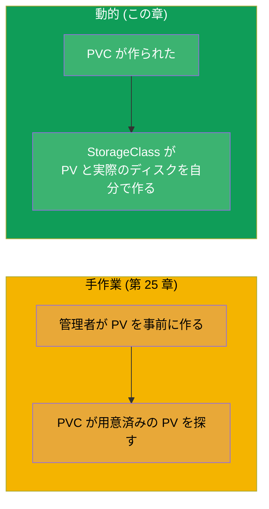
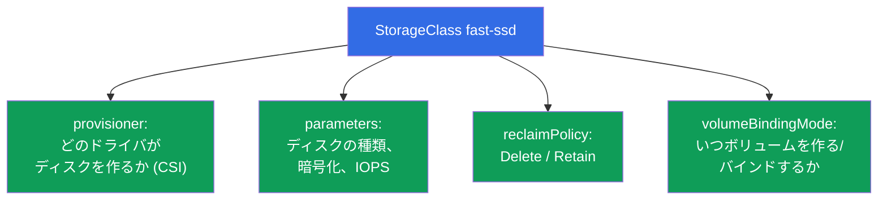
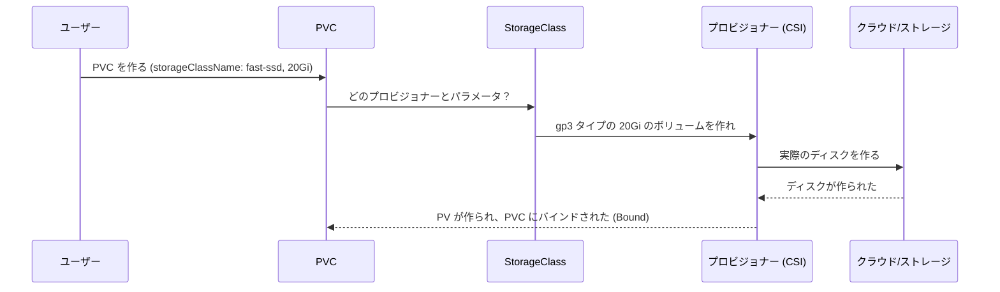
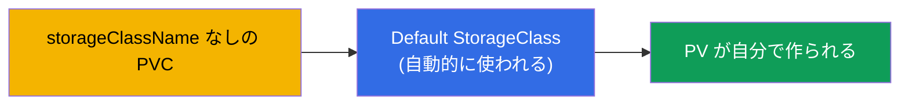
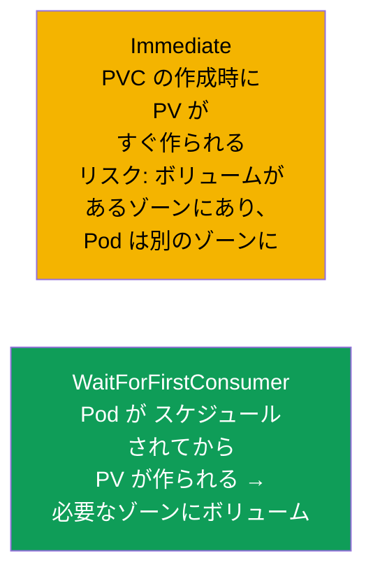
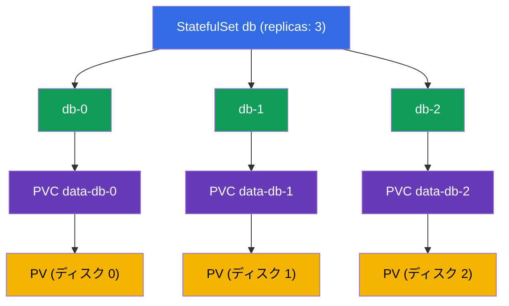
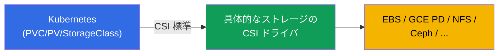

[Русская версия](ru.md) · [Eng version](README.md) · [Versión en español](es.md) · [Version française](fr.md) · [Deutsche Version](de.md) · [ქართული ვერსია](ge.md) · [繁體中文版](tw.md)

# 第 26 章。StorageClass、動的プロビジョニングと StatefulSet におけるストレージ

> **次は何か。** 第 25 章では PV を管理者が手作業で作っていました - これはスケールしません。
> **StorageClass** と **動的プロビジョニング** はそれを自動化します：PVC が作られると、
> 必要な PV が実際のディスクと一緒に自分で現れます。さらに StatefulSet におけるストレージも
> 片付けます (第 11 章の volumeClaimTemplates に意味が生まれます)。パート 5 と Storage 領域
> (CKA 10%) を締めくくる章です。動的プロビジョニングは、実際のクラウドのクラスタで
> ストレージがどう動いているか、そのものです。

## 26.1. 手作業の PV の問題とその解決

PVC ごとに PV を手で作るのは遅く、スケールしません：管理者はアプリケーションの速さに
追いつけません。解決策が **動的プロビジョニング** です：PV は PVC が現れた時点で、
**StorageClass** にもとづいて **自動的に** 作られます。



## 26.2. StorageClass：ボリュームを作るためのテンプレート

**StorageClass** はストレージの「クラス」を記述します：どのプロビジョナーでボリュームを
作るのか、どんなパラメータで、どんな reclaim ポリシーで。要するに、PVC の要求に応じて
PV が生まれるためのテンプレートです。

```yaml
apiVersion: storage.k8s.io/v1
kind: StorageClass
metadata:
  name: fast-ssd
provisioner: ebs.csi.aws.com          # ボリュームを作るドライバ
parameters:
  type: gp3                            # 具体的なプロビジョナー向けのパラメータ
  encrypted: "true"
reclaimPolicy: Delete                  # PVC 削除後の PV の運命
allowVolumeExpansion: true             # 拡張を許可する
volumeBindingMode: WaitForFirstConsumer
```



## 26.3. 動的プロビジョニングはどう動くか

PVC は必要な `storageClassName` を指定するだけ - あとはすべて自動で起こります：

```yaml
apiVersion: v1
kind: PersistentVolumeClaim
metadata:
  name: data
spec:
  accessModes: ["ReadWriteOnce"]
  storageClassName: fast-ssd       # ← StorageClass の名前
  resources:
    requests:
      storage: 20Gi
```



開発者は PV やディスク、クラウドについて知る必要がありません - 書くのは PVC だけです。
残りは基盤 (StorageClass + CSI ドライバ) がやります。

## 26.4. Default StorageClass

1 つの StorageClass にはアノテーション
`storageclass.kubernetes.io/is-default-class: "true"` で **デフォルト** の印を付けられます。
すると `storageClassName` を明示 **しない** PVC がそれを使います。

```bash
kubectl get storageclass          # デフォルトのものは名前の隣に (default) が付く
```



マネージドなクラスタ (EKS/GKE/AKS) ではデフォルトの StorageClass がふつう最初からあるので、
そこでは PVC を作るだけでボリュームが現れます。デフォルトのクラスがなく、PVC もクラスを
指定しない場合、その PVC は Pending のまま止まります。

## 26.5. volumeBindingMode：いつボリュームを作るか

細かいけれど重要なパラメータ - ボリュームを **いつ** 作ってバインドするか：



- **Immediate** - PVC が現れた時点でボリュームがすぐ作られます。クラウドでの問題：
  ディスクが 1 つのアベイラビリティゾーンに作られ、Pod は別のゾーンにスケジュールされて
  マウントできない、ということが起こります (ディスクはゾーンに属します)。
- **WaitForFirstConsumer** - PVC を使う Pod がすでにノードへ割り当てられてから
  ボリュームが作られます。そうすれば正しいゾーンにボリュームが作られます。クラウドでは
  こちらが推奨のモードです。

## 26.6. StatefulSet におけるストレージ：volumeClaimTemplates

StatefulSet (第 11 章) に戻りましょう。その特徴が **volumeClaimTemplates** です：
このテンプレートにもとづいて、各 Pod に **それぞれ専用の** PVC が動的に作られます
(そして StorageClass を通して専用の PV/ディスクも)。

```yaml
spec:
  volumeClaimTemplates:
  - metadata:
      name: data
    spec:
      accessModes: ["ReadWriteOnce"]
      storageClassName: fast-ssd
      resources:
        requests:
          storage: 10Gi
```



重要な性質：PVC `data-db-1` は **まさに Pod db-1 に結び付いています**。db-1 が
作り直されれば、また自分のデータが入った `data-db-1` を受け取ります。そしてもう 1 つ：
**StatefulSet を削除してもこれらの PVC は自動的には削除されません** (データの保護) -
手作業で片付けます。

## 26.7. CSI：ストレージのドライバはどう Kubernetes につながるか

プロビジョナー (StorageClass の `provisioner`) は **CSI (Container Storage
Interface)** 標準を実装しています - Kubernetes とストレージシステムの間の汎用インタフェース
です。CSI のおかげで、同じ PV/PVC/StorageClass の仕組みがあらゆるストレージで動きます：
クラウドのディスク (EBS、GCE PD、Azure Disk)、ネットワークファイルシステム (NFS、CephFS)、
エンタープライズのストレージ装置。



CSI の詳細は (CNI/CRI と一緒に) 第 40 章で扱います。ここでは、`provisioner` の背後には
具体的な種類のストレージのボリュームを作成/削除/マウントできる CSI ドライバがいる、と
理解できていれば十分です。

## 26.8. 実践ケース：見る、削除する、拡張する

ストレージに対する典型的な操作を 2 つの断面で見ていきます：**ノード上のローカル PV**
(静的、プロビジョナーなし) と **クラウドディスク EBS** (動的、CSI あり)。両者の違いは、
まさに削除と拡張のところで一番はっきり見えます。

### どんな PV と PVC があるか見る

```bash
kubectl get pvc                 # 現在の namespace の PVC
kubectl get pvc -A              # すべての namespace で
kubectl get pv                  # PV はクラスタ全体のもので、namespace を持たない

# 主要なフィールドがすぐに見える:
# PVC: STATUS (Bound/Pending), VOLUME (PV の名前), CAPACITY, STORAGECLASS
# PV:  STATUS (Bound/Available/Released), CLAIM (どの PVC か), RECLAIMPOLICY

kubectl describe pvc data       # イベント: なぜ Pending か、どの PV にバインドされたか
kubectl describe pv <pv-name>   # ボリュームの種類 (hostPath/local/csi), nodeAffinity

# ボリュームが実際に何で裏打ちされているか: ノード上のパスかクラウドのディスク ID
kubectl get pv <pv-name> -o jsonpath='{.spec.local.path}{.spec.csi.volumeHandle}'
```

### バリアント A。ノード上のローカル PV (静的)

ローカルボリュームとは、特定のノードのディレクトリ/ディスクです。動的プロビジョナーは
ありません：PV は管理者が手作業で作り、`nodeAffinity` でノードに固く結び付けます。

```yaml
apiVersion: v1
kind: PersistentVolume
metadata:
  name: local-pv-node1
spec:
  capacity:
    storage: 10Gi
  accessModes: ["ReadWriteOnce"]
  persistentVolumeReclaimPolicy: Retain
  storageClassName: local-storage
  local:
    path: /mnt/disks/data
  nodeAffinity:
    required:
      nodeSelectorTerms:
      - matchExpressions:
        - key: kubernetes.io/hostname
          operator: In
          values: ["node1"]
```

- **見る**：`kubectl get pv local-pv-node1 -o wide`；`kubectl describe pv ...` が
  `Node Affinity` とパス `/mnt/disks/data` を見せます。
- **削除する**：Pod を削除し、次に PVC を削除します (`kubectl delete pvc <name>`)。
  `Retain` では PV は `Released` に移りますが、それ自体は再利用のために解放されず、
  データは node1 の `/mnt/disks/data` に残ります。再利用するには - ノード上の
  ディレクトリを手で掃除し、PV を削除する (`kubectl delete pv local-pv-node1`) か、
  その `spec.claimRef` を取り除いて `Available` に戻します。
- **拡張する**：ローカルボリュームは Kubernetes 経由の **拡張をサポートしません**
  (プロビジョナーは `no-provisioner`、`allowVolumeExpansion` は効きません)。「増やす」とは、
  ノード上で手作業でもっと領域を与え (ディスク/パーティション)、必要なら新しい `capacity`
  で PV を作り直すことです。`kubectl edit pvc` ではサイズは増えません。

### バリアント B。クラウドディスク EBS (動的)

ディスクは AWS の CSI プロビジョナー付きの StorageClass によって自分で作られ、稼働中に
拡張できます。

```yaml
apiVersion: storage.k8s.io/v1
kind: StorageClass
metadata:
  name: ebs-sc
provisioner: ebs.csi.aws.com
parameters:
  type: gp3
reclaimPolicy: Delete
allowVolumeExpansion: true        # ← これがないと PVC を拡張できない
volumeBindingMode: WaitForFirstConsumer
---
apiVersion: v1
kind: PersistentVolumeClaim
metadata:
  name: data
spec:
  accessModes: ["ReadWriteOnce"]
  storageClassName: ebs-sc
  resources:
    requests:
      storage: 10Gi
```

- **見る**：`kubectl get pvc data` (Bound、PV がバインドされている)、`kubectl get pv` が
  自動的に作られた PV を見せます；`kubectl get pv <pv> -o jsonpath='{.spec.csi.volumeHandle}'`
  が EBS ボリュームの ID (`vol-0abc...`) を返し、これは AWS のコンソールでも見えます。
- **削除する**：`kubectl delete pvc data`。`reclaimPolicy: Delete` では PV と EBS ディスク
  自体が自動的に削除されます - それらへの課金も止まります。`Retain` では PV が
  `Released` として残り、EBS ディスクも保存されます (そしてお金がかかりつづけます) -
  それは手作業で片付けます。
- **拡張する (オンライン)**：PVC の要求を増やします - CSI が Pod を作り直さずに実際の
  ディスクを拡張します：

```bash
kubectl patch pvc data -p '{"spec":{"resources":{"requests":{"storage":"20Gi"}}}}'
# または: kubectl edit pvc data  →  storage: 20Gi

kubectl get pvc data -w   # CAPACITY が増え、FileSystemResizePending の条件が消える
```

EBS の拡張の細かい点：

- サイズは **増やす** ことしかできません、減らせません；
- StorageClass に `allowVolumeExpansion: true` が必要です (PVC 作成より前に、事前に
  設定します)；
- ファイルシステムの拡張はふつう自動です；一部のバージョン/ファイルシステムでは
  Pod の再起動が必要になることがあります；
- AWS では 1 つの EBS ボリュームを、直近 24 時間のローリング枠で 4 回までしか変更できず、
  次の変更は前の変更が `completed` ステータスに到達したあとでのみ可能です
  (変更そのものは数分から数時間かかります)。

対比のまとめ：ローカル PV は安くて速いけれど、ノードに縛られ、手作業で掃除し、
拡張できません；EBS はセルフサービスでオンライン拡張できるけれど、ゾーンに属し、
存在するあいだ課金されます。

## 26.9. 本番ではこれをどう使うか

- **動的プロビジョニングが標準。** クラウドのクラスタでは、ストレージはこう動きます：
  開発者が PVC を作り、StorageClass + CSI がディスクを自分で作ります。手作業の PV は
  珍しいものです (できあいの NFS 共有のような特別な場合のため)。
- **用途ごとに複数の StorageClass。** 典型的には：`fast-ssd` (DB 向けの gp3/SSD)、
  `standard` (安く、要求の低いもの向け)、場合によっては重要なデータ向けに
  `reclaimPolicy: Retain` の `retain-ssd`。アプリケーションは必要性と価格でクラスを
  選びます。
- **クラウドでは WaitForFirstConsumer。** マルチゾーンのクラスタでは、ディスクが Pod と
  同じゾーンに作られるようほぼ常に `WaitForFirstConsumer` を使います - そうでないと
  ゾーンに属するディスクはマウントされません。
- **重要なものには reclaimPolicy Retain。** 本番のデータでは、PVC の削除がディスクを
  破壊しないよう StorageClass をしばしば `Retain` に設定します。バランス：`Delete` の
  手軽さと `Retain` の安全性。
- **StatefulSet + PVC は削除後も残る。** StatefulSet の PVC が自動的に削除されないことを
  覚えておきます：これは DB のデータを守りますが、「孤児」ディスクをためない (そして
  それに課金されない) ために、意識した片付けが必要です。

## 26.10. ミニ用語集

- **StorageClass** - ボリューム作成のテンプレート：プロビジョナー、パラメータ、
  reclaim ポリシー。
- **動的プロビジョニング** - PVC の要求に応じた PV の自動作成。
- **provisioner** - 実際のボリュームを作る CSI ドライバ。
- **Default StorageClass** - クラスを明示しない PVC のためのデフォルトのクラス。
- **volumeBindingMode** - いつボリュームを作る/バインドするか (Immediate /
  WaitForFirstConsumer)。
- **volumeClaimTemplates** - Pod ごとに PVC を作る StatefulSet のテンプレート。
- **CSI (Container Storage Interface)** - ストレージを Kubernetes につなぐ標準。
- **allowVolumeExpansion** - そのクラスのボリュームの拡張の許可。

## 26.11. 章のまとめ

- 動的プロビジョニングは手作業の PV 作成から解放します：PVC が現れれば、実際のディスク
  付きの PV が StorageClass にもとづいて自分で作られます。
- StorageClass はプロビジョナー (CSI ドライバ)、ストレージのパラメータ、reclaimPolicy、
  allowVolumeExpansion、volumeBindingMode を定めます。
- PVC は `storageClassName` を指定します；指定しなければ default StorageClass が使われ
  (あれば)、なければ PVC は Pending です。
- `WaitForFirstConsumer` は Pod のスケジューリング後にボリュームを作ります - マルチゾーンの
  クラウドでは正解です；`Immediate` は違うゾーンにディスクを作ってしまうことがあります。
- StatefulSet は `volumeClaimTemplates` を通して Pod ごとに専用の PVC を作ります；PVC は
  Pod に結び付き、StatefulSet の削除時に自動的には削除されません。
- プロビジョナーの背後には CSI ドライバがいます - あらゆるストレージへの統一インタフェース
  です。
- PV/PVC は `kubectl get/describe pv,pvc` で見ます；削除と拡張はローカルボリュームと
  クラウドディスクで違う動きをします。
- ノード上のローカル PV：ノードに縛られ、`Retain` では手作業で掃除し、拡張はサポート
  されません。EBS：`Delete` で自動的に削除され、`allowVolumeExpansion: true` なら
  オンラインで拡張できます (増やす方向だけ)。

## 26.12. これがどう役に立つか：試験と実際の仕事で

**試験では。** 「必要な StorageClass で PVC を作れ」「なぜ PVC が Pending なのか」
(デフォルトのクラス/プロビジョナーがない)、「volumeClaimTemplates 付きの StatefulSet を
デプロイせよ」- Storage 領域の典型的な課題です。StorageClass → プロビジョナー → PV の
つながりと default クラスの役割を理解しておく必要があります。

**実際の仕事では。** 動的プロビジョニングは、クラウドでストレージが実際にどう動くか
そのものです：開発者が PVC を書けば、ディスクが自分で現れます。正しい StorageClass
(ディスクの種類、reclaimPolicy、WaitForFirstConsumer) が性能、コスト、データの保全性を
決めます。StatefulSet の PVC の管理は、クラスタ内のデータベース運用の一部です。

## 26.13. 自己チェックの質問

1. 動的プロビジョニングは手作業の PV 作成よりなぜ良いのですか？
2. StorageClass は何を記述し、provisioner とは何ですか？
3. PVC はどうやって StorageClass を選び、クラスを指定しないと何が起こりますか？
4. Immediate と WaitForFirstConsumer の違いは何ですか。クラウドでなぜ後者が重要なのですか？
5. volumeClaimTemplates は、作り直しのときに StatefulSet の Pod とそのボリュームをどう結び付けますか？
6. StatefulSet の PVC はなぜ自動的に削除されないのか、そしてそれはなぜ重要ですか？
7. CSI とは何で、プロビジョニングでどんな役割を果たしますか？
8. PV と PVC の一覧、そしてボリュームが実際に何で裏打ちされているか (ノード上のパスかディスクの ID) はどう見ますか？
9. ノード上のローカル PV とクラウドディスク EBS で、削除と拡張はどう違いますか？

## 演習

これでパート 5 (ストレージ) は完了です。次は - パート 6：可観測性と運用、まずはプローブ
(liveness、readiness、startup - 第 27 章) からです。StorageClass、動的プロビジョニング、
StatefulSet のストレージはストレージ関連のラボで練習します。

🧪 ラボ 108 (StorageClass と StatefulSet におけるストレージ): [tasks/cka/labs/108](../../labs/108/README_JP.MD)

---
[目次](../README_JP.md) · [第 25 章](../25/jp.md) · [第 27 章](../27/jp.md)
