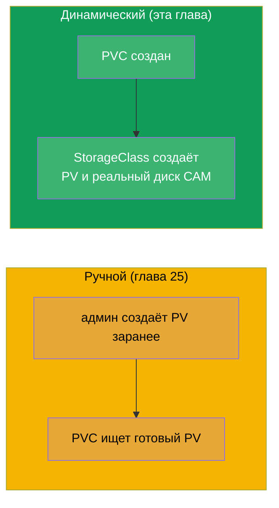
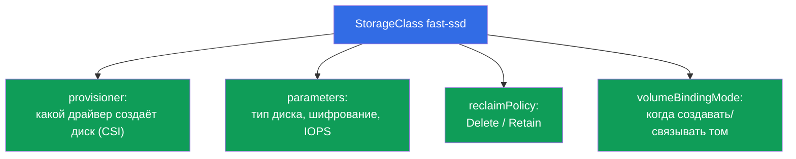
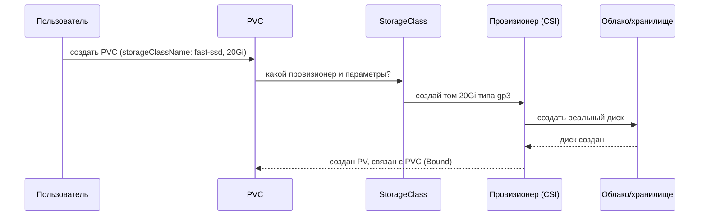
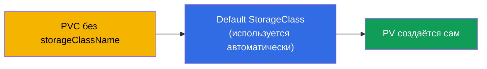
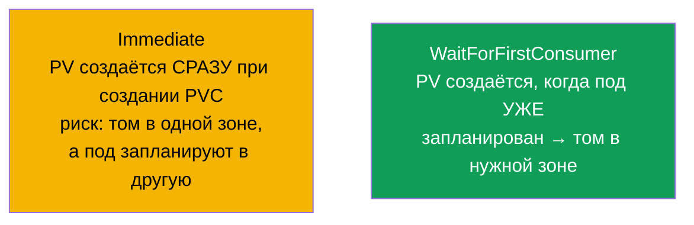
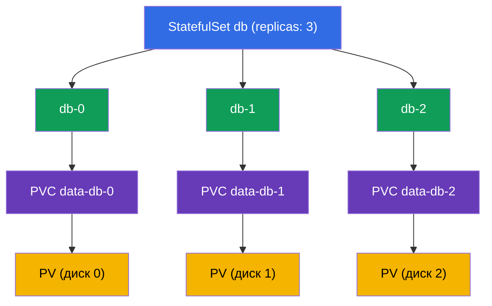
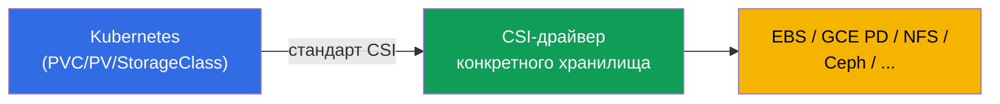

# Глава 26. StorageClass, динамический провижининг и хранение в StatefulSet

> **Что дальше.** В главе 25 PV создавал администратор вручную - это не масштабируется.
> **StorageClass** и **динамический провижининг** автоматизируют это: PVC создаётся - и
> нужный PV с реальным диском появляется сам. Плюс закроем хранение в StatefulSet
> (volumeClaimTemplates из главы 11 обретёт смысл). Завершает часть 5 и домен Storage
> (CKA 10%). Динамический провижининг - то, как хранилище работает в реальных облачных
> кластерах.

## 26.1. Проблема ручного PV и её решение

Создавать PV руками под каждый PVC - медленно и не масштабируется: администратор не
успеет за приложениями. Решение - **динамический провижининг**: PV создаётся
**автоматически** в момент появления PVC, на основе **StorageClass**.



## 26.2. StorageClass: шаблон для создания томов

**StorageClass** описывает «класс» хранилища: каким провизионером создавать тома, с какими
параметрами, с какой reclaim-политикой. По сути это шаблон, по которому под запрос PVC
рождается PV.

```yaml
apiVersion: storage.k8s.io/v1
kind: StorageClass
metadata:
  name: fast-ssd
provisioner: ebs.csi.aws.com          # драйвер, который создаёт тома
parameters:
  type: gp3                            # параметры под конкретный провизионер
  encrypted: "true"
reclaimPolicy: Delete                  # судьба PV после удаления PVC
allowVolumeExpansion: true             # разрешить расширение
volumeBindingMode: WaitForFirstConsumer
```



## 26.3. Как работает динамический провижининг

PVC просто указывает нужный `storageClassName` - и всё происходит само:

```yaml
apiVersion: v1
kind: PersistentVolumeClaim
metadata:
  name: data
spec:
  accessModes: ["ReadWriteOnce"]
  storageClassName: fast-ssd       # ← имя StorageClass
  resources:
    requests:
      storage: 20Gi
```



Разработчику не нужно знать про PV, диски и облако - он пишет только PVC. Инфраструктура
(StorageClass + CSI-драйвер) делает остальное.

## 26.4. Default StorageClass

Один StorageClass можно пометить как **дефолтный** аннотацией
`storageclass.kubernetes.io/is-default-class: "true"`. Тогда PVC **без** явного
`storageClassName` использует его.

```bash
kubectl get storageclass          # у дефолтного будет (default) рядом с именем
```



В управляемых кластерах (EKS/GKE/AKS) дефолтный StorageClass обычно уже есть, поэтому там
достаточно создать PVC - и том появится. Если дефолтного класса нет, а PVC не указывает
класс, он застрянет в Pending.

## 26.5. volumeBindingMode: когда создавать том

Тонкий, но важный параметр - **когда** создавать и связывать том:



- **Immediate** - том создаётся сразу, как появился PVC. Проблема в облаке: диск может
  оказаться в одной зоне доступности, а под запланируют в другую - и он не смонтируется
  (диски зональны).
- **WaitForFirstConsumer** - том создаётся только когда под, использующий PVC, уже
  назначен на ноду. Тогда том создаётся в правильной зоне. В облаке это предпочтительный
  режим.

## 26.6. Хранение в StatefulSet: volumeClaimTemplates

Вернёмся к StatefulSet (глава 11). Его особенность - **volumeClaimTemplates**: шаблон,
по которому каждому поду динамически создаётся **свой** PVC (а через StorageClass - и
свой PV/диск).

```yaml
spec:
  volumeClaimTemplates:
  - metadata:
      name: data
    spec:
      accessModes: ["ReadWriteOnce"]
      storageClassName: fast-ssd
      resources:
        requests:
          storage: 10Gi
```



Ключевое свойство: PVC `data-db-1` **привязан именно к поду db-1**. Пересоздался db-1 -
он снова получит `data-db-1` со своими данными. И ещё: при **удалении StatefulSet эти PVC
не удаляются автоматически** (защита данных) - их убирают вручную.

## 26.7. CSI: как драйверы хранилища подключаются к Kubernetes

Провизионеры (`provisioner` в StorageClass) реализуют стандарт **CSI (Container Storage
Interface)** - универсальный интерфейс между Kubernetes и системами хранения. Благодаря
CSI один и тот же механизм PV/PVC/StorageClass работает с любым хранилищем: облачными
дисками (EBS, GCE PD, Azure Disk), сетевыми ФС (NFS, CephFS), enterprise-СХД.



CSI подробнее (вместе с CNI/CRI) разберём в главе 40. Здесь достаточно понимать: за
`provisioner` стоит CSI-драйвер, который умеет создавать/удалять/монтировать тома
конкретного типа хранилища.

## 26.8. Как это применяют в продакшене

- **Динамический провижининг - стандарт.** В облачных кластерах хранилище работает так:
  разработчик создаёт PVC, StorageClass + CSI создают диск сам. Ручные PV - редкость (для
  особых случаев вроде готового NFS-шара).
- **Несколько StorageClass под разные нужды.** Типично: `fast-ssd` (gp3/SSD для БД),
  `standard` (дешевле, для менее требовательного), возможно `retain-ssd` с
  `reclaimPolicy: Retain` для критичных данных. Приложение выбирает класс по потребности и
  цене.
- **WaitForFirstConsumer в облаке.** В мультизональных кластерах почти всегда используют
  `WaitForFirstConsumer`, чтобы диск создавался в той же зоне, что и под, - иначе
  зональный диск не смонтируется.
- **reclaimPolicy Retain для важного.** Для продовых данных StorageClass часто настраивают
  на `Retain`, чтобы удаление PVC не уничтожило диск. Баланс: удобство `Delete` против
  безопасности `Retain`.
- **StatefulSet + PVC остаются после удаления.** Помнят, что PVC от StatefulSet не
  удаляются автоматически: это защищает данные БД, но требует осознанной очистки, чтобы
  не копить «осиротевшие» диски (и не платить за них).

## 26.9. Мини-глоссарий

- **StorageClass** - шаблон создания томов: провизионер, параметры, reclaim-политика.
- **Динамический провижининг** - автоматическое создание PV под запрос PVC.
- **provisioner** - CSI-драйвер, создающий реальные тома.
- **Default StorageClass** - класс по умолчанию для PVC без явного класса.
- **volumeBindingMode** - когда создавать/связывать том (Immediate /
  WaitForFirstConsumer).
- **volumeClaimTemplates** - шаблон StatefulSet, создающий PVC на каждый под.
- **CSI (Container Storage Interface)** - стандарт подключения хранилищ к Kubernetes.
- **allowVolumeExpansion** - разрешение на расширение томов класса.

## 26.10. Итоги главы

- Динамический провижининг избавляет от ручного создания PV: PVC появился - PV с реальным
  диском создаётся сам по StorageClass.
- StorageClass задаёт провизионер (CSI-драйвер), параметры хранилища, reclaimPolicy,
  allowVolumeExpansion и volumeBindingMode.
- PVC указывает `storageClassName`; без указания используется default StorageClass (если
  он есть), иначе PVC - Pending.
- `WaitForFirstConsumer` создаёт том после планирования пода - правильно для
  мультизональных облаков; `Immediate` может создать диск не в той зоне.
- StatefulSet через `volumeClaimTemplates` создаёт свой PVC на каждый под; PVC привязан к
  поду и не удаляется автоматически при удалении StatefulSet.
- За провизионером стоит CSI-драйвер - единый интерфейс к любому хранилищу.

## 26.11. Как это пригодится: на экзамене и в реальной работе

**На экзамене.** «Создай PVC с нужным StorageClass», «почему PVC в Pending» (нет
дефолтного класса/провизионера), «разверни StatefulSet с volumeClaimTemplates» - типовые
задания домена Storage. Нужно понимать связку StorageClass → провизионер → PV и роль
default-класса.

**В реальной работе.** Динамический провижининг - это как хранилище реально работает в
облаке: разработчик пишет PVC, диск появляется сам. Правильные StorageClass (тип диска,
reclaimPolicy, WaitForFirstConsumer) определяют производительность, стоимость и
сохранность данных. Управление PVC от StatefulSet - часть эксплуатации баз данных в
кластере.

## 26.12. Вопросы для самопроверки

1. Чем динамический провижининг лучше ручного создания PV?
2. Что описывает StorageClass и что такое provisioner?
3. Как PVC выбирает StorageClass и что происходит без указания класса?
4. В чём разница Immediate и WaitForFirstConsumer? Почему в облаке важен второй?
5. Как volumeClaimTemplates связывает под StatefulSet с его томом при пересоздании?
6. Почему PVC от StatefulSet не удаляются автоматически и чем это важно?
7. Что такое CSI и какую роль он играет в провижининге?

## Практика

На этом часть 5 (хранение) завершена. Дальше - часть 6: наблюдаемость и обслуживание,
начиная с проб (liveness, readiness, startup - глава 27). StorageClass, динамический
провижининг и StatefulSet-хранилище отрабатываются в лабах по хранению.

🧪 Лаба 01: [tasks/cka/labs/01](../../labs/01/README_RU.MD)

---
[Оглавление](../README_RU.md) · [Глава 25](../25/ru.md) · [Глава 27](../27/ru.md)
