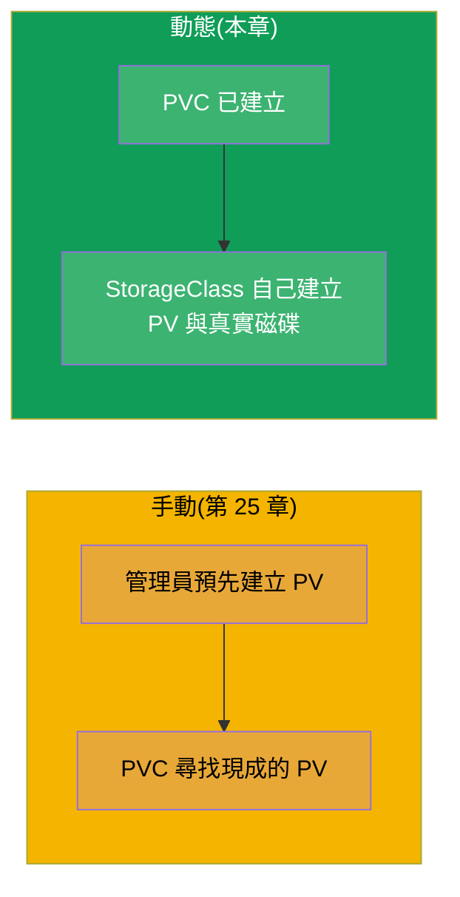
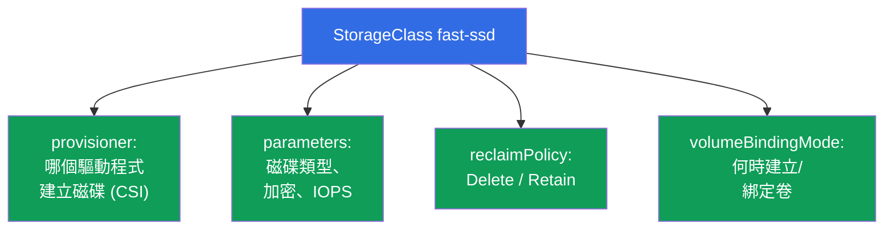
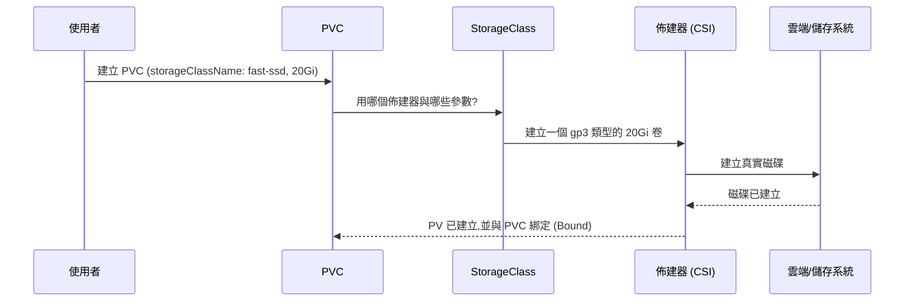
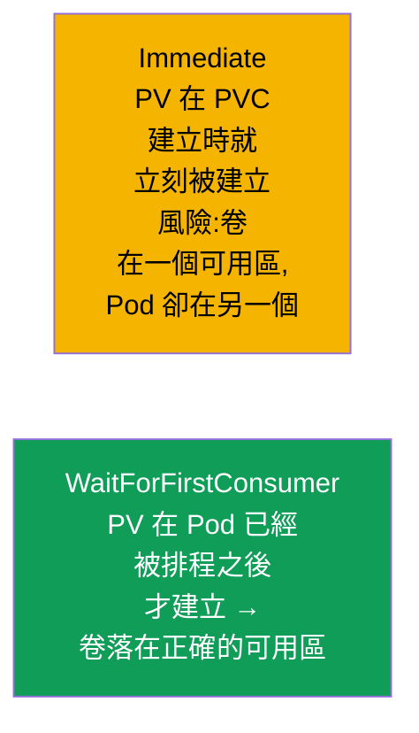
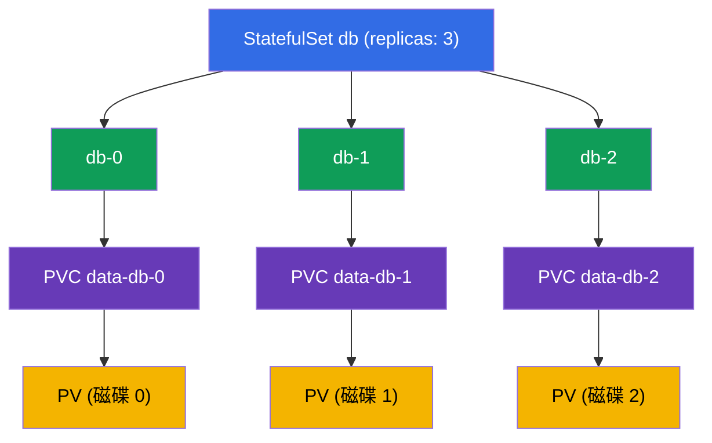
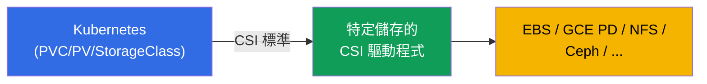

[Русская версия](ru.md) · [Eng version](README.md) · [Versión en español](es.md) · [Version française](fr.md) · [Deutsche Version](de.md) · [ქართული ვერსია](ge.md) · [日本語版](jp.md)

# 第 26 章。StorageClass、動態佈建與 StatefulSet 中的儲存

> **接下來要講什麼。** 在第 25 章裡 PV 是由管理員手動建立的 - 這種做法無法擴展。
> **StorageClass** 與 **動態佈建** 讓這件事自動化:建立 PVC - 對應的 PV 連同真實
> 磁碟就會自己出現。此外我們還要補完 StatefulSet 中的儲存(第 11 章的
> volumeClaimTemplates 到這裡才有意義)。本章結束第 5 部分與 Storage 領域
> (CKA 10%)。動態佈建就是儲存在真實雲端叢集裡的運作方式。

## 26.1. 手動 PV 的問題與它的解法

為每一個 PVC 手工建立 PV - 既慢又無法擴展:管理員追不上應用程式的節奏。解法就是
**動態佈建**:PV 在 PVC 出現的那一刻,依據 **StorageClass** **自動** 被建立出來。



## 26.2. StorageClass:建立卷的範本

**StorageClass** 描述儲存的「類別」:用哪個佈建器 (provisioner) 建立卷、帶什麼參數、
用什麼 reclaim 政策。本質上它就是一份範本,PVC 一提出請求就依它生出 PV。

```yaml
apiVersion: storage.k8s.io/v1
kind: StorageClass
metadata:
  name: fast-ssd
provisioner: ebs.csi.aws.com          # 建立卷的驅動程式
parameters:
  type: gp3                            # 針對特定佈建器的參數
  encrypted: "true"
reclaimPolicy: Delete                  # PVC 被刪除後 PV 的命運
allowVolumeExpansion: true             # 允許擴充
volumeBindingMode: WaitForFirstConsumer
```



## 26.3. 動態佈建是怎麼運作的

PVC 只要指明需要的 `storageClassName` - 其他一切都會自己完成:

```yaml
apiVersion: v1
kind: PersistentVolumeClaim
metadata:
  name: data
spec:
  accessModes: ["ReadWriteOnce"]
  storageClassName: fast-ssd       # ← StorageClass 的名稱
  resources:
    requests:
      storage: 20Gi
```



開發者不需要知道 PV、磁碟與雲端的事 - 他只寫 PVC。基礎設施
(StorageClass + CSI 驅動程式)負責其餘的部分。

## 26.4. Default StorageClass

可以用註解 `storageclass.kubernetes.io/is-default-class: "true"` 把某一個
StorageClass 標記為 **預設**。這樣 **沒有** 明確寫 `storageClassName` 的 PVC 就會
用它。

```bash
kubectl get storageclass          # 預設的那個名稱旁邊會有 (default)
```


在受管叢集 (EKS/GKE/AKS) 裡通常已經有預設的 StorageClass,所以在那裡只要建立 PVC
即可 - 卷就會出現。如果沒有預設類別,而 PVC 又沒有指定類別,它就會卡在 Pending。

## 26.5. volumeBindingMode:何時建立卷

一個細微但重要的參數 - **何時** 建立與綁定卷:



- **Immediate** - PVC 一出現,卷就立刻被建立。在雲端會有問題:磁碟可能落在某個可用
  區,而 Pod 卻被排程到另一個可用區 - 於是掛載不上(磁碟是分區域的)。
- **WaitForFirstConsumer** - 只有當使用該 PVC 的 Pod 已經被指派到節點之後,卷才會被
  建立。這樣卷就會建在正確的可用區。在雲端這是首選模式。

## 26.6. StatefulSet 中的儲存:volumeClaimTemplates

回到 StatefulSet(第 11 章)。它的特點就是 **volumeClaimTemplates**:一份範本,依它
為每個 Pod 動態建立 **屬於自己的** PVC(而透過 StorageClass - 也有屬於自己的
PV/磁碟)。

```yaml
spec:
  volumeClaimTemplates:
  - metadata:
      name: data
    spec:
      accessModes: ["ReadWriteOnce"]
      storageClassName: fast-ssd
      resources:
        requests:
          storage: 10Gi
```



關鍵特性:PVC `data-db-1` **正是綁在 Pod db-1 上**。db-1 被重建了 - 它還是會拿回帶著
自己資料的 `data-db-1`。還有一點:**刪除 StatefulSet 時這些 PVC 不會被自動刪除**
(資料保護)- 要手動清掉它們。

## 26.7. CSI:儲存驅動程式是怎麼接進 Kubernetes 的

佈建器(StorageClass 裡的 `provisioner`)實作 **CSI (Container Storage Interface)**
標準 - 一個介於 Kubernetes 與儲存系統之間的通用介面。多虧了 CSI,同一套
PV/PVC/StorageClass 機制可以搭配任何儲存運作:雲端磁碟 (EBS、GCE PD、Azure Disk)、
網路檔案系統 (NFS、CephFS)、企業級儲存陣列。



CSI 的細節(連同 CNI/CRI)會在第 40 章拆解。這裡只要理解:`provisioner` 背後站著一個
CSI 驅動程式,它會建立/刪除/掛載特定儲存類型的卷。

## 26.8. 實務案例:查看、刪除、擴充

我們從兩個角度拆解對儲存的典型操作:**節點上的本機 PV**(靜態,沒有佈建器)與
**雲端磁碟 EBS**(動態,有 CSI)。它們之間的差別在刪除與擴充上看得最清楚。

### 查看有哪些 PV 與 PVC

```bash
kubectl get pvc                 # 目前 namespace 裡的 PVC
kubectl get pvc -A              # 所有 namespace 裡的
kubectl get pv                  # PV 是叢集級的,沒有 namespace

# 關鍵欄位一眼就看到:
# PVC: STATUS (Bound/Pending), VOLUME (PV 的名稱), CAPACITY, STORAGECLASS
# PV:  STATUS (Bound/Available/Released), CLAIM (是哪個 PVC), RECLAIMPOLICY

kubectl describe pvc data       # 事件:為什麼 Pending、綁到哪個 PV
kubectl describe pv <pv-name>   # 卷的類型 (hostPath/local/csi)、nodeAffinity

# 卷實際靠什麼支撐:節點上的路徑,或雲端裡的磁碟 ID
kubectl get pv <pv-name> -o jsonpath='{.spec.local.path}{.spec.csi.volumeHandle}'
```

### 方案 A。節點上的本機 PV(靜態)

本機卷就是特定節點上的一個目錄/磁碟。沒有動態佈建器:PV 由管理員手動建立,並透過
`nodeAffinity` 硬綁到節點上。

```yaml
apiVersion: v1
kind: PersistentVolume
metadata:
  name: local-pv-node1
spec:
  capacity:
    storage: 10Gi
  accessModes: ["ReadWriteOnce"]
  persistentVolumeReclaimPolicy: Retain
  storageClassName: local-storage
  local:
    path: /mnt/disks/data
  nodeAffinity:
    required:
      nodeSelectorTerms:
      - matchExpressions:
        - key: kubernetes.io/hostname
          operator: In
          values: ["node1"]
```

- **查看**:`kubectl get pv local-pv-node1 -o wide`;`kubectl describe pv ...`
  會顯示 `Node Affinity` 與路徑 `/mnt/disks/data`。
- **刪除**:先刪 Pod,再刪 PVC (`kubectl delete pvc <name>`)。在 `Retain` 之下 PV
  會進入 `Released`,但它本身並不會被釋放出來重複使用,而資料仍留在 node1 上的
  `/mnt/disks/data`。要重複使用 - 就手動清理節點上的目錄,然後要嘛刪掉 PV
  (`kubectl delete pv local-pv-node1`),要嘛移除它的 `spec.claimRef`,把它退回
  `Available`。
- **擴充**:本機卷 **不支援** 透過 Kubernetes 擴充(佈建器是 `no-provisioner`,
  `allowVolumeExpansion` 不起作用)。所謂「加大」就是手動在節點上給更多空間
  (磁碟/分割區),必要時用新的 `capacity` 重建 PV。透過 `kubectl edit pvc` 尺寸
  不會長大。

### 方案 B。雲端磁碟 EBS(動態)

磁碟依照帶 AWS CSI 佈建器的 StorageClass 自己建立,而且可以線上擴充。

```yaml
apiVersion: storage.k8s.io/v1
kind: StorageClass
metadata:
  name: ebs-sc
provisioner: ebs.csi.aws.com
parameters:
  type: gp3
reclaimPolicy: Delete
allowVolumeExpansion: true        # ← 沒有這個就無法擴充 PVC
volumeBindingMode: WaitForFirstConsumer
---
apiVersion: v1
kind: PersistentVolumeClaim
metadata:
  name: data
spec:
  accessModes: ["ReadWriteOnce"]
  storageClassName: ebs-sc
  resources:
    requests:
      storage: 10Gi
```

- **查看**:`kubectl get pvc data`(Bound,已綁定 PV),`kubectl get pv` 會顯示
  自動建立出來的 PV;`kubectl get pv <pv> -o jsonpath='{.spec.csi.volumeHandle}'`
  會給出 EBS 卷的 ID (`vol-0abc...`),它在 AWS 主控台裡也看得到。
- **刪除**:`kubectl delete pvc data`。在 `reclaimPolicy: Delete` 之下 PV 與 EBS
  磁碟本身會被自動刪除 - 你就不用再為它們付費。在 `Retain` 之下 PV 會留在
  `Released`,EBS 磁碟也會保留(並繼續花錢)- 要手動清掉它。
- **擴充(線上)**:提高 PVC 裡的請求 - CSI 會擴充真實磁碟,不需要重建 Pod:

```bash
kubectl patch pvc data -p '{"spec":{"resources":{"requests":{"storage":"20Gi"}}}}'
# 或者:kubectl edit pvc data  →  storage: 20Gi

kubectl get pvc data -w   # CAPACITY 會長大,FileSystemResizePending 條件會消失
```

EBS 擴充的細節:

- 尺寸只能 **增加**,不能縮小;
- StorageClass 裡需要 `allowVolumeExpansion: true`(要預先設定,在建立 PVC 之前);
- 檔案系統的擴充通常是自動的;在部分版本/檔案系統上可能需要重啟 Pod;
- 在 AWS 裡同一個 EBS 卷在滑動的 24 小時內最多只能修改 4 次,而且每一次後續的修改
  都必須等前一次到達 `completed` 狀態之後才能進行(修改本身要花幾分鐘到幾小時)。

對比的結論:本機 PV 便宜又快,但綁在節點上、要手動清理、也不能擴充;EBS 是自助式
且能線上擴充的,但它分區域、而且只要還存在就要付費。

## 26.9. 這在生產環境裡怎麼用

- **動態佈建就是標準。** 在雲端叢集裡儲存就是這樣運作:開發者建立 PVC,
  StorageClass + CSI 自己把磁碟建出來。手動 PV 很少見(留給像現成 NFS 共享這類
  特殊情況)。
- **用多個 StorageClass 應對不同需求。** 典型做法:`fast-ssd`(給資料庫用的
  gp3/SSD)、`standard`(比較便宜,給要求不高的負載),可能還有帶
  `reclaimPolicy: Retain` 的 `retain-ssd` 給關鍵資料。應用程式按需求與價格挑類別。
- **雲端用 WaitForFirstConsumer。** 在多可用區叢集裡幾乎總是用
  `WaitForFirstConsumer`,讓磁碟建在跟 Pod 相同的可用區 - 否則分區域的磁碟掛不上。
- **重要資料用 reclaimPolicy Retain。** 對生產資料,StorageClass 常常設成
  `Retain`,好讓刪除 PVC 不會摧毀磁碟。這是一種平衡:`Delete` 的方便對上 `Retain`
  的安全。
- **StatefulSet + PVC 在刪除後會留下。** 記住 StatefulSet 的 PVC 不會被自動刪除:
  這保護了資料庫資料,但需要有意識地清理,才不會累積「孤兒」磁碟(也不會為它們
  付錢)。

## 26.10. 小詞彙表

- **StorageClass** - 建立卷的範本:佈建器、參數、reclaim 政策。
- **動態佈建** - 依 PVC 的請求自動建立 PV。
- **provisioner** - 建立真實卷的 CSI 驅動程式。
- **Default StorageClass** - 給沒有明確指定類別的 PVC 用的預設類別。
- **volumeBindingMode** - 何時建立/綁定卷 (Immediate /
  WaitForFirstConsumer)。
- **volumeClaimTemplates** - StatefulSet 的範本,為每個 Pod 建立 PVC。
- **CSI (Container Storage Interface)** - 把儲存接上 Kubernetes 的標準。
- **allowVolumeExpansion** - 允許擴充該類別的卷。

## 26.11. 本章總結

- 動態佈建讓你不必手動建立 PV:PVC 一出現,帶著真實磁碟的 PV 就依 StorageClass
  自己被建立。
- StorageClass 指定佈建器 (CSI 驅動程式)、儲存參數、reclaimPolicy、
  allowVolumeExpansion 與 volumeBindingMode。
- PVC 指明 `storageClassName`;沒指明時會用 default StorageClass(如果存在),
  否則 PVC 就是 Pending。
- `WaitForFirstConsumer` 在 Pod 被排程之後才建立卷 - 這對多可用區的雲端才正確;
  `Immediate` 可能把磁碟建在錯的可用區。
- StatefulSet 透過 `volumeClaimTemplates` 為每個 Pod 建立自己的 PVC;PVC 綁在
  Pod 上,而且刪除 StatefulSet 時不會被自動刪除。
- 佈建器背後站著 CSI 驅動程式 - 一個通往任何儲存的統一介面。
- PV/PVC 用 `kubectl get/describe pv,pvc` 查看;刪除與擴充在本機卷和雲端磁碟上的
  運作方式不同。
- 節點上的本機 PV:綁在節點上,在 `Retain` 之下要手動清理,不支援擴充。EBS:在
  `Delete` 之下會自動刪除,在 `allowVolumeExpansion: true` 之下可以線上擴充
  (只能往上)。

## 26.12. 這會在哪裡派上用場:考試上與真實工作中

**考試上。** 「建立一個帶指定 StorageClass 的 PVC」、「為什麼 PVC 在 Pending」
(沒有預設類別/佈建器)、「部署一個帶 volumeClaimTemplates 的 StatefulSet」- 都是
Storage 領域的典型題目。需要理解 StorageClass → 佈建器 → PV 這條鏈,以及
default 類別的角色。

**真實工作中。** 動態佈建就是儲存在雲端裡真正的運作方式:開發者寫 PVC,磁碟自己
出現。正確的 StorageClass(磁碟類型、reclaimPolicy、WaitForFirstConsumer)決定了
效能、成本與資料的存續。管理 StatefulSet 的 PVC 是在叢集裡營運資料庫的一部分。

## 26.13. 自我檢查問題

1. 動態佈建比手動建立 PV 好在哪裡?
2. StorageClass 描述什麼,provisioner 又是什麼?
3. PVC 是怎麼挑選 StorageClass 的,沒有指定類別時會發生什麼?
4. Immediate 與 WaitForFirstConsumer 的差別在哪?為什麼在雲端第二個很重要?
5. volumeClaimTemplates 在 Pod 重建時是怎麼把 StatefulSet 的 Pod 跟它的卷連起來的?
6. 為什麼 StatefulSet 的 PVC 不會被自動刪除,這一點為什麼重要?
7. 什麼是 CSI,它在佈建裡扮演什麼角色?
8. 怎麼查看 PV 與 PVC 的清單,以及卷實際靠什麼支撐(節點上的路徑或磁碟 ID)?
9. 節點上的本機 PV 與雲端磁碟 EBS 在刪除與擴充上有什麼不同?

## 實踐

到這裡第 5 部分(儲存)就結束了。接下來是第 6 部分:可觀測性與維運,從探針
(liveness、readiness、startup - 第 27 章)開始。StorageClass、動態佈建與
StatefulSet 儲存會在儲存相關的實驗中操練。

🧪 實驗 108(StorageClass 與 StatefulSet 中的儲存):[tasks/cka/labs/108](../../labs/108/README_TW.MD)

---
[目錄](../README_TW.md) · [第 25 章](../25/tw.md) · [第 27 章](../27/tw.md)
