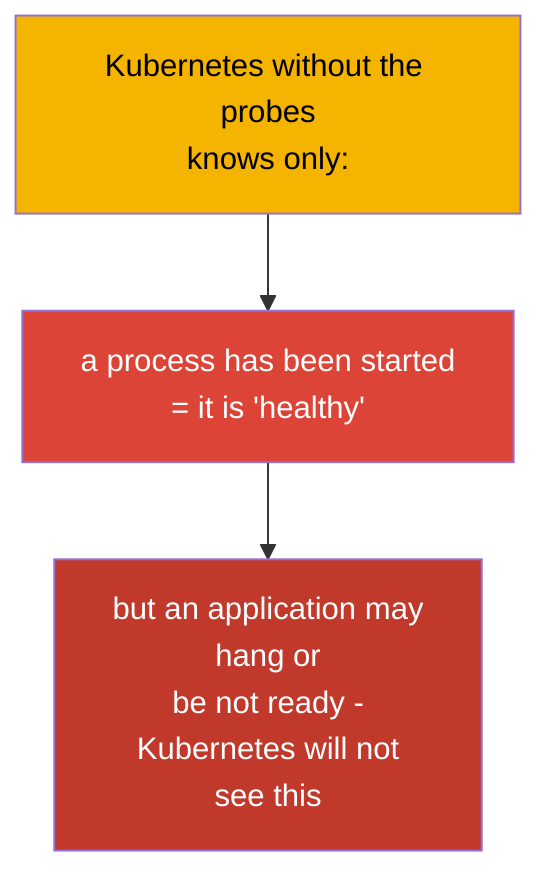
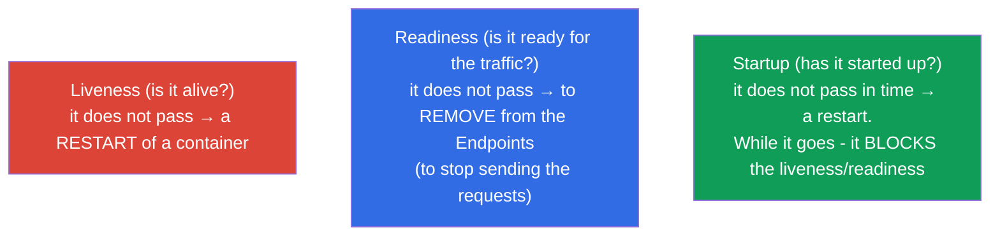
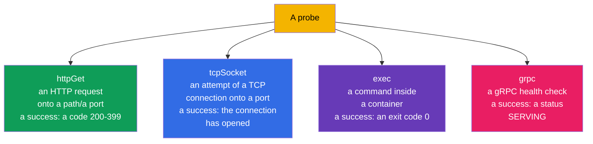
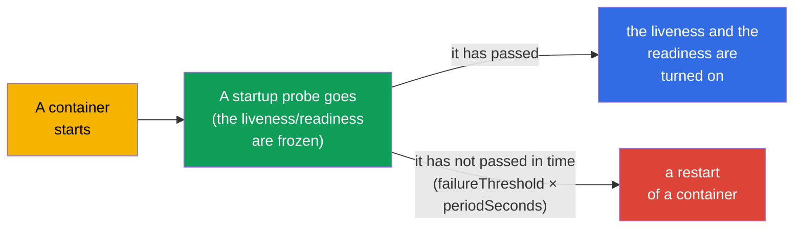
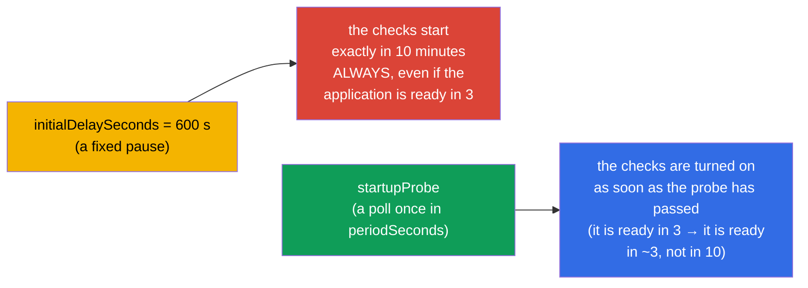
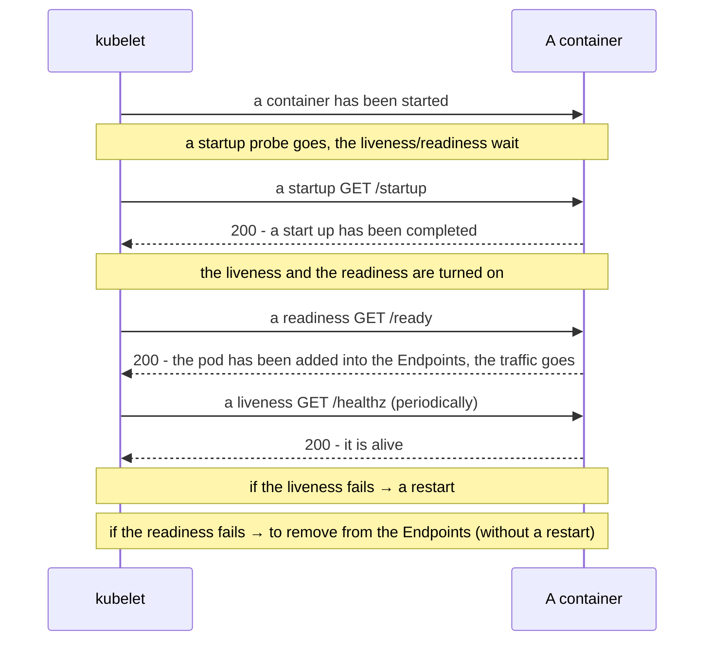
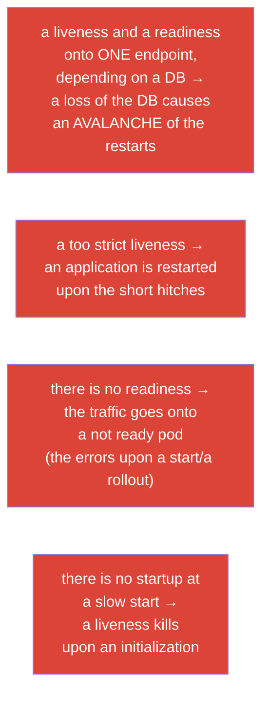

[Русская версия](ru.md) · [Versión en español](es.md) · [Version française](fr.md) · [Deutsche Version](de.md) · [ქართული ვერსია](ge.md) · [繁體中文版](tw.md) · [日本語版](jp.md)

# Chapter 27. The checks of a state: the liveness, the readiness and the startup probes

> **What comes next.** We begin the part 6 - an observability and a maintenance. Kubernetes itself does not know,
> whether your application is "healthy" inside: a container works, but an application may hang
> or may not have warmed up yet. **The probes** are a way to inform the cluster about the real
> state of an application. There are three of them: a **liveness** (is it alive), a **readiness** (is it ready to accept
> the traffic), a **startup** (has it started up). This is the domain Observability (CKAD) and Workloads (CKA),
> and it is directly linked with the safe rollouts (the chapter 8) and the Endpoints of the services (the chapter 7).

## 27.1. What for the probes are needed

Without the probes Kubernetes judges about a health roughly: a process is alive - so everything is good. But this is often
incorrect:

- an application has **hung** (a deadlock), the process is alive, but it does not process the requests;
- an application is **still starting** (a warming up of a cache, a connection to a DB), but the traffic has already gone onto it;
- an application is **temporarily not ready** (it has lost a link with a dependency), but there is no need to restart
  it.



The probes give to an application a way to tell honestly to the cluster about its state, and to the cluster -
to react correctly: to restart, to remove from a balancing or to wait.

## 27.2. The three probes and their purpose



| A probe | A question | What happens upon a failure |
|-------|--------|-----------------|
| **liveness** | is an application alive (has it not hung)? | a container **is restarted** |
| **readiness** | is it ready to accept the traffic? | a pod **is removed from the Endpoints** (it does not restart!) |
| **startup** | has it completed a start up? | upon a non-fulfilment in time - a restart; it blocks the rest of the probes until a success |

The key difference, which has to be assimilated: **a liveness heals with a restart, a readiness -
with an isolation from the traffic**. A failure of a readiness does NOT restart a pod, it merely stops sending onto
it the requests (recall the Endpoints from the chapter 7).

## 27.3. The ways of a check

Each probe can check a health by one of several ways:



| A way | How it checks | A success |
|--------|---------------|-------|
| `httpGet` | an HTTP GET onto a path and a port | a response code 200-399 |
| `tcpSocket` | to open a TCP connection onto a port | the connection has been established |
| `exec` | to execute a command in a container | an exit code 0 |
| `grpc` | a gRPC health check | a status SERVING |

An `httpGet` is the most frequent one for the web applications; an `exec` is convenient for a check of the files/of the processes;
a `tcpSocket` - for the services without an HTTP (the DB, the brokers); a `grpc` - for the gRPC services with an
implemented health protocol.

> **The gRPC probes.** The way `grpc` is stable (GA) since Kubernetes 1.27 (a beta since 1.24, enabled by
> default). It calls a standard gRPC health check of an application; a probe is successful, if
> the service answers with a status `SERVING`. An example:
>
> ```yaml
>     livenessProbe:
>       grpc:
>         port: 9000
>         service: my.health.Service   # it is optional; a name of a health-check service
>       periodSeconds: 10
> ```
>
> Before an appearance of a `grpc` for the gRPC applications a separate binary
> `grpc_health_probe` through an `exec` was used - now this is done natively.

## 27.4. The parameters of the probes

All the probes are configured with the same parameters of a timing:

```yaml
    livenessProbe:
      httpGet:
        path: /healthz
        port: 8080
      initialDelaySeconds: 10     # to wait before the first check
      periodSeconds: 10           # how often to check
      timeoutSeconds: 1           # a timeout of one check
      failureThreshold: 3         # how many failures in a row = a failure of a probe
      successThreshold: 1         # how many successes = it is OK again (for a readiness)
```

| A parameter | What it sets |
|----------|-----------|
| `initialDelaySeconds` | a pause before the first check (it gives a time to start) |
| `periodSeconds` | an interval between the checks |
| `timeoutSeconds` | how long to wait for an answer onto one check |
| `failureThreshold` | how many failures in a row to consider a failure |
| `successThreshold` | how many successes in a row to consider a recovery |

For example, a `periodSeconds: 10` + a `failureThreshold: 3` = a problem is fixed approximately
in 30 seconds of the refusals.

## 27.5. A startup probe: for the slowly starting applications

A problem: at a slowly starting application (a warming up takes a minute) a liveness probe
can "kill" it before it rises. Earlier this was solved with a big
`initialDelaySeconds`, but this is rough. A **startup probe** solves it elegantly: until it passes,
a liveness and a readiness **do not start at all**.



This way a slow application is given a big window for a start up (`failureThreshold × periodSeconds`),
but after the start a liveness works with the fast, "strict" intervals. The best of the two worlds.

> **A time of a start floats - count by the worst case.** The real applications start not
> in a fixed time: under a load, upon a cold cache, a slow DB or a big
> volume of the data a warming up of one and the same application may take, let us say, from 3 up to 10
> minutes. A window of a startup probe needs to be calculated by the **upper boundary**, otherwise a pod, which
> this time was unlucky to start for 10 minutes, will be killed on the 4th minute and will go into a cycle of the
> restarts.
>
> A window = `failureThreshold × periodSeconds`. With a reserve for 10 minutes:
>
> ```yaml
>     startupProbe:
>       httpGet:
>         path: /startup
>         port: 8080
>       periodSeconds: 10        # a check once in 10 s
>       failureThreshold: 60     # 60 × 10 s = 600 s = 10 minutes for a start up
> ```
>
> It is important, that this window "costs money" only at the slow instances: as soon as a startup
> has passed, the checks go by the schedule of the liveness/readiness. Therefore here it is not a pity to set a
> generous `failureThreshold` - it does not slow down the quickly starting pods, but merely does not allow to kill
> those, which this time rise longer than usual.

Here also the difference with the "old" approach through an `initialDelaySeconds` is seen. It sets a
**fixed** pause before the checks, therefore it has to be set by the worst
case (the same 10 minutes). But this value works off **always**: a pod, which has started in 3
minutes, will still stand for 10 before they begin to check it and add it into the Endpoints, -
it will get the traffic 7 minutes later, than it could.

A startup probe behaves otherwise: it **actively polls** an application (once in
`periodSeconds`) and switches a pod into a working mode **at once**, as soon as a check has passed.
A fast instance becomes ready in 3 minutes, a slow one - in all its 10, and
nobody waits "in reserve".



A practical outcome: an `initialDelaySeconds` punishes the fast pods with a delay of a readiness (and
slows down the rollouts and an autoscaling), while a startup probe gives a big window only to those, who
really need it.

## 27.6. How the probes interact

We assemble a full picture of a life of a pod with the three probes:



It is important: **the kubelet is responsible for the probes** (the chapter 2), and not the API server. The kubelet on a node itself
executes the checks of its pods and takes the decisions (a restart/an isolation).

## 27.7. The typical mistakes upon a configuration of the probes

The probes are easy to configure to a harm. The classical mistakes:



| A mistake | A consequence | How to do it correctly |
|--------|-------------|---------------|
| a liveness is tied onto an external DB | a loss of the DB → an avalanche of the restarts | a liveness checks only the process itself, not the dependencies |
| there is no readiness | the traffic onto a not ready pod, the errors upon a rollout | to add a readiness with a check of the dependencies |
| the identical liveness and readiness | it is impossible to distinguish "it is dead" from "it is temporarily not ready" | the different endpoints and a logic |
| there is no startup at a slow application | a liveness kills upon a start | to add a startup probe |

The main rule: **a liveness has to check only "is the process alive"** (a fast
internal check), and a **readiness - "is it ready to serve"** (it may include a check of the
dependencies). To mix them up is a frequent reason of the cascade restarts.

## 27.8. How this is applied in the production

- **The probes are obligatory for the safe rollouts.** A rolling update (the chapter 8) is really
  safe only with a correct readiness: without it Kubernetes considers a pod ready at once and
  leads the traffic onto a not warmed up application, giving the errors upon each release.
- **A separation of the liveness and of the readiness.** In the prod these are the different endpoints: a `/healthz` (a liveness,
  without the external dependencies) and a `/ready` (a readiness, with a check of a DB/of the caches). This
  prevents an avalanche of the restarts upon a fall of a dependency - a pod will simply go out of the
  balancing, and will not begin to restart cyclically.
- **A startup for the heavy applications.** The JVM services, the applications with a warming up of a cache get a
  startup probe with a wide window - otherwise a liveness kills them at a start. This removes the
  necessity in a huge `initialDelaySeconds`.
- **The probes + a graceful shutdown.** In a bundle with a `terminationGracePeriodSeconds` and a processing of a
  SIGTERM the probes provide a rollout without the losses: a pod first goes out of the Endpoints
  (a readiness), finishes off the current requests and only then terminates.
- **An accurate timing.** The too aggressive probes (the small period/timeout) create
  the false positives and the excessive restarts under a load; they are calibrated by the real behaviour of an
  application.

## 27.9. A mini glossary

- **A probe** - a check of a health of a container, executed by the kubelet.
- **A liveness** - is a container alive; a failure → a restart.
- **A readiness** - is it ready for the traffic; a failure → a removal from the Endpoints (without a restart).
- **A startup** - has a start up been completed; it blocks the rest of the probes, until it passes.
- **An httpGet / a tcpSocket / an exec / a grpc** - the ways of a check.
- **An initialDelaySeconds** - a delay before the first check.
- **A periodSeconds** - an interval of the checks.
- **A failureThreshold / a successThreshold** - a number of the failures/of the successes for a change of a state.

## 27.10. The summary of the chapter

- The probes inform the cluster about the real state of an application, which otherwise is not seen
  ("a process is alive" ≠ "an application is healthy").
- A liveness → a restart upon a failure; a readiness → a removal from the Endpoints (without a restart);
  a startup → it blocks the liveness/readiness, while an application starts.
- The ways of a check: an httpGet (a web), a tcpSocket (the services without an HTTP), an exec (a command), a grpc.
- The timing is set by the initialDelaySeconds, the periodSeconds, the timeoutSeconds,
  the failureThreshold/successThreshold.
- A startup probe is a correct solution for a slow start instead of a big
  initialDelaySeconds.
- The kubelet is responsible for the probes, not the API server.
- The main mistakes: a liveness onto the external dependencies (an avalanche of the restarts), an absence of a
  readiness (the traffic onto a not ready pod), the identical liveness/readiness.

## 27.11. How this will come in handy: on the exam and in the real work

**On the exam.** "Add a liveness/readiness/startup probe with an httpGet/exec and a timing" are
the very frequent tasks (Observability CKAD, Workloads CKA). It is needed to write confidently the blocks of the probes
and to understand, that a liveness restarts, and a readiness removes from the traffic. The link a readiness ↔
the Endpoints ↔ a safe rollout is a cross-cutting theme.

**In the real work.** The probes are a basis of a self-healing and of the rollouts without a downtime.
A correct separation of the liveness/readiness prevents the cascade restarts upon the failures of the
dependencies, and a startup saves the slowly starting services. The incorrectly configured probes are
a frequent reason of an instability and of the false restarts in the prod.

## 27.12. Self-check questions

1. Why does "a process has been started" not mean "an application is healthy"?
2. In what does a reaction onto a failure of a liveness differ from a reaction onto a failure of a readiness?
3. How are a readiness probe and the Endpoints of a service linked?
4. What for is a startup probe needed and in what is it better than a big initialDelaySeconds?
5. Which ways of a check exist and when is which one appropriate?
6. Why is it impossible to tie a liveness onto an availability of an external DB?
7. Who executes the probes - the API server or the kubelet?

## Practice

We have taught the cluster to understand a health of an application. In the chapter 28 - how we ourselves observe the
cluster: the logs, the metrics-server and a `kubectl top`. The probes are drilled in the labs on an
observability (including on the image `ping_pong`, which is able to emulate a failure of the probes).

🧪 Lab 109 (the liveness, readiness, startup probes): [tasks/cka/labs/109](../../labs/109/README.MD)

---
[Contents](../README.md) · [Chapter 26](../26/README.md) · [Chapter 28](../28/README.md)
