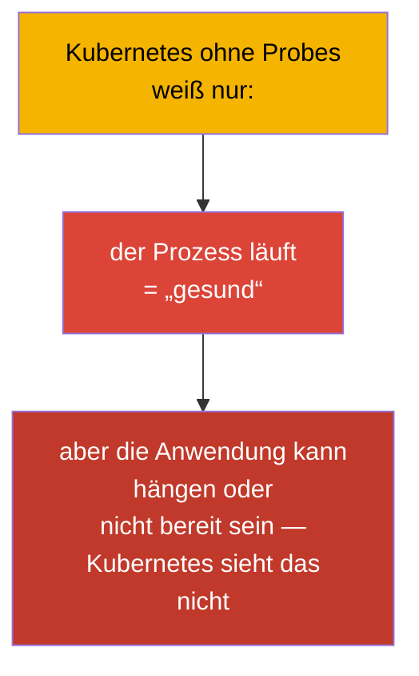
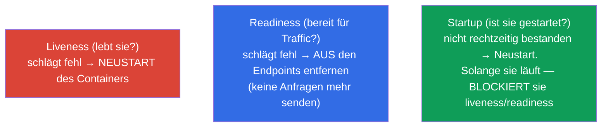
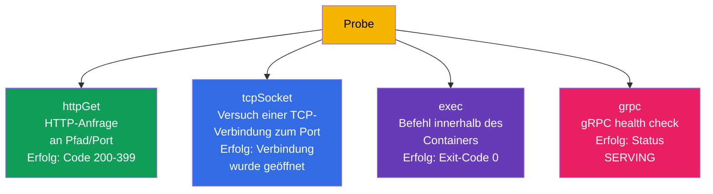
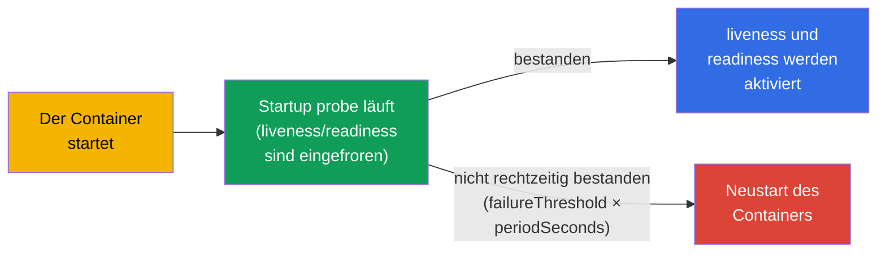
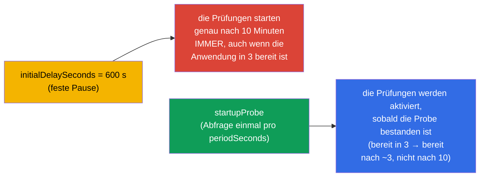
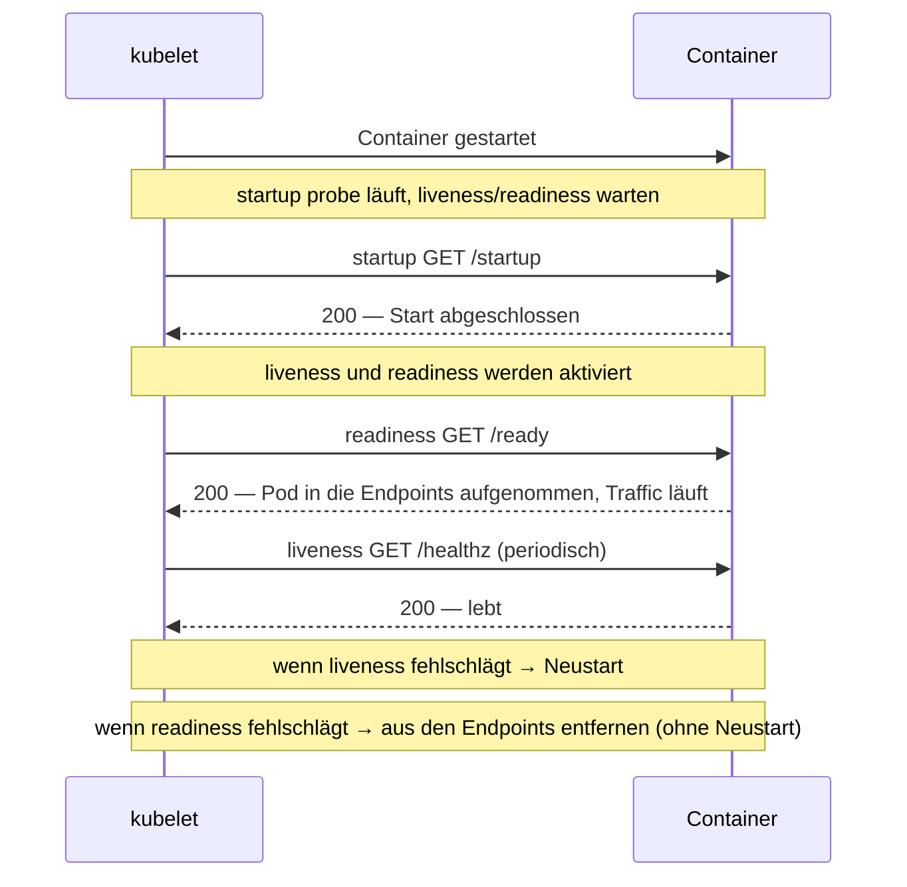
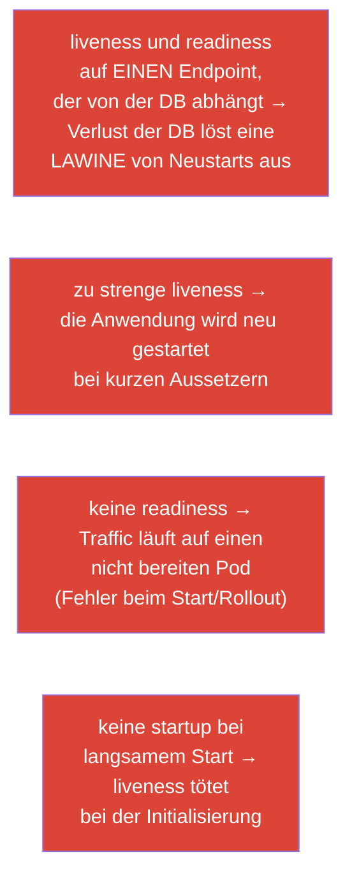

[Русская версия](ru.md) · [Eng version](README.md) · [Versión en español](es.md) · [Version française](fr.md) · [ქართული ვერსია](ge.md) · [繁體中文版](tw.md) · [日本語版](jp.md)

# Kapitel 27. Zustandsprüfungen: liveness, readiness und startup probes

> **Was kommt.** Wir beginnen Teil 6 - Observability und Betrieb. Kubernetes weiß von sich
> aus nicht, ob es Ihrer Anwendung innen „gut“ geht: der Container läuft, die Anwendung kann
> aber hängen oder noch nicht warmgelaufen sein. **Probes** sind die Art, dem Cluster den
> tatsächlichen Zustand der Anwendung mitzuteilen. Es gibt drei davon: **liveness** (lebt
> sie), **readiness** (ist sie bereit, Traffic anzunehmen), **startup** (ist sie gestartet).
> Das ist die Domäne Observability (CKAD) und Workloads (CKA) und hängt direkt mit sicheren
> Rollouts (Kapitel 8) und den Endpoints von Services (Kapitel 7) zusammen.

## 27.1. Wozu Probes gebraucht werden

Ohne Probes urteilt Kubernetes grob über die Gesundheit: der Prozess lebt - also ist alles
gut. Das ist aber oft falsch:

- die Anwendung **hängt** (Deadlock), der Prozess lebt, verarbeitet aber keine Anfragen;
- die Anwendung **startet noch** (Cache-Aufwärmen, Verbindung zur DB), aber der Traffic
  läuft schon auf sie;
- die Anwendung ist **zeitweise nicht bereit** (hat die Verbindung zu einer Abhängigkeit
  verloren), muss aber nicht neu gestartet werden.



Probes geben der Anwendung die Möglichkeit, dem Cluster ihren Zustand ehrlich mitzuteilen,
und dem Cluster - richtig zu reagieren: neu starten, aus dem Load Balancing nehmen oder
warten.

## 27.2. Drei Probes und ihr Zweck



| Probe | Frage | Was bei einem Fehlschlag passiert |
|-------|--------|-----------------|
| **liveness** | lebt die Anwendung (hängt sie nicht)? | der Container wird **neu gestartet** |
| **readiness** | ist sie bereit, Traffic anzunehmen? | der Pod wird **aus den Endpoints entfernt** (kein Neustart!) |
| **startup** | ist der Start abgeschlossen? | wird sie nicht rechtzeitig bestanden - Neustart; blockiert die übrigen Probes bis zum Erfolg |

Der entscheidende Unterschied, den man verinnerlichen muss: **liveness heilt durch Neustart,
readiness durch Isolation vom Traffic**. Ein Fehlschlag der readiness startet den Pod NICHT
neu, er hört nur auf, Anfragen an ihn zu senden (denken Sie an die Endpoints aus Kapitel 7).

## 27.3. Prüfmethoden

Jede Probe kann die Gesundheit auf eine von mehreren Weisen prüfen:



| Methode | Wie geprüft wird | Erfolg |
|--------|---------------|-------|
| `httpGet` | HTTP GET auf Pfad und Port | Antwortcode 200-399 |
| `tcpSocket` | eine TCP-Verbindung zum Port öffnen | Verbindung aufgebaut |
| `exec` | einen Befehl im Container ausführen | Exit-Code 0 |
| `grpc` | gRPC health check | Status SERVING |

`httpGet` ist die häufigste Methode für Webanwendungen; `exec` ist praktisch, um Dateien und
Prozesse zu prüfen; `tcpSocket` für Dienste ohne HTTP (Datenbanken, Broker); `grpc` für
gRPC-Dienste mit implementiertem Health-Protokoll.

> **gRPC-Probes.** Die Methode `grpc` ist seit Kubernetes 1.27 stabil (GA) (Beta ab 1.24,
> standardmäßig aktiviert). Sie ruft den standardmäßigen gRPC health check der Anwendung auf;
> die Probe ist erfolgreich, wenn der Dienst mit dem Status `SERVING` antwortet. Beispiel:
>
> ```yaml
>     livenessProbe:
>       grpc:
>         port: 9000
>         service: my.health.Service   # optional; Name des health-check-Dienstes
>       periodSeconds: 10
> ```
>
> Vor dem Erscheinen von `grpc` nutzte man für gRPC-Anwendungen ein separates Binary
> `grpc_health_probe` über `exec` - jetzt geht das nativ.

## 27.4. Parameter der Probes

Alle Probes werden mit denselben Timing-Parametern konfiguriert:

```yaml
    livenessProbe:
      httpGet:
        path: /healthz
        port: 8080
      initialDelaySeconds: 10     # vor der ersten Prüfung warten
      periodSeconds: 10           # wie oft geprüft wird
      timeoutSeconds: 1           # Timeout einer einzelnen Prüfung
      failureThreshold: 3         # wie viele Fehlschläge in Folge = Fehlschlag der Probe
      successThreshold: 1         # wie viele Erfolge = wieder OK (für readiness)
```

| Parameter | Was er festlegt |
|----------|-----------|
| `initialDelaySeconds` | Pause vor der ersten Prüfung (gibt Zeit zum Starten) |
| `periodSeconds` | Intervall zwischen den Prüfungen |
| `timeoutSeconds` | wie lange auf die Antwort einer Prüfung gewartet wird |
| `failureThreshold` | wie viele Fehlschläge in Folge als Fehlschlag gelten |
| `successThreshold` | wie viele Erfolge in Folge als Wiederherstellung gelten |

Zum Beispiel: `periodSeconds: 10` + `failureThreshold: 3` = das Problem wird nach etwa
30 Sekunden Ausfall festgestellt.

## 27.5. Startup probe: für langsam startende Anwendungen

Das Problem: bei einer langsam startenden Anwendung (das Aufwärmen dauert eine Minute) kann
die liveness-Probe sie „töten“, bevor sie hochgekommen ist. Früher löste man das mit einem
großen `initialDelaySeconds`, aber das ist grob. Die **Startup probe** löst es elegant:
solange sie nicht bestanden ist, laufen liveness und readiness **überhaupt nicht**.



So bekommt eine langsame Anwendung ein großes Fenster für den Start
(`failureThreshold × periodSeconds`), aber nach dem Start arbeitet liveness mit schnellen,
„strengen“ Intervallen. Das Beste aus beiden Welten.

> **Die Startzeit schwankt - rechnen Sie mit dem schlechtesten Fall.** Echte Anwendungen
> starten nicht in einer festen Zeit: unter Last, bei kaltem Cache, langsamer DB oder großem
> Datenvolumen kann das Aufwärmen derselben Anwendung sagen wir von 3 bis 10 Minuten dauern.
> Das Fenster der startup-Probe muss man nach der **oberen Grenze** berechnen, sonst wird ein
> Pod, der dieses Mal Pech hatte und 10 Minuten braucht, in der 4. Minute getötet und läuft
> in eine Neustart-Schleife.
>
> Fenster = `failureThreshold × periodSeconds`. Mit Reserve für 10 Minuten:
>
> ```yaml
>     startupProbe:
>       httpGet:
>         path: /startup
>         port: 8080
>       periodSeconds: 10        # Prüfung einmal alle 10 s
>       failureThreshold: 60     # 60 × 10 s = 600 s = 10 Minuten für den Start
> ```
>
> Wichtig ist, dass dieses Fenster nur bei den langsamen Exemplaren „Geld kostet“: sobald
> startup bestanden ist, laufen die Prüfungen nach dem Zeitplan von liveness/readiness.
> Deshalb ist es hier nicht schade, ein großzügiges `failureThreshold` zu setzen - es
> verlangsamt schnell startende Pods nicht, sondern verhindert nur, dass die getötet werden,
> die dieses Mal länger als üblich hochkommen.

Hier zeigt sich auch der Unterschied zum „alten“ Ansatz über `initialDelaySeconds`. Er legt
eine **feste** Pause vor den Prüfungen fest, deshalb muss man sie nach dem schlechtesten Fall
setzen (dieselben 10 Minuten). Aber dieser Wert greift **immer**: ein Pod, der in 3 Minuten
gestartet ist, steht trotzdem 10 Minuten, bevor man ihn zu prüfen beginnt und in die
Endpoints aufnimmt, - er bekommt den Traffic 7 Minuten später, als er könnte.

Die Startup-Probe verhält sich anders: sie **fragt die Anwendung aktiv ab** (einmal pro
`periodSeconds`) und schaltet den Pod **sofort** in den Arbeitsmodus, sobald die Prüfung
bestanden ist. Ein schnelles Exemplar wird nach 3 Minuten bereit, ein langsames - nach seinen
vollen 10, und niemand wartet „auf Reserve“.



Praktisches Fazit: `initialDelaySeconds` bestraft schnelle Pods mit verzögerter Bereitschaft
(und verlangsamt Rollouts und Autoscaling), die Startup-Probe gibt ein großes Fenster nur
denen, die es wirklich brauchen.

## 27.6. Wie die Probes zusammenwirken

Wir setzen das vollständige Bild des Pod-Lebens mit drei Probes zusammen:



Wichtig: **für die Probes ist das kubelet zuständig** (Kapitel 2), nicht der API-Server. Das
kubelet auf der Node führt die Prüfungen seiner Pods selbst aus und trifft die Entscheidungen
(Neustart/Isolation).

## 27.7. Typische Fehler beim Konfigurieren von Probes

Probes lassen sich leicht zum eigenen Schaden konfigurieren. Klassische Fehler:



| Fehler | Folge | Wie es richtig geht |
|--------|-------------|---------------|
| liveness hängt an einer externen DB | Verlust der DB → Lawine von Neustarts | liveness prüft nur den Prozess selbst, nicht die Abhängigkeiten |
| keine readiness | Traffic auf einen nicht bereiten Pod, Fehler beim Rollout | readiness mit Prüfung der Abhängigkeiten hinzufügen |
| identische liveness und readiness | man kann „tot“ nicht von „zeitweise nicht bereit“ unterscheiden | verschiedene Endpoints und Logik |
| keine startup bei einer langsamen Anwendung | liveness tötet beim Start | eine startup probe hinzufügen |

Die Hauptregel: **liveness soll nur prüfen, „ob der Prozess lebt“** (eine schnelle interne
Prüfung), und **readiness - „ob sie bedienen kann“** (kann die Prüfung der Abhängigkeiten
einschließen). Beides zu vermischen ist eine häufige Ursache kaskadierender Neustarts.

## 27.8. Wie man das in der Produktion anwendet

- **Probes sind für sichere Rollouts Pflicht.** Ein Rolling update (Kapitel 8) ist wirklich
  nur mit korrekter readiness sicher: ohne sie hält Kubernetes den Pod sofort für bereit und
  leitet den Traffic auf eine nicht warmgelaufene Anwendung, was bei jedem Release Fehler
  gibt.
- **Trennung von liveness und readiness.** In der Produktion sind das verschiedene Endpoints:
  `/healthz` (Lebendigkeit, ohne externe Abhängigkeiten) und `/ready` (Bereitschaft, mit
  Prüfung von DB/Caches). Das verhindert eine Lawine von Neustarts beim Ausfall einer
  Abhängigkeit - der Pod geht einfach aus dem Load Balancing und beginnt nicht, sich zyklisch
  neu zu starten.
- **Startup für schwere Anwendungen.** JVM-Dienste und Anwendungen mit Cache-Aufwärmen
  bekommen eine startup probe mit weitem Fenster - sonst tötet liveness sie beim Start. Das
  nimmt die Notwendigkeit eines riesigen `initialDelaySeconds`.
- **Probes + graceful shutdown.** Im Zusammenspiel mit `terminationGracePeriodSeconds` und
  der Verarbeitung von SIGTERM sorgen Probes für ein Rollout ohne Verluste: der Pod geht
  zuerst aus den Endpoints (readiness), arbeitet die laufenden Anfragen ab und beendet sich
  erst danach.
- **Sorgfältiges Timing.** Zu aggressive Probes (kleine period/timeout) erzeugen
  Fehlauslösungen und unnötige Neustarts unter Last; man kalibriert sie am realen Verhalten
  der Anwendung.

## 27.9. Mini-Glossar

- **Probe** - Gesundheitsprüfung eines Containers, ausgeführt vom kubelet.
- **liveness** - lebt der Container; Fehlschlag → Neustart.
- **readiness** - ist er bereit für Traffic; Fehlschlag → Entfernen aus den Endpoints (ohne
  Neustart).
- **startup** - ist der Start abgeschlossen; blockiert die übrigen Probes, bis sie bestanden
  ist.
- **httpGet / tcpSocket / exec / grpc** - Prüfmethoden.
- **initialDelaySeconds** - Verzögerung vor der ersten Prüfung.
- **periodSeconds** - Intervall der Prüfungen.
- **failureThreshold / successThreshold** - Anzahl der Fehlschläge/Erfolge für einen
  Zustandswechsel.

## 27.10. Zusammenfassung des Kapitels

- Probes teilen dem Cluster den tatsächlichen Zustand der Anwendung mit, der sonst nicht
  sichtbar ist („der Prozess lebt“ ≠ „die Anwendung ist gesund“).
- liveness → Neustart bei Fehlschlag; readiness → Entfernen aus den Endpoints (ohne
  Neustart); startup → blockiert liveness/readiness, solange die Anwendung startet.
- Prüfmethoden: httpGet (Web), tcpSocket (Dienste ohne HTTP), exec (Befehl), grpc.
- Das Timing legen initialDelaySeconds, periodSeconds, timeoutSeconds,
  failureThreshold/successThreshold fest.
- Die startup probe ist die richtige Lösung für einen langsamen Start anstelle eines großen
  initialDelaySeconds.
- Für die Probes ist das kubelet zuständig, nicht der API-Server.
- Die Hauptfehler: liveness an externen Abhängigkeiten (Lawine von Neustarts), fehlende
  readiness (Traffic auf einen nicht bereiten Pod), identische liveness/readiness.

## 27.11. Wofür das nützlich ist: in der Prüfung und in der echten Arbeit

**In der Prüfung.** „Füge eine liveness/readiness/startup-Probe mit httpGet/exec und Timing
hinzu“ - sehr häufige Aufgaben (Observability CKAD, Workloads CKA). Man muss die Blöcke der
Probes sicher schreiben können und verstehen, dass liveness neu startet und readiness aus dem
Traffic nimmt. Die Verbindung readiness ↔ Endpoints ↔ sicheres Rollout ist ein
durchgehendes Thema.

**In der echten Arbeit.** Probes sind die Grundlage der Selbstheilung und von Rollouts ohne
Ausfallzeit. Die richtige Trennung von liveness/readiness verhindert kaskadierende Neustarts
bei Störungen von Abhängigkeiten, und startup rettet langsam startende Dienste. Falsch
konfigurierte Probes sind eine häufige Ursache von Instabilität und Fehlneustarts in der
Produktion.

## 27.12. Fragen zur Selbstüberprüfung

1. Warum bedeutet „der Prozess läuft“ nicht „die Anwendung ist gesund“?
2. Worin unterscheidet sich die Reaktion auf einen Fehlschlag der liveness von der Reaktion
   auf einen Fehlschlag der readiness?
3. Wie hängen die readiness-Probe und die Endpoints eines Service zusammen?
4. Wozu braucht man die startup probe und warum ist sie besser als ein großes
   initialDelaySeconds?
5. Welche Prüfmethoden gibt es und wann ist welche angebracht?
6. Warum darf man liveness nicht an die Verfügbarkeit einer externen DB hängen?
7. Wer führt die Probes aus - der API-Server oder das kubelet?

## Praxis

Wir haben dem Cluster beigebracht, die Gesundheit der Anwendung zu verstehen. In Kapitel 28
geht es darum, wie wir selbst den Cluster beobachten: Logs, metrics-server und
`kubectl top`. Probes werden in den Labs zur Observability geübt (u. a. auf dem Image
`ping_pong`, das einen Fehlschlag der Probes emulieren kann).

🧪 Lab 109 (liveness, readiness, startup probes): [tasks/cka/labs/109](../../labs/109/README_DE.MD)

---
[Inhalt](../README_DE.md) · [Kapitel 26](../26/de.md) · [Kapitel 28](../28/de.md)
