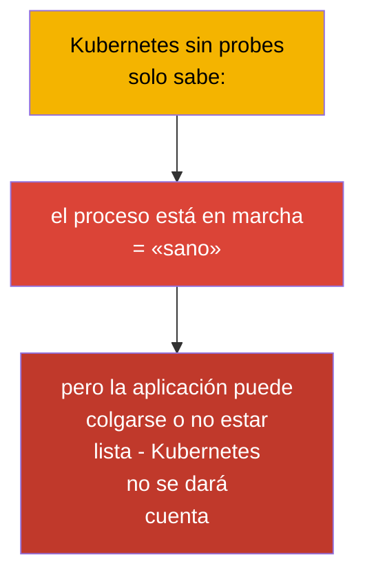
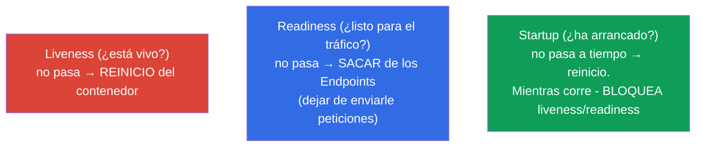
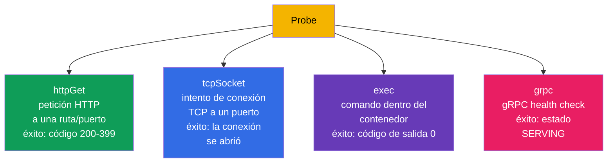
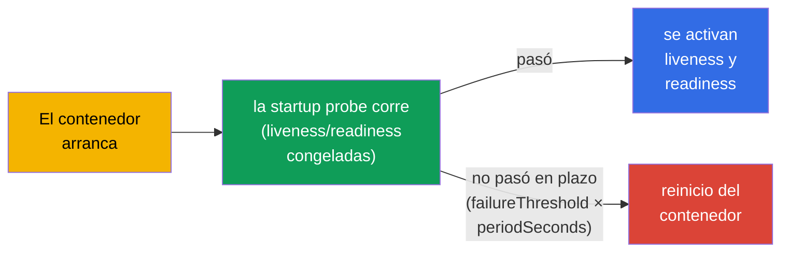
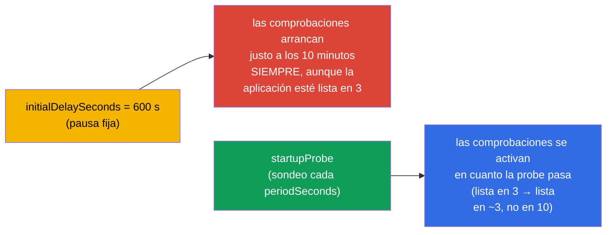
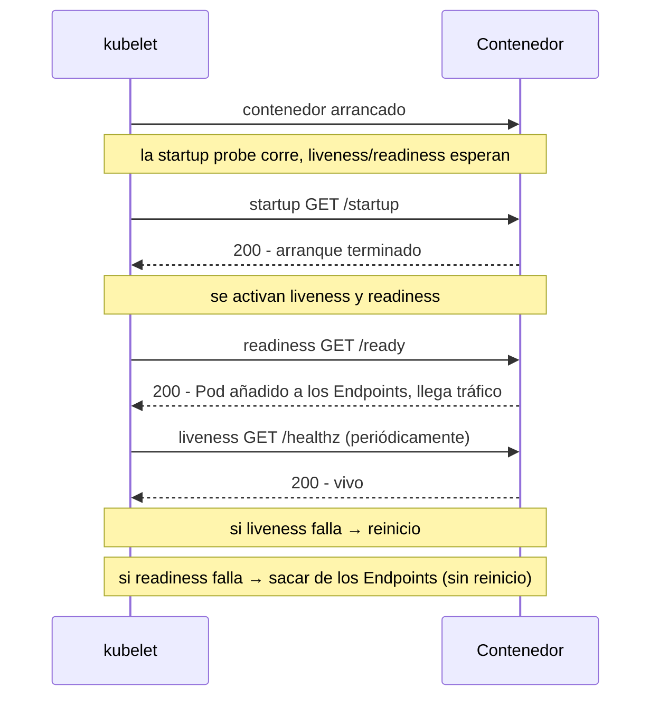
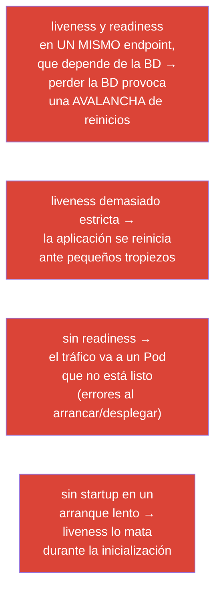

[Русская версия](ru.md) · [Eng version](README.md) · [Version française](fr.md) · [Deutsche Version](de.md) · [ქართული ვერსია](ge.md)

# Capítulo 27. Comprobaciones de estado: liveness, readiness y startup probes

> **Qué viene ahora.** Empezamos la parte 6 - observabilidad y mantenimiento. Kubernetes por
> sí mismo no sabe si tu aplicación está «sana» por dentro: el contenedor funciona, pero la
> aplicación puede haberse colgado o no haberse calentado todavía. Las **probes (sondas)** son
> la forma de comunicar al clúster el estado real de la aplicación. Hay tres: **liveness**
> (¿está vivo?), **readiness** (¿está listo para recibir tráfico?), **startup** (¿ha
> arrancado?). Es el dominio Observability (CKAD) y Workloads (CKA), y está directamente
> relacionado con los despliegues seguros (capítulo 8) y los Endpoints de los Service
> (capítulo 7).

## 27.1. Para qué sirven las probes

Sin probes Kubernetes juzga la salud de forma tosca: el proceso está vivo, luego todo va bien.
Pero eso a menudo no es cierto:

- la aplicación se ha **colgado** (deadlock), el proceso vive, pero no atiende peticiones;
- la aplicación **todavía está arrancando** (calentando la caché, conectando a la BD), pero ya
  le está llegando tráfico;
- la aplicación **no está lista temporalmente** (ha perdido la conexión con una dependencia),
  pero no hace falta reiniciarla.



Las probes dan a la aplicación una forma de decirle honestamente al clúster en qué estado
está, y al clúster una forma de reaccionar correctamente: reiniciar, sacar del balanceo o
esperar.

## 27.2. Las tres probes y su cometido



| Probe | Pregunta | Qué ocurre si falla |
|-------|--------|-----------------|
| **liveness** | ¿la aplicación está viva (no colgada)? | el contenedor **se reinicia** |
| **readiness** | ¿está lista para recibir tráfico? | el Pod **se saca de los Endpoints** (¡no se reinicia!) |
| **startup** | ¿ha terminado de arrancar? | si no lo logra en plazo - reinicio; bloquea las demás probes hasta tener éxito |

La diferencia clave que hay que asimilar: **liveness cura reiniciando, readiness aislando del
tráfico**. Un fallo de readiness NO reinicia el Pod, solo deja de enviarle peticiones
(recuerda los Endpoints del capítulo 7).

## 27.3. Formas de comprobación

Cada probe puede comprobar la salud de una de varias maneras:



| Forma | Cómo comprueba | Éxito |
|--------|---------------|-------|
| `httpGet` | HTTP GET a una ruta y un puerto | código de respuesta 200-399 |
| `tcpSocket` | abrir una conexión TCP a un puerto | conexión establecida |
| `exec` | ejecutar un comando en el contenedor | código de salida 0 |
| `grpc` | gRPC health check | estado SERVING |

`httpGet` es la más habitual para aplicaciones web; `exec` va bien para comprobar
ficheros/procesos; `tcpSocket` para servicios sin HTTP (BD, brokers); `grpc` para servicios
gRPC con el protocolo health implementado.

> **Probes gRPC.** La forma `grpc` es estable (GA) desde Kubernetes 1.27 (beta desde la 1.24,
> activada por defecto). Invoca el gRPC health-check estándar de la aplicación; la probe tiene
> éxito si el servicio responde con estado `SERVING`. Ejemplo:
>
> ```yaml
>     livenessProbe:
>       grpc:
>         port: 9000
>         service: my.health.Service   # opcional; nombre del servicio de health-check
>       periodSeconds: 10
> ```
>
> Antes de que existiera `grpc`, las aplicaciones gRPC usaban el binario aparte
> `grpc_health_probe` a través de `exec` - ahora se hace de forma nativa.

## 27.4. Parámetros de las probes

Todas las probes se ajustan con los mismos parámetros de temporización:

```yaml
    livenessProbe:
      httpGet:
        path: /healthz
        port: 8080
      initialDelaySeconds: 10     # esperar antes de la primera comprobación
      periodSeconds: 10           # cada cuánto comprobar
      timeoutSeconds: 1           # timeout de una comprobación
      failureThreshold: 3         # cuántos fallos seguidos = probe fallida
      successThreshold: 1         # cuántos éxitos = OK de nuevo (para readiness)
```

| Parámetro | Qué define |
|----------|-----------|
| `initialDelaySeconds` | pausa antes de la primera comprobación (da tiempo a arrancar) |
| `periodSeconds` | intervalo entre comprobaciones |
| `timeoutSeconds` | cuánto esperar la respuesta de una comprobación |
| `failureThreshold` | cuántos fallos seguidos se consideran una probe fallida |
| `successThreshold` | cuántos éxitos seguidos se consideran recuperación |

Por ejemplo, `periodSeconds: 10` + `failureThreshold: 3` = el problema se detecta
aproximadamente tras 30 segundos de fallos.

## 27.5. Startup probe: para aplicaciones de arranque lento

El problema: en una aplicación de arranque lento (el calentamiento tarda un minuto) la probe
de liveness puede «matarla» antes de que llegue a levantarse. Antes esto se resolvía con un
`initialDelaySeconds` grande, pero es una solución tosca. La **startup probe** lo resuelve con
elegancia: mientras no pase, liveness y readiness **no se ejecutan en absoluto**.



Así se da a la aplicación lenta una ventana amplia para arrancar (`failureThreshold ×
periodSeconds`), pero después del arranque liveness trabaja con intervalos rápidos y
«estrictos». Lo mejor de los dos mundos.

> **El tiempo de arranque varía - calcula por el peor caso.** Las aplicaciones reales no
> arrancan en un tiempo fijo: bajo carga, con la caché en frío, con una BD lenta o con un gran
> volumen de datos, el calentamiento de la misma aplicación puede llevar, digamos, de 3 a 10
> minutos. La ventana de la startup probe hay que calcularla por el **límite superior**, si no
> el Pod al que esta vez le toque arrancar en 10 minutos morirá en el minuto 4 y entrará en un
> ciclo de reinicios.
>
> Ventana = `failureThreshold × periodSeconds`. Con margen para 10 minutos:
>
> ```yaml
>     startupProbe:
>       httpGet:
>         path: /startup
>         port: 8080
>       periodSeconds: 10        # comprobación cada 10 s
>       failureThreshold: 60     # 60 × 10 s = 600 s = 10 minutos para arrancar
> ```
>
> Es importante que esa ventana «cuesta dinero» solo en las instancias lentas: en cuanto la
> startup pasa, las comprobaciones siguen el calendario de liveness/readiness. Por eso aquí no
> da pena poner un `failureThreshold` generoso - no ralentiza a los Pods que arrancan rápido,
> solo evita matar a los que esta vez tardan más de lo habitual.

Aquí se ve la diferencia con el enfoque «antiguo» vía `initialDelaySeconds`. Este define una
pausa **fija** antes de las comprobaciones, así que hay que ponerla según el peor caso (los
mismos 10 minutos). Pero ese valor se aplica **siempre**: un Pod que arrancó en 3 minutos se
quedará igualmente 10 esperando antes de que empiecen a comprobarlo y lo añadan a los
Endpoints, o sea que recibirá tráfico 7 minutos más tarde de lo que podría.

La startup probe se comporta de otra manera: **sondea activamente** la aplicación (una vez
cada `periodSeconds`) y pasa el Pod a modo operativo **en cuanto** la comprobación tiene
éxito. La instancia rápida está lista en 3 minutos, la lenta al cabo de sus 10, y nadie espera
«por si acaso».



Conclusión práctica: `initialDelaySeconds` castiga a los Pods rápidos con un retraso de
disponibilidad (y ralentiza los despliegues y el autoescalado), mientras que la startup probe
da una ventana amplia solo a quien realmente la necesita.

## 27.6. Cómo interactúan las probes

Montemos la imagen completa de la vida de un Pod con las tres probes:



Importante: **de las probes se encarga el kubelet** (capítulo 2), no el API server. El kubelet
del nodo ejecuta él mismo las comprobaciones de sus Pods y toma las decisiones
(reinicio/aislamiento).

## 27.7. Errores típicos al configurar probes

Es fácil configurar las probes en tu contra. Errores clásicos:



| Error | Consecuencia | Cómo hacerlo bien |
|--------|-------------|---------------|
| liveness atada a una BD externa | perder la BD → avalancha de reinicios | liveness comprueba solo el proceso, no las dependencias |
| sin readiness | tráfico a un Pod no listo, errores en el despliegue | añadir readiness con comprobación de dependencias |
| liveness y readiness idénticas | no se puede distinguir «muerto» de «no listo temporalmente» | endpoints y lógica distintos |
| sin startup en una aplicación lenta | liveness la mata al arrancar | añadir startup probe |

La regla principal: **liveness debe comprobar solo «si el proceso está vivo»** (comprobación
interna rápida), y **readiness «si es capaz de atender»** (puede incluir la comprobación de
dependencias). Mezclarlas es una causa frecuente de reinicios en cascada.

## 27.8. Cómo se aplica esto en producción

- **Las probes son obligatorias para despliegues seguros.** El rolling update (capítulo 8) solo
  es realmente seguro con una readiness correcta: sin ella Kubernetes considera el Pod listo de
  inmediato y le manda tráfico a una aplicación sin calentar, generando errores en cada
  release.
- **Separación de liveness y readiness.** En producción son endpoints distintos: `/healthz`
  (vida, sin dependencias externas) y `/ready` (disponibilidad, con comprobación de
  BD/cachés). Eso evita la avalancha de reinicios cuando cae una dependencia - el Pod
  simplemente sale del balanceo, en lugar de empezar a reiniciarse cíclicamente.
- **Startup para aplicaciones pesadas.** Los servicios JVM y las aplicaciones con
  precalentamiento de caché reciben una startup probe con una ventana amplia - si no, liveness
  las mata al arrancar. Eso elimina la necesidad de un `initialDelaySeconds` enorme.
- **Probes + graceful shutdown.** Junto con `terminationGracePeriodSeconds` y el tratamiento de
  SIGTERM, las probes garantizan despliegues sin pérdidas: el Pod primero sale de los Endpoints
  (readiness), termina las peticiones en curso y solo después finaliza.
- **Temporización cuidadosa.** Unas probes demasiado agresivas (period/timeout pequeños)
  generan falsos positivos y reinicios innecesarios bajo carga; se calibran según el
  comportamiento real de la aplicación.

## 27.9. Mini-glosario

- **Probe (sonda)** - comprobación de la salud de un contenedor, ejecutada por el kubelet.
- **liveness** - si el contenedor está vivo; fallo → reinicio.
- **readiness** - si está listo para el tráfico; fallo → eliminación de los Endpoints (sin
  reinicio).
- **startup** - si ha terminado el arranque; bloquea las demás probes hasta que pasa.
- **httpGet / tcpSocket / exec / grpc** - formas de comprobación.
- **initialDelaySeconds** - retardo antes de la primera comprobación.
- **periodSeconds** - intervalo de las comprobaciones.
- **failureThreshold / successThreshold** - número de fallos/éxitos para cambiar de estado.

## 27.10. Resumen del capítulo

- Las probes comunican al clúster el estado real de la aplicación, que de otro modo no se ve
  («el proceso vive» ≠ «la aplicación está sana»).
- liveness → reinicio si falla; readiness → eliminación de los Endpoints (sin reinicio);
  startup → bloquea liveness/readiness mientras la aplicación arranca.
- Formas de comprobación: httpGet (web), tcpSocket (servicios sin HTTP), exec (comando), grpc.
- La temporización se define con initialDelaySeconds, periodSeconds, timeoutSeconds,
  failureThreshold/successThreshold.
- La startup probe es la solución correcta para un arranque lento, en lugar de un
  initialDelaySeconds grande.
- De las probes se encarga el kubelet, no el API server.
- Errores principales: liveness atada a dependencias externas (avalancha de reinicios), falta
  de readiness (tráfico a un Pod no listo), liveness/readiness idénticas.

## 27.11. Para qué te servirá: en el examen y en el trabajo real

**En el examen.** «Añade una probe liveness/readiness/startup con httpGet/exec y una
temporización dada» son tareas muy frecuentes (Observability CKAD, Workloads CKA). Hay que
escribir con soltura los bloques de probes y entender que liveness reinicia y readiness saca
del tráfico. La relación readiness ↔ Endpoints ↔ despliegue seguro es un tema transversal.

**En el trabajo real.** Las probes son la base de la autorreparación y de los despliegues sin
caídas. Una separación correcta de liveness/readiness evita reinicios en cascada cuando fallan
las dependencias, y startup salva a los servicios de arranque lento. Unas probes mal
configuradas son una causa frecuente de inestabilidad y reinicios falsos en producción.

## 27.12. Preguntas de autoevaluación

1. ¿Por qué «el proceso está en marcha» no significa «la aplicación está sana»?
2. ¿En qué se diferencia la reacción a un fallo de liveness de la reacción a un fallo de readiness?
3. ¿Cómo se relacionan la probe de readiness y los Endpoints de un Service?
4. ¿Para qué sirve la startup probe y en qué es mejor que un initialDelaySeconds grande?
5. ¿Qué formas de comprobación existen y cuándo es apropiada cada una?
6. ¿Por qué no se debe atar liveness a la disponibilidad de una BD externa?
7. ¿Quién ejecuta las probes: el API server o el kubelet?

## Práctica

Hemos enseñado al clúster a entender la salud de la aplicación. En el capítulo 28 veremos cómo
observamos nosotros mismos el clúster: logs, metrics-server y `kubectl top`. Las probes se
practican en los laboratorios de observabilidad (entre otros, con la imagen `ping_pong`, capaz
de emular fallos de probes).

🧪 Laboratorio 109 (probes liveness, readiness, startup): [tasks/cka/labs/109](../../labs/109/README_ES.MD)

---
[Índice](../README_ES.md) · [Capítulo 26](../26/es.md) · [Capítulo 28](../28/es.md)
