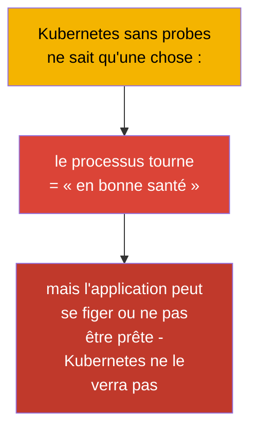
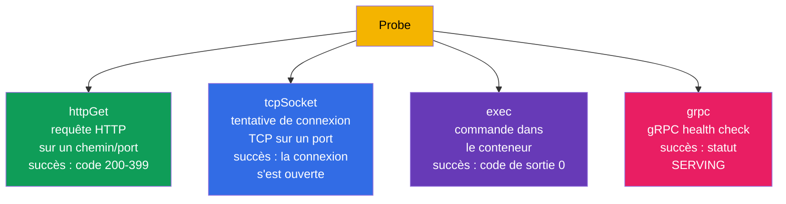
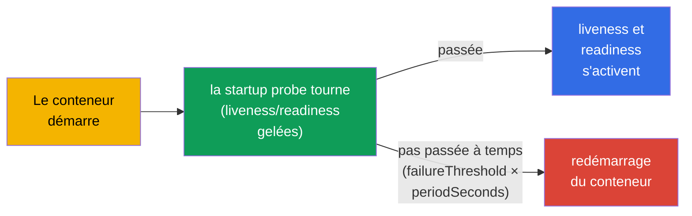
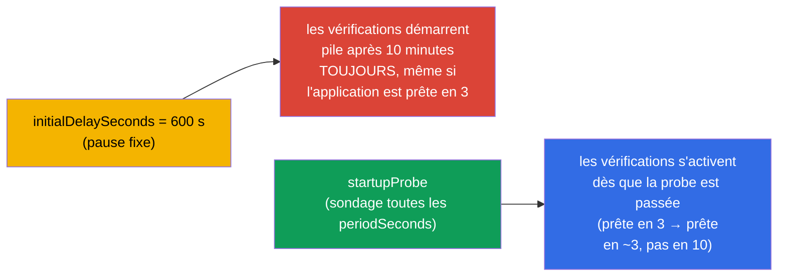
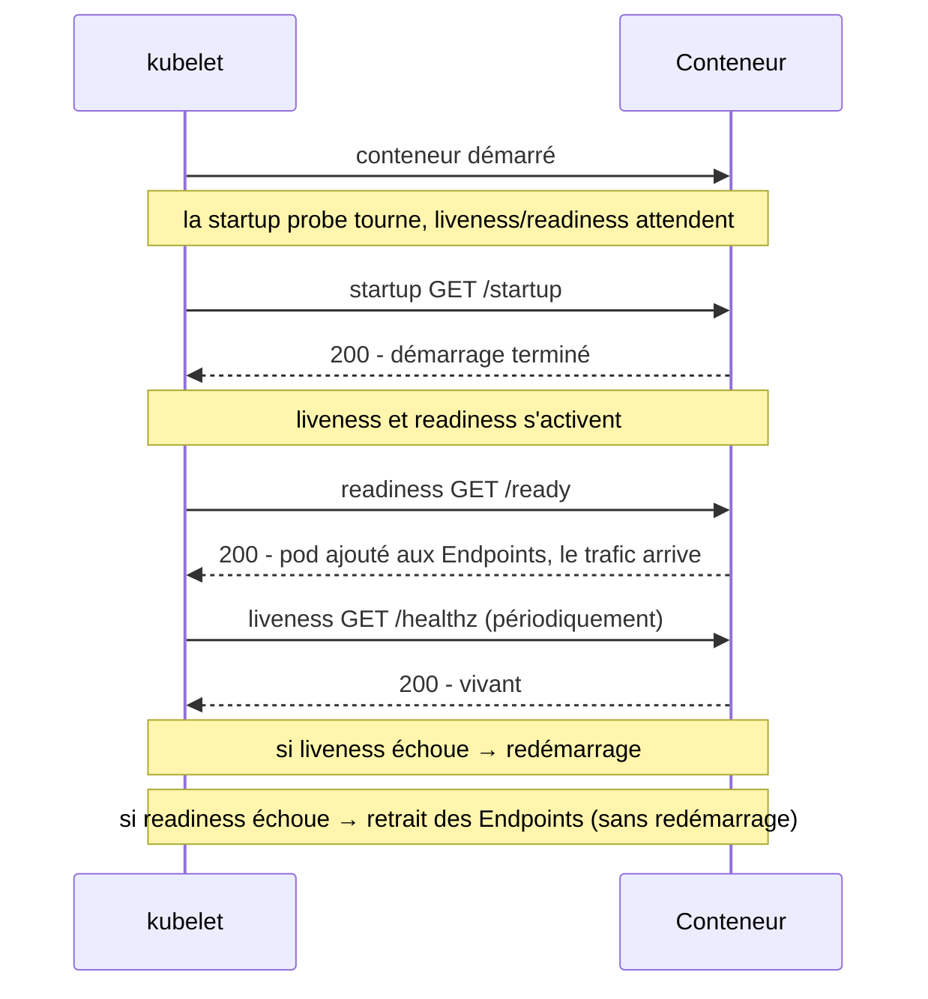
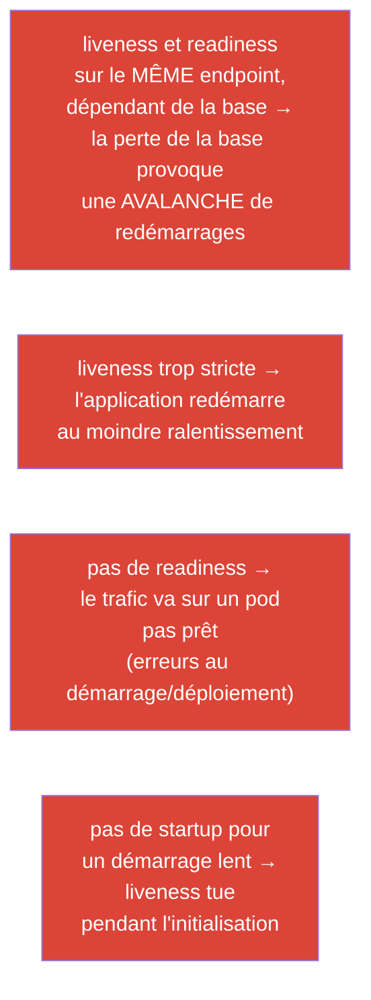

[Русская версия](ru.md) · [Eng version](README.md) · [Versión en español](es.md) · [Deutsche Version](de.md) · [ქართული ვერსია](ge.md) · [繁體中文版](tw.md) · [日本語版](jp.md)

# Chapitre 27. Vérifications d'état : liveness, readiness et startup probes

> **Ce qui suit.** Nous entamons la partie 6 - observabilité et maintenance. Kubernetes ne sait
> pas de lui-même si votre application est « en bonne santé » à l'intérieur : le conteneur
> tourne, mais l'application peut s'être figée ou ne pas encore être chaude. Les **probes**
> sont le moyen d'informer le cluster de l'état réel de l'application. Il y en a trois :
> **liveness** (est-elle vivante), **readiness** (est-elle prête à recevoir du trafic),
> **startup** (a-t-elle fini de démarrer). C'est le domaine Observability (CKAD) et Workloads
> (CKA), et cela touche directement aux déploiements sûrs (chapitre 8) et aux Endpoints des
> services (chapitre 7).

## 27.1. À quoi servent les probes

Sans probes, Kubernetes juge la santé de façon grossière : le processus est vivant - donc tout
va bien. Mais c'est souvent faux :

- l'application s'est **figée** (deadlock), le processus est vivant mais ne traite plus les
  requêtes ;
- l'application est **encore en train de démarrer** (préchauffage du cache, connexion à la
  base), mais le trafic arrive déjà sur elle ;
- l'application est **momentanément non prête** (elle a perdu le lien avec une dépendance),
  mais il n'y a pas besoin de la redémarrer.



Les probes donnent à l'application un moyen de dire honnêtement au cluster dans quel état elle
est, et au cluster de réagir correctement : redémarrer, retirer de l'équilibrage ou attendre.

## 27.2. Les trois probes et leur rôle


| Probe | Question | En cas d'échec |
|-------|--------|-----------------|
| **liveness** | l'application est-elle vivante (pas figée) ? | le conteneur est **redémarré** |
| **readiness** | est-elle prête à recevoir du trafic ? | le pod est **retiré des Endpoints** (pas de redémarrage !) |
| **startup** | le démarrage est-il terminé ? | si elle n'aboutit pas dans le délai - redémarrage ; bloque les autres probes jusqu'au succès |

La distinction clé à bien assimiler : **liveness soigne par le redémarrage, readiness par
l'isolement du trafic**. L'échec de readiness ne redémarre PAS le pod, il cesse simplement de
lui envoyer des requêtes (rappelez-vous les Endpoints du chapitre 7).

## 27.3. Les modes de vérification

Chaque probe peut vérifier la santé de plusieurs façons :



| Mode | Comment il vérifie | Succès |
|--------|---------------|-------|
| `httpGet` | HTTP GET sur un chemin et un port | code de réponse 200-399 |
| `tcpSocket` | ouvrir une connexion TCP sur un port | connexion établie |
| `exec` | exécuter une commande dans le conteneur | code de sortie 0 |
| `grpc` | gRPC health check | statut SERVING |

`httpGet` est le plus fréquent pour les applications web ; `exec` est pratique pour vérifier des
fichiers/processus ; `tcpSocket` convient aux services sans HTTP (bases, brokers) ; `grpc` aux
services gRPC ayant implémenté le protocole health.

> **Les probes gRPC.** Le mode `grpc` est stable (GA) depuis Kubernetes 1.27 (bêta depuis 1.24,
> activé par défaut). Il appelle le gRPC health check standard de l'application ; la probe
> réussit si le service répond avec le statut `SERVING`. Exemple :
>
> ```yaml
>     livenessProbe:
>       grpc:
>         port: 9000
>         service: my.health.Service   # facultatif ; nom du service health-check
>       periodSeconds: 10
> ```
>
> Avant l'arrivée de `grpc`, les applications gRPC utilisaient le binaire séparé
> `grpc_health_probe` via `exec` - désormais cela se fait nativement.

## 27.4. Les paramètres des probes

Toutes les probes se règlent avec les mêmes paramètres de timing :

```yaml
    livenessProbe:
      httpGet:
        path: /healthz
        port: 8080
      initialDelaySeconds: 10     # attendre avant la première vérification
      periodSeconds: 10           # à quelle fréquence vérifier
      timeoutSeconds: 1           # délai d'attente d'une vérification
      failureThreshold: 3         # combien d'échecs d'affilée = échec de la probe
      successThreshold: 1         # combien de succès = de nouveau OK (pour readiness)
```

| Paramètre | Ce qu'il définit |
|----------|-----------|
| `initialDelaySeconds` | pause avant la première vérification (laisse le temps de démarrer) |
| `periodSeconds` | intervalle entre les vérifications |
| `timeoutSeconds` | combien de temps attendre la réponse d'une vérification |
| `failureThreshold` | combien d'échecs d'affilée comptent comme un échec |
| `successThreshold` | combien de succès d'affilée comptent comme un rétablissement |

Par exemple, `periodSeconds: 10` + `failureThreshold: 3` = le problème est constaté au bout
d'environ 30 secondes de refus.

## 27.5. Startup probe : pour les applications qui démarrent lentement

Le problème : pour une application au démarrage lent (le préchauffage prend une minute), la
probe liveness peut la « tuer » avant qu'elle ne soit debout. On réglait cela autrefois avec un
gros `initialDelaySeconds`, mais c'est grossier. La **startup probe** le résout élégamment :
tant qu'elle n'est pas passée, liveness et readiness **ne démarrent pas du tout**.



Ainsi, on donne à une application lente une large fenêtre pour démarrer
(`failureThreshold × periodSeconds`), mais après le démarrage liveness travaille avec des
intervalles courts et « stricts ». Le meilleur des deux mondes.

> **Le temps de démarrage varie - calculez au pire cas.** Les applications réelles ne démarrent
> pas en un temps fixe : sous charge, avec un cache froid, une base lente ou un gros volume de
> données, le préchauffage d'une même application peut prendre, disons, de 3 à 10 minutes. La
> fenêtre de la startup probe doit être calculée sur la **borne supérieure**, sinon le pod qui
> cette fois-ci a eu la malchance de mettre 10 minutes sera tué à la 4e minute et partira en
> boucle de redémarrages.
>
> Fenêtre = `failureThreshold × periodSeconds`. Avec une marge pour 10 minutes :
>
> ```yaml
>     startupProbe:
>       httpGet:
>         path: /startup
>         port: 8080
>       periodSeconds: 10        # vérification toutes les 10 s
>       failureThreshold: 60     # 60 × 10 s = 600 s = 10 minutes pour démarrer
> ```
>
> Point important : cette fenêtre ne « coûte » quelque chose qu'aux instances lentes : dès que
> startup est passée, les vérifications suivent le rythme de liveness/readiness. On ne se prive
> donc pas d'un `failureThreshold` généreux - il ne ralentit pas les pods qui démarrent vite, il
> empêche seulement de tuer ceux qui, cette fois-ci, se lèvent plus lentement que d'habitude.

C'est là que se voit la différence avec l'« ancienne » approche par `initialDelaySeconds`. Elle
définit une pause **fixe** avant les vérifications, il faut donc la régler au pire cas (les
mêmes 10 minutes). Mais cette valeur s'applique **toujours** : un pod démarré en 3 minutes
restera quand même 10 minutes avant qu'on le vérifie et qu'on l'ajoute aux Endpoints - il
recevra du trafic 7 minutes plus tard qu'il ne l'aurait pu.

La startup probe se comporte autrement : elle **sonde activement** l'application (toutes les
`periodSeconds`) et fait passer le pod en régime de travail **immédiatement**, dès que la
vérification est passée. L'instance rapide est prête au bout de 3 minutes, la lente au bout de
ses 10 minutes, et personne n'attend « par précaution ».



Bilan pratique : `initialDelaySeconds` punit les pods rapides par un retard de disponibilité (et
ralentit les déploiements et l'autoscaling), alors que la startup probe n'accorde une large
fenêtre qu'à ceux qui en ont réellement besoin.

## 27.6. Comment les probes interagissent

Assemblons le tableau complet de la vie d'un pod avec les trois probes :



Important : **c'est le kubelet qui exécute les probes** (chapitre 2), pas l'API server. Sur le
nœud, le kubelet effectue lui-même les vérifications de ses pods et prend les décisions
(redémarrage/isolement).

## 27.7. Erreurs classiques dans le réglage des probes

Les probes sont faciles à régler à contre-emploi. Les erreurs classiques :



| Erreur | Conséquence | La bonne façon |
|--------|-------------|---------------|
| liveness liée à une base externe | perte de la base → avalanche de redémarrages | liveness ne vérifie que le processus lui-même, pas les dépendances |
| pas de readiness | trafic sur un pod pas prêt, erreurs au déploiement | ajouter readiness avec la vérification des dépendances |
| liveness et readiness identiques | impossible de distinguer « mort » de « momentanément pas prêt » | des endpoints et une logique différents |
| pas de startup pour une application lente | liveness tue au démarrage | ajouter une startup probe |

Règle principale : **liveness doit vérifier seulement « le processus est-il vivant »** (une
vérification interne rapide), et **readiness « est-il prêt à servir »** (elle peut inclure la
vérification des dépendances). Les mélanger est une cause fréquente de redémarrages en cascade.

## 27.8. Comment cela s'applique en production

- **Les probes sont indispensables aux déploiements sûrs.** Un rolling update (chapitre 8) n'est
  vraiment sûr qu'avec une readiness correcte : sans elle, Kubernetes considère le pod comme
  prêt tout de suite et envoie le trafic vers une application pas encore chaude, ce qui donne des
  erreurs à chaque release.
- **Séparer liveness et readiness.** En prod, ce sont des endpoints différents : `/healthz`
  (vivacité, sans dépendances externes) et `/ready` (disponibilité, avec vérification de la
  base/des caches). Cela évite l'avalanche de redémarrages quand une dépendance tombe - le pod
  sort simplement de l'équilibrage au lieu de partir en boucle de redémarrages.
- **Startup pour les applications lourdes.** Les services JVM, les applications avec
  préchauffage de cache reçoivent une startup probe à large fenêtre - sinon liveness les tue au
  démarrage. Cela supprime le besoin d'un énorme `initialDelaySeconds`.
- **Probes + graceful shutdown.** Associées à `terminationGracePeriodSeconds` et au traitement
  de SIGTERM, les probes assurent un déploiement sans pertes : le pod sort d'abord des Endpoints
  (readiness), termine les requêtes en cours et seulement ensuite s'arrête.
- **Un timing soigné.** Des probes trop agressives (period/timeout trop petits) créent des faux
  positifs et des redémarrages inutiles sous charge ; on les calibre sur le comportement réel de
  l'application.

## 27.9. Mini-glossaire

- **Probe** - vérification de la santé d'un conteneur, exécutée par le kubelet.
- **liveness** - le conteneur est-il vivant ; échec → redémarrage.
- **readiness** - est-il prêt pour le trafic ; échec → retrait des Endpoints (sans redémarrage).
- **startup** - le démarrage est-il terminé ; bloque les autres probes jusqu'à ce qu'elle passe.
- **httpGet / tcpSocket / exec / grpc** - les modes de vérification.
- **initialDelaySeconds** - délai avant la première vérification.
- **periodSeconds** - intervalle des vérifications.
- **failureThreshold / successThreshold** - nombre d'échecs/de succès pour changer d'état.

## 27.10. Bilan du chapitre

- Les probes informent le cluster de l'état réel de l'application, invisible autrement
  (« le processus est vivant » ≠ « l'application est en bonne santé »).
- liveness → redémarrage en cas d'échec ; readiness → retrait des Endpoints (sans redémarrage) ;
  startup → bloque liveness/readiness pendant le démarrage de l'application.
- Modes de vérification : httpGet (web), tcpSocket (services sans HTTP), exec (commande), grpc.
- Le timing se règle avec initialDelaySeconds, periodSeconds, timeoutSeconds,
  failureThreshold/successThreshold.
- La startup probe est la bonne solution pour un démarrage lent, à la place d'un gros
  initialDelaySeconds.
- Ce sont les kubelet qui exécutent les probes, pas l'API server.
- Erreurs principales : liveness liée à des dépendances externes (avalanche de redémarrages),
  absence de readiness (trafic vers un pod pas prêt), liveness/readiness identiques.

## 27.11. À quoi cela sert : à l'examen et dans le travail réel

**À l'examen.** « Ajoute une probe liveness/readiness/startup avec httpGet/exec et un timing
donné » - des exercices très fréquents (Observability CKAD, Workloads CKA). Il faut écrire les
blocs de probes avec assurance et comprendre que liveness redémarre alors que readiness retire
du trafic. Le lien readiness ↔ Endpoints ↔ déploiement sûr est un thème transversal.

**Dans le travail réel.** Les probes sont la base de l'auto-réparation et des déploiements sans
interruption. Une bonne séparation liveness/readiness évite les redémarrages en cascade lors des
pannes de dépendances, et startup sauve les services au démarrage lent. Des probes mal réglées
sont une cause fréquente d'instabilité et de faux redémarrages en prod.

## 27.12. Questions d'auto-évaluation

1. Pourquoi « le processus est lancé » ne signifie-t-il pas « l'application est en bonne santé » ?
2. En quoi la réaction à un échec de liveness diffère-t-elle de la réaction à un échec de readiness ?
3. Quel est le lien entre la probe readiness et les Endpoints d'un service ?
4. À quoi sert la startup probe et en quoi vaut-elle mieux qu'un gros initialDelaySeconds ?
5. Quels sont les modes de vérification et quand chacun est-il approprié ?
6. Pourquoi ne faut-il pas lier liveness à la disponibilité d'une base externe ?
7. Qui exécute les probes - l'API server ou le kubelet ?

## Pratique

Nous avons appris au cluster à comprendre la santé de l'application. Au chapitre 28 - comment
nous observons nous-mêmes le cluster : logs, metrics-server et `kubectl top`. Les probes se
travaillent dans les TP sur l'observabilité (notamment avec l'image `ping_pong`, capable
d'émuler l'échec des probes).

🧪 TP 109 (probes liveness, readiness, startup) : [tasks/cka/labs/109](../../labs/109/README_FR.MD)

🎮 Killercoda (dans le navigateur, sans installation) : [HTTP Readiness Probe](https://killercoda.com/chadmcrowell/course/ckad/readinessprobe-http) · [Liveness Probe Restart](https://killercoda.com/chadmcrowell/course/ckad/livenessprobe-restart) · [TCP Liveness Probe](https://killercoda.com/chadmcrowell/course/ckad/tcp-probe) · [Startup Probe](https://killercoda.com/chadmcrowell/course/ckad/startup-probe)

---
[Sommaire](../README_FR.md) · [Chapitre 26](../26/fr.md) · [Chapitre 28](../28/fr.md)
