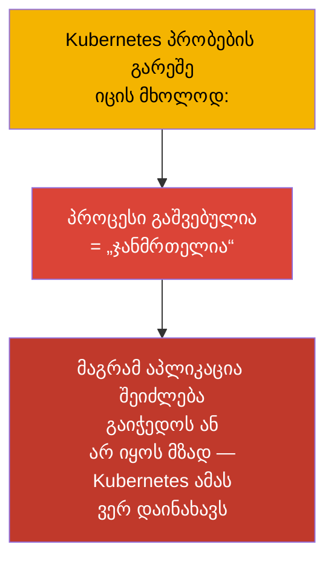
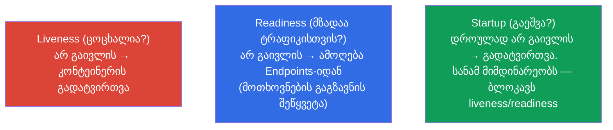
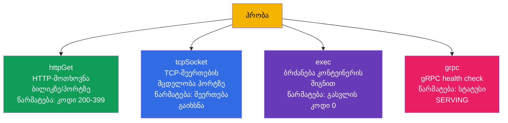
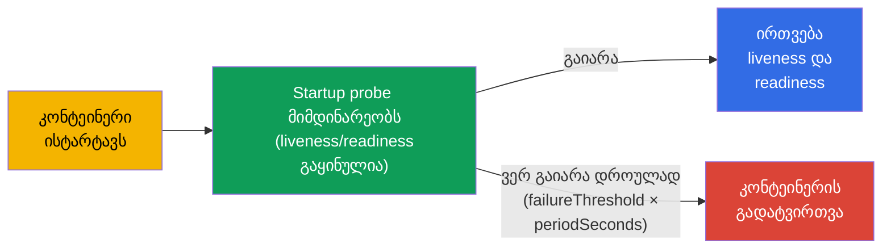
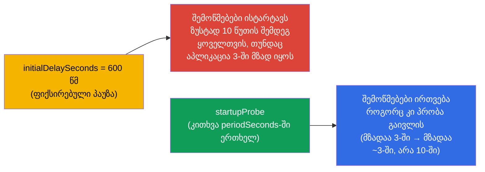
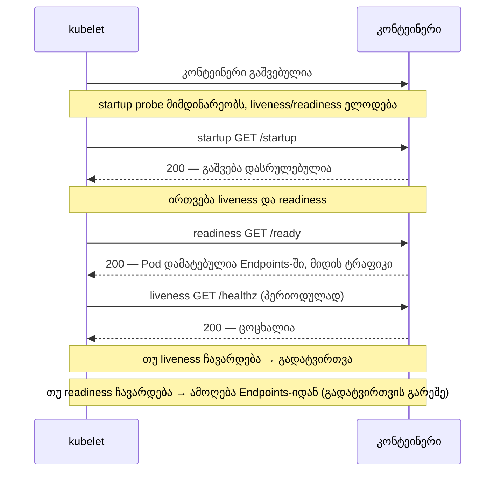
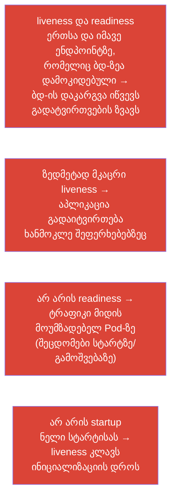

[Русская версия](ru.md) · [Eng version](README.md) · [Versión en español](es.md) · [Version française](fr.md) · [Deutsche Version](de.md) · [繁體中文版](tw.md) · [日本語版](jp.md)

# თავი 27. მდგომარეობის შემოწმებები: liveness, readiness და startup probes

> **რა იქნება შემდეგ.** ვიწყებთ ნაწილ 6-ს - დაკვირვებადობა და მომსახურება. Kubernetes თავად არ
> იცის, „ჯანმრთელია“ თუ არა თქვენი აპლიკაცია შიგნით: კონტეინერი მუშაობს, ხოლო აპლიკაცია შეიძლება
> გაიჭედოს ან ჯერ არ გათბეს. **პრობები (probes)** - საშუალება, რომლითაც კლასტერს ვაცნობებთ
> აპლიკაციის რეალურ მდგომარეობას. ისინი სამია: **liveness** (ცოცხალია თუ არა), **readiness**
> (მზადაა თუ არა ტრაფიკის მიღებისთვის), **startup** (გაეშვა თუ არა). ეს არის Observability-ის
> (CKAD) და Workloads-ის (CKA) დომენი, და პირდაპირ უკავშირდება უსაფრთხო გამოშვებებს (თავი 8) და
> სერვისების Endpoints-ს (თავი 7).

## 27.1. რისთვის არის საჭირო პრობები

პრობების გარეშე Kubernetes ჯანმრთელობას უხეშად აფასებს: პროცესი ცოცხალია - მაშასადამე ყველაფერი
კარგადაა. მაგრამ ეს ხშირად არასწორია:

- აპლიკაცია **გაიჭედა** (deadlock), პროცესი ცოცხალია, მაგრამ მოთხოვნებს არ ამუშავებს;
- აპლიკაცია **ჯერ ისტარტავს** (კეშის გათბობა, ბდ-სთან დაკავშირება), მაგრამ ტრაფიკი მასზე უკვე
  მიდის;
- აპლიკაცია **დროებით არ არის მზად** (დაკარგა კავშირი დამოკიდებულებასთან), მაგრამ მისი
  გადატვირთვა არ არის საჭირო.



პრობები აპლიკაციას აძლევს საშუალებას პატიოსნად უთხრას კლასტერს თავისი მდგომარეობის შესახებ, ხოლო
კლასტერს - სწორად რეაგირება: გადატვირთოს, ბალანსირებიდან ამოიღოს ან დაელოდოს.

## 27.2. სამი პრობა და მათი დანიშნულება



| პრობა | კითხვა | რა ხდება ჩავარდნისას |
|-------|--------|-----------------|
| **liveness** | აპლიკაცია ცოცხალია (არ გაიჭედა)? | კონტეინერი **გადაიტვირთება** |
| **readiness** | მზადაა ტრაფიკის მიღებისთვის? | Pod **ამოიღება Endpoints-იდან** (არ გადაიტვირთება!) |
| **startup** | დაასრულა თუ არა გაშვება? | დროულად შეუსრულებლობისას - გადატვირთვა; ბლოკავს დანარჩენ პრობებს წარმატებამდე |

მთავარი განსხვავება, რომელიც უნდა გავითავისოთ: **liveness მკურნალობს გადატვირთვით, readiness -
ტრაფიკისგან იზოლაციით**. readiness-ის ჩავარდნა Pod-ს არ გადატვირთავს, ის მხოლოდ წყვეტს მასზე
მოთხოვნების გაგზავნას (გაიხსენეთ Endpoints თავი 7-იდან).

## 27.3. შემოწმების საშუალებები

ყოველ პრობას ჯანმრთელობის შემოწმება რამდენიმე საშუალებიდან ერთით შეუძლია:



| საშუალება | როგორ ამოწმებს | წარმატება |
|--------|---------------|-------|
| `httpGet` | HTTP GET ბილიკსა და პორტზე | პასუხის კოდი 200-399 |
| `tcpSocket` | TCP-შეერთების გახსნა პორტზე | შეერთება დამყარებულია |
| `exec` | ბრძანების შესრულება კონტეინერში | გასვლის კოდი 0 |
| `grpc` | gRPC health check | სტატუსი SERVING |

`httpGet` - ყველაზე ხშირია ვებ-აპლიკაციებისთვის; `exec` მოსახერხებელია ფაილების/პროცესების
შემოწმებისთვის; `tcpSocket` - HTTP-ს გარეშე სერვისებისთვის (ბდ, ბროკერები); `grpc` - gRPC-სერვისებისთვის
რეალიზებული health-პროტოკოლით.

> **gRPC-პრობები.** საშუალება `grpc` სტაბილურია (GA) Kubernetes 1.27-იდან (ბეტა 1.24-იდან, ჩართული
> ნაგულისხმევად). ის აპლიკაციასთან იძახებს სტანდარტულ gRPC health-check-ს; პრობა წარმატებულია, თუ
> სერვისი პასუხობს სტატუსით `SERVING`. მაგალითი:
>
> ```yaml
>     livenessProbe:
>       grpc:
>         port: 9000
>         service: my.health.Service   # არასავალდებულოა; health-check სერვისის სახელი
>       periodSeconds: 10
> ```
>
> `grpc`-ის გამოჩენამდე gRPC-აპლიკაციებისთვის იყენებდნენ ცალკე ბინარს
> `grpc_health_probe` `exec`-ის მეშვეობით - ახლა ეს ნატიურად კეთდება.

## 27.4. პრობების პარამეტრები

ყველა პრობა ერთი და იმავე ტაიმინგის პარამეტრებით კონფიგურირდება:

```yaml
    livenessProbe:
      httpGet:
        path: /healthz
        port: 8080
      initialDelaySeconds: 10     # დაცდა პირველ შემოწმებამდე
      periodSeconds: 10           # რა სიხშირით შემოწმდეს
      timeoutSeconds: 1           # ერთი შემოწმების ტაიმაუტი
      failureThreshold: 3         # რამდენი ზედიზედ ჩავარდნა = პრობის ჩავარდნა
      successThreshold: 1         # რამდენი წარმატება = ისევ OK (readiness-ისთვის)
```

| პარამეტრი | რას აყენებს |
|----------|-----------|
| `initialDelaySeconds` | პაუზა პირველ შემოწმებამდე (აძლევს გაშვების დროს) |
| `periodSeconds` | ინტერვალი შემოწმებებს შორის |
| `timeoutSeconds` | რამდენ ხანს ელოდოს პასუხს ერთ შემოწმებაზე |
| `failureThreshold` | რამდენი ზედიზედ წარუმატებლობა ჩაითვალოს ჩავარდნად |
| `successThreshold` | რამდენი ზედიზედ წარმატება ჩაითვალოს აღდგენად |

მაგალითად, `periodSeconds: 10` + `failureThreshold: 3` = პრობლემა ფიქსირდება დაახლოებით
30 წამიანი უარების შემდეგ.

## 27.5. Startup probe: ნელა მასტარტავი აპლიკაციებისთვის

პრობლემა: ნელა მასტარტავ აპლიკაციას (გათბობას ერთი წუთი სჭირდება) liveness-პრობა შეიძლება
„მოკლას“ მანამ, სანამ ის ადგება. ადრე ამას დიდი `initialDelaySeconds`-ით წყვეტდნენ, მაგრამ ეს
უხეშია. **Startup probe** ამას ელეგანტურად წყვეტს: სანამ ის არ გაივლის,
liveness და readiness **საერთოდ არ ეშვება**.



ასე ნელ აპლიკაციას აძლევენ დიდ ფანჯარას გაშვებისთვის (`failureThreshold × periodSeconds`),
მაგრამ სტარტის შემდეგ liveness მუშაობს სწრაფი, „მკაცრი“ ინტერვალებით. საუკეთესო ორივე სამყაროდან.

> **სტარტის დრო მცოცავია - იანგარიშეთ ყველაზე ცუდი შემთხვევით.** რეალური აპლიკაციები არ ისტარტავენ
> ფიქსირებულ დროში: დატვირთვის ქვეშ, ცივი კეშის, ნელი ბდ-ის ან მონაცემთა დიდი
> მოცულობის დროს ერთი და იმავე აპლიკაციის გათბობას შეიძლება, ვთქვათ, 3-დან 10
> წუთამდე დასჭირდეს. startup-პრობის ფანჯარა უნდა ვიანგარიშოთ **ზედა ზღვრით**, სხვაგვარად Pod, რომელსაც
> ამჯერად არ გაუმართლა და 10 წუთი ისტარტა, მოკლული იქნება 4-ე წუთზე და გადატვირთვების
> ციკლში გადავარდება.
>
> ფანჯარა = `failureThreshold × periodSeconds`. 10 წუთის მარაგით:
>
> ```yaml
>     startupProbe:
>       httpGet:
>         path: /startup
>         port: 8080
>       periodSeconds: 10        # შემოწმება 10 წმ-ში ერთხელ
>       failureThreshold: 60     # 60 × 10 წმ = 600 წმ = 10 წუთი გაშვებაზე
> ```
>
> მნიშვნელოვანია, რომ ეს ფანჯარა „ფულს ღირს“ მხოლოდ ნელ ეგზემპლარებთან: როგორც კი startup
> გაივლის, შემოწმებები liveness/readiness-ის განრიგით მიდის. ამიტომ აქ არ ჯავრობენ
> გულუხვი `failureThreshold`-ის დაყენებას - ის არ ანელებს სწრაფად მასტარტავ Pod-ებს, არამედ მხოლოდ არ
> აძლევს მოკვლის საშუალებას მათ, რომლებიც ამჯერად ჩვეულებრივზე დიდხანს ადგებიან.

აქვე ჩანს განსხვავება „ძველ“ მიდგომასთან `initialDelaySeconds`-ის მეშვეობით. ის აყენებს
**ფიქსირებულ** პაუზას შემოწმებებამდე, ამიტომ მისი გამოტანა ყველაზე ცუდი შემთხვევით უწევს
(იგივე 10 წუთი). მაგრამ ეს მნიშვნელობა **ყოველთვის** მუშაობს: Pod, რომელიც 3
წუთში დაისტარტა, მაინც 10-ს გაჩერდება, სანამ მის შემოწმებას დაიწყებენ და Endpoints-ში დაამატებენ, -
ტრაფიკს ის 7 წუთით გვიან მიიღებს, ვიდრე შეეძლო.

Startup-პრობა სხვაგვარად იქცევა: ის **აქტიურად კითხავს** აპლიკაციას (`periodSeconds`-ში
ერთხელ) და Pod-ს სამუშაო რეჟიმში **მაშინვე** გადაიყვანს, როგორც კი შემოწმება გაივლის.
სწრაფი ეგზემპლარი მზადაა 3 წუთში, ნელი - თავისი 10-ის შემდეგ, და
არავინ ელოდება „მარაგისთვის“.



პრაქტიკული შედეგი: `initialDelaySeconds` სჯის სწრაფ Pod-ებს მზადყოფნის დაგვიანებით (და
ანელებს გამოშვებებსა და ავტოსკეილინგს), ხოლო startup-პრობა დიდ ფანჯარას აძლევს მხოლოდ მათ, ვისაც ის
რეალურად სჭირდება.

## 27.6. როგორ ურთიერთქმედებენ პრობები

ვაწყობთ Pod-ის ცხოვრების სრულ სურათს სამი პრობით:



მნიშვნელოვანია: **პრობებზე პასუხისმგებელია kubelet** (თავი 2), და არა API-სერვერი. kubelet ნოუდზე თავად
ასრულებს თავისი Pod-ების შემოწმებებს და იღებს გადაწყვეტილებებს (გადატვირთვა/იზოლაცია).

## 27.7. ტიპური შეცდომები პრობების კონფიგურაციისას

პრობები ადვილად შეიძლება ზიანის მოსატანად დაკონფიგურირდეს. კლასიკური შეცდომები:



| შეცდომა | შედეგი | როგორ არის სწორი |
|--------|-------------|---------------|
| liveness მიბმულია გარე ბდ-ზე | ბდ-ის დაკარგვა → გადატვირთვების ზვავი | liveness ამოწმებს მხოლოდ თავად პროცესს, არა დამოკიდებულებებს |
| არ არის readiness | ტრაფიკი მოუმზადებელ Pod-ზე, შეცდომები გამოშვებისას | დაემატოს readiness დამოკიდებულებების შემოწმებით |
| ერთნაირი liveness და readiness | ვერ განვასხვავებთ „მკვდარს“ „დროებით არამზადისგან“ | სხვადასხვა ენდპოინტი და ლოგიკა |
| არ არის startup ნელ აპლიკაციასთან | liveness კლავს სტარტზე | დაემატოს startup probe |

მთავარი წესი: **liveness უნდა ამოწმებდეს მხოლოდ „ცოცხალია თუ არა პროცესი“** (სწრაფი
შიდა შემოწმება), ხოლო **readiness - „მზადაა თუ არა მომსახურებისთვის“** (შეიძლება მოიცავდეს
დამოკიდებულებების შემოწმებას). მათი შერევა - კასკადური გადატვირთვების ხშირი მიზეზია.

## 27.8. როგორ იყენებენ ამას პროდაქშენში

- **პრობები სავალდებულოა უსაფრთხო გამოშვებებისთვის.** Rolling update (თავი 8) ნამდვილად
  უსაფრთხოა მხოლოდ კორექტული readiness-ით: მის გარეშე Kubernetes Pod-ს მაშინვე მზადად თვლის და
  ტრაფიკს გაუთბობელ აპლიკაციაზე მიმართავს, რაც ყოველ რელიზზე შეცდომებს იძლევა.
- **liveness-ისა და readiness-ის გაყოფა.** პროდში ეს სხვადასხვა ენდპოინტია: `/healthz` (სიცოცხლე,
  გარე დამოკიდებულებების გარეშე) და `/ready` (მზადყოფნა, ბდ-ის/კეშების შემოწმებით). ეს
  ხელს უშლის რესტარტების ზვავს დამოკიდებულების ჩავარდნისას - Pod უბრალოდ გამოვა
  ბალანსირებიდან და არ დაიწყებს ციკლურ გადატვირთვას.
- **Startup მძიმე აპლიკაციებისთვის.** JVM-სერვისები, კეშის გათბობის მქონე აპლიკაციები იღებენ
  startup probe-ს ფართო ფანჯარით - სხვაგვარად liveness კლავს მათ სტარტზე. ეს ხსნის
  უზარმაზარი `initialDelaySeconds`-ის საჭიროებას.
- **პრობები + graceful shutdown.** `terminationGracePeriodSeconds`-თან და SIGTERM-ის
  დამუშავებასთან კავშირში პრობები უზრუნველყოფენ დანაკარგების გარეშე გამოშვებას: Pod თავდაპირველად გამოდის Endpoints-იდან
  (readiness), ამთავრებს მიმდინარე მოთხოვნებს და მხოლოდ შემდეგ სრულდება.
- **ფრთხილი ტაიმინგი.** ზედმეტად აგრესიული პრობები (მცირე period/timeout) ქმნიან
  ცრუ ამოქმედებებს და ზედმეტ რესტარტებს დატვირთვის ქვეშ; მათ კალიბრავენ აპლიკაციის რეალური
  ქცევის მიხედვით.

## 27.9. მინი-ლექსიკონი

- **პრობა (probe)** - კონტეინერის ჯანმრთელობის შემოწმება, რომელსაც kubelet ასრულებს.
- **liveness** - ცოცხალია თუ არა კონტეინერი; ჩავარდნა → გადატვირთვა.
- **readiness** - მზადაა თუ არა ტრაფიკისთვის; ჩავარდნა → Endpoints-იდან ამოღება (რესტარტის გარეშე).
- **startup** - დასრულებულია თუ არა გაშვება; ბლოკავს დანარჩენ პრობებს, სანამ არ გაივლის.
- **httpGet / tcpSocket / exec / grpc** - შემოწმების საშუალებები.
- **initialDelaySeconds** - დაყოვნება პირველ შემოწმებამდე.
- **periodSeconds** - შემოწმებების ინტერვალი.
- **failureThreshold / successThreshold** - ჩავარდნების/წარმატებების რაოდენობა მდგომარეობის შესაცვლელად.

## 27.10. თავის შეჯამება

- პრობები კლასტერს აცნობებენ აპლიკაციის რეალურ მდგომარეობას, რომელიც სხვაგვარად არ ჩანს
  („პროცესი ცოცხალია“ ≠ „აპლიკაცია ჯანმრთელია“).
- liveness → გადატვირთვა ჩავარდნისას; readiness → Endpoints-იდან ამოღება (რესტარტის გარეშე);
  startup → ბლოკავს liveness/readiness-ს, სანამ აპლიკაცია ისტარტავს.
- შემოწმების საშუალებები: httpGet (ვები), tcpSocket (HTTP-ს გარეშე სერვისები), exec (ბრძანება), grpc.
- ტაიმინგს აყენებენ initialDelaySeconds, periodSeconds, timeoutSeconds,
  failureThreshold/successThreshold.
- startup probe - სწორი გადაწყვეტაა ნელი სტარტისთვის დიდი
  initialDelaySeconds-ის ნაცვლად.
- პრობებზე პასუხისმგებელია kubelet, არა API-სერვერი.
- მთავარი შეცდომები: liveness გარე დამოკიდებულებებზე (რესტარტების ზვავი), readiness-ის
  არარსებობა (ტრაფიკი მოუმზადებელ Pod-ზე), ერთნაირი liveness/readiness.

## 27.11. როგორ გამოგადგებათ: გამოცდაზე და რეალურ სამუშაოში

**გამოცდაზე.** „დაამატე liveness/readiness/startup პრობა httpGet/exec-ით და ტაიმინგით“ -
ძალიან ხშირი დავალებებია (Observability CKAD, Workloads CKA). საჭიროა თავდაჯერებულად პრობების ბლოკების წერა
და იმის გაგება, რომ liveness ატარებს რესტარტს, ხოლო readiness ტრაფიკიდან ამოიღებს. კავშირი readiness ↔
Endpoints ↔ უსაფრთხო გამოშვება - გამჭოლი თემაა.

**რეალურ სამუშაოში.** პრობები - თვითაღდგენისა და უსადგომო გამოშვებების საფუძველია.
liveness/readiness-ის სწორი გაყოფა ხელს უშლის კასკადურ გადატვირთვებს დამოკიდებულებების ჩავარდნისას,
ხოლო startup იხსნის ნელა მასტარტავ სერვისებს. არასწორად დაკონფიგურირებული პრობები -
პროდში არასტაბილურობისა და ცრუ რესტარტების ხშირი მიზეზია.

## 27.12. თვითშემოწმების კითხვები

1. რატომ არ ნიშნავს „პროცესი გაშვებულია“ „აპლიკაცია ჯანმრთელია“?
2. რითი განსხვავდება liveness-ის ჩავარდნაზე რეაქცია readiness-ის ჩავარდნაზე რეაქციისგან?
3. როგორ არის დაკავშირებული readiness-პრობა და სერვისის Endpoints?
4. რისთვის არის საჭირო startup probe და რითი არის ის უკეთესი დიდ initialDelaySeconds-ზე?
5. რა საშუალებები არსებობს შემოწმებისთვის და როდის რომელია მიზანშეწონილი?
6. რატომ არ შეიძლება liveness-ის მიბმა გარე ბდ-ის ხელმისაწვდომობაზე?
7. ვინ ასრულებს პრობებს - API-სერვერი თუ kubelet?

## პრაქტიკა

ჩვენ კლასტერს ვასწავლეთ აპლიკაციის ჯანმრთელობის გაგება. თავ 28-ში - როგორ ვაკვირდებით თავად
კლასტერს: ლოგები, metrics-server და `kubectl top`. პრობები მუშავდება
დაკვირვებადობის ლაბებში (მათ შორის `ping_pong` იმიჯზე, რომელსაც პრობების ჩავარდნის ემულაცია შეუძლია).

🧪 ლაბი 109 (liveness, readiness, startup პრობები): [tasks/cka/labs/109](../../labs/109/README_GE.MD)

🎮 Killercoda (ბრაუზერში, ინსტალაციის გარეშე): [HTTP Readiness Probe](https://killercoda.com/chadmcrowell/course/ckad/readinessprobe-http) · [Liveness Probe Restart](https://killercoda.com/chadmcrowell/course/ckad/livenessprobe-restart) · [TCP Liveness Probe](https://killercoda.com/chadmcrowell/course/ckad/tcp-probe) · [Startup Probe](https://killercoda.com/chadmcrowell/course/ckad/startup-probe)

---
[სარჩევი](../README_GE.md) · [თავი 26](../26/ge.md) · [თავი 28](../28/ge.md)
