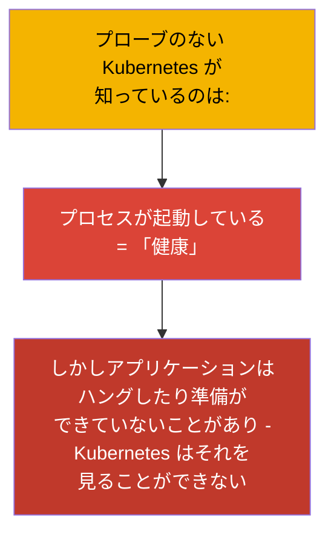
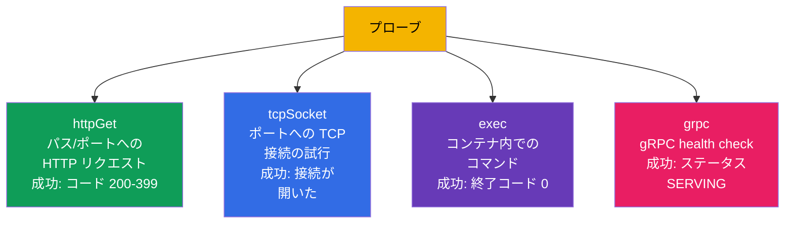
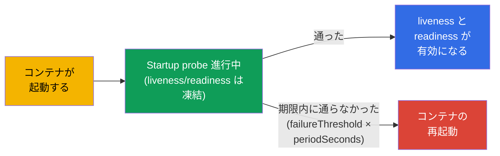
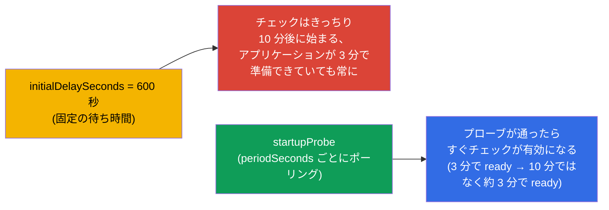
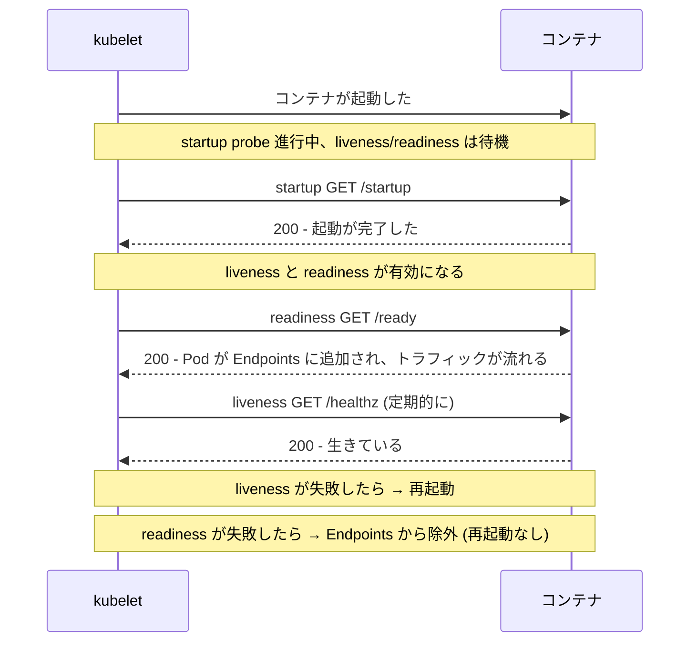
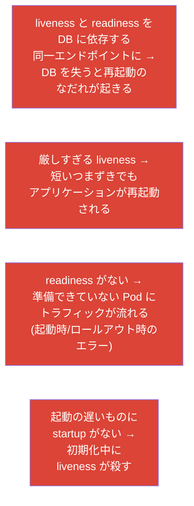

[Русская версия](ru.md) · [Eng version](README.md) · [Versión en español](es.md) · [Version française](fr.md) · [Deutsche Version](de.md) · [ქართული ვერსია](ge.md) · [繁體中文版](tw.md)

# 第 27 章。ヘルスチェック：liveness、readiness、startup probe

> **次は何か。** パート 6 - 可観測性と運用 - を始めます。Kubernetes は、あなたの
> アプリケーションの内部が「健康」かどうかを自分では知りません：コンテナは動いていても、
> アプリケーションはハングしていたり、まだウォームアップが終わっていなかったりします。
> **プローブ (probes)** は、アプリケーションの実際の状態をクラスタに伝える手段です。
> 3 つあります：**liveness**（生きているか）、**readiness**（トラフィックを受ける準備が
> できているか）、**startup**（起動し終わったか）。これは Observability (CKAD) と
> Workloads (CKA) の領域であり、安全なロールアウト（第 8 章）と Service の Endpoints
> （第 7 章）に直接つながっています。

## 27.1. プローブが必要な理由

プローブがないと、Kubernetes は健康状態をおおざっぱに判断します：プロセスが生きている -
ならすべて順調、と。しかしこれはしばしば正しくありません：

- アプリケーションが **ハングした**（deadlock）：プロセスは生きているが、リクエストを処理しない；
- アプリケーションが **まだ起動中**（キャッシュのウォームアップ、DB への接続）なのに、
  すでにトラフィックが流れてきた；
- アプリケーションが **一時的に準備できていない**（依存先との接続が切れた）が、再起動する
  必要はない。



プローブは、アプリケーションが自分の状態を正直にクラスタへ伝える手段を与え、クラスタには -
正しく反応する手段を与えます：再起動する、ロードバランシングから外す、あるいは待つ。

## 27.2. 3 つのプローブとその役割


| プローブ | 問い | 失敗したときに起きること |
|-------|--------|-----------------|
| **liveness** | アプリケーションは生きているか（ハングしていないか）? | コンテナが **再起動される** |
| **readiness** | トラフィックを受ける準備ができているか? | Pod が **Endpoints から外される**（再起動はしない!） |
| **startup** | 起動は終わったか? | 期限内に成功しなければ再起動；成功するまで他のプローブをブロックする |

押さえておくべき決定的な違い：**liveness は再起動で治し、readiness はトラフィックからの
隔離で対処する**。readiness の失敗は Pod を再起動しません。ただそこへリクエストを送るのを
やめるだけです（第 7 章の Endpoints を思い出してください）。

## 27.3. チェックの方式

どのプローブも、いくつかの方式のうち 1 つで健康状態を確認できます：



| 方式 | どうチェックするか | 成功の条件 |
|--------|---------------|-------|
| `httpGet` | パスとポートへの HTTP GET | 応答コード 200-399 |
| `tcpSocket` | ポートへ TCP 接続を開く | 接続が確立した |
| `exec` | コンテナ内でコマンドを実行する | 終了コード 0 |
| `grpc` | gRPC health check | ステータス SERVING |

`httpGet` はウェブアプリケーションでもっとも多用されます；`exec` はファイル/プロセスの
確認に便利です；`tcpSocket` は HTTP を持たないサービス（DB、ブローカー）向け；`grpc` は
health プロトコルを実装した gRPC サービス向けです。

> **gRPC プローブ。** `grpc` 方式は Kubernetes 1.27 で安定版 (GA) になりました
> （1.24 でベータ、デフォルトで有効）。これはアプリケーションの標準的な gRPC health-check を
> 呼び出します；サービスがステータス `SERVING` で応答すればプローブは成功です。例：
>
> ```yaml
>     livenessProbe:
>       grpc:
>         port: 9000
>         service: my.health.Service   # 任意; health-check のサービス名
>       periodSeconds: 10
> ```
>
> `grpc` が登場する前は、gRPC アプリケーションのために別バイナリの `grpc_health_probe` を
> `exec` 経由で使っていました - 今はネイティブに行えます。

## 27.4. プローブのパラメータ

すべてのプローブは、同じタイミング用パラメータで設定します：

```yaml
    livenessProbe:
      httpGet:
        path: /healthz
        port: 8080
      initialDelaySeconds: 10     # 最初のチェックまで待つ
      periodSeconds: 10           # どのくらいの頻度でチェックするか
      timeoutSeconds: 1           # 1 回のチェックのタイムアウト
      failureThreshold: 3         # 連続で何回失敗したらプローブの失敗とするか
      successThreshold: 1         # 何回成功したら再び OK とするか (readiness 用)
```

| パラメータ | 何を決めるか |
|----------|-----------|
| `initialDelaySeconds` | 最初のチェックまでの待ち時間（起動する時間を与える） |
| `periodSeconds` | チェックの間隔 |
| `timeoutSeconds` | 1 回のチェックの応答をどれだけ待つか |
| `failureThreshold` | 連続で何回の失敗を「失敗」とみなすか |
| `successThreshold` | 連続で何回の成功を「復旧」とみなすか |

たとえば `periodSeconds: 10` + `failureThreshold: 3` = 障害が始まってからおよそ 30 秒後に
問題として確定します。

## 27.5. Startup probe：起動の遅いアプリケーションのために

問題：起動の遅いアプリケーション（ウォームアップに 1 分かかる）では、liveness プローブが
立ち上がる前にそれを「殺して」しまうことがあります。以前はこれを大きな
`initialDelaySeconds` で解決していましたが、それは粗いやり方です。**Startup probe** は
これをきれいに解決します：これが通るまで、liveness と readiness は **そもそも動き始めません**。



こうして遅いアプリケーションには起動用の大きな窓 (`failureThreshold × periodSeconds`) を
与えつつ、起動後の liveness は速く「厳しい」間隔で動きます。両方の世界のいいところです。

> **起動時間はばらつく - 最悪のケースで見積もること。** 実際のアプリケーションは決まった
> 時間で起動しません：負荷がかかっているとき、キャッシュが冷えているとき、DB が遅いとき、
> データ量が大きいときには、同じアプリケーションのウォームアップが、たとえば 3 分から 10 分
> までかかることがあります。startup プローブの窓は **上限** で計算する必要があります。
> そうしないと、今回たまたま起動に 10 分かかった Pod は 4 分目に殺され、再起動のループに
> 入ってしまいます。
>
> 窓 = `failureThreshold × periodSeconds`。10 分の余裕を取るなら：
>
> ```yaml
>     startupProbe:
>       httpGet:
>         path: /startup
>         port: 8080
>       periodSeconds: 10        # 10 秒ごとにチェック
>       failureThreshold: 60     # 60 × 10 秒 = 600 秒 = 起動に 10 分
> ```
>
> 大事なのは、この窓が「コストを払う」のは遅いインスタンスだけだということです：startup が
> 通ってしまえば、チェックは liveness/readiness のスケジュールで進みます。だからここでは
> 気前のよい `failureThreshold` を惜しむ必要はありません - それは速く起動する Pod を
> 遅くはせず、今回いつもより長くかかっている Pod を殺さないようにするだけです。

ここで `initialDelaySeconds` による「古い」やり方との違いが見えてきます。あれはチェック前の
**固定の**待ち時間を決めるので、最悪のケース（同じく 10 分）で設定せざるを得ません。しかも
その値は **常に** 効いてしまいます：3 分で起動した Pod も、チェックされて Endpoints に
追加されるまで 10 分待たされる - 本来より 7 分遅れてトラフィックを受け取ることになります。

Startup プローブはふるまいが違います：アプリケーションを **能動的にポーリング** し
(`periodSeconds` ごと)、チェックが通った **その時点で** Pod を稼働モードへ切り替えます。
速いインスタンスは 3 分で ready になり、遅いものは自分の 10 分をきっちり使い、誰も
「念のため」待つことはありません。



実務的な結論：`initialDelaySeconds` は速い Pod を ready 遅延で罰し（そしてロールアウトと
オートスケーリングを遅くし）、startup プローブは本当に必要な Pod にだけ大きな窓を与えます。

## 27.6. プローブはどう連携するか

3 つのプローブがある Pod の一生を、全体像として組み立てます：



重要：**プローブを担当するのは kubelet**（第 2 章）であり、API サーバーではありません。
ノード上の kubelet が自分の Pod のチェックを自ら実行し、判断（再起動/隔離）を下します。

## 27.7. プローブ設定でよくある間違い

プローブは害になる設定も簡単にできてしまいます。古典的な間違い：



| 間違い | 結果 | 正しいやり方 |
|--------|-------------|---------------|
| liveness を外部の DB に結びつける | DB を失う → 再起動のなだれ | liveness はプロセス自身だけを確認し、依存先は見ない |
| readiness がない | 準備できていない Pod へのトラフィック、ロールアウト時のエラー | 依存先を確認する readiness を追加する |
| liveness と readiness が同じ | 「死んでいる」と「一時的に準備できていない」を区別できない | エンドポイントとロジックを分ける |
| 起動の遅いアプリケーションに startup がない | 起動時に liveness が殺す | startup probe を追加する |

いちばんの原則：**liveness は「プロセスが生きているか」だけを確認すべき**（速い内部チェック）、
そして **readiness は「サービス提供の準備ができているか」**（依存先の確認を含んでよい）。
この 2 つを混ぜることが、連鎖的な再起動のよくある原因です。

## 27.8. 本番環境でこれをどう使うか

- **安全なロールアウトにプローブは必須。** Rolling update（第 8 章）が本当に安全なのは、
  正しい readiness があるときだけです：それがないと Kubernetes は Pod をすぐに ready と
  みなし、ウォームアップの済んでいないアプリケーションへトラフィックを流し、リリースごとに
  エラーを出します。
- **liveness と readiness の分離。** 本番ではこれらは別のエンドポイントです：`/healthz`
  （生存確認、外部依存なし）と `/ready`（準備確認、DB/キャッシュのチェック付き）。これにより
  依存先が落ちたときの再起動のなだれを防げます - Pod は単にロードバランシングから抜けるだけで、
  循環的に再起動を始めたりしません。
- **重いアプリケーションには startup。** JVM のサービス、キャッシュのウォームアップを伴う
  アプリケーションには広い窓の startup probe を付けます - そうしないと liveness が起動時に
  それらを殺します。これで巨大な `initialDelaySeconds` は不要になります。
- **プローブ + graceful shutdown。** `terminationGracePeriodSeconds` と SIGTERM の処理と
  組み合わせることで、プローブは損失のないロールアウトを実現します：Pod はまず Endpoints から
  抜け（readiness）、進行中のリクエストを処理し終えてから、はじめて終了します。
- **丁寧なタイミング設定。** 攻撃的すぎるプローブ（小さい period/timeout）は誤検知と余分な
  再起動を負荷時に生みます；アプリケーションの実際のふるまいに合わせて調整します。

## 27.9. ミニ用語集

- **プローブ (probe)** - kubelet が実行するコンテナのヘルスチェック。
- **liveness** - コンテナが生きているか；失敗 → 再起動。
- **readiness** - トラフィックを受ける準備ができているか；失敗 → Endpoints からの除外（再起動なし）。
- **startup** - 起動が完了したか；通るまで他のプローブをブロックする。
- **httpGet / tcpSocket / exec / grpc** - チェックの方式。
- **initialDelaySeconds** - 最初のチェックまでの遅延。
- **periodSeconds** - チェックの間隔。
- **failureThreshold / successThreshold** - 状態を切り替えるための失敗/成功の回数。

## 27.10. 本章のまとめ

- プローブは、そうでなければ見えないアプリケーションの実際の状態をクラスタに伝えます
  （「プロセスが生きている」≠「アプリケーションが健康」）。
- liveness → 失敗時に再起動；readiness → Endpoints からの除外（再起動なし）；
  startup → アプリケーションが起動している間 liveness/readiness をブロック。
- チェックの方式：httpGet（ウェブ）、tcpSocket（HTTP を持たないサービス）、exec（コマンド）、grpc。
- タイミングは initialDelaySeconds、periodSeconds、timeoutSeconds、
  failureThreshold/successThreshold で決めます。
- startup probe は、大きな initialDelaySeconds の代わりに、起動が遅い場合の正しい解です。
- プローブを担当するのは kubelet で、API サーバーではありません。
- 主な間違い：liveness を外部依存に結びつける（再起動のなだれ）、readiness がない
  （準備できていない Pod へのトラフィック）、liveness/readiness が同じ。

## 27.11. これがどう役に立つか：試験と実際の仕事で

**試験では。** 「httpGet/exec とタイミングを指定して liveness/readiness/startup プローブを
追加せよ」はとても頻出の問題です（CKAD の Observability、CKA の Workloads）。プローブの
ブロックを自信をもって書けること、そして liveness は再起動し readiness はトラフィックから
外すと理解していることが必要です。readiness ↔ Endpoints ↔ 安全なロールアウトのつながりは
全体を貫くテーマです。

**実際の仕事では。** プローブは自己修復とダウンタイムなしのロールアウトの土台です。
liveness/readiness を正しく分けることで、依存先の障害時の連鎖的な再起動を防げますし、
startup は起動の遅いサービスを救います。誤って設定されたプローブは、本番での不安定さと
誤った再起動のよくある原因です。

## 27.12. 自己チェックの質問

1. なぜ「プロセスが起動している」は「アプリケーションが健康」を意味しないのですか？
2. liveness の失敗への反応は、readiness の失敗への反応とどう違いますか？
3. readiness プローブと Service の Endpoints はどう関係していますか？
4. startup probe は何のために必要で、大きな initialDelaySeconds よりどこが優れていますか？
5. どんなチェックの方式があり、どれがどんなときに適していますか？
6. なぜ liveness を外部 DB の可用性に結びつけてはいけないのですか？
7. プローブを実行するのは API サーバーですか、それとも kubelet ですか？

## 演習

私たちはクラスタにアプリケーションの健康状態を理解させました。第 28 章では - 私たち自身が
クラスタをどう観察するか：ログ、metrics-server、`kubectl top`。プローブは可観測性のラボで
練習します（プローブの失敗をエミュレートできる `ping_pong` イメージ上でも）。

🧪 ラボ 109 (liveness、readiness、startup プローブ): [tasks/cka/labs/109](../../labs/109/README_JP.MD)

---
[目次](../README_JP.md) · [第 26 章](../26/jp.md) · [第 28 章](../28/jp.md)
