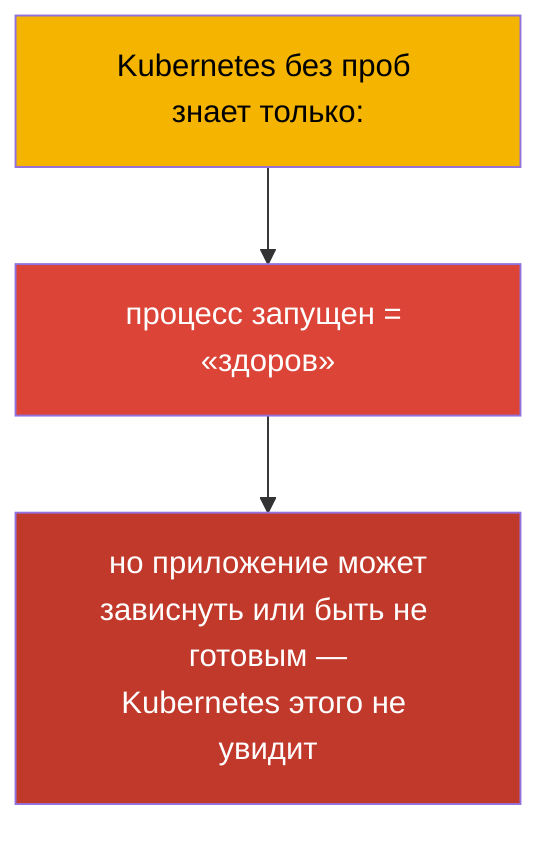
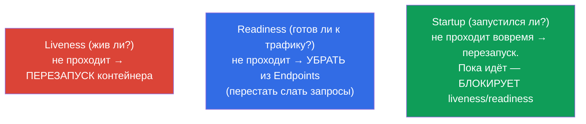
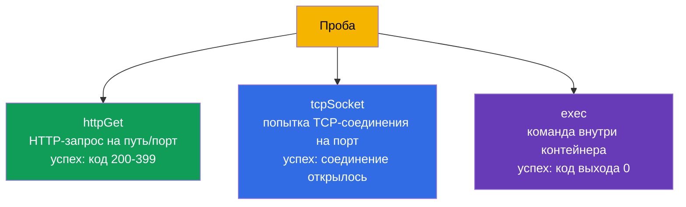
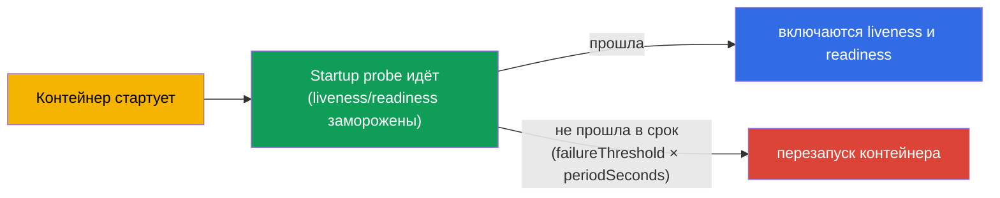
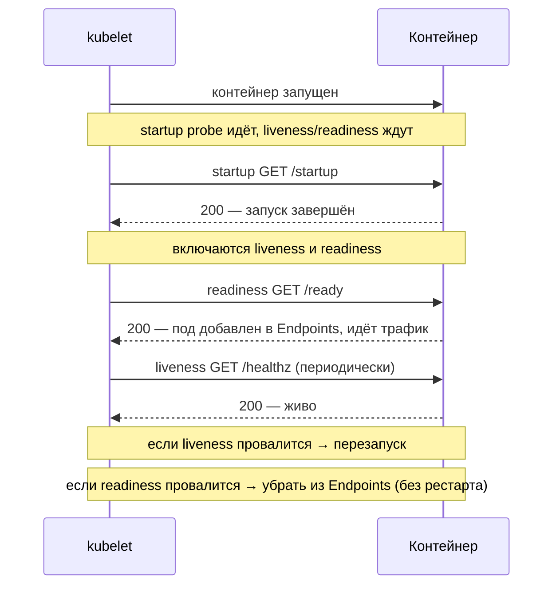
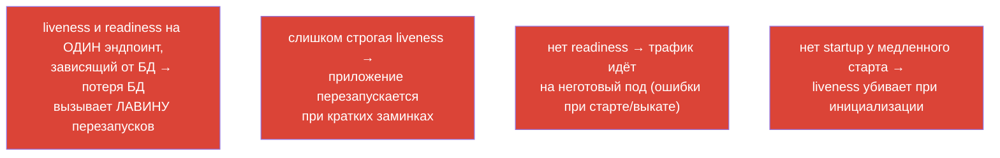

# Глава 27. Проверки состояния: liveness, readiness и startup probes

> **Что дальше.** Начинаем часть 6 - наблюдаемость и обслуживание. Kubernetes сам не знает,
> «здорово» ли ваше приложение внутри: контейнер работает, а приложение может зависнуть
> или ещё не прогреться. **Пробы (probes)** - способ сообщить кластеру о реальном
> состоянии приложения. Их три: **liveness** (жив ли), **readiness** (готов ли принимать
> трафик), **startup** (запустился ли). Это домен Observability (CKAD) и Workloads (CKA),
> и напрямую связано с безопасными выкатами (глава 8) и Endpoints сервисов (глава 7).

## 27.1. Зачем нужны пробы

Без проб Kubernetes судит о здоровье грубо: процесс жив - значит всё хорошо. Но это часто
неверно:

- приложение **зависло** (deadlock), процесс жив, но запросы не обрабатывает;
- приложение **ещё стартует** (прогрев кеша, коннект к БД), но трафик на него уже пошёл;
- приложение **временно не готово** (потеряло связь с зависимостью), но перезапускать его
  не нужно.



Пробы дают приложению способ честно сказать кластеру о своём состоянии, а кластеру -
правильно среагировать: перезапустить, убрать из балансировки или подождать.

## 27.2. Три пробы и их назначение



| Проба | Вопрос | Что при провале |
|-------|--------|-----------------|
| **liveness** | приложение живо (не зависло)? | контейнер **перезапускается** |
| **readiness** | готово принимать трафик? | под **убирается из Endpoints** (не рестартует!) |
| **startup** | завершило ли запуск? | при невыполнении в срок - перезапуск; блокирует остальные пробы до успеха |

Ключевое различие, которое надо усвоить: **liveness лечит перезапуском, readiness -
изоляцией от трафика**. Провал readiness НЕ перезапускает под, он лишь перестаёт слать на
него запросы (вспомните Endpoints из главы 7).

## 27.3. Три способа проверки

Каждая проба может проверять здоровье одним из трёх способов:



| Способ | Как проверяет | Успех |
|--------|---------------|-------|
| `httpGet` | HTTP GET на путь и порт | код ответа 200-399 |
| `tcpSocket` | открыть TCP-соединение на порт | соединение установлено |
| `exec` | выполнить команду в контейнере | код выхода 0 |
| `grpc` | gRPC health check | статус SERVING |

`httpGet` - самый частый для веб-приложений; `exec` удобен для проверки файлов/процессов;
`tcpSocket` - для сервисов без HTTP (БД, брокеры).

## 27.4. Параметры проб

Все пробы настраиваются одними и теми же параметрами тайминга:

```yaml
    livenessProbe:
      httpGet:
        path: /healthz
        port: 8080
      initialDelaySeconds: 10     # ждать перед первой проверкой
      periodSeconds: 10           # как часто проверять
      timeoutSeconds: 1           # таймаут одной проверки
      failureThreshold: 3         # сколько провалов подряд = провал пробы
      successThreshold: 1         # сколько успехов = снова OK (для readiness)
```

| Параметр | Что задаёт |
|----------|-----------|
| `initialDelaySeconds` | пауза перед первой проверкой (даёт время стартовать) |
| `periodSeconds` | интервал между проверками |
| `timeoutSeconds` | сколько ждать ответа на одну проверку |
| `failureThreshold` | сколько неудач подряд считать провалом |
| `successThreshold` | сколько успехов подряд считать восстановлением |

Например, `periodSeconds: 10` + `failureThreshold: 3` = проблема фиксируется примерно
через 30 секунд отказов.

## 27.5. Startup probe: для медленно стартующих приложений

Проблема: у медленно стартующего приложения (прогрев занимает минуту) liveness-проба
может «убить» его до того, как оно поднимется. Раньше это решали большим
`initialDelaySeconds`, но это грубо. **Startup probe** решает изящно: пока она не пройдёт,
liveness и readiness **не запускаются вообще**.



Так медленному приложению дают большое окно на запуск (`failureThreshold × periodSeconds`),
но после старта liveness работает с быстрыми, «строгими» интервалами. Лучшее из двух миров.

## 27.6. Как пробы взаимодействуют

Собираем полную картину жизни пода с тремя пробами:



Важно: **за пробы отвечает kubelet** (глава 2), а не API-сервер. kubelet на ноде сам
выполняет проверки своих подов и принимает решения (перезапуск/изоляция).

## 27.7. Типичные ошибки при настройке проб

Пробы легко настроить во вред. Классические ошибки:



| Ошибка | Последствие | Как правильно |
|--------|-------------|---------------|
| liveness завязана на внешнюю БД | потеря БД → лавина перезапусков | liveness проверяет только сам процесс, не зависимости |
| нет readiness | трафик на неготовый под, ошибки при выкате | добавить readiness с проверкой зависимостей |
| одинаковые liveness и readiness | нельзя отличить «мертво» от «временно не готово» | разные эндпоинты и логика |
| нет startup у медленного приложения | liveness убивает при старте | добавить startup probe |

Главное правило: **liveness должна проверять только «жив ли процесс»** (быстрая
внутренняя проверка), а **readiness - «готов ли обслуживать»** (может включать проверку
зависимостей). Смешивать их - частая причина каскадных перезапусков.

## 27.8. Как это применяют в продакшене

- **Пробы обязательны для безопасных выкатов.** Rolling update (глава 8) по-настоящему
  безопасен только с корректной readiness: без неё Kubernetes считает под готовым сразу и
  уводит трафик на непрогретое приложение, давая ошибки при каждом релизе.
- **Разделение liveness и readiness.** В проде это разные эндпоинты: `/healthz` (живость,
  без внешних зависимостей) и `/ready` (готовность, с проверкой БД/кешей). Это
  предотвращает лавину рестартов при падении зависимости - под просто выйдет из
  балансировки, а не начнёт циклически перезапускаться.
- **Startup для тяжёлых приложений.** JVM-сервисы, приложения с прогревом кеша получают
  startup probe с широким окном - иначе liveness убивает их на старте. Это снимает
  необходимость в огромном `initialDelaySeconds`.
- **Пробы + graceful shutdown.** В связке с `terminationGracePeriodSeconds` и обработкой
  SIGTERM пробы обеспечивают выкат без потерь: под сначала выходит из Endpoints
  (readiness), дорабатывает текущие запросы и лишь потом завершается.
- **Аккуратный тайминг.** Слишком агрессивные пробы (маленькие period/timeout) создают
  ложные срабатывания и лишние рестарты под нагрузкой; их калибруют по реальному поведению
  приложения.

## 27.9. Мини-глоссарий

- **Проба (probe)** - проверка здоровья контейнера, выполняемая kubelet.
- **liveness** - жив ли контейнер; провал → перезапуск.
- **readiness** - готов ли к трафику; провал → удаление из Endpoints (без рестарта).
- **startup** - завершён ли запуск; блокирует остальные пробы, пока не пройдёт.
- **httpGet / tcpSocket / exec / grpc** - способы проверки.
- **initialDelaySeconds** - задержка перед первой проверкой.
- **periodSeconds** - интервал проверок.
- **failureThreshold / successThreshold** - число провалов/успехов для смены состояния.

## 27.10. Итоги главы

- Пробы сообщают кластеру о реальном состоянии приложения, которое иначе не видно
  («процесс жив» ≠ «приложение здорово»).
- liveness → перезапуск при провале; readiness → удаление из Endpoints (без рестарта);
  startup → блокирует liveness/readiness, пока приложение стартует.
- Способы проверки: httpGet (веб), tcpSocket (сервисы без HTTP), exec (команда), grpc.
- Тайминг задают initialDelaySeconds, periodSeconds, timeoutSeconds,
  failureThreshold/successThreshold.
- startup probe - правильное решение для медленного старта вместо большого
  initialDelaySeconds.
- За пробы отвечает kubelet, не API-сервер.
- Главные ошибки: liveness на внешние зависимости (лавина рестартов), отсутствие
  readiness (трафик на неготовый под), одинаковые liveness/readiness.

## 27.11. Как это пригодится: на экзамене и в реальной работе

**На экзамене.** «Добавь liveness/readiness/startup пробу с httpGet/exec и таймингом» -
очень частые задания (Observability CKAD, Workloads CKA). Нужно уверенно писать блоки проб
и понимать, что liveness рестартует, а readiness убирает из трафика. Связь readiness ↔
Endpoints ↔ безопасный выкат - сквозная тема.

**В реальной работе.** Пробы - основа самовосстановления и выкатов без простоя.
Правильное разделение liveness/readiness предотвращает каскадные перезапуски при сбоях
зависимостей, а startup спасает медленно стартующие сервисы. Неверно настроенные пробы -
частая причина нестабильности и ложных рестартов в проде.

## 27.12. Вопросы для самопроверки

1. Почему «процесс запущен» не значит «приложение здорово»?
2. Чем реакция на провал liveness отличается от реакции на провал readiness?
3. Как связаны readiness-проба и Endpoints сервиса?
4. Для чего нужна startup probe и чем она лучше большого initialDelaySeconds?
5. Какие есть способы проверки и когда какой уместен?
6. Почему нельзя завязывать liveness на доступность внешней БД?
7. Кто выполняет пробы - API-сервер или kubelet?

## Практика

Мы научили кластер понимать здоровье приложения. В главе 28 - как мы сами наблюдаем за
кластером: логи, metrics-server и `kubectl top`. Пробы отрабатываются в лабах по
наблюдаемости (в т.ч. на образе `ping_pong`, умеющем эмулировать провал проб).

🧪 Лаба 109 (liveness, readiness, startup пробы): [tasks/cka/labs/109](../../labs/109/README_RU.MD)

---
[Оглавление](../README_RU.md) · [Глава 26](../26/ru.md) · [Глава 28](../28/ru.md)
