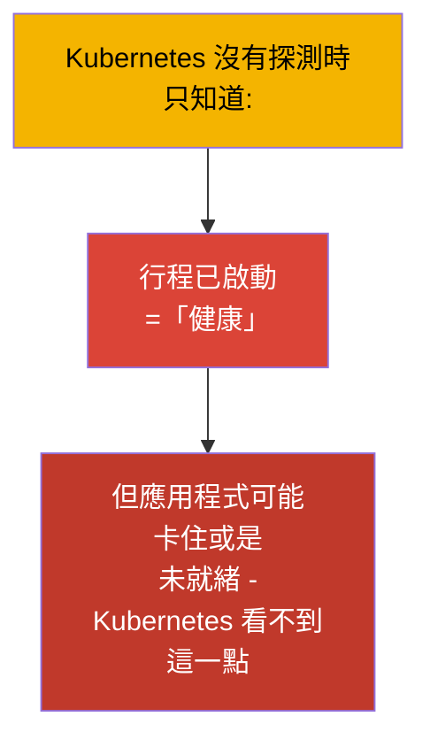
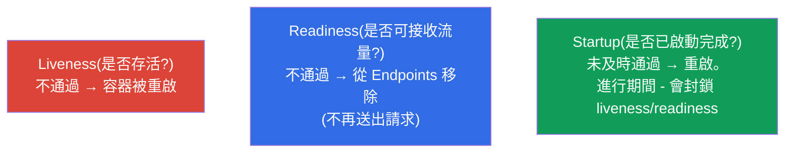
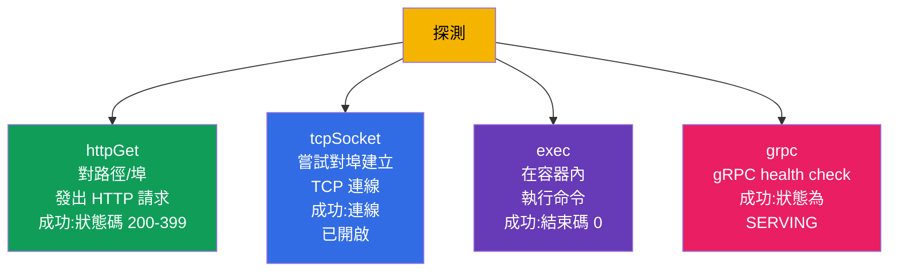
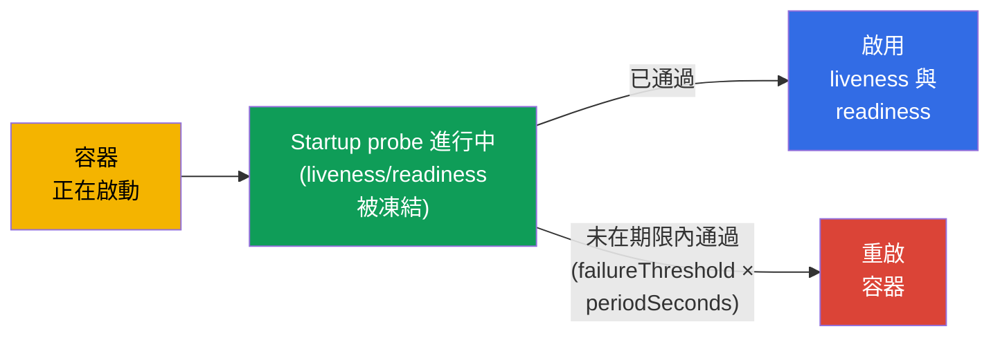
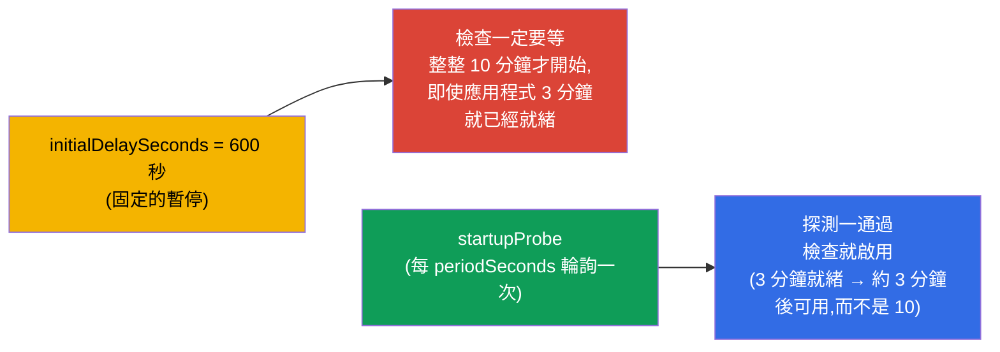
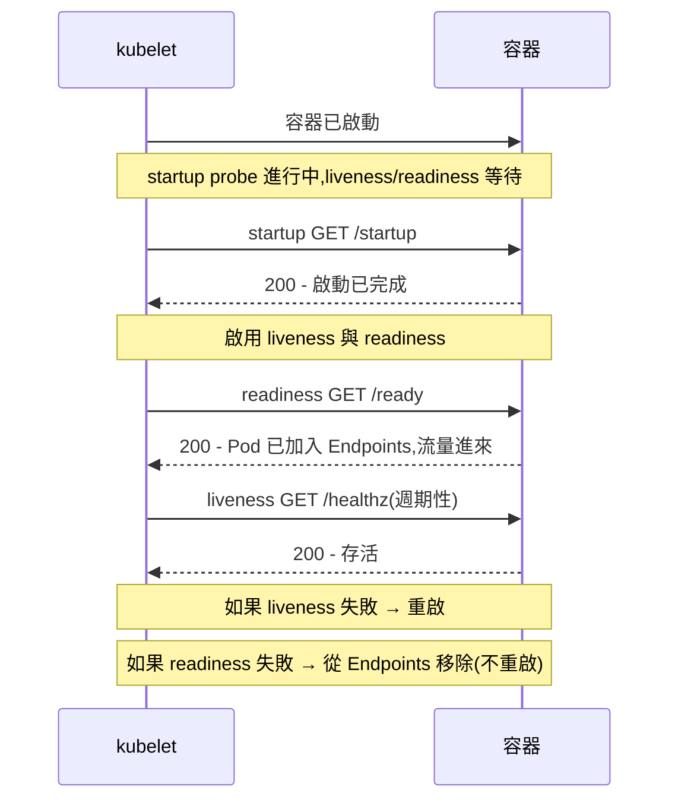
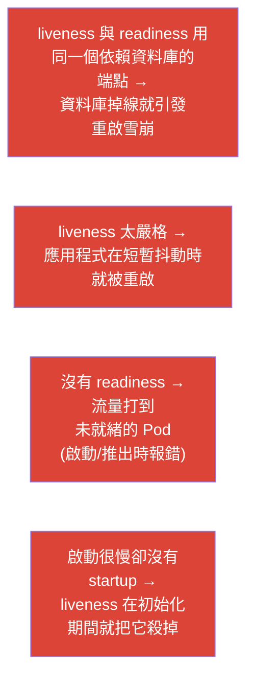

[Русская версия](ru.md) · [Eng version](README.md) · [Versión en español](es.md) · [Version française](fr.md) · [Deutsche Version](de.md) · [ქართული ვერსია](ge.md) · [日本語版](jp.md)

# 第 27 章。健康檢查:liveness、readiness 與 startup 探測

> **接下來是什麼。** 我們開始第 6 部分 - 可觀測性與維運。Kubernetes 自己並不知道你的
> 應用程式內部是否「健康」:容器在跑,但應用程式可能已經卡住,或是還沒暖機完成。
> **探測 (probes)** 就是把應用程式的真實狀態告訴叢集的方式。它們有三種:
> **liveness**(是否存活)、**readiness**(是否可以接收流量)、**startup**(是否已啟動完成)。
> 這屬於 Observability (CKAD) 與 Workloads (CKA) 領域,並且與安全推出(第 8 章)
> 以及 Service 的 Endpoints(第 7 章)直接相關。

## 27.1. 為什麼需要探測

沒有探測時,Kubernetes 對健康的判斷很粗糙:行程活著 - 就代表一切正常。但這往往
是錯的:

- 應用程式**卡住了**(deadlock),行程活著,卻不處理請求;
- 應用程式**還在啟動**(暖快取、連資料庫),流量卻已經打進來了;
- 應用程式**暫時未就緒**(與某個依賴失去連線),但並不需要重啟它。



探測讓應用程式有辦法誠實地把自己的狀態告訴叢集,也讓叢集能做出正確反應:重啟、
從負載平衡中移除,或是再等一下。

## 27.2. 三種探測與它們的用途



| 探測 | 問題 | 失敗時會發生什麼 |
|-------|--------|-----------------|
| **liveness** | 應用程式是否存活(沒有卡住)? | 容器會**被重啟** |
| **readiness** | 是否可以接收流量? | Pod **會被從 Endpoints 移除**(不會重啟!) |
| **startup** | 啟動是否已完成? | 未在期限內完成 - 重啟;在成功之前會封鎖其他探測 |

必須牢牢掌握的關鍵區別:**liveness 用重啟來治療,readiness 用隔離流量來處理**。
readiness 失敗**不會**重啟 Pod,只是不再把請求送到它上面(回想第 7 章的 Endpoints)。

## 27.3. 檢查方式

每一種探測都可以用下面幾種方式之一來檢查健康:



| 方式 | 如何檢查 | 成功條件 |
|--------|---------------|-------|
| `httpGet` | 對路徑與埠發 HTTP GET | 回應碼 200-399 |
| `tcpSocket` | 對埠開啟 TCP 連線 | 連線已建立 |
| `exec` | 在容器中執行命令 | 結束碼 0 |
| `grpc` | gRPC health check | 狀態為 SERVING |

`httpGet` 是網頁應用程式最常見的選擇;`exec` 方便用來檢查檔案/行程;
`tcpSocket` 適合沒有 HTTP 的服務(資料庫、訊息 broker);`grpc` 適合已實作
health 協定的 gRPC 服務。

> **gRPC 探測。** `grpc` 方式從 Kubernetes 1.27 起穩定 (GA)(1.24 進入 beta,預設
> 啟用)。它會呼叫應用程式標準的 gRPC health-check;只要服務回應狀態 `SERVING`,
> 探測就算成功。範例:
>
> ```yaml
>     livenessProbe:
>       grpc:
>         port: 9000
>         service: my.health.Service   # 可選;health-check 的服務名稱
>       periodSeconds: 10
> ```
>
> 在 `grpc` 出現之前,gRPC 應用程式要透過 `exec` 使用額外的
> `grpc_health_probe` 執行檔 - 現在這件事原生就能做到。

## 27.4. 探測的參數

所有探測都用同一組計時參數來設定:

```yaml
    livenessProbe:
      httpGet:
        path: /healthz
        port: 8080
      initialDelaySeconds: 10     # 第一次檢查前先等待
      periodSeconds: 10           # 多久檢查一次
      timeoutSeconds: 1           # 單次檢查的逾時
      failureThreshold: 3         # 連續失敗幾次 = 探測失敗
      successThreshold: 1         # 成功幾次 = 恢復 OK(用於 readiness)
```

| 參數 | 設定什麼 |
|----------|-----------|
| `initialDelaySeconds` | 第一次檢查前的暫停(給啟動時間) |
| `periodSeconds` | 兩次檢查之間的間隔 |
| `timeoutSeconds` | 單次檢查要等回應多久 |
| `failureThreshold` | 連續失敗幾次算是失敗 |
| `successThreshold` | 連續成功幾次算是恢復 |

例如 `periodSeconds: 10` + `failureThreshold: 3` = 大約在失敗持續 30 秒後才會
認定有問題。

## 27.5. Startup probe:給啟動緩慢的應用程式

問題在於:對於啟動很慢的應用程式(暖機要花一分鐘),liveness 探測可能在它還沒
起來之前就「殺掉」它。以前的做法是把 `initialDelaySeconds` 設得很大,但那很粗糙。
**Startup probe** 解得更漂亮:在它通過之前,liveness 與 readiness **完全不會啟動**。



這樣一來,慢的應用程式能拿到一個很大的啟動視窗 (`failureThreshold × periodSeconds`),
但啟動完成之後,liveness 就用快速、「嚴格」的間隔運作。兩個世界的優點兼得。

> **啟動時間會浮動 - 請按最壞情況計算。** 真實的應用程式不會在固定時間內啟動完成:
> 在高負載、快取是冷的、資料庫很慢或資料量很大的情況下,同一個應用程式的暖機
> 可能要花上,比方說 3 到 10 分鐘。startup 探測的視窗必須按**上界**來估算,
> 否則這一次剛好要花 10 分鐘啟動的 Pod,會在第 4 分鐘被殺掉,然後陷入
> 重啟循環。
>
> 視窗 = `failureThreshold × periodSeconds`。要留 10 分鐘的餘裕:
>
> ```yaml
>     startupProbe:
>       httpGet:
>         path: /startup
>         port: 8080
>       periodSeconds: 10        # 每 10 秒檢查一次
>       failureThreshold: 60     # 60 × 10 秒 = 600 秒 = 10 分鐘的啟動時間
> ```
>
> 重要的是,這個視窗只對慢的實例「有代價」:startup 一旦通過,檢查就按
> liveness/readiness 的排程進行。所以在這裡不必吝惜,可以給一個寬鬆的
> `failureThreshold` - 它不會拖慢快速啟動的 Pod,只是不讓那些這次比平常
> 起得更久的 Pod 被殺掉。

到這裡就能看出它和透過 `initialDelaySeconds` 的「舊」做法的差別。它設定的是
**固定的**檢查前暫停,因此必須按最壞情況來設(同樣是 10 分鐘)。但這個值**每次都會**
生效:一個 3 分鐘就啟動好的 Pod,仍然要乾等 10 分鐘,才會開始被檢查並加入
Endpoints - 它拿到流量的時間比原本可以的晚了 7 分鐘。

Startup 探測的行為不一樣:它會**主動輪詢**應用程式(每 `periodSeconds` 一次),
並且在檢查一通過時**立刻**把 Pod 切換到工作模式。快的實例 3 分鐘就變成就緒,
慢的則用完它那 10 分鐘,沒有人要為「以防萬一」而等待。



實務結論:`initialDelaySeconds` 會用就緒延遲來懲罰快速的 Pod(也讓推出與自動擴縮
變慢),而 startup 探測只把大視窗給真正需要它的那些 Pod。

## 27.6. 探測之間如何互動

我們把有三種探測的 Pod 生命全貌拼起來:



重要:**探測由 kubelet 負責**(第 2 章),不是 API server。節點上的 kubelet 自己
對它的 Pod 執行檢查並做出決定(重啟/隔離)。

## 27.7. 設定探測時的典型錯誤

探測很容易設成幫倒忙。經典錯誤:



| 錯誤 | 後果 | 正確做法 |
|--------|-------------|---------------|
| liveness 綁在外部資料庫上 | 資料庫掉線 → 重啟雪崩 | liveness 只檢查行程本身,不檢查依賴 |
| 沒有 readiness | 流量打到未就緒的 Pod,推出時報錯 | 加上會檢查依賴的 readiness |
| liveness 與 readiness 一模一樣 | 無法區分「已死」和「暫時未就緒」 | 用不同的端點與邏輯 |
| 啟動慢的應用程式沒有 startup | liveness 在啟動時把它殺掉 | 加上 startup probe |

最重要的規則:**liveness 只該檢查「行程是否存活」**(快速的內部檢查),而
**readiness 檢查「是否能提供服務」**(可以包含依賴檢查)。把兩者混在一起,是
連鎖重啟的常見原因。

## 27.8. 生產環境中如何運用

- **安全推出必須要有探測。** Rolling update(第 8 章)只有搭配正確的 readiness 才
  真正安全:少了它,Kubernetes 會認為 Pod 立刻就緒,把流量導到還沒暖機的應用程式,
  於是每次發布都出錯。
- **把 liveness 與 readiness 分開。** 在生產環境中它們是不同的端點:`/healthz`
  (存活性,不含外部依賴)與 `/ready`(就緒性,含資料庫/快取檢查)。這能在依賴
  掛掉時避免重啟雪崩 - Pod 只會離開負載平衡,而不是開始不斷重啟。
- **重量級應用程式用 startup。** JVM 服務、需要暖快取的應用程式會拿到視窗很寬的
  startup probe - 否則 liveness 會在啟動時殺掉它們。這也免除了設定巨大
  `initialDelaySeconds` 的需要。
- **探測 + graceful shutdown。** 搭配 `terminationGracePeriodSeconds` 與處理
  SIGTERM,探測能讓推出不掉請求:Pod 先離開 Endpoints(readiness),把手上的請求
  處理完,然後才結束。
- **謹慎的計時。** 過於激進的探測(period/timeout 太小)會在高負載下造成誤判與
  多餘的重啟;要按應用程式的實際行為來校準。

## 27.9. 小詞彙表

- **探測 (probe)** - 由 kubelet 執行的容器健康檢查。
- **liveness** - 容器是否存活;失敗 → 重啟。
- **readiness** - 是否可以接收流量;失敗 → 從 Endpoints 移除(不重啟)。
- **startup** - 啟動是否已完成;在通過之前會封鎖其他探測。
- **httpGet / tcpSocket / exec / grpc** - 檢查方式。
- **initialDelaySeconds** - 第一次檢查前的延遲。
- **periodSeconds** - 檢查的間隔。
- **failureThreshold / successThreshold** - 改變狀態所需的失敗/成功次數。

## 27.10. 本章總結

- 探測把應用程式的真實狀態告訴叢集,否則這個狀態是看不到的
  (「行程活著」≠「應用程式健康」)。
- liveness → 失敗時重啟;readiness → 從 Endpoints 移除(不重啟);
  startup → 在應用程式啟動期間封鎖 liveness/readiness。
- 檢查方式:httpGet(網頁)、tcpSocket(沒有 HTTP 的服務)、exec(命令)、grpc。
- 計時由 initialDelaySeconds、periodSeconds、timeoutSeconds、
  failureThreshold/successThreshold 決定。
- 對啟動緩慢的情況,startup probe 才是正確解法,而不是很大的
  initialDelaySeconds。
- 探測由 kubelet 負責,不是 API server。
- 主要錯誤:liveness 綁外部依賴(重啟雪崩)、沒有 readiness(流量打到未就緒的
  Pod)、liveness/readiness 一模一樣。

## 27.11. 這在哪裡有用:考試與實際工作

**在考試中。**「用 httpGet/exec 加上計時,補上 liveness/readiness/startup 探測」-
是非常常見的題目(Observability CKAD、Workloads CKA)。你要能有把握地寫出探測區塊,
並理解 liveness 會重啟,而 readiness 會把 Pod 從流量中移除。readiness ↔
Endpoints ↔ 安全推出這條關聯是貫穿全課程的主題。

**在實際工作中。** 探測是自我修復與零停機推出的基礎。正確地區分
liveness/readiness 能在依賴故障時避免連鎖重啟,而 startup 則救了啟動緩慢的服務。
設定錯誤的探測是生產環境不穩定與誤重啟的常見原因。

## 27.12. 自我檢查問題

1. 為什麼「行程已啟動」不等於「應用程式健康」?
2. 對 liveness 失敗的反應和對 readiness 失敗的反應有什麼不同?
3. readiness 探測和 Service 的 Endpoints 有什麼關聯?
4. startup probe 是做什麼用的,它比很大的 initialDelaySeconds 好在哪裡?
5. 有哪些檢查方式,各自在什麼時候適合?
6. 為什麼不能把 liveness 綁在外部資料庫的可用性上?
7. 執行探測的是誰 - API server 還是 kubelet?

## 實踐

我們教會了叢集理解應用程式的健康狀況。第 28 章講我們自己如何觀察叢集:日誌、
metrics-server 與 `kubectl top`。探測會在可觀測性相關的實驗中操練(其中也包括
能模擬探測失敗的 `ping_pong` 映像)。

🧪 實驗 109(liveness、readiness、startup 探測):[tasks/cka/labs/109](../../labs/109/README_TW.MD)

---
[目錄](../README_TW.md) · [第 26 章](../26/tw.md) · [第 28 章](../28/tw.md)
