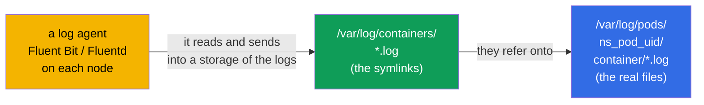
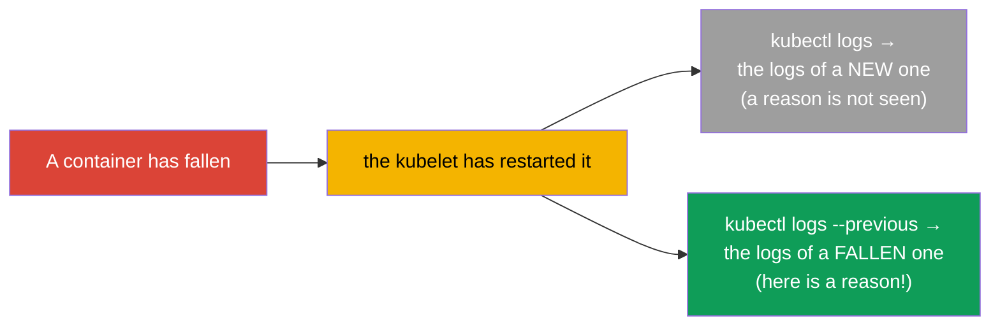
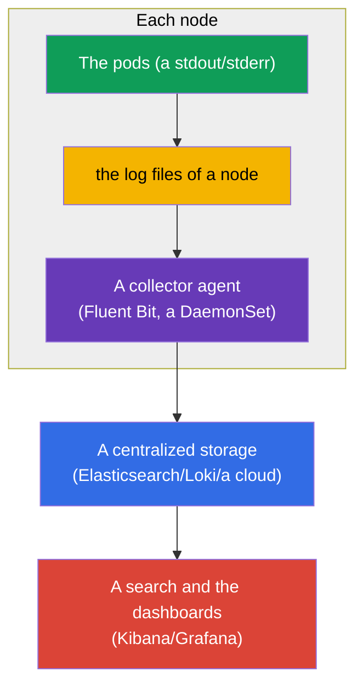
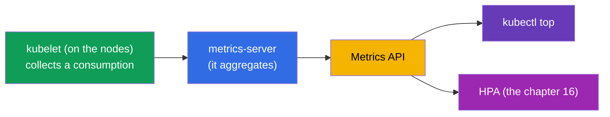
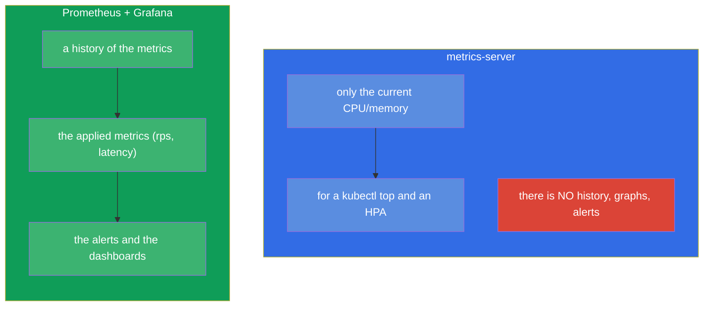
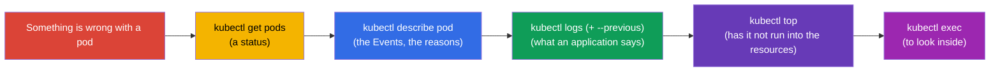

[Русская версия](ru.md) · [Versión en español](es.md) · [Version française](fr.md) · [Deutsche Version](de.md) · [ქართული ვერსია](ge.md)

# Chapter 28. A logging and a monitoring: the logs, the metrics-server, a kubectl top

> **What comes next.** The probes (the chapter 27) inform the cluster about a health. And how do **you** watch,
> what happens? Through the logs (a `kubectl logs`) and the metrics (a `kubectl top` on a basis of the
> metrics-server). This is the domain Observability (CKAD) and Troubleshooting/Monitoring (CKA).
> The theme is simple by the commands, but a critical one: 90% of a debugging on the exam and in a life begins with
> "to look at the logs" and "to look at a consumption". At the same time we will understand an architecture of a logging and
> a place of the Prometheus in a general picture.

## 28.1. The logs of the containers: the basics

Kubernetes collects that, which a container writes into a **stdout/stderr**. This is a fundamental
principle: an application in a container has to log into a standard output, and not into the files -
then a `kubectl logs` and the systems of a collection of the logs will see them.


The main commands of the logs:

```bash
kubectl logs <pod>                    # the logs of a pod (of a one-container one)
kubectl logs <pod> -c <container>     # a concrete container of a multi-container pod
kubectl logs <pod> -f                 # to watch in a real time (follow)
kubectl logs <pod> --previous         # the logs of a PREVIOUS (of a fallen) container
kubectl logs <pod> --tail=100         # the last 100 lines
kubectl logs <pod> --since=1h         # for the last hour
kubectl logs -l app=web --prefix      # the logs of all the pods by a label, with a prefix of a source
```

Where these files physically are on a node. A runtime writes the real files into
`/var/log/pods/<namespace>_<pod>_<uid>/<container>/*.log`, and alongside a catalogue
`/var/log/containers/` contains the **symlinks** onto them with the convenient names. It is exactly this pair, which
the log agents (Fluent Bit, Fluentd, Promtail) usually read, when they collect the logs from all the nodes:



From here an important consequence follows: a `kubectl logs` reads a file of the **current** container on a node, and upon
a deletion of a pod or upon a rotation of a file these logs disappear. A long-term storage is provided
exactly by an external agent, which sends the logs into a centralized storage (the chapter about the
Prometheus/the stack of a logging is below).

### How long the logs live on a node and how to configure this

A term of a life of a log on a node is set **not by a time, but by a size**: a rotation is managed by the
**kubelet**, and not by an application. When a current file grows up to a limit size, it
is rotated, and the most old rotated files are deleted. The values by default:

- `containerLogMaxSize` - **10Mi** (a size of a file, upon which a rotation happens);
- `containerLogMaxFiles` - **5** (how many files per a container to store).

That is, by default approximately `5 × 10Mi ≈ 50Mi` is held per a container, and "how much this is
in the hours/in the days" fully depends on that, how intensively an application writes the logs:
a talkative service will overwrite its old logs in the minutes, a quiet one - will store them for the days on end.
There is no separate TTL by a time, and upon a deletion of a pod the files are removed in any case.

This is configured in a **configuration of the kubelet** (`KubeletConfiguration`, it is applied upon a
start of the kubelet on a node):

```yaml
# /var/lib/kubelet/config.yaml (a fragment)
apiVersion: kubelet.config.k8s.io/v1beta1
kind: KubeletConfiguration
containerLogMaxSize: "50Mi"   # a rotation upon 50 MiB
containerLogMaxFiles: 5        # to store up to 5 files per a container
```

The old flags `--container-log-max-size` and `--container-log-max-files` do the same, but they
are considered obsolete - a file of a configuration is preferable. A practical rule: a total
volume (`containerLogMaxSize × containerLogMaxFiles`) per a container is held small (usually
up to ~1% of a disk of a node), so that the logs do not clog up a disk and do not cause a disk-pressure eviction (the chapter 15).

## 28.2. --previous: the logs of a fallen container

Separately about a `--previous` - this is a salvation upon a debugging of a `CrashLoopBackOff`. When a container
has fallen and has restarted, a usual `kubectl logs` will show the logs of a **new** container (which
is only starting). And a reason of a fall is in the logs of a **previous**, an already dead one. A `--previous`
gets them out:



Upon a `CrashLoopBackOff` a reflex is such: a `kubectl logs <pod> --previous` - and almost always
it is seen there, why an application has fallen.

> **And what if a pod has restarted many times and there is no centralized storage?** A `--previous`
> gives away the logs only of **one** previous run (of the last one before a current), the more
> early ones cannot be got through a `kubectl logs`. But on a node they often can be found directly: each
> restart of a container puts a separate file into
> `/var/log/pods/<namespace>_<pod>_<uid>/<container>/`, named by a counter of the
> restarts - `0.log`, `1.log`, `2.log` and so on (the old ones are in addition compressed by a rotation). It means,
> the logs of several past falls may lie there, until a rotation has crowded them out.
>
> To get to these files without going in by an SSH, a debugging pod on a node helps:
>
> ```bash
> kubectl debug node/<node> -it --image=busybox
> # inside: a file system of a node is mounted into /host
> ls /host/var/log/pods/<namespace>_<pod>_<uid>/<container>/
> cat /host/var/log/pods/<namespace>_<pod>_<uid>/<container>/1.log
> ```
>
> Or on a node itself - through a runtime: a `crictl ps -a` (to find an ID) and a `crictl logs <id>`.
>
> The important limitations: the files are tied to a **UID of a pod** - if a pod is **deleted** (and not merely
> restarted), a whole catalogue with the logs disappears; a rotation stores only the last
> `containerLogMaxFiles` files; and if a pod has moved onto another node, it is needed to search on a
> previous one. Therefore the node-local logs are only a temporary insurance: the single reliable way
> not to lose a history of the falls is a centralized collection of the logs (an agent → an external storage).

## 28.3. An architecture of a logging in a cluster

A `kubectl logs` is good for a debugging of one pod, but it has a limit: the logs are stored on a
node and **disappear together with a pod**. You have deleted a pod - the logs are lost; it is impossible to search over all the
pods at once. For a prod a centralized aggregation is needed.



The logs are collected by an **agent on each node** (usually a DaemonSet - the chapter 11, for example a Fluent Bit)
and it sends them into a centralized storage (Elasticsearch, Loki, the cloud logs), where over them
one can search and build the dashboards. This is a standard scheme; on the exam a `kubectl
logs` is enough, but it is needed to understand an architecture.

## 28.4. The metrics-server and a kubectl top

The logs are "what an application says", the metrics are "how much it eats". The base metrics
(a CPU/a memory) are given by the **metrics-server** (we have already met it in the chapter 16 - it is needed for an HPA).
It collects a consumption from the kubelet of each node and gives it away through the Metrics API.



```bash
# To check, whether a metrics-server exists
kubectl get deployment metrics-server -n kube-system

# A consumption of the resources
kubectl top nodes                     # a CPU/a memory by the nodes
kubectl top pods                      # by the pods
kubectl top pods -A                   # in all the namespaces
kubectl top pods --sort-by=memory     # a sorting by a memory
kubectl top pods --containers         # by the containers inside the pods
```

> **It is important.** A `kubectl top` works **only** upon an installed metrics-server. If it
> gives out an error `Metrics API not available` - the metrics-server is not installed or does not
> work. This is the same condition, as for an HPA (the chapter 16).

## 28.5. The metrics-server is not a system of a monitoring

A frequent delusion: the metrics-server does not store a history and does not replace a monitoring. It gives
only a **current** instant consumption of a CPU/of a memory (for a `top` and an HPA). Neither a history, nor
the graphs, nor the alerts, nor the applied metrics does it give.



For a real monitoring (a history, the graphs, the alerts, the arbitrary metrics) the
**Prometheus** (a collection and a storage of the metrics) + the **Grafana** (a visualization) + the Alertmanager
(the alerts) are used. The applications give away the metrics in a format of the Prometheus (sometimes through an adapter sidecar -
the chapter 22). This is a standard of an observability, but it does not enter deeply into a scope of the CKA/CKAD - it is enough
to know a difference with the metrics-server.

## 28.6. A debugging cycle: the logs + the metrics + a describe

We assemble the instruments of an observability into a single reflex of a debugging (it will come in handy in the part 9):



This order - a `get → describe → logs → top → exec` - is a universal algorithm of an analysis of almost
any problem with a pod. Each step narrows a circle of the reasons.

## 28.7. How this is applied in the production

- **The applications log into a stdout/stderr.** This is a condition for a work of a centralized
  collection: an application writes into a standard output, and not into the files inside a container. The logs into
  the files of a container are an antipattern (they will not be collected and they will disappear together with a pod).
- **A centralized aggregation is obligatory.** In the prod a `kubectl logs` is only for a quick
  debugging; a real search goes over the aggregated logs (Loki/ELK/a cloud), because the logs
  of the pods are ephemeral and are scattered over the nodes.
- **The Prometheus + the Grafana as a standard of the metrics.** The metrics-server is only for a `top`/an HPA; for
  a history, the dashboards and the alerts one goes into the Prometheus/Grafana. The applied metrics (rps,
  latency, the errors) are a basis of the SLO and of an alerting.
- **The structured logs and a correlation.** In the prod they log in a structured way (JSON) and
  add a context (a name of a pod, of a node through the Downward API - the chapter 17), in order to link the logs,
  the metrics and the traces upon an analysis of an incident.
- **A tracing.** A full observability is the "three pillars": the logs + the metrics + the traces
  (OpenTelemetry/Jaeger). For the CKA/CKAD the logs and the metrics are enough, but in a real
  operation a distributed tracing is added.

## 28.8. A mini glossary

- **A stdout/stderr** - a standard output of a container, from where Kubernetes takes the logs.
- **A kubectl logs** - a viewing of the logs of a pod/of a container.
- **A --previous** - the logs of a previous (of a fallen) container.
- **A metrics-server** - it collects the current CPU/memory of the pods and of the nodes; for a `top` and an HPA.
- **A kubectl top** - to show a consumption of the resources (a metrics-server is needed).
- **A Fluent Bit/Fluentd** - the agents of a collection of the logs (usually a DaemonSet).
- **A Prometheus / a Grafana** - a collection/a storage of the metrics and a visualization (a real monitoring).
- **The three pillars of an observability** - the logs, the metrics, the traces.

## 28.9. The summary of the chapter

- Kubernetes collects a stdout/stderr of the containers; an application has to log there, and not
  into the files.
- A `kubectl logs` (+ a `-c`, a `-f`, a `--tail`, a `--since`, a `-l`) is a base instrument;
  a `--previous` shows the logs of a fallen container (a key to a CrashLoopBackOff).
- The logs of a pod are ephemeral (they disappear together with a pod); in the prod an agent on a node collects them (Fluent Bit,
  a DaemonSet) into a centralized storage.
- The metrics-server gives the current CPU/memory for a `kubectl top` and an HPA; without it a `top` does not
  work.
- The metrics-server is not a monitoring: neither a history, nor the alerts; for this there are the Prometheus + the Grafana.
- A universal cycle of a debugging: a get → a describe → the logs (--previous) → a top → an exec.

## 28.10. How this will come in handy: on the exam and in the real work

**On the exam.** "Look at the logs of a pod", "find an error in a fallen container"
(a `--previous`), "output a pod with the biggest consumption" (a `kubectl top --sort-by`) are
the constant tasks. A `kubectl logs` and a `describe` are a main instrument of the domain
troubleshooting (30% of the CKA). To remember, that a `top` requires the metrics-server.

**In the real work.** The logs and the metrics are the first thing, to which an on-duty engineer turns upon an incident.
An understanding, that the logs are ephemeral and a centralized aggregation is needed, and that the metrics-server is not
a monitoring, leads to a correct architecture of an observability (a Fluent Bit + Loki/ELK,
the Prometheus + the Grafana). A debugging cycle a get→describe→logs→top is a daily skill.

## 28.11. Self-check questions

1. Where has an application to log, so that a `kubectl logs` and the collectors see it?
2. In what does a `kubectl logs --previous` differ from a usual one and when is it irreplaceable?
3. Why is a `kubectl logs` not enough for a prod and how is a centralized aggregation arranged?
4. What does the metrics-server give and what will stop working without it?
5. Why is the metrics-server not a system of a monitoring? What to use instead of it?
6. Describe a universal cycle of a debugging of a pod by the steps.
7. What are the "three pillars of an observability"?

## Practice

We have mastered an observation over the cluster. In the chapter 29 we will close the part 6 with a theme of a debugging of the applications and
of an obsolescence of an API (including the ephemeral containers for a diagnostics). The logs and the metrics are
drilled in the labs on an observability.

🧪 Lab 109 (logs, metrics-server, kubectl top): [tasks/cka/labs/109](../../labs/109/README.MD)

---
[Contents](../README.md) · [Chapter 27](../27/README.md) · [Chapter 29](../29/README.md)
