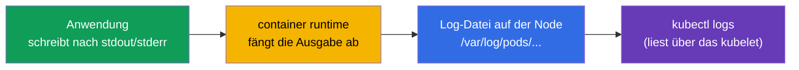
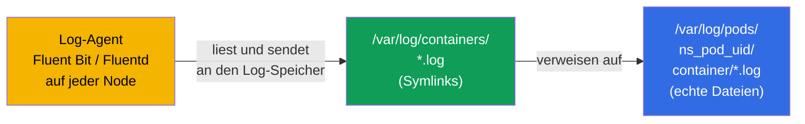
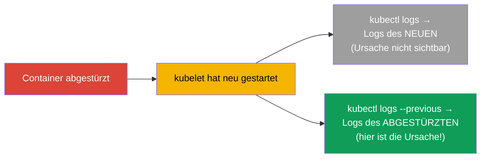
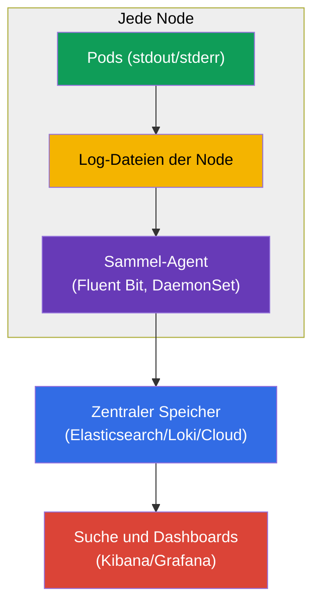
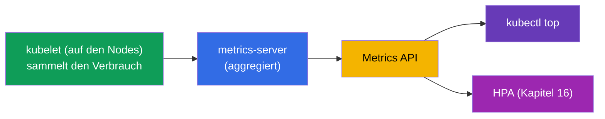
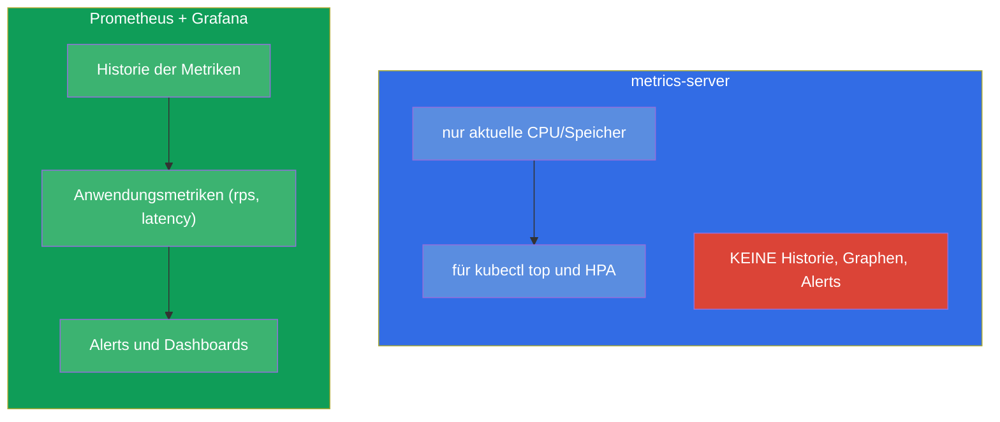
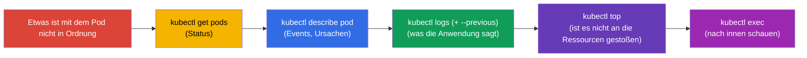

[Русская версия](ru.md) · [Eng version](README.md) · [Versión en español](es.md) · [Version française](fr.md) · [ქართული ვერსია](ge.md)

# Kapitel 28. Logging und Monitoring: logs, metrics-server, kubectl top

> **Was kommt.** Probes (Kapitel 27) teilen dem Cluster die Gesundheit mit. Aber wie sehen
> **Sie** selbst, was passiert? Über Logs (`kubectl logs`) und Metriken (`kubectl top` auf
> Basis des metrics-server). Das ist die Domäne Observability (CKAD) und
> Troubleshooting/Monitoring (CKA). Das Thema ist bei den Befehlen einfach, aber
> entscheidend: 90 % der Fehlersuche in der Prüfung und im Leben beginnt mit „in die Logs
> schauen“ und „den Verbrauch ansehen“. Nebenbei verstehen wir die Architektur des Loggings
> und den Platz von Prometheus im Gesamtbild.

## 28.1. Container-Logs: Grundlagen

Kubernetes sammelt, was der Container nach **stdout/stderr** schreibt. Das ist ein
fundamentales Prinzip: die Anwendung im Container soll in die Standardausgabe loggen und
nicht in Dateien - dann sehen `kubectl logs` und die Systeme zur Logsammlung sie.



Die wichtigsten Log-Befehle:

```bash
kubectl logs <pod>                    # Logs des Pods (mit einem Container)
kubectl logs <pod> -c <container>     # konkreter Container eines multi-container Pods
kubectl logs <pod> -f                 # in Echtzeit verfolgen (follow)
kubectl logs <pod> --previous         # Logs des VORHERIGEN (abgestürzten) Containers
kubectl logs <pod> --tail=100         # die letzten 100 Zeilen
kubectl logs <pod> --since=1h         # der letzten Stunde
kubectl logs -l app=web --prefix      # Logs aller Pods nach Label, mit Präfix der Quelle
```

Wo diese Dateien auf der Node physisch liegen. Die Runtime schreibt echte Dateien nach
`/var/log/pods/<namespace>_<pod>_<uid>/<container>/*.log`, und das Verzeichnis daneben
`/var/log/containers/` enthält **Symlinks** darauf mit bequemen Namen. Genau dieses Paar
lesen üblicherweise die Log-Agenten (Fluent Bit, Fluentd, Promtail), wenn sie die Logs von
allen Nodes sammeln:



Daraus folgt Wichtiges: `kubectl logs` liest die Datei des **aktuellen** Containers auf der
Node, und beim Löschen des Pods oder bei der Rotation der Datei verschwinden diese Logs. Für
die langfristige Aufbewahrung sorgt genau der externe Agent, der die Logs in einen zentralen
Speicher sendet (das Kapitel über Prometheus/den Logging-Stack - weiter unten).

### Wie lange Logs auf der Node leben und wie man das einstellt

Die Lebensdauer eines Logs auf der Node bestimmt **nicht die Zeit, sondern die Größe**: die
Rotation steuert das **kubelet**, nicht die Anwendung. Wenn die aktuelle Datei die
Grenzgröße erreicht, wird sie rotiert, und die ältesten rotierten Dateien werden gelöscht.
Die Standardwerte:

- `containerLogMaxSize` - **10Mi** (Dateigröße, bei der die Rotation erfolgt);
- `containerLogMaxFiles` - **5** (wie viele Dateien pro Container aufbewahrt werden).

Das heißt, standardmäßig werden pro Container etwa `5 × 10Mi ≈ 50Mi` gehalten, und „wie viel
das in Stunden/Tagen ist“ hängt vollständig davon ab, wie intensiv die Anwendung Logs
schreibt: ein geschwätziger Dienst überschreibt seine alten Logs in Minuten, ein stiller
bewahrt sie tagelang auf. Ein separates zeitbasiertes TTL gibt es nicht, und beim Löschen
des Pods werden die Dateien in jedem Fall entfernt.

Eingestellt wird das in der **Konfiguration des kubelet** (`KubeletConfiguration`, wird beim
Start des kubelet auf der Node angewendet):

```yaml
# /var/lib/kubelet/config.yaml (Fragment)
apiVersion: kubelet.config.k8s.io/v1beta1
kind: KubeletConfiguration
containerLogMaxSize: "50Mi"   # Rotation bei 50 MiB
containerLogMaxFiles: 5        # bis zu 5 Dateien pro Container aufbewahren
```

Die alten Flags `--container-log-max-size` und `--container-log-max-files` tun dasselbe,
gelten aber als veraltet - bevorzugt wird die Konfigurationsdatei. Praktische Regel: das
Gesamtvolumen (`containerLogMaxSize × containerLogMaxFiles`) pro Container hält man klein
(üblicherweise bis ~1 % der Node-Platte), damit die Logs die Platte nicht füllen und keine
disk-pressure eviction auslösen (Kapitel 15).

## 28.2. --previous: Logs des abgestürzten Containers

Separat zu `--previous` - das ist die Rettung beim Debuggen von `CrashLoopBackOff`. Wenn ein
Container abgestürzt und neu gestartet ist, zeigt das gewöhnliche `kubectl logs` die Logs des
**neuen** Containers (der gerade erst startet). Die Ursache des Absturzes steckt aber in den
Logs des **vorherigen**, schon toten. Die holt `--previous`:



Bei `CrashLoopBackOff` ist der Reflex dieser: `kubectl logs <pod> --previous` - und fast
immer ist dort zu sehen, warum die Anwendung abgestürzt ist.

> **Und wenn der Pod viele Male neu gestartet wurde und es keinen zentralen Speicher gibt?**
> `--previous` liefert nur die Logs **eines** vorherigen Starts (des letzten vor dem
> aktuellen), früher liegende bekommt man über `kubectl logs` nicht. Auf der Node kann man
> sie aber oft direkt finden: jeder Neustart des Containers legt eine separate Datei in
> `/var/log/pods/<namespace>_<pod>_<uid>/<container>/` ab, benannt nach dem Zähler der
> Neustarts - `0.log`, `1.log`, `2.log` usw. (die alten sind zusätzlich von der Rotation
> komprimiert). Also können die Logs mehrerer vergangener Abstürze dort liegen, solange die
> Rotation sie nicht verdrängt hat.
>
> An diese Dateien zu kommen, ohne per SSH hineinzugehen, hilft ein Debug-Pod auf der Node:
>
> ```bash
> kubectl debug node/<node> -it --image=busybox
> # innen: das Dateisystem der Node ist unter /host gemountet
> ls /host/var/log/pods/<namespace>_<pod>_<uid>/<container>/
> cat /host/var/log/pods/<namespace>_<pod>_<uid>/<container>/1.log
> ```
>
> Oder auf der Node selbst - über die Runtime: `crictl ps -a` (die ID finden) und
> `crictl logs <id>`.
>
> Wichtige Einschränkungen: die Dateien sind an die **UID des Pods** gebunden - wenn der Pod
> **gelöscht** ist (und nicht einfach neu gestartet), verschwindet das gesamte Verzeichnis
> mit den Logs; die Rotation bewahrt nur die letzten `containerLogMaxFiles` Dateien auf; und
> wenn der Pod auf eine andere Node umgezogen ist, muss man auf der früheren suchen. Deshalb
> sind node-lokale Logs nur eine vorübergehende Absicherung: der einzige verlässliche Weg,
> die Historie der Abstürze nicht zu verlieren, ist die zentrale Logsammlung (Agent →
> externer Speicher).

## 28.3. Architektur des Loggings im Cluster

`kubectl logs` ist gut, um einen einzelnen Pod zu debuggen, hat aber eine Grenze: die Logs
werden auf der Node gespeichert und **verschwinden mit dem Pod**. Pod gelöscht - Logs
verloren; man kann nicht über alle Pods gleichzeitig suchen. Für die Produktion braucht man
eine zentrale Aggregation.



Die Logs sammelt ein **Agent auf jeder Node** (üblicherweise ein DaemonSet - Kapitel 11,
zum Beispiel Fluent Bit) und sendet sie in einen zentralen Speicher (Elasticsearch, Loki,
Cloud-Logs), wo man darin suchen und Dashboards bauen kann. Das ist das Standardschema; in
der Prüfung genügt `kubectl logs`, aber die Architektur muss man verstehen.

## 28.4. metrics-server und kubectl top

Logs sind „was die Anwendung sagt“, Metriken sind „wie viel sie isst“. Die Basismetriken
(CPU/Speicher) liefert der **metrics-server** (wir haben ihn schon in Kapitel 16 getroffen -
er wird für HPA gebraucht). Er sammelt den Verbrauch beim kubelet jeder Node und gibt ihn
über die Metrics API heraus.



```bash
# Prüfen, ob es einen metrics-server gibt
kubectl get deployment metrics-server -n kube-system

# Ressourcenverbrauch
kubectl top nodes                     # CPU/Speicher nach Nodes
kubectl top pods                      # nach Pods
kubectl top pods -A                   # in allen namespaces
kubectl top pods --sort-by=memory     # Sortierung nach Speicher
kubectl top pods --containers         # nach Containern innerhalb der Pods
```

> **Wichtig.** `kubectl top` funktioniert **nur** bei installiertem metrics-server. Wenn es
> den Fehler `Metrics API not available` liefert - der metrics-server ist nicht installiert
> oder arbeitet nicht. Das ist dieselbe Bedingung wie für HPA (Kapitel 16).

## 28.5. metrics-server - kein Monitoring-System

Ein häufiger Irrtum: der metrics-server speichert keine Historie und ersetzt kein Monitoring.
Er liefert nur den **aktuellen** momentanen Verbrauch von CPU/Speicher (für `top` und HPA).
Weder Historie noch Graphen, noch Alerts, noch Anwendungsmetriken liefert er.



Für echtes Monitoring (Historie, Graphen, Alerts, beliebige Metriken) verwendet man
**Prometheus** (Sammeln und Speichern von Metriken) + **Grafana** (Visualisierung) +
Alertmanager (Alerts). Die Anwendungen geben Metriken im Prometheus-Format heraus (manchmal
über einen Adapter-Sidecar - Kapitel 22). Das ist der Standard der Observability, gehört aber
nicht tief zum Umfang von CKA/CKAD - es genügt, den Unterschied zum metrics-server zu kennen.

## 28.6. Der Debug-Zyklus: Logs + Metriken + describe

Wir setzen die Werkzeuge der Observability zu einem einheitlichen Debug-Reflex zusammen (er
wird in Teil 9 nützlich sein):



Diese Reihenfolge - `get → describe → logs → top → exec` - ist ein universeller Algorithmus
zur Analyse fast jedes Problems mit einem Pod. Jeder Schritt engt den Kreis der Ursachen ein.

## 28.7. Wie man das in der Produktion anwendet

- **Anwendungen loggen nach stdout/stderr.** Das ist die Bedingung für die Arbeit der
  zentralen Sammlung: die Anwendung schreibt in die Standardausgabe und nicht in Dateien
  innerhalb des Containers. Logs in Dateien des Containers sind ein Antipattern (sie werden
  nicht gesammelt und verschwinden mit dem Pod).
- **Zentrale Aggregation ist Pflicht.** In der Produktion ist `kubectl logs` nur für schnelles
  Debuggen; die echte Suche läuft über die aggregierten Logs (Loki/ELK/Cloud), weil die Logs
  der Pods ephemer und über die Nodes verstreut sind.
- **Prometheus + Grafana als Standard für Metriken.** Der metrics-server ist nur für
  `top`/HPA; für Historie, Dashboards und Alerts geht man zu Prometheus/Grafana.
  Anwendungsmetriken (rps, latency, Fehler) sind die Grundlage von SLO und Alerting.
- **Strukturierte Logs und Korrelation.** In der Produktion loggt man strukturiert (JSON) und
  fügt Kontext hinzu (Name des Pods, der Node über die Downward API - Kapitel 17), um bei der
  Analyse eines Incidents Logs, Metriken und Traces zu verbinden.
- **Tracing.** Vollständige Observability sind die „drei Säulen“: Logs + Metriken + Traces
  (OpenTelemetry/Jaeger). Für CKA/CKAD genügen Logs und Metriken, im echten Betrieb kommt
  aber verteiltes Tracing hinzu.

## 28.8. Mini-Glossar

- **stdout/stderr** - Standardausgabe des Containers, von wo Kubernetes die Logs nimmt.
- **kubectl logs** - Ansehen der Logs eines Pods/Containers.
- **--previous** - Logs des vorherigen (abgestürzten) Containers.
- **metrics-server** - sammelt die aktuellen CPU/Speicher-Werte der Pods und Nodes; für `top`
  und HPA.
- **kubectl top** - den Ressourcenverbrauch anzeigen (braucht den metrics-server).
- **Fluent Bit/Fluentd** - Agenten zur Logsammlung (üblicherweise DaemonSet).
- **Prometheus / Grafana** - Sammeln/Speichern von Metriken und Visualisierung (echtes
  Monitoring).
- **Drei Säulen der Observability** - Logs, Metriken, Traces.

## 28.9. Zusammenfassung des Kapitels

- Kubernetes sammelt stdout/stderr der Container; die Anwendung soll dorthin loggen und nicht
  in Dateien.
- `kubectl logs` (+ `-c`, `-f`, `--tail`, `--since`, `-l`) ist das Basiswerkzeug;
  `--previous` zeigt die Logs des abgestürzten Containers (der Schlüssel zu
  CrashLoopBackOff).
- Die Logs eines Pods sind ephemer (verschwinden mit dem Pod); in der Produktion sammelt sie
  ein Agent auf der Node (Fluent Bit, DaemonSet) in einen zentralen Speicher.
- Der metrics-server liefert die aktuellen CPU/Speicher-Werte für `kubectl top` und HPA; ohne
  ihn funktioniert `top` nicht.
- Der metrics-server ist kein Monitoring: keine Historie, keine Alerts; dafür Prometheus +
  Grafana.
- Der universelle Debug-Zyklus: get → describe → logs (--previous) → top → exec.

## 28.10. Wofür das nützlich ist: in der Prüfung und in der echten Arbeit

**In der Prüfung.** „Sieh dir die Logs des Pods an“, „finde den Fehler im abgestürzten
Container“ (`--previous`), „gib den Pod mit dem größten Verbrauch aus“
(`kubectl top --sort-by`) - ständige Aufgaben. `kubectl logs` und `describe` sind das
Hauptwerkzeug der Domäne Troubleshooting (30 % CKA). Denken Sie daran, dass `top` den
metrics-server braucht.

**In der echten Arbeit.** Logs und Metriken sind das Erste, worauf der Bereitschaftsdienst bei
einem Incident zurückgreift. Das Verständnis, dass Logs ephemer sind und eine zentrale
Aggregation nötig ist und dass der metrics-server kein Monitoring ist, führt zur richtigen
Architektur der Observability (Fluent Bit + Loki/ELK, Prometheus + Grafana). Der Debug-Zyklus
get→describe→logs→top ist eine tägliche Fertigkeit.

## 28.11. Fragen zur Selbstüberprüfung

1. Wohin soll eine Anwendung loggen, damit `kubectl logs` und die Sammler sie sehen?
2. Wodurch unterscheidet sich `kubectl logs --previous` vom gewöhnlichen Aufruf und wann ist
   es unersetzlich?
3. Warum genügt `kubectl logs` für die Produktion nicht und wie ist die zentrale Aggregation
   aufgebaut?
4. Was liefert der metrics-server und was hört ohne ihn auf zu funktionieren?
5. Warum ist der metrics-server kein Monitoring-System? Was verwendet man stattdessen?
6. Beschreiben Sie den universellen Debug-Zyklus eines Pods Schritt für Schritt.
7. Was sind die „drei Säulen der Observability“?

## Praxis

Wir haben die Beobachtung des Clusters gemeistert. In Kapitel 29 schließen wir Teil 6 mit dem
Thema Debuggen von Anwendungen und Veralten von APIs ab (einschließlich ephemeral Container
für die Diagnose). Logs und Metriken werden in den Labs zur Observability geübt.

🧪 Lab 109 (logs, metrics-server, kubectl top): [tasks/cka/labs/109](../../labs/109/README_DE.MD)

---
[Inhalt](../README_DE.md) · [Kapitel 27](../27/de.md) · [Kapitel 29](../29/de.md)
