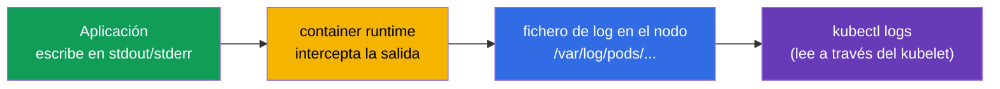
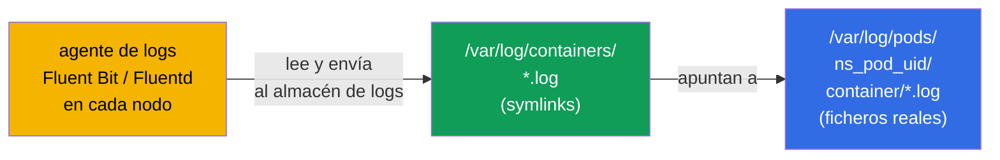
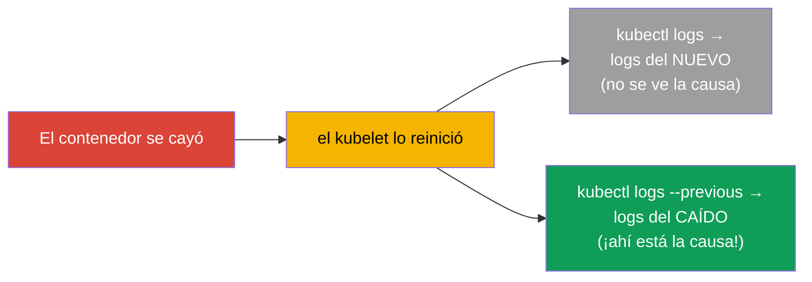
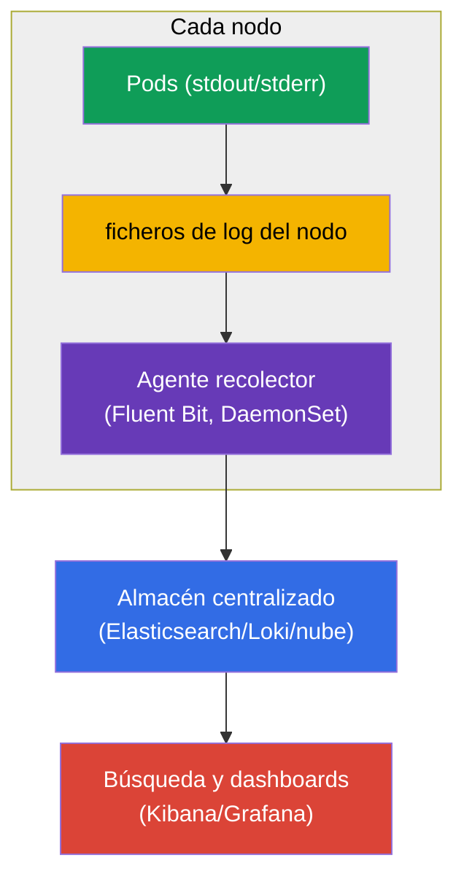
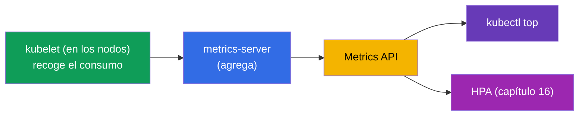
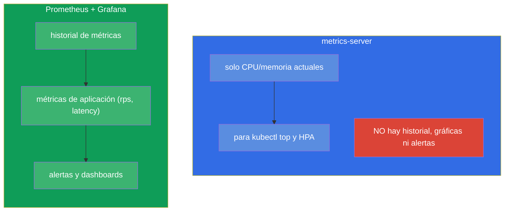
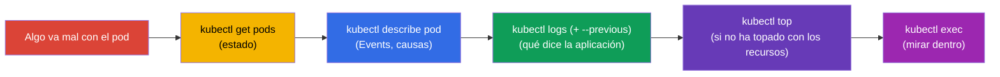

[Русская версия](ru.md) · [Eng version](README.md) · [Version française](fr.md) · [Deutsche Version](de.md) · [ქართული ვერსია](ge.md) · [繁體中文版](tw.md) · [日本語版](jp.md)

# Capítulo 28. Logging y monitorización: logs, metrics-server, kubectl top

> **Qué viene ahora.** Las probes (capítulo 27) informan al clúster sobre la salud. Pero ¿cómo
> ves **tú** lo que ocurre? A través de los logs (`kubectl logs`) y las métricas (`kubectl top`
> basado en metrics-server). Es el dominio Observability (CKAD) y Troubleshooting/Monitoring
> (CKA). El tema es sencillo en cuanto a comandos, pero crítico: el 90% de la depuración en el
> examen y en la vida real empieza con «mirar los logs» y «mirar el consumo». De paso
> entenderemos la arquitectura del logging y el lugar de Prometheus en el cuadro general.

## 28.1. Logs de contenedores: fundamentos

Kubernetes recoge lo que el contenedor escribe en **stdout/stderr**. Es un principio
fundamental: la aplicación dentro del contenedor debe loguear en la salida estándar, no en
ficheros - así `kubectl logs` y los sistemas de recogida de logs los verán.



Comandos básicos de logs:

```bash
kubectl logs <pod>                    # logs del pod (de un solo contenedor)
kubectl logs <pod> -c <container>     # contenedor concreto de un pod multi-container
kubectl logs <pod> -f                 # seguir en tiempo real (follow)
kubectl logs <pod> --previous         # logs del contenedor ANTERIOR (el que se cayó)
kubectl logs <pod> --tail=100         # últimas 100 líneas
kubectl logs <pod> --since=1h         # de la última hora
kubectl logs -l app=web --prefix      # logs de todos los pods por etiqueta, con prefijo del origen
```

Dónde están físicamente esos ficheros en el nodo. El runtime escribe ficheros reales en
`/var/log/pods/<namespace>_<pod>_<uid>/<container>/*.log`, y al lado el directorio
`/var/log/containers/` contiene **symlinks** a ellos con nombres cómodos. Precisamente ese par
es lo que suelen leer los agentes de logs (Fluent Bit, Fluentd, Promtail) cuando recogen los
logs de todos los nodos:



De aquí una consecuencia importante: `kubectl logs` lee el fichero del contenedor **actual** en
el nodo, y al borrar el pod o al rotar el fichero esos logs desaparecen. El almacenamiento a
largo plazo lo garantiza precisamente un agente externo que envía los logs a un almacén
centralizado (el apartado sobre Prometheus/el stack de logging - más abajo).

### Cuánto viven los logs en el nodo y cómo configurarlo

La vida de un log en el nodo se define **no por tiempo, sino por tamaño**: de la rotación se
encarga el **kubelet**, no la aplicación. Cuando el fichero actual alcanza el tamaño límite, se
rota, y los ficheros rotados más antiguos se eliminan. Valores por defecto:

- `containerLogMaxSize` - **10Mi** (tamaño del fichero al que se produce la rotación);
- `containerLogMaxFiles` - **5** (cuántos ficheros guardar por contenedor).

O sea, por defecto se retienen por contenedor aproximadamente `5 × 10Mi ≈ 50Mi`, y «cuánto es
eso en horas/días» depende por completo de con qué intensidad escriba logs la aplicación: un
servicio parlanchín sobrescribirá sus logs antiguos en minutos, uno silencioso los guardará
durante días. No hay un TTL aparte por tiempo, y al borrar el pod los ficheros se eliminan en
cualquier caso.

Esto se configura en la **configuración del kubelet** (`KubeletConfiguration`, se aplica al
arrancar el kubelet en el nodo):

```yaml
# /var/lib/kubelet/config.yaml (fragmento)
apiVersion: kubelet.config.k8s.io/v1beta1
kind: KubeletConfiguration
containerLogMaxSize: "50Mi"   # rotación a los 50 MiB
containerLogMaxFiles: 5        # guardar hasta 5 ficheros por contenedor
```

Los flags antiguos `--container-log-max-size` y `--container-log-max-files` hacen lo mismo, pero
se consideran obsoletos - es preferible el fichero de configuración. Regla práctica: el volumen
total (`containerLogMaxSize × containerLogMaxFiles`) por contenedor se mantiene pequeño
(normalmente hasta ~1% del disco del nodo), para que los logs no llenen el disco ni provoquen
un disk-pressure eviction (capítulo 15).

## 28.2. --previous: logs del contenedor que se cayó

Aparte, sobre `--previous` - es la salvación al depurar un `CrashLoopBackOff`. Cuando un
contenedor se ha caído y se ha reiniciado, un `kubectl logs` normal mostrará los logs del
contenedor **nuevo** (el que acaba de arrancar). Y la causa de la caída está en los logs del
**anterior**, ya muerto. Los saca `--previous`:



Ante un `CrashLoopBackOff` el reflejo es este: `kubectl logs <pod> --previous` - y casi siempre
ahí se ve por qué se cayó la aplicación.

> **¿Y si el pod se ha reiniciado muchas veces y no hay almacén centralizado?** `--previous`
> devuelve los logs de solo **una** ejecución anterior (la última antes de la actual); las más
> antiguas no se pueden obtener con `kubectl logs`. Pero en el nodo a menudo se pueden encontrar
> directamente: cada reinicio del contenedor deja un fichero aparte en
> `/var/log/pods/<namespace>_<pod>_<uid>/<container>/`, nombrado según el contador de
> reinicios - `0.log`, `1.log`, `2.log`, etc. (los antiguos además están comprimidos por la
> rotación). Así que los logs de varias caídas pasadas pueden estar ahí, mientras la rotación no
> los haya desplazado.
>
> Para llegar a esos ficheros sin entrar por SSH ayuda un pod de depuración en el nodo:
>
> ```bash
> kubectl debug node/<node> -it --image=busybox
> # dentro: el sistema de ficheros del nodo está montado en /host
> ls /host/var/log/pods/<namespace>_<pod>_<uid>/<container>/
> cat /host/var/log/pods/<namespace>_<pod>_<uid>/<container>/1.log
> ```
>
> O bien en el propio nodo - a través del runtime: `crictl ps -a` (buscar el ID) y
> `crictl logs <id>`.
>
> Limitaciones importantes: los ficheros están ligados al **UID del pod** - si el pod se
> **borra** (y no solo se reinicia), todo el directorio con los logs desaparece; la rotación
> guarda solo los últimos `containerLogMaxFiles` ficheros; y si el pod se ha movido a otro nodo,
> hay que buscar en el anterior. Por eso los logs node-local son solo un seguro temporal: la
> única forma fiable de no perder el historial de caídas es la recogida centralizada de logs
> (agente → almacén externo).

## 28.3. Arquitectura del logging en el clúster

`kubectl logs` está bien para depurar un pod, pero tiene un límite: los logs se guardan en el
nodo y **desaparecen junto con el pod**. Borraste el pod - logs perdidos; no se puede buscar en
todos los pods a la vez. Para producción hace falta agregación centralizada.



Los logs los recoge un **agente en cada nodo** (normalmente un DaemonSet - capítulo 11, por
ejemplo Fluent Bit) y los envía a un almacén centralizado (Elasticsearch, Loki, logs en la
nube), donde se pueden buscar y construir dashboards. Es el esquema estándar; en el examen basta
con `kubectl logs`, pero hay que entender la arquitectura.

## 28.4. metrics-server y kubectl top

Los logs son «qué dice la aplicación», las métricas son «cuánto consume». Las métricas básicas
(CPU/memoria) las da el **metrics-server** (ya nos lo encontramos en el capítulo 16 - hace falta
para el HPA). Recoge el consumo del kubelet de cada nodo y lo entrega a través de la Metrics API.



```bash
# Comprobar si hay metrics-server
kubectl get deployment metrics-server -n kube-system

# Consumo de recursos
kubectl top nodes                     # CPU/memoria por nodos
kubectl top pods                      # por pods
kubectl top pods -A                   # en todos los namespace
kubectl top pods --sort-by=memory     # ordenar por memoria
kubectl top pods --containers         # por contenedores dentro de los pods
```

> **Importante.** `kubectl top` funciona **solo** con metrics-server instalado. Si devuelve el
> error `Metrics API not available` - metrics-server no está instalado o no funciona. Es la misma
> condición que para el HPA (capítulo 16).

## 28.5. metrics-server no es un sistema de monitorización

Un malentendido frecuente: metrics-server no guarda historial y no sustituye a la
monitorización. Solo da el consumo **actual** e instantáneo de CPU/memoria (para `top` y el HPA).
No da ni historial, ni gráficas, ni alertas, ni métricas de aplicación.



Para una monitorización de verdad (historial, gráficas, alertas, métricas arbitrarias) se usa
**Prometheus** (recogida y almacenamiento de métricas) + **Grafana** (visualización) +
Alertmanager (alertas). Las aplicaciones exponen métricas en formato Prometheus (a veces a
través de un adapter-sidecar - capítulo 22). Es el estándar de observabilidad, pero no entra en
profundidad en el alcance de CKA/CKAD - basta con conocer la diferencia con metrics-server.

## 28.6. Ciclo de depuración: logs + métricas + describe

Reunamos las herramientas de observabilidad en un único reflejo de depuración (será útil en la
parte 9):



Este orden - `get → describe → logs → top → exec` - es el algoritmo universal para analizar casi
cualquier problema con un pod. Cada paso estrecha el círculo de causas.

## 28.7. Cómo se aplica esto en producción

- **Las aplicaciones loguean en stdout/stderr.** Es la condición para que funcione la recogida
  centralizada: la aplicación escribe en la salida estándar, no en ficheros dentro del
  contenedor. Los logs en ficheros del contenedor son un antipatrón (no se recogerán y
  desaparecerán con el pod).
- **La agregación centralizada es obligatoria.** En producción `kubectl logs` es solo para una
  depuración rápida; la búsqueda real se hace sobre los logs agregados (Loki/ELK/nube), porque
  los logs de los pods son efímeros y están dispersos por los nodos.
- **Prometheus + Grafana como estándar de métricas.** metrics-server es solo para `top`/HPA;
  para el historial, los dashboards y las alertas se acude a Prometheus/Grafana. Las métricas de
  aplicación (rps, latency, errores) son la base de los SLO y del alerting.
- **Logs estructurados y correlación.** En producción se loguea de forma estructurada (JSON) y
  se añade contexto (nombre del pod, del nodo mediante la Downward API - capítulo 17), para
  vincular logs, métricas y trazas al analizar un incidente.
- **Trazado.** La observabilidad completa son «tres pilares»: logs + métricas + trazas
  (OpenTelemetry/Jaeger). Para CKA/CKAD basta con logs y métricas, pero en la explotación real
  se añade el trazado distribuido.

## 28.8. Mini-glosario

- **stdout/stderr** - salida estándar del contenedor, de donde Kubernetes toma los logs.
- **kubectl logs** - ver los logs de un pod/contenedor.
- **--previous** - logs del contenedor anterior (el que se cayó).
- **metrics-server** - recoge CPU/memoria actuales de pods y nodos; para `top` y el HPA.
- **kubectl top** - mostrar el consumo de recursos (necesita metrics-server).
- **Fluent Bit/Fluentd** - agentes de recogida de logs (normalmente DaemonSet).
- **Prometheus / Grafana** - recogida/almacenamiento de métricas y visualización (monitorización
  de verdad).
- **Tres pilares de la observabilidad** - logs, métricas, trazas.

## 28.9. Resumen del capítulo

- Kubernetes recoge stdout/stderr de los contenedores; la aplicación debe loguear ahí, no en
  ficheros.
- `kubectl logs` (+ `-c`, `-f`, `--tail`, `--since`, `-l`) es la herramienta básica;
  `--previous` muestra los logs del contenedor caído (la clave del CrashLoopBackOff).
- Los logs del pod son efímeros (desaparecen con el pod); en producción los recoge un agente en
  el nodo (Fluent Bit, DaemonSet) hacia un almacén centralizado.
- metrics-server da CPU/memoria actuales para `kubectl top` y el HPA; sin él `top` no funciona.
- metrics-server no es monitorización: ni historial, ni alertas; para eso está Prometheus +
  Grafana.
- Ciclo universal de depuración: get → describe → logs (--previous) → top → exec.

## 28.10. Para qué te servirá: en el examen y en el trabajo real

**En el examen.** «Mira los logs del pod», «encuentra el error en el contenedor caído»
(`--previous`), «muestra el pod con mayor consumo» (`kubectl top --sort-by`) son tareas
constantes. `kubectl logs` y `describe` son la herramienta principal del dominio troubleshooting
(30% del CKA). Recuerda que `top` requiere metrics-server.

**En el trabajo real.** Los logs y las métricas son lo primero a lo que recurre quien está de
guardia durante un incidente. Entender que los logs son efímeros y que hace falta agregación
centralizada, y que metrics-server no es monitorización, lleva a una arquitectura correcta de
observabilidad (Fluent Bit + Loki/ELK, Prometheus + Grafana). El ciclo de depuración
get→describe→logs→top es una destreza diaria.

## 28.11. Preguntas de autoevaluación

1. ¿Dónde debe loguear la aplicación para que `kubectl logs` y los recolectores lo vean?
2. ¿En qué se diferencia `kubectl logs --previous` del normal y cuándo es insustituible?
3. ¿Por qué `kubectl logs` no basta para producción y cómo está organizada la agregación centralizada?
4. ¿Qué da metrics-server y qué dejará de funcionar sin él?
5. ¿Por qué metrics-server no es un sistema de monitorización? ¿Qué usar en su lugar?
6. Describe paso a paso el ciclo universal de depuración de un pod.
7. ¿Qué son los «tres pilares de la observabilidad»?

## Práctica

Hemos aprendido a observar el clúster. En el capítulo 29 cerraremos la parte 6 con el tema de la
depuración de aplicaciones y la obsolescencia de las API (incluidos los contenedores ephemeral
para diagnóstico). Los logs y las métricas se practican en los laboratorios de observabilidad.

🧪 Laboratorio 109 (logs, metrics-server, kubectl top): [tasks/cka/labs/109](../../labs/109/README_ES.MD)

🎮 Killercoda (en el navegador, sin instalación): [Logging in Kubernetes](https://killercoda.com/chadmcrowell/course/ckad/logging) · [Monitoring Kubernetes with Metrics Server](https://killercoda.com/chadmcrowell/course/ckad/metrics-server) · [Describe Pod Events](https://killercoda.com/chadmcrowell/course/ckad/describe-events)

---
[Índice](../README_ES.md) · [Capítulo 27](../27/es.md) · [Capítulo 29](../29/es.md)
