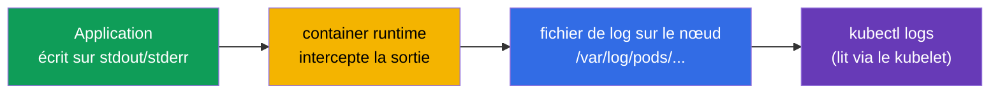
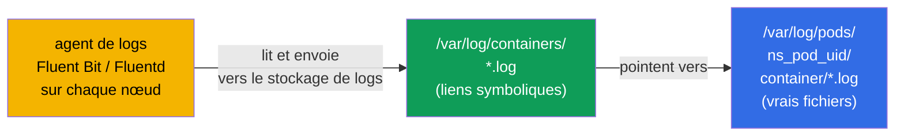
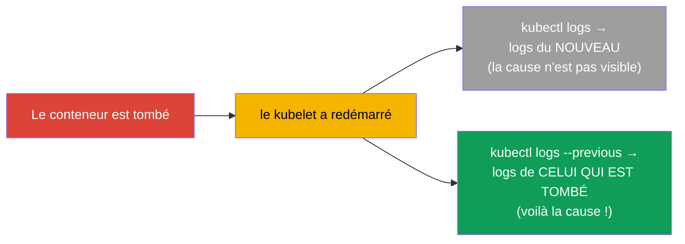
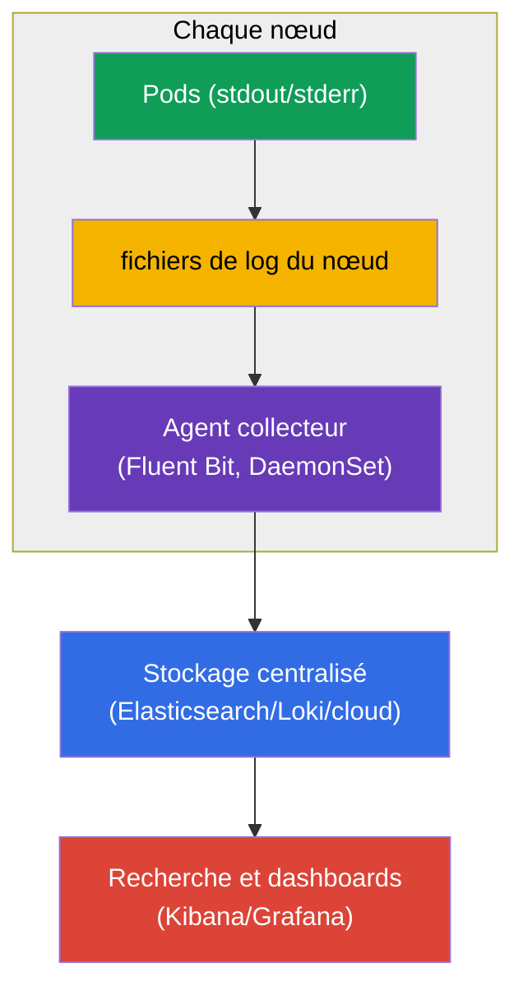
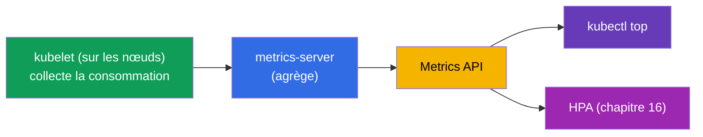
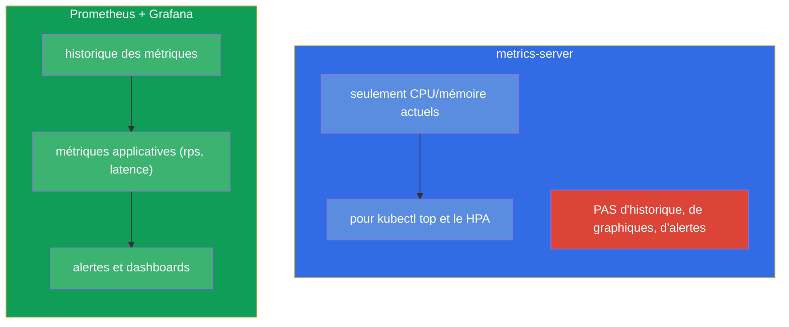
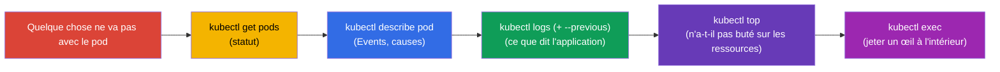

[Русская версия](ru.md) · [Eng version](README.md) · [Versión en español](es.md) · [Deutsche Version](de.md) · [ქართული ვერსია](ge.md)

# Chapitre 28. Logging et monitoring : logs, metrics-server, kubectl top

> **Ce qui suit.** Les probes (chapitre 27) informent le cluster de l'état de santé. Mais comment
> **vous**, voyez-vous ce qui se passe ? Par les logs (`kubectl logs`) et les métriques
> (`kubectl top`, basé sur metrics-server). C'est le domaine Observability (CKAD) et
> Troubleshooting/Monitoring (CKA). Le sujet est simple côté commandes, mais critique : 90 % du
> débogage, à l'examen comme dans la vraie vie, commence par « regarder les logs » et « regarder
> la consommation ». Au passage, nous comprendrons l'architecture du logging et la place de
> Prometheus dans le tableau d'ensemble.

## 28.1. Les logs de conteneurs : les bases

Kubernetes collecte ce que le conteneur écrit sur **stdout/stderr**. C'est un principe
fondamental : une application dans un conteneur doit logger sur la sortie standard, pas dans des
fichiers - c'est ainsi que `kubectl logs` et les systèmes de collecte de logs les verront.



Les commandes de logs essentielles :

```bash
kubectl logs <pod>                    # logs du pod (mono-conteneur)
kubectl logs <pod> -c <container>     # un conteneur précis d'un pod multi-container
kubectl logs <pod> -f                 # suivre en temps réel (follow)
kubectl logs <pod> --previous         # logs du conteneur PRÉCÉDENT (celui qui est tombé)
kubectl logs <pod> --tail=100         # les 100 dernières lignes
kubectl logs <pod> --since=1h         # la dernière heure
kubectl logs -l app=web --prefix      # logs de tous les pods par label, avec le préfixe de la source
```

Où ces fichiers se trouvent physiquement sur le nœud. Le runtime écrit de vrais fichiers dans
`/var/log/pods/<namespace>_<pod>_<uid>/<container>/*.log`, et à côté le répertoire
`/var/log/containers/` contient des **liens symboliques** vers eux, avec des noms pratiques. C'est
justement cette paire que lisent d'habitude les agents de logs (Fluent Bit, Fluentd, Promtail)
quand ils collectent les logs de tous les nœuds :



D'où une conséquence importante : `kubectl logs` lit le fichier du conteneur **courant** sur le
nœud, et à la suppression du pod ou à la rotation du fichier ces logs disparaissent. La
conservation à long terme est assurée précisément par un agent externe qui envoie les logs vers un
stockage centralisé (la partie sur Prometheus / la stack de logging - plus bas).

### Combien de temps les logs vivent sur le nœud et comment le régler

La durée de vie d'un log sur le nœud est définie **non par le temps, mais par la taille** : la
rotation est gérée par le **kubelet**, pas par l'application. Quand le fichier courant atteint la
taille limite, il est rotaté, et les fichiers rotatés les plus anciens sont supprimés. Les valeurs
par défaut :

- `containerLogMaxSize` - **10Mi** (taille du fichier à laquelle la rotation se produit) ;
- `containerLogMaxFiles` - **5** (combien de fichiers conserver par conteneur).

Autrement dit, par défaut on retient environ `5 × 10Mi ≈ 50Mi` par conteneur, et « combien cela
fait en heures/jours » dépend entièrement de l'intensité avec laquelle l'application écrit ses
logs : un service bavard écrasera ses anciens logs en quelques minutes, un service silencieux les
gardera des jours. Il n'y a pas de TTL séparé basé sur le temps, et à la suppression du pod les
fichiers partent de toute façon.

Cela se règle dans la **configuration du kubelet** (`KubeletConfiguration`, appliquée au démarrage
du kubelet sur le nœud) :

```yaml
# /var/lib/kubelet/config.yaml (extrait)
apiVersion: kubelet.config.k8s.io/v1beta1
kind: KubeletConfiguration
containerLogMaxSize: "50Mi"   # rotation à 50 MiB
containerLogMaxFiles: 5        # conserver jusqu'à 5 fichiers par conteneur
```

Les anciens flags `--container-log-max-size` et `--container-log-max-files` font la même chose,
mais sont considérés comme obsolètes - le fichier de configuration est préférable. Règle pratique :
le volume total (`containerLogMaxSize × containerLogMaxFiles`) par conteneur est gardé modeste
(en général jusqu'à ~1 % du disque du nœud), pour que les logs ne saturent pas le disque et ne
provoquent pas d'éviction pour disk-pressure (chapitre 15).

## 28.2. --previous : les logs du conteneur tombé

Un mot à part sur `--previous` - c'est le salut lors du débogage d'un `CrashLoopBackOff`. Quand un
conteneur est tombé et a redémarré, un `kubectl logs` ordinaire montrera les logs du **nouveau**
conteneur (celui qui vient juste de démarrer). Or la cause de la chute est dans les logs du
**précédent**, déjà mort. C'est `--previous` qui les récupère :



Sur un `CrashLoopBackOff`, le réflexe est celui-ci : `kubectl logs <pod> --previous` - et on y voit
presque toujours pourquoi l'application est tombée.

> **Et si le pod a redémarré de nombreuses fois et qu'il n'y a pas de stockage centralisé ?**
> `--previous` ne donne les logs que d'**un seul** lancement précédent (le dernier avant le
> courant), les plus anciens ne sont pas accessibles via `kubectl logs`. Mais sur le nœud on peut
> souvent les trouver directement : chaque redémarrage du conteneur dépose un fichier distinct dans
> `/var/log/pods/<namespace>_<pod>_<uid>/<container>/`, nommé selon le compteur de redémarrages -
> `0.log`, `1.log`, `2.log`, etc. (les anciens sont en outre compressés par la rotation). Les logs
> de plusieurs chutes passées peuvent donc s'y trouver, tant que la rotation ne les a pas évincés.
>
> Pour atteindre ces fichiers sans passer par SSH, un pod de débogage sur le nœud est bien utile :
>
> ```bash
> kubectl debug node/<node> -it --image=busybox
> # à l'intérieur : le système de fichiers du nœud est monté dans /host
> ls /host/var/log/pods/<namespace>_<pod>_<uid>/<container>/
> cat /host/var/log/pods/<namespace>_<pod>_<uid>/<container>/1.log
> ```
>
> Ou bien sur le nœud lui-même - via le runtime : `crictl ps -a` (trouver l'ID) puis
> `crictl logs <id>`.
>
> Limites importantes : les fichiers sont liés à l'**UID du pod** - si le pod est **supprimé** (et
> pas simplement redémarré), tout le répertoire de logs disparaît ; la rotation ne garde que les
> `containerLogMaxFiles` derniers fichiers ; et si le pod a déménagé sur un autre nœud, il faut
> chercher sur l'ancien. Les logs locaux au nœud ne sont donc qu'une assurance temporaire : le seul
> moyen fiable de ne pas perdre l'historique des chutes est la collecte centralisée des logs
> (agent → stockage externe).

## 28.3. L'architecture du logging dans le cluster

`kubectl logs` est bon pour déboguer un pod, mais il a une limite : les logs sont stockés sur le
nœud et **disparaissent avec le pod**. Pod supprimé - logs perdus ; impossible de chercher dans
tous les pods à la fois. Pour la prod, il faut une agrégation centralisée.



Les logs sont collectés par un **agent sur chaque nœud** (en général un DaemonSet - chapitre 11,
par exemple Fluent Bit) qui les envoie vers un stockage centralisé (Elasticsearch, Loki, logs
cloud), où l'on peut faire des recherches et construire des dashboards. C'est le schéma standard ;
à l'examen `kubectl logs` suffit, mais il faut comprendre l'architecture.

## 28.4. metrics-server et kubectl top

Les logs, c'est « ce que dit l'application », les métriques, c'est « combien elle consomme ». Les
métriques de base (CPU/mémoire) sont fournies par **metrics-server** (nous l'avons déjà croisé au
chapitre 16 - il est nécessaire au HPA). Il collecte la consommation auprès du kubelet de chaque
nœud et l'expose via la Metrics API.



```bash
# Vérifier si metrics-server est présent
kubectl get deployment metrics-server -n kube-system

# Consommation de ressources
kubectl top nodes                     # CPU/mémoire par nœud
kubectl top pods                      # par pod
kubectl top pods -A                   # dans tous les namespace
kubectl top pods --sort-by=memory     # tri par mémoire
kubectl top pods --containers         # par conteneur à l'intérieur des pods
```

> **Important.** `kubectl top` ne fonctionne **que** si metrics-server est installé. S'il renvoie
> l'erreur `Metrics API not available` - metrics-server n'est pas installé ou ne fonctionne pas.
> C'est la même condition que pour le HPA (chapitre 16).

## 28.5. metrics-server n'est pas un système de monitoring

Idée fausse fréquente : metrics-server ne conserve pas d'historique et ne remplace pas le
monitoring. Il ne donne que la consommation CPU/mémoire **instantanée actuelle** (pour `top` et le
HPA). Ni historique, ni graphiques, ni alertes, ni métriques applicatives.



Pour un vrai monitoring (historique, graphiques, alertes, métriques arbitraires) on utilise
**Prometheus** (collecte et stockage des métriques) + **Grafana** (visualisation) + Alertmanager
(alertes). Les applications exposent leurs métriques au format Prometheus (parfois via un
adapter-sidecar - chapitre 22). C'est le standard de l'observabilité, mais cela ne fait pas
profondément partie du périmètre CKA/CKAD - il suffit de connaître la différence avec
metrics-server.

## 28.6. Le cycle de débogage : logs + métriques + describe

Rassemblons les outils d'observabilité en un réflexe de débogage unique (il servira en partie 9) :



Cet ordre - `get → describe → logs → top → exec` - est l'algorithme universel d'analyse de presque
n'importe quel problème de pod. Chaque étape réduit le champ des causes.

## 28.7. Comment cela s'applique en production

- **Les applications loggent sur stdout/stderr.** C'est la condition pour que la collecte
  centralisée fonctionne : l'application écrit sur la sortie standard, pas dans des fichiers à
  l'intérieur du conteneur. Logger dans des fichiers du conteneur est un antipattern (ils ne seront
  pas collectés et disparaîtront avec le pod).
- **L'agrégation centralisée est obligatoire.** En prod, `kubectl logs` sert seulement au débogage
  rapide ; la vraie recherche se fait sur les logs agrégés (Loki/ELK/cloud), parce que les logs des
  pods sont éphémères et éparpillés sur les nœuds.
- **Prometheus + Grafana comme standard des métriques.** metrics-server ne sert qu'à `top`/HPA ;
  pour l'historique, les dashboards et les alertes on va vers Prometheus/Grafana. Les métriques
  applicatives (rps, latence, erreurs) sont la base des SLO et de l'alerting.
- **Logs structurés et corrélation.** En prod on logge de façon structurée (JSON) et on ajoute du
  contexte (nom du pod, du nœud via la Downward API - chapitre 17), pour relier logs, métriques et
  traces lors de l'analyse d'un incident.
- **Le tracing.** L'observabilité complète, ce sont « trois piliers » : logs + métriques + traces
  (OpenTelemetry/Jaeger). Pour CKA/CKAD, logs et métriques suffisent, mais en exploitation réelle
  s'y ajoute le tracing distribué.

## 28.8. Mini-glossaire

- **stdout/stderr** - la sortie standard du conteneur, d'où Kubernetes prend les logs.
- **kubectl logs** - consultation des logs d'un pod/conteneur.
- **--previous** - les logs du conteneur précédent (celui qui est tombé).
- **metrics-server** - collecte les CPU/mémoire actuels des pods et des nœuds ; pour `top` et le HPA.
- **kubectl top** - afficher la consommation de ressources (nécessite metrics-server).
- **Fluent Bit/Fluentd** - agents de collecte de logs (en général un DaemonSet).
- **Prometheus / Grafana** - collecte/stockage des métriques et visualisation (le vrai monitoring).
- **Les trois piliers de l'observabilité** - logs, métriques, traces.

## 28.9. Bilan du chapitre

- Kubernetes collecte les stdout/stderr des conteneurs ; l'application doit logger là, et pas dans
  des fichiers.
- `kubectl logs` (+ `-c`, `-f`, `--tail`, `--since`, `-l`) est l'outil de base ;
  `--previous` montre les logs du conteneur tombé (la clé du CrashLoopBackOff).
- Les logs d'un pod sont éphémères (ils disparaissent avec le pod) ; en prod, un agent sur le nœud
  (Fluent Bit, DaemonSet) les collecte vers un stockage centralisé.
- metrics-server fournit les CPU/mémoire actuels pour `kubectl top` et le HPA ; sans lui, `top` ne
  fonctionne pas.
- metrics-server n'est pas du monitoring : ni historique, ni alertes ; pour cela, Prometheus +
  Grafana.
- Cycle de débogage universel : get → describe → logs (--previous) → top → exec.

## 28.10. À quoi cela sert : à l'examen et dans le travail réel

**À l'examen.** « Regarde les logs du pod », « trouve l'erreur dans le conteneur tombé »
(`--previous`), « affiche le pod à la plus forte consommation » (`kubectl top --sort-by`) - des
exercices constants. `kubectl logs` et `describe` sont l'outil principal du domaine troubleshooting
(30 % du CKA). Se souvenir que `top` exige metrics-server.

**Dans le travail réel.** Logs et métriques sont la première chose que consulte l'astreinte lors
d'un incident. Comprendre que les logs sont éphémères et qu'une agrégation centralisée est
nécessaire, et que metrics-server n'est pas du monitoring, mène à une architecture d'observabilité
correcte (Fluent Bit + Loki/ELK, Prometheus + Grafana). Le cycle de débogage
get→describe→logs→top est une compétence quotidienne.

## 28.11. Questions d'auto-évaluation

1. Où l'application doit-elle logger pour que `kubectl logs` et les collecteurs le voient ?
2. En quoi `kubectl logs --previous` diffère-t-il de la commande ordinaire et quand est-il irremplaçable ?
3. Pourquoi `kubectl logs` ne suffit-il pas pour la prod et comment fonctionne l'agrégation centralisée ?
4. Qu'apporte metrics-server et qu'est-ce qui cessera de fonctionner sans lui ?
5. Pourquoi metrics-server n'est-il pas un système de monitoring ? Qu'utiliser à sa place ?
6. Décrivez étape par étape le cycle universel de débogage d'un pod.
7. Que sont « les trois piliers de l'observabilité » ?

## Pratique

Nous avons appris à observer le cluster. Au chapitre 29, nous clôturons la partie 6 avec le
débogage des applications et la dépréciation des API (y compris les conteneurs ephemeral pour le
diagnostic). Les logs et les métriques se travaillent dans les TP sur l'observabilité.

🧪 TP 109 (logs, metrics-server, kubectl top) : [tasks/cka/labs/109](../../labs/109/README_FR.MD)

---
[Sommaire](../README_FR.md) · [Chapitre 27](../27/fr.md) · [Chapitre 29](../29/fr.md)
