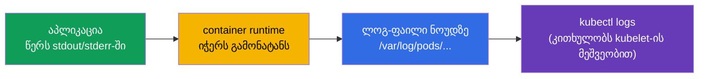
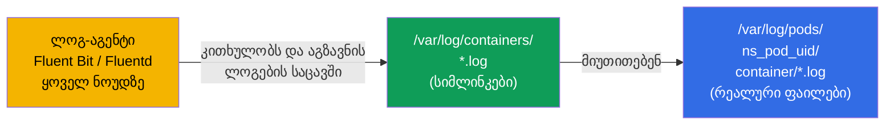
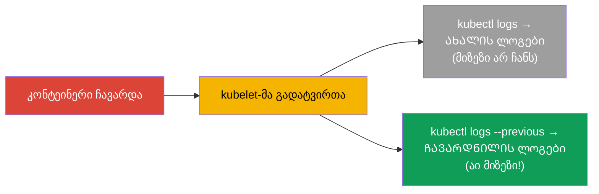
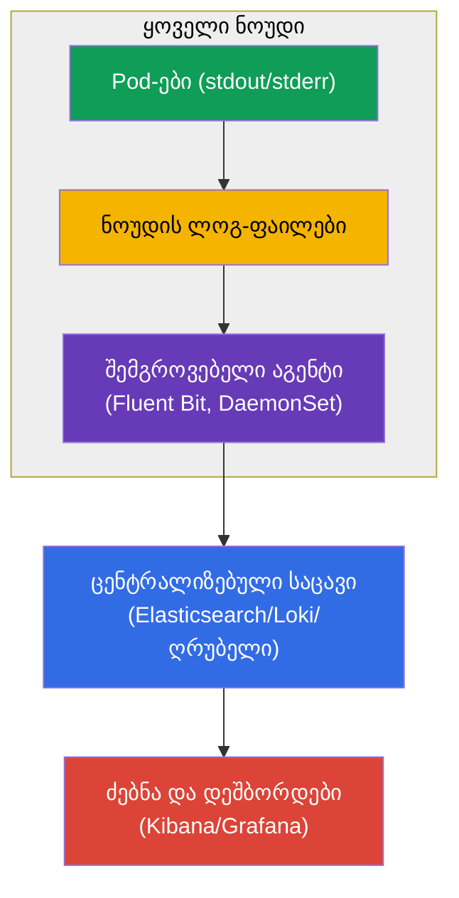
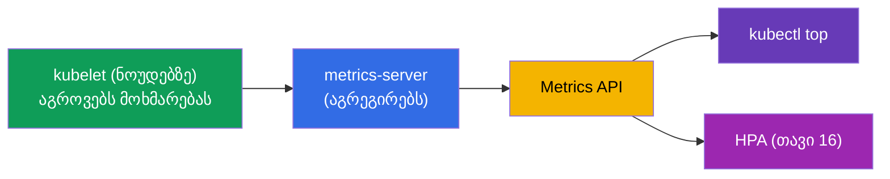
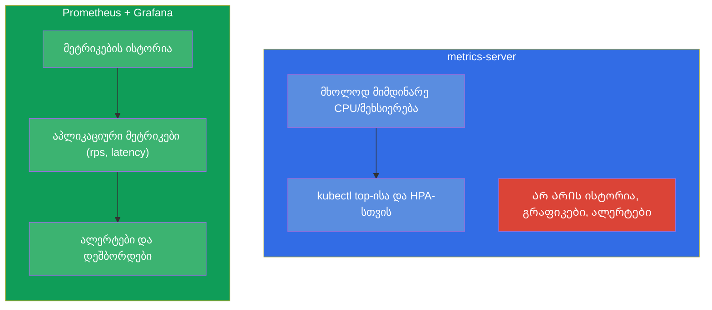
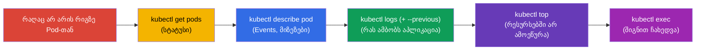

[Русская версия](ru.md) · [Eng version](README.md) · [Versión en español](es.md) · [Version française](fr.md) · [Deutsche Version](de.md) · [繁體中文版](tw.md) · [日本語版](jp.md)

# თავი 28. ლოგირება და მონიტორინგი: logs, metrics-server, kubectl top

> **რა იქნება შემდეგ.** პრობები (თავი 27) კლასტერს ჯანმრთელობის შესახებ ატყობინებენ. ხოლო როგორ
> ხედავთ **თქვენ**, რა ხდება? ლოგების (`kubectl logs`) და მეტრიკების (`kubectl top`
> metrics-server-ის ბაზაზე) მეშვეობით. ეს არის Observability-ის (CKAD) და
> Troubleshooting/Monitoring-ის (CKA) დომენი. თემა ბრძანებების მხრივ მარტივია, მაგრამ კრიტიკული:
> გამოცდაზე და ცხოვრებაში გამართვის 90% იწყება „ლოგების ნახვით“ და „მოხმარების ნახვით“.
> ამავდროულად გავიგებთ ლოგირების არქიტექტურას და Prometheus-ის ადგილს საერთო სურათში.

## 28.1. კონტეინერების ლოგები: საფუძვლები

Kubernetes აგროვებს იმას, რასაც კონტეინერი წერს **stdout/stderr**-ში. ეს ფუნდამენტური
პრინციპია: აპლიკაციამ კონტეინერში უნდა დაწეროს ლოგი სტანდარტულ გამონატანში და არა ფაილებში -
მაშინ `kubectl logs` და ლოგების შეგროვების სისტემები მათ დაინახავენ.



ლოგების ძირითადი ბრძანებები:

```bash
kubectl logs <pod>                    # Pod-ის ლოგები (ერთკონტეინერიანის)
kubectl logs <pod> -c <container>     # multi-container Pod-ის კონკრეტული კონტეინერი
kubectl logs <pod> -f                 # რეალურ დროში დაკვირვება (follow)
kubectl logs <pod> --previous         # წინა (ჩავარდნილი) კონტეინერის ლოგები
kubectl logs <pod> --tail=100         # ბოლო 100 სტრიქონი
kubectl logs <pod> --since=1h         # ბოლო საათის განმავლობაში
kubectl logs -l app=web --prefix      # ყველა Pod-ის ლოგები ლეიბლით, წყაროს პრეფიქსით
```

სად არიან ეს ფაილები ნოუდზე ფიზიკურად. რანთაიმი წერს რეალურ ფაილებს
`/var/log/pods/<namespace>_<pod>_<uid>/<container>/*.log`-ში, ხოლო გვერდით კატალოგი
`/var/log/containers/` შეიცავს **სიმლინკებს** მათზე მოსახერხებელი სახელებით. სწორედ ამ წყვილს
კითხულობენ ჩვეულებრივ ლოგ-აგენტები (Fluent Bit, Fluentd, Promtail), როცა აგროვებენ ლოგებს ყველა ნოუდიდან:



აქედან მნიშვნელოვანი შედეგი: `kubectl logs` კითხულობს **მიმდინარე** კონტეინერის ფაილს ნოუდზე, და
Pod-ის წაშლის ან ფაილის როტაციის დროს ეს ლოგები ქრება. ხანგრძლივ შენახვას უზრუნველყოფს
სწორედ გარე აგენტი, რომელიც ლოგებს ცენტრალიზებულ საცავში აგზავნის (თავი
Prometheus/ლოგირების სტეკის შესახებ - ქვემოთ).

### რამდენ ხანს ცოცხლობს ლოგი ნოუდზე და როგორ დავაკონფიგურიროთ ეს

ლოგის სიცოცხლის ხანგრძლივობას ნოუდზე განსაზღვრავს **არა დრო, არამედ ზომა**: როტაციას მართავს
**kubelet**, და არა აპლიკაცია. როცა მიმდინარე ფაილი ზღვრულ ზომამდე იზრდება, ის
როტირდება, ხოლო ყველაზე ძველი როტირებული ფაილები იშლება. ნაგულისხმევი მნიშვნელობები:

- `containerLogMaxSize` - **10Mi** (ფაილის ზომა, რომელზეც ხდება როტაცია);
- `containerLogMaxFiles` - **5** (რამდენი ფაილი შეინახოს კონტეინერზე).

ანუ ნაგულისხმევად კონტეინერზე ინახება დაახლოებით `5 × 10Mi ≈ 50Mi`, ხოლო „რამდენია ეს
საათებში/დღეებში“ სრულიად დამოკიდებულია იმაზე, რამდენად ინტენსიურად წერს აპლიკაცია ლოგებს:
მოლაპარაკე სერვისი თავის ძველ ლოგებს წუთებში გადაწერს, ჩუმი - დღეობით შეინახავს მათ.
დროის მიხედვით ცალკე TTL არ არსებობს, ხოლო Pod-ის წაშლისას ფაილები ნებისმიერ შემთხვევაში იშლება.

ეს კონფიგურირდება **kubelet-ის კონფიგურაციაში** (`KubeletConfiguration`, გამოიყენება
ნოუდზე kubelet-ის სტარტის დროს):

```yaml
# /var/lib/kubelet/config.yaml (ფრაგმენტი)
apiVersion: kubelet.config.k8s.io/v1beta1
kind: KubeletConfiguration
containerLogMaxSize: "50Mi"   # როტაცია 50 მიბ-ზე
containerLogMaxFiles: 5        # შეინახოს 5 ფაილამდე კონტეინერზე
```

ძველი ფლაგები `--container-log-max-size` და `--container-log-max-files` იმავეს აკეთებენ, მაგრამ
მოძველებულად ითვლება - სასურველია კონფიგურაციის ფაილი. პრაქტიკული წესი: ჯამური
მოცულობა (`containerLogMaxSize × containerLogMaxFiles`) კონტეინერზე მცირედ ინახება (ჩვეულებრივ
ნოუდის დისკის ~1%-მდე), რომ ლოგებმა დისკი არ ამოაწურონ და არ გამოიწვიონ disk-pressure eviction (თავი 15).

## 28.2. --previous: ჩავარდნილი კონტეინერის ლოგები

ცალკე `--previous`-ის შესახებ - ეს გადარჩენაა `CrashLoopBackOff`-ის გამართვისას. როცა კონტეინერი
ჩავარდა და გადაიტვირთა, ჩვეულებრივი `kubectl logs` აჩვენებს **ახალი** კონტეინერის ლოგებს (რომელიც
ახლახან ისტარტავს). ხოლო ჩავარდნის მიზეზი - **წინა**, უკვე მკვდარი კონტეინერის ლოგებშია. მათ იღებს
`--previous`:



`CrashLoopBackOff`-ის დროს რეფლექსი ასეთია: `kubectl logs <pod> --previous` - და თითქმის ყოველთვის
სწორედ იქ ჩანს, რატომ ჩავარდა აპლიკაცია.

> **და თუ Pod ბევრჯერ გადაიტვირთა და ცენტრალიზებული საცავი არ არის?** `--previous`
> გასცემს მხოლოდ **ერთი** წინა გაშვების ლოგებს (მიმდინარეს წინა ბოლოსი), უფრო
> ადრეულებს `kubectl logs`-ით ვერ მიიღებ. მაგრამ ნოუდზე მათი პირდაპირ მოძებნა ხშირად შესაძლებელია: ყოველი
> კონტეინერის გადატვირთვა დებს ცალკე ფაილს
> `/var/log/pods/<namespace>_<pod>_<uid>/<container>/`-ში, დასახელებულს გადატვირთვების
> მრიცხველით - `0.log`, `1.log`, `2.log` და ა.შ. (ძველები დამატებით შეკუმშულია როტაციით). მაშასადამე
> რამდენიმე წარსული ჩავარდნის ლოგები შეიძლება იქ იწვეს, სანამ მათ როტაცია არ გამოდევნის.
>
> ამ ფაილებამდე მისვლაში, SSH-ით შესვლის გარეშე, დაგეხმარებათ სადიაგნოსტიკო Pod ნოუდზე:
>
> ```bash
> kubectl debug node/<node> -it --image=busybox
> # შიგნით: ნოუდის ფაილური სისტემა მონტირებულია /host-ში
> ls /host/var/log/pods/<namespace>_<pod>_<uid>/<container>/
> cat /host/var/log/pods/<namespace>_<pod>_<uid>/<container>/1.log
> ```
>
> ან თავად ნოუდზე - რანთაიმის მეშვეობით: `crictl ps -a` (ID-ის მოსაძებნად) და `crictl logs <id>`.
>
> მნიშვნელოვანი შეზღუდვები: ფაილები მიბმულია **Pod-ის UID**-ზე - თუ Pod **წაშლილია** (და არა უბრალოდ
> გადატვირთული), ლოგების მთელი კატალოგი ქრება; როტაცია ინახავს მხოლოდ ბოლო
> `containerLogMaxFiles` ფაილს; ხოლო თუ Pod სხვა ნოუდზე გადავიდა, ძებნა წინაზე უწევს.
> ამიტომ node-local ლოგები - მხოლოდ დროებითი დაზღვევაა: ჩავარდნების ისტორიის დაკარგვის თავიდან
> ასარიდებლად ერთადერთი საიმედო გზა - ლოგების ცენტრალიზებული შეგროვებაა (აგენტი → გარე საცავი).

## 28.3. ლოგირების არქიტექტურა კლასტერში

`kubectl logs` კარგია ერთი Pod-ის გამართვისთვის, მაგრამ მას აქვს ზღვარი: ლოგები ინახება
ნოუდზე და **ქრება Pod-თან ერთად**. წაშალე Pod - ლოგები დაკარგულია; ყველა
Pod-ში ერთდროულად ძებნა შეუძლებელია. პროდისთვის საჭიროა ცენტრალიზებული აგრეგაცია.



ლოგებს აგროვებს **აგენტი ყოველ ნოუდზე** (ჩვეულებრივ DaemonSet - თავი 11, მაგალითად Fluent Bit)
და აგზავნის ცენტრალიზებულ საცავში (Elasticsearch, Loki, ღრუბლოვანი ლოგები), სადაც მათში
შესაძლებელია ძებნა და დეშბორდების აწყობა. ეს სტანდარტული სქემაა; გამოცდაზე საკმარისია `kubectl
logs`, მაგრამ არქიტექტურის გაგება საჭიროა.

## 28.4. metrics-server და kubectl top

ლოგები - ეს არის „რას ამბობს აპლიკაცია“, მეტრიკები - „რამდენს ჭამს ის“. ბაზისურ მეტრიკებს
(CPU/მეხსიერება) იძლევა **metrics-server** (ჩვენ მას უკვე შევხვდით თავ 16-ში - ის HPA-სთვისაა საჭირო).
ის აგროვებს მოხმარებას ყოველი ნოუდის kubelet-იდან და გასცემს Metrics API-ს მეშვეობით.



```bash
# შემოწმება, არის თუ არა metrics-server
kubectl get deployment metrics-server -n kube-system

# რესურსების მოხმარება
kubectl top nodes                     # CPU/მეხსიერება ნოუდების მიხედვით
kubectl top pods                      # Pod-ების მიხედვით
kubectl top pods -A                   # ყველა namespace-ში
kubectl top pods --sort-by=memory     # დახარისხება მეხსიერების მიხედვით
kubectl top pods --containers         # Pod-ების შიგნით კონტეინერების მიხედვით
```

> **მნიშვნელოვანია.** `kubectl top` მუშაობს **მხოლოდ** დაყენებული metrics-server-ის შემთხვევაში. თუ ის
> გასცემს შეცდომას `Metrics API not available` - metrics-server არ არის დაყენებული ან არ
> მუშაობს. ეს იგივე პირობაა, რაც HPA-სთვის (თავი 16).

## 28.5. metrics-server - არ არის მონიტორინგის სისტემა

ხშირი მცდარი წარმოდგენა: metrics-server არ ინახავს ისტორიას და არ ანაცვლებს მონიტორინგს. ის იძლევა
მხოლოდ **მიმდინარე** მყისიერ CPU/მეხსიერების მოხმარებას (`top`-ისა და HPA-სთვის). არც ისტორიას, არც
გრაფიკებს, არც ალერტებს, არც აპლიკაციურ მეტრიკებს ის არ იძლევა.



ნამდვილი მონიტორინგისთვის (ისტორია, გრაფიკები, ალერტები, თვითნებური მეტრიკები) იყენებენ
**Prometheus**-ს (მეტრიკების შეგროვება და შენახვა) + **Grafana**-ს (ვიზუალიზაცია) + Alertmanager-ს
(ალერტები). აპლიკაციები მეტრიკებს Prometheus-ის ფორმატში გასცემენ (ხანდახან adapter-sidecar-ის მეშვეობით -
თავი 22). ეს დაკვირვებადობის სტანდარტია, მაგრამ CKA/CKAD-ის მოცულობაში ღრმად არ შედის - საკმარისია
metrics-server-თან განსხვავების ცოდნა.

## 28.6. სადიაგნოსტიკო ციკლი: ლოგები + მეტრიკები + describe

შევკრიბოთ დაკვირვებადობის ინსტრუმენტები გამართვის ერთიან რეფლექსში (ის ნაწილ 9-ში გამოგადგებათ):



ეს რიგი - `get → describe → logs → top → exec` - Pod-თან დაკავშირებული თითქმის ყველა პრობლემის
გარჩევის უნივერსალური ალგორითმია. ყოველი ნაბიჯი ავიწროებს მიზეზების წრეს.

## 28.7. როგორ იყენებენ ამას პროდაქშენში

- **აპლიკაციები ლოგავენ stdout/stderr-ში.** ეს ცენტრალიზებული შეგროვების მუშაობის პირობაა:
  აპლიკაცია წერს სტანდარტულ გამონატანში და არა ფაილებში კონტეინერის შიგნით. ლოგები
  კონტეინერის ფაილებში - ანტიპატერნია (მათ ვერ შეაგროვებენ და Pod-თან ერთად დაიკარგება).
- **ცენტრალიზებული აგრეგაცია სავალდებულოა.** პროდში `kubectl logs` - მხოლოდ სწრაფი
  გამართვისთვის; ნამდვილი ძებნა აგრეგირებულ ლოგებში მიდის (Loki/ELK/ღრუბელი), რადგან
  Pod-ების ლოგები ეფემერულია და ნოუდებზეა გაბნეული.
- **Prometheus + Grafana მეტრიკების სტანდარტად.** metrics-server - მხოლოდ `top`/HPA-სთვისაა; ხოლო
  ისტორიის, დეშბორდებისა და ალერტებისთვის Prometheus/Grafana-ში მიდიან. აპლიკაციური მეტრიკები (rps,
  latency, შეცდომები) - SLO-სა და ალერტინგის საფუძველია.
- **სტრუქტურირებული ლოგები და კორელაცია.** პროდში ლოგავენ სტრუქტურირებულად (JSON) და
  ამატებენ კონტექსტს (Pod-ის, ნოუდის სახელი Downward API-ს მეშვეობით - თავი 17), რომ ინციდენტის გარჩევისას
  დააკავშირონ ლოგები, მეტრიკები და ტრეისები.
- **ტრასირება.** სრული დაკვირვებადობა - ეს არის „სამი საყრდენი“: ლოგები + მეტრიკები + ტრეისები
  (OpenTelemetry/Jaeger). CKA/CKAD-სთვის საკმარისია ლოგები და მეტრიკები, მაგრამ რეალურ
  ექსპლუატაციაში ემატება განაწილებული ტრასირება.

## 28.8. მინი-ლექსიკონი

- **stdout/stderr** - კონტეინერის სტანდარტული გამონატანი, საიდანაც Kubernetes იღებს ლოგებს.
- **kubectl logs** - Pod-ის/კონტეინერის ლოგების ნახვა.
- **--previous** - წინა (ჩავარდნილი) კონტეინერის ლოგები.
- **metrics-server** - აგროვებს Pod-ებისა და ნოუდების მიმდინარე CPU/მეხსიერებას; `top`-ისა და HPA-სთვის.
- **kubectl top** - რესურსების მოხმარების ჩვენება (საჭიროა metrics-server).
- **Fluent Bit/Fluentd** - ლოგების შეგროვების აგენტები (ჩვეულებრივ DaemonSet).
- **Prometheus / Grafana** - მეტრიკების შეგროვება/შენახვა და ვიზუალიზაცია (ნამდვილი მონიტორინგი).
- **დაკვირვებადობის სამი საყრდენი** - ლოგები, მეტრიკები, ტრეისები.

## 28.9. თავის შეჯამება

- Kubernetes აგროვებს კონტეინერების stdout/stderr-ს; აპლიკაციამ ლოგი სწორედ იქ უნდა დაწეროს, და არა
  ფაილებში.
- `kubectl logs` (+ `-c`, `-f`, `--tail`, `--since`, `-l`) - ბაზისური ინსტრუმენტია;
  `--previous` აჩვენებს ჩავარდნილი კონტეინერის ლოგებს (გასაღები CrashLoopBackOff-ისთვის).
- Pod-ის ლოგები ეფემერულია (ქრება Pod-თან ერთად); პროდში მათ აგროვებს აგენტი ნოუდზე (Fluent Bit,
  DaemonSet) ცენტრალიზებულ საცავში.
- metrics-server იძლევა მიმდინარე CPU/მეხსიერებას `kubectl top`-ისა და HPA-სთვის; მის გარეშე `top` არ
  მუშაობს.
- metrics-server - არ არის მონიტორინგი: არც ისტორია, არც ალერტები; ამისთვის Prometheus + Grafana.
- გამართვის უნივერსალური ციკლი: get → describe → logs (--previous) → top → exec.

## 28.10. როგორ გამოგადგებათ: გამოცდაზე და რეალურ სამუშაოში

**გამოცდაზე.** „ნახე Pod-ის ლოგები“, „მოძებნე შეცდომა ჩავარდნილ კონტეინერში“
(`--previous`), „გამოიტანე Pod ყველაზე დიდი მოხმარებით“ (`kubectl top --sort-by`) -
მუდმივი დავალებებია. `kubectl logs` და `describe` - troubleshooting-ის დომენის (CKA-ს 30%)
მთავარი ინსტრუმენტია. უნდა გვახსოვდეს, რომ `top` მოითხოვს metrics-server-ს.

**რეალურ სამუშაოში.** ლოგები და მეტრიკები - პირველია, რასაც მორიგე ინციდენტის დროს მიმართავს.
იმის გაგება, რომ ლოგები ეფემერულია და ცენტრალიზებული აგრეგაცია საჭიროა, ხოლო metrics-server - არ არის
მონიტორინგი, სწორ დაკვირვებადობის არქიტექტურამდე მიგვიყვანს (Fluent Bit + Loki/ELK,
Prometheus + Grafana). სადიაგნოსტიკო ციკლი get→describe→logs→top - ყოველდღიური უნარია.

## 28.11. თვითშემოწმების კითხვები

1. სად უნდა დაწეროს ლოგი აპლიკაციამ, რომ `kubectl logs`-მა და შემგროვებლებმა ის დაინახონ?
2. რითი განსხვავდება `kubectl logs --previous` ჩვეულებრივისგან და როდის არის ის შეუცვლელი?
3. რატომ არ არის `kubectl logs` საკმარისი პროდისთვის და როგორ არის მოწყობილი ცენტრალიზებული აგრეგაცია?
4. რას იძლევა metrics-server და რა შეწყვეტს მუშაობას მის გარეშე?
5. რატომ არ არის metrics-server მონიტორინგის სისტემა? რა გამოვიყენოთ მის ნაცვლად?
6. აღწერეთ Pod-ის გამართვის უნივერსალური ციკლი ნაბიჯების მიხედვით.
7. რა არის „დაკვირვებადობის სამი საყრდენი“?

## პრაქტიკა

ჩვენ ავითვისეთ კლასტერზე დაკვირვება. თავ 29-ში დავხურავთ ნაწილ 6-ს აპლიკაციების გამართვისა და
API-ს მოძველების თემით (სადიაგნოსტიკო ephemeral-კონტეინერების ჩათვლით). ლოგები და მეტრიკები
მუშავდება დაკვირვებადობის ლაბებში.

🧪 ლაბი 109 (logs, metrics-server, kubectl top): [tasks/cka/labs/109](../../labs/109/README_GE.MD)

🎮 Killercoda (ბრაუზერში, ინსტალაციის გარეშე): [Logging in Kubernetes](https://killercoda.com/chadmcrowell/course/ckad/logging) · [Monitoring Kubernetes with Metrics Server](https://killercoda.com/chadmcrowell/course/ckad/metrics-server) · [Describe Pod Events](https://killercoda.com/chadmcrowell/course/ckad/describe-events)

---
[სარჩევი](../README_GE.md) · [თავი 27](../27/ge.md) · [თავი 29](../29/ge.md)
