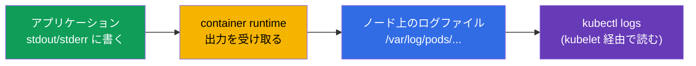
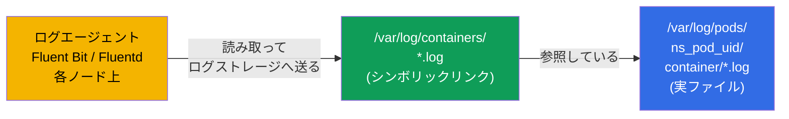
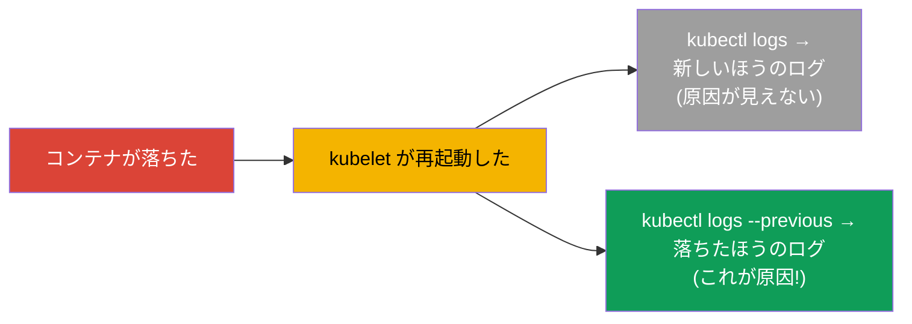
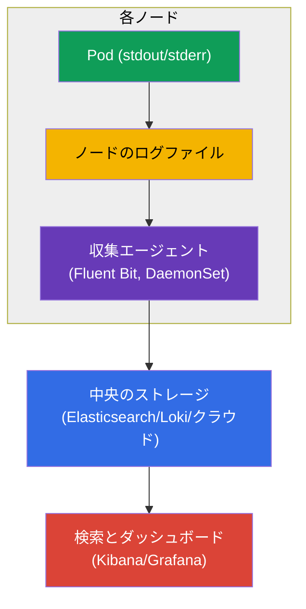
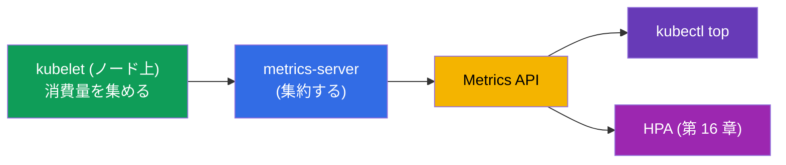
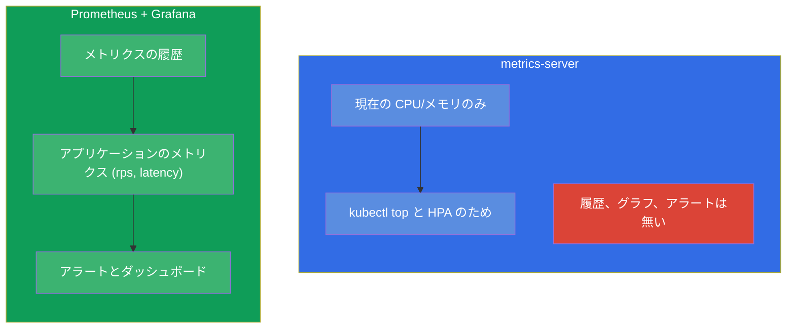
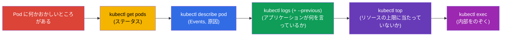

[Русская версия](ru.md) · [Eng version](README.md) · [Versión en español](es.md) · [Version française](fr.md) · [Deutsche Version](de.md) · [ქართული ვერსია](ge.md) · [繁體中文版](tw.md)

# 第 28 章。ロギングとモニタリング：logs、metrics-server、kubectl top

> **次は何か。** プローブ（第 27 章）はクラスタに健全性を伝えます。では **あなた** は
> 何が起きているかをどう見るのでしょうか。ログ (`kubectl logs`) とメトリクス
> (metrics-server を土台にした `kubectl top`) を通して見ます。これは Observability
> 領域 (CKAD) と Troubleshooting/Monitoring 領域 (CKA) です。コマンドとしては
> 単純なテーマですが、決定的に重要です：試験でも実務でもデバッグの 90% は
> 「ログを見る」と「消費量を見る」から始まります。あわせてロギングのアーキテクチャと、
> 全体像のなかでの Prometheus の位置も理解しましょう。

## 28.1. コンテナのログ：基本

Kubernetes はコンテナが **stdout/stderr** に書いたものを集めます。これは基本原則です：
コンテナ内のアプリケーションはファイルではなく標準出力にログを書くべきで、そうすれば
`kubectl logs` とログ収集システムがそれを見られます。



ログの基本コマンド：

```bash
kubectl logs <pod>                    # Pod のログ (単一コンテナ)
kubectl logs <pod> -c <container>     # multi-container Pod の特定のコンテナ
kubectl logs <pod> -f                 # リアルタイムで追跡する (follow)
kubectl logs <pod> --previous         # 直前の (落ちた) コンテナのログ
kubectl logs <pod> --tail=100         # 最後の 100 行
kubectl logs <pod> --since=1h         # 直近 1 時間分
kubectl logs -l app=web --prefix      # ラベルで選んだ全 Pod のログ、送信元のプレフィックス付き
```

これらのファイルはノード上で物理的にどこにあるのか。ランタイムは実際のファイルを
`/var/log/pods/<namespace>_<pod>_<uid>/<container>/*.log` に書き、その隣のディレクトリ
`/var/log/containers/` はそれらへの **シンボリックリンク** を扱いやすい名前で持っています。
ログエージェント (Fluent Bit、Fluentd、Promtail) が全ノードからログを集めるとき、
通常はまさにこのペアを読みます：



ここから重要な帰結が出ます：`kubectl logs` はノード上の **現在の** コンテナのファイルを
読むため、Pod を削除したりファイルがローテートされたりすると、それらのログは消えます。
長期保存を担うのは、ログを中央のストレージへ送る外部エージェントです（Prometheus /
ロギングスタックの話は下記）。

### ログはノード上でどれだけ生き残るか、そしてその設定方法

ノード上でのログの寿命は **時間ではなくサイズ** で決まります：ローテーションを管理するのは
アプリケーションではなく **kubelet** です。現在のファイルが上限サイズまで育つと
ローテートされ、もっとも古いローテート済みファイルが削除されます。デフォルト値：

- `containerLogMaxSize` - **10Mi**（ローテーションが起きるファイルサイズ）;
- `containerLogMaxFiles` - **5**（コンテナごとに保持するファイル数）。

つまりデフォルトではコンテナごとにおよそ `5 × 10Mi ≈ 50Mi` が保持され、「それが何時間 /
何日ぶんか」はアプリケーションがどれだけ激しくログを書くかに完全に依存します：
おしゃべりなサービスは数分で自分の古いログを上書きし、静かなサービスは何日も保持します。
時間による独立した TTL はなく、Pod を削除すればファイルはいずれにせよ消えます。

これは **kubelet の設定** (`KubeletConfiguration`、ノード上で kubelet 起動時に適用される)
で設定します：

```yaml
# /var/lib/kubelet/config.yaml (抜粋)
apiVersion: kubelet.config.k8s.io/v1beta1
kind: KubeletConfiguration
containerLogMaxSize: "50Mi"   # 50 MiB でローテーション
containerLogMaxFiles: 5        # コンテナごとに最大 5 ファイル保持
```

古いフラグ `--container-log-max-size` と `--container-log-max-files` も同じことをしますが、
非推奨とされています - 設定ファイルのほうが望ましいです。実践的な指針：コンテナごとの
合計サイズ (`containerLogMaxSize × containerLogMaxFiles`) は小さく保ちます（通常は
ノードのディスクの ~1% まで）。ログがディスクを埋めて disk-pressure eviction
（第 15 章）を引き起こさないようにするためです。

## 28.2. --previous：落ちたコンテナのログ

`--previous` について別に触れます - これは `CrashLoopBackOff` のデバッグでの救いです。
コンテナが落ちて再起動したとき、通常の `kubectl logs` は **新しい** コンテナ（まだ
起動したばかり）のログを表示します。ところが落ちた原因は、すでに死んでいる **直前の**
コンテナのログのなかにあります。それを取り出すのが `--previous` です：



`CrashLoopBackOff` のときの反射はこうです：`kubectl logs <pod> --previous` - そして
ほぼ必ずそこに、アプリケーションが落ちた理由が見えます。

> **では Pod が何度も再起動していて、中央のストレージがない場合は？** `--previous` が
> 返すのは **1 つ** 前の起動（現在の直前のもの）のログだけで、それより前のものは
> `kubectl logs` では取れません。しかしノード上では直接見つけられることがよくあります：
> コンテナの再起動ごとに
> `/var/log/pods/<namespace>_<pod>_<uid>/<container>/` に個別のファイルが置かれ、
> 再起動カウンタにちなんで `0.log`、`1.log`、`2.log` などと名付けられます（古いものは
> さらにローテーションで圧縮されます）。つまり過去の複数回のクラッシュのログが、
> ローテーションに追い出されるまではそこに残っている可能性があります。
>
> SSH で入らずにこれらのファイルへたどり着くには、ノード上のデバッグ用 Pod が役立ちます：
>
> ```bash
> kubectl debug node/<node> -it --image=busybox
> # 内部では: ノードのファイルシステムが /host にマウントされている
> ls /host/var/log/pods/<namespace>_<pod>_<uid>/<container>/
> cat /host/var/log/pods/<namespace>_<pod>_<uid>/<container>/1.log
> ```
>
> あるいはノード自身の上で、ランタイム経由で：`crictl ps -a`（ID を探す）と
> `crictl logs <id>`。
>
> 重要な制約：ファイルは **Pod の UID** に結びついています - Pod が（単に再起動された
> のではなく）**削除された** 場合、ログのディレクトリごと消えます。ローテーションが
> 保持するのは最後の `containerLogMaxFiles` 個のファイルだけです。また Pod が別の
> ノードへ移った場合は、以前のノードで探す必要があります。ですから node-local な
> ログは一時的な保険にすぎません：クラッシュの履歴を失わない唯一の確実な方法は、
> 中央でのログ収集（エージェント → 外部ストレージ）です。

## 28.3. クラスタにおけるロギングのアーキテクチャ

`kubectl logs` は 1 つの Pod をデバッグするには良いのですが、限界があります：ログは
ノード上に保存され、**Pod と一緒に消えます**。Pod を削除すればログは失われますし、
すべての Pod をまとめて検索することもできません。本番環境では中央での集約が必要です。



ログは **各ノード上のエージェント**（通常は DaemonSet - 第 11 章、たとえば Fluent Bit）
が集め、中央のストレージ (Elasticsearch、Loki、クラウドのログ) へ送ります。そこでは
検索したりダッシュボードを組み立てたりできます。これは標準的な構成です。試験では
`kubectl logs` で十分ですが、アーキテクチャは理解しておく必要があります。

## 28.4. metrics-server と kubectl top

ログは「アプリケーションが何を言っているか」、メトリクスは「どれだけ食べているか」です。
基本的なメトリクス (CPU / メモリ) を提供するのが **metrics-server** です（第 16 章で
すでに出会いました - HPA に必要でした）。これは各ノードの kubelet から消費量を集め、
Metrics API 経由で返します。



```bash
# metrics-server があるか確認する
kubectl get deployment metrics-server -n kube-system

# リソースの消費量
kubectl top nodes                     # ノードごとの CPU/メモリ
kubectl top pods                      # Pod ごと
kubectl top pods -A                   # 全 namespace で
kubectl top pods --sort-by=memory     # メモリでソート
kubectl top pods --containers         # Pod 内のコンテナごと
```

> **重要。** `kubectl top` は metrics-server がインストールされている場合に **のみ**
> 動きます。`Metrics API not available` というエラーが出るなら、metrics-server が
> インストールされていないか動いていません。これは HPA と同じ条件です（第 16 章）。

## 28.5. metrics-server はモニタリングシステムではない

よくある誤解：metrics-server は履歴を保存せず、モニタリングを置き換えるものでもありません。
提供するのは **現在の** 瞬間的な CPU / メモリ消費量だけです（`top` と HPA のため）。
履歴もグラフもアラートもアプリケーションのメトリクスも提供しません。



本物のモニタリング（履歴、グラフ、アラート、任意のメトリクス）には **Prometheus**
（メトリクスの収集と保存）+ **Grafana**（可視化）+ Alertmanager（アラート）を使います。
アプリケーションは Prometheus 形式でメトリクスを公開します（ときには adapter-sidecar
経由で - 第 22 章）。これは可観測性の標準ですが、CKA/CKAD の範囲には深くは入りません -
metrics-server との違いを知っていれば十分です。

## 28.6. デバッグのサイクル：ログ + メトリクス + describe

可観測性のツールを 1 つのデバッグの反射としてまとめましょう（パート 9 で役に立ちます）：



この順序 - `get → describe → logs → top → exec` - は、Pod に関するほぼどんな問題でも
解析できる汎用のアルゴリズムです。各ステップが原因の範囲を狭めていきます。

## 28.7. 本番環境でこれをどう使うか

- **アプリケーションは stdout/stderr にログを書く。** これは中央での収集が機能する
  ための条件です：アプリケーションはコンテナ内のファイルではなく標準出力に書きます。
  コンテナのファイルへのログはアンチパターンです（収集されず、Pod と一緒に消えます）。
- **中央での集約は必須。** 本番では `kubectl logs` は素早いデバッグのためだけのもので、
  本物の検索は集約されたログ (Loki/ELK/クラウド) に対して行います。Pod のログは
  短命でノード上に散らばっているからです。
- **メトリクスの標準としての Prometheus + Grafana。** metrics-server は `top`/HPA の
  ためだけのものです。履歴、ダッシュボード、アラートは Prometheus/Grafana に行きます。
  アプリケーションのメトリクス (rps、latency、エラー) は SLO とアラートの土台です。
- **構造化ログと相関付け。** 本番では構造化して (JSON) ログを書き、コンテキスト
  (Pod 名、ノード名を Downward API 経由で - 第 17 章) を加えて、インシデント解析の
  ときにログ、メトリクス、トレースを結びつけられるようにします。
- **トレーシング。** 完全な可観測性とは「三本柱」です：ログ + メトリクス + トレース
  (OpenTelemetry/Jaeger)。CKA/CKAD にはログとメトリクスで十分ですが、実際の運用では
  分散トレーシングが加わります。

## 28.8. ミニ用語集

- **stdout/stderr** - コンテナの標準出力。Kubernetes はそこからログを取ります。
- **kubectl logs** - Pod / コンテナのログを見ること。
- **--previous** - 直前の（落ちた）コンテナのログ。
- **metrics-server** - Pod とノードの現在の CPU / メモリを集めるもの。`top` と HPA のため。
- **kubectl top** - リソースの消費量を表示する（metrics-server が必要）。
- **Fluent Bit/Fluentd** - ログ収集のエージェント（通常は DaemonSet）。
- **Prometheus / Grafana** - メトリクスの収集 / 保存と可視化（本物のモニタリング）。
- **可観測性の三本柱** - ログ、メトリクス、トレース。

## 28.9. 本章のまとめ

- Kubernetes はコンテナの stdout/stderr を集めます。アプリケーションはファイルでは
  なくそこにログを書くべきです。
- `kubectl logs` (+ `-c`、`-f`、`--tail`、`--since`、`-l`) は基本のツールです。
  `--previous` は落ちたコンテナのログを表示します (CrashLoopBackOff の鍵)。
- Pod のログは短命です（Pod と一緒に消えます）。本番ではノード上のエージェント
  (Fluent Bit、DaemonSet) がそれを中央のストレージへ集めます。
- metrics-server は `kubectl top` と HPA のために現在の CPU / メモリを提供します。
  それがないと `top` は動きません。
- metrics-server はモニタリングではありません：履歴もアラートもありません。それには
  Prometheus + Grafana。
- 汎用のデバッグサイクル：get → describe → logs (--previous) → top → exec。

## 28.10. これがどう役に立つか：試験と実際の仕事で

**試験では。** 「Pod のログを見よ」「落ちたコンテナのエラーを見つけよ」(`--previous`)、
「消費量が最大の Pod を出力せよ」(`kubectl top --sort-by`) - これらは定番の問題です。
`kubectl logs` と `describe` は troubleshooting 領域 (CKA の 30%) の主要なツールです。
`top` には metrics-server が必要だということを覚えておきましょう。

**実際の仕事では。** ログとメトリクスは、インシデントのときに当番のエンジニアが最初に
参照するものです。ログは短命であり中央での集約が必要だということ、そして
metrics-server はモニタリングではないということの理解が、正しい可観測性の
アーキテクチャ (Fluent Bit + Loki/ELK、Prometheus + Grafana) につながります。
デバッグのサイクル get→describe→logs→top は毎日使うスキルです。

## 28.11. 自己チェックの質問

1. `kubectl logs` と収集エージェントがログを見られるように、アプリケーションはどこにログを書くべきですか？
2. `kubectl logs --previous` は通常のものとどう違い、どんなときに代えがたいものになりますか？
3. なぜ本番では `kubectl logs` では足りないのですか。中央での集約はどう構成されていますか？
4. metrics-server は何を提供し、それがないと何が動かなくなりますか？
5. なぜ metrics-server はモニタリングシステムではないのですか。代わりに何を使いますか？
6. Pod の汎用のデバッグサイクルをステップごとに説明してください。
7. 「可観測性の三本柱」とは何ですか？

## 演習

クラスタの観測を身につけました。第 29 章ではアプリケーションのデバッグと API の廃止
（診断のための ephemeral コンテナを含む）というテーマでパート 6 を締めます。ログと
メトリクスは可観測性関連のラボで練習します。

🧪 ラボ 109 (logs, metrics-server, kubectl top): [tasks/cka/labs/109](../../labs/109/README_JP.MD)

---
[目次](../README_JP.md) · [第 27 章](../27/jp.md) · [第 29 章](../29/jp.md)
