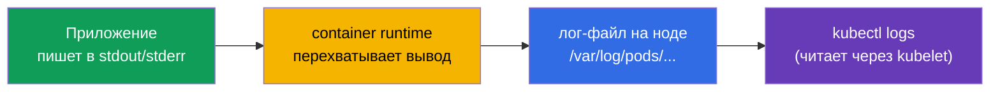
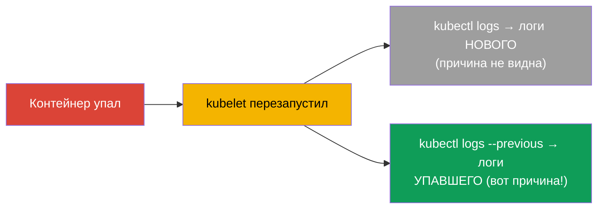
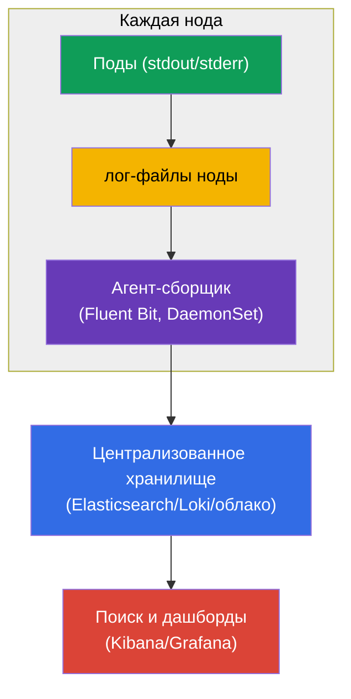
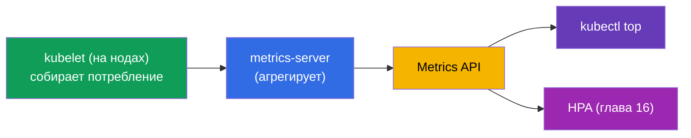
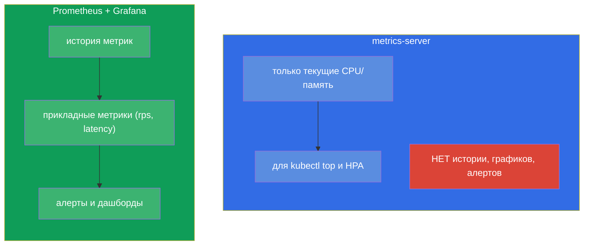
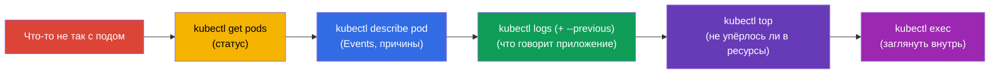

# Глава 28. Логирование и мониторинг: logs, metrics-server, kubectl top

> **Что дальше.** Пробы (глава 27) сообщают кластеру о здоровье. А как **вы** смотрите,
> что происходит? Через логи (`kubectl logs`) и метрики (`kubectl top` на базе
> metrics-server). Это домен Observability (CKAD) и Troubleshooting/Monitoring (CKA).
> Тема простая по командам, но критичная: 90% отладки на экзамене и в жизни начинается с
> «посмотреть логи» и «посмотреть потребление». Заодно поймём архитектуру логирования и
> место Prometheus в общей картине.

## 28.1. Логи контейнеров: основы

Kubernetes собирает то, что контейнер пишет в **stdout/stderr**. Это фундаментальный
принцип: приложение в контейнере должно логировать в стандартный вывод, а не в файлы -
тогда `kubectl logs` и системы сбора логов их увидят.



Основные команды логов:

```bash
kubectl logs <pod>                    # логи пода (одноконтейнерного)
kubectl logs <pod> -c <container>     # конкретный контейнер multi-container пода
kubectl logs <pod> -f                 # следить в реальном времени (follow)
kubectl logs <pod> --previous         # логи ПРЕДЫДУЩЕГО (упавшего) контейнера
kubectl logs <pod> --tail=100         # последние 100 строк
kubectl logs <pod> --since=1h         # за последний час
kubectl logs -l app=web --prefix      # логи всех подов по метке, с префиксом источника
```

## 28.2. --previous: логи упавшего контейнера

Отдельно про `--previous` - это спасение при отладке `CrashLoopBackOff`. Когда контейнер
упал и перезапустился, обычный `kubectl logs` покажет логи **нового** контейнера (который
только стартует). А причина падения - в логах **предыдущего**, уже мёртвого. Их достаёт
`--previous`:



При `CrashLoopBackOff` рефлекс такой: `kubectl logs <pod> --previous` - и почти всегда
там видно, почему приложение упало.

## 28.3. Архитектура логирования в кластере

`kubectl logs` хорош для отладки одного пода, но у него есть предел: логи хранятся на
ноде и **исчезают вместе с подом**. Удалили под - логи потеряны; нельзя искать по всем
подам сразу. Для прода нужна централизованная агрегация.



Логи собирает **агент на каждой ноде** (обычно DaemonSet - глава 11, например Fluent Bit)
и отправляет в централизованное хранилище (Elasticsearch, Loki, облачные логи), где по ним
можно искать и строить дашборды. Это стандартная схема; на экзамене хватает `kubectl
logs`, но понимать архитектуру нужно.

## 28.4. metrics-server и kubectl top

Логи - это «что говорит приложение», метрики - это «сколько оно ест». Базовые метрики
(CPU/память) даёт **metrics-server** (мы его уже встречали в главе 16 - он нужен для HPA).
Он собирает потребление с kubelet каждой ноды и отдаёт через Metrics API.



```bash
# Проверить, есть ли metrics-server
kubectl get deployment metrics-server -n kube-system

# Потребление ресурсов
kubectl top nodes                     # CPU/память по нодам
kubectl top pods                      # по подам
kubectl top pods -A                   # во всех namespace
kubectl top pods --sort-by=memory     # сортировка по памяти
kubectl top pods --containers         # по контейнерам внутри подов
```

> **Важно.** `kubectl top` работает **только** при установленном metrics-server. Если он
> выдаёт ошибку `Metrics API not available` - metrics-server не установлен или не
> работает. Это то же условие, что и для HPA (глава 16).

## 28.5. metrics-server - не система мониторинга

Частое заблуждение: metrics-server не хранит историю и не заменяет мониторинг. Он даёт
только **текущее** мгновенное потребление CPU/памяти (для `top` и HPA). Ни истории, ни
графиков, ни алертов, ни прикладных метрик он не даёт.



Для настоящего мониторинга (история, графики, алерты, произвольные метрики) используют
**Prometheus** (сбор и хранение метрик) + **Grafana** (визуализация) + Alertmanager
(алерты). Приложения отдают метрики в формате Prometheus (иногда через adapter-sidecar -
глава 22). Это стандарт наблюдаемости, но в объём CKA/CKAD глубоко не входит - достаточно
знать разницу с metrics-server.

## 28.6. Отладочный цикл: логи + метрики + describe

Соберём инструменты наблюдаемости в единый рефлекс отладки (он пригодится в части 9):



Этот порядок - `get → describe → logs → top → exec` - универсальный алгоритм разбора почти
любой проблемы с подом. Каждый шаг сужает круг причин.

## 28.7. Как это применяют в продакшене

- **Приложения логируют в stdout/stderr.** Это условие для работы централизованного
  сбора: приложение пишет в стандартный вывод, а не в файлы внутри контейнера. Логи в
  файлы контейнера - антипаттерн (их не соберут и они пропадут с подом).
- **Централизованная агрегация обязательна.** В проде `kubectl logs` - только для быстрой
  отладки; настоящий поиск идёт по агрегированным логам (Loki/ELK/облако), потому что логи
  подов эфемерны и разбросаны по нодам.
- **Prometheus + Grafana как стандарт метрик.** metrics-server - лишь для `top`/HPA; за
  историей, дашбордами и алертами идут в Prometheus/Grafana. Прикладные метрики (rps,
  latency, ошибки) - основа SLO и алертинга.
- **Структурированные логи и корреляция.** В проде логируют структурированно (JSON) и
  добавляют контекст (имя пода, ноды через Downward API - глава 17), чтобы связывать логи,
  метрики и трейсы при разборе инцидента.
- **Трассировка.** Полная наблюдаемость - это «три столпа»: логи + метрики + трейсы
  (OpenTelemetry/Jaeger). Для CKA/CKAD достаточно логов и метрик, но в реальной
  эксплуатации добавляется распределённая трассировка.

## 28.8. Мини-глоссарий

- **stdout/stderr** - стандартный вывод контейнера, откуда Kubernetes берёт логи.
- **kubectl logs** - просмотр логов пода/контейнера.
- **--previous** - логи предыдущего (упавшего) контейнера.
- **metrics-server** - собирает текущие CPU/память подов и нод; для `top` и HPA.
- **kubectl top** - показать потребление ресурсов (нужен metrics-server).
- **Fluent Bit/Fluentd** - агенты сбора логов (обычно DaemonSet).
- **Prometheus / Grafana** - сбор/хранение метрик и визуализация (настоящий мониторинг).
- **Три столпа наблюдаемости** - логи, метрики, трейсы.

## 28.9. Итоги главы

- Kubernetes собирает stdout/stderr контейнеров; приложение должно логировать туда, а не
  в файлы.
- `kubectl logs` (+ `-c`, `-f`, `--tail`, `--since`, `-l`) - базовый инструмент;
  `--previous` показывает логи упавшего контейнера (ключ к CrashLoopBackOff).
- Логи пода эфемерны (исчезают с подом); в проде их собирает агент на ноде (Fluent Bit,
  DaemonSet) в централизованное хранилище.
- metrics-server даёт текущие CPU/память для `kubectl top` и HPA; без него `top` не
  работает.
- metrics-server - не мониторинг: ни истории, ни алертов; для этого Prometheus + Grafana.
- Универсальный цикл отладки: get → describe → logs (--previous) → top → exec.

## 28.10. Как это пригодится: на экзамене и в реальной работе

**На экзамене.** «Посмотри логи пода», «найди ошибку в упавшем контейнере»
(`--previous`), «выведи под с наибольшим потреблением» (`kubectl top --sort-by`) -
постоянные задания. `kubectl logs` и `describe` - основной инструмент домена
troubleshooting (30% CKA). Помнить, что `top` требует metrics-server.

**В реальной работе.** Логи и метрики - первое, к чему обращается дежурный при инциденте.
Понимание, что логи эфемерны и нужна централизованная агрегация, а metrics-server - не
мониторинг, ведёт к правильной архитектуре наблюдаемости (Fluent Bit + Loki/ELK,
Prometheus + Grafana). Отладочный цикл get→describe→logs→top - ежедневный навык.

## 28.11. Вопросы для самопроверки

1. Куда должно логировать приложение, чтобы `kubectl logs` и сборщики его видели?
2. Чем `kubectl logs --previous` отличается от обычного и когда он незаменим?
3. Почему `kubectl logs` недостаточно для прода и как устроена централизованная агрегация?
4. Что даёт metrics-server и что перестанет работать без него?
5. Почему metrics-server - это не система мониторинга? Что использовать вместо него?
6. Опишите универсальный цикл отладки пода по шагам.
7. Что такое «три столпа наблюдаемости»?

## Практика

Мы освоили наблюдение за кластером. В главе 29 закроем часть 6 темой отладки приложений и
устаревания API (включая ephemeral-контейнеры для диагностики). Логи и метрики
отрабатываются в лабах по наблюдаемости.

🧪 Лаба 109 (logs, metrics-server, kubectl top): [tasks/cka/labs/109](../../labs/109/README_RU.MD)

---
[Оглавление](../README_RU.md) · [Глава 27](../27/ru.md) · [Глава 29](../29/ru.md)
