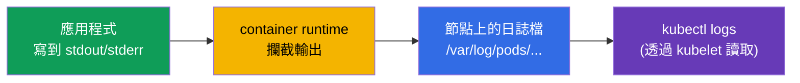
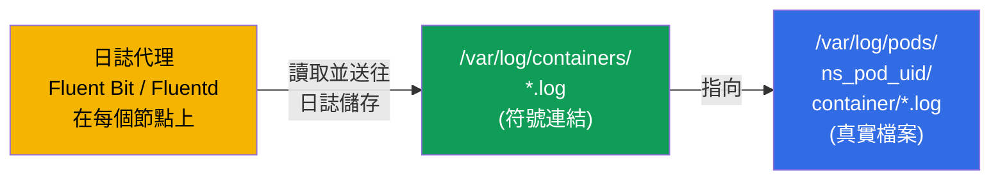
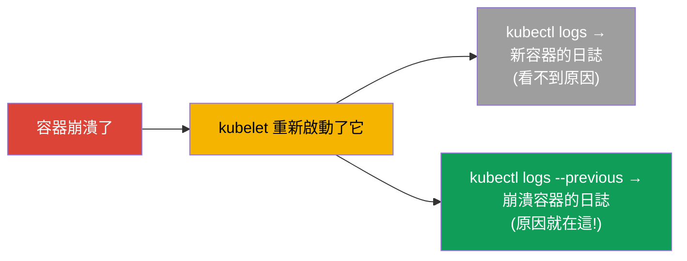
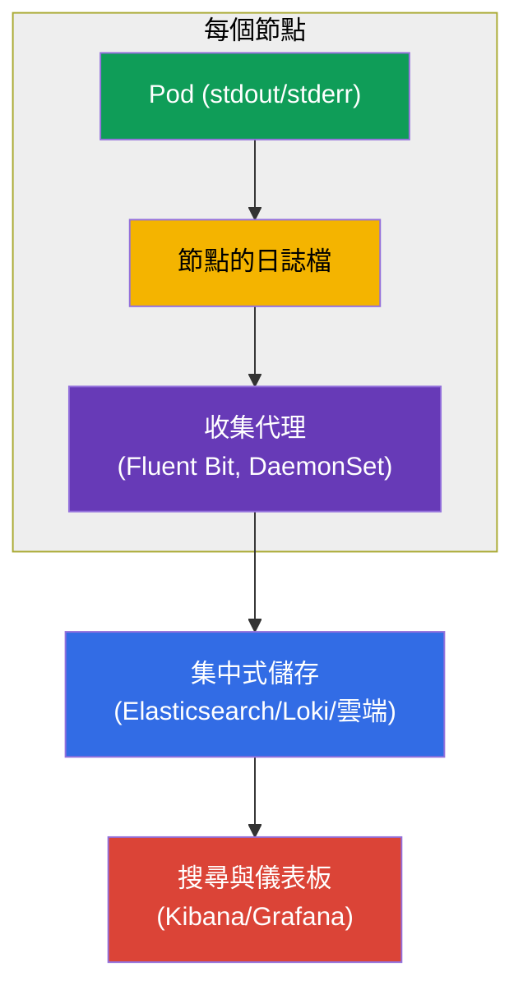
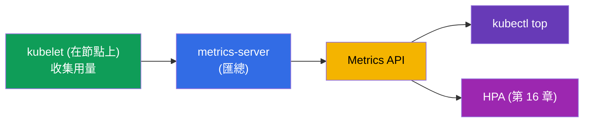
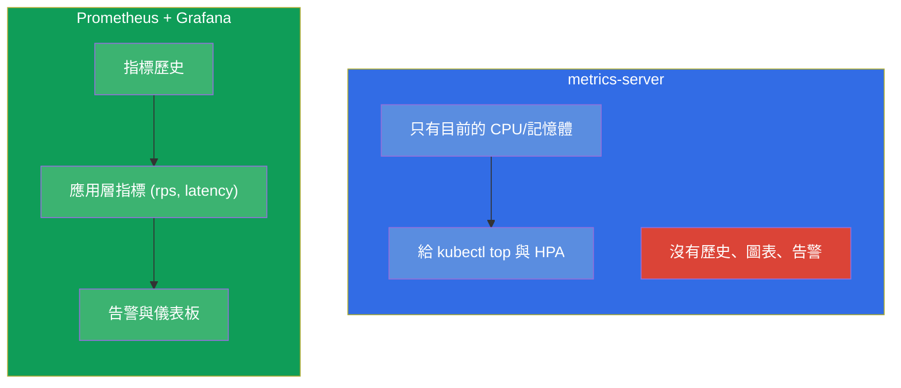
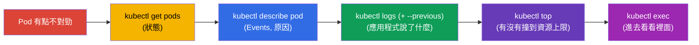

[Русская версия](ru.md) · [Eng version](README.md) · [Versión en español](es.md) · [Version française](fr.md) · [Deutsche Version](de.md) · [ქართული ვერსია](ge.md) · [日本語版](jp.md)

# 第 28 章。日誌與監控:logs、metrics-server、kubectl top

> **接下來是什麼。** 探針(第 27 章)向叢集報告健康狀態。那 **你** 自己怎麼看
> 發生了什麼事?透過日誌(`kubectl logs`)與指標(`kubectl top`,以
> metrics-server 為基礎)。這是 Observability(CKAD)與 Troubleshooting/Monitoring
> (CKA)的領域。這個主題的命令很簡單,但非常關鍵:考試上和現實中 90% 的除錯都是從
> 「看日誌」和「看資源用量」開始。順便我們也會理解日誌架構,以及 Prometheus 在
> 整體圖景中的位置。

## 28.1. 容器日誌:基礎

Kubernetes 收集容器寫到 **stdout/stderr** 的內容。這是一條基本原則:容器裡的應用程式
應該把日誌寫到標準輸出,而不是寫到檔案 - 這樣 `kubectl logs` 和日誌收集系統才看得到
它們。



日誌的主要命令:

```bash
kubectl logs <pod>                    # 單容器 Pod 的日誌
kubectl logs <pod> -c <container>     # multi-container Pod 中的特定容器
kubectl logs <pod> -f                 # 即時追蹤 (follow)
kubectl logs <pod> --previous         # 「前一個」(已崩潰) 容器的日誌
kubectl logs <pod> --tail=100         # 最後 100 行
kubectl logs <pod> --since=1h         # 最近一小時
kubectl logs -l app=web --prefix      # 依標籤取得所有 Pod 的日誌,並加上來源前綴
```

這些檔案在節點上實際放在哪裡。runtime 會把真正的檔案寫到
`/var/log/pods/<namespace>_<pod>_<uid>/<container>/*.log`,而旁邊的
`/var/log/containers/` 目錄裡放的是指向它們、名稱較好讀的 **符號連結**。日誌代理
(Fluent Bit、Fluentd、Promtail)從所有節點收集日誌時,讀的通常正是這一對:



由此得到一個重要推論:`kubectl logs` 讀的是節點上 **目前** 容器的檔案,而當 Pod 被
刪除或檔案被輪替時,這些日誌就消失了。長期保存靠的正是外部代理,它把日誌送到集中式
儲存(關於 Prometheus/日誌堆疊的部分 - 見下文)。

### 日誌在節點上能存活多久,以及如何設定

日誌在節點上的存活期不是由 **時間** 決定,而是由 **大小** 決定:輪替由 **kubelet**
管理,而不是應用程式。當目前的檔案長到大小上限時就會輪替,而最舊的已輪替檔案會被
刪除。預設值:

- `containerLogMaxSize` - **10Mi**(觸發輪替的檔案大小);
- `containerLogMaxFiles` - **5**(每個容器保留幾個檔案)。

也就是說,預設每個容器大約保留 `5 × 10Mi ≈ 50Mi`,而「這相當於幾小時/幾天」則完全
取決於應用程式寫日誌的頻繁程度:一個很囉嗦的服務幾分鐘就會覆蓋掉自己的舊日誌,安靜
的服務則能保存好幾天。並沒有另外的時間 TTL,而且 Pod 被刪除時,檔案無論如何都會被
清掉。

這是在 **kubelet 的設定** 中調整的(`KubeletConfiguration`,在節點上啟動 kubelet 時
生效):

```yaml
# /var/lib/kubelet/config.yaml (片段)
apiVersion: kubelet.config.k8s.io/v1beta1
kind: KubeletConfiguration
containerLogMaxSize: "50Mi"   # 到 50 MiB 時輪替
containerLogMaxFiles: 5        # 每個容器最多保留 5 個檔案
```

舊的旗標 `--container-log-max-size` 與 `--container-log-max-files` 做的是同一件事,但
已被視為過時 - 建議使用設定檔。實務原則:每個容器的總量
(`containerLogMaxSize × containerLogMaxFiles`)要控制得小(通常在節點磁碟的 ~1% 以
內),避免日誌塞滿磁碟並引發 disk-pressure eviction(第 15 章)。

## 28.2. --previous:已崩潰容器的日誌

單獨談談 `--previous` - 它是除錯 `CrashLoopBackOff` 時的救星。當容器崩潰並重新啟動
後,一般的 `kubectl logs` 顯示的是 **新** 容器的日誌(它才剛啟動)。而崩潰的原因在
**前一個**、已經死掉的容器的日誌裡。`--previous` 就是用來取出它們的:



遇到 `CrashLoopBackOff` 時的反射動作是:`kubectl logs <pod> --previous` - 幾乎總是能
在那裡看到應用程式為什麼崩潰。

> **那如果 Pod 重啟了很多次,又沒有集中式儲存呢?** `--previous` 只會給出 **一次**
> 前一輪執行的日誌(目前這一輪之前的最後一次),更早的用 `kubectl logs` 拿不到。但在
> 節點上通常可以直接找到它們:容器每次重啟都會在
> `/var/log/pods/<namespace>_<pod>_<uid>/<container>/` 放一個獨立檔案,以重啟計數器
> 命名 - `0.log`、`1.log`、`2.log` 等等(舊的還會被輪替壓縮)。也就是說,前幾次崩潰
> 的日誌可能就躺在那裡,直到被輪替擠掉。
>
> 不用 SSH 登入也能拿到這些檔案,靠的是節點上的除錯 Pod:
>
> ```bash
> kubectl debug node/<node> -it --image=busybox
> # 在裡面:節點的檔案系統掛載在 /host
> ls /host/var/log/pods/<namespace>_<pod>_<uid>/<container>/
> cat /host/var/log/pods/<namespace>_<pod>_<uid>/<container>/1.log
> ```
>
> 或者直接在節點上透過 runtime:`crictl ps -a`(找出 ID)加上 `crictl logs <id>`。
>
> 重要限制:這些檔案綁在 **Pod 的 UID** 上 - 如果 Pod 被 **刪除**(而不只是重啟),
> 整個日誌目錄就會消失;輪替只保留最後 `containerLogMaxFiles` 個檔案;而如果 Pod 搬到
> 了另一個節點,就得去原來那個節點找。所以 node-local 日誌只是暫時的保險:不遺失崩潰
> 歷史的唯一可靠做法是集中式日誌收集(代理 → 外部儲存)。

## 28.3. 叢集中的日誌架構

`kubectl logs` 很適合除錯單一 Pod,但它有極限:日誌存在節點上,並且 **會跟著 Pod
一起消失**。刪掉 Pod - 日誌就沒了;也無法一次搜尋所有 Pod。生產環境需要集中式匯聚。



日誌由 **每個節點上的代理** 收集(通常是 DaemonSet - 第 11 章,例如 Fluent Bit),
並送往集中式儲存(Elasticsearch、Loki、雲端日誌服務),在那裡可以搜尋並建立儀表板。
這是標準做法;考試上有 `kubectl logs` 就夠了,但架構還是要懂。

## 28.4. metrics-server 與 kubectl top

日誌是「應用程式說了什麼」,指標是「它吃了多少」。基本指標(CPU/記憶體)由
**metrics-server** 提供(我們在第 16 章已經遇過它 - HPA 需要它)。它從每個節點的
kubelet 收集用量,並透過 Metrics API 提供出來。



```bash
# 檢查有沒有 metrics-server
kubectl get deployment metrics-server -n kube-system

# 資源用量
kubectl top nodes                     # 各節點的 CPU/記憶體
kubectl top pods                      # 各 Pod
kubectl top pods -A                   # 所有 namespace
kubectl top pods --sort-by=memory     # 依記憶體排序
kubectl top pods --containers         # 依 Pod 內的容器
```

> **重要。** `kubectl top` **只有** 在安裝了 metrics-server 時才能運作。如果它報錯
> `Metrics API not available` - 表示 metrics-server 沒安裝或沒在運作。這和 HPA
> 的條件是一樣的(第 16 章)。

## 28.5. metrics-server 不是監控系統

一個常見的誤解:metrics-server 不保存歷史,也不能取代監控。它只提供 **目前** 這一刻的
CPU/記憶體用量(給 `top` 與 HPA 用)。歷史、圖表、告警、應用層指標,它都不提供。



真正的監控(歷史、圖表、告警、任意指標)會用 **Prometheus**(收集與保存指標)+
**Grafana**(視覺化)+ Alertmanager(告警)。應用程式以 Prometheus 格式輸出指標
(有時透過 adapter-sidecar - 第 22 章)。這是可觀測性的標準,但不在 CKA/CKAD 的深入
範圍內 - 知道它和 metrics-server 的差別就夠了。

## 28.6. 除錯循環:日誌 + 指標 + describe

我們把可觀測性工具彙整成一個統一的除錯反射(它在第 9 部分會很有用):



這個順序 - `get → describe → logs → top → exec` - 是排查幾乎任何 Pod 問題的通用演算
法。每一步都在縮小原因的範圍。

## 28.7. 這在生產環境中如何應用

- **應用程式把日誌寫到 stdout/stderr。** 這是集中式收集能運作的前提:應用程式寫到
  標準輸出,而不是寫到容器內的檔案。把日誌寫進容器檔案是反模式(收不到,而且會跟著
  Pod 一起消失)。
- **集中式匯聚是必需的。** 生產環境裡 `kubectl logs` 只用於快速除錯;真正的搜尋是在
  匯聚後的日誌上進行(Loki/ELK/雲端),因為 Pod 的日誌是短暫的,而且分散在各節點上。
- **Prometheus + Grafana 是指標的標準。** metrics-server 只給 `top`/HPA 用;要歷史、
  儀表板與告警就得找 Prometheus/Grafana。應用層指標(rps、latency、錯誤率)是 SLO
  與告警的基礎。
- **結構化日誌與關聯分析。** 生產環境會用結構化格式(JSON)記錄日誌,並加上上下文
  (Pod 名稱、節點名稱,透過 Downward API - 第 17 章),以便在排查事故時把日誌、
  指標與追蹤串起來。
- **追蹤 (tracing)。** 完整的可觀測性是「三大支柱」:日誌 + 指標 + 追蹤
  (OpenTelemetry/Jaeger)。對 CKA/CKAD 來說日誌與指標就夠了,但實際運維中還會加上
  分散式追蹤。

## 28.8. 小詞彙表

- **stdout/stderr** - 容器的標準輸出,Kubernetes 從這裡取得日誌。
- **kubectl logs** - 查看 Pod/容器的日誌。
- **--previous** - 前一個(已崩潰)容器的日誌。
- **metrics-server** - 收集 Pod 與節點目前的 CPU/記憶體;供 `top` 與 HPA 使用。
- **kubectl top** - 顯示資源用量(需要 metrics-server)。
- **Fluent Bit/Fluentd** - 日誌收集代理(通常是 DaemonSet)。
- **Prometheus / Grafana** - 指標的收集/保存與視覺化(真正的監控)。
- **可觀測性三大支柱** - 日誌、指標、追蹤。

## 28.9. 本章總結

- Kubernetes 收集容器的 stdout/stderr;應用程式應該把日誌寫到那裡,而不是寫到
  檔案。
- `kubectl logs`(加上 `-c`、`-f`、`--tail`、`--since`、`-l`)是基本工具;
  `--previous` 顯示崩潰容器的日誌(排查 CrashLoopBackOff 的關鍵)。
- Pod 的日誌是短暫的(跟著 Pod 一起消失);生產環境由節點上的代理(Fluent Bit,
  DaemonSet)收集到集中式儲存。
- metrics-server 為 `kubectl top` 與 HPA 提供目前的 CPU/記憶體;沒有它 `top` 就無法
  運作。
- metrics-server 不是監控:沒有歷史,也沒有告警;那要用 Prometheus + Grafana。
- 通用除錯循環:get → describe → logs (--previous) → top → exec。

## 28.10. 這些知識用在哪:考試與實際工作

**在考試上。** 「看某個 Pod 的日誌」、「在崩潰的容器裡找出錯誤」(`--previous`)、
「列出用量最高的 Pod」(`kubectl top --sort-by`)- 都是常見題目。`kubectl logs` 與
`describe` 是 troubleshooting 領域(CKA 的 30%)的主要工具。要記得 `top` 需要
metrics-server。

**在實際工作中。** 事故發生時,值班人員最先看的就是日誌與指標。理解日誌是短暫的、
需要集中式匯聚,以及 metrics-server 不是監控,會帶來正確的可觀測性架構
(Fluent Bit + Loki/ELK,Prometheus + Grafana)。除錯循環 get→describe→logs→top
是每天都要用的技能。

## 28.11. 自我檢查問題

1. 應用程式該把日誌寫到哪裡,`kubectl logs` 與收集器才看得到?
2. `kubectl logs --previous` 和一般用法差在哪,什麼時候它無可取代?
3. 為什麼 `kubectl logs` 對生產環境不夠用,集中式匯聚是怎麼組成的?
4. metrics-server 提供什麼,沒有它什麼會停止運作?
5. 為什麼 metrics-server 不是監控系統?該用什麼來取代它?
6. 逐步描述通用的 Pod 除錯循環。
7. 什麼是「可觀測性三大支柱」?

## 實踐

我們掌握了對叢集的觀察。第 29 章會以應用程式除錯與 API 淘汰(包含用於診斷的
ephemeral 容器)這個主題收尾第 6 部分。日誌與指標會在可觀測性相關的實驗中操練。

🧪 實驗 109(logs、metrics-server、kubectl top):[tasks/cka/labs/109](../../labs/109/README_TW.MD)

---
[目錄](../README_TW.md) · [第 27 章](../27/tw.md) · [第 29 章](../29/tw.md)
