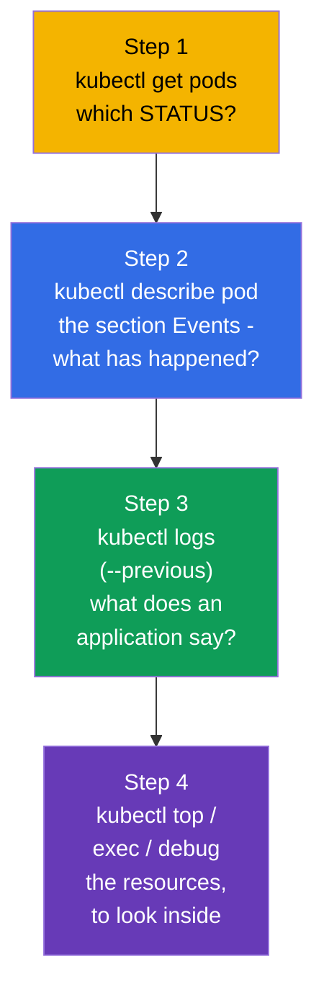
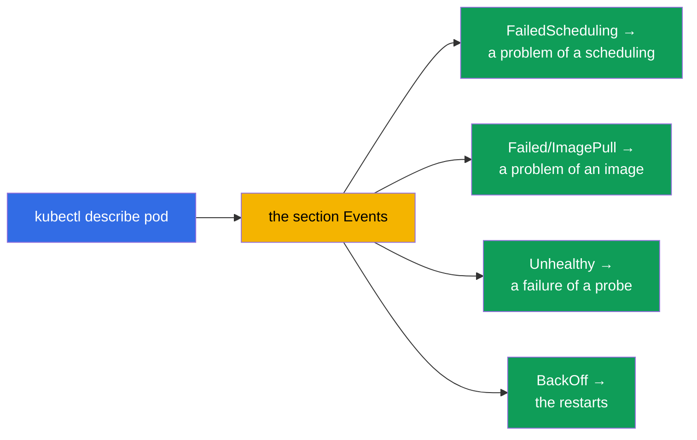
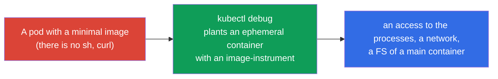
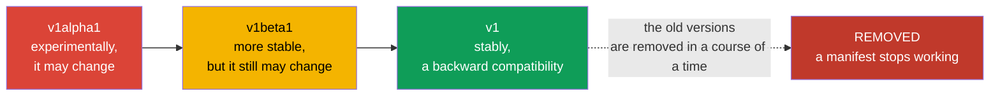
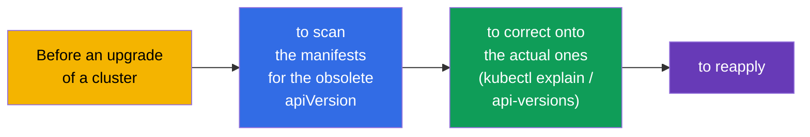
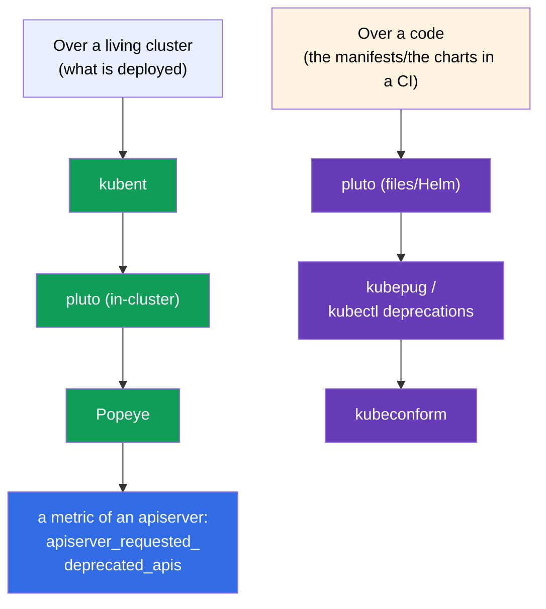

[Русская версия](ru.md) · [Versión en español](es.md) · [Version française](fr.md) · [Deutsche Version](de.md) · [ქართული ვერსია](ge.md) · [繁體中文版](tw.md) · [日本語版](jp.md)

# Chapter 29. A debugging of the applications and an obsolescence of an API

> **What comes next.** We are completing the part 6. We will assemble together the skills of a debugging of a level of an application
> (the chapter relates to the Observability CKAD and the troubleshooting CKA) and we will consider a separate theme -
> **an obsolescence of an API (API deprecations)**, which the CKAD singles out specially. A debugging of a
> cluster (a control plane, the nodes, a network) we will consider in a detail in the part 9; here a focus is on the pods and
> the applications, and also on that, how not to break upon an update of the versions of Kubernetes.

## 29.1. A systematic approach to a debugging of a pod

A chaotic poking is an enemy of a debugging under a timer. There is a clear route: from a status to a reason.



A STATUS (the chapter 4) at once directs a diagnostics:

| STATUS | A first action |
|--------|-----------------|
| `Pending` | `describe` → the Events: are there no resources? a taint? a nodeSelector? is a PVC not bound? |
| `ImagePullBackOff` | `describe`: a name/a tag of an image, an access to a registry, an imagePullSecret |
| `CrashLoopBackOff` | `logs --previous`: why it falls upon a start |
| `CreateContainerConfigError` | there is no ConfigMap/Secret, onto which a pod refers |
| `Running`, but it does not work | `logs`, `exec`, to check a readiness and the Endpoints |
| `OOMKilled` | `describe` (Last State) + `top`: a limit of a memory is small |

## 29.2. A describe and the Events - a main source of the reasons

A `kubectl describe` is the most underestimated instrument. At a bottom of its output there is the section **Events**
with a chronology: what a scheduler, the kubelet and the controllers did with an object and where they got stuck.

```bash
kubectl describe pod <pod>
# ... at a bottom:
# Events:
#   Warning  FailedScheduling  ...  0/3 nodes are available: insufficient memory
#   Warning  Failed            ...  Error: ImagePullBackOff
```



The events are stored a limited time. To look at all the events of a namespace, sorted by a
time:

```bash
kubectl get events --sort-by='.lastTimestamp'
kubectl get events --field-selector type=Warning
```

## 29.3. To look inside: an exec and a port-forward

When the logs do not give an answer, we climb inside.

```bash
# A shell inside a container
kubectl exec -it <pod> -- sh
kubectl exec -it <pod> -c <container> -- sh    # a concrete container

# To execute one command
kubectl exec <pod> -- env                       # the variables of an environment
kubectl exec <pod> -- cat /etc/config/app.conf  # to check a mounted config
kubectl exec <pod> -- nslookup backend          # to check a DNS from inside

# A forwarding of a port onto a local machine - to check an application directly
kubectl port-forward pod/<pod> 8080:80
kubectl port-forward svc/<service> 8080:80
```

A `port-forward` is useful, in order to turn to a pod/a service directly bypassing an Ingress and
to check, whether an application itself works (it narrows, where a problem is - in an application or in a
routing).

## 29.4. A kubectl debug and the ephemeral containers

A problem: the minimal images (distroless/scratch - the chapter 23) do not contain a `sh`, a `curl`, a
`ps` - there is nothing to go inside with through an `exec`. A solution is an **ephemeral container** through a `kubectl
debug`: a temporary debugging container is planted into a **working** pod, sharing its
namespace of the processes and a network, but with its own image (where the instruments exist).



```bash
# To plant a debugging container into a working pod
kubectl debug -it <pod> --image=busybox --target=<container>

# To make a copy of a pod for a debugging (without touching an original)
kubectl debug <pod> -it --image=busybox --copy-to=<pod>-debug

# A debugging of a node - a pod with an access to a FS of a node
kubectl debug node/<node> -it --image=busybox
```

The ephemeral containers cannot be added into a manifest beforehand - only through a `kubectl debug` to a
living pod. They do not restart. This is a correct way to debug the "silent" minimal
images, without rebuilding them.

> **How to "switch off" an already planted ephemeral container?** By a separate command it is
> **impossible** to delete it: an API does not allow to remove the records from a `spec.ephemeralContainers`, and the commands
> like a `kubectl delete container` do not exist. What can be done:
>
> - **to finish a process** inside - to exit from a shell (`exit`) or to kill a process. An ephemeral
>   container will pass into a `Terminated` and, since it does not restart, it will not work
>   any more. But it **will remain in a description of a pod** - it is still seen in a `kubectl describe
>   pod` (the section `Ephemeral Containers`) and in a `kubectl get pod -o yaml`.
> - **to remove it fully** is possible only by a **recreation of a pod**: a `kubectl delete pod
>   <pod>` (if a pod is under a controller - a Deployment/a StatefulSet - it will rise anew already
>   without a debugging container). Therefore for a debugging, which one wants to "throw away"
>   cleanly, a variant `--copy-to` is convenient: you work with a copy-pod and then you simply
>   delete it, without touching an original.
>
> A practical conclusion: an ephemeral container is a "single-use" one. It is not extinguished and not reused,
> but one lives with it up to a recreation of a pod.

## 29.5. An obsolescence of an API (API deprecations)

A separate theme of the CKAD. Kubernetes develops, and the versions of the API groups change: an `alpha` →
a `beta` → a stable one (`v1`). The old versions in a course of a time are **removed**. A manifest with an old
`apiVersion` after an update of a cluster will simply stop being applied.



The historical examples of the removed versions (they love to cite them):

| It was (it is obsolete/removed) | It became |
|-------------------------|-------|
| `extensions/v1beta1` Deployment/Ingress | `apps/v1`, `networking.k8s.io/v1` |
| `networking.k8s.io/v1beta1` Ingress | `networking.k8s.io/v1` |
| `policy/v1beta1` PodDisruptionBudget | `policy/v1` |
| `batch/v1beta1` CronJob | `batch/v1` |

## 29.6. How to find and to fix the obsolete APIs

```bash
# To check, which version of an API is actual for a resource
kubectl explain deployment            # it will show a current apiVersion
kubectl api-versions                  # all the available versions of an API in a cluster
kubectl api-resources                 # the resources and their groups

# The instruments of a detection of the obsolete APIs in the manifests (in a prod)
# kubectl deprecations / pluto / kubent - they scan the manifests and a cluster
```

An order of the actions: before an update of a cluster the manifests are checked for the obsolete
`apiVersion`, they are corrected onto the actual ones (a `kubectl explain` will prompt a current one), they are applied
anew. Kubernetes upon a turning to an obsolete API usually prints a warning into an
output of a `kubectl` - it is worth paying an attention onto it.



## 29.7. The open-source instruments of an analysis of the obsolete APIs

To check by a hand the dozens of the manifests and of the Helm releases is unrealistic - for this there are the ready
open-source instruments. They work in the two places: over a **living cluster** (what is already
deployed) and over a **code** (the manifests/the charts in a repository, in a CI before a rollout).



| An instrument | What it scans | A peculiarity |
|-----------|---------------|-------------|
| **kubent** (kube-no-trouble) | a living cluster + the Helm releases | a simple binary, a fast pre-upgrade check |
| **pluto** (Fairwinds) | a cluster, **the files of the manifests**, the Helm charts/releases | a goal is a concrete version of K8s; the codes of a return for a CI |
| **kubepug** (Deprecated APIs) | a cluster and the files against a **target** version | it verifies against an OpenAPI of a target version; it exists as a `kubectl deprecations` |
| **kubeconform** | the files against the JSON schemes of a target version | a fast validator in a CI; it catches the removed kind/versions |
| **Popeye** | a living cluster (a sanitizer) | besides an API it finds also the other problems of a hygiene |

```bash
# --- over a cluster ---
kubent                                   # what is deployed with a deprecated/removed API
pluto detect-all-in-cluster
popeye

# --- over a code / in a CI (with an aim onto a target version) ---
pluto detect-files -d ./manifests/ --target-versions k8s=v1.32.0
kubepug --input-file ./manifests/ --k8s-version v1.32.0
kubectl deprecations --k8s-version v1.32.0     # kubepug as a kubectl plugin
kubeconform -kubernetes-version 1.32.0 ./manifests/
```

A good practice: **both the one and the other** - a `kubent`/a `pluto` over a cluster before an upgrade, and a
`pluto`/a `kubepug`/a `kubeconform` in a CI pipeline, so that an obsolete `apiVersion` does not reach a
prod. In addition an apiserver gives away a metric `apiserver_requested_deprecated_apis` -
by it an alert in the Prometheus is hung (the chapter 28), in order to see the turnings to the obsolete APIs
beforehand.

## 29.8. How this is applied in the production

- **A debugging route is the same one.** In a prod an on-duty engineer goes by the same path: a STATUS →
  a describe/the Events → the logs → an exec/a debug. A difference is only in a scale (the hundreds of the pods) and in that, that
  the logs/the metrics are taken from the centralized systems (the chapter 28), and not only from a `kubectl`.
- **A kubectl debug for the minimal images.** Since in a prod the images are minimal (a safety),
  the ephemeral containers are a main way of a living debugging without a rebuilding and without a lowering of a
  safety of an image.
- **A check of the deprecations before each upgrade.** An update of a version of a cluster is a planned
  operation, before which the manifests are obligatorily scanned for the removed APIs (pluto/kubent),
  otherwise after an upgrade a part of the resources will stop being applied (a CI/CD, a GitOps will break).
- **A CI catches the obsolete APIs beforehand.** The mature teams check the manifests for the deprecated
  APIs directly in a pipeline, in order not to find this out at a moment of an upgrade of a prod.
- **The warnings are not ignored.** A Warning about an obsolete API in an output of a `kubectl` or in a
  CI is a signal to an update of a manifest beforehand, and not when a version is already removed.

## 29.9. A mini glossary

- **The Events** - a chronology of the actions with an object in an output of a `describe`/a `get events`.
- **An exec** - to execute a command/a shell inside a container.
- **A port-forward** - a forwarding of a port of a pod/of a service onto a local machine.
- **An ephemeral container** - a temporary debugging container in a living pod (`kubectl debug`).
- **A kubectl debug** - to plant a debugging container / to copy a pod / to debug a node.
- **An API deprecation** - a declaration of a version of an API as an obsolete one with a subsequent removal.
- **An apiVersion** - a version of an API group of an object (alpha/beta/a stable one).
- **A pluto / a kubent** - the instruments of a search of the obsolete APIs in the manifests/in a cluster.
- **A kubepug (kubectl deprecations)** - a check of an API against a target version of K8s (a cluster and the files).
- **A kubeconform** - a validator of the manifests by the schemes of a target version (a CI).
- **A Popeye** - a sanitizer of a cluster, including it finds the obsolete APIs.
- **An apiserver_requested_deprecated_apis** - a metric of the turnings to the obsolete APIs (an alert in the Prometheus).

## 29.10. The summary of the chapter

- A debugging of a pod goes by a route: a STATUS (`get`) → the Events (`describe`) → the logs (`logs
  --previous`) → the resources/inside (`top`, `exec`, `debug`).
- A `describe` and its section Events are a main source of the reasons (a scheduling, an image, the probes,
  the restarts); a `get events --sort-by` gives a full picture.
- An `exec` and a `port-forward` allow to look inside and to check an application directly.
- A `kubectl debug` with an ephemeral container is a way to debug a minimal image (without a sh),
  a living pod or a node, without rebuilding an image.
- An API passes a path an alpha → a beta → a stable one; the old versions are removed, and the manifests with them
  stop working after an upgrade.
- Before an update of a cluster the manifests are checked for the obsolete `apiVersion` (a kubectl
  explain / api-versions, a pluto/a kubent) and they are corrected onto the actual ones.
- The open-source instruments: over a cluster there are a kubent, a pluto, a Popeye; over a code in a CI there are a pluto,
  a kubepug (`kubectl deprecations`), a kubeconform; plus a metric of an apiserver for the alerts.

## 29.11. How this will come in handy: on the exam and in the real work

**On the exam.** "Fix a broken pod/application" is a core of a troubleshooting (30% of the CKA) and
of the Observability (CKAD). A route a get→describe→logs→exec solves a majority of such tasks.
A `kubectl debug` and an update of an obsolete `apiVersion` are the concrete abilities, which
are checked directly (especially the deprecations on the CKAD).

**In the real work.** A systematic debugging saves a time upon the incidents, and the
ephemeral containers allow to keep the images minimal and all the same to debug them.
A check of the deprecations before an upgrade of a cluster is an obligatory step, without which an update
of a version of Kubernetes breaks the working manifests and the pipelines of a delivery.

## 29.12. Self-check questions

1. Describe a systematic route of a debugging of a pod. Where to begin from?
2. Where does a `describe` show the reasons of the problems and what to search there upon a Pending?
3. When does a `port-forward` help to localize a problem?
4. What for is a `kubectl debug` needed and by what does it help out upon the minimal images?
5. Which path does a version of an API pass and what happens with the old versions?
6. How to find an actual `apiVersion` for a resource and to check a cluster for the obsolete APIs?
7. Why is a check of the deprecations important before an update of a cluster?
8. Which open-source instruments scan a cluster, and which ones scan a code/the manifests in a CI? Name
   two of each and by what they differ.

## Practice

On this the part 6 (an observability and a servicing) is completed. Further there is the part 7: the services and a network,
beginning with a network model of Kubernetes and a CNI (the chapter 30). A debugging and a work with the ephemeral
containers are drilled in the labs on an observability and a troubleshooting.

🧪 Lab 109 (a debugging and an obsolescence of an API): [tasks/cka/labs/109](../../labs/109/README.MD)

🎮 Killercoda (in a browser, no setup): [Ephemeral Debug Container](https://killercoda.com/chadmcrowell/course/ckad/kubectl-debug) · [Logs from CrashLoop Pod](https://killercoda.com/chadmcrowell/course/ckad/logs-crashloop) · [Port Forward to Pod](https://killercoda.com/chadmcrowell/course/ckad/port-forward-pod) · [Debug a Go App in Kubernetes](https://killercoda.com/chadmcrowell/course/cka/debug-go-app)

---
[Contents](../README.md) · [Chapter 28](../28/README.md) · [Chapter 30](../30/README.md)
