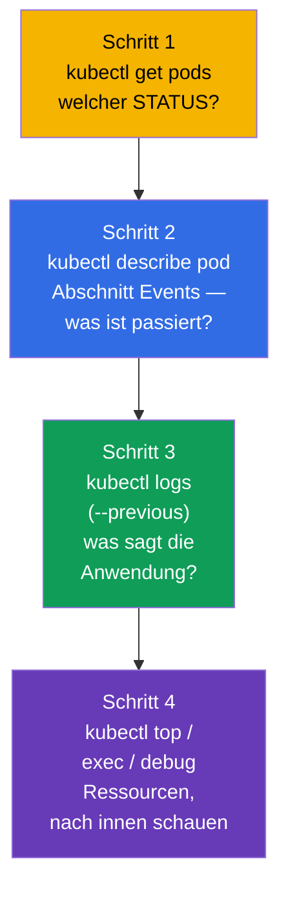
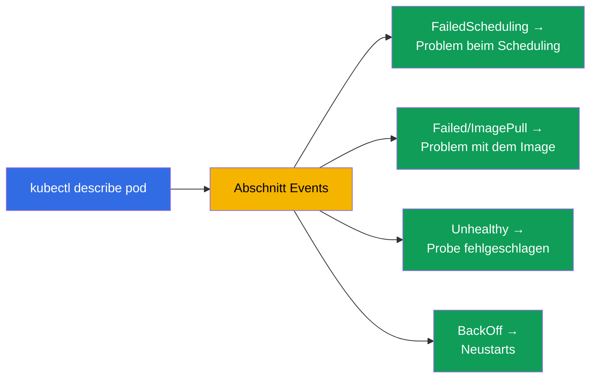
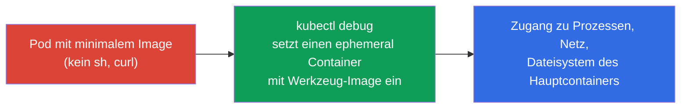
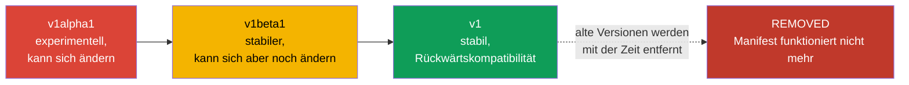
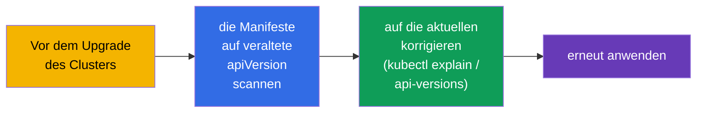
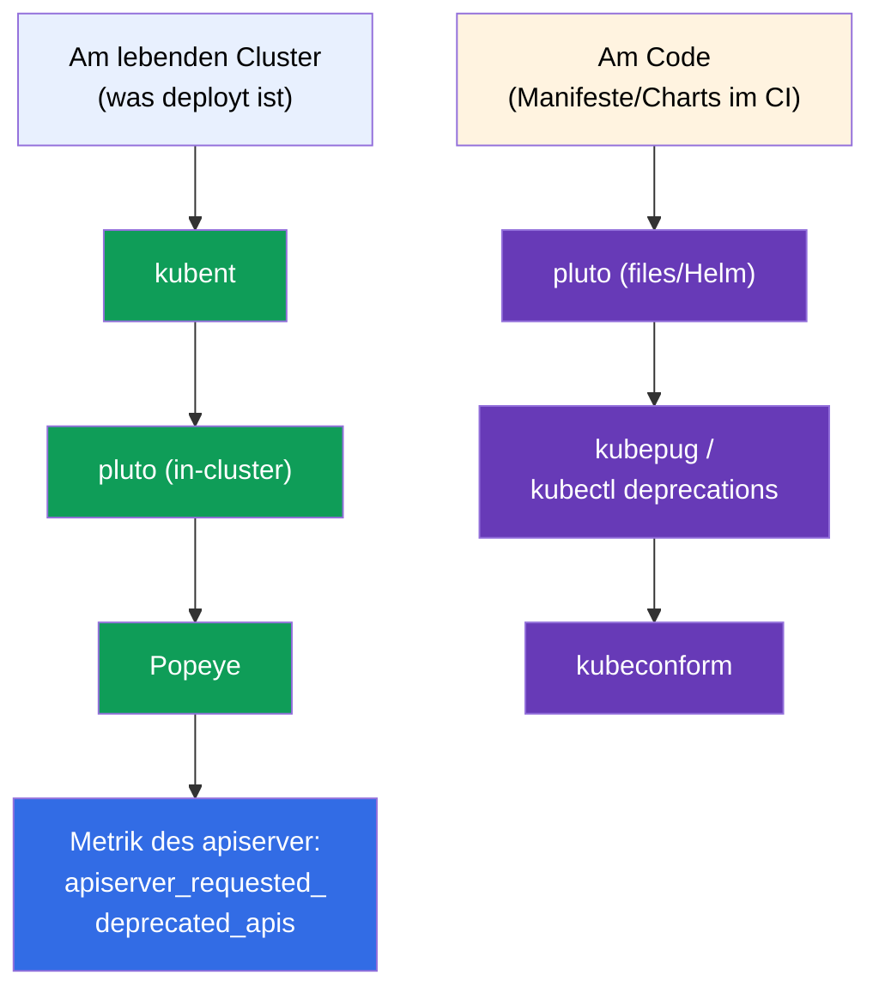

[Русская версия](ru.md) · [Eng version](README.md) · [Versión en español](es.md) · [Version française](fr.md) · [ქართული ვერსია](ge.md) · [繁體中文版](tw.md) · [日本語版](jp.md)

# Kapitel 29. Debuggen von Anwendungen und Veralten von APIs

> **Was kommt.** Wir schließen Teil 6 ab. Wir fügen die Fertigkeiten des Debuggens auf
> Anwendungsebene zusammen (das Kapitel gehört zu Observability bei CKAD und zu
> Troubleshooting bei CKA) und behandeln ein eigenes Thema -
> **Veralten von APIs (API deprecations)**, das CKAD besonders hervorhebt. Das Debuggen des
> Clusters (control plane, Nodes, Netz) behandeln wir ausführlich in Teil 9; hier liegt der
> Fokus auf Pods und Anwendungen sowie darauf, beim Aktualisieren der Kubernetes-Versionen
> nicht zu zerbrechen.

## 29.1. Systematisches Vorgehen beim Debuggen eines Pods

Chaotisches Herumstochern ist der Feind der Fehlersuche unter Zeitdruck. Es gibt einen klaren
Weg: vom Status zur Ursache.



STATUS (Kapitel 4) lenkt die Diagnose sofort:

| STATUS | Erste Handlung |
|--------|-----------------|
| `Pending` | `describe` → Events: keine Ressourcen? taint? nodeSelector? PVC nicht gebunden? |
| `ImagePullBackOff` | `describe`: Name/Tag des Images, Zugang zur Registry, imagePullSecret |
| `CrashLoopBackOff` | `logs --previous`: warum es beim Start abstürzt |
| `CreateContainerConfigError` | es gibt die ConfigMap/das Secret nicht, auf die der Pod verweist |
| `Running`, funktioniert aber nicht | `logs`, `exec`, readiness und Endpoints prüfen |
| `OOMKilled` | `describe` (Last State) + `top`: Speicherlimit zu klein |

## 29.2. describe und Events - die wichtigste Quelle für Ursachen

`kubectl describe` ist das am meisten unterschätzte Werkzeug. Unten in seiner Ausgabe steht
der Abschnitt **Events** mit der Chronologie: was Scheduler, kubelet und Controller mit dem
Objekt getan haben und wo sie hängen geblieben sind.

```bash
kubectl describe pod <pod>
# ... unten:
# Events:
#   Warning  FailedScheduling  ...  0/3 nodes are available: insufficient memory
#   Warning  Failed            ...  Error: ImagePullBackOff
```



Events werden nur begrenzte Zeit aufbewahrt. Alle Events eines Namespace ansehen, sortiert
nach Zeit:

```bash
kubectl get events --sort-by='.lastTimestamp'
kubectl get events --field-selector type=Warning
```

## 29.3. Nach innen schauen: exec und port-forward

Wenn die Logs keine Antwort geben, gehen wir nach innen.

```bash
# Shell innerhalb des Containers
kubectl exec -it <pod> -- sh
kubectl exec -it <pod> -c <container> -- sh    # konkreter Container

# Einen einzelnen Befehl ausführen
kubectl exec <pod> -- env                       # Umgebungsvariablen
kubectl exec <pod> -- cat /etc/config/app.conf  # gemountete Konfiguration prüfen
kubectl exec <pod> -- nslookup backend          # DNS von innen prüfen

# Port auf die lokale Maschine weiterleiten — die Anwendung direkt prüfen
kubectl port-forward pod/<pod> 8080:80
kubectl port-forward svc/<service> 8080:80
```

`port-forward` ist nützlich, um sich direkt an den Pod/Service zu wenden, am Ingress vorbei,
und zu prüfen, ob die Anwendung selbst funktioniert (das engt ein, wo das Problem liegt - in
der Anwendung oder im Routing).

## 29.4. kubectl debug und ephemeral Container

Das Problem: minimale Images (distroless/scratch - Kapitel 23) enthalten kein `sh`, `curl`,
`ps` - mit `exec` kommt man mit nichts hinein. Die Lösung ist ein **ephemeral Container** über
`kubectl debug`: ein temporärer Debug-Container wird in einen **laufenden** Pod eingesetzt und
teilt dessen Prozess-Namespace und Netz, hat aber sein eigenes Image (in dem es Werkzeuge
gibt).



```bash
# Debug-Container in einen laufenden Pod einsetzen
kubectl debug -it <pod> --image=busybox --target=<container>

# Eine Kopie des Pods zum Debuggen anlegen (ohne das Original zu berühren)
kubectl debug <pod> -it --image=busybox --copy-to=<pod>-debug

# Debuggen einer Node — ein Pod mit Zugang zum Dateisystem der Node
kubectl debug node/<node> -it --image=busybox
```

Ephemeral Container kann man nicht im Voraus ins Manifest schreiben - nur über `kubectl debug`
an einem lebenden Pod. Sie werden nicht neu gestartet. Das ist der richtige Weg, „stille“
minimale Images zu debuggen, ohne sie neu zu bauen.

> **Wie „schaltet“ man einen bereits eingesetzten ephemeral Container ab?** Mit einem eigenen
> Befehl löschen kann man ihn **nicht**: die API erlaubt es nicht, Einträge aus
> `spec.ephemeralContainers` zu entfernen, und Befehle wie `kubectl delete container`
> existieren nicht. Was man tun kann:
>
> - **den Prozess beenden** - aus der Shell aussteigen (`exit`) oder den Prozess abschießen.
>   Der ephemeral Container geht nach `Terminated` und wird, da er nicht neu gestartet wird,
>   nicht mehr arbeiten. Aber er **bleibt in der Beschreibung des Pods** - man sieht ihn
>   weiterhin in `kubectl describe pod` (Abschnitt `Ephemeral Containers`) und in
>   `kubectl get pod -o yaml`.
> - **vollständig entfernen** kann man ihn nur durch **Neuanlegen des Pods**: `kubectl delete
>   pod <pod>` (wenn der Pod unter einem Controller steht - Deployment/StatefulSet - kommt er
>   erneut hoch, schon ohne Debug-Container). Deshalb ist für Debugging, das man sauber
>   „wegwerfen“ will, die Variante `--copy-to` praktisch: Sie arbeiten mit einer Kopie des
>   Pods und löschen sie danach einfach, ohne das Original zu berühren.
>
> Praktische Folgerung: ein ephemeral Container ist „einmalig“. Man löscht ihn nicht und
> verwendet ihn nicht wieder, sondern lebt mit ihm bis zum Neuanlegen des Pods.

## 29.5. Veralten von APIs (API deprecations)

Ein eigenes Thema bei CKAD. Kubernetes entwickelt sich, und die Versionen der API-Gruppen
ändern sich: `alpha` → `beta` → stabil (`v1`). Alte Versionen werden mit der Zeit **entfernt**.
Ein Manifest mit alter `apiVersion` lässt sich nach dem Upgrade des Clusters einfach nicht
mehr anwenden.



Historische Beispiele entfernter Versionen (die werden gern angeführt):

| War (veraltet/entfernt) | Wurde |
|-------------------------|-------|
| `extensions/v1beta1` Deployment/Ingress | `apps/v1`, `networking.k8s.io/v1` |
| `networking.k8s.io/v1beta1` Ingress | `networking.k8s.io/v1` |
| `policy/v1beta1` PodDisruptionBudget | `policy/v1` |
| `batch/v1beta1` CronJob | `batch/v1` |

## 29.6. Wie man veraltete APIs findet und repariert

```bash
# Prüfen, welche API-Version für die Ressource aktuell ist
kubectl explain deployment            # zeigt die aktuelle apiVersion
kubectl api-versions                  # alle im Cluster verfügbaren API-Versionen
kubectl api-resources                 # Ressourcen und ihre Gruppen

# Werkzeuge zum Aufspüren veralteter APIs in Manifesten (in der Produktion)
# kubectl deprecations / pluto / kubent — scannen Manifeste und den Cluster
```

Die Reihenfolge: vor dem Upgrade des Clusters prüft man die Manifeste auf veraltete
`apiVersion`, korrigiert sie auf die aktuellen (`kubectl explain` verrät die aktuelle) und
wendet sie erneut an. Kubernetes gibt beim Zugriff auf ein veraltetes API üblicherweise eine
Warnung in der Ausgabe von `kubectl` aus - darauf sollte man achten.



## 29.7. Open-Source-Werkzeuge zur Analyse veralteter APIs

Dutzende Manifeste und Helm-Releases manuell zu prüfen ist unrealistisch - dafür gibt es
fertige Open-Source-Werkzeuge. Sie arbeiten an zwei Stellen: am **lebenden Cluster** (was
schon deployt ist) und am **Code** (Manifeste/Charts im Repository, im CI vor dem Rollout).



| Werkzeug | Was es scannt | Besonderheit |
|-----------|---------------|-------------|
| **kubent** (kube-no-trouble) | lebender Cluster + Helm-Releases | einfache Binary, schneller Pre-Upgrade-Check |
| **pluto** (Fairwinds) | Cluster, **Manifest-Dateien**, Helm-Charts/Releases | Ziel — eine konkrete K8s-Version; Rückgabecodes für CI |
| **kubepug** (Deprecated APIs) | Cluster und Dateien gegen die **Ziel**-Version | vergleicht mit der OpenAPI der Zielversion; gibt es auch als `kubectl deprecations` |
| **kubeconform** | Dateien gegen JSON-Schemas der Zielversion | schneller Validator im CI; fängt entfernte kind/Versionen |
| **Popeye** | lebender Cluster (Sanitizer) | findet neben API auch andere Hygieneprobleme |

```bash
# --- am Cluster ---
kubent                                   # was mit deprecated/removed API deployt ist
pluto detect-all-in-cluster
popeye

# --- am Code / im CI (mit Blick auf die Zielversion) ---
pluto detect-files -d ./manifests/ --target-versions k8s=v1.32.0
kubepug --input-file ./manifests/ --k8s-version v1.32.0
kubectl deprecations --k8s-version v1.32.0     # kubepug als kubectl-Plugin
kubeconform -kubernetes-version 1.32.0 ./manifests/
```

Gute Praxis: **beides** - `kubent`/`pluto` am Cluster vor dem Upgrade und
`pluto`/`kubepug`/`kubeconform` in der CI-Pipeline, damit eine veraltete `apiVersion` nicht bis
in die Produktion durchkommt. Zusätzlich gibt der apiserver die Metrik
`apiserver_requested_deprecated_apis` heraus - darauf hängt man einen Alert in Prometheus
(Kapitel 28), um Zugriffe auf veraltete APIs frühzeitig zu sehen.

## 29.8. Wie man das in der Produktion anwendet

- **Der Debug-Weg ist derselbe.** In der Produktion geht der Bereitschaftsdienst denselben
  Weg: STATUS → describe/Events → logs → exec/debug. Der Unterschied liegt nur im Maßstab
  (hunderte Pods) und darin, dass Logs/Metriken aus zentralen Systemen kommen (Kapitel 28) und
  nicht nur aus `kubectl`.
- **kubectl debug für minimale Images.** Da die Images in der Produktion minimal sind
  (Sicherheit), sind ephemeral Container der wichtigste Weg des Live-Debuggens ohne Neubau und
  ohne die Sicherheit des Images zu senken.
- **Prüfung der deprecations vor jedem Upgrade.** Das Upgrade der Cluster-Version ist eine
  geplante Operation, vor der man die Manifeste zwingend auf entfernte APIs scannt
  (pluto/kubent), sonst lässt sich nach dem Upgrade ein Teil der Ressourcen nicht mehr anwenden
  (CI/CD, GitOps gehen kaputt).
- **CI fängt veraltete APIs frühzeitig.** Reife Teams prüfen die Manifeste auf deprecated APIs
  direkt in der Pipeline, um das nicht erst im Moment des Produktions-Upgrades herauszufinden.
- **Warnungen werden nicht ignoriert.** Ein Warning über ein veraltetes API in der Ausgabe von
  `kubectl` oder im CI ist ein Signal, das Manifest frühzeitig zu aktualisieren, und nicht erst
  dann, wenn die Version schon entfernt ist.

## 29.9. Mini-Glossar

- **Events** - Chronologie der Handlungen mit dem Objekt in der Ausgabe von `describe`/`get events`.
- **exec** - einen Befehl/eine Shell innerhalb des Containers ausführen.
- **port-forward** - Weiterleiten eines Ports des Pods/Service auf die lokale Maschine.
- **ephemeral Container** - temporärer Debug-Container in einem lebenden Pod (`kubectl debug`).
- **kubectl debug** - einen Debug-Container einsetzen / den Pod kopieren / eine Node debuggen.
- **API deprecation** - Erklärung einer API-Version als veraltet mit anschließender Entfernung.
- **apiVersion** - Version der API-Gruppe des Objekts (alpha/beta/stabil).
- **pluto / kubent** - Werkzeuge zur Suche veralteter APIs in Manifesten/im Cluster.
- **kubepug (kubectl deprecations)** - Prüfung der API gegen eine Ziel-K8s-Version (Cluster und Dateien).
- **kubeconform** - Validator von Manifesten nach den Schemas der Zielversion (CI).
- **Popeye** - Sanitizer des Clusters, findet u. a. veraltete APIs.
- **apiserver_requested_deprecated_apis** - Metrik der Zugriffe auf veraltete APIs (Alert in Prometheus).

## 29.10. Zusammenfassung des Kapitels

- Das Debuggen eines Pods läuft auf diesem Weg: STATUS (`get`) → Events (`describe`) → Logs
  (`logs --previous`) → Ressourcen/nach innen (`top`, `exec`, `debug`).
- `describe` und sein Abschnitt Events sind die wichtigste Quelle für Ursachen (Scheduling,
  Image, Probes, Neustarts); `get events --sort-by` gibt das vollständige Bild.
- `exec` und `port-forward` erlauben, nach innen zu schauen und die Anwendung direkt zu prüfen.
- `kubectl debug` mit einem ephemeral Container ist der Weg, ein minimales Image (ohne sh),
  einen lebenden Pod oder eine Node zu debuggen, ohne das Image neu zu bauen.
- Ein API geht den Weg alpha → beta → stabil; alte Versionen werden entfernt, und Manifeste mit
  ihnen funktionieren nach dem Upgrade nicht mehr.
- Vor dem Upgrade des Clusters prüft man die Manifeste auf veraltete `apiVersion` (kubectl
  explain / api-versions, pluto/kubent) und korrigiert sie auf die aktuellen.
- Open-Source-Werkzeuge: am Cluster - kubent, pluto, Popeye; am Code im CI - pluto,
  kubepug (`kubectl deprecations`), kubeconform; plus die Metrik des apiserver für Alerts.

## 29.11. Wofür das nützlich ist: in der Prüfung und in der echten Arbeit

**In der Prüfung.** „Repariere den kaputten Pod/die kaputte Anwendung“ - das ist der Kern von
Troubleshooting (30 % CKA) und Observability (CKAD). Der Weg get→describe→logs→exec löst die
meisten solcher Aufgaben. `kubectl debug` und das Aktualisieren einer veralteten `apiVersion`
sind konkrete Fertigkeiten, die direkt geprüft werden (besonders deprecations bei CKAD).

**In der echten Arbeit.** Systematisches Debuggen spart bei Incidents Zeit, und ephemeral
Container erlauben, die Images minimal zu halten und sie trotzdem zu debuggen.
Die Prüfung der deprecations vor dem Upgrade des Clusters ist ein zwingender Schritt, ohne den
das Aktualisieren der Kubernetes-Version funktionierende Manifeste und Lieferpipelines
zerstört.

## 29.12. Fragen zur Selbstüberprüfung

1. Beschreiben Sie den systematischen Weg des Debuggens eines Pods. Womit beginnt man?
2. Wo zeigt `describe` die Ursachen der Probleme und was sucht man dort bei Pending?
3. Wann hilft `port-forward`, das Problem zu lokalisieren?
4. Wozu braucht man `kubectl debug` und womit hilft es bei minimalen Images aus?
5. Welchen Weg geht eine API-Version und was passiert mit den alten Versionen?
6. Wie findet man die aktuelle `apiVersion` für eine Ressource und prüft den Cluster auf
   veraltete APIs?
7. Warum ist die Prüfung der deprecations vor dem Upgrade des Clusters wichtig?
8. Welche Open-Source-Werkzeuge scannen den Cluster und welche den Code/die Manifeste im CI?
   Nennen Sie je zwei und wodurch sie sich unterscheiden.

## Praxis

Damit ist Teil 6 (Observability und Betrieb) abgeschlossen. Weiter geht es mit Teil 7: Services
und Netz, beginnend mit dem Netzwerkmodell von Kubernetes und CNI (Kapitel 30). Debuggen und
die Arbeit mit ephemeral Containern werden in den Labs zu Observability und Troubleshooting
geübt.

🧪 Lab 109 (Debuggen und Veralten von APIs): [tasks/cka/labs/109](../../labs/109/README_DE.MD)

🎮 Killercoda (im Browser, ohne Installation): [Ephemeral Debug Container](https://killercoda.com/chadmcrowell/course/ckad/kubectl-debug) · [Logs from CrashLoop Pod](https://killercoda.com/chadmcrowell/course/ckad/logs-crashloop) · [Port Forward to Pod](https://killercoda.com/chadmcrowell/course/ckad/port-forward-pod) · [Debug a Go App in Kubernetes](https://killercoda.com/chadmcrowell/course/cka/debug-go-app)

---
[Inhalt](../README_DE.md) · [Kapitel 28](../28/de.md) · [Kapitel 30](../30/de.md)
