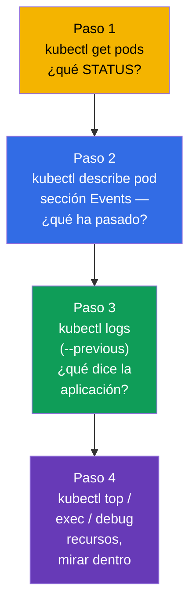
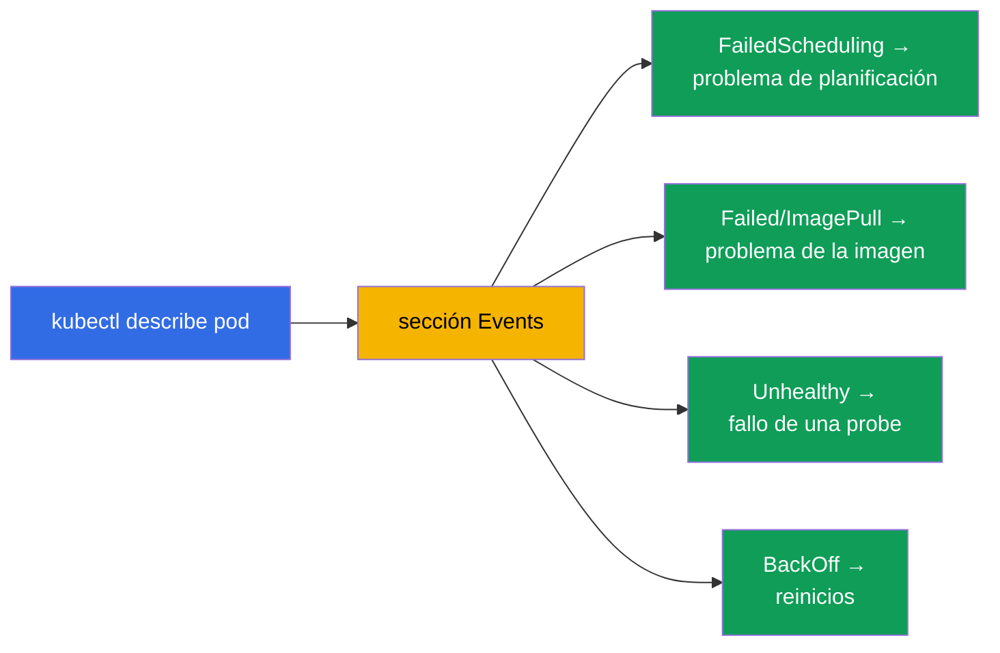
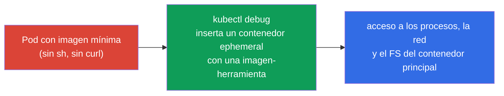
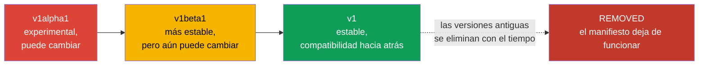
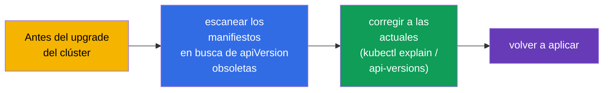
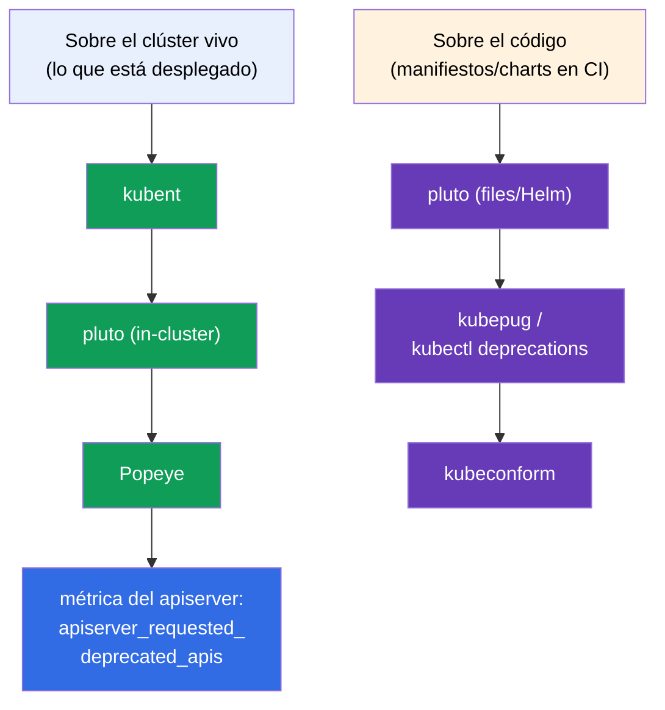

[Русская версия](ru.md) · [Eng version](README.md) · [Version française](fr.md) · [Deutsche Version](de.md) · [ქართული ვერსია](ge.md) · [繁體中文版](tw.md) · [日本語版](jp.md)

# Capítulo 29. Depuración de aplicaciones y obsolescencia de las API

> **Qué viene ahora.** Cerramos la parte 6. Vamos a reunir las destrezas de depuración a nivel
> de aplicación (el capítulo pertenece a Observability del CKAD y al troubleshooting del CKA) y
> a tratar un tema aparte - la **obsolescencia de las API (API deprecations)**, que el CKAD
> destaca de forma específica. La depuración del clúster (control plane, nodos, red) la veremos
> en detalle en la parte 9; aquí el foco está en los pods y las aplicaciones, y en cómo no
> romperse al actualizar versiones de Kubernetes.

## 29.1. Enfoque sistemático para depurar un pod

Ir a ciegas es el enemigo de la depuración con el cronómetro en marcha. Hay una ruta clara: del
estado a la causa.



El STATUS (capítulo 4) orienta el diagnóstico de inmediato:

| STATUS | Primera acción |
|--------|-----------------|
| `Pending` | `describe` → Events: ¿faltan recursos? ¿taint? ¿nodeSelector? ¿PVC sin vincular? |
| `ImagePullBackOff` | `describe`: nombre/tag de la imagen, acceso al registro, imagePullSecret |
| `CrashLoopBackOff` | `logs --previous`: por qué se cae al arrancar |
| `CreateContainerConfigError` | no existe el ConfigMap/Secret al que hace referencia el pod |
| `Running`, pero no funciona | `logs`, `exec`, comprobar readiness y Endpoints |
| `OOMKilled` | `describe` (Last State) + `top`: el límite de memoria es escaso |

## 29.2. describe y Events - la fuente principal de causas

`kubectl describe` es la herramienta más infravalorada. Al final de su salida está la sección
**Events** con la cronología: qué hicieron el planificador, el kubelet y los controladores con
el objeto y dónde se atascaron.

```bash
kubectl describe pod <pod>
# ... al final:
# Events:
#   Warning  FailedScheduling  ...  0/3 nodes are available: insufficient memory
#   Warning  Failed            ...  Error: ImagePullBackOff
```



Los eventos se guardan un tiempo limitado. Para ver todos los eventos del namespace, ordenados
por tiempo:

```bash
kubectl get events --sort-by='.lastTimestamp'
kubectl get events --field-selector type=Warning
```

## 29.3. Mirar dentro: exec y port-forward

Cuando los logs no dan la respuesta, nos metemos dentro.

```bash
# Shell dentro del contenedor
kubectl exec -it <pod> -- sh
kubectl exec -it <pod> -c <container> -- sh    # contenedor concreto

# Ejecutar un solo comando
kubectl exec <pod> -- env                       # variables de entorno
kubectl exec <pod> -- cat /etc/config/app.conf  # comprobar la config montada
kubectl exec <pod> -- nslookup backend          # comprobar el DNS desde dentro

# Reenvío de puerto a la máquina local — probar la aplicación directamente
kubectl port-forward pod/<pod> 8080:80
kubectl port-forward svc/<service> 8080:80
```

`port-forward` sirve para dirigirse al pod/servicio directamente, esquivando el Ingress, y
comprobar si la aplicación en sí funciona (estrecha dónde está el problema - en la aplicación o
en el enrutado).

## 29.4. kubectl debug y contenedores ephemeral

El problema: las imágenes mínimas (distroless/scratch - capítulo 23) no contienen `sh`, `curl`,
`ps` - no hay con qué entrar mediante `exec`. La solución es un **contenedor ephemeral** con
`kubectl debug`: un contenedor de depuración temporal se inserta en un pod **en marcha**,
compartiendo su namespace de procesos y su red, pero con su propia imagen (donde sí hay
herramientas).



```bash
# Insertar un contenedor de depuración en un pod en marcha
kubectl debug -it <pod> --image=busybox --target=<container>

# Hacer una copia del pod para depurar (sin tocar el original)
kubectl debug <pod> -it --image=busybox --copy-to=<pod>-debug

# Depuración de un nodo — pod con acceso al FS del nodo
kubectl debug node/<node> -it --image=busybox
```

Los contenedores ephemeral no se pueden añadir de antemano en el manifiesto - solo con
`kubectl debug` sobre un pod vivo. No se reinician. Es la forma correcta de depurar imágenes
mínimas «silenciosas» sin reconstruirlas.

> **¿Cómo «apagar» un contenedor ephemeral ya insertado?** Con un comando aparte para
> eliminarlo **no se puede**: la API no permite quitar entradas de `spec.ephemeralContainers`, y
> comandos como `kubectl delete container` no existen. Lo que sí se puede hacer:
>
> - **terminar el proceso** de dentro - salir del shell (`exit`) o matar el proceso. El
>   contenedor ephemeral pasará a `Terminated` y, como no se reinicia, ya no volverá a
>   funcionar. Pero **seguirá en la descripción del pod** - se sigue viendo en `kubectl describe
>   pod` (sección `Ephemeral Containers`) y en `kubectl get pod -o yaml`.
> - **quitarlo por completo** solo es posible **recreando el pod**: `kubectl delete pod
>   <pod>` (si el pod está bajo un controlador - Deployment/StatefulSet - se levantará de nuevo
>   ya sin el contenedor de depuración). Por eso, para una depuración que quieras «tirar» del
>   todo, resulta cómoda la variante `--copy-to`: trabajas con un pod-copia y luego simplemente
>   lo borras, sin tocar el original.
>
> Conclusión práctica: el contenedor ephemeral es «de un solo uso». No se apaga ni se reutiliza,
> se convive con él hasta recrear el pod.

## 29.5. Obsolescencia de las API (API deprecations)

Un tema aparte del CKAD. Kubernetes evoluciona y las versiones de los grupos de API cambian:
`alpha` → `beta` → estable (`v1`). Las versiones antiguas con el tiempo se **eliminan**. Un
manifiesto con una `apiVersion` antigua, tras actualizar el clúster, simplemente dejará de
aplicarse.



Ejemplos históricos de versiones eliminadas (les gusta mucho citarlos):

| Antes (obsoleto/eliminado) | Ahora |
|-------------------------|-------|
| `extensions/v1beta1` Deployment/Ingress | `apps/v1`, `networking.k8s.io/v1` |
| `networking.k8s.io/v1beta1` Ingress | `networking.k8s.io/v1` |
| `policy/v1beta1` PodDisruptionBudget | `policy/v1` |
| `batch/v1beta1` CronJob | `batch/v1` |

## 29.6. Cómo encontrar y arreglar las API obsoletas

```bash
# Comprobar qué versión de API es la actual para un recurso
kubectl explain deployment            # mostrará el apiVersion actual
kubectl api-versions                  # todas las versiones de API disponibles en el clúster
kubectl api-resources                 # recursos y sus grupos

# Herramientas de detección de API obsoletas en manifiestos (en producción)
# kubectl deprecations / pluto / kubent — escanean manifiestos y el clúster
```

El orden de actuación: antes de actualizar el clúster se revisan los manifiestos en busca de
`apiVersion` obsoletas, se corrigen a las actuales (`kubectl explain` indica la vigente) y se
aplican de nuevo. Kubernetes, al acceder a una API obsoleta, suele imprimir un aviso en la
salida de `kubectl` - conviene prestarle atención.



## 29.7. Herramientas open-source de análisis de API obsoletas

Revisar a mano decenas de manifiestos y releases de Helm es inviable - para eso hay
herramientas open-source ya hechas. Trabajan en dos lugares: sobre el **clúster vivo** (lo que
ya está desplegado) y sobre el **código** (manifiestos/charts en el repositorio, en CI antes del
despliegue).



| Herramienta | Qué escanea | Particularidad |
|-----------|---------------|-------------|
| **kubent** (kube-no-trouble) | clúster vivo + releases de Helm | binario simple, chequeo rápido previo al upgrade |
| **pluto** (Fairwinds) | clúster, **ficheros de manifiestos**, charts/releases de Helm | apunta a una versión concreta de K8s; códigos de retorno para CI |
| **kubepug** (Deprecated APIs) | clúster y ficheros contra una versión **objetivo** | compara con el OpenAPI de la versión objetivo; existe como `kubectl deprecations` |
| **kubeconform** | ficheros contra los esquemas JSON de la versión objetivo | validador rápido en CI; detecta kind/versiones eliminados |
| **Popeye** | clúster vivo (sanitizador) | además de las API encuentra otros problemas de higiene |

```bash
# --- sobre el clúster ---
kubent                                   # qué está desplegado con API deprecated/removed
pluto detect-all-in-cluster
popeye

# --- sobre el código / en CI (apuntando a la versión objetivo) ---
pluto detect-files -d ./manifests/ --target-versions k8s=v1.32.0
kubepug --input-file ./manifests/ --k8s-version v1.32.0
kubectl deprecations --k8s-version v1.32.0     # kubepug como plugin de kubectl
kubeconform -kubernetes-version 1.32.0 ./manifests/
```

Buena práctica: **las dos cosas** - `kubent`/`pluto` sobre el clúster antes del upgrade, y
`pluto`/`kubepug`/`kubeconform` en el pipeline de CI, para que una `apiVersion` obsoleta no
llegue a producción. Además, el apiserver expone la métrica
`apiserver_requested_deprecated_apis` - sobre ella se monta una alerta en Prometheus (capítulo
28) para ver de antemano los accesos a API obsoletas.

## 29.8. Cómo se aplica esto en producción

- **La ruta de depuración es la misma.** En producción quien está de guardia sigue el mismo
  camino: STATUS → describe/Events → logs → exec/debug. La diferencia está solo en la escala
  (cientos de pods) y en que los logs/métricas se toman de sistemas centralizados (capítulo 28)
  y no solo de `kubectl`.
- **kubectl debug para imágenes mínimas.** Como en producción las imágenes son mínimas
  (seguridad), los contenedores ephemeral son la vía principal de depuración en vivo sin
  reconstruir y sin rebajar la seguridad de la imagen.
- **Comprobar deprecations antes de cada upgrade.** Actualizar la versión del clúster es una
  operación planificada, antes de la cual se escanean obligatoriamente los manifiestos en busca
  de API eliminadas (pluto/kubent); de lo contrario, tras el upgrade parte de los recursos
  dejará de aplicarse (se romperán CI/CD y GitOps).
- **CI detecta las API obsoletas de antemano.** Los equipos maduros revisan los manifiestos en
  busca de API deprecated directamente en el pipeline, para no descubrirlo en el momento del
  upgrade de producción.
- **Los avisos no se ignoran.** Un Warning de API obsoleta en la salida de `kubectl` o en CI es
  una señal para actualizar el manifiesto con antelación, y no cuando la versión ya ha sido
  eliminada.

## 29.9. Mini-glosario

- **Events** - cronología de acciones sobre un objeto en la salida de `describe`/`get events`.
- **exec** - ejecutar un comando/shell dentro de un contenedor.
- **port-forward** - reenvío de un puerto del pod/servicio a la máquina local.
- **contenedor ephemeral** - contenedor de depuración temporal en un pod vivo (`kubectl debug`).
- **kubectl debug** - insertar un contenedor de depuración / copiar un pod / depurar un nodo.
- **API deprecation** - declaración de una versión de API como obsoleta con su posterior eliminación.
- **apiVersion** - versión del grupo de API del objeto (alpha/beta/estable).
- **pluto / kubent** - herramientas de búsqueda de API obsoletas en manifiestos/clúster.
- **kubepug (kubectl deprecations)** - comprobación de API contra una versión objetivo de K8s (clúster y ficheros).
- **kubeconform** - validador de manifiestos según los esquemas de la versión objetivo (CI).
- **Popeye** - sanitizador del clúster, entre otras cosas encuentra API obsoletas.
- **apiserver_requested_deprecated_apis** - métrica de accesos a API obsoletas (alerta en Prometheus).

## 29.10. Resumen del capítulo

- La depuración de un pod sigue la ruta: STATUS (`get`) → Events (`describe`) → logs (`logs
  --previous`) → recursos/dentro (`top`, `exec`, `debug`).
- `describe` y su sección Events son la fuente principal de causas (planificación, imagen,
  probes, reinicios); `get events --sort-by` da la imagen completa.
- `exec` y `port-forward` permiten mirar dentro y probar la aplicación directamente.
- `kubectl debug` con un contenedor ephemeral es la forma de depurar una imagen mínima (sin sh),
  un pod vivo o un nodo, sin reconstruir la imagen.
- Una API recorre el camino alpha → beta → estable; las versiones antiguas se eliminan y los
  manifiestos que las usan dejan de funcionar tras el upgrade.
- Antes de actualizar el clúster se revisan los manifiestos en busca de `apiVersion` obsoletas
  (kubectl explain / api-versions, pluto/kubent) y se corrigen a las actuales.
- Herramientas open-source: sobre el clúster - kubent, pluto, Popeye; sobre el código en CI -
  pluto, kubepug (`kubectl deprecations`), kubeconform; más la métrica del apiserver para alertas.

## 29.11. Para qué te servirá: en el examen y en el trabajo real

**En el examen.** «Arregla el pod/la aplicación rota» es el núcleo del troubleshooting (30% del
CKA) y de Observability (CKAD). La ruta get→describe→logs→exec resuelve la mayoría de esas
tareas. `kubectl debug` y la actualización de una `apiVersion` obsoleta son destrezas concretas
que se comprueban directamente (sobre todo las deprecations en el CKAD).

**En el trabajo real.** La depuración sistemática ahorra tiempo durante los incidentes, y los
contenedores ephemeral permiten mantener las imágenes mínimas y depurarlas igualmente. Comprobar
las deprecations antes del upgrade del clúster es un paso obligatorio, sin el cual actualizar la
versión de Kubernetes rompe manifiestos y pipelines de entrega que funcionaban.

## 29.12. Preguntas de autoevaluación

1. Describe la ruta sistemática de depuración de un pod. ¿Por dónde empezar?
2. ¿Dónde muestra `describe` las causas de los problemas y qué buscar ahí ante un Pending?
3. ¿Cuándo ayuda `port-forward` a localizar el problema?
4. ¿Para qué sirve `kubectl debug` y en qué saca del apuro con imágenes mínimas?
5. ¿Qué camino recorre una versión de API y qué ocurre con las versiones antiguas?
6. ¿Cómo encontrar la `apiVersion` actual de un recurso y comprobar el clúster en busca de API obsoletas?
7. ¿Por qué es importante comprobar las deprecations antes de actualizar el clúster?
8. ¿Qué herramientas open-source escanean el clúster y cuáles el código/manifiestos en CI? Nombra
   dos de cada y en qué se diferencian.

## Práctica

Con esto queda cerrada la parte 6 (observabilidad y mantenimiento). A continuación - la parte 7:
servicios y red, empezando por el modelo de red de Kubernetes y la CNI (capítulo 30). La
depuración y el trabajo con contenedores ephemeral se practican en los laboratorios de
observabilidad y troubleshooting.

🧪 Laboratorio 109 (depuración y obsolescencia de API): [tasks/cka/labs/109](../../labs/109/README_ES.MD)

🎮 Killercoda (en el navegador, sin instalación): [Ephemeral Debug Container](https://killercoda.com/chadmcrowell/course/ckad/kubectl-debug) · [Logs from CrashLoop Pod](https://killercoda.com/chadmcrowell/course/ckad/logs-crashloop) · [Port Forward to Pod](https://killercoda.com/chadmcrowell/course/ckad/port-forward-pod) · [Debug a Go App in Kubernetes](https://killercoda.com/chadmcrowell/course/cka/debug-go-app)

---
[Índice](../README_ES.md) · [Capítulo 28](../28/es.md) · [Capítulo 30](../30/es.md)
