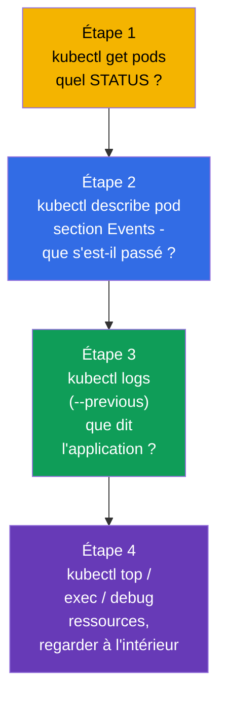
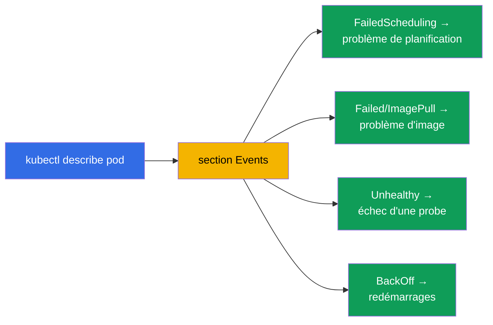
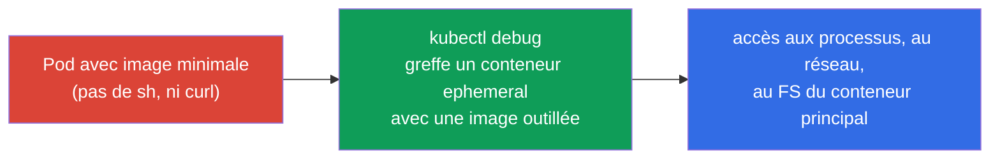
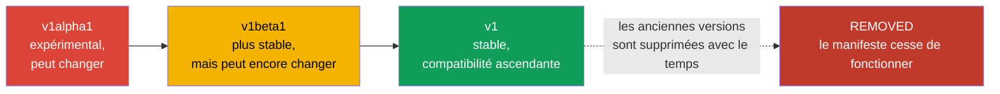
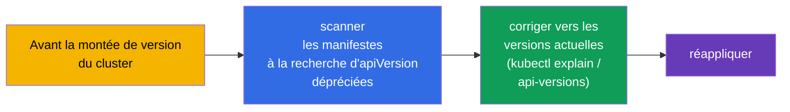
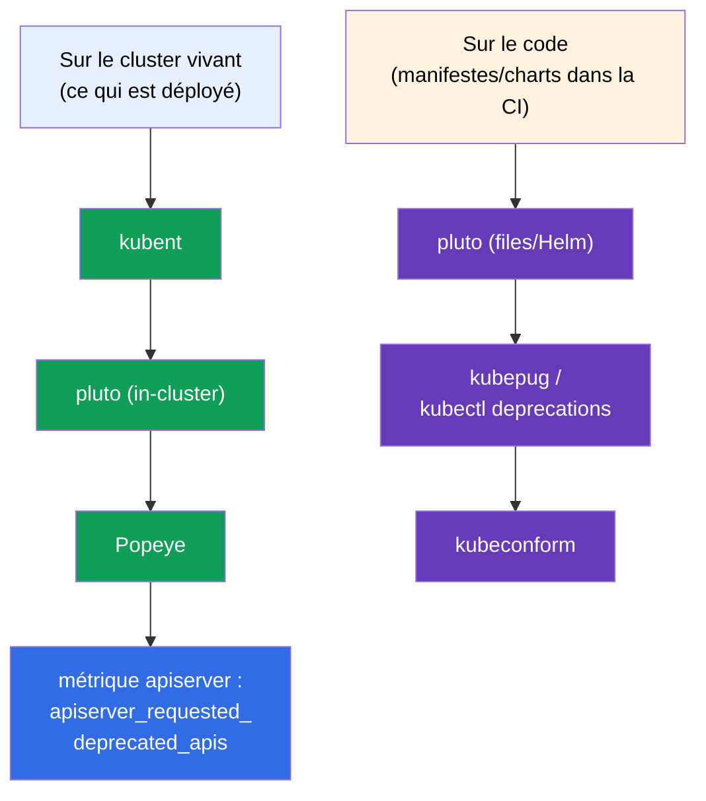

[Русская версия](ru.md) · [Eng version](README.md) · [Versión en español](es.md) · [Deutsche Version](de.md) · [ქართული ვერსია](ge.md)

# Chapitre 29. Débogage des applications et dépréciation des API

> **Ce qui suit.** Nous terminons la partie 6. Nous allons rassembler les compétences de débogage
> au niveau applicatif (le chapitre relève de l'Observability du CKAD et du troubleshooting du CKA)
> et traiter un sujet à part - la **dépréciation des API (API deprecations)**, que le CKAD met
> spécialement en avant. Le débogage du cluster (control plane, nœuds, réseau) sera détaillé en
> partie 9 ; ici l'accent est sur les pods et les applications, ainsi que sur la façon de ne rien
> casser lors d'une montée de version de Kubernetes.

## 29.1. Une approche systématique du débogage d'un pod

Tâtonner au hasard est l'ennemi du débogage sous chronomètre. Il existe un itinéraire clair : du
statut vers la cause.



Le STATUS (chapitre 4) oriente immédiatement le diagnostic :

| STATUS | Première action |
|--------|-----------------|
| `Pending` | `describe` → Events : pas de ressources ? taint ? nodeSelector ? PVC non lié ? |
| `ImagePullBackOff` | `describe` : nom/tag de l'image, accès au registre, imagePullSecret |
| `CrashLoopBackOff` | `logs --previous` : pourquoi il tombe au démarrage |
| `CreateContainerConfigError` | le ConfigMap/Secret référencé par le pod est absent |
| `Running`, mais ne fonctionne pas | `logs`, `exec`, vérifier la readiness et les Endpoints |
| `OOMKilled` | `describe` (Last State) + `top` : la limite mémoire est trop basse |

## 29.2. describe et les Events - la principale source de causes

`kubectl describe` est l'outil le plus sous-estimé. En bas de sa sortie se trouve la section
**Events** avec la chronologie : ce que le planificateur, le kubelet et les contrôleurs ont fait
avec l'objet et où ils se sont bloqués.

```bash
kubectl describe pod <pod>
# ... en bas :
# Events:
#   Warning  FailedScheduling  ...  0/3 nodes are available: insufficient memory
#   Warning  Failed            ...  Error: ImagePullBackOff
```



Les événements sont conservés un temps limité. Pour voir tous les événements du namespace, triés
par date :

```bash
kubectl get events --sort-by='.lastTimestamp'
kubectl get events --field-selector type=Warning
```

## 29.3. Regarder à l'intérieur : exec et port-forward

Quand les logs ne donnent pas la réponse, on entre à l'intérieur.

```bash
# Un shell à l'intérieur du conteneur
kubectl exec -it <pod> -- sh
kubectl exec -it <pod> -c <container> -- sh    # un conteneur précis

# Exécuter une seule commande
kubectl exec <pod> -- env                       # variables d'environnement
kubectl exec <pod> -- cat /etc/config/app.conf  # vérifier la config montée
kubectl exec <pod> -- nslookup backend          # vérifier le DNS de l'intérieur

# Redirection de port vers la machine locale - tester l'application directement
kubectl port-forward pod/<pod> 8080:80
kubectl port-forward svc/<service> 8080:80
```

`port-forward` est utile pour s'adresser directement au pod/service en contournant l'Ingress et
vérifier si l'application elle-même fonctionne (cela réduit le champ : le problème est-il dans
l'application ou dans le routage).

## 29.4. kubectl debug et les conteneurs ephemeral

Le problème : les images minimales (distroless/scratch - chapitre 23) ne contiennent ni `sh`, ni
`curl`, ni `ps` - il n'y a rien pour entrer via `exec`. La solution est le **conteneur ephemeral**
via `kubectl debug` : un conteneur de débogage temporaire est greffé dans un pod **en cours
d'exécution**, en partageant son namespace de processus et son réseau, mais avec sa propre image
(qui, elle, contient les outils).



```bash
# Greffer un conteneur de débogage dans un pod en cours d'exécution
kubectl debug -it <pod> --image=busybox --target=<container>

# Faire une copie du pod pour le débogage (sans toucher à l'original)
kubectl debug <pod> -it --image=busybox --copy-to=<pod>-debug

# Débogage d'un nœud - un pod avec accès au FS du nœud
kubectl debug node/<node> -it --image=busybox
```

Les conteneurs ephemeral ne peuvent pas être ajoutés d'avance dans un manifeste - seulement via
`kubectl debug` sur un pod vivant. Ils ne redémarrent pas. C'est la bonne façon de déboguer les
images minimales « silencieuses » sans les reconstruire.

> **Comment « désactiver » un conteneur ephemeral déjà greffé ?** Il est **impossible** de le
> supprimer par une commande dédiée : l'API n'autorise pas le retrait d'entrées de
> `spec.ephemeralContainers`, et une commande du genre `kubectl delete container` n'existe pas. Ce
> que l'on peut faire :
>
> - **terminer le processus** à l'intérieur - sortir du shell (`exit`) ou tuer le processus. Le
>   conteneur ephemeral passera en `Terminated` et, comme il ne redémarre pas, il ne fonctionnera
>   plus. Mais il **restera dans la description du pod** - on le voit toujours dans `kubectl
>   describe pod` (section `Ephemeral Containers`) et dans `kubectl get pod -o yaml`.
> - **le retirer complètement** n'est possible qu'en **recréant le pod** : `kubectl delete pod
>   <pod>` (si le pod est géré par un contrôleur - Deployment/StatefulSet - il repartira déjà sans
>   le conteneur de débogage). C'est pourquoi, pour un débogage que l'on veut « jeter » proprement,
>   l'option `--copy-to` est pratique : vous travaillez avec une copie du pod puis vous la
>   supprimez simplement, sans toucher à l'original.
>
> Conclusion pratique : un conteneur ephemeral est « jetable ». On ne l'éteint pas et on ne le
> réutilise pas, on vit avec lui jusqu'à la recréation du pod.

## 29.5. Dépréciation des API (API deprecations)

Un sujet à part du CKAD. Kubernetes évolue, et les versions des groupes d'API changent : `alpha` →
`beta` → stable (`v1`). Les anciennes versions finissent par être **supprimées**. Un manifeste avec
une ancienne `apiVersion` cessera tout simplement de s'appliquer après une montée de version du
cluster.



Exemples historiques de versions supprimées (on aime les citer) :

| Avant (déprécié/supprimé) | Devenu |
|-------------------------|-------|
| `extensions/v1beta1` Deployment/Ingress | `apps/v1`, `networking.k8s.io/v1` |
| `networking.k8s.io/v1beta1` Ingress | `networking.k8s.io/v1` |
| `policy/v1beta1` PodDisruptionBudget | `policy/v1` |
| `batch/v1beta1` CronJob | `batch/v1` |

## 29.6. Comment trouver et corriger les API dépréciées

```bash
# Vérifier quelle version d'API est d'actualité pour une ressource
kubectl explain deployment            # affiche l'apiVersion courante
kubectl api-versions                  # toutes les versions d'API disponibles dans le cluster
kubectl api-resources                 # les ressources et leurs groupes

# Outils de détection des API dépréciées dans les manifestes (en prod)
# kubectl deprecations / pluto / kubent - scannent les manifestes et le cluster
```

La marche à suivre : avant une montée de version du cluster, on vérifie les manifestes à la
recherche d'`apiVersion` dépréciées, on les corrige vers les versions actuelles (`kubectl explain`
indiquera la version courante), puis on réapplique. Lors d'un appel à une API dépréciée, Kubernetes
affiche en général un avertissement dans la sortie de `kubectl` - il vaut la peine d'y prêter
attention.



## 29.7. Outils open-source d'analyse des API dépréciées

Vérifier à la main des dizaines de manifestes et de releases Helm est irréaliste - il existe pour
cela des outils open-source prêts à l'emploi. Ils travaillent à deux endroits : sur le **cluster
vivant** (ce qui est déjà déployé) et sur le **code** (manifestes/charts dans le dépôt, dans la CI
avant le déploiement).



| Outil | Ce qu'il scanne | Particularité |
|-----------|---------------|-------------|
| **kubent** (kube-no-trouble) | cluster vivant + releases Helm | binaire simple, check rapide avant montée de version |
| **pluto** (Fairwinds) | cluster, **fichiers de manifestes**, charts/releases Helm | cible une version précise de K8s ; codes de retour pour la CI |
| **kubepug** (Deprecated APIs) | cluster et fichiers face à une version **cible** | compare avec l'OpenAPI de la version cible ; existe aussi comme `kubectl deprecations` |
| **kubeconform** | fichiers face aux schémas JSON de la version cible | validateur rapide en CI ; attrape les kind/versions supprimés |
| **Popeye** | cluster vivant (sanitizer) | en plus des API, il trouve d'autres problèmes d'hygiène |

```bash
# --- sur le cluster ---
kubent                                   # ce qui est déployé avec des API deprecated/removed
pluto detect-all-in-cluster
popeye

# --- sur le code / en CI (en visant une version cible) ---
pluto detect-files -d ./manifests/ --target-versions k8s=v1.32.0
kubepug --input-file ./manifests/ --k8s-version v1.32.0
kubectl deprecations --k8s-version v1.32.0     # kubepug comme plugin kubectl
kubeconform -kubernetes-version 1.32.0 ./manifests/
```

Bonne pratique : **les deux à la fois** - `kubent`/`pluto` sur le cluster avant la montée de
version, et `pluto`/`kubepug`/`kubeconform` dans le pipeline CI, pour qu'une `apiVersion` dépréciée
n'arrive jamais en prod. En complément, l'apiserver expose la métrique
`apiserver_requested_deprecated_apis` - on y accroche une alerte dans Prometheus (chapitre 28) pour
voir les appels aux API dépréciées à l'avance.

## 29.8. Comment cela s'applique en production

- **L'itinéraire de débogage est le même.** En prod, l'astreinte suit le même chemin : STATUS →
  describe/Events → logs → exec/debug. La différence tient seulement à l'échelle (des centaines de
  pods) et au fait que logs et métriques viennent de systèmes centralisés (chapitre 28), et pas
  uniquement de `kubectl`.
- **kubectl debug pour les images minimales.** Puisqu'en prod les images sont minimales (sécurité),
  les conteneurs ephemeral sont le moyen principal de déboguer à chaud, sans reconstruction et sans
  baisser la sécurité de l'image.
- **Vérification des deprecations avant chaque montée de version.** La mise à jour de la version du
  cluster est une opération planifiée, avant laquelle on scanne obligatoirement les manifestes à la
  recherche d'API supprimées (pluto/kubent), sinon après la montée de version une partie des
  ressources cessera de s'appliquer (la CI/CD, le GitOps casseront).
- **La CI attrape les API dépréciées à l'avance.** Les équipes mûres vérifient les manifestes pour
  les API deprecated directement dans le pipeline, afin de ne pas le découvrir au moment de la
  montée de version de la prod.
- **Les avertissements ne sont pas ignorés.** Un Warning sur une API dépréciée dans la sortie de
  `kubectl` ou dans la CI est un signal pour mettre à jour le manifeste à l'avance, et non quand la
  version est déjà supprimée.

## 29.9. Mini-glossaire

- **Events** - la chronologie des actions sur un objet dans la sortie de `describe`/`get events`.
- **exec** - exécuter une commande/un shell à l'intérieur d'un conteneur.
- **port-forward** - redirection d'un port d'un pod/service vers la machine locale.
- **conteneur ephemeral** - conteneur de débogage temporaire dans un pod vivant (`kubectl debug`).
- **kubectl debug** - greffer un conteneur de débogage / copier un pod / déboguer un nœud.
- **API deprecation** - déclaration d'une version d'API comme dépréciée, suivie de sa suppression.
- **apiVersion** - la version du groupe d'API d'un objet (alpha/beta/stable).
- **pluto / kubent** - outils de recherche d'API dépréciées dans les manifestes/le cluster.
- **kubepug (kubectl deprecations)** - vérification des API face à une version cible de K8s (cluster et fichiers).
- **kubeconform** - validateur de manifestes selon les schémas de la version cible (CI).
- **Popeye** - sanitizer de cluster, qui trouve entre autres les API dépréciées.
- **apiserver_requested_deprecated_apis** - métrique des appels aux API dépréciées (alerte dans Prometheus).

## 29.10. Bilan du chapitre

- Le débogage d'un pod suit l'itinéraire : STATUS (`get`) → Events (`describe`) → logs (`logs
  --previous`) → ressources/intérieur (`top`, `exec`, `debug`).
- `describe` et sa section Events sont la principale source de causes (planification, image, probes,
  redémarrages) ; `get events --sort-by` donne le tableau complet.
- `exec` et `port-forward` permettent de regarder à l'intérieur et de tester l'application
  directement.
- `kubectl debug` avec un conteneur ephemeral est le moyen de déboguer une image minimale (sans sh),
  un pod vivant ou un nœud, sans reconstruire l'image.
- Une API parcourt le chemin alpha → beta → stable ; les anciennes versions sont supprimées, et les
  manifestes qui les utilisent cessent de fonctionner après la montée de version.
- Avant la mise à jour du cluster, on vérifie les manifestes à la recherche d'`apiVersion`
  dépréciées (kubectl explain / api-versions, pluto/kubent) et on les corrige vers les actuelles.
- Outils open-source : sur le cluster - kubent, pluto, Popeye ; sur le code en CI - pluto, kubepug
  (`kubectl deprecations`), kubeconform ; plus la métrique de l'apiserver pour les alertes.

## 29.11. À quoi cela sert : à l'examen et dans le travail réel

**À l'examen.** « Répare le pod/l'application cassé » est le cœur du troubleshooting (30 % du CKA)
et de l'Observability (CKAD). L'itinéraire get→describe→logs→exec résout la majorité de ces
exercices. `kubectl debug` et la mise à jour d'une `apiVersion` dépréciée sont des savoir-faire
concrets vérifiés directement (surtout les deprecations au CKAD).

**Dans le travail réel.** Un débogage systématique fait gagner du temps lors des incidents, et les
conteneurs ephemeral permettent de garder des images minimales tout en pouvant les déboguer. La
vérification des deprecations avant une montée de version du cluster est une étape obligatoire, sans
laquelle la mise à jour de Kubernetes casse des manifestes qui fonctionnaient et les chaînes de
livraison.

## 29.12. Questions d'auto-évaluation

1. Décrivez l'itinéraire systématique de débogage d'un pod. Par quoi commencer ?
2. Où `describe` montre-t-il les causes des problèmes et que faut-il y chercher en cas de Pending ?
3. Quand `port-forward` aide-t-il à localiser un problème ?
4. À quoi sert `kubectl debug` et en quoi dépanne-t-il avec les images minimales ?
5. Quel chemin parcourt une version d'API et qu'arrive-t-il aux anciennes versions ?
6. Comment trouver l'`apiVersion` actuelle d'une ressource et vérifier le cluster pour les API dépréciées ?
7. Pourquoi la vérification des deprecations est-elle importante avant la mise à jour du cluster ?
8. Quels outils open-source scannent le cluster, et lesquels le code/les manifestes en CI ? Citez-en
   deux de chaque et dites ce qui les distingue.

## Pratique

La partie 6 (observabilité et maintenance) se termine ici. Vient ensuite la partie 7 : les services
et le réseau, en commençant par le modèle réseau de Kubernetes et le CNI (chapitre 30). Le débogage
et le travail avec les conteneurs ephemeral se travaillent dans les TP sur l'observabilité et le
troubleshooting.

🧪 TP 109 (débogage et dépréciation des API) : [tasks/cka/labs/109](../../labs/109/README_FR.MD)

---
[Sommaire](../README_FR.md) · [Chapitre 28](../28/fr.md) · [Chapitre 30](../30/fr.md)
