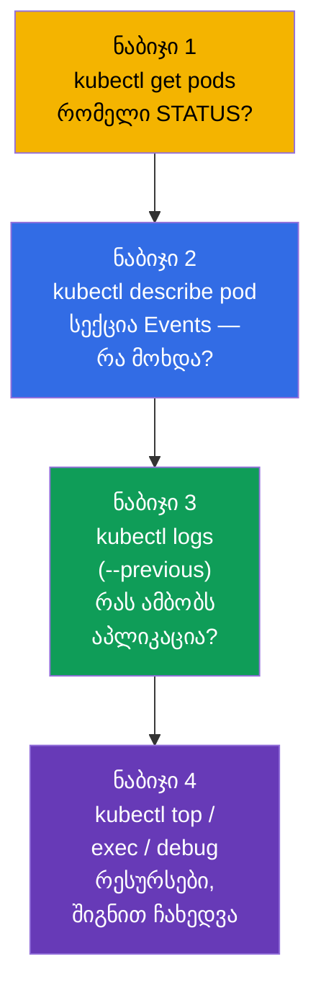
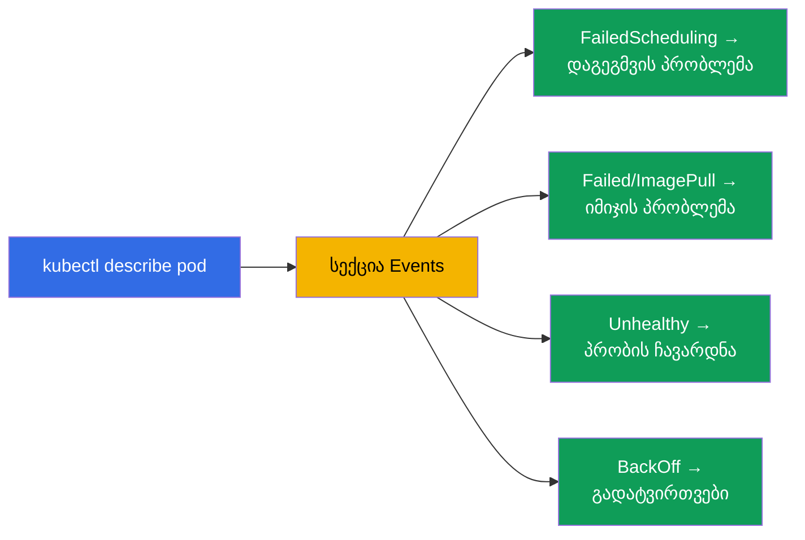
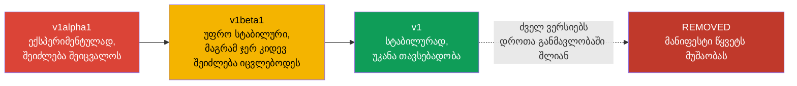
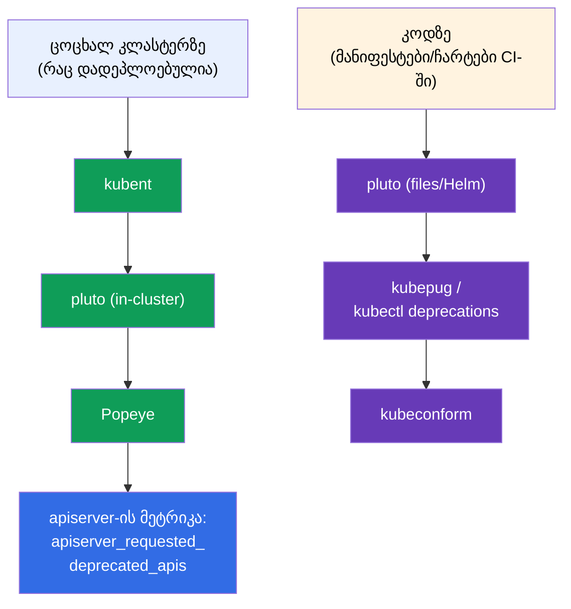

[Русская версия](ru.md) · [Eng version](README.md) · [Versión en español](es.md) · [Version française](fr.md) · [Deutsche Version](de.md)

# თავი 29. აპლიკაციების გამართვა და API-ს მოძველება

> **რა იქნება შემდეგ.** ვასრულებთ ნაწილ 6-ს. ერთად შევკრიბავთ აპლიკაციის დონის გამართვის უნარებს
> (თავი ეხება Observability CKAD-ს და troubleshooting CKA-ს) და გავარჩევთ ცალკე თემას -
> **API-ს მოძველებას (API deprecations)**, რომელსაც CKAD სპეციალურად გამოყოფს. კლასტერის
> გამართვას (control plane, ნოუდები, ქსელი) დეტალურად ნაწილ 9-ში გავარჩევთ; აქ ფოკუსი Pod-ებსა და
> აპლიკაციებზეა, ასევე იმაზე, როგორ არ ჩავარდეთ Kubernetes-ის ვერსიების განახლებისას.

## 29.1. Pod-ის გამართვის სისტემატური მიდგომა

ქაოტური ჩხირკედელაობა - გამართვის მტერია ტაიმერის ქვეშ. არსებობს ნათელი მარშრუტი: სტატუსიდან მიზეზამდე.



STATUS (თავი 4) მაშინვე მიმართავს დიაგნოსტიკას:

| STATUS | პირველი მოქმედება |
|--------|-----------------|
| `Pending` | `describe` → Events: არ არის რესურსები? taint? nodeSelector? PVC არ არის მიბმული? |
| `ImagePullBackOff` | `describe`: იმიჯის სახელი/ტეგი, წვდომა რეესტრთან, imagePullSecret |
| `CrashLoopBackOff` | `logs --previous`: რატომ ვარდება სტარტზე |
| `CreateContainerConfigError` | არ არის ConfigMap/Secret, რომელზეც Pod მიუთითებს |
| `Running`, მაგრამ არ მუშაობს | `logs`, `exec`, შეამოწმეთ readiness და Endpoints |
| `OOMKilled` | `describe` (Last State) + `top`: მეხსიერების ლიმიტი მცირეა |

## 29.2. describe და Events - მიზეზების მთავარი წყარო

`kubectl describe` - ყველაზე დაუფასებელი ინსტრუმენტია. მისი გამონატანის ბოლოში - სექცია **Events**
ქრონოლოგიით: რას აკეთებდნენ ობიექტთან შედულერი, kubelet და კონტროლერები და სად გაიჭედნენ.

```bash
kubectl describe pod <pod>
# ... ბოლოში:
# Events:
#   Warning  FailedScheduling  ...  0/3 nodes are available: insufficient memory
#   Warning  Failed            ...  Error: ImagePullBackOff
```



მოვლენები შეზღუდული დროით ინახება. namespace-ის ყველა მოვლენის ნახვა, დროის მიხედვით
დახარისხებული:

```bash
kubectl get events --sort-by='.lastTimestamp'
kubectl get events --field-selector type=Warning
```

## 29.3. შიგნით ჩახედვა: exec და port-forward

როცა ლოგები პასუხს არ იძლევა, შიგნით შევდივართ.

```bash
# გარსი კონტეინერის შიგნით
kubectl exec -it <pod> -- sh
kubectl exec -it <pod> -c <container> -- sh    # კონკრეტული კონტეინერი

# ერთი ბრძანების შესრულება
kubectl exec <pod> -- env                       # გარემოს ცვლადები
kubectl exec <pod> -- cat /etc/config/app.conf  # მონტირებული კონფიგის შემოწმება
kubectl exec <pod> -- nslookup backend          # DNS-ის შემოწმება შიგნიდან

# პორტის გადაცემა ლოკალურ მანქანაზე — აპლიკაციის პირდაპირი შემოწმება
kubectl port-forward pod/<pod> 8080:80
kubectl port-forward svc/<service> 8080:80
```

`port-forward` სასარგებლოა, რომ Pod-ს/სერვისს პირდაპირ მიმართოთ Ingress-ის გვერდის ავლით და
შეამოწმოთ, მუშაობს თუ არა თავად აპლიკაცია (ავიწროებს, სად არის პრობლემა - აპლიკაციაში თუ
მარშრუტიზაციაში).

## 29.4. kubectl debug და ephemeral-კონტეინერები

პრობლემა: მინიმალური იმიჯები (distroless/scratch - თავი 23) არ შეიცავენ `sh`, `curl`,
`ps`-ს - `exec`-ით შიგნით შესვლა არაფრით შეიძლება. გამოსავალი - **ephemeral-კონტეინერი** `kubectl
debug`-ის მეშვეობით: დროებითი სადიაგნოსტიკო კონტეინერი ჩაისმება **მომუშავე** Pod-ში, იზიარებს მის
პროცესების namespace-სა და ქსელს, მაგრამ საკუთარი იმიჯით (სადაც ინსტრუმენტებია).


```bash
# სადიაგნოსტიკო კონტეინერის ჩასმა მომუშავე Pod-ში
kubectl debug -it <pod> --image=busybox --target=<container>

# Pod-ის ასლის შექმნა გამართვისთვის (ორიგინალის შეუხებლად)
kubectl debug <pod> -it --image=busybox --copy-to=<pod>-debug

# ნოუდის გამართვა — Pod ნოუდის ფაილურ სისტემასთან წვდომით
kubectl debug node/<node> -it --image=busybox
```

ephemeral-კონტეინერების მანიფესტში წინასწარ დამატება შეუძლებელია - მხოლოდ `kubectl debug`-ით
ცოცხალ Pod-თან. ისინი არ გადაიტვირთება. ეს არის „ჩუმი“ მინიმალური იმიჯების გამართვის სწორი
გზა, მათი ხელახლა აწყობის გარეშე.

> **როგორ „გამოვრთოთ“ უკვე ჩასმული ephemeral-კონტეინერი?** ცალკე ბრძანებით მისი წაშლა
> **შეუძლებელია**: API არ იძლევა `spec.ephemeralContainers`-იდან ჩანაწერების მოშორების უფლებას, ხოლო ბრძანება
> `kubectl delete container`-ის მსგავსი არ არსებობს. რისი გაკეთება შეიძლება:
>
> - **პროცესის დასრულება** შიგნით - გამოსვლა შელიდან (`exit`) ან პროცესის მოკვლა. ephemeral-
>   კონტეინერი გადავა `Terminated`-ში და, ვინაიდან არ გადაიტვირთება, აღარ იმუშავებს.
>   მაგრამ ის **დარჩება Pod-ის აღწერაში** - ის კვლავ ჩანს `kubectl describe
>   pod`-ში (სექცია `Ephemeral Containers`) და `kubectl get pod -o yaml`-ში.
> - **სრულად მოშორება** მისი შესაძლებელია მხოლოდ **Pod-ის ხელახლა შექმნით**: `kubectl delete pod
>   <pod>` (თუ Pod კონტროლერის ქვეშაა - Deployment/StatefulSet - ის ხელახლა აიწევს უკვე
>   სადიაგნოსტიკო კონტეინერის გარეშე). ამიტომ გამართვისთვის, რომლის „გადაგდებაც“ სუფთად გვინდა,
>   მოსახერხებელია ვარიანტი `--copy-to`: თქვენ მუშაობთ Pod-ასლთან და შემდეგ უბრალოდ
>   შლით მას, ორიგინალის შეუხებლად.
>
> პრაქტიკული დასკვნა: ephemeral-კონტეინერი - „ერთჯერადია“. მას არ აქრობენ და არ იყენებენ ხელახლა,
> არამედ მასთან ერთად ცხოვრობენ Pod-ის ხელახლა შექმნამდე.

## 29.5. API-ს მოძველება (API deprecations)

CKAD-ის ცალკე თემა. Kubernetes ვითარდება, და API-ჯგუფების ვერსიები იცვლება: `alpha` → `beta`
→ სტაბილური (`v1`). ძველ ვერსიებს დროთა განმავლობაში **შლიან**. მანიფესტი ძველი
`apiVersion`-ით კლასტერის განახლების შემდეგ უბრალოდ შეწყვეტს გამოყენებას.



წაშლილი ვერსიების ისტორიული მაგალითები (მათი მოყვანა უყვართ):

| იყო (მოძველდა/წაიშალა) | გახდა |
|-------------------------|-------|
| `extensions/v1beta1` Deployment/Ingress | `apps/v1`, `networking.k8s.io/v1` |
| `networking.k8s.io/v1beta1` Ingress | `networking.k8s.io/v1` |
| `policy/v1beta1` PodDisruptionBudget | `policy/v1` |
| `batch/v1beta1` CronJob | `batch/v1` |

## 29.6. როგორ მოვძებნოთ და გავასწოროთ მოძველებული API

```bash
# შემოწმება, რომელი API-ს ვერსიაა აქტუალური რესურსისთვის
kubectl explain deployment            # აჩვენებს მიმდინარე apiVersion-ს
kubectl api-versions                  # ყველა ხელმისაწვდომი API ვერსია კლასტერში
kubectl api-resources                 # რესურსები და მათი ჯგუფები

# მანიფესტებში მოძველებული API-ს აღმოჩენის ინსტრუმენტები (პროდში)
# kubectl deprecations / pluto / kubent — სკანირებენ მანიფესტებს და კლასტერს
```

მოქმედებების რიგი: კლასტერის განახლებამდე ამოწმებენ მანიფესტებს მოძველებულ
`apiVersion`-ზე, ასწორებენ აქტუალურებზე (`kubectl explain` მიმდინარეს გეტყვით), ხელახლა
გამოიყენებენ. Kubernetes მოძველებულ API-სთან მიმართვისას ჩვეულებრივ ბეჭდავს გამაფრთხილებელს
`kubectl`-ის გამონატანში - მას ყურადღება უნდა მიექცეს.


## 29.7. მოძველებული API-ს ანალიზის open-source ინსტრუმენტები

ათეულობით მანიფესტისა და Helm-რელიზის ხელით შემოწმება არარეალურია - ამისთვის არსებობს მზა
open-source ინსტრუმენტები. ისინი ორ ადგილას მუშაობენ: **ცოცხალ კლასტერზე** (რაც უკვე
დადეპლოებულია) და **კოდზე** (მანიფესტები/ჩარტები რეპოზიტორიაში, CI-ში გაშვებამდე).



| ინსტრუმენტი | რას სკანირებს | თავისებურება |
|-----------|---------------|-------------|
| **kubent** (kube-no-trouble) | ცოცხალი კლასტერი + Helm-რელიზები | მარტივი ბინარი, სწრაფი წინა-აპგრეიდ-შემოწმება |
| **pluto** (Fairwinds) | კლასტერი, **მანიფესტების ფაილები**, Helm-ჩარტები/რელიზები | მიზანი — K8s-ის კონკრეტული ვერსია; დაბრუნების კოდები CI-სთვის |
| **kubepug** (Deprecated APIs) | კლასტერი და ფაილები **სამიზნე** ვერსიის მიმართ | ადარებს სამიზნე ვერსიის OpenAPI-სთან; არსებობს როგორც `kubectl deprecations` |
| **kubeconform** | ფაილები სამიზნე ვერსიის JSON-სქემების მიმართ | სწრაფი ვალიდატორი CI-ში; იჭერს წაშლილ kind/ვერსიებს |
| **Popeye** | ცოცხალი კლასტერი (სანიტაიზერი) | API-ს გარდა პოულობს ჰიგიენის სხვა პრობლემებსაც |

```bash
# --- კლასტერზე ---
kubent                                   # რაა დადეპლოებული deprecated/removed API-ით
pluto detect-all-in-cluster
popeye

# --- კოდზე / CI-ში (სამიზნე ვერსიაზე გათვლით) ---
pluto detect-files -d ./manifests/ --target-versions k8s=v1.32.0
kubepug --input-file ./manifests/ --k8s-version v1.32.0
kubectl deprecations --k8s-version v1.32.0     # kubepug როგორც kubectl-პლაგინი
kubeconform -kubernetes-version 1.32.0 ./manifests/
```

კარგი პრაქტიკა: **ორივე** - `kubent`/`pluto` კლასტერზე აპგრეიდამდე, და
`pluto`/`kubepug`/`kubeconform` CI-პაიპლაინში, რომ მოძველებული `apiVersion` პროდამდე არ
მიაღწიოს. დამატებით apiserver გასცემს მეტრიკას `apiserver_requested_deprecated_apis` -
მასზე კიდებენ ალერტს Prometheus-ში (თავი 28), რომ მოძველებულ API-სთან მიმართვები წინასწარ
დაინახონ.

## 29.8. როგორ იყენებენ ამას პროდაქშენში

- **სადიაგნოსტიკო მარშრუტი - იგივეა.** პროდში მორიგე იმავე გზით მიდის: STATUS →
  describe/Events → logs → exec/debug. განსხვავება მხოლოდ მასშტაბშია (ასეულობით Pod) და იმაში, რომ
  ლოგებს/მეტრიკებს ცენტრალიზებული სისტემებიდან იღებენ (თავი 28), და არა მხოლოდ `kubectl`-იდან.
- **kubectl debug მინიმალური იმიჯებისთვის.** რაკი პროდში იმიჯები მინიმალურია (უსაფრთხოება),
  ephemeral-კონტეინერები - ცოცხალი გამართვის ძირითადი გზაა ხელახლა აწყობის გარეშე და იმიჯის
  უსაფრთხოების შემცირების გარეშე.
- **deprecations-ის შემოწმება ყოველ აპგრეიდამდე.** კლასტერის ვერსიის განახლება - დაგეგმილი
  ოპერაციაა, რომლის წინაც აუცილებლად სკანირებენ მანიფესტებს წაშლილ API-ზე (pluto/kubent),
  თორემ აპგრეიდის შემდეგ რესურსების ნაწილი შეწყვეტს გამოყენებას (გატყდება CI/CD, GitOps).
- **CI იჭერს მოძველებულ API-ს წინასწარ.** მომწიფებული გუნდები მანიფესტებს deprecated
  API-ზე პირდაპირ პაიპლაინში ამოწმებენ, რომ ეს პროდის აპგრეიდის მომენტში არ გაარკვიონ.
- **გამაფრთხილებლებს არ იგნორირებენ.** Warning მოძველებული API-ს შესახებ `kubectl`-ის გამონატანში ან
  CI-ში - სიგნალია მანიფესტის წინასწარ განახლებისკენ, და არა მაშინ, როცა ვერსია უკვე წაშლილია.

## 29.9. მინი-ლექსიკონი

- **Events** - ობიექტთან მოქმედებების ქრონოლოგია `describe`/`get events`-ის გამონატანში.
- **exec** - ბრძანების/გარსის შესრულება კონტეინერის შიგნით.
- **port-forward** - Pod-ის/სერვისის პორტის გადაცემა ლოკალურ მანქანაზე.
- **ephemeral-კონტეინერი** - დროებითი სადიაგნოსტიკო კონტეინერი ცოცხალ Pod-ში (`kubectl debug`).
- **kubectl debug** - სადიაგნოსტიკო კონტეინერის ჩასმა / Pod-ის კოპირება / ნოუდის გამართვა.
- **API deprecation** - API-ს ვერსიის მოძველებულად გამოცხადება შემდგომი წაშლით.
- **apiVersion** - ობიექტის API-ჯგუფის ვერსია (alpha/beta/სტაბილური).
- **pluto / kubent** - მანიფესტებში/კლასტერში მოძველებული API-ს ძებნის ინსტრუმენტები.
- **kubepug (kubectl deprecations)** - API-ს შემოწმება K8s-ის სამიზნე ვერსიის მიმართ (კლასტერი და ფაილები).
- **kubeconform** - მანიფესტების ვალიდატორი სამიზნე ვერსიის სქემების მიხედვით (CI).
- **Popeye** - კლასტერის სანიტაიზერი, მათ შორის პოულობს მოძველებულ API-ს.
- **apiserver_requested_deprecated_apis** - მოძველებულ API-სთან მიმართვების მეტრიკა (ალერტი Prometheus-ში).

## 29.10. თავის შეჯამება

- Pod-ის გამართვა მიდის მარშრუტით: STATUS (`get`) → Events (`describe`) → ლოგები (`logs
  --previous`) → რესურსები/შიგნით (`top`, `exec`, `debug`).
- `describe` და მისი სექცია Events - მიზეზების მთავარი წყაროა (დაგეგმვა, იმიჯი, პრობები,
  გადატვირთვები); `get events --sort-by` სრულ სურათს იძლევა.
- `exec` და `port-forward` საშუალებას გვაძლევს შიგნით ჩავიხედოთ და აპლიკაცია პირდაპირ შევამოწმოთ.
- `kubectl debug` ephemeral-კონტეინერით - მინიმალური იმიჯის (sh-ის გარეშე), ცოცხალი Pod-ის ან
  ნოუდის გამართვის საშუალებაა, იმიჯის ხელახლა აწყობის გარეშე.
- API გადის გზას alpha → beta → სტაბილური; ძველ ვერსიებს შლიან, და მანიფესტები მათთან ერთად
  აპგრეიდის შემდეგ წყვეტს მუშაობას.
- კლასტერის განახლებამდე მანიფესტებს ამოწმებენ მოძველებულ `apiVersion`-ზე (kubectl
  explain / api-versions, pluto/kubent) და ასწორებენ აქტუალურებზე.
- Open-source ინსტრუმენტები: კლასტერზე - kubent, pluto, Popeye; კოდზე CI-ში - pluto,
  kubepug (`kubectl deprecations`), kubeconform; პლუს apiserver-ის მეტრიკა ალერტებისთვის.

## 29.11. როგორ გამოგადგებათ: გამოცდაზე და რეალურ სამუშაოში

**გამოცდაზე.** „გაასწორე გატეხილი Pod/აპლიკაცია“ - troubleshooting-ის (CKA-ს 30%) და
Observability-ის (CKAD) ბირთვია. მარშრუტი get→describe→logs→exec ასეთი ამოცანების უმეტესობას წყვეტს.
`kubectl debug` და მოძველებული `apiVersion`-ის განახლება - კონკრეტული უნარებია, რომლებსაც
პირდაპირ ამოწმებენ (განსაკუთრებით deprecations CKAD-ზე).

**რეალურ სამუშაოში.** სისტემატური გამართვა დროს ზოგავს ინციდენტების დროს, ხოლო
ephemeral-კონტეინერები საშუალებას გვაძლევს იმიჯები მინიმალური დავიტოვოთ და მაინც გავმართოთ ისინი.
deprecations-ის შემოწმება კლასტერის აპგრეიდამდე - სავალდებულო ნაბიჯია, რომლის გარეშე
Kubernetes-ის ვერსიის განახლება ტეხავს მომუშავე მანიფესტებსა და მიწოდების კონვეიერებს.

## 29.12. თვითშემოწმების კითხვები

1. აღწერეთ Pod-ის გამართვის სისტემატური მარშრუტი. რითი დავიწყოთ?
2. სად აჩვენებს `describe` პრობლემების მიზეზებს და რა უნდა ვეძებოთ იქ Pending-ის დროს?
3. როდის ეხმარება `port-forward` პრობლემის ლოკალიზაციაში?
4. რისთვის არის საჭირო `kubectl debug` და რითი გვშველის მინიმალური იმიჯების დროს?
5. რა გზას გადის API-ს ვერსია და რა ხდება ძველ ვერსიებთან?
6. როგორ მოვძებნოთ აქტუალური `apiVersion` რესურსისთვის და შევამოწმოთ კლასტერი მოძველებულ API-ზე?
7. რატომ არის მნიშვნელოვანი deprecations-ის შემოწმება კლასტერის განახლებამდე?
8. რომელი open-source ინსტრუმენტები სკანირებენ კლასტერს, და რომლები — კოდს/მანიფესტებს CI-ში? დაასახელეთ
   ორ-ორი და რითი განსხვავდებიან.

## პრაქტიკა

ამით ნაწილი 6 (დაკვირვებადობა და მომსახურება) დასრულებულია. შემდეგ - ნაწილი 7: სერვისები და ქსელი,
Kubernetes-ის ქსელური მოდელითა და CNI-თი დაწყებული (თავი 30). გამართვა და ephemeral-
კონტეინერებთან მუშაობა მუშავდება დაკვირვებადობისა და troubleshooting-ის ლაბებში.

🧪 ლაბი 109 (გამართვა და API-ს მოძველება): [tasks/cka/labs/109](../../labs/109/README_GE.MD)

---
[სარჩევი](../README_GE.md) · [თავი 28](../28/ge.md) · [თავი 30](../30/ge.md)
