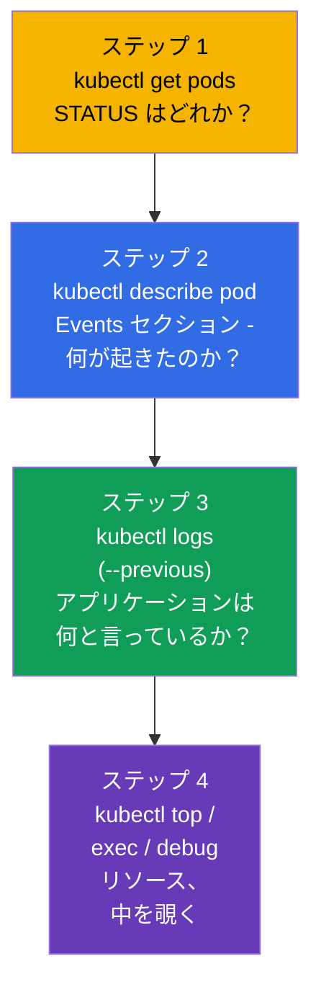
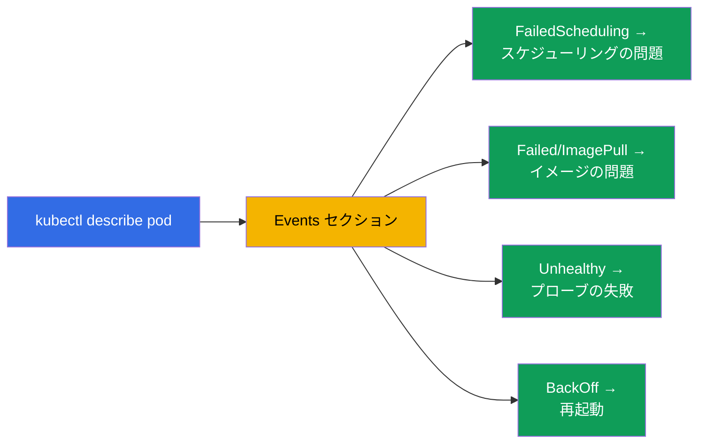
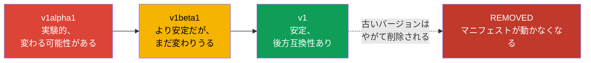
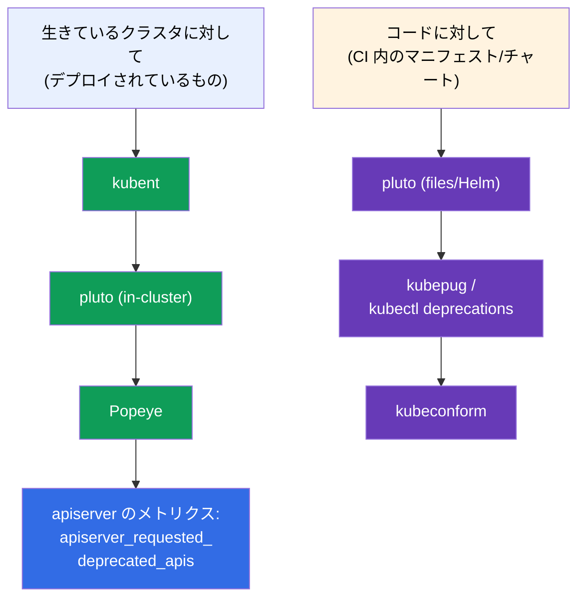

[Русская версия](ru.md) · [Eng version](README.md) · [Versión en español](es.md) · [Version française](fr.md) · [Deutsche Version](de.md) · [ქართული ვერსია](ge.md) · [繁體中文版](tw.md)

# 第 29 章。アプリケーションのデバッグと API の廃止

> **次は何か。** パート 6 を締めくくります。アプリケーションレベルのデバッグのスキル
> （この章は CKAD の Observability と CKA の troubleshooting に属します）を一つにまとめ、
> CKAD が特別に切り出しているテーマ - **API の廃止 (API deprecations)** を扱います。
> クラスタのデバッグ (control plane、ノード、ネットワーク) はパート 9 で詳しく扱います。
> ここでは Pod とアプリケーション、そして Kubernetes のバージョンを更新するときに
> 壊れないようにする方法に焦点を当てます。

## 29.1. Pod のデバッグへの体系的なアプローチ

手当たり次第に突くのは、タイマー付きのデバッグの敵です。明確な道筋があります：状態から原因へ。



STATUS (第 4 章) はすぐに診断の方向を決めてくれます：

| STATUS | 最初の行動 |
|--------|-----------------|
| `Pending` | `describe` → Events：リソース不足？ taint？ nodeSelector？ PVC が bound していない？ |
| `ImagePullBackOff` | `describe`：イメージの名前/タグ、レジストリへのアクセス、imagePullSecret |
| `CrashLoopBackOff` | `logs --previous`：なぜ起動時に落ちるのか |
| `CreateContainerConfigError` | Pod が参照している ConfigMap/Secret が存在しない |
| `Running` なのに動かない | `logs`、`exec`、readiness と Endpoints を確認 |
| `OOMKilled` | `describe` (Last State) + `top`：メモリの上限が小さい |

## 29.2. describe と Events - 原因の主な情報源

`kubectl describe` はもっとも過小評価されているツールです。その出力のいちばん下に
**Events** セクションがあり、時系列が並びます：スケジューラ、kubelet、コントローラが
オブジェクトに対して何をしたのか、そしてどこで詰まったのか。

```bash
kubectl describe pod <pod>
# ... いちばん下に:
# Events:
#   Warning  FailedScheduling  ...  0/3 nodes are available: insufficient memory
#   Warning  Failed            ...  Error: ImagePullBackOff
```



イベントは限られた時間しか保存されません。namespace のすべてのイベントを時刻順に
並べて見るには：

```bash
kubectl get events --sort-by='.lastTimestamp'
kubectl get events --field-selector type=Warning
```

## 29.3. 中を覗く：exec と port-forward

ログが答えをくれないときは、中に入ります。

```bash
# コンテナ内のシェル
kubectl exec -it <pod> -- sh
kubectl exec -it <pod> -c <container> -- sh    # 特定のコンテナ

# コマンドを 1 つ実行する
kubectl exec <pod> -- env                       # 環境変数
kubectl exec <pod> -- cat /etc/config/app.conf  # マウントされた設定を確認
kubectl exec <pod> -- nslookup backend          # 内側から DNS を確認

# ローカルマシンへのポート転送 - アプリケーションに直接アクセスする
kubectl port-forward pod/<pod> 8080:80
kubectl port-forward svc/<service> 8080:80
```

`port-forward` は、Ingress を迂回して Pod/Service に直接アクセスし、アプリケーション
そのものが動いているかどうかを確認するのに役立ちます (問題がアプリケーションにあるのか
ルーティングにあるのか、範囲を絞れます)。

## 29.4. kubectl debug と ephemeral コンテナ

問題：最小限のイメージ (distroless/scratch - 第 23 章) には `sh`、`curl`、`ps` が
入っていないため、`exec` で中に入る手段がありません。解決策は `kubectl debug` による
**ephemeral コンテナ** です：一時的なデバッグ用コンテナが **動いている** Pod に
同乗し、そのプロセス namespace とネットワークを共有しますが、イメージは自分のもの
(ツールが入っているもの) を使います。


```bash
# 動いている Pod にデバッグ用コンテナを同乗させる
kubectl debug -it <pod> --image=busybox --target=<container>

# デバッグ用に Pod のコピーを作る (オリジナルには触らない)
kubectl debug <pod> -it --image=busybox --copy-to=<pod>-debug

# ノードのデバッグ - ノードの FS にアクセスできる Pod
kubectl debug node/<node> -it --image=busybox
```

ephemeral コンテナはマニフェストにあらかじめ書いておくことはできません - 生きている
Pod に対して `kubectl debug` 経由でのみ追加できます。再起動もされません。これは
「無口な」最小限のイメージを、作り直さずにデバッグするための正しい方法です。

> **すでに同乗させた ephemeral コンテナを「切る」にはどうするか？** 専用のコマンドで
> 削除することは **できません**：API は `spec.ephemeralContainers` からエントリを
> 取り除くことを許さず、`kubectl delete container` のようなコマンドも存在しません。
> できることは：
>
> - 中の **プロセスを終了する** - シェルから抜ける (`exit`) か、プロセスを落とす。
>   ephemeral コンテナは `Terminated` に移り、再起動されないのでそれ以上は動きません。
>   ただし **Pod の記述には残ります** - `kubectl describe pod` (`Ephemeral Containers`
>   セクション) と `kubectl get pod -o yaml` では引き続き見えます。
> - **完全に取り除く** には **Pod を作り直す** しかありません：`kubectl delete pod
>   <pod>` (Pod がコントローラ - Deployment/StatefulSet - の配下なら、デバッグ用
>   コンテナのない状態で再び立ち上がります)。ですから、きれいに「捨てたい」デバッグには
>   `--copy-to` が便利です：コピーの Pod で作業し、あとはオリジナルに触らずにそれを
>   削除するだけです。
>
> 実務上の結論：ephemeral コンテナは「使い捨て」です。消したり再利用したりするものでは
> なく、Pod を作り直すまで一緒に暮らすものです。

## 29.5. API の廃止 (API deprecations)

CKAD の独立したテーマです。Kubernetes は発展し、API グループのバージョンは変わります：
`alpha` → `beta` → 安定版 (`v1`)。古いバージョンはやがて **削除されます**。古い
`apiVersion` のマニフェストは、クラスタを更新したあと単純に適用できなくなります。



削除されたバージョンの歴史的な例 (よく引き合いに出されます)：

| 以前 (廃止/削除された) | 現在 |
|-------------------------|-------|
| `extensions/v1beta1` Deployment/Ingress | `apps/v1`, `networking.k8s.io/v1` |
| `networking.k8s.io/v1beta1` Ingress | `networking.k8s.io/v1` |
| `policy/v1beta1` PodDisruptionBudget | `policy/v1` |
| `batch/v1beta1` CronJob | `batch/v1` |

## 29.6. 廃止された API の見つけ方と直し方

```bash
# リソースに対して現在有効な API バージョンを確認する
kubectl explain deployment            # 現在の apiVersion を表示する
kubectl api-versions                  # クラスタで利用できるすべての API バージョン
kubectl api-resources                 # リソースとそのグループ

# マニフェスト内の廃止 API を検出するツール (本番で)
# kubectl deprecations / pluto / kubent - マニフェストとクラスタをスキャンする
```

手順：クラスタを更新する前にマニフェストを廃止された `apiVersion` について点検し、
現行のものに直し (`kubectl explain` が現在のものを教えてくれます)、あらためて適用します。
Kubernetes は廃止された API へのアクセス時に通常 `kubectl` の出力に警告を表示します -
これには注意を払う価値があります。


## 29.7. 廃止 API を分析する open-source ツール

数十のマニフェストや Helm リリースを手作業で点検するのは現実的ではありません - そのために
既製の open-source ツールがあります。それらは 2 つの場所で働きます：**生きている
クラスタ** に対して (すでにデプロイされているもの) と、**コード** に対して
(リポジトリ内のマニフェスト/チャート、リリース前の CI で)。



| ツール | 何をスキャンするか | 特徴 |
|-----------|---------------|-------------|
| **kubent** (kube-no-trouble) | 生きているクラスタ + Helm リリース | シンプルなバイナリ、素早いアップグレード前チェック |
| **pluto** (Fairwinds) | クラスタ、**マニフェストファイル**、Helm チャート/リリース | 目標は特定の K8s バージョン。CI 用の終了コードあり |
| **kubepug** (Deprecated APIs) | **目標**バージョンに対してクラスタとファイル | 目標バージョンの OpenAPI と照合する。`kubectl deprecations` としても使える |
| **kubeconform** | 目標バージョンの JSON スキーマに対してファイル | CI 向けの高速バリデータ。削除された kind/バージョンを捕まえる |
| **Popeye** | 生きているクラスタ (サニタイザ) | API のほかに衛生上のさまざまな問題も見つける |

```bash
# --- クラスタに対して ---
kubent                                   # deprecated/removed API でデプロイされているもの
pluto detect-all-in-cluster
popeye

# --- コードに対して / CI で (目標バージョンを見据えて) ---
pluto detect-files -d ./manifests/ --target-versions k8s=v1.32.0
kubepug --input-file ./manifests/ --k8s-version v1.32.0
kubectl deprecations --k8s-version v1.32.0     # kubectl プラグインとしての kubepug
kubeconform -kubernetes-version 1.32.0 ./manifests/
```

よい実践：**両方やること** - アップグレード前にクラスタに対して `kubent`/`pluto`、そして
廃止された `apiVersion` が本番まで届かないように CI パイプラインで
`pluto`/`kubepug`/`kubeconform`。加えて apiserver は
`apiserver_requested_deprecated_apis` というメトリクスを出しており、これに Prometheus で
アラートを掛けて (第 28 章)、廃止 API へのアクセスを前もって把握できるようにします。

## 29.8. 本番環境でこれをどう使うか

- **デバッグの道筋は同じ。** 本番でも当番のエンジニアは同じ道を進みます：STATUS →
  describe/Events → logs → exec/debug。違いは規模 (数百の Pod) と、ログ/メトリクスを
  `kubectl` だけでなく集約システム (第 28 章) から取ることだけです。
- **最小限のイメージには kubectl debug。** 本番のイメージが最小限である (セキュリティ)
  以上、ephemeral コンテナは、作り直さずイメージのセキュリティも落とさずに生きた
  デバッグを行う主要な手段です。
- **毎回のアップグレード前に deprecations を点検。** クラスタのバージョン更新は計画的な
  作業であり、その前に必ずマニフェストを削除済み API について (pluto/kubent) スキャン
  します。そうしないとアップグレード後に一部のリソースが適用できなくなります
  (CI/CD、GitOps が壊れます)。
- **CI が廃止 API を前もって捕まえる。** 成熟したチームは、本番のアップグレードの瞬間に
  それを知る事態を避けるため、パイプラインの中でマニフェストを deprecated API について
  点検します。
- **警告を無視しない。** `kubectl` の出力や CI に出る廃止 API の Warning は、バージョンが
  すでに削除されてからではなく、前もってマニフェストを更新すべきというシグナルです。

## 29.9. ミニ用語集

- **Events** - `describe`/`get events` の出力に出るオブジェクトへの操作の時系列。
- **exec** - コンテナ内でコマンド/シェルを実行すること。
- **port-forward** - Pod/Service のポートをローカルマシンに転送すること。
- **ephemeral コンテナ** - 生きている Pod の中の一時的なデバッグ用コンテナ (`kubectl debug`)。
- **kubectl debug** - デバッグ用コンテナの同乗 / Pod のコピー / ノードのデバッグ。
- **API deprecation** - API バージョンを廃止と宣言し、のちに削除すること。
- **apiVersion** - オブジェクトの API グループのバージョン (alpha/beta/安定版)。
- **pluto / kubent** - マニフェスト/クラスタ内の廃止 API を探すツール。
- **kubepug (kubectl deprecations)** - 目標の K8s バージョンに対する API の点検 (クラスタとファイル)。
- **kubeconform** - 目標バージョンのスキーマによるマニフェストのバリデータ (CI)。
- **Popeye** - クラスタのサニタイザ。廃止 API も見つける。
- **apiserver_requested_deprecated_apis** - 廃止 API へのアクセスのメトリクス (Prometheus でのアラート)。

## 29.10. 本章のまとめ

- Pod のデバッグはこの道筋で進みます：STATUS (`get`) → Events (`describe`) → ログ
  (`logs --previous`) → リソース/中身 (`top`、`exec`、`debug`)。
- `describe` とその Events セクションが原因の主な情報源です (スケジューリング、イメージ、
  プローブ、再起動)。`get events --sort-by` は全体像を与えてくれます。
- `exec` と `port-forward` は中を覗き、アプリケーションを直接確認することを可能にします。
- ephemeral コンテナを使う `kubectl debug` は、最小限のイメージ (sh なし)、生きている
  Pod、ノードを、イメージを作り直さずにデバッグする手段です。
- API は alpha → beta → 安定版という道を進みます。古いバージョンは削除され、それを使う
  マニフェストはアップグレード後に動かなくなります。
- クラスタを更新する前に、マニフェストを廃止された `apiVersion` について点検し (kubectl
  explain / api-versions、pluto/kubent)、現行のものに直します。
- open-source ツール：クラスタに対しては kubent、pluto、Popeye。CI 内のコードに対しては
  pluto、kubepug (`kubectl deprecations`)、kubeconform。加えてアラート用の apiserver の
  メトリクス。

## 29.11. これがどう役に立つか：試験と実際の仕事で

**試験では。** 「壊れた Pod/アプリケーションを直せ」は troubleshooting (CKA の 30%) と
Observability (CKAD) の中核です。get→describe→logs→exec の道筋がこうした問題の
大半を解決します。`kubectl debug` と廃止された `apiVersion` の更新は、直接問われる
具体的なスキルです (とくに CKAD の deprecations)。

**実際の仕事では。** 体系的なデバッグはインシデント時の時間を節約し、ephemeral コンテナは
イメージを最小限に保ちながらそれでもデバッグできるようにしてくれます。クラスタの
アップグレード前の deprecations の点検は必須の手順で、これを欠くと Kubernetes の
バージョン更新が動いているマニフェストとデリバリのパイプラインを壊します。

## 29.12. 自己チェックの質問

1. Pod のデバッグの体系的な道筋を説明してください。どこから始めますか？
2. `describe` は問題の原因をどこに表示し、Pending のときそこで何を探しますか？
3. `port-forward` はどんなときに問題の切り分けに役立ちますか？
4. `kubectl debug` は何のために必要で、最小限のイメージのときどう助けてくれますか？
5. API バージョンはどんな道を進み、古いバージョンには何が起きますか？
6. リソースの現行の `apiVersion` を調べ、クラスタを廃止 API について点検するにはどうしますか？
7. クラスタの更新前に deprecations の点検が重要なのはなぜですか？
8. どの open-source ツールがクラスタをスキャンし、どれが CI のコード/マニフェストを
   スキャンしますか？ それぞれ 2 つ挙げ、何が違うかも述べてください。

## 演習

これでパート 6 (可観測性と運用) は完了です。次は - パート 7：サービスとネットワーク。
Kubernetes のネットワークモデルと CNI (第 30 章) から始めます。デバッグと ephemeral
コンテナの扱いは、可観測性と troubleshooting のラボで練習します。

🧪 ラボ 109 (デバッグと API の廃止)：[tasks/cka/labs/109](../../labs/109/README_JP.MD)

---
[目次](../README_JP.md) · [第 28 章](../28/jp.md) · [第 30 章](../30/jp.md)
