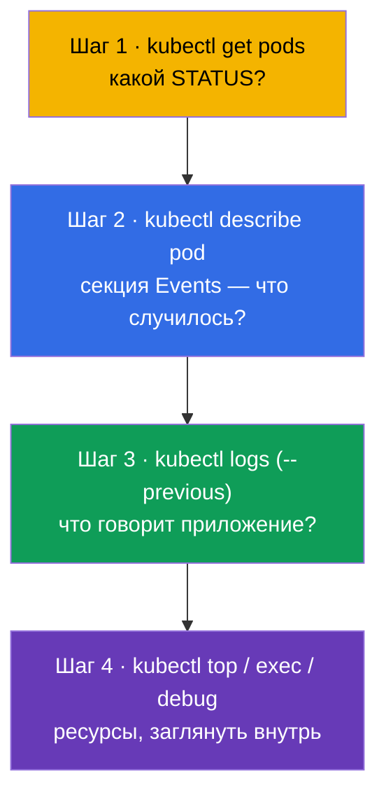
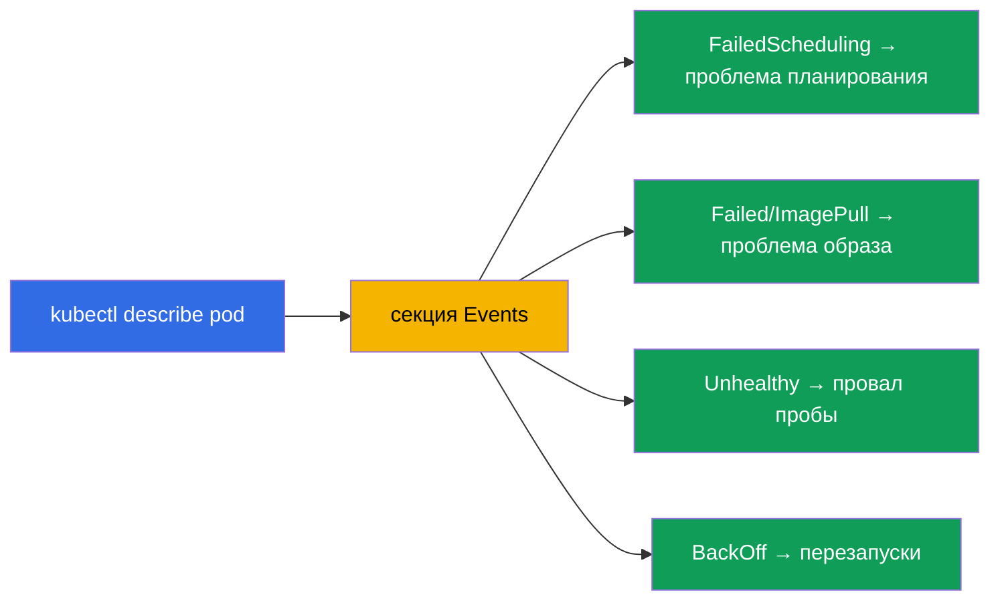
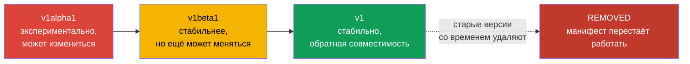
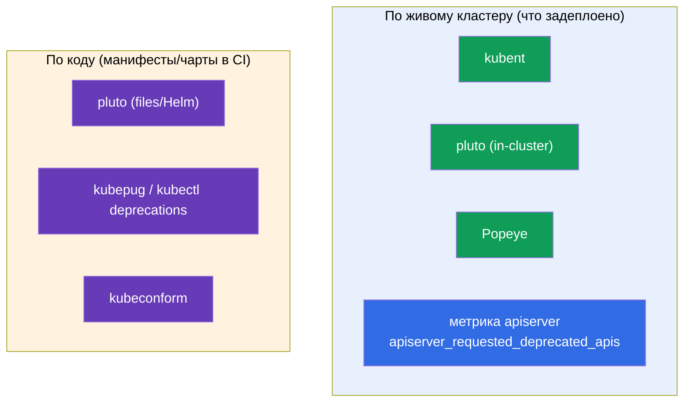

# Глава 29. Отладка приложений и устаревание API

> **Что дальше.** Завершаем часть 6. Соберём воедино навыки отладки уровня приложения
> (глава относится к Observability CKAD и troubleshooting CKA) и разберём отдельную тему -
> **устаревание API (API deprecations)**, которую CKAD выделяет специально. Отладку
> кластера (control plane, ноды, сеть) детально разберём в части 9; здесь фокус на подах и
> приложениях, а также на том, как не сломаться при обновлении версий Kubernetes.

## 29.1. Систематический подход к отладке пода

Хаотичный тык - враг отладки под таймером. Есть чёткий маршрут: от статуса к причине.



STATUS (глава 4) сразу направляет диагностику:

| STATUS | Первое действие |
|--------|-----------------|
| `Pending` | `describe` → Events: нет ресурсов? taint? nodeSelector? PVC не связан? |
| `ImagePullBackOff` | `describe`: имя/тег образа, доступ к реестру, imagePullSecret |
| `CrashLoopBackOff` | `logs --previous`: почему падает при старте |
| `CreateContainerConfigError` | нет ConfigMap/Secret, на который ссылается под |
| `Running`, но не работает | `logs`, `exec`, проверить readiness и Endpoints |
| `OOMKilled` | `describe` (Last State) + `top`: лимит памяти мал |

## 29.2. describe и Events - главный источник причин

`kubectl describe` - самый недооценённый инструмент. Внизу его вывода - секция **Events**
с хронологией: что планировщик, kubelet и контроллеры делали с объектом и где застряли.

```bash
kubectl describe pod <pod>
# ... внизу:
# Events:
#   Warning  FailedScheduling  ...  0/3 nodes are available: insufficient memory
#   Warning  Failed            ...  Error: ImagePullBackOff
```



События хранятся ограниченное время. Посмотреть все события namespace, отсортированные по
времени:

```bash
kubectl get events --sort-by='.lastTimestamp'
kubectl get events --field-selector type=Warning
```

## 29.3. Заглянуть внутрь: exec и port-forward

Когда логи не дают ответа, лезем внутрь.

```bash
# Оболочка внутри контейнера
kubectl exec -it <pod> -- sh
kubectl exec -it <pod> -c <container> -- sh    # конкретный контейнер

# Выполнить одну команду
kubectl exec <pod> -- env                       # переменные окружения
kubectl exec <pod> -- cat /etc/config/app.conf  # проверить смонтированный конфиг
kubectl exec <pod> -- nslookup backend          # проверить DNS изнутри

# Проброс порта на локальную машину — проверить приложение напрямую
kubectl port-forward pod/<pod> 8080:80
kubectl port-forward svc/<service> 8080:80
```

`port-forward` полезен, чтобы обратиться к поду/сервису напрямую в обход Ingress и
проверить, работает ли само приложение (сужает, где проблема - в приложении или в
маршрутизации).

## 29.4. kubectl debug и ephemeral-контейнеры

Проблема: минимальные образы (distroless/scratch - глава 23) не содержат `sh`, `curl`,
`ps` - зайти внутрь через `exec` нечем. Решение - **ephemeral-контейнер** через `kubectl
debug`: временный отладочный контейнер подсаживается в **работающий** под, разделяя его
namespace процессов и сеть, но со своим образом (где есть инструменты).


```bash
# Подсадить отладочный контейнер в работающий под
kubectl debug -it <pod> --image=busybox --target=<container>

# Сделать копию пода для отладки (не трогая оригинал)
kubectl debug <pod> -it --image=busybox --copy-to=<pod>-debug

# Отладка ноды — под с доступом к ФС ноды
kubectl debug node/<node> -it --image=busybox
```

Ephemeral-контейнеры нельзя добавить в манифест заранее - только через `kubectl debug` к
живому поду. Они не перезапускаются и исчезают, когда не нужны. Это правильный способ
отлаживать «тихие» минимальные образы, не пересобирая их.

## 29.5. Устаревание API (API deprecations)

Отдельная тема CKAD. Kubernetes развивается, и версии API-групп меняются: `alpha` → `beta`
→ стабильная (`v1`). Старые версии со временем **удаляют**. Манифест со старой
`apiVersion` после обновления кластера просто перестанет применяться.



Исторические примеры удалённых версий (их любят приводить):

| Было (устарело/удалено) | Стало |
|-------------------------|-------|
| `extensions/v1beta1` Deployment/Ingress | `apps/v1`, `networking.k8s.io/v1` |
| `networking.k8s.io/v1beta1` Ingress | `networking.k8s.io/v1` |
| `policy/v1beta1` PodDisruptionBudget | `policy/v1` |
| `batch/v1beta1` CronJob | `batch/v1` |

## 29.6. Как находить и чинить устаревшие API

```bash
# Проверить, какая версия API актуальна для ресурса
kubectl explain deployment            # покажет текущий apiVersion
kubectl api-versions                  # все доступные версии API в кластере
kubectl api-resources                 # ресурсы и их группы

# Инструменты обнаружения устаревших API в манифестах (в проде)
# kubectl deprecations / pluto / kubent — сканируют манифесты и кластер
```

Порядок действий: перед обновлением кластера проверяют манифесты на устаревшие
`apiVersion`, правят на актуальные (`kubectl explain` подскажет текущую), применяют
заново. Kubernetes при обращении к устаревшему API обычно печатает предупреждение в
выводе `kubectl` - на него стоит обращать внимание.


## 29.7. Open-source инструменты анализа устаревших API

Проверять вручную десятки манифестов и Helm-релизов нереально - для этого есть готовые
open-source инструменты. Они работают в двух местах: по **живому кластеру** (что уже
задеплоено) и по **коду** (манифесты/чарты в репозитории, в CI до выката).



| Инструмент | Что сканирует | Особенность |
|-----------|---------------|-------------|
| **kubent** (kube-no-trouble) | живой кластер + Helm-релизы | простой бинарник, быстрый пред-апгрейд-чек |
| **pluto** (Fairwinds) | кластер, **файлы манифестов**, Helm-чарты/релизы | цель — конкретная версия K8s; коды возврата для CI |
| **kubepug** (Deprecated APIs) | кластер и файлы против **целевой** версии | сверяет с OpenAPI целевой версии; есть как `kubectl deprecations` |
| **kubeconform** | файлы против JSON-схем целевой версии | быстрый валидатор в CI; ловит удалённые kind/версии |
| **Popeye** | живой кластер (санитайзер) | помимо API находит и прочие проблемы гигиены |

```bash
# --- по кластеру ---
kubent                                   # что задеплоено с deprecated/removed API
pluto detect-all-in-cluster
popeye

# --- по коду / в CI (с прицелом на целевую версию) ---
pluto detect-files -d ./manifests/ --target-versions k8s=v1.32.0
kubepug --input-file ./manifests/ --k8s-version v1.32.0
kubectl deprecations --k8s-version v1.32.0     # kubepug как kubectl-плагин
kubeconform -kubernetes-version 1.32.0 ./manifests/
```

Хорошая практика: **и то, и другое** - `kubent`/`pluto` по кластеру перед апгрейдом, и
`pluto`/`kubepug`/`kubeconform` в CI-пайплайне, чтобы устаревший `apiVersion` не доехал до
прода. Дополнительно apiserver отдаёт метрику `apiserver_requested_deprecated_apis` -
по ней вешают алерт в Prometheus (глава 28), чтобы видеть обращения к устаревшим API
заранее.

## 29.8. Как это применяют в продакшене

- **Отладочный маршрут - тот же.** В проде дежурный идёт по тому же пути: STATUS →
  describe/Events → logs → exec/debug. Разница лишь в масштабе (сотни подов) и в том, что
  логи/метрики берут из централизованных систем (глава 28), а не только из `kubectl`.
- **kubectl debug для минимальных образов.** Раз в проде образы минимальные (безопасность),
  ephemeral-контейнеры - основной способ живой отладки без пересборки и без снижения
  безопасности образа.
- **Проверка deprecations перед каждым апгрейдом.** Обновление версии кластера - плановая
  операция, перед которой обязательно сканируют манифесты на удалённые API (pluto/kubent),
  иначе после апгрейда часть ресурсов перестанет применяться (сломается CI/CD, GitOps).
- **CI ловит устаревшие API заранее.** Зрелые команды проверяют манифесты на deprecated
  API прямо в пайплайне, чтобы не выяснять это в момент апгрейда прода.
- **Предупреждения не игнорируют.** Warning об устаревшем API в выводе `kubectl` или в
  CI - сигнал к обновлению манифеста заранее, а не когда версия уже удалена.

## 29.9. Мини-глоссарий

- **Events** - хронология действий с объектом в выводе `describe`/`get events`.
- **exec** - выполнить команду/оболочку внутри контейнера.
- **port-forward** - проброс порта пода/сервиса на локальную машину.
- **ephemeral-контейнер** - временный отладочный контейнер в живом поде (`kubectl debug`).
- **kubectl debug** - подсадить отладочный контейнер / скопировать под / отладить ноду.
- **API deprecation** - объявление версии API устаревшей с последующим удалением.
- **apiVersion** - версия API-группы объекта (alpha/beta/стабильная).
- **pluto / kubent** - инструменты поиска устаревших API в манифестах/кластере.
- **kubepug (kubectl deprecations)** - проверка API против целевой версии K8s (кластер и файлы).
- **kubeconform** - валидатор манифестов по схемам целевой версии (CI).
- **Popeye** - санитайзер кластера, в т.ч. находит устаревшие API.
- **apiserver_requested_deprecated_apis** - метрика обращений к устаревшим API (алерт в Prometheus).

## 29.10. Итоги главы

- Отладка пода идёт по маршруту: STATUS (`get`) → Events (`describe`) → логи (`logs
  --previous`) → ресурсы/внутрь (`top`, `exec`, `debug`).
- `describe` и его секция Events - главный источник причин (планирование, образ, пробы,
  перезапуски); `get events --sort-by` даёт полную картину.
- `exec` и `port-forward` позволяют заглянуть внутрь и проверить приложение напрямую.
- `kubectl debug` с ephemeral-контейнером - способ отладить минимальный образ (без sh),
  живой под или ноду, не пересобирая образ.
- API проходит путь alpha → beta → стабильная; старые версии удаляют, и манифесты с ними
  перестают работать после апгрейда.
- Перед обновлением кластера манифесты проверяют на устаревшие `apiVersion` (kubectl
  explain / api-versions, pluto/kubent) и правят на актуальные.
- Open-source инструменты: по кластеру - kubent, pluto, Popeye; по коду в CI - pluto,
  kubepug (`kubectl deprecations`), kubeconform; плюс метрика apiserver для алертов.

## 29.11. Как это пригодится: на экзамене и в реальной работе

**На экзамене.** «Почини сломанный под/приложение» - ядро troubleshooting (30% CKA) и
Observability (CKAD). Маршрут get→describe→logs→exec решает большинство таких задач.
`kubectl debug` и обновление устаревшего `apiVersion` - конкретные умения, которые
проверяют напрямую (особенно deprecations на CKAD).

**В реальной работе.** Систематическая отладка экономит время при инцидентах, а
ephemeral-контейнеры позволяют держать образы минимальными и всё равно их отлаживать.
Проверка deprecations перед апгрейдом кластера - обязательный шаг, без которого обновление
версии Kubernetes ломает работающие манифесты и конвейеры доставки.

## 29.12. Вопросы для самопроверки

1. Опишите систематический маршрут отладки пода. С чего начинать?
2. Где `describe` показывает причины проблем и что там искать при Pending?
3. Когда `port-forward` помогает локализовать проблему?
4. Зачем нужен `kubectl debug` и чем он выручает при минимальных образах?
5. Какой путь проходит версия API и что происходит со старыми версиями?
6. Как найти актуальную `apiVersion` для ресурса и проверить кластер на устаревшие API?
7. Почему проверка deprecations важна перед обновлением кластера?
8. Какие open-source инструменты сканируют кластер, а какие — код/манифесты в CI? Назовите
   по два и чем они отличаются.

## Практика

На этом часть 6 (наблюдаемость и обслуживание) завершена. Дальше - часть 7: сервисы и сеть,
начиная с сетевой модели Kubernetes и CNI (глава 30). Отладка и работа с ephemeral-
контейнерами отрабатываются в лабах по наблюдаемости и troubleshooting.

🧪 Лаба 01: [tasks/cka/labs/01](../../labs/01/README_RU.MD)

---
[Оглавление](../README_RU.md) · [Глава 28](../28/ru.md) · [Глава 30](../30/ru.md)
